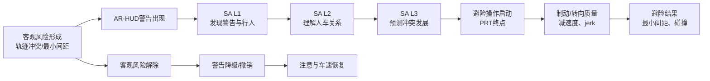

# AR-HUD行人碰撞预警毕业论文大纲与危险出现/解除判断标准文献综述

> **拟定论文题目**：AR-HUD行人碰撞预警的时空参数设计及其对驾驶员情境意识与避险绩效的影响  
> **文档性质**：论文大纲 + 理论模型 + 第一版专题文献综述 + 补充检索计划  
> **结构参考**：[音乐流派对驾驶行为影响的多维分析0520](音乐流派对驾驶行为影响的多维分析0520.pdf)  
> **主要理论依据**：[时间元素设计参数专题分析](时间元素设计参数_专题分析.md)第2.4节“警告时机理论”  
> **本地证据范围**：[summaries](summaries/)与[papers](papers/)中的材料——v1 为 40 篇，**v2 已扩充至 102 篇**（77 篇全文 + 25 篇仅摘要）  
> **版本说明**：本稿先完成“驾驶中危险出现/危险解除判断标准”的综述。文中“建议”“拟采用”属于研究方案，不代表已有文献已经证明其最优。  
> **v2 修订说明（2026-08）**：第一至八节为 v1 内容，全部保留；**第九节**报告补充检索的执行结果、对第四节共识与状态机的实质补充，并处理一个理论问题——本文档的 **PRT 预算主线**与 `优化方案` 的 **相对提前量 $\Delta t$ / BTN 主线**如何合并（见 §9.3）。凡第九节与前八节冲突之处，以第九节为准。

## 一、核心结论概览

| 项目 | 当前结论 |
|---|---|
| 论文主线 | 以“危险何时形成—警告何时出现—驾驶员何时反应—危险何时解除—警告何时撤销”为时间主线，以“警告锁定在哪里—风险如何动态呈现”为空间主线 |
| 核心理论 | PIEV信息加工阶段、Endsley情境意识三级模型与PRT时间预算模型 |
| 时间变量 | **以PRT（perception-response time，感知—反应时间）作为驾驶员侧核心时间变量**；警告时机按PRT分位数或PRT安全余量进行参数化 |
| PRT的边界 | PRT用于衡量驾驶员从警告/危险出现到开始避险操作所需的时间，**不能单独判断客观危险是否已经出现或解除** |
| 危险出现 | 应由目标有效检测、预测轨迹冲突、预测最小间距及到达冲突区域的剩余时间共同判断；横向行人冲突不宜仅依赖TTC |
| 危险解除 | 应由轨迹不再冲突、行人或车辆已通过冲突点、预测最小间距恢复并稳定保持等客观条件判断；驾驶员已看到警告或开始制动不等于危险已经解除 |
| 本地证据（v1 口径） | 40篇材料中，时间参数相关20篇；有具体出现时机数值14篇；严格持续规则7篇；状态驱动撤销/降级6篇；直接比较危险解除规则的研究为0篇 |
| 本地证据（v2 口径） | **102篇**；时间参数直接相关新增12篇、分层与可靠性新增13篇、空间元素新增13篇；**PRT 分位数与三段分解已解决**（#72、#74、#84、#99、#62）；**危险解除仍为0篇人因对照**，但取得 #99 的 2:1 运动学滞环工程先例 |
| 是否需要补充检索 | v1：需要。**v2：第六节计划已执行完毕**；第 5.2 节六项“不足以定论”中第 3 项已解决、第 2 项部分解决，其余四项仍成立；建议对“危险解除/警告撤销”方向发起第二轮定向检索（见 §9.7） |

## 二、论文的核心概念与理论模型

### 2.1 必须区分的三个时间系统

本论文不把“危险出现”“警告出现”和“驾驶员开始反应”视为同一个时点，而是区分三个相互连接的时间系统。

| 时间系统 | 回答的问题 | 主要变量 | 在论文中的作用 |
|---|---|---|---|
| 客观风险时钟 | 人车在物理上是否已经形成冲突，何时真正解除？ | 预测路径交叉、预测最小距离、TTMD、冲突点通过状态；近似共线时可使用TTC | 定义危险状态和系统触发/撤销边界 |
| HMI显示时钟 | AR-HUD何时出现、升级、维持、降级和消失？ | 警告出现时机、显示持续方式、级间间隔、撤销规则 | 构成实验1和实验2的主要操纵 |
| 驾驶员反应时钟 | 驾驶员用了多长时间发现、理解并开始操作？ | PRT及其阶段成分、首次注视时间、松油/制动启动 | 作为时间设计的理论依据和主要结果指标 |

三者的正确关系是：**客观风险时钟定义“有没有危险”，HMI显示时钟决定“什么时候告诉驾驶员”，驾驶员反应时钟检验“所提供的时间是否足够”。**

### 2.2 PRT的操作性定义

本论文将PRT定义为：从预先规定的起始事件到驾驶员开始执行可观察避险操作的时间间隔。

```text
PRT = t（首次有效避险操作启动）− t（警告出现或危险事件出现）
```

为避免不同文献的“反应时”含义混杂，正式实验必须同时报告起点和终点：

- 主要定义：**警告出现 → 首次有效松油或制动启动**。
- 无警告基线：**危险客观出现/行人可见 → 首次有效松油或制动启动**。
- 若制动是规定反应，则另报BRT，但不能把BRT、PRT、首次注视时间和按键报告时间直接合并平均。
- 若被试先松油、后制动，首次有效松油可作为PRT终点，制动启动另作为操作升级指标。

依据PIEV模型，PRT可以进一步拆解为：

1. **Perception（感知）**：警告出现至首次注视警告或危险目标；
2. **Identification（识别）**：首次注视至正确定位危险行人；
3. **Emotion/Evaluation（判断）**：识别后至形成风险判断和动作选择；
4. **Volition（执行启动）**：动作决定至松油、制动或转向开始。

这一路径同时对应Endsley情境意识模型：发现警告和行人为SA L1，理解其与本车路径的关系为SA L2，预测行人是否进入冲突点为SA L3，之后才进入避险执行。

### 2.3 为什么“时间用PRT”不等于“不再使用TTC或TTMD”

PRT是驾驶员侧的反应时间，TTC/TTMD是系统侧的风险时间。若直接规定“PRT达到某值时危险出现”，会产生循环定义：PRT只有在警告或危险出现之后才能被观测，不能在事件发生前独立充当风险触发器。

因此，本论文建议采用“**PRT时间预算**”表达警告时机：

```text
可用反应时间 T_available
    ≥ 参考PRT分位数 PRT_q
    + 操作建立时间 t_manoeuvre
    + 安全裕量 t_margin
```

并定义：

```text
PRT安全余量 M_PRT
    = T_available −（PRT_q + t_manoeuvre）
```

- `M_PRT < 0`：对该PRT分位数覆盖的人群而言，警告时间不足；
- `M_PRT ≈ 0`：接近最低反应预算；
- `M_PRT > 0`：驾驶员有额外的理解、平滑制动或纠错时间；
- 余量过大也不一定更好，可能增加误警、过度反应、习惯化或对系统的依赖。

TTC或TTMD在这一模型中只负责估计`T_available`，论文的理论解释和实验分组则以PRT分位数及PRT安全余量表达。

### 2.4 建议的总理论路径



论文的中心命题可概括为：**AR-HUD时空参数通过改变驾驶员从风险感知、目标定位、风险理解到行为执行的加工效率，进而影响PRT、情境意识与避险绩效；合理的警告出现和撤销规则必须同时服从客观风险状态与驾驶员PRT时间预算。**

## 三、毕业论文建议大纲

### 3.1 与参考论文结构的对应关系

参考论文采用“绪论—文献综述—问题提出—研究内容与框架—分研究/分实验—总讨论—结论”的结构。本论文可沿用这一论证顺序，但将实验章节按四个递进实验分别展开。

| 参考论文的功能 | 本论文对应内容 |
|---|---|
| 研究背景与意义 | AR-HUD行人预警的安全价值、信息显示问题与时空设计需求 |
| 多维文献综述 | 风险判定、PRT与警告时机、情境意识、时间参数、空间参数、避险绩效 |
| 问题提出 | 现有研究对出现时机、持续/撤销、空间锁定和动态风险表达缺少正交验证 |
| 研究内容与预期目标 | 两项研究、四个实验、统一理论模型和指标体系 |
| 分研究/分实验 | 实验1至实验4分别成章，使用统一的目的—方法—结果—讨论结构 |
| 总讨论与展望 | 时空设计规律、机制、边界、应用建议、局限与未来研究 |

### 第一章 绪论

#### 1.1 研究背景

- 城市道路中行人横穿、遮挡出现与多目标干扰的安全问题；
- 传统HUD只提示“有危险”，AR-HUD能够进一步提示“危险对象在哪里、风险如何发展”；
- 现有研究重视图形形式和有无警告，较少系统检验警告出现、持续、撤销及空间动态之间的关系。

#### 1.2 研究问题的提出

- 系统在什么条件下应判定危险已经出现？
- 警告应提前给驾驶员多少PRT预算？
- 驾驶员已经看到警告或开始反应后，显示是否应立即消失？
- 危险已经解除时，应如何降级、渐隐并支持驾驶恢复？
- 空间锁定和风险动态表达能否提高情境意识并改善避险绩效？

#### 1.3 研究目的

1. 建立适用于横向行人冲突的危险出现与解除操作标准；
2. 以PRT为驾驶员侧时间基准，确定单层和分层预警的时间参数；
3. 检验空间参照系及风险演化动态对SA L1—L3的影响；
4. 形成AR-HUD行人碰撞预警的时空设计模型与适用边界。

#### 1.4 理论意义与实践意义

- 理论上连接客观风险状态、PRT、情境意识与避险行为；
- 方法上区分危险解除与显示撤销，补足既有研究只报告出现时机的不足；
- 实践上为AR-HUD警告触发、升级、维持和撤销提供可执行规则。

#### 1.5 研究内容、技术路线与创新点

- 两项研究、四个递进实验；
- 三个时间系统与一个时空耦合模型；
- 行为、眼动、情境意识、安全和认知代价的多层证据链。

### 第二章 文献综述与理论基础

#### 2.1 HUD、AR-HUD与行人碰撞预警的概念边界

- HUD与AR-HUD的区别；
- 屏幕固定、道路锁定、目标锁定和复合锁定；
- 单层、分层与多模态预警。

#### 2.2 驾驶中危险出现与危险解除的判断标准

- 危险对象出现、算法风险形成与HMI警告出现的区别；
- 路径冲突、距离、TTC、TTMD、THW和意图预测标准；
- 危险解除、冲突点通过、驾驶员反应与警告撤销的区别；
- 本论文拟采用的状态机标准。

> 本节的第一版可直接采用本文第四章的综述文本。

#### 2.3 警告时机理论与PRT

- PIEV模型；
- PRT的定义、阶段拆解与分布特征；
- PRT与可用反应时间、安全余量的关系；
- 过早警告、过晚警告与信号检测权衡。

#### 2.4 驾驶员情境意识理论

- SA L1：发现警告与危险目标；
- SA L2：理解行人与本车路径的关系；
- SA L3：预测风险发展和冲突点；
- SA与避险行为之间的联系。

#### 2.5 AR-HUD警告时间参数研究

- 警告出现时机；
- 固定持续与状态维持；
- 分层升级与级间间隔；
- 警告撤销与事件后恢复。

#### 2.6 AR-HUD警告空间参数研究

- 屏幕/视野固定、道路/冲突点锁定、危险目标锁定；
- 静态与动态空间信息；
- 多目标竞争、遮挡、视觉拥挤与注意收窄。

#### 2.7 驾驶员避险绩效的评价

- PRT、松油、制动启动；
- 最大减速度、jerk和制动平顺性；
- 最小预测距离、冲突点余量和碰撞率；
- 事件后速度及注意恢复。

#### 2.8 文献评述与研究缺口

1. 不同研究对“危险出现”的起点定义不一致；
2. 横向行人冲突仍常被简化为TTC阈值，二维轨迹关系报告不足；
3. 出现时机研究多，危险解除和显示撤销研究少；
4. PRT、BRT、首次注视和按键反应经常混用；
5. 几乎没有研究直接比较固定时长、状态维持、渐隐和撤销规则；
6. 时间和空间特征常被同时改变，难以识别独立机制；
7. 缺少从SA L1—L3到避险绩效的完整过程证据。

### 第三章 总体研究设计

#### 3.1 总研究问题与研究假设

- 时间参数如何通过PRT影响避险绩效；
- 空间参数如何通过SA L1—L3影响危险定位和预测；
- 时间与空间信息能否在不增加过度制动和认知负荷的情况下协同改善安全。

#### 3.2 四个实验的递进关系

| 实验 | 核心变量与水平 | 核心回答 | 主要机制指标 |
|---|---|---|---|
| 实验1：单层预警时间参数 | 区块A：PRT预算水平3级——`PRT50`、`PRT85`、`PRT95`对应的可用时间；区块B：显示时长4级——`0.5×PRT_ref`、`1.0×PRT_ref`、`1.5×PRT_ref`、状态维持型 | 单层警告应提供多大的PRT预算，持续和结束方式如何设置 | PRT、警告/行人首次注视、最大减速度、jerk、最小冲突距离 |
| 实验2：分层预警升级 | 预警方案5级——无警告、实验1入选单层、短/中/长三级PRT加工间隔；三级间隔暂按`0.5×`、`1.0×`、`1.5×PRT_PI_ref`定义 | 两级警告是否优于单层，以及L1—L2间应留多少感知识别时间 | 警告→首次注视、首次注视→正确判断、总PRT |
| 实验3：空间参照系 | 5级——Baseline、BD、BR、BW、BW+BR | 警告锁定在哪里最有利于发现、定位和理解危险 | 真实行人TTFF、定位转换成本、SA L1/L2 |
| 实验4：风险演化动态 | 2×2——风险量级映射无/有 × 运动趋势映射无/有 | 连续风险变化如何帮助预测冲突并改善操作 | 路径侵入判断、冲突点误差、SA L3、PRT与避险绩效 |

**水平说明：**`PRT50`、`PRT85`和`PRT95`分别表示预实验或独立基线样本中PRT分布的第50、85和95百分位；`PRT_ref`建议预注册为PRT85；`PRT_PI_ref`是“感知+识别”阶段的参考时间。使用这些分位数是本论文拟检验的设计方案，不是现有文献已经确认的行业阈值。正式秒数应由预实验确定。

现有框架中的5.0、3.0、2.0秒以及0.7、1.0、1.5秒可作为工程对照锚点保存，但正文应先换算为相对于`PRT_ref`的时间预算，再决定是否保留。这样既能与既有文献对话，也能贯彻“时间用PRT”的理论主线。

#### 3.3 统一场景与控制变量

- 城市道路横向行人冲突；
- 包含无遮挡、静态遮挡和动态遮挡；
- 控制车速、行人速度、横穿方向、出现侧、交通密度和环境能见度；
- 加入无危险、误警及不触发警告的填充试次；
- 四个实验保持核心图形、颜色、亮度和显示面积尽可能一致。

#### 3.4 统一指标体系

- 感知：警告TTFF、行人TTFF、漏检率；
- 理解：风险类别判断、目标选择正确率、首次注视后判断时间；
- 预测：路径侵入判断、冲突点估计误差；
- 反应：PRT、松油、制动启动和转向启动；
- 操作：最大减速度、jerk、制动建立时间；
- 安全：最小预测距离、冲突点余量、碰撞率；
- 代价：注视吸附、NASA-TLX/DALI、信任与系统依赖；
- 恢复：撤销后错误加速、再制动、速度和道路注视恢复时间。

#### 3.5 统计分析原则

- 优先采用混合效应模型，将被试与场景设为随机效应；
- PRT采用完整分布或生存分析，不只比较均值；
- 对未反应/碰撞试次避免简单删除；
- 同时报告效应量、置信区间和安全非劣界值；
- 预先规定主要终点、次要终点与多重比较策略。

### 第四章 实验1：单层AR-HUD预警的PRT时间参数设计

#### 4.1 实验目的与假设

- 检验不同PRT预算是否形成过早—适中—过晚的效应曲线；
- 检验固定时长与状态维持型显示的差异；
- 检验警告撤销后是否出现错误加速、二次制动或注意恢复延迟。

#### 4.2 预实验：PRT基线标定

- 在无警告或统一基线警告下测得PRT分布；
- 预先确定PRT起点、终点和有效操作阈值；
- 估计PRT50、PRT85、PRT95及其不确定性；
- 将分位数换算为模拟场景中的触发距离/客观可用时间。

#### 4.3 正式实验设计

- 区块A操纵PRT预算水平；
- 区块B操纵持续/结束方式；
- 两个区块使用独立场景集并平衡顺序，不构成完整3×4全因子。

#### 4.4 被试、装置、刺激与流程

#### 4.5 因变量与数据处理

#### 4.6 结果

#### 4.7 讨论与实验2参数筛选规则

### 第五章 实验2：分层AR-HUD预警的PRT升级规则

#### 5.1 实验目的与假设

- 检验分层预警是否在保证安全余量的同时减少突然强警告造成的急刹；
- 将PRT拆为注意捕获、目标识别、判断和操作启动阶段；
- 确定L1—L2之间所需的感知识别时间。

#### 5.2 实验设计与水平

- 无警告；
- 实验1入选单层方案；
- 短、中、长PRT加工间隔三种分层方案；
- L2的客观风险状态固定，L1相对L2提前出现。

#### 5.3 被试、装置、刺激、流程和指标

#### 5.4 结果

#### 5.5 讨论与研究一小结

### 第六章 实验3：AR-HUD空间参照系与锁定策略

#### 6.1 实验目的与假设

- 比较屏幕固定、道路锁定、危险行人锁定和复合锁定；
- 检验空间锁定主要改善SA L1还是SA L2；
- 评价复合信息是否增加视觉拥挤与认知负荷。

#### 6.2 实验设计与水平

- Baseline、BD、BR、BW、BW+BR五个水平；
- 固定实验1和实验2选定的时间方案。

#### 6.3 被试、装置、刺激、流程和指标

#### 6.4 结果

#### 6.5 讨论

### 第七章 实验4：AR-HUD风险演化动态与时空整合

#### 7.1 实验目的与假设

- 区分风险量级映射与运动趋势映射的独立作用；
- 检验动态空间信息是否改善SA L3；
- 检验空间动态收益是否最终传递到PRT和避险绩效。

#### 7.2 2×2实验设计

- 风险量级映射：无/有；
- 运动趋势映射：无/有；
- 固定前三个实验筛选出的时间和空间基础方案。

#### 7.3 被试、装置、刺激、流程和指标

#### 7.4 结果

#### 7.5 讨论与时空设计模型整合

### 第八章 总讨论、结论与展望

#### 8.1 四个实验的主要发现整合

#### 8.2 PRT时间预算对警告时机设计的解释

#### 8.3 时空参数影响情境意识与避险绩效的机制

#### 8.4 AR-HUD行人碰撞预警设计建议

#### 8.5 理论贡献与方法贡献

#### 8.6 研究局限

- 模拟驾驶与真实道路的外推；
- 短期暴露与长期习惯化；
- PRT的个体、年龄、经验和分心差异；
- 目标检测、注册误差和系统延迟；
- 不同横穿角度、速度和遮挡形式的适用边界。

#### 8.7 未来研究与结论

## 四、可直接用于论文正文的文献综述：驾驶中危险出现与危险解除的判断标准

### 4.1 概念界定：危险事件不是单一时点

驾驶研究中的“危险出现”至少包含四种不同含义：第一，行人从遮挡物后出现、开始移动或进入驾驶员视野，这是环境事件的可见起点；第二，系统通过检测和轨迹预测判断人车运动将形成冲突，这是客观风险状态的起点；第三，预警界面开始显示，这是人机界面的提示起点；第四，驾驶员首次注视、正确识别或开始操作，这是人的感知与反应起点。既有研究有时使用同一个“反应时间”术语连接不同起点和终点，导致结果难以直接比较。因此，危险出现的判断应首先区分环境、算法、显示和驾驶员四个层次。

同理，“危险解除”也不应等同于警告图形消失。物理层面的危险解除指预测路径不再相交、行人已经离开本车冲突区域、车辆已经通过冲突点，或预测最小距离恢复到安全范围；系统层面的解除指风险模型不再满足触发条件；显示层面的解除是警告降级、渐隐或撤销；驾驶员层面的变化则是已经注意、开始减速或完成避险。四个时点可能不一致。特别是，驾驶员开始制动只说明其已经响应，不代表剩余冲突已经消失。

### 4.2 危险出现的主要判断标准

#### 4.2.1 行人可见或开始运动

部分模拟驾驶研究把行人从遮挡物后出现、开始横穿或到达固定路面位置设为危险事件起点。这种方法便于实验控制，也适合测量从真实危险暴露到PRT的时间。然而，“看见行人”并不必然等于“形成碰撞风险”：行人可能位于路边、远离本车路径或朝反方向运动。因此，可见性标准适合作为实验事件起点和无警告条件下PRT的计时起点，不宜单独作为AR-HUD警告触发标准。

例如，[Banerjee等的普通PCW模拟器研究](summaries/39_Banerjee_PCW模拟器实验.md)在车辆越过预设位置后，于约40 m前方呈现横穿行人和弹窗警告。该方法给出了稳定的事件位置，但由于驾驶员可以自由选择车速，40 m不能在所有试次中被解释为固定TTC。类似地，一些研究使用“碰撞前3 s出现行人和警告”的程序化场景，其本质是实验脚本设定，而不是对自然驾驶中危险形成机制的完整识别。

#### 4.2.2 目标检测与路径相交

第二类标准是先检测行人，再判断其预测路径是否与车辆路径相交。[Kim的虚拟阴影研究](summaries/03_2016_Kim_投射阴影EID设计.md)把行人与车辆路径的潜在交叉关系直接可视化：只有可能侵入车辆路径的行人才形成阴影提示，驾驶员减速后，预测冲突位置随之移动；当阴影离开车辆路径时，图形消失。这种做法比“检测到任何行人就高亮”更接近危险的物理含义，也减少了非危险目标对注意资源的竞争。

但路径相交本身仍可能产生过多警告。若交叉发生在很远的未来、预测误差很大，或人车通过冲突点的时间明显错开，仅依据几何交叉会把潜在交叉误判为即时危险。因此，路径相交通常还应与时间窗口、预测最小距离及预测置信度结合。

#### 4.2.3 TTC、距离与THW阈值

本地材料中，给出具体触发数值的研究主要使用TTC、距离或THW。[Kim等](summaries/04_2016_Kim_虚拟阴影HFES.md)设置TTC 2.5 s和5.0 s，[Phan等](summaries/02_2016_Phan_AR提示增强行人感知.md)及后续[Frémont等](summaries/30_2019_Frémont_自适应视觉辅助行人感知系统.md)在临界阶段使用TTC不高于2 s或距离不高于16.6 m，[Chen等](summaries/40_2024_Chen_多目标AR-HUD优先级设计.md)使用3 s内是否进入并发生碰撞来区分黄色与红色警告。另有研究在碰撞前约3 s、TTC低于3 s或TTC 2.5 s时显示警告。

这些研究说明2—5 s是现有实验中常见的显示窗口，但不能据此断言某一固定TTC为通用最优值。首先，多数研究没有在同一人因实验中随机比较多个触发阈值；其次，TTC更适合近似共线、相对速度稳定的冲突。行人横穿属于二维路径相交问题，如果人车尚未进入同一直线，TTC可能不存在、剧烈波动或依赖不合理的速度外推。因此，本论文不把TTC作为核心理论时间变量，只在近似共线或便于与既有研究比较时作为辅助指标。

#### 4.2.4 TTMD与预测最小距离

针对二维横向冲突，更合适的方法是同时计算到达预测最小距离的时间和预测最小距离。[Wang等的ARive研究](summaries/20_2025_Wang_ARive_HoloLens2车内增强现实风险区域检测.md)在预测最小距离小于5 m且TTMD小于5 s时显示风险区，并在TTMD不高于2 s时改变风险区长度。该方法同时回答“多久后最接近”和“届时会有多近”，比单独使用TTC更能表达横穿、并入和斜向相遇风险。

不过，该研究使用车内AR-HMD，场景也不只包含行人横穿；其5 m和5 s阈值不能直接移植为车载AR-HUD的人因最优值。其主要价值在于证明二维风险状态可以由“时间+空间距离”联合定义，并提示过宽的触发窗口可能造成频繁显示和习惯化。

#### 4.2.5 行人意图、预测概率与驾驶员状态

在遮挡场景中，仅依靠车载可见信息可能来不及形成警告，因此V2X或路侧感知研究开始预测行人是否将在未来进入车道。[Kim等的P2CWS研究](summaries/38_2022_Kim_V2X路侧P2CWS.md)使用路侧视觉和姿态信息预测未来1.5 s的过街意图。此类信息可以扩展系统的预见范围，但预测时域不等于警告提前量，算法准确率也不等于驾驶员所需的PRT。

另一类研究把驾驶员状态纳入显示条件。[Frémont等](summaries/30_2019_Frémont_自适应视觉辅助行人感知系统.md)仅在系统判断驾驶员尚未意识到行人时显示自适应提示。这可以降低不必要的显示占用，但研究也暴露出一个关键风险：图形因“驾驶员已经注意”而消失时，驾驶员可能把显示消失理解为“危险已经解除”。因此，驾驶员是否注意适合决定警告强度或是否需要额外吸引注意，不能替代客观风险形成和解除标准。

### 4.3 危险解除与警告结束的主要判断标准

#### 4.3.1 预测路径不再相交

从物理意义上看，最直接的危险解除标准是预测轨迹不再形成冲突。[Kim的虚拟阴影设计](summaries/03_2016_Kim_投射阴影EID设计.md)在驾驶员减速后重新计算冲突关系，图形随预测状态变化，并在阴影离开车辆路径后消失。这种规则把显示撤销与风险机制直接对应，是本地材料中最清楚的轨迹型解除依据。

但真实系统中的轨迹预测存在噪声。如果只要某一帧不相交就立即撤销，图形可能闪烁或在危险仍不确定时提前消失。因此，正式系统还需要连续确认时间、不同的进入/退出阈值或其他滞回机制。当前本地人因材料并未直接比较这些参数。

#### 4.3.2 通过冲突点或行人位置

[边扬等的网联HUD研究](summaries/12_2024_边扬_网联HUD行人过街预警.md)使警告持续到车辆通过行人所在位置，并在通过后结束事件。这一规则明确、易实现，能够避免驾驶员刚开始制动就过早撤销，但也可能使警告在风险已经实际解除后继续占用视野。它更适合用作保守的事件终点或实验控制标准，是否优于基于实时轨迹的提前降级仍需直接比较。

#### 4.3.3 风险指标跨出阈值

如果危险由TTMD、预测最小距离或风险概率进入阈值定义，最自然的解除方式是风险指标跨出退出阈值。需要注意，进入和退出使用完全相同的阈值容易因测量噪声产生反复开关。工程上通常需要滞回：风险进入时使用较严格的触发条件，风险退出时要求更充分的安全距离，并连续保持一段确认时间。现有本地研究能够支持“风险状态驱动”的方向，但尚不能为退出阈值、连续确认时长或渐隐时长提供成熟的人因数值。

#### 4.3.4 驾驶员已经注意或开始反应

驾驶员首次注视警告、按键报告已发现行人、松开油门或开始制动，均可以说明预警已产生作用，但不应直接定义危险解除。[Frémont等](summaries/30_2019_Frémont_自适应视觉辅助行人感知系统.md)的结果表明，基于驾驶员意识状态隐藏图形可能让人误认为风险消失。驾驶员已反应更适合触发“降低视觉强度、停止升级或转换为低干扰状态”，而不是无条件撤销。

#### 4.3.5 固定显示时长结束

本地研究中存在固定3 s、固定动画周期以及较长紧急警告等做法，但这些通常是界面实现参数，不是物理危险解除标准。[叶明慧的AR-HUD研究](summaries/09_2025_叶明慧_AR-HUD图形空间面定位与无意视盲.md)采用固定3 s显示，可为持续时间实验提供工程基线，却不能证明3 s结束时冲突已经解除。固定时长适合实验操纵和短暂提示，但若危险持续时间变化较大，应与客观风险状态联动。

### 4.4 本地证据汇总

| 研究 | 场景/显示 | 危险或警告出现标准 | 持续/解除标准 | 对本论文的意义 | 主要局限 |
|---|---|---|---|---|---|
| [Kim 2018](summaries/01_2018_Kim_AR行人碰撞预警户外停车场实验.md) / [Kim 2016 HFES](summaries/04_2016_Kim_虚拟阴影HFES.md) | 户外停车场AR-HUD | 预设GPS触发；TTC 2.5/5.0 s | 传统警告可维持至停车；未直接比较撤销规则 | 支持早/晚警告和PRT、制动质量测量 | 两篇复用同一实验数据，样本小 |
| [Kim 2016 EID](summaries/03_2016_Kim_投射阴影EID设计.md) | 虚拟阴影 | 预测行人与车辆路径冲突 | 预测阴影离开车辆路径后消失 | 最直接的轨迹型出现/解除逻辑 | 解除参数缺少直接人因对照 |
| [Phan 2016](summaries/02_2016_Phan_AR提示增强行人感知.md) | 边界框+临界面板 | 检测到行人；TTC≤2 s或距离≤16.6 m触发临界提示 | 检测过程内维持，精确退出规则报告不足 | 说明目标检测与临界风险可分层 | 出现与退出规则不对称、撤销证据不足 |
| [Frémont 2019](summaries/30_2019_Frémont_自适应视觉辅助行人感知系统.md) | 驾驶员状态自适应AR | 客观风险+驾驶员尚未感知 | 判定驾驶员已感知后可消失 | 证明驾驶员状态可调节显示 | 消失可能制造“危险已解除”的错误信号 |
| [Ma 2024](summaries/06_2024_Ma_生态界面AR-HUD警示设计.md) | 动态风险地毯 | 风险阶段变化，未给统一TTC | 可随驾驶操作降级、恢复或消失 | 支持状态机和动态降级 | 缺少可复现的数值退出阈值 |
| [边扬 2024](summaries/12_2024_边扬_网联HUD行人过街预警.md) | 遮挡行人、HUD+语音 | 100 m预警，约6 s工程窗口 | 持续至车辆通过行人位置 | 清楚的事件型结束标准 | 模态混杂；结束较保守 |
| [Lubbe 2017](summaries/14_2017_Lubbe_分心驾驶员行人FCW制动反应.md) | HUD/多模态 | 2.5 s视觉阶段，1.8 s强化 | 与事件/刺激时长绑定 | 支持最后窗口需更强干预 | 不专门研究撤销规则 |
| [Winkler 2015](summaries/15_2015_Winkler_HUD预警与驾驶员注视行为.md) | 熟悉HUD符号 | 约1.66 s | 随事件持续 | 提供极晚警告和BRT证据 | 纯视觉改善反应但未显著减少碰撞 |
| [Wang 2025 ARive](summaries/20_2025_Wang_ARive_HoloLens2车内增强现实风险区域检测.md) | AR-HMD二维风险区 | 预测最小距离<5 m且TTMD<5 s | 条件不满足后退出风险显示 | 支持时间+空间联合风险定义 | 非HUD，且未优化退出滞回 |
| [Huo 2025](summaries/21_2025_Huo_Alla_驾驶经验对AR预警依赖度的影响.md) | AR警告故障场景 | TTC 2.5 s | 未明确报告撤销标准 | 提醒评估系统依赖与故障 | 口头报告不等同于真实避险操作 |
| [Kim 2022 P2CWS](summaries/38_2022_Kim_V2X路侧P2CWS.md) | 路侧V2X预测 | 预测未来1.5 s行人过街意图 | 未研究车内显示结束 | 支持遮挡场景的提前感知输入 | 算法预测时域不是PRT或显示阈值 |
| [Banerjee PCW](summaries/39_Banerjee_PCW模拟器实验.md) | 普通屏幕弹窗PCW | 约40 m位置触发 | 未明确报告撤销规则 | 提供松油、制动、jerk和PRT近似指标 | 非HUD；自由车速使TTC不固定 |
| [Chen 2024](summaries/40_2024_Chen_多目标AR-HUD优先级设计.md) | 多目标层级AR-HUD | 3 s内进入/碰撞决定黄或红 | 3 s风险/AOI观察窗口 | 支持多目标风险分级 | 视频任务；不是退出规则比较 |

### 4.5 现有研究可以形成的共识

基于本地40篇材料，可以形成以下相对稳健的判断：

1. **危险出现不是“行人一出现就报警”。**有效判断至少需要区分行人被检测、行人可能进入本车路径以及冲突是否处于需要驾驶员行动的时间范围。
2. **横向行人冲突不宜只使用TTC。**路径相交、预测最小距离和TTMD能够更完整地表达二维冲突；TTC可作为近似共线情况或与既有研究比较的辅助指标。
3. **约2—5 s是现有警告研究常见的工程窗口，但不存在已被证明通用最优的单一秒数。**文献采用某个阈值不等于直接比较后证明其最佳。
4. **警告时机应覆盖驾驶员PRT及后续操纵建立时间。**PRT应报告分布和分位数，不能只用平均值覆盖全部驾驶员。
5. **危险解除、驾驶员响应和警告撤销是三个不同事件。**驾驶员已经看到或开始制动，最多支持警告降级，不足以证明物理风险已经解除。
6. **状态维持型显示比完全固定时长更符合动态风险逻辑，但具体退出阈值和滞回时间缺少直接证据。**
7. **警告突然消失具有语义。**驾驶员可能把消失理解为系统确认安全，因此撤销必须保守、连续且可解释。
8. **评价预警不能只看PRT是否缩短。**更早反应可能伴随过度急刹、更大jerk、注意吸附或系统依赖，必须结合安全、控制质量与恢复指标。

### 4.6 本论文拟采用的危险状态机

以下是基于文献形成的**待验证操作方案**，不是现行行业标准。

> **v2 指针（2026-08）**：本节的定性方案已在 **§9.8** 改写为带完整数值与出处的可实现状态机（BTN 阈值 0.15 / 0.30 / 0.70 / 1.0、退出阈值取进入阈值的 1/2、$t_{conf}$ = 200 ms、三条禁令、与五个实验的对应关系）。**实施时请以 §9.8 为准**，本节保留作为设计思路的记录。

#### 4.6.1 危险出现

只有同时满足下列条件，才进入“客观风险成立”状态：

1. 行人检测和跟踪结果达到最低可信度；
2. 预测行人路径与自车走廊相交，或预测最小间距低于安全边界；
3. 到达最小距离/冲突点的时间进入系统激活窗口；
4. 条件连续成立达到预设确认时间，避免单帧误检；
5. 若驾驶员可用反应时间低于`PRT_q + t_manoeuvre + t_margin`，至少进入明确警告级。

#### 4.6.2 驾驶员已经反应

出现持续松油、有效制动或明确避让转向时，标记“驾驶员响应”，但保持客观风险判断继续运行。驾驶员响应可触发：

- 停止进一步增强警告；
- 降低遮挡和亮度；
- 保留低强度目标/冲突位置提示；
- 继续监测是否需要二次制动。

#### 4.6.3 危险解除

至少满足以下一类客观条件，并连续保持预定确认时间：

- 预测路径不再与自车走廊相交；
- 预测最小间距超过退出安全边界且继续增大；
- 行人和车辆通过冲突点的时间已经错开；
- 行人已完全离开本车道/冲突区，或自车已安全通过冲突点。

危险解除后，显示进入短暂的降级/渐隐状态，而不是从高强度警告瞬间消失。进入阈值、退出阈值、连续确认时间和渐隐时间需要由补充标准检索、预实验和实验1共同定值。

> **v2 更新**：上述四个参数已在 §9.8.2 给出取值与出处（进入 BTN 0.15/0.30/0.70、退出取 1/2、$t_{conf}$ = 200 ms、渐隐 500 ms），但其中**退出侧的全部数值仍无人因证据**，仅有 #99 的工程滞环先例，须由实验 1 区块 B 检验。见 §9.8.6 薄弱环节第 1 条。

### 4.7 本节小结

现有研究已经较充分地说明，危险出现需要目标检测、运动预测和时间余量的联合判断，但危险解除和警告撤销尚未形成与出现时机同等清晰的人因证据。尤其在AR-HUD中，图形消失不仅是界面状态变化，也会向驾驶员传递“系统认为风险已经结束”的含义。因此，本论文应把“客观风险解除—驾驶员已反应—显示撤销”明确拆开，并以PRT分布定义警告应提供的驾驶员时间预算。该处理既能保持风险算法的物理有效性，又能使论文的时间理论真正以人的感知—反应过程为中心。

## 五、本地证据是否足够，以及是否需要补充检索

### 5.1 当前材料已经足以完成的部分

- 建立危险出现和解除的分类框架；
- 说明TTC、TTMD、路径冲突、驾驶员状态和固定时长的差异；
- 证明现有研究“出现时机多、解除规则少”的结构性空白；
- 提出以PRT为驾驶员时间预算、以二维轨迹指标定义客观风险的理论模型；
- 为四个实验形成第一版变量、水平和指标体系。

### 5.2 当前材料不足以最终定论的部分

1. 本地40篇并非为“危险解除标准”进行的系统检索，可能漏掉交通冲突、ADAS状态机和警报撤销研究；
2. 缺少权威标准或测试规程对行人预警激活、抑制和退出条件的定义；
3. PRT基础文献不足，尤其缺少分位数、年龄、分心、预期性及真实道路条件下的证据；
4. 横向行人冲突中TTMD、预测最小距离、PET、冲突点时间等指标尚未系统比较；
5. 几乎没有直接研究“突然撤销—渐隐—降级—持续到通过冲突点”的人因差异；
6. 现有材料中的部分秒数只是研究采用值或二次换算，不能直接作为论文水平的最终依据。

因此，**需要先列计划，再进行有目标的补充检索与全文获取；不建议无边界地爬取大量文献。**

## 六、补充检索与证据更新计划

### 6.1 检索目标

| 优先级 | 目标 | 需要解决的问题 |
|---|---|---|
| P0 | PRT基础与分位数 | PRT应以什么起点/终点定义；PRT50、PRT85、PRT95在不同驾驶条件下如何变化 |
| P0 | 危险解除与警告撤销 | 退出阈值、滞回、连续确认、渐隐和错误安全暗示有何证据 |
| P0 | 标准与测试规程 | 行人碰撞预警、AEB/FCW和HMI警告的激活、抑制、解除是否有明确规定 |
| P1 | 横向冲突替代安全指标 | TTC、TTMD、预测最小距离、PET、冲突点时间分别适合什么场景 |
| P1 | AR-HUD人因时序 | 警告出现、持续、分层升级与PRT/SA/避险绩效的关系 |
| P2 | 个体与场景调节 | 年龄、经验、分心、遮挡、雾天、车速和多目标是否改变PRT预算 |

### 6.2 数据源

- 学术数据库：Web of Science、Scopus、TRID、IEEE Xplore、ScienceDirect、PsycINFO、PubMed/Crossref；
- 标准与测试机构：ISO、SAE、UNECE、Euro NCAP及国内相关标准数据库；
- 追溯方法：纳入研究的参考文献回溯与被引文献前向追踪；
- 全文获取：优先开放获取、学校机构订阅和出版社合法渠道。

具体标准版本可能随时间更新，正式检索时需核对当前有效版本，不在本稿中预设版本号。

### 6.3 建议检索式

#### PRT

```text
("perception-response time" OR "perception reaction time" OR PRT
 OR "brake reaction time" OR BRT)
AND (driver* OR driving)
AND (pedestrian OR collision OR hazard OR warning)
```

#### 危险出现与触发

```text
(pedestrian OR VRU)
AND (collision warning OR forward collision warning OR AR-HUD OR HUD)
AND (activation OR onset OR trigger OR threshold OR warning timing)
AND (TTC OR TTMD OR "minimum distance" OR trajectory OR conflict)
```

#### 危险解除与撤销

```text
(collision warning OR hazard warning OR AR-HUD OR HUD)
AND (clearance OR deactivation OR termination OR dismissal
 OR removal OR offset OR hysteresis OR downgrade)
AND (driver OR pedestrian OR human factors)
```

#### 横向冲突指标

```text
(pedestrian crossing OR lateral conflict OR crossing conflict)
AND (TTMD OR "time to minimum distance" OR "predicted minimum distance"
 OR PET OR "post-encroachment time" OR "conflict point")
```

### 6.4 纳入与排除标准

**纳入：**

- 驾驶员参与的车辆—行人/弱势道路使用者冲突实验；
- 明确报告危险触发、预警出现、持续、撤销或反应时间定义；
- 交通冲突算法或标准文件能够明确说明风险进入/退出条件；
- HUD、AR-HUD、FCW、PCW及与解除机制直接相关的相邻证据。

**排除或降级：**

- 只报告目标检测精度、完全不涉及风险阈值或HMI时序；
- 无法判断反应时间起点和终点；
- 只给概念图、无方法细节；
- 同一数据集的重复发表按一个独立证据簇处理；
- 二次文献中的数值无法回溯至原始研究。

### 6.5 每篇文献的提取字段

| 类别 | 字段 |
|---|---|
| 基本信息 | 作者、年份、题目、来源、DOI、研究类型 |
| 场景 | 行人方向、遮挡、车速、行人速度、道路类型、能见度 |
| 风险进入 | 检测条件、路径条件、距离阈值、时间阈值、连续确认 |
| 显示逻辑 | 出现、升级、持续、降级、撤销、渐隐 |
| 风险退出 | 路径分离、通过冲突点、距离恢复、驾驶员响应、固定计时、滞回 |
| PRT | 起点、终点、均值、中位数、分位数、未反应处理 |
| 结果 | SA、眼动、制动、jerk、最小间距、碰撞、恢复、负荷 |
| 证据质量 | 样本、设计、随机/平衡、场景真实性、统计方法、局限 |

### 6.6 分阶段交付建议

1. **第一阶段：标准和术语校准。**优先确定PRT、危险进入/退出、滞回和行人横向冲突指标的规范定义；
2. **第二阶段：系统检索与去重。**建立检索日志、纳排表和独立证据簇；
3. **第三阶段：全文精读。**重点精读所有给出触发、退出和PRT分布的研究；
4. **第四阶段：更新综述。**把本稿第四章改为带正式参考文献编号的论文正文；
5. **第五阶段：参数转化。**依据PRT分位数和风险退出证据确定实验1预实验范围；
6. **第六阶段：证据审计。**逐项检查“文献采用值”“作者结论”“本论文推断”和“待验证设计”是否被清楚区分。

## 七、下一步最需要确定的研究决策

1. **PRT终点**：建议以首次有效松油为主要终点，制动启动为次级终点；若论文更强调紧急制动，则反过来设置，但全文必须一致。
2. **PRT参考分布**：建议通过独立预实验获得PRT50、PRT85和PRT95，不直接照搬其他研究均值。
3. **危险状态**：横向行人主分析使用预测路径冲突、TTMD与预测最小距离；TTC仅作辅助报告。
4. **危险解除**：不能以“驾驶员已经看见”或“开始制动”作为唯一标准，应保留客观轨迹状态并加入连续确认。
5. **显示撤销**：实验1应明确比较固定时长与状态维持型，并记录撤销后的错误加速、二次制动和恢复。
6. **补充检索**：先完成P0问题，再决定实验秒数；否则5/3/2 s与0.7/1.0/1.5 s只能称为工程候选，不能称为理论水平。

## 八、本地核心资料索引

- [现有毕业论文研究框架](AR-HUD行人碰撞预警_毕业论文研究框架.md)
- [实验1文献与设计依据](实验1_单层时间参数筛选_文献与设计依据.md)
- [实验2文献与设计依据](实验2_分层预警升级规则_文献与设计依据.md)
- [实验3文献与设计依据](实验3_空间参照系与锁定策略_文献与设计依据.md)
- [实验4文献与设计依据](实验4_风险演化动态_文献与设计依据.md)
- [HUD/AR-HUD预警文献证据整理](summaries/HUD_AR-HUD预警文献证据整理.md)
- [时间元素设计参数专题分析](时间元素设计参数_专题分析.md)
- [空间元素设计参数专题分析](空间元素设计参数_专题分析.md)
- [40篇总结目录](summaries/)
- [原始论文目录](papers/)


---

## 九、v2 更新（2026-08）：补充检索的执行结果与理论主线的合并

> 本节是对第五、六节所列"补充检索与证据更新计划"的**执行结果报告**，同时处理一个理论问题：本文档以 **PRT 预算**为时间参数化主线，而 `优化方案_预警时间参数理论化重构与执行计划.md` 与 `实验1` v2 以**相对提前量 $\Delta t$ 与 BTN 触发准则**为主线。两者不是竞争关系，合并方式见 9.3。凡本节与第一至八节冲突之处，**以本节为准**。

### 9.1 补充检索的执行结果

第六节计划的检索已执行完毕，结果如下：

| 项目 | 计划 | 实际结果 |
|---|---|---|
| 文献库规模 | 在 40 篇基础上补充 | **102 篇**（`papers/01–102`）；新增 62 篇 |
| 全文获取 | 优先全文 | **77 篇获得全文 PDF** 并抽取到 `extracted_text/`；**25 篇仅有摘要**（Taylor & Francis / Elsevier / Wiley / SAE / ASCE / IGI / SSRN 硬付费墙） |
| 检索目标一：危险解除/撤销规则 | 系统检索 | **仍为结构性空白**，但取得两条关键新证据（见 9.2） |
| 检索目标二：权威标准与测试规程 | 获取标准文本 | 取得 **SAE J2400（#101）** 的题录与范围声明、**Euro NCAP 2017a 的 FCW 1.7 s 参考值**（经 #84 转引）、**MLIT 停车距离 < 1 m 要求**（经 #102 转引）；J2400 全文未获取 |
| 检索目标三：PRT 基础文献 | 补分位数、年龄、分心、真实道路证据 | **实质推进**：取得 #72 的三段分解、#74 的松油门基线、#84 的模拟器反应时分布与外部基线、#99 的 90 百分位判据（见 9.2A） |
| 检索目标四：横向冲突指标系统比较 | 系统比较 TTMD/最小距离/PET/冲突点时间 | **部分推进**：#90、#92、#93 给出三套不同的二维冲突计算方案，但仍无一篇做指标间的系统比较 |
| 检索目标五：撤销方式的人因对照 | 突然撤销 vs 渐隐 vs 降级 | **仍为 0 篇直接对照**；但 #99 给出了运动学滞环的工程先例（见 9.2B） |

**结论**：第 5.2 节的六项"不足以定论"中，第 3 项（PRT 基础文献不足）已实质解决，第 2 项（权威标准）部分解决，第 1、4、5、6 项仍然成立。

### 9.2 对第四节（危险出现/解除判断标准）的实质补充

#### A. PRT 的分位数与分解：第 5.2 节第 3 项已解决

本文档 §2.2 定义 PRT 但缺少分布证据。新增四篇提供了可直接使用的数值：

| 来源 | 贡献 | 关键数值 |
|---|---|---|
| **#72（Chen 等 2013）** | **PRT 的三段分解** | 反射 **0.44–0.52 s** + 判断 **0.15–0.25 s** + 动作 **0.15–0.40 s** = **0.74–1.17 s**；制动压力建立 $t_p$ = **0.3–0.75 s**；**不可压缩总时延 1.04–1.92 s**；临界 $T_c$ = 1.5 s |
| **#99（Takada 等 2014）** | **PRT 分位数的操作化先例** | 算法内取 $T$ = **1.2 s**（未踩刹车）/ **0.2 s**（已踩刹车）；**1.2 s 的依据是"模拟器实验中全部反应时的 90% 都在该值内"，即 1.21 s = 90 百分位** |
| **#74（Abe & Richardson 2006）** | **无警告条件下的自主反应基线** | 无报警时自主松油门时刻均值 **0.72 s**；早报警使 BRT 由 **1.20 → 0.93 s**（改善 270 ms），晚报警使 BRT 由 **0.95 → 1.07 s**（恶化 120 ms） |
| **#84（Char 2020）** | **200 人模拟器的反应时分布 + 外部基线** | FCW 1.7 s 条件下放油门 **0.8345 s (SD 0.2271)**、踩刹车 **1.17 s (SD 0.2384)**；外部基线（Forkenbrock 2011）：避撞反应 **270–870 ms**、"可能有反应" 330 ms–1 s、"不太可能有反应" 870 ms–1.74 s；Lylykangas 2016 的 BRT ≈ **800 ms** |
| **#62（Winkler 等 2018）** | **PRT 的清洗规则与学习效应** | 反应时下界 **0.2 s**、上界 **2.9 s**（$g=3.0$），按此剔除约 16%、最终纳入 77%；BRT 对照 **1.4 ± 0.1 s** → 预警组 **1.03–1.05 s**；T1 → T2 学习效应 **1.20 → 1.04 s** |

**对 §3.2 的直接影响**：本文档建议 `PRT_ref` 预注册为 **PRT85**。#99 的先例用的是 **90 百分位**（1.21 s）。两者接近但不同。**建议修订为：主分析用 PRT85，并在敏感性分析中报告 PRT90，以便与 #99 直接对话。** 另外 #62 的 0.2–2.9 s 清洗界应直接采用为预注册规则，本文档 §3.5 此前未规定清洗规则。

**一条重要的反直觉证据**：#84 报告 **FCW 触发时机从 TTC 2 s 延后 0.3 s 至 1.7 s 后，制动反应时反而变长**（2 s 条件 0.66–1.28 s；1.7 s 条件 0.93–1.41 s）。这与"时间越紧驾驶员反应越快"的直觉相反，提示 PRT 本身**受可用时间调制**，不是一个固定的个体常数。这一点必须写入 §2.2 的 PRT 操作性定义讨论：**PRT 是条件依赖量，不能跨预警时机条件直接比较。**

#### B. 危险解除与撤销：取得两条工程先例，但人因对照仍为 0 篇

本文档 §4.6.3 指出"进入阈值、退出阈值、连续确认时间和渐隐时间需要由补充标准检索、预实验和实验1共同定值"。新增两条证据给出了工程侧的答案：

| 来源 | 机制 | 数值 |
|---|---|---|
| **#99（Takada 等 2014）** | **运动学滞环**（本库唯一） | 听觉报警**触发 4.0 m/s² / 解除 2.0 m/s²**，即 **2 : 1 滞环**；原文明确说明设计目的是"**避免极短促的报警**" |
| **#102（Coelingh 等 2010）** | AEB 的**复合触发条件** | 介入条件为"驾驶员**未响应** **且** 碰撞约在 **1 s** 之后"；物理上最早可介入约 **1.6 s**；制动系统**纯延迟 180 ms + 减速度斜坡 20 m/s³**，建立 10 m/s² 需约 **0.68 s** |
| **#81（Phan 2016）** | 驾驶员察觉状态的**估计可靠性** | DAP/DUP 分类窗 $T_w$ = **1.5 s**；MGHMM **78.2% TPR@5%FPR**；分类器整体可靠性 **74%**，作者引 Dixon 2007 的 **70%** 作为可用临界 |

**三点对 §4.6 状态机的修订**：

1. **退出阈值取进入阈值的 1/2**（#99 的 2:1 滞环）。这是本文档此前缺失的具体数值，现有明确先例可援引。
2. **"驾驶员已反应"的判定必须报告其可靠性**。#81 的分类器可靠性仅 **74%**，勉强超过 Dixon 2007 的 70% 临界。这意味着 §4.6.2 的"驾驶员响应"状态在真实系统中约有 **1/4 的时间是误判的**。#30（Frémont 2019）"判定驾驶员已感知后让图形消失"的做法因此存在实质风险——本文档 §4.4 已把它标为"消失可能制造危险已解除的错误信号"，#81 的 74% 为这一担忧提供了量化依据。
3. **AEB 的时间窗与 HMI 预警的时间窗几乎不重叠**。#102 的 AEB 介入区间为 **1.0–1.6 s**，而 HMI 预警的常用区间为 **1.7–5.0 s**。因此 AEB 不应被视为"最后一级预警"，而应定位为**预警失败后的独立兜底层**。这一点须写入 §4.6 状态机，作为状态机的终止分支。

#### C. §4.5 共识清单的更新

| 原共识 | v2 处置 |
|---|---|
| 1. 危险出现不是"行人一出现就报警" | **保留**，并补充 #90 的两阶段实现：视觉情境层 $T_{tc}$ = 4.0 s，听觉叠加 2.0 s |
| 2. 横向行人冲突不宜只用 TTC | **保留并强化**，新增三套二维方案：#90 的 $T_p(t)=(X_{ped}-X_{car})/V_{car}$、#92 的双侧到达时间比较、#93 的行人心理安全距离分区 |
| 3. 约 2–5 s 是常见工程窗口，无通用最优秒数 | **实质修订**。#71（Zhang 等 2015）以 7 档梯度（2.5–5.5 s）证明：**2.5 s 与无预警无显著差异（碰撞率 29.4% vs 44.1%），有效下限为 3.0 s，推荐 3.0–4.0 s**。因此"2–5 s"应收窄为"**3.0–4.0 s 为单层唯一预警的推荐区间；2.0–2.5 s 只适合作为分层体系中的临界级**" |
| 4. 警告时机应覆盖 PRT 及操纵建立时间 | **保留并量化**：不可压缩总时延 **1.04–1.92 s**（#72）；制动系统本身还需 **0.68 s** 建立全力减速（#102） |
| 5. 危险解除、驾驶员响应、警告撤销是三个不同事件 | **保留并强化**：#81 的 74% 分类可靠性说明"驾驶员响应"本身是一个**带误差的估计**，不能当作确定事实 |
| 6. 状态维持型更符合动态风险逻辑，但退出阈值缺证据 | **部分解决**：#99 的 2:1 滞环提供了退出阈值先例；但仍无人因对照 |
| 7. 警告突然消失具有语义 | **保留**，无新证据；仍是本课题的核心空白之一 |
| 8. 评价预警不能只看 PRT 是否缩短 | **保留并新增一个维度**：#71 报告最大减速距离的 **SD 由 40.75 m 降至 15.97 m**，即预警的价值也体现在**压缩行为离散度**上。本文档 §3.4 的指标体系应把"主要指标的 SD"列为独立报告项 |
| **9（新增）** | — | **报警时机直接决定信任，且其影响大于绩效改善**（#74：信任 7.3 → 4.3，$F(1,115)=118.32$；alarm time 与信任 $R=-0.46$；长时距下早报警虽未改善 BRT，信任仍达 6.8）。本文档第一至八节完全未涉及信任维度 |
| **10（新增）** | — | **可靠性的行为后果随预警的"行动要求强度"放大**。#82 的 15% 误报 + 15% 漏报对所有因变量**均无显著效应**（其提示提前 11–13 s、不要求立即动作），而 #74 的时机偏差引起强烈信任变化。两者共同界定了一条边界条件 |
| **11（新增）** | — | **系统侧延迟必须报告**。#76（Thammakaroon 等 2012）实测实车 FCW 报警比真实驾驶员制动**晚 1.47 s**；#102 的制动系统纯延迟 180 ms。本课题此前从未把 warning lag 列为测量项 |

### 9.3 理论主线的合并：PRT 预算与相对提前量 $\Delta t$ 的关系

这是本次修订必须解决的核心理论问题。两条主线的定义如下：

- **本文档的主线**：以 **PRT 分位数**定义警告应提供的时间预算。触发时刻满足 $t_{avail} \geq PRT_q + t_{manoeuvre} + t_{margin}$。
- **优化方案与实验1 v2 的主线**：以**相对提前量** $\Delta t = t_0 - t_{warn}$ 为自变量，其中 $t_0$ 为驾驶员在无辅助条件下的自发察觉时刻。

**二者不是竞争关系，而是"三重约束 + 一个零点"模型中的两条不同线**：

| 角色 | 由谁定义 | 回答什么问题 |
|---|---|---|
| **下界**（运动学必要性） | **PRT 预算**：$PRT_q + t_{manoeuvre} + t_{margin}$ | 警告最晚可以到什么时候？晚于此则驾驶员来不及 |
| **零点**（信息增益） | **$t_0$**（自发察觉时刻） | 警告在什么时刻开始才真正提供新信息？早于 $t_0$ 是"告知"，晚于 $t_0$ 是"确认" |
| **窗口**（加工窗口） | **$\Delta t$ 与 SPIDER 各阶段耗时** | 警告应提前多少才恰好覆盖感知—识别窗口？ |
| **上界**（可靠性—信任） | 虚警率与 $t_0$ 的联合约束 | 警告最早可以到什么时候？早于此则被判为虚警，信任下降 |

**因此本文档的修订方式是"扩充"而非"替换"**：

1. §2.2 的 PRT 操作性定义**保留**，并作为**下界**的计算依据。
2. **新增 $t_0$ 作为第二个驾驶员侧时间量**，作为**零点**。§4.2 的"预实验：PRT 基线标定"因此扩充为一个独立的标定实验（见 `实验0_自发察觉基线标定_文献与设计依据.md`），须同时测 PRT 分布与 $t_0$ 分布。
3. §3.2 表格中的自变量水平从"PRT50 / PRT85 / PRT95"改为"$\Delta t \approx 0$ / $+1.0$ / $+2.5$ s"，并在方法中同时报告每个条件对应的 PRT 预算倍数，以保持与本文档 v1 主线的可追溯性。
4. **新增"触发准则类型"为自变量**（固定时间阈值 vs BTN 减速度归一化阈值）。理由：PRT 预算的换算需要把时间预算转成触发距离，而这一换算**依赖车速**；BTN 判据把车速内生化，因此是 PRT 预算思想在运动学上的自然延伸，而非另一套理论。

**#74 的先例证明这一合并是文献支持的**：Abe 与 Richardson 用"驾驶员无报警条件下自主松油门时刻的均值 **0.72 s**"作为判断报警早/晚的操作化阈值——这**正是 $t_0$ 的一种操作化**（$t_0^{throttle}$）。他们同时在算法中使用 SDA 距离判据（含假定反应时 RT = **1.25 s**）——这**正是 PRT 预算**。因此同一篇经典文献里两条主线本来就并存，本课题只是把它们显式分离并各自参数化。

### 9.4 §3.2 四实验核心变量表的 v2 版本

| 实验 | v1 核心变量 | **v2 核心变量** | 核心回答 |
|---|---|---|---|
| **实验0（新增）** | （原 §4.2 的"预实验：PRT 基线标定"） | 车速（40/60）× 遮挡（无/有），**全程无预警**；产出 $t_0$ 分布、PRT 分布、$a_{req}$ 可行域、渲染延迟、方差成分 | 零点与下界的标定 |
| 实验1 | 区块A：PRT 预算 3 级（PRT50/85/95）；区块B：显示时长 4 级 | **触发准则（2：固定时间／BTN）× 相对提前量 $\Delta t$（3：≈0／+1.0／+2.5 s）**；区块B：**持续与撤销策略（3：固定 1.5 s／状态维持／风险耦合衰减）** | 提前量与触发准则的最优组合、撤销条件 |
| 实验2 | 预警方案 5 级（含三级 PRT 加工间隔） | **级间间隔（3：0.7／1.0／1.5 s）× 系统可靠性（2：R100／R80）** + 2 对照；区块C：**强度演化形态（2：阶跃／斜坡）** | 分层是否优于单层、可接受虚警率下的最早预警时刻 |
| 实验3 | 5 级（Baseline／BD／BR／BW／BW+BR） | **锁定策略（5，保留）× 背景视觉复杂度（2：低／高拥挤）**；区块D：**空间映射方向（2：危险侧／逃逸侧）** | 锁定策略的价值是否随背景复杂度放大 |
| 实验4 | 2×2（风险量级映射 × 运动趋势映射） | **量级映射（2）× 趋势映射（2）× 映射函数形态（2：连续／离散四档）**，D0 在两形态下等同故实际 7 条件；区块E：**预测正确性（2：全对／15% 指向错误）** | 动态编码的机制分工与预测误差容忍度 |

**统一的被映射量**：实验 1 的触发准则、实验 4 的视觉编码、实验 2 的滞环阈值全部建立在 **BTN = $a_{req}/a_{max}$** 上，$a_{req} = v_{ego}^2/(2 d_{conflict})$，$d_{conflict}$ 由 TTMD 确定冲突点后计算。这使本文档 §1 的"时间主线 + 空间主线"在最后能收敛为**同一个物理量的两种表达**，而不是两组并列结论。

### 9.5 §3.4 统一指标体系的 v2 补充

在 v1 的八类指标之外，新增四项**必测项**：

1. **$t_0$ 与 $\Delta t$**：每个试次记录三种操作化（$t_0^{gaze}$ / $t_0^{throttle}$ / $t_0^{brake}$），主定义取 $t_0^{gaze}$。
2. **系统渲染延迟（warning lag）**：用外部高速相机（≥ 120 fps）或帧时间戳测"触发指令 → 画面变化"的延迟。依据：#76 实测实车 FCW 滞后 **1.47 s**；本库 102 篇中几乎无一报告该量。
3. **行为离散度（SD）**：所有主指标同时报告均值与 SD，并对 SD 做正式检验（Levene / 贝叶斯方差比）。依据：#71 的最大减速距离 SD **40.75 → 15.97 m**。
4. **信任量表**：采用 #74 的 **10 点单题 + 每次事件后口头评分**，并按其做法做 Z 分数标准化，以便与 $R=-0.46$ 直接对照。

**眼动指标的判定门槛**（v1 完全缺失）：TTFF 最优区间 **100–300 ms**；总注视时长（TDT）最优区间 **500–2000 ms**（≤500 判注意不足、≥2000 判分心）。依据 #69（Zhu 等 2025）。

**PRT 的清洗规则**（v1 未规定）：下界 **0.2 s**、上界 **2.9 s**（$g=3.0$），依据 #62。

### 9.6 §5.2 六项"不足以定论"的现状

| 原条目 | 现状 |
|---|---|
| 1. 本地 40 篇非为"危险解除标准"系统检索 | **仍然成立**。62 篇新增文献中，危险解除仍是最薄的一环；直接对照撤销方式的研究依然 **0 篇** |
| 2. 缺少权威标准对激活/抑制/退出条件的定义 | **部分解决**：取得 SAE J2400（#101）的范围声明——**只适用于追尾场景的乘用车/轻卡/厢式车，不适用于重型卡车，不涉及 ACC 集成**。**因此 J2400 不能直接迁移到行人横穿场景**，这是必须在论文中显式说明的局限。另取得 Euro NCAP 的 FCW 1.7 s 参考值与 MLIT 的停车距离 < 1 m 要求（均经转引） |
| 3. PRT 基础文献不足 | **已解决**，见 9.2A |
| 4. 横向冲突指标未系统比较 | **仍然成立**，但已有三套可比方案（#90、#92、#93） |
| 5. 撤销方式的人因对照 | **仍为 0 篇**；工程侧有 #99 的 2:1 滞环先例 |
| 6. 部分秒数只是研究采用值或二次换算 | **仍然成立，且更严格**：25 篇仅摘要文献的数值**不得作为参数锚点**，只能作为方向性证据。此外 #38 的"1.66 s 最低预算"已确认为二次推论而非原文结论 |

### 9.7 本节引出的新待办

- [x] ~~把 §2.2 的 PRT 操作性定义补充"PRT 是条件依赖量"这一限定~~ **已在 §9.2A 末尾以加粗结论写明：PRT 是条件依赖量，不能跨预警时机条件直接比较**（依据 #84：FCW 由 2 s 延后至 1.7 s 反而使 BRT 变长）。
- [x] ~~把 §4.6 状态机的退出阈值定为进入阈值的 1/2（#99），并新增 AEB 兜底分支（#102 的 1.0–1.6 s 窗口）。~~ **已完成，见 §9.8.2 与 §9.8.3 禁令二。**
- [x] ~~在 §4.6.2"驾驶员已反应"状态旁标注其估计可靠性上限约 74%（#81），并据此规定：该状态只允许触发**降级**，不允许触发**撤销**。~~ **已完成，见 §9.8.3 禁令一。**
- [ ] 取得 SAE J2400 全文，核对其界面要求中哪些条目可类比迁移到行人场景、哪些不可。
- [ ] 取得 #58（SPIDER 2.0）全文，核验五阶段是否严格串行、耗时是否可加——这是"$\Delta t$ = S+I 窗口"与"级间间隔 = S+I"两条推导的共同前提。
- [ ] 第六节的检索计划已执行完毕，但"危险解除"方向应发起**第二轮定向检索**，检索式建议增加：alarm cancellation、warning withdrawal、hysteresis threshold、de-escalation、warning offset 等词。


### 9.8 §4.6 危险状态机的 v2 落地版本

> 本小节兑现 9.7 的前三项待办，把 §4.6 的定性描述改写为**可实现、可预注册、每个数值都有出处**的状态机。凡与 §4.6 冲突之处以本节为准。§4.6 保留作为设计思路的记录。

#### 9.8.1 状态定义与统一风险量

全部状态转移建立在 **BTN**（Brake Threat Number）之上：

$$BTN = \frac{a_{req}}{a_{max}}, \qquad a_{req} = \frac{v_{ego}^2}{2 d_{conflict}}$$

其中 $d_{conflict}$ 为自车到冲突点的纵向距离，冲突点由 TTMD 判据确定（§4.2.4）；$a_{max}$ 取实验 0 实测的舒适减速度上限（而非文献缺省的 3.5–4.0 m/s²，见 `实验0` §2.4.3）。

**为什么用 BTN 而不用 TTC**：同一 TTC 在不同车速下对应的避险难度差别很大（3.0 s 在 40 与 60 km/h 下的 $a_{req}$ 相差 1.5 倍）。#99（Takada 等 2014）已用避撞所需减速度 DCA 作为触发量并给出阈值 4.0 / 2.0 m/s²，是本库唯一的运动学触发先例。BTN 是 DCA 的归一化形式。

| 状态 | 符号 | 进入条件 | 显示 |
|---|---|---|---|
| 空闲 | S0 | 无满足条件的目标 | 无 |
| 监视 | S1 | 目标检测可信度达阈 **且** 预测路径侵入自车走廊 **且** $BTN \geq 0.15$ | 低强度目标锚定（BW 型），不闪烁 |
| 提示（L1） | S2 | $BTN \geq 0.30$ 连续保持 $\geq t_{conf}$ | 黄色，占空比 25% |
| 迫近（L2） | S3 | $BTN \geq 0.70$ 连续保持 $\geq t_{conf}$ | 红色，占空比 50%，Stop 语义 |
| 驾驶员已响应 | S2′/S3′ | 由 S2/S3 叠加：$a_{ego} < -0.075$ g 持续 $\geq 200$ ms | 停止升级、强度降一档，保留目标锚定 |
| AEB 兜底 | S4 | $BTN \geq 1.0$ **且** 未检出驾驶员有效响应 | 交由 AEB；HMI 转为事后告知 |
| 降级/渐隐 | S5 | 见 9.8.3 的退出判据 | 强度线性衰减至 0 |

#### 9.8.2 各数值的出处

| 参数 | 取值 | 出处与理由 |
|---|---|---|
| S1 进入 $BTN$ | **0.15** | 对应 60 km/h 无遮挡下 TTC ≈ 3.2 s（τ 理论 $\dot\theta_{th}=0.003$ rad/s 推算，与 #02 实测 $t_0 \approx 3$ s 吻合），即**恰在驾驶员自发察觉时刻附近**开始监视 |
| S2 进入 $BTN$ | **0.30** | 对应 #71 认定的单层预警有效下限 **3.0 s**（2.5 s 与无预警无显著差异，碰撞率 29.4% vs 44.1%） |
| S3 进入 $BTN$ | **0.70** | 对应 TTMD **2.0 s**，依据 #81 的覆盖人群百分位表（TTC 2.0 s 覆盖 **90%** 驾驶员）+ #78 的 PROSPECT 迫近预警 1.8 s |
| S4 进入 $BTN$ | **1.0** | 定义上即碰撞不可避免边界；#102 证明 AEB 物理最早只能在 TTC **1.6 s** 介入，实际介入于 **≈1 s** |
| 连续确认时间 $t_{conf}$ | **200 ms** | 见 9.8.4 的论证（本库无直接证据，为推导值，须预注册为待验证参数） |
| 驾驶员响应减速阈 | **$-0.075$ g** | #81 的觉察判定减速反应阈 $d_{th} = -0.736$ m/s² |
| 响应持续确认 | **200 ms** | 与 $t_{conf}$ 一致，避免油门抬起抖动误判 |
| 退出阈值 | 进入阈值的 **1/2** | #99 的 **2 : 1 滞环**（触发 4.0 / 解除 2.0 m/s²），原文明确目的是「避免极短促的报警」 |
| 渐隐时长 | **500 ms**（待验证） | 无直接证据。取值下界受 #80 的显示周期 2 s 约束（渐隐不应长于一个闪烁周期的 1/4），上界受「不得延续到风险已解除后仍占用视野」约束 |

#### 9.8.3 退出与撤销规则（本课题最大的证据空白处）

**硬性前提**：本库 102 篇中**直接对照「突然消失 vs 渐隐 vs 降级」的人因研究仍为 0 篇**。因此以下规则是**基于工程先例的推导**，必须在实验 1 区块 B 中作为自变量检验，不得写成结论。

退出需同时满足三条：

1. **风险条件**：$BTN$ 降至该状态进入阈值的 **1/2** 以下（S3 → 0.35、S2 → 0.15），或预测路径不再侵入走廊，或人车通过冲突点的时间已错开；
2. **连续确认**：上述条件连续保持 $\geq t_{conf}$；
3. **单调降级**：不允许从 S3 直接跳到 S0，必须经 S2 → S5 逐级衰减。

**三条禁令**：

- **禁令一：驾驶员响应不得触发撤销，只允许触发降级。** 依据 #81 的驾驶员察觉分类器可靠性仅 **74%**（作者引 Dixon 2007 的 70% 为可用临界），即「驾驶员已注意」这一判断约有 **1/4 时间是误判的**。#30（Frémont 2019）「判定驾驶员已感知后让图形消失」的做法因此存在实质风险。
- **禁令二：AEB 不得被表述为「最后一级预警」。** #102 的 AEB 介入区间为 **1.0–1.6 s**，而 HMI 预警的常用区间为 **1.7–5.0 s**，两者几乎不重叠。AEB 应定位为**预警失败后的独立兜底层**，是状态机的终止分支而非升级终点。
- **禁令三：撤销不得与「危险已解除」共用同一视觉事件。** 由于突然消失本身携带「系统确认安全」的语义（§4.5 共识 7），S5 的衰减必须在视觉上区别于 S1→S0 的正常收尾。

#### 9.8.4 $t_{conf} = 200$ ms 的推导及其不确定性

本库无任何研究报告预警的连续确认时间。该值由三条约束共同界定得出：

- **下界**：须长于单帧误检的时间尺度。#92 的单目视觉方案在 640×360 下工作，典型 30 fps 即 33 ms/帧，200 ms ≈ 6 帧，足以滤除单帧抖动。
- **上界**：须显著短于 PRT 的最小分段。#72 的三段分解中最短一段（判断）为 **0.15–0.25 s**，若 $t_{conf}$ 超过此值，则确认延迟本身就吃掉了一个完整的加工阶段。
- **与制动系统时延的相对量级**：#102 的制动纯延迟为 **180 ms**，200 ms 与之同量级，说明该值在整个信号链中不是主导项。

**因此 200 ms 是一个「可辩护但未经验证」的取值**，必须在预注册中标为待验证参数，并在实验 0 中记录若采用 100 / 200 / 400 ms 会分别导致多少次状态抖动。

#### 9.8.5 状态机与四个实验的对应关系

| 状态机成分 | 由哪个实验检验 | 检验的是什么 |
|---|---|---|
| S1 进入阈值 0.15（$\approx t_0$） | **实验 0** | $t_0$ 的实测分布是否支持 0.15 这一锚点 |
| S2 进入时刻（$\Delta t$） | **实验 1** 主设计 | 提前量的最优值与触发准则类型（固定时间 vs BTN） |
| S5 退出与渐隐 | **实验 1** 区块 B | 固定 1.5 s / 状态维持 / 风险耦合衰减三者对比 |
| S2 → S3 级间间隔 | **实验 2** 主设计 | 0.7 / 1.0 / 1.5 s |
| S2 的虚警承载能力 | **实验 2** 可靠性自变量 | R100 vs R80，虚警只施加在 L1 |
| 阶跃 vs 连续（S2→S3 的形态） | **实验 2** 区块 C | 强度演化形态 |
| 各状态的显示锁定方式 | **实验 3** | BD / BR / BW / BW+BR |
| $BTN$ → 视觉强度的映射函数 | **实验 4** | 连续 vs 离散四档；映射方向须单调上升（#100，$p=0.003$） |
| S2′/S3′ 的仲裁规则 | **实验 2** 因变量 | 取消升级率、错误升级率、错误取消率 |

**这张表是本课题「五个实验不是五个孤立研究」的直接证明**：每个实验检验状态机的一个成分，合起来标定同一个状态机的全部参数。

#### 9.8.6 状态机的已知薄弱环节（须写入学位论文局限）

1. **退出侧的全部数值均无人因证据**：退出阈值取 1/2 来自工程滞环（#99），渐隐 500 ms 与 $t_{conf}$ 200 ms 均为推导值。这是本课题最大的证据缺口。
2. **BTN 的阈值—TTC 对应关系依赖车速与 $a_{max}$**：本节给出的 0.15 / 0.30 / 0.70 与 TTC 3.2 / 3.0 / 2.0 s 的对应仅在特定车速与实测 $a_{max}$ 下成立，跨条件时须重算而非套用。
3. **驾驶员响应检测的 74% 可靠性未在本状态机中显式建模**：本节用「只允许降级」规避了该风险，但未量化误判的行为后果。这需要一个专门操纵检测错误的实验，超出本课题范围。
4. **单目标假设**：本状态机为单行人场景设计。多目标下的优先级仲裁（#40 证明同色等价高亮在新手中可能比无警告更差）未纳入。
