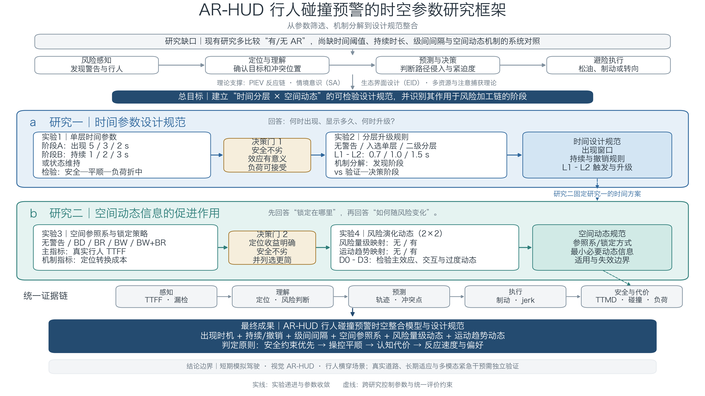
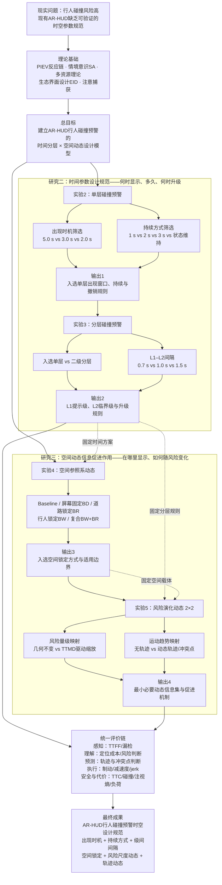
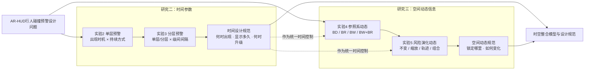

# AR-HUD 行人碰撞预警毕业论文研究框架

> 依据 [时间元素设计参数专题分析](时间元素设计参数_专题分析.md)、[空间元素设计参数专题分析](空间元素设计参数_专题分析.md) 及 [文献证据整理](summaries/HUD_AR-HUD预警文献证据整理.md) 综合设计。
>
> **v2 修订说明（2026-08）**：文献库已由 40 篇扩充至 **102 篇**；实验结构由四实验改为 **一个标定实验（实验 1）+ 四个主实验**；核心时间自变量由绝对 TTC 改为 **相对提前量 $\Delta t$ × 触发准则类型**，被映射的风险量统一为 **BTN**。完整论证见 [优化方案](优化方案_预警时间参数理论化重构与执行计划.md)，各实验的最终设计见 [实验1](实验1_自发察觉基线标定_文献与设计依据.md)、[实验2](实验2_单层时间参数筛选_文献与设计依据.md) §10、[实验3](实验3_分层预警升级规则_文献与设计依据.md) §7、[实验4](实验4_空间参照系与锁定策略_文献与设计依据.md) §8、[实验5](实验5_风险演化动态_文献与设计依据.md) §9。

> **文件性质**：本文件是实验计划与论文论证框架，不是结果报告。文中的参数均为候选水平，只有经过预注册实验、效应量与不确定性分析后，才能称为推荐值。

## 零、论文论证契约

### 0.1 中心论点

本论文拟通过一个标定实验与四个递进主实验，依次完成三项工作：标定驾驶员在无辅助条件下的自发察觉基线（实验 1），分离检验 AR-HUD 行人碰撞预警的呈现时机、持续方式与分层升级规则对四类因变量构念的影响，以及检验空间参照系与风险演化编码对驾驶员情境意识各层级的作用路径；最终整合为具有明确证据边界的时空参数设计规范。

### 0.2 核心贡献、证据与边界

| 论证要素 | 本论文的处理方式 |
|---|---|
| 研究缺口 | 既有研究多以「AR 有无」或单一图形方案为对照，缺少时间参数、级间间隔与空间动态编码的正交检验 |
| 核心推进 | 将研究问题分解为呈现时机、升级规则、空间锚定与动态编码四个可检验环节，并统一以运动学量表达参数 |
| 决定性证据 | 实验 1 标定的 $t_0$／PRT／$a_{req}$ 可行域，加上四个主实验的行为、眼动、安全和认知代价指标，以及实验间参数固定形成的递进验证 |
| 结论边界 | 短期模拟驾驶、视觉 AR-HUD、城市道路行人横穿；不直接外推到真实道路长期使用或最后时刻的多模态干预 |
| 设计原则 | 不评选单一最优条件；仅在安全绩效非劣且收益具有实际意义时予以推荐，判定相当时取实现更简单、侵入性更低的方案 |

### 0.3 术语表

| 规范术语 | 首次定义与全文用法 |
|---|---|
| AR-HUD | 增强现实抬头显示（augmented-reality head-up display, AR-HUD） |
| PCW | 行人碰撞预警（pedestrian collision warning, PCW） |
| TTC | 碰撞时间（time-to-collision）；适合近似共线冲突 |
| TTMD | 到达最小距离的时间（time to minimum distance）；本文固定采用此定义，以避免与“最大减速度所需时间”的同名缩写混淆，并将其作为二维车—人相交场景的主要时间风险指标 |
| TTFF | 首次注视时间（time to first fixation）；必须注明目标是“警告图形”还是“真实行人” |
| AOI | 兴趣区（area of interest）；对移动行人和 AR 图形使用动态 AOI |
| L1 / L2 | L1 为提示级，L2 为临界级；全文不与“一级/二级风险”混用 |
| BD | 基于驾驶员视野（based on driver's view）：屏幕/视线固定 |
| BR | 基于道路信息（based on road information）：道路或冲突点锁定 |
| BW | 基于警告目标（based on warning information）：跟随危险行人的目标锁定 |
| jerk | 加速度变化率，用于表征制动平顺性；全文保留英文小写形式 |
| $a_{req}$ | 避险所需减速度（required deceleration）；$a_{req} = v_{ego}^2 / (2 d_{conflict})$ |
| DCA | 避险减速度（deceleration for collision avoidance）；Takada 等（2014）提出的 $a_{req}$ 同族指标 |
| BTN / STN | 制动威胁数 / 转向威胁数（brake / steer threat number）；$BTN = a_{req}/a_{max}$，本文的**推荐触发量** |
| $t_0$ | 无 AR 辅助条件下驾驶员对危险行人的**自发察觉时刻**（以距冲突点的剩余时间表示） |
| $\Delta t$ | **相对提前量**（relative lead time）；$\Delta t = t_0 - t_{warn}$，本文实验 2 的核心自变量 |
| $t_{LPB}$ | 最晚制动点（last point to brake） |
| SPIDER | Scanning–Predicting–Identifying–Deciding–Executing Responses；由 Strayer 与 Fisher（2016）在 *Human Factors* 提出，Strayer 与 McDonnell（2025）在 *Annual Review of Vision Science* 更新为 SPIDER 2.0。本文的主注意理论框架，**仅用于组织可测阶段与因变量，不用于推导阶段耗时**（限定见 §14.1、§14.2） |
| PPV | 正预测值（positive predictive value）；系统报警时确实会发生冲突的条件概率 |
| warning lag | 系统侧延迟：从触发条件满足到警告实际呈现的时间 |
| AFT | 加速失效时间模型（accelerated failure time）；用于处理右偏且含截尾的反应时数据 |
| τ（tau） | 光学膨胀比 $\theta / \dot\theta$（Lee, 1976）；驾驶员感知碰撞迫近性的基本知觉变量 |

## 一、建议的论文题目

**AR-HUD 行人碰撞预警的时空参数设计及其对驾驶员情境意识与避险绩效的影响**

备选题目：

1. **AR-HUD 行人碰撞预警的时间分层与空间动态编码研究**
2. **面向行人碰撞风险的 AR-HUD 时空信息设计规范研究**
3. **AR-HUD 行人碰撞预警的时序优化与动态空间信息促进机制**

## 二、研究目标与研究问题

### 2.1 总目标

以驾驶员**情境意识模型**与**注意加工阶段理论**为理论基础，探索情境特异的 AR-HUD 行人碰撞预警**时空参数**与驾驶员**安全绩效、认知负荷、情境意识及用户体验**四类构念之间的关系，建立以自发察觉时刻为零点的参数化基准，**输出兼顾安全阈限与用户心理需求的 AR-HUD 行人预警时空参数设计标准**。

总目标含两处限定语：「情境特异」指参数取值随场景条件而异，不追求单一通用取值；「兼顾安全阈限与用户心理需求」指输出物须同时通过安全非劣判定与主观可接受性判定。

### 2.2 四项分目标

| 编号 | 分目标 | 探索的关系 | 输出的成果 | 对应 |
|---|---|---|---|---|
| **O1** | 参数化基准的标定 | 无预警辅助条件下驾驶员自发风险察觉的时间特征，及其受行车速度与视线遮挡的调节 | 以自发察觉时刻为零点的参数化基准、感知反应时分位数分布、运动学下界 | RQ1；实验 1 |
| **O2** | 时间参数的标定 | 相对提前量、触发准则类型、持续与撤销策略、分层级间间隔与系统可靠性对四类构念的影响机制与作用边界 | 各时间参数的适宜取值区间及其**运动学表达式** | RQ2；实验 2–3 |
| **O3** | 空间参数的标定 | 空间参照系与风险动态映射对危险定位效率、注意资源分配及情境意识三阶段的作用路径，及该路径是否受**背景视觉复杂度**与**次任务负荷**调节 | 锁定策略推荐序、动态编码规则；**位置增益与共形增益的分离估计**；推荐序**可否跨负荷水平迁移**的判据 | RQ3；实验 4–5 |
| **O4** | 关系模型与标准整合 | 「时空参数 → 情境意识 → 安全绩效与用户体验」的路径关系 | 可跨行车速度迁移、与量产显示视场及自动紧急制动时序对齐的设计标准及其适用边界 | 整合章 |

O2 输出物中的「运动学表达式」为一项刻意的形式约束：输出不取若干秒数，而取以制动威胁数等运动学量表达的关系式，从而可跨行车速度迁移。O4 不引入新的实验操纵，仅以 O1–O3 的实测参数为输入。

四项目标间存在严格的依赖关系：O1 的产出（$t_0$ 分布、PRT 分位数、实测舒适减速度、方差成分）构成 O2 的自变量换算基准与样本量估计输入；O2 的入选时间参数组合构成 O3 的固定条件。该依赖关系即第七节所述五个实验递进而非并列的理由。

### 2.3 三个研究问题

- **RQ1　参数化基准。** 在无预警辅助的基线条件下，驾驶员对横穿行人的**自发察觉时刻**（$t_0$）与**感知反应时**（PRT）的分布特征如何？二者如何受**行车速度**与**视线遮挡**两项情境因素的调节？　→ 实验 1
- **RQ2　时间参数。** AR-HUD 行人预警的时间参数——相对提前量 $\Delta t$、触发准则类型、持续与撤销策略、分层级间间隔与系统可靠性——如何影响驾驶员的**安全绩效、认知负荷、情境意识与用户体验**？各参数的适宜取值区间为何？　→ 实验 2、实验 3
- **RQ3　空间参数。** 预警图形的**空间参照系**与**风险动态映射**如何影响危险定位效率、注意资源分配与情境意识各阶段的达成？其中「动态」经分解为**风险量级空间映射**与**运动趋势空间映射**两个正交维度后，各维度的作用路径与协同性如何？上述作用是否随**背景视觉复杂度**与**次任务负荷**变化？　→ 实验 4、实验 5

三个问题的递进次序由**变量间的依赖关系**强制，不可对调：RQ2 的自变量 $\Delta t$ 以 RQ1 实测的 $t_0$ 为零点；RQ3 的比较须在 RQ2 入选的时间参数组合上进行。

### 2.4 四类因变量构念及其操作化

因变量归入四类构念，其中**情境意识单列**而不并入认知负荷。

| 构念 | 测量指标 |
|---|---|
| **安全绩效**（safety performance） | 最小 TTC / TTMD、最小冲突距离、碰撞率、PET、峰值减速度、制动反应时、jerk |
| **认知负荷**（cognitive workload） | NASA-TLX 或 DALI、瞳孔直径变化率、注视熵 $H_s$/$H_t$、次任务绩效衰减 |
| **情境意识**（situation awareness） | 冻结探测法按**感知／理解／预测**三阶段分别计分；**危险漏检率**（并列主要因变量）、TTFF、目标验证时间、预期性注视比例、路径侵入预测正确率 |
| **用户体验**（user experience） | 信任量表、UEQ-S、可接受度、侵入性评分、晕动与不适自评 |

**须与自变量区分**：实验 4 区块 F 所操纵的**次任务负荷**（secondary-task load）是可操纵的外生情境变量，而此处的**认知负荷**是作为结果的因变量构念；二者分属自变量层与因变量层，本研究在术语上严格区分，不混用。区块 F 中负荷类指标兼作操纵检查量，其报告规则见 §6.1。

情境意识不并入认知负荷的依据：二者在既有证据中**可解离**——存在主观负荷下降而危险漏检率上升的条件（注意隧道与无意视盲）。若合并计量将掩盖该权衡结构，故**漏检率提升为与安全绩效并列的主要因变量**，且眼动指标一律按**区间判定**而非单调假设解释。

## 三、核心理论模型

> **版本说明**：2026 年 8 月修订。原"四阶段风险加工链"（对应 PIEV 与 Endsley SA）保留在 3.3，作为本节新框架的上位背景；新增 3.1 的三重约束模型与 3.2 的 SPIDER 分解，使时间参数的取值可以从理论**导出**而非从文献**枚举**。理论依据详见 `时间元素设计参数_专题分析.md` 第 2.3.9–2.3.11、2.4.3–2.4.6 与 3.7–3.8 节。

### 3.1 预警时刻的三重约束模型

预警呈现时刻 $t_{warn}$ 不是一个待搜索的自由参数，而是由三条约束共同界定、并以自发察觉时刻 $t_0$ 为零点的量。

```
                      时间轴（距冲突点的剩余时间，右侧更紧急）
   ─────────────────────────────────────────────────────────────────▶
   │            │                    │              │            │
  t_pred      t_warn              t₀（自发察觉）   t_LPB       冲突
   │            │                    │              │
   │◀── 上界 ───▶│                    │              │
   │  可靠性—信任 │                    │              │
   │            │◀── 相对提前量 Δt ──▶│              │
   │            │                    │◀── 下界 ────▶│
   │            │                    │   运动学必要性 │
   │            │◀───── 窗口：SPIDER 五阶段加工 ───────▶│
```

| 约束线 | 数学表述 | 决定因素 | 本论文如何确定 |
|---|---|---|---|
| **下界**：运动学必要性 | $t_{warn} \ge PRT_{p95} + v_{ego}/a_{comf} + \delta_{brake}$ | 车辆动力学 + 驾驶员反应时 | 实验 1 测 PRT 分布；由车速与 $a_{comf}$ 算出 |
| **上界**：可靠性—信任 | $t_{warn} \le t_{pred}(PPV \ge \pi^{*})$ | 行人意图预测精度 + 可接受虚警率 | 实验 3 操纵系统可靠性直接检验 |
| **窗口**：认知加工 | $\Delta t \ge \sum \text{SPIDER}$，**本研究估计** 0.9–1.2 s（非 SPIDER 原文参数，见 §14.2） | 驾驶员的注意与决策耗时 | 实验 2 以 $\Delta t$ 为自变量直接检验 |
| **零点**：自发察觉基线 | $t_0$ | 场景可见性 + 个体差异 | 实验 1 实测；τ 理论给出下限校验 |

三条约束的交集即**可行设计区间**。本论文的贡献之一即在于首次把这一区间实测出来，而不是引用其他研究在别的车速下报告的秒数。

### 3.2 SPIDER 分解：把时间参数映射到可测的注意阶段

采用 Strayer 与 McDonnell（2025）的 SPIDER 框架作为主注意理论。它把安全驾驶所需的注意过程分解为五个成分，每个成分都有本论文可测的代理指标：

| 成分 | 含义 | 代理指标 | 经验耗时（本库证据） |
|---|---|---|---|
| **S**canning | 扫视环境、发现异常 | TTFF（警告图形）、TTFF（真实行人）、道路注视比例 | 617 ms（动态跟随 BW，#08）；1051 ms（分级警告，#40） |
| **P**redicting | 预测行人是否进入本车路径 | 路径侵入预测正确率、冲突点空间误差 | 论文未明确报告 |
| **I**dentifying | 在真实场景中确认目标 | 目标验证时间 = TTFF(行人) − TTFF(警告)、警告漏检率 | 估 300–600 ms（由 TTFF 差值推算） |
| **D**eciding | 决定制动或转向 | 首次注视行人 → 松油时间、风险等级判断正确率 | 论文未明确报告 |
| **E**xecuting | 执行动作 | 制动启动时间、峰值减速度、jerk | 800 ms（SD 290 ms，分心 + 多模态预警，#14） |

**相对 PIEV 的改进**：PIEV 的 Emotion 阶段无法操作化；SPIDER 用 Predicting 与 Deciding 替代，两者都有成熟代理指标，且 SPIDER 本身是围绕分心构建的，能同时容纳"AR 帮助注意"与"AR 造成注意隧道"两种效应。

> **⚠ 可信度限定（2026-08 新增，必读）**：下述 $S+I \approx 0.9$–1.2 s 是**本研究的推导值，不是 SPIDER 原文报告的参数**。SPIDER 的两篇原文（Strayer & Fisher, 2016；Strayer & McDonnell, 2025）**均未报告任何阶段耗时，也未声明五阶段严格串行**——SPIDER 是一个助记性框架（mnemonic），不是可计算的过程模型。上表中 S 阶段的 617 ms 取自 Wu et al. (2024) 的实测 TTFF，I 阶段的 300–600 ms 是**本课题由 TTFF 差值自行估计**（原文未报告）。因此 P1／P2 与 H1／H4 应表述为「本研究基于 SPIDER 的阶段划分所建立的工作假设」，**不得**写成「SPIDER 框架指出 S+I 约需 0.9–1.2 s」。1.0 s 这一水平的独立工程依据（Daimler 级联的 1.0 s 级间、Suzuki 等的 1.0 s 档距）应前置，理论推导应后置。完整论证见 §14.2。

**由 SPIDER 的阶段划分导出的两条可否证预测**（进入 §十 假设表；数值来源与限定见 §14.2）：

- **P1**：最小有效提前量 $\Delta t_{\min} \approx S + I \approx 0.9\text{–}1.2$ s。若 $\Delta t < 0.9$ s，预警只能压缩 E 阶段，因此预期峰值减速度与 jerk 上升而碰撞率不降。
- **P2**：分层预警的级间间隔应等于 S + I 的经验耗时，即 L1 承担 Scanning 与 Predicting、L2 承担 Deciding 与 Executing。故 **1.0 s 为理论中心值**，0.7 s 与 1.5 s 分别是"少一个加工阶段"与"多一个加工阶段"的对照。这为 Lubbe（2017）孤证式的 0.7 s 提供了理论定位：它偏小，可能使两级警告在知觉上融合为单一刺激。

### 3.3 上位背景：四阶段风险加工链（2026 修订前版本，保留）

本论文将驾驶员的风险加工过程划分为四个连续阶段：

1. **风险感知**：发现警告或行人，对应 PIEV 的 Perception、Endsley SA 的 L1。
2. **目标定位与风险理解**：确认危险来自哪里、是否会进入本车路径，对应 PIEV 的 Identification、SA 的 L2。
3. **风险预测与决策**：判断危险如何发展、是否需要制动或转向，对应 PIEV 的 Emotion/Projection。
4. **避险执行**：松油、制动或转向，对应 PIEV 的 Volition。

时间设计主要决定驾驶员是否拥有足够的加工窗口；空间动态设计主要决定该窗口内的定位与预测效率。二者共同作用于最终避险绩效。该四阶段与 3.2 的 SPIDER 五成分的对应关系为：风险感知 ↔ S；目标定位与风险理解 ↔ I；风险预测与决策 ↔ P + D；避险执行 ↔ E。


## 四、总体研究结构与证据递进

> **版本说明**：2026 年 8 月修订。相较修订前的四实验结构，本版新增**实验 1（基线标定）**，并把实验 2 的自变量由"绝对 TTC 出现时机"改为"**相对提前量 $\Delta t$ × 触发准则类型**"，把实验 3 新增"**系统可靠性**"维度。修订理由见 §四之附注与 `优化方案_预警时间参数理论化重构与执行计划.md`。

| 研究 | 实验 | 核心问题 | 核心变量及水平 | 主要机制指标（SPIDER 阶段） |
|---|---|---|---|---|
| 研究一：基线标定 | **实验1：无预警基线**（新增） | 驾驶员自己什么时候发现行人？反应多快？ | 车速（40/60 km/h）× 遮挡（无/有），**无 AR 预警** | $t_0$ 分布、PRT 分布、$a_{req}$ 轨迹、系统渲染延迟 |
| 研究二：时间参数设计规范 | 实验2：单层碰撞预警 | 预警相对驾驶员自发察觉应提前多少？触发准则用时间还是减速度？ | **主设计**：触发准则（固定时间阈值 / BTN）× 相对提前量 $\Delta t$（0 / +1.0 / +2.5 s）= 2×3；<br>**区块B**：持续与撤销策略 3 水平（固定 1.5 s / 状态维持 / 风险耦合衰减） | S：TTFF（警告）、TTFF（行人）；<br>E：制动启动、峰值减速度、jerk；<br>安全：最小 TTMD |
| | 实验3：分层碰撞预警 | 两级警告何时升级？系统可靠性如何调节？ | 级间间隔（0.7 / 1.0 / 1.5 s）× 系统可靠性（100% / 80%）= 3×2，另加"无警告基线"与"实验2入选单层方案"两对照 | S：警告→首次注视；<br>I+D：首次注视→正确反应；<br>信任量表、L1 依从率 |
| 研究三：空间动态信息促进作用 | 实验4：空间参照系与锁定策略 | 警告应锁定屏幕、道路、行人还是复合对象？ | **主设计**：锁定策略 5 水平（Baseline、BD、BR、BW、BW+BR）× 背景视觉复杂度 2 水平（低拥挤／高拥挤）= 5×2；<br>**区块C**：锁定策略 2 水平（BD／BW）× 次任务负荷 2 水平（纯音乐／意图诱导型听觉问答）（时间方案固定为实验2–3入选组合） | S：真实行人 TTFF；<br>I：定位转换成本 |
| | 实验5：风险演化动态 | 哪一种连续变化帮助理解风险？ | 2×2 被试内：风险量级空间映射（无/有，**映射量统一为 BTN**）× 运动趋势空间映射（无/有），形成 D0、D1、D2、D3 | P：路径侵入预测；<br>P：冲突点误差 |

**表注**：核心变量指每个实验主动操纵的自变量及其取值。主要机制指标不是核心自变量，也不是全部结果指标，而是用于判断实验操纵通过 SPIDER 哪个阶段发挥作用的过程性因变量（阶段定义见 §3.2）。$\Delta t$ 为相对提前量（= 自发察觉时刻 − 预警时刻），由实验 1 标定；BTN 为制动威胁数（= 避险所需减速度 / 最大可用减速度）；TTFF 为首次注视时间；TTMD 为到达预测最小距离的时间。

**为什么必须先做实验 1**：若不测 $t_0$，则实验 2 的三个水平只能写成绝对 TTC，而绝对 TTC 在 40 km/h 与 60 km/h 下对应完全不同的运动学难度与信息增益。这正是既有文献结论互相冲突的方法学根源——Kang 等（2016，#70）发现 TTC 4 s 优于 2 s，而 Kim 等（2018，#01）发现 TTC 5.0 s 条件下峰值减速度反而上升 34.46%。两者车速（未报告 vs 24 km/h）与模态（听觉 vs 视觉符号）都不同，无法直接比较。用 $\Delta t$ 归一化后，这一冲突才可能被解释。

**为什么实验 3 必须加入系统可靠性**：预警提前量的上界由预测可靠性决定（§3.1 上界）。若不操纵可靠性，实验只能回答"在完美系统下的最优提前量"，而这在工程上不可实现。本库证据显示：A-TTC（#73，2026 正式版）在 3,519 条视频核验的自然驾驶 FCW 事件上，经动态阈值标定后**事件级骚扰报警占比为 13.74%**（威胁事件召回 89.25%），这是工程上可达的骚扰水平。**该文正式版未报告固定阈值的骚扰报警基线**（其 SSRN 预印本曾报 25.16%，正式版已删除），故本课题不能据此断言真实系统的虚警率水平——20% 这一操纵值的主要依据改为 #78 的最低操纵档（20%）与 #82 的 15% 已证零效应，见 §实验 3。

研究三固定采用研究二按预设决策规则选定的时间方案，使空间实验不再被警告时机差异混淆。实验 5 再固定实验 4 按同一规则选定的空间参照系，形成逐层收敛的研究链条。实验 5 的风险量映射统一采用 BTN，使时间侧与空间侧建立在同一物理量上，便于最终整合为单一时空设计模型。


## 五、研究二：AR-HUD 行人碰撞预警的时间参数设计规范

### 5.1 实验2：单层碰撞预警的时间参数筛选

#### 研究问题

> **版本说明**：2026 年 8 月修订。核心变化是把自变量从"绝对 TTC 出现时机"改为"**相对提前量 $\Delta t$ × 触发准则类型**"。修订前的版本保留在本节末尾"附：2026 修订前的设计"，以便追溯。

- 单层 AR-HUD 警告相对驾驶员的**自发察觉时刻**应提前多少（$\Delta t$）？是否存在最小有效提前量？
- 触发准则应采用固定时间阈值（TTC/TTMD）还是减速度归一化阈值（BTN）？后者能否让效应在不同车速下保持一致？
- 警告应短暂呈现、持续到风险解除，还是随风险强度连续衰减？
- 过早警告是否造成习惯化或过度制动，过晚警告是否造成急刹？

#### 前置条件：实验 1 的标定结果

实验 2 依赖实验 1 提供的三项标定值：

1. **$t_0$**（自发察觉时刻）的被试内与被试间分布，用于把 $\Delta t$ 换算为每个条件的实际触发时刻；
2. **$PRT_{p95}$**，用于确定运动学下界，保证最紧迫的条件仍在"可避险区"内；
3. **系统渲染延迟**，用于校正所有时间戳。

#### 推荐刺激

采用**视觉属性恒定的行人锁定边界框**作为最小 AR-HUD 基线：固定颜色、尺寸、透明度和线宽，仅跟随行人位置，不提供轨迹、风险区缩放或颜色渐变。这样可以尽量把实验效应归因于时间参数。区块 B 的"风险耦合衰减"条件例外，其强度随 BTN 变化，这是该条件的操纵内容本身。

#### 推荐设计：主设计（2×3）+ 独立区块 B

**主设计：触发准则 × 相对提前量**

- 自变量 1：**触发准则类型**，2 水平——固定时间阈值（TTC/TTMD）／BTN 归一化阈值。
- 自变量 2：**相对提前量 $\Delta t$**，3 水平——$\Delta t \approx 0$ s（同步确认）／$+1.0$ s（≈ SPIDER 的 S+I 窗口）／$+2.5$ s（充裕窗口）。
- 共 6 条件，被试内，条件顺序拉丁方平衡。
- 警告持续固定为"持续至首次正确反应或风险解除"，最短 1 s，反应后 300 ms 渐隐。
- 车速 40 与 60 km/h 平衡呈现，**并作为检验 H3（准则 × 车速交互）的因素而非纯控制变量**。

**区块 B：持续与撤销策略筛选**

- $\Delta t$ 固定为主设计中按预设规则入选的水平（若主效应不显著，则预注册 $+1.0$ s 作为理论锚点）。
- 自变量：持续与撤销策略 3 水平——
  1. **固定 1.5 s**（对应 Posner 注意定向下限 150–300 ms 的 5 倍余量，且短于既有文献常用的 3 s，用于检验"够不够"）；
  2. **状态维持型**：持续到驾驶员首次正确制动或行人离开冲突区，风险解除后 300 ms 渐隐；
  3. **风险耦合衰减型**：强度（透明度／闪烁占空比／线宽）随 BTN 单调衰减，BTN 低于阈值后 300 ms 渐隐，最短保障 1.0 s。
- 目的：填补固定持续时长直接比较的文献空白，并检验 H7。

主设计与区块 B 分开分析，避免构造 6×3 的 18 条件全因子设计，从而降低危险事件数量、疲劳和预期性。

#### 识别策略与结论边界

- 主设计与区块 B 使用独立场景集并在被试间平衡先后顺序。
- 主设计估计"触发准则主效应""$\Delta t$ 主效应""准则 × $\Delta t$ 交互"与"准则 × 车速交互"。
- **$\Delta t$ 的操纵依赖 $t_0$ 的估计精度**。若实验 1 显示 $t_0$ 的被试内标准差 > 1 s，则改用组水平中位数作为锚点，并把个体 $t_0$ 作为协变量入模；此时结论表述须限定为"以组水平自发察觉时刻为基准的提前量"。
- 区块 B 的结论须限定为"在入选 $\Delta t$ 条件下的持续策略结论"，不作一般化持续时长结论。
- 该方案不估计三因素高阶交互。如果预实验显示明显高阶交互，应改为部分因子或两阶段序贯设计，而不是在结果解释中补推交互。

#### 场景控制

- 主场景：城市道路横向行人冲突，车速 40／60 km/h 两档平衡呈现。
- **行人运动学参数**（依据 `summaries/98_2019_Amini` 与 `97_2020_Rasouli` 的综述数据）：行人过街速度设为 **1.4–1.5 m/s**（斑马线实测均值 1.49 m/s，土耳其设计值 1.4 m/s）；安全边界校验用 **0.9–1.2 m/s**（MUTCD 基准 1.22 m/s、无按钮配时设计 0.91–0.99 m/s）；起步损失时间参考路段中部过街 **1.3 s**。
- **临界间隙的场景校验**：无人接受 < 1.5 s 的间隙，TTC > 7 s 时所有人都过街（Amini 2019）。因此危险场景的车—人间隙应设在 **1.5–7 s** 区间内，使行人横穿行为具备生态合理性。
- 行人方向、左右出现、遮挡方式与道路背景随机化，作为场景随机效应。
- 插入无危险填充场景和不触发警告的 catch trials，降低被试对危险事件的预期。
- 对二维相交场景同时记录 TTC、TTMD 与 $a_{req}$；以 TTMD/冲突点时间作为主要风险指标，以 BTN 作为触发量。
- **报告每个条件在预警时刻的光学膨胀率 $\dot\theta$**，用于判断该条件是否落在知觉可察觉区（$\dot\theta \ge 0.003$ rad/s）内。

#### 因变量

按 SPIDER 五阶段组织（详见 §8.1）：

- **S**canning：TTFF（警告图形）、TTFF（真实行人）、警告漏检率、道路注视比例。
- **P**redicting：路径侵入预测正确率、冲突点空间误差。
- **I**dentifying：目标验证时间 = TTFF(行人) − TTFF(警告)、风险判断正确率。
- **D**eciding：首次注视行人 → 松油时间。
- **E**xecuting：制动启动时间、峰值减速度、jerk。
- 安全终点：最小 TTC/TTMD、最小冲突距离、碰撞率。
- 代价终点：NASA-TLX 或 DALI、侵入性评分、注视熵、信任量表基线。

#### 预期模式

- $\Delta t \approx 0$ 条件下预警退化为冗余确认，预期峰值减速度与 jerk 上升，但碰撞率不显著下降（H1）。
- $\Delta t = +2.5$ s 条件下反应时相比 $+1.0$ s 无显著增益，但主观负荷与侵入性更差（H2）。
- BTN 触发在两个车速档间效应更一致（H3）。
- 风险耦合衰减在漏检率与视觉占用上同时优于其他两种策略（H7）。

#### 实验2产出

- 单层警告的推荐**相对提前量**窗口（而非绝对 TTC 秒数）。
- 推荐触发准则类型及其在不同车速下的等效阈值表。
- 推荐持续与撤销策略。
- 时间参数的安全—舒适—负荷 Pareto 边界，而非只依据反应时选择"最佳值"。

#### 实验2的推荐决策规则

1. 先排除碰撞率或最小 TTMD 明显劣化的条件。
2. 在安全不劣条件中比较最大减速度与 jerk，识别更平滑的控制方案。
3. 再比较 TTFF、漏检与工作负荷，排除持续占用或注意吸附明显的方案。
4. 若置信区间不能区分多个条件，报告"未发现可支持唯一最优值的证据"，并选择实现更简单者进入实验3。

#### 附：2026 修订前的设计（保留以便追溯）

**区块 A：出现时机筛选**——自变量为警告出现时机 3 水平，TTC/TTMD 等效值 5.0 s、3.0 s、2.0 s；持续固定为"持续至首次正确反应或风险解除"。
**区块 B：持续方式筛选**——出现时机固定为 3.0 s；自变量为持续方式 4 水平：1 s、2 s、3 s、状态维持型。

**修订原因**：（a）5.0/3.0/2.0 s 分别来自 Kim 等（2018，24 km/h 停车场实车）、Wu 等（2024，60 km/h 全景视频）、Lubbe（2017，moving-base 模拟器 + 心算分心），三者的车速、模态与分心条件均不同，把这三个数字并列为水平实际操纵的是混杂了车速与分心程度的复合量；（b）未测自发察觉时刻 $t_0$，导致"提前量大小"与"是否早于自发察觉"两种差异混淆；（c）固定时间阈值在两个车速档下对应的 $a_{req}$ 相差 1.5 倍，车速无法作为真正的控制变量。详细论证见 `优化方案_预警时间参数理论化重构与执行计划.md` 第二部分。


### 5.2 实验3：分层碰撞预警的升级规则与系统可靠性

#### 研究问题

> **版本说明**：2026 年 8 月修订。核心变化是新增"**系统可靠性**"作为第二个自变量，并把级间间隔的三个水平从"文献枚举"改为"**由 SPIDER 阶段耗时理论导出**"。

- 分层警告能否同时保留早期提示的安全裕度，并减少早期强警告造成的过度反应？
- L1 提示级与 L2 临界级之间需要多长加工间隔？该间隔是否等于 SPIDER 的 S + I 阶段耗时？
- 分层警告的优势主要发生在 Scanning 阶段，还是发生在 Identifying 与 Deciding 阶段？
- **系统可靠性（虚警率）如何调节分层策略的效果？在可接受虚警率下，预警最早能提前到多久？**

#### 推荐预警结构

- **L1 提示级**：黄色行人锁定边界框，低视觉强度，仅传达"存在潜在风险"。按 SPIDER 分工，L1 承担 **Scanning 与 Predicting**。
- **L2 临界级**：红色高显著边界框，并加入简短 Stop/Brake 语义；仍保持视觉通道一致，以避免把时间分层效应与听觉/触觉效应混淆。按 SPIDER 分工，L2 承担 **Deciding 与 Executing**。
- L2 的基准触发点取实验2所得的临界时间（以 $\Delta t$ 表述）；若实验2结果不稳定，预注册 $\Delta t = 0$（即同步确认点）作为 L2 的工程基线。

#### 推荐设计：3（级间间隔）× 2（系统可靠性）+ 2 对照

**自变量 1：级间间隔**，3 水平——**0.7 s / 1.0 s / 1.5 s**。

水平选择依据（**2026-08 重排：一手工程依据在前，理论推导在后**）：

**一手工程依据**——Large et al. (2019) 转述 Daimler 量产级联的三个级间为 1.4 / 1.0 / 0.5 s；Suzuki et al. (2010) 的危险等级每 1.0 s 一档；Lubbe (2017) 实测 2.5 → 1.8 s（即 0.7 s）。三源共同界定出 **0.5–2.0 s** 区间，且存在「越接近碰撞、级间越短」的规律。

**次级理论推导（工作假设，非文献报告值）**——由 §3.2 的阶段估计，S 阶段（TTFF）约 0.6–1.05 s、I 阶段（目标验证）约 0.3–0.6 s，S + I ≈ 0.9–1.2 s。**其中 I 阶段的 0.3–0.6 s 系本研究自行估计，且 SPIDER 原文未报告任何阶段耗时**（见 §14.2）。故：

- **1.0 s = 理论中心值**（S + I 的点估计）；
- **0.7 s = 少一个加工阶段**（仅覆盖 S，来自 Lubbe 2017 的孤证锚点）；
- **1.5 s = 多一个加工阶段**（S + I + 部分 D）。

**自变量 2：系统可靠性**，2 水平——**100% 有效** / **80% 有效（含 20% 虚警）**。

- 虚警设计为**良性虚警**：预警触发后行人在路缘停下、未进入车道，避免对被试造成不必要的应激，并通过伦理审查。
- 依据（**2026-08 修订**）：20% 的取值依据为三条——（a）#78（Large 2019）的最低操纵档为 20%，可直接对照；（b）#82（Schall 2013）的 15% 已被证明对所有因变量无显著效应，若仍取 15% 则大概率复现零结果；（c）20% 高于 #73（A-TTC 2026 正式版）动态标定后可达的 13.74%，因此落在「真实系统的可达区间之上」。**注**：此前还写作「低于 Bliss（2003）的 30% 信任崩塌门限」，该门限未能溯源，已撤回，见 §14.9 第 4 条。
- **已撤回的原依据**：此前写作「固定阈值 FCW 的实车误报率约 25.16%」，该数值出自 A-TTC 的 **SSRN 预印本**，在其正式发表版（*Accid. Anal. Prev.* 236:108635）中**已被删除**，正式版不报告任何固定阈值基线。本课题**不得再引用该数值**，详见 `summaries/73_*.md` 第八节。
- **重要边界条件与预实验要求**：Schall 等（2013，#82）在老年驾驶员 AR 提示实验中操纵了 15% 误报 + 15% 漏报（整体可靠性 85%），结果对**所有**因变量均无显著效应；Large 等（2018，#78）在 40 km/h、误报指向真实可见行人的条件下，即使误报率 80%，Annoyance 也无显著上升（$F = 0.660$）。而 Abe 与 Richardson（2006，#74）却观察到极强的信任效应（7.3 → 4.3，$F(1,115) = 118.32$）。三者的差异可归因于**预警的行动要求强度**：Schall 的提示提前 11–13 s 且不要求立即动作，Abe 的报警要求立即制动。
  因此本实验须满足三个条件：（a）可靠性操纵必须施加在**要求立即动作的 L2 临界级**上；（b）在预实验中同时试探 20% 与 35%（跨越 30% 门限）两个水平，并把虚警形态分为"空指误报"（预警框出现但无对应行人）与"良性误报"（行人在路缘停下）；（c）**信任必须作为中介变量测量**（信任量表 + L1/L2 依从率），否则无法区分"信任未变"与"信任变了但未传导到行为"。


**对照条件**（2 个）：

1. 无警告基线。
2. 实验2按预设规则选定的单层方案（在 100% 可靠性下呈现）。

共 3×2 + 2 = **8 条件**，被试内，条件顺序拉丁方平衡。可靠性水平以区块方式呈现（同一区块内可靠性恒定），并在区块间平衡先后顺序，以便被试形成稳定的信任预期。

#### 关键分析

- 比较单层与分层：分层是否降低最大减速度、jerk 和工作负荷，同时不牺牲最小冲突距离？
- 比较三个间隔：检验是否存在倒 U 型/效用峰值，且峰值是否位于 1.0 s（H4），而不是预设 0.7 s 必然最优。
- 将反应时拆分为"警告出现→首次注视"（S 阶段）与"首次注视→正确反应"（I + D 阶段），判断分层的价值位于哪个 SPIDER 阶段（H4 后半）。
- **可靠性 × 间隔交互**：低可靠性条件下是否需要更长的级间间隔？（H9）
- **可靠性的主效应与信任中介**：以信任量表（Jian, Bisantz & Drury, 2000）与 L1 依从率作为中介变量，检验"虚警 → 信任下降 → 响应延迟"的路径。
- 将"入选单层方案 vs 全部分层条件"的计划对比设为主要检验；三个级间间隔之间的比较作为剂量—反应与二次选择问题，控制多重比较。

#### 实验3产出

- 单层与分层预警的适用边界。
- L1/L2 的推荐触发点与级间间隔，且给出其 SPIDER 阶段解释。
- "提示—验证—紧急执行"的视觉升级规则。
- **在可接受虚警率（20%）下的最早有效预警时刻**，即三重约束模型中"上界"的实测值。
- 系统可靠性退化时的稳健设计建议（对接工程侧的自适应阈值标定，见时间专题分析 3.7.3）。


## 六、研究三：空间动态信息对 AR-HUD 行人碰撞预警效果的促进作用

研究三把“空间动态信息”拆分为两个不同机制：

- **参照系动态**回答“危险在哪里”——图形相对屏幕、道路或行人如何移动。
- **风险演化动态**回答“危险如何变化”——图形是否随距离、轨迹和冲突概率连续更新。

这种拆分比笼统比较“静态 vs 动态”更容易解释结果，也能形成两项相互递进的实验。

### 6.1 实验4：空间参照系与锁定策略比较

#### 研究问题

- 动态行人锁定是否比屏幕固定或道路固定更快完成危险定位？
- 行人锁定与冲突点/路面锁定组合，能否同时传达目标位置和路径风险？
- 复合空间信息是否因视觉元素增加而产生额外认知负荷？
- 跟随目标锁定相对屏幕固定的定位优势，是否随**次任务负荷**上升而放大？（2026 年 8 月新增，对应区块 F）

#### 推荐条件

| 条件 | 简写 | 视觉含义 | 主要检验机制 |
|---|---|---|---|
| 无警告 | Baseline | 不呈现 AR 图形 | 绝对效果基线 |
| 屏幕固定 | BD | HUD 固定位置的行人警示图标 | 仅提示“有风险” |
| 道路/冲突点锁定 | BR | 图形锁定在预测冲突点或风险路面 | 传达“风险发生在哪里” |
| 行人锁定 | BW | 固定视觉属性的边界框随行人移动 | 传达“哪个行人有风险” |
| 复合锁定 | BW+BR | 行人标记+冲突点/短 tether | 同时传达目标与冲突路径 |

研究二得到的出现时机、持续方式和分层规则在所有 AR 条件中保持一致。不同条件尽量匹配色相、亮度、总视觉面积与信息数量；BW+BR 的新增信息需要通过较低透明度和简化线条控制视觉负担。

#### 推荐设计：主设计（5 × 2）+ 独立区块 F

> **版本说明**：2026 年 8 月修订。主设计不变；新增**独立区块 F**以检验次任务负荷的调节作用。采用「主设计 + 独立区块」而非三因子全因子，理由与实验 2 的区块 B 相同——避免构造 5×2×2 = 20 条件的设计，从而控制危险事件总数、疲劳与预期性。

**主设计：锁定策略 × 背景视觉复杂度**

- 自变量 1：**锁定策略** 5 水平——Baseline／BD／BR／BW／BW+BR，被试内。
- 自变量 2：**背景视觉复杂度** 2 水平——低拥挤郊区／高拥挤城市商业街，被试内。
- 共 10 条件；时间参数固定为实验 2–3 入选组合。
- 操纵检查：背景复杂度以场景中同时可见的行人与车辆数量、路侧广告密度分两水平，并报告**边缘密度与颜色熵**两项图像统计量（依据 Li 等，2025a 的驾驶背景复杂度三维度量化框架），不以主观描述替代。

**区块 F：次任务负荷的调节作用**（2026 年 8 月新增）

- 自变量 1：**锁定策略** 2 水平——BD（屏幕固定）／BW（跟随目标锁定）。**只取两个水平**，目的是把检验力集中于「位置增益之外的共形增益是否依赖负荷」这一对关键对比。
- 自变量 2：**次任务负荷** 2 水平——低负荷（纯音乐、无提问）／高负荷（意图诱导型听觉问答）；沿用 Shen 等（2026）的副任务沉浸度操纵定义。
- 背景视觉复杂度固定为**高拥挤**，即负荷效应最可能显现的条件。
- 共 4 条件，被试内。主设计与区块 F 分开分析。

**三项设计判据（均为可核依据，非偏好）**

1. **采用听觉—认知次任务而非视觉—手动次任务。** 本实验的主要因变量是注视类指标（真实行人 TTFF、定位转换成本、漏检率）。视觉—手动次任务直接争夺注视资源，将使「负荷升高导致 TTFF 延长」与「视线离开前方导致 TTFF 延长」不可分离。Lubbe（2017）的 5 位数字记忆任务须注视副驾屏幕，该研究因"二次任务期间视线回到前方"排除了 5 名被试，且作者自陈分心强度可能过高——这正是视觉类次任务与注视类因变量相混淆的直接例证。听觉—认知次任务只占用中枢资源而不强制移开视线，故「锁定策略 × 负荷」交互仍可解释。
2. **低负荷水平取「纯音乐」而非「无任务」。** 使两水平的听觉通道占用状态一致，避免把「有无声音」这一模态差异混入负荷操纵。此设定直接沿用 Shen 等（2026）的低沉浸水平定义。
3. **操纵检查须先于交互解释。** 检查量为次任务本身的应答正确率与应答延迟、NASA-TLX 的心理需求分量、瞳孔直径变化率。**须先确认负荷主效应显著（即操纵已达预期强度），方可解释交互**；负荷类因变量在区块 F 中兼作操纵检查量，故主分析报告的是「锁定策略在各负荷水平下的增量」而非负荷主效应本身，以避免循环论证。

**一处必须声明的量纲性限制：名义提前量与实际提前量不等。** 实验 1 的 $t_0$ 是在**无次任务**条件下标定的，而次任务负荷会系统性推后 $t_0$——Lubbe（2017）报告分心条件下最长制动反应时达 2.5 s，超过其 TTC 1.8 s 的触发时机本身。因此区块 F 高负荷条件的**名义 $\Delta t$ 与实际 $\Delta t$ 不等**。处理办法：主分析以**名义 $\Delta t$** 报告（保证各条件触发时刻一致，使锁定策略仍是唯一变化量），同时在区块 F 内实测高负荷条件下的 $t_0$，据此计算**实际 $\Delta t$** 作敏感性分析；**两套结果并列报告，不择一而用**。

**试次间隔约束的加强。** 区块 F 引入次任务后，相邻危险事件间隔仍取 ≥ 60 s，依据是 Strayer 与 McDonnell（2025）报告次任务结束后分心影响持续 30 s 以上，取一倍冗余；且区块 F 的危险试次不得紧邻次任务问答的应答窗口，以免把应答期的注视回收误计为预警效应。

#### 复制—扩展逻辑

- **复制部分**：BD、BR、BW 复现既有三类空间参照系比较，主要检验 BW 是否稳定缩短真实行人 TTFF。
- **扩展部分**：BW+BR 检验“目标定位+冲突位置”能否在不显著增加负荷的前提下改善情境理解。
- **绝对基线**：无警告用于判断 AR 条件是否真正带来安全或定位收益，但主要机制比较仍限定在四个 AR 条件之间。
- 多行人场景中加入非危险行人作为干扰目标，以目标选择正确率检验锁定策略是否可推广；场景难度作为预注册的调节因素，不临时拆分结论。

#### 重点因变量

- TTFF：首次注视警告与首次注视真实行人的时间。
- **定位转换成本**：首次注视警告到首次注视真实行人的时间差。
- 目标选择正确率：多行人场景下是否选中真正风险行人。
- 注视熵 Hs/Ht、扫视次数、道路中心注视比例。
- 反应时、最小冲突距离、最大减速度、NASA-TLX/DALI。
- **区块 F 专用**：次任务应答正确率与应答延迟（操纵检查）；瞳孔直径变化率；高负荷条件下实测 $t_0$（用于实际 $\Delta t$ 的敏感性分析）。

#### 预期模式

- BW 预计缩短目标定位时间，用于检验既有动态行人锁定优势能否被复制。
- BR 可能更有利于理解冲突位置，但对横向移动行人的首次定位未必最优。
- BW+BR 可能在情境理解和风险预测上最好，但若信息密度过高，也可能增加注视时长和负荷。
- **区块 F（H15）**：BD 与 BW 的定位效率差在高负荷条件下大于低负荷，即「负荷 × 锁定策略」交互显著。**其零结果解释须一并预注册**：Shen 等（2026）是本库唯一交叉了显示参数与副任务沉浸度的研究，其交互不显著（$F = 2.699$，$p = .126$），而沉浸度主效应极大（$\eta^2 = 0.886$）。因此负荷主效应几乎必然显著，而交互为零的可能性实存。若交互不显著而主效应显著，则支持「负荷整体推高各条件的代价，但不改变锁定策略的优劣序」这一替代解释——**该结论对设计同样有用，因为它意味着锁定策略的推荐序可跨负荷水平迁移**。

#### 实验4产出

- AR-HUD 行人预警的推荐参照系。
- 行人锁定、冲突点锁定及复合锁定的适用边界。
- 实验5的统一空间载体。
- **锁定策略推荐序是否可跨次任务负荷水平迁移的判据**（由区块 F 的交互项给出）。

若 BW 与 BW+BR 的定位收益相当，应优先选择元素更少的 BW；只有 BW+BR 在理解或预测指标上产生具有实际意义的增益且负荷可接受，才进入实验5。

### 6.2 实验5：不同风险演化动态的作用机制

#### 研究问题

- 相比几何属性不变的目标标记，哪类连续空间变化能真正促进风险理解？
- “风险量级变化”和“运动趋势变化”分别贡献什么？二者是否存在协同效应？
- 组合动态是否会因信息量过大产生注意捕获或视觉干扰？

#### 推荐设计：2×2 被试内因素设计

在实验4按预设规则选定的参照系上，操纵两个空间动态因素：

- **因素 A：风险量级空间映射**
  - 无：边界框/风险区几何尺寸保持不变。
  - 有：风险区长度、面积或 halo 半径随 TTC/TTMD 连续变化；风险越高，空间范围越显著。
- **因素 B：运动趋势空间映射**
  - 无：不显示预测轨迹与冲突点更新。
  - 有：显示根据行人速度和朝向实时更新的短轨迹、方向箭头或冲突点。

由此形成四种条件：

| 条件 | 风险量级动态 | 运动趋势动态 | 表现形式 |
|---|---|---|---|
| D0 不变基线 | 无 | 无 | 视觉属性恒定的目标标记 |
| D1 风险尺度动态 | 有 | 无 | 风险区/halo 随 TTMD 缩放 |
| D2 轨迹方向动态 | 无 | 有 | 实时轨迹、方向箭头、冲突点 |
| D3 组合动态 | 有 | 有 | 类 virtual shadow / 风险走廊的复合表达 |

为保持因果解释清晰，颜色等级与出现时间固定为研究二的方案；动态条件只改变几何尺度、位置或轨迹，不同时增加文字、声音或新的颜色类别。

#### 操纵有效性与混淆控制

- 正式实验前用独立小样本完成语义理解和可辨识度预试，确认“尺寸/风险区变化”被一致理解为风险量级变化，而不是距离或目标体型变化。
- 四种条件保持相同颜色语义、线宽、更新率和最大遮挡范围；动态幅度根据预试确定并在预注册中锁定。
- D3 若不可避免地增加图形元素，其额外信息量属于组合设计的一部分。此时结论应表述为“组合界面效应”，不能全部归因于运动本身。
- 2×2 分析首先解释两个主效应，再解释交互；只有交互方向、简单效应与工作负荷证据一致时，才称为协同作用。

#### 重点因变量

- 感知：TTFF、漏检率。
- 理解：行人过街方向判断正确率、冲突点判断误差、风险等级判断正确率。
- 预测：对“是否进入本车路径”的预测准确率、预测置信度。
- 操控与安全：制动启动、最大减速度、jerk、最小 TTMD/冲突距离。
- 注意与负荷：注视熵、扫视次数、道路注视比例、DALI、视觉干扰评分。

#### 核心假设

- D1 主要改善紧迫度判断和制动力调节。
- D2 主要改善行人运动方向与冲突点预测。
- D3 可能同时改善理解与预测，但只有在其工作负荷不显著高于 D1/D2 时，才可推荐为最终方案。
- 若 D3 提高反应速度却显著增加注视时间或道路外周漏检，应判定为“过度动态”，不能仅凭反应时推荐。

#### 实验5产出

- 不变、风险尺度动态、轨迹动态和组合动态的效应分解。
- 空间动态信息通过“定位—理解—预测”中的哪一阶段发挥促进作用。
- 面向量产 AR-HUD 的最小必要动态信息集。

## 七、五个实验之间的逻辑关系

1. 实验2建立单层预警的时间基线。
2. 实验3将时间基线升级为分层预警，形成“何时提示、何时升级”的规则。
3. 实验4固定时间规则，比较信息“锁定在哪里”，排除时间混淆。
4. 实验5固定时间规则与空间载体，比较信息“如何动态变化”，识别促进机制。
5. 最终将满足安全、平顺与认知代价约束的推荐参数组合为：**出现时机 + 持续方式 + 级间间隔 + 空间参照系 + 风险演化动态**。

## 八、统一指标体系与判定原则

### 8.1 指标层级

> **版本说明**：2026 年 8 月修订。原按 PIEV / SA 组织的六层结构改为按 SPIDER 五阶段 + 安全终点 + 代价终点的三段式，使四个实验共享同一套指标结构，跨实验比较才有意义。PIEV / SA 的对应关系保留在最右列。

| 段 | SPIDER 阶段 | 指标 | 原 PIEV / SA 对应 |
|---|---|---|---|
| 过程 | **S**canning | TTFF（警告图形）、TTFF（真实行人）、警告漏检率、道路注视比例 | PIEV-P / SA-L1 |
| 过程 | **P**redicting | 路径侵入预测正确率、冲突点空间误差、过街方向判断、预测信心 | SA-L3 |
| 过程 | **I**dentifying | 目标验证时间（= TTFF行人 − TTFF警告，即原"定位转换成本"）、风险等级判断正确率 | PIEV-I / SA-L2 |
| 过程 | **D**eciding | 首次注视行人 → 松油时间、紧迫度判断 | PIEV-E / SA-L3 |
| 过程 | **E**xecuting | 制动启动时间、峰值减速度、jerk、转向幅度 | PIEV-V |
| **安全终点** | — | 最小 TTC / TTMD、最小冲突距离、碰撞率、PET | 避险结果 |
| **代价终点** | — | 注视熵 $H_s$/$H_t$、道路注视比例、NASA-TLX 或 DALI、侵入性评分、信任量表、UEQ-S | 多资源理论 / 注意捕获 |

**新增必测项（2026 修订）**：

- **$t_0$ 与 $\Delta t$**：实验 1 标定，实验 2–5 中作为个体协变量入模。
- **BTN 轨迹**：全程记录 $a_{req}(t)$，用于（a）BTN 触发条件的实现，（b）实验 5 空间编码的映射量，（c）事后计算每个条件对应的运动学难度。
- **系统侧延迟（warning lag）**：实测模拟器从触发条件满足到图形上屏的延迟，须在方法学部分报告。既有 40 篇文献几乎无一报告该量（见时间专题分析 3.8.4）。
- **光学膨胀率 $\mathrm{d}\theta/\mathrm{d}t$**：报告每个条件在预警时刻的膨胀率数值，用于判断该条件是否落在知觉可察觉区（$\mathrm{d}\theta/\mathrm{d}t \ge 0.003$ rad/s）内。

### 8.2 「最优设计」的判定准则

不以反应时最短者为选定依据。采用约束优先的序贯多指标判定：

1. 首先满足安全约束：碰撞率不升高、最小 TTC/冲突距离不劣于对照。
2. 在安全条件中选择制动更平滑者：最大减速度和 jerk 较低。
3. 再选择认知代价更低者：注视熵、道路离视和主观负荷较低。
4. **（2026 新增）** 再选择在低可靠性条件下退化更小者：即在 80% 可靠性条件下仍保持安全非劣的方案优先。
5. 仅在上述条件相当时，以反应时和主观偏好作为最终选择依据。

这能避免把“更快但更急刹”“注视更久但被误解为更关注”等结果错误地解释为更安全；第 4 条则避免选出一个只在完美系统下成立的方案。

**报告形式**：不评选单一冠军，而是在（安全收益，虚警代价）与（安全收益，认知代价）两个平面上给出各条件的 Pareto 前沿位置。理由见时间专题分析 2.4.5 的信号检测论表述。

### 8.3 各实验的主要终点与安全约束

| 实验 | 主要机制终点 | 安全约束 | 关键次要终点 |
|---|---|---|---|
| 实验1 | $t_0$、PRT 的分布参数（中位数、p95） | 不适用（无预警基线） | $a_{req}$ 可行域、渲染延迟、晕动脱落率 |
| 实验2 | 制动启动时间与 jerk；准则 × 车速交互 | 碰撞率、最小 TTMD 不劣化 | TTFF、峰值减速度、工作负荷、道路注视比例 |
| 实验3 | 首次注视后到正确反应的时间；可靠性 × 间隔交互 | 最小 TTMD 不劣于最佳单层 | 急刹、漏检、主观干扰、信任量表、L1 依从率 |
| 实验4 | 真实行人 TTFF、目标验证时间；**区块 F：负荷 × 锁定策略交互** | 目标选择错误与碰撞不增加 | 注视熵、情境意识、负荷；**次任务应答绩效（操纵检查）** |
| 实验5 | 路径侵入预测准确率、冲突点误差 | 最小 TTMD 与碰撞不劣化 | 紧迫度判断、制动平顺、负荷 |

“不劣化”的界值不能在看到数据后决定，应在预实验和功效分析阶段基于最小具有实际意义的差异预先设定。**建议预注册的非劣界**：最小 TTMD 的组间差值下限 > −0.2 s，且碰撞率不高于基线（单侧 95% CI 上界）。


## 九、建议的共同方法学规范

- 设计：优先采用被试内设计与线性/广义线性混合模型，将被试和场景作为随机效应。
- 反应时：检查右偏分布，使用对数变换、Gamma/对数正态混合模型或生存分析。
- 多重比较：预注册主要结局，次要结局采用 FDR 或 Holm 校正。
- 报告：均值/中位数、95% CI、效应量，不只报告 p 值。
- 眼动：动态 AOI、有效率阈值 ≥80%、统一注视识别规则；区分警告 AOI 与真实行人 AOI。
- 样本：每个实验以最小具有实际意义的差异和混合模型模拟确定；**36–48 个有效样本只能作为资源规划区间，不是最终样本量结论**，并需根据预实验方差和约10%的眼动无效/晕动脱落重新计算。
- 控制：各条件平衡呈现，使用不同但等价的道路场景；插入 filler/catch trials，防止危险事件过密导致预期性与习惯化。
- 可行性：若招募资源有限，可让研究二使用同一批被试完成两个独立 session，研究三使用另一批被试完成两个 session；场景集必须交叉替换，并至少间隔 7 天。
- 主要模型：被试与场景设随机截距；在数据支持时加入核心操纵的被试随机斜率。二元结果使用广义线性混合模型，右偏反应时使用对数正态/Gamma混合模型或生存模型。
- 结果报告：同时给出估计差、95% CI、标准化效应量和原始尺度解释；“无显著差异”不能自动解释为等效或不劣。

## 十、研究假设汇总

> **版本说明**：2026 年 8 月修订。原 H1–H8 全部保留（下移为 H5–H12），并在其前新增由 §3.1–3.2 理论**导出**的四条预测 H1–H4。理论导出的假设与文献归纳的假设分列，便于在讨论章区分"理论被证伪"与"参数未达显著"两种情形。

### 10.0 由理论导出的假设（可否证预测）

| 假设 | 内容 | 导出依据 | 若被推翻意味着 |
|---|---|---|---|
| **H1** | 存在最小有效提前量 $\Delta t_{\min} \approx 0.9$–1.2 s。当 $\Delta t < 0.9$ s 时，峰值减速度与 jerk 显著上升，但碰撞率不显著下降 | §3.2 由 SPIDER 阶段划分建立的工作假设：Wu et al. (2024) 实测 TTFF 617 ms + **本研究估计**的目标验证 300–600 ms（**非 SPIDER 原文参数，见 §14.2**） | **本研究对阶段耗时的估计方式**被推翻（而非 SPIDER 框架本身），需回到绝对 TTC 框架 |
| **H2** | $\Delta t = +2.5$ s 相比 $+1.0$ s 在反应时上无显著增益，但在主观负荷与侵入性上更差（收益递减 + 代价递增） | §3.1 上界 + Wang 等（2025，#20）ARive 的习惯化观察 | "越早越好"成立，上界需重估 |
| **H3** | BTN 归一化触发在 40 与 60 km/h 两个车速档间的效应一致性显著优于固定时间阈值触发（即准则 × 车速交互显著） | §3.1 下界 + Takada（#99）、Chen（#72）、Coelingh（#102） | 固定 TTC 阈值已足够，无需引入 BTN |
| **H4** | 级间间隔存在倒 U 型峰值，且峰值位于 1.0 s；分层预警的增益主要位于 Identifying 与 Deciding 阶段而非 Scanning 阶段 | **一手工程依据**：Large et al. (2019) 转述 Daimler 级联的 1.0 s 级间、Suzuki et al. (2010) 的 1.0 s 档距；**次级理论依据**：§3.2 预测 P2（推导值，见 §14.2） | 级间间隔与加工阶段耗时无关；此时 1.0 s 的工程依据仍成立，只是失去理论解释 |

### 10.1 由文献归纳的假设（2026 修订前的 H1–H8）

| 假设 | 内容 |
|---|---|
| H5（原 H1） | 单层预警存在安全—舒适—负荷折中窗口，约3 s可能优于过早5 s与过晚2 s（**修订后应表述为：折中窗口存在，其位置由 $\Delta t$ 而非绝对 TTC 决定**） |
| H6（原 H2） | 状态维持型或适中固定时长能降低漏检，但过长显示会增加注视吸附与负荷 |
| H7（新增） | 风险耦合衰减策略在"漏检率"与"视觉占用"上同时优于固定时长与纯状态维持（依据：Shen 等 #80 的 50% 占空比证据 + 2.3.8 的持续时长悖论） |
| H8（原 H3） | 分层警告相较最佳单层方案能降低急刹与认知负荷，同时保持安全余量 |
| H9（新增） | 在 80% 可靠性条件下，分层预警的优势显著衰减、L1 依从率下降；且低可靠性时更长的级间间隔（1.5 s）反而更稳健（依据：Abe & Richardson #74、Huo & Alla #21、A-TTC #73） |
| H10（原 H4） | L1–L2间隔存在最优区间，过短来不及理解，过长会造成重复或过早警告 |
| H11（原 H5） | 行人锁定BW的危险定位效率优于BD/BR，BW+BR可能进一步改善情境理解 |
| H12（原 H6） | 风险尺度动态主要促进紧迫度判断，轨迹动态主要促进路径预测 |
| H13（原 H7） | 组合动态只有在未显著增加认知负荷时，才优于单一动态 |
| H14（原 H8） | 时间分层与空间动态编码共同通过缩短"感知后验证时间"（即 SPIDER 的 I 阶段）改善避险绩效 |
| H15（新增） | 次任务负荷放大共形增益：BD 与 BW 的定位效率差在高负荷条件下大于低负荷（负荷 × 锁定策略交互）。**零结果亦有解释力**——若交互不显著而负荷主效应显著（Shen 等 #80 的交互即为 $p = .126$ 不显著、沉浸度主效应 $\eta^2 = 0.886$），则支持「负荷整体推高代价而不改变优劣序」，锁定策略推荐序可跨负荷迁移 |

以上均为**待检验假设**。其中 H14 属于跨实验整合推断；只有在实验3和实验5的中介阶段指标均提供一致证据时，才可以作为机制性结论。


### 10.1 主张—证据状态图

| 拟主张 | 当前依据 | 状态与论文中允许的表述 |
|---|---|---|
| 约3 s是合理的实验锚点 | 多项独立研究采用，但缺少阈值随机对照 | **已有可行性证据**；不能写成“3 s已被证明最优” |
| 分层警告方向上可能优于单层 | 多种分级设计有积极结果，具体级间间隔证据不足 | **方向获支持，参数待验证** |
| BW可缩短危险定位时间 | 既有VR眼动研究在转向场景中支持 | **可复制主张**；仍需在手动驾驶、多目标和量产FOV条件下验证 |
| BW+BR优于BW | 由目标定位与冲突位置互补推断 | **推断**；必须由实验4直接证据支持 |
| 风险量级动态与轨迹动态作用机制不同 | 理论上分别对应紧迫度理解与路径预测 | **机制假设**；必须由实验5的2×2主效应、交互与过程指标支持 |
| 四类参数共同形成可推广规范 | 依赖四个实验顺序收敛 | **最终整合主张**；范围不得超出实验场景、样本和显示模态 |

### 10.2 论文 Highlights（计划版）

- Separates AR-HUD pedestrian-warning design into timing, escalation, spatial anchoring and risk-evolution dynamics.
- Tests warning onset and duration without treating the commonly used 3-s threshold as an established optimum.
- Uses a replication–extension design to compare driver-, road- and hazard-referenced warnings with a composite anchor.
- Decomposes dynamic spatial information into risk-magnitude and motion-trend mappings using a 2×2 experiment.
- Selects design parameters under safety, control smoothness and cognitive-cost constraints rather than reaction time alone.

## 十一、研究框架图与图件契约



图题建议：**图1｜AR-HUD行人碰撞预警时空参数的递进研究框架。** 研究二通过实验2和实验3确定单层时间基线与分层升级规则；研究三固定该时间方案，通过实验4和实验5依次检验空间参照系与风险演化动态。四个实验统一映射到感知—理解—预测—执行—安全与代价证据链，最终形成具有适用边界的时空设计规范。图中不包含预设实验结果。

图件文件：

- [可编辑 SVG](figures/ar_hud_thesis_research_framework.svg)
- [论文插图 PDF](figures/ar_hud_thesis_research_framework.pdf)
- [600 dpi PNG](figures/ar_hud_thesis_research_framework.png)
- [600 dpi TIFF](figures/ar_hud_thesis_research_framework.tiff)
- [Python 绘图脚本](scripts/plot_ar_hud_thesis_framework.py)

图件契约：核心结论是“四个实验通过参数固定和决策门逐层收敛为时空规范”；图型为示意图主导的复合框架；主证据是四个实验及其顺序关系；虚线仅表示跨研究控制与统一评价约束，不表示因果结果。

### 11.1 Mermaid 逻辑备份



## 十二、适合放入论文正文的精简框架图



## 十三、为什么推荐这样安排

1. **四个实验各自只解决一个主要因果问题**，避免把时间、颜色、形状、位置和动态同时操纵后无法解释。
2. **研究二为研究三提供控制参数**，使论文不是四个并列小实验，而是一条逐步收敛的证据链。
3. **实验4与实验5分别回答“在哪里”和“如何变化”**，把空间动态信息分解为参照系与风险演化两个机制。
4. **实验5使用2×2设计**，不仅能比较不变与动态，还能检验风险尺度动态和轨迹动态是否相互协同。
5. **统一使用感知—理解—预测—执行指标链**，可以解释预警为何有效，而不仅是报告反应时更短。
6. **把驾驶经验、光照、遮挡等作为调节变量或后续推广条件**，不再额外拆成主实验，能控制硕士论文的规模。

---

## 十四、核心变量、水平与场景设置的文献支撑（APA 7th）

> **本章性质与撰写规则（2026-08 新增）**
>
> 本章为全文提供**逐变量、逐水平、逐场景参数的引文依据**，供直接迁移到学位论文的方法学章节。撰写遵守四条规则：
>
> 1. **引注格式**：正文采用 APA 7th 作者—年份制。三位及以上作者首次出现即用 `et al.`（APA 7th 取消了首次全列的旧规）。团体作者写全称。中文作者按「姓全拼, 名首字母.」处理。
> 2. **可引与不可引**：本库 102 篇中 **25 篇仅有摘要**。凡其数值一律标注「仅摘要」，**只能作为方向性依据，不得作为参数锚点**。表中「证据强度」列给出该判定。
> 3. **一手与二手**：凡数值经他篇转引而未见原文者，标注「经 X 转引」，并在 §14.8 单列一张待核清单。
> 4. **题录来源**：全部条目经 Crossref 按 DOI 核验，法国博士论文经 theses.fr 按 NNT 核验，arXiv 预印本经 arXiv API 核验。生成脚本 `scripts/build_apa_refs.py`，核验数据 `scripts/apa_crossref_raw.json`，逐条预览 `scripts/apa_refs_preview.md`。**本章发现并更正了 3 处题录错误与 2 处归因错误，见 §14.9。**

### 14.1 理论框架层的文献支撑

| 理论构件 | 用途 | 一手来源 | 期刊与影响力 | 可信度评级 |
|---|---|---|---|---|
| **SPIDER 五阶段** | §3.2 的注意分解；全文因变量的组织骨架 | Strayer & Fisher (2016) 提出；Strayer & McDonnell (2025) 更新为 SPIDER 2.0 | *Human Factors*（SAGE，JCR Q1，IF 3.6，人因工程领域旗舰刊）；*Annual Review of Vision Science*（Annual Reviews，OpenAlex 两年均被引 5.18） | **框架层：高**；**耗时参数层：不可用**（见 §14.2） |
| **τ 理论（光学膨胀）** | $t_0$ 的理论下限校验；$\dot\theta \ge 0.003$ rad/s 判据 | Lee (1976) | *Perception*，被引 1 574 次 | **高**（知觉心理学经典） |
| **注意定向耗时 150–300 ms** | 区块 B「固定 1.5 s」水平的下限论证 | Posner (1980) | *Quarterly Journal of Experimental Psychology*，被引 7 222 次 | **高** |
| **情境意识三层** | §3.3 上位背景；SA 与 SPIDER 的对应 | Endsley (1995) | *Human Factors*，被引 6 438 次 | **高** |
| **多资源理论** | 代价终点（负荷）指标的理论依据 | Wickens (2002) | *Theoretical Issues in Ergonomics Science*，被引 1 985 次 | **高** |
| **SRK 分类学** | 实验 4 对 BR 型「动态驾驶空间」的解释 | Rasmussen (1983) | *IEEE Transactions on Systems, Man, and Cybernetics*，被引 2 318 次 | **高** |
| **生态界面设计** | 分级颜色编码与风险地毯的设计取向 | Vicente & Rasmussen (1992) | 同上，被引 778 次 | **高** |
| **信任量表** | 实验 3 的信任中介测量工具 | Jian et al. (2000) | *International Journal of Cognitive Ergonomics*，被引 1 539 次 | **高**（automation trust 领域标准量表） |
| **报警不信任—依从** | 实验 3 可靠性操纵的理论背景 | Bliss & Acton (2003)；概率匹配见 Bliss et al. (1995) | *Applied Ergonomics*（被引 155）；*Ergonomics*（被引 247） | **中—高**；但「30% 门限」这一具体数值**未在此二文中核实到**，见 §14.9 |
| **虚警 vs 漏报的独立效应** | 「虚警只施加在 L1」的设计依据 | Dixon et al. (2007) | *Human Factors*，被引 215 次 | **高** |
| **S-R 兼容性（危险侧/逃逸侧）** | 实验 4 区块 D 的两个水平 | Straughn et al. (2009) | *IEEE Transactions on Haptics*，被引 69 次；**该文本身即行人碰撞预警研究** | **高**（此前仅经 #100 转引，现已取得一手题录） |
| **眼动方法学规范** | 注视识别阈（80 ms / 100 px） | Holmqvist et al. (2011) | Oxford University Press 专著，眼动方法学标准参考 | **高** |

**SPIDER 作为主理论框架的可信度结论**：就「把驾驶注意分解为五个可测阶段」这一**用途**而言，可信度高——刊物为领域旗舰刊，原文的领域归一化被引指标（FWCI 6.85）位于同年同类文献前 10%，且第一作者是该框架的提出者。但**必须注意其三项固有限制**：（a）SPIDER 是一个**助记性框架（mnemonic）**，不是可计算的过程模型；（b）两篇原文**均未报告任何阶段耗时**，也未声明五阶段严格串行；（c）SPIDER 2.0 是**受邀综述**，无实验数据。因此它能支撑指标体系的组织，不能支撑对阶段耗时做加法。

### 14.2 需要显式降级的一处理论推导：$\Delta t_{\min} \approx 0.9$–1.2 s

§3.2 的预测 P1 与 P2、§10.0 的 H1 与 H4、实验 3 的三个级间间隔水平，共同依赖一个数值：**S + I ≈ 0.9–1.2 s**。追溯其构成：

| 项 | 取值 | 实际来源 | 是否出自 SPIDER |
|---|---|---|---|
| S 阶段耗时 | 617 ms | Wu et al. (2024) 实测的动态跟随图标 TTFF | **否** |
| I 阶段耗时 | **300–600 ms** | **本课题自行估计**（由 TTFF 差值推算，原文未报告） | **否** |
| 合计 | 917–1 217 ms → 0.9–1.2 s | 上二者相加 | **否** |

**结论**：这一区间以 SPIDER 命名，但**没有一个数字来自 SPIDER 的任何一篇原文**，且其中约一半（I 阶段）是本课题的自估值而非实测值。因此在学位论文中的表述必须降级为：

> 「参照 SPIDER 框架（Strayer & Fisher, 2016; Strayer & McDonnell, 2025）对注意阶段的划分，本研究以 Wu et al. (2024) 实测的图标首次注视时间（617 ms）作为扫视阶段的经验估计，并以目标验证时间的推算区间（300–600 ms，本研究由首次注视时间差值估计，原文未直接报告）作为识别阶段的估计，得到最小有效提前量的**工作假设**区间约 0.9–1.2 s。该区间为**本研究的推导值，非文献报告值**，其有效性由实验 2 直接检验。」

**不得**写成「SPIDER 框架指出 S + I 阶段约需 0.9–1.2 s」。H1 与 H4 的假设地位不变（仍是可否证预测），但其"理论导出"的表述强度须相应下调，并在讨论章明确：若 H1 被推翻，被推翻的是**本研究对阶段耗时的估计方式**，而非 SPIDER 框架本身。

**独立佐证的价值因此上升**：Large et al. (2019) 转述的 Daimler 量产级联（4.0 → 2.6 → 1.6 → 1.1 s，级间 1.4 / 1.0 / 0.5 s）与 Suzuki et al. (2010) 的每 1.0 s 一档，是 1.0 s 这一水平**独立于上述推导**的工程依据。撰写时应把工程佐证前置、把 SPIDER 推导后置。

### 14.3 实验 1：自发察觉基线标定

| 变量／参数 | 水平或取值 | 文献支撑（APA 7th 正文引注） | 证据强度 |
|---|---|---|---|
| **设计取向**：以驾驶员自发动作时刻为报警时机的参照零点 | — | Abe & Richardson (2006) 以「无报警条件下自主松油门时刻均值 0.72 s」作为判断报警早／晚的操作化阈值 | **强**（全文；本课题 $t_0$ 概念的直接先例） |
| **必要性论证**：预警前驾驶员已获信息 | — | Phan et al. (2016) 报告无 AR 时行人觉察约 TTC 3 s；Winkler et al. (2018) 报告 LI 场景中 50% 被试在预警呈现前已开始制动 | **强**（均为全文） |
| IV1 车速 | 40 / 60 km/h | 覆盖中国城市道路主要限速档（政策依据，非文献）；与 Large et al. (2019) 的 40 km/h、Wu et al. (2024) 的 60 km/h 可对照 | **中**（水平选择为政策+可比性，非效应导出） |
| IV2 遮挡 | 无 / 停放车辆部分遮挡 | Zhang et al. (2024) 的遮挡行人场景；τ 理论（Lee, 1976）说明遮挡直接改变 $\dot\theta$ 可见时刻 | **中—强** |
| $t_0^{gaze}$ 理论预期 3.0–3.5 s | — | 由 Lee (1976) 的 $\dot\theta_{th}=0.003$ rad/s 推算得 3.2 s；与 Phan et al. (2016) 实测约 3 s 吻合 | **中**（推算值，须实测确认） |
| $t_0^{brake}$ 参考值 ≈ 1.5 s | — | Zhang et al. (2015) 报告无预警条件下驾驶员直到距冲突点约 1.5 s 才猛制动 | **强**（全文，7 档梯度设计） |
| 行人过街速度 1.4–1.5 m/s | — | Amini et al. (2019) 综述：斑马线实测均值 1.49 m/s（原始出处 Crompton, 1979，**本课题未取得原文**）；土耳其设计值 1.4 m/s | **中**（综述转引，原始文献未核） |
| 安全边界校验速度 0.9–1.2 m/s | — | Amini et al. (2019) 转引 MUTCD 基准 1.22 m/s 与无按钮配时 0.91–0.99 m/s（**MUTCD 原文未取得**） | **中**（转引） |
| 行人起步损失时间 1.3 s | — | Amini et al. (2019) 转引 Bennett 等的路段中部过街数据（**原文未取得**） | **弱—中**（二次转引） |
| 车—人间隙 1.5–7 s | — | Amini et al. (2019)：无人接受 < 1.5 s 间隙，TTC > 7 s 时全部行人通过 | **中—强**（综述一手结论） |
| PRT 三段分解参考值 | 0.44–0.52 + 0.15–0.25 + 0.15–0.40 s | Chen et al. (2013) | **强**（全文） |
| PRT 分位数取 p85（敏感性报告 p90） | — | Takada et al. (2014) 在算法中取 1.2 s 并说明其为模拟器反应时的 90 百分位 | **强**（全文，含判据说明） |
| 反应时清洗界 0.2–2.9 s | — | Winkler et al. (2018)（$g = 3.0$；按此剔除约 16%、最终纳入 77%） | **强**（全文，规则完整） |
| 学习效应量级 0.16 s | — | Winkler et al. (2018) 报告 T1 → T2 制动反应时 1.20 → 1.04 s | **强** |
| 注视识别阈 80 ms / 100 px | — | Holmqvist et al. (2011) | **强**（方法学专著） |
| 系统渲染延迟必测 | — | Thammakaroon & Ruthaikeaw (2012) 实测实车 FCW 报警比真实制动晚 1.47 s；Coelingh et al. (2010) 报告制动系统纯延迟 180 ms | **强**（均为全文） |
| 无预警碰撞率预期约 44% | — | Zhang et al. (2015) | **强** |
| 样本量 N ≈ 24 | — | 标定实验以估计精度为目标；无直接文献先例，须由预实验方差确定 | **无文献支撑**（须在局限中说明） |

### 14.4 实验 2：单层预警的时间参数

| 变量／水平 | 文献支撑 | 证据强度 |
|---|---|---|
| **IV1 触发准则：固定时间阈值** | 本领域默认做法。Kim et al. (2018) 用 TTC 2.5 / 5.0 s；Phan et al. (2016) 用 TTC 2.0 s + 16.6 m；Chen et al. (2024, 多目标) 用 THW ≤ 3 s | **强**（多篇全文） |
| **IV1 触发准则：BTN 归一化阈值** | Takada et al. (2014) 的 DCA 判据（触发 4.0 / 解除 2.0 m/s²，2:1 滞环）是本库唯一的运动学触发人因实验先例；Chen et al. (2013) 同时用 TTC 与安全制动距离双判据；Coelingh et al. (2010) 的量产 AEB 用运动学条件 | **强**（三篇全文，含一篇人因实验） |
| **IV2 相对提前量 $\Delta t \approx 0$ s** | Abe & Richardson (2006) 的 0.72 s 自主动作基线定义了「同步确认」的含义；Winkler et al. (2018) 的 50% 提前制动说明该条件在真实场景中普遍存在 | **强** |
| **IV2 $\Delta t = +1.0$ s** | 工程佐证：Large et al. (2019) 转述 Daimler 级联的 1.0 s 级间；Suzuki et al. (2010) 的每 1.0 s 一档。理论推导（**已降级，见 §14.2**）：S + I 估计区间的点估计 | **中**（工程佐证强，理论推导弱） |
| **IV2 $\Delta t = +2.5$ s** | 上界检验。Kim et al. (2018) 报告 TTC 5.0 s 条件下峰值减速度上升 34.46%；Wang et al. (2025) 观察到过宽触发窗口引起的习惯化 | **强**（前者为全文实测） |
| **区块 B「固定 1.5 s」** | 下限依据 Posner (1980) 的注意定向 150–300 ms（1.5 s 为其 5 倍余量）；Lind (2007) 的单次预警时长为 1.2 s；上限对照 Ye & Yin (2025) 常用的固定 3 s | **中—强** |
| **区块 B「状态维持型」** | Ma et al. (2024) 的风险阶段驱动降级／消失；Kim et al. (2016) 的预测阴影离开车辆路径后消失 | **中—强**（全文，但均未做撤销方式对照） |
| **区块 B「风险耦合衰减型」** | Gray et al. (2014) 的连续强度调制 $I \approx a + kD^{-2}$，且**上升型显著优于下降型**（$p = 0.003$）；Shen et al. (2026) 的占空比 50% 最优（1 041.58 ± 380.87 ms） | **强**（两篇全文实测） |
| **撤销阈值取触发阈值的 1/2** | Takada et al. (2014) 的 2:1 滞环，原文明确目的是避免极短促报警 | **强**（唯一工程先例；**但无人因对照，见 §14.8**） |
| **反应后 300 ms 渐隐** | **无文献支撑**。本课题设定值 | **无**（须预注册为待验证参数） |
| **刺激：行人锁定边界框** | Chen et al. (2024, 接触类比 vs 边界框) 发现横向行人任务中简单边界框反应更快；Phan et al. (2016) 用贴合边界框 | **强** |
| **车速作为检验因素而非控制变量** | 同一秒数在两车速下对应的 $a_{req}$ 相差约 1.5 倍（本课题运动学换算）；Takada et al. (2014) 的 DCA 判据即为解决此问题而提出 | **强**（运动学恒等式 + 工程先例） |
| **$\dot\theta \ge 0.003$ rad/s 报告要求** | Lee (1976) | **强** |

**一处必须写入方法学的反直觉证据**：Char (2020) 报告 FCW 触发时机由 TTC 2 s 延后 0.3 s 至 1.7 s 后，**制动反应时反而变长**（2 s 条件 0.66–1.28 s；1.7 s 条件 0.93–1.41 s）。这说明 PRT 是**条件依赖量**，不能跨预警时机条件直接比较——直接影响实验 2 各条件间 PRT 的可比性论证。

### 14.5 实验 3：分层预警与系统可靠性

| 变量／水平 | 文献支撑 | 证据强度 |
|---|---|---|
| **分层的必要性** | Zhang et al. (2015) 证明 TTC 2.5 s 的**单层**预警与无预警无显著差异（碰撞率 29.4% vs 44.1%），有效下限为 3.0 s。故 L2 设在 2.0 s 仅在 L1 已完成定位的前提下可行 | **强**（本库支持分层必要性的最强单条证据） |
| **IV1 级间间隔 0.7 s** | Lubbe (2017) 的 2.5 → 1.8 s 实测；接近 Large et al. (2019) 转述 Daimler 的最紧迫级间 0.5 s | **强**（一手 + 工程佐证） |
| **IV1 级间间隔 1.0 s** | Large et al. (2019) 的第二级间隔 1.0 s；Suzuki et al. (2010) 的等级档距 1.0 s | **强**（双源工程佐证） |
| **IV1 级间间隔 1.5 s** | Large et al. (2019) 的最长级间 1.4 s；Suzuki et al. (2010) 的视觉→听觉 2.0 s 为上界 | **中—强** |
| **L2 锚点 TTMD 2.0 s** | Phan (2016) 的覆盖人群百分位表（TTC 1.0 s → 45%、1.6 s → 80%、**2.0 s → 90%**）；Large et al. (2019) 的 PROSPECT 迫近预警 1.8 s；Coelingh et al. (2010) 证明 AEB 物理上最早只能在 1.6 s 介入 | **强**（三源共同界定，均为全文） |
| **IV2 可靠性 100%／80%** | Large et al. (2019) 的最低操纵档为 20%，可直接对照；Schall et al. (2013) 的 15% 误报 + 15% 漏报对所有因变量均无显著效应，故取 15% 会浪费一个自变量 | **强**（两篇全文；**注意 Large 的误报率与 TTC 共变，不可分离**） |
| **虚警只施加在 L1** | Dixon et al. (2007) 证明虚警与漏报分别作用于依从（compliance）与依赖（reliance），二者独立；Schall et al. (2013) 与 Abe & Richardson (2006) 的对比界定了「代价随行动要求强度放大」这一边界 | **强** |
| **良性虚警形态** | Gray et al. (2014) 用 $TTC_{thres} = 7.0$ s 操作化误报；Large et al. (2019) 的误报指向真实可见行人 | **强** |
| **升级仲裁减速阈 $-0.075$ g** | Phan (2016) 的觉察判定减速反应阈 $d_{th} = -0.736$ m/s² | **强** |
| **仲裁规则的必要性** | Winkler et al. (2018)：LI 场景中 50% 被试在预警前已制动 | **强** |
| **「驾驶员已反应」只允许降级不允许撤销** | Phan (2016) 的驾驶员察觉分类器可靠性仅 74%（作者引 Dixon et al., 2007 的 70% 为可用临界）；Frémont et al. (2019) 的消失式设计可能制造「危险已解除」的错误信号 | **强** |
| **区块 C 阶跃 vs 斜坡** | 斜坡侧：Gray et al. (2014) 的连续强度调制使制动反应时低约 100 ms（$F(4,56) = 14.8$，$\eta_p^2 = .51$）；Shen et al. (2026) 的占空比维度。阶跃侧：Ma et al. (2024)、Chen et al. (2024, 多目标) 的离散实现 | **强**（双向均有全文证据） |
| **信任量表与中介检验** | Jian et al. (2000) 的标准量表；Abe & Richardson (2006) 的 10 点单题 + 事件后口头评分范式（信任 7.3 → 4.3，$F(1,115) = 118.32$；alarm time 与信任 $R = -0.46$） | **强** |
| **L1 黄色 / L2 红色** | Ma et al. (2024) 的两阶段黄→红饱和度渐变；Kazazi et al. (2015) 的 Caution → Stop；Chen et al. (2024, 多目标) 的黄／红风险分级 | **强** |
| **1.8–2.0 s 后视觉单通道不足** | Lubbe (2017) 在重度分心下用音视频／触觉强化；Coelingh et al. (2010) 证明该窗口内制动系统还需 0.68 s 才建立全力减速 | **强** |

### 14.6 实验 4：空间参照系与锁定策略

| 变量／水平 | 文献支撑 | 证据强度 |
|---|---|---|
| **BD／BR／BW 三分类** | Wu et al. (2024) 的三参照系对照（BW 在右转场景明显优于固定策略） | **强**（与本实验条件最直接对应） |
| **BD 不是稻草人条件** | Lind (2007)：CWHUD 相对方向盘／仪表／高位下视显示，制动反应时快约 200 ms（$F(3,45) = 10.8$，$p < .0001$），漏报 1 / 6 / 12 / 17 次。故 BD 已含 HUD 位置的大部分收益，BW／BR 的增量必然更小 | **强**（直接决定样本量估计） |
| **漏检率提升为主要因变量** | 同上：漏报的量级差（1 vs 17）远大于反应时差（200 ms） | **强** |
| **BR 长度按 $R_x = T_{tc} \cdot V_{car}$ 绘制** | Suzuki et al. (2010)（$T_{tc,max} = 4.0$ s；20 km/h → 22.2 m、40 → 44.4 m、50 → 55.6 m；斑马线两侧各外扩 1 m） | **强** |
| **BW+BR 复合的正向预期** | Wang et al. (2024, DSID) 报告同时包含侧向预警 + 动态驾驶空间 + 速度表的界面表现最好，且同时提升情境意识与降低负荷 | **中**（**仅摘要**，不得作参数锚点） |
| **BW+BR 的过载反证** | Chen et al. (2024, 多目标) 报告同色等价高亮在新手中可能比无警告更差；Wei et al. (2025) 报告信息组合间信任无显著差异、更少组合负荷更低 | 前者**强**（全文）；后者**弱—中**（仅摘要，且原文由零结果推论"信任提升"，属推论过度） |
| **接触类比不必然优于边界框** | Chen et al. (2024, 接触类比 vs 边界框)，N = 48 新手 | **强** |
| **IV2 背景视觉复杂度** | Bao (2024) 以视觉拥挤 × 刺激位置为自变量；Li et al. (2025) 提出驾驶背景复杂度三维度客观量化框架 | 前者**中—强**（已获全文）；后者**弱—中**（仅摘要） |
| **不透明度峰值取 0.6（敏感性测 0.2）** | Li et al. (2025) 报告 ≥ 0.6 与 0.7 两个分界；Lopez et al. (2025) 报告 20% 与 60% 两个值 | **弱**（两篇均仅摘要，且记法冲突达 3 倍，**引用前必须取得至少一篇全文**） |
| **统一闪烁参数：周期 2 s、占空比 50%** | Shen et al. (2026)（0/25/50/75% 四档，50% 最优 1 041.58 ± 380.87 ms；无闪烁最差 1 633.38 ± 1 282.46 ms） | **强**（全文实测） |
| **不得让锁定策略与闪烁状态共变** | Hou et al. (2024)：动效对无意视盲无显著影响，仅闪烁缩短反应时 | **中**（仅摘要，但方法学警示成立） |
| **区块 D 危险侧 vs 逃逸侧** | Straughn et al. (2009) 提出「长 TTC 用危险侧、短 TTC 用逃逸方向」；Kang et al. (2016) 报告听觉行人预警中 S-R 不兼容（提示回避方向）优于兼容 | 前者**强**（一手题录已核实，且本身即行人预警研究）；后者**弱—中**（仅摘要） |
| **区块 F 次任务负荷 2 水平（纯音乐／意图诱导型听觉问答）** | Shen et al. (2026)：副任务沉浸度 3 水平（无提问 + 纯音乐／非意图诱导型提问／意图诱导型提问）；沉浸度主效应 $F = 38.682$、$p < .001$、$\eta^2 = 0.886$；闪烁模式 × 沉浸度交互 $F = 2.699$、$p = .126$ 不显著 | **强**（全文实测，操纵定义可直接复用；其不显著交互是 H15 零结果解释的依据） |
| **不采用视觉—手动次任务** | Lubbe (2017)：5 位数字记忆任务须注视副驾屏幕，该研究因"二次任务期间视线回到前方"排除 5 名被试，作者自陈分心强度可能过高 | **强**（全文，方法学警示成立） |
| **名义 $\Delta t$ 与实际 $\Delta t$ 须分列报告** | Lubbe (2017)：分心条件下最长制动反应时 2.5 s，超过其 TTC 1.8 s 的触发时机本身 | **强**（全文） |
| **次任务问答节奏参考 2.25 s／项** | Char (2022) 仿 Mehler (2011) 的 n-back 节奏与 Turner 与 Engle (1989) 的运算—记忆组合；难度调整方式为把数字范围由 0–9 改为 5–9 | **中**（二次转引，原始范式须核） |
| **区块 F 试次间隔 ≥ 60 s** | Strayer 与 McDonnell (2025)：次任务结束后分心影响持续 30 s 以上 | **强** |
| **眼动判定门槛 TTFF 100–300 ms、TDT 500–2000 ms** | Zhu et al. (2025) | **强**（全文） |
| **冲突点空间误差参照 0.12–0.15 m** | Kuo et al. (2016) 的算法侧可达精度 | **强**（全文，但为算法指标非人因指标） |
| **传感器 FOV > 30° 可在 TTC 2 s 检出 > 90%** | Char (2020)；量产配置见 Coelingh et al. (2010)（相机 48° + 雷达 60°） | **强** |

### 14.7 实验 5：风险演化动态

| 变量／水平 | 文献支撑 | 证据强度 |
|---|---|---|
| **被映射量统一为 BTN** | Takada et al. (2014) 的 DCA；Suzuki et al. (2010) 的 $R_x = T_{tc} \cdot V_{car}$ 在空间维度的同构表达 | **强** |
| **映射必须单调上升** | Gray et al. (2014)：上升型显著优于下降型（$p = .003$），且上升型使制动反应时低约 100 ms | **强**（决定性证据） |
| **IV1 风险量级映射（通道取闪烁占空比）** | Shen et al. (2026) 的占空比 50% 最优；Ma et al. (2024) 的饱和度连续渐变 | **强** |
| **IV2 运动趋势映射** | Suzuki et al. (2010) 的风险区公式；Kuo et al. (2016) 的灰色路径预测；Zhang et al. (2023) 的行人心理安全距离分区 | 前二**强**（全文）；后者**弱—中**（仅摘要，无数值） |
| **IV3 映射函数形态：连续** | Gray et al. (2014) 的 $I \approx a + kD^{-2}$（$k = 150\,000$）；持续 645 ms（3 振子 × 215 ms） | **强** |
| **IV3 映射函数形态：离散四档** | Suzuki et al. (2010) 的每 1.0 s 一档四级 | **强** |
| **离散分界 BTN 0.15／0.30／0.50／0.70** | 由 §9.8.2 的状态机阈值换算（依据 Lee, 1976 的 $t_0$ 校验、Zhang et al., 2015 的 3.0 s 有效下限、Phan, 2016 的 90% 人群覆盖） | **中**（换算值，非文献直接报告） |
| **区块 E 预测正确性（15% 错误）** | Cangut & Alver (2026) 的行人意图预测精度上限 85.02%（F1 84.57%，4 835 条观测），故 15% 为该技术路线的固有错误率 | **强**（全文） |
| **趋势映射的可信度上限约 85%** | 同上；对照 Kim et al. (2022) 的 P2CWS 方向识别 89.3%／意图预测 91.28%（0.5 s 历史 + 1.5 s 未来窗） | **强**（后者为 arXiv 预印本，须标注） |
| **降级阈值取触发阈值的 1/2** | Takada et al. (2014) | **强** |
| **D3 组合动态可能过载** | Chen et al. (2024, 多目标)；Gabbard et al. (2019) 的注意捕获负向证据 | **强** |

### 14.8 场景设置的文献支撑汇总

| 场景参数 | 取值 | 支撑 | 状态 |
|---|---|---|---|
| 道路类型 | 城市道路横向行人冲突 | 全库主流场景；World Health Organization (2023) 的行人占交通死亡 23% | 一手（WHO 报告） |
| 车速档 | 40 / 60 km/h | 政策依据 + 与 Large et al. (2019)、Wu et al. (2024) 可对照 | **政策依据，非文献导出** |
| 行人过街速度 | 1.4–1.5 m/s | Amini et al. (2019) 综述 | 转引（原始文献未取得） |
| 车—人间隙 | 1.5–7 s | Amini et al. (2019) | 综述一手结论 |
| 行人肩宽（$\dot\theta$ 计算） | 0.5 m | 常用近似 | **无文献支撑** |
| 危险事件占比 | < 40%（危险 24、填充 ≥ 36、catch 8） | 参照 Large et al. (2019) 的事件间隔 30–45 s 做法 | 中 |
| 事件间路程 | 300–600 m 随机 | 本课题设定 | **无文献支撑** |
| session 时长 | ≤ 25–30 min | 晕动症控制惯例 | **无文献支撑** |
| 眼动有效率阈 | ≥ 80% | Holmqvist et al. (2011) | 强 |
| 非劣界（最小 TTMD） | > $-0.2$ s | 本课题设定，须由预实验的最小实际意义差确定 | **无文献支撑**（须预注册） |
| 样本量 | 36–48（资源规划区间） | 无直接先例；须由方差成分与效应量重算 | **无文献支撑** |

**必须承认的缺口**：上表中有 **6 项标注「无文献支撑」**，全部集中在实验流程参数（渐隐时长、事件间隔、session 时长、非劣界、样本量、行人肩宽）。这些参数不影响自变量的效度，但必须在预注册中声明为研究者设定值，并在局限一节列出。

### 14.9 本章发现的题录与归因错误（已更正）

| 编号 | 问题 | 更正 |
|---|---|---|
| **1** | **Char 的年份**：本库多处写作「Char 2022」（源自 Crossref 登记年） | 经 theses.fr 按 NNT **2020AIXM0610** 核实，答辩日期为 **2020-12-18**，授予机构 **Aix-Marseille Université**。全库应统一为 **Char (2020)** |
| **2** | **Phan 博士论文的授予机构**：Crossref 记为 ABES（法国学位论文书目机构，非授予机构） | 经 theses.fr 按 NNT **2016COMP2280** 核实，授予机构为 **Université de Technologie de Compiègne**（Heudiasyc UMR-7253，导师 Frémont 与 Thouvenin） |
| **3** | **三条 arXiv 预印本**（#38、#83、#89）被 Crossref 模糊匹配到无关记录（分别匹配到另一篇 SSRN、一份 BSI 标准、一项欧盟资助项目） | 经 arXiv API 核实，分别为 arXiv:2009.10868v4、arXiv:1803.08383、arXiv:2107.05186 |
| **4** | **「Bliss (2003) 的 30% 信任崩塌门限」**：本库多处将其描述为「Bliss（2003）的**元分析**」。但该文献（*The International Journal of Aviation Psychology*, 13(3), 249–268）是**航空事故与事件的档案分析**，既非元分析，也非驾驶研究 | 与汽车碰撞报警直接相关的是 **Bliss & Acton (2003)**（*Applied Ergonomics*, 34(6), 499–509，被引 155）；「响应率随可靠性变化」的机制来自 **Bliss et al. (1995)** 的概率匹配研究（*Ergonomics*，被引 247）。**但「30% 门限」这一具体数值在上述任一文献中均未核实到**，其性质接近领域内的口耳相传值。学位论文中**不得**写成「Bliss (2003) 的元分析给出 30% 门限」；可写「报警可靠性与操作员依从率之间存在近似的概率匹配关系（Bliss et al., 1995），且碰撞报警的可靠性直接影响驾驶行为（Bliss & Acton, 2003）」。实验 3 取 20% 的依据已改为 Large et al. (2019) 与 Schall et al. (2013)（见 §5.2） |
| **5** | **Straughn et al. (2009)** 此前仅经 Gray et al. (2014) 转引 | 已核实一手题录（*IEEE Transactions on Haptics*, 2(2), 111–117）。**该文本身即行人碰撞预警的 S-R 兼容性研究**，应作为实验 4 区块 D 的一手依据直接引用，而非二手转引 |
| **6** | **#73 A-TTC 的预印本数值** | 已于前一轮更正：正式版（*Accident Analysis & Prevention*, 236, 108635）删除了「固定阈值误报率 25.16%」基线，样本改为 569 车 / 3 519 条事件，准确率 81.42%，事件级骚扰报警占比 13.74%，威胁事件召回 89.25% |
| **7** | **期刊分区与影响因子**：文献综合表 `JCR分区` 列有 **7 刊与 WoS 官方数据不符**，其中 **2 处分区判错**——*Applied Ergonomics* 记 Q1、实为 **Q2**（JIF 百分位 70.4%，未过 75 分位线）；*IET Intelligent Transport Systems* 记 Q2、实为 **Q3**（百分位 49.6%）；另 5 处为 IF 数值偏差：*Human Factors* 3.4→**3.6**、IEEE T-ITS 7.9→**9.1**、IJHCI 4.9→**6.1**、TVCG 6.5→**6.8**、*J SID* 2.2→**2.0**。此外 3 刊此前只填分区、IF 记作「未核验」 | 逐刊比对 Web of Science / JCR 数据后更正（核验脚本 `scripts/verify_jcr_if.py`，离线快照 `scripts/_jcr_verified.json`，更正脚本 `scripts/fix_jcr_values.py`）；分区一律按 **JIF 百分位 75 / 50 / 25** 判定。3 刊补齐为 *Ann NY Acad Sci* **Q1 IF 4.5**（原记 Q2 亦错，百分位 82.9%）、TRIP **Q2 IF 4.8**（ESCI）、*Int J Vehicle Design* **Q4 IF 0.7**（出版商官网公示的 Clarivate 指标）。**未采用聚合站数值**——同一刊在 resurchify / research.com / journalseeker 上给出 2.6 / 3.8 / 4.55 / 4.87 / 5.69 五个互斥数字，均非 JCR 的 JIF。*Human Factors* 的 IF 被综述 §2.1、幻灯片与本文档 §14.1 三处正文直接引用，已同步改为 3.6 |
### 14.10 仍需取得一手文献才能引用的清单

| 待核项 | 当前状态 | 影响的变量 |
|---|---|---|
| 不透明度记法（透明度 vs 不透明度）与 0.2／0.6 冲突 | **已由引用链间接裁定**：Ye 与 Yin (2025) 在方法节把 Hou et al. (2024) 的 T 标尺当作「提升**可见性**的 0.75」使用，故 T 功能上是 alpha（不透明度），四源收敛于 **0.6–0.75**；Lopez et al. (2025) 原文为「20% 与 60% **均**支持情境意识」，**并未推荐 20%**，与 ≥ 0.6 不构成冲突。三篇仍仅摘要，**须由原文的参数定义作最终确认**（证据等级：间接） | 实验 4 主条件定为 **0.6**（四源交集的保守下界）；0.2 档保留，但检验目的改为「遮挡收益是否超过可读性代价」 |
| SPIDER 2.0 全文 | 经 Unpaywall 确认为 **hybrid OA**（此前记录为付费墙），但出版商站点有 Cloudflare 防护，须经机构网络人工下载 | §14.2 的降级表述可否进一步收紧 |
| SAE J2400 全文 | 仅取得范围声明（**只适用于追尾场景**，不覆盖行人横穿） | L1／L2 界面要求的可迁移性 |
| 「30% 虚警门限」的原始出处 | 未核实到 | 实验 3 可靠性水平的上界论证 |
| Crompton (1979)、MUTCD、Bennett 等 | 均经 Amini et al. (2019) 转引 | 实验 1 的行人运动学参数 |
| Forkenbrock (2011)、Ueda et al. (2007) | 分别经 Char (2020)、Suzuki et al. (2010) 转引 | PRT 外部基线、$T_{tc,max} = 4.0$ s 的出处 |
| Jing et al. (2022) 全文 | 仅摘要；与 Ye & Yin (2025) 在「虚拟阴影 vs 箭头指向」上直接冲突 | 实验 4 的图形形态选择 |

---

## 十五、参考文献（APA 7th）

> **生成与核验说明**：本表由 `scripts/build_apa_refs.py` 依据 `scripts/apa_crossref_raw.json` 生成，逐条经 Crossref（按 DOI）、theses.fr（按 NNT）、arXiv API 核验，人工修正 9 处 Crossref 记录错误（中文作者 given/family 颠倒 3 条、完整姓名误置于 family 字段 4 条、期刊名 HTML 实体 3 条、学位论文授予机构 2 条、团体作者 1 条）。逐条预览见 `scripts/apa_refs_preview.md`。
>
> **两点使用提示**：（1）文章标题的大小写按出版商记录**原样转录**，未做 sentence-case 自动转换，以避免误伤专有名词与缩略语；若学校格式要求 sentence case，须人工逐条调整。（2）本表仅列本章正文引用者；本库 102 篇的完整清单见 `README.md` 与 `scripts/apa_refs_preview.md`。

### 15.1 理论与方法学文献

Bliss, J. P., & Acton, S. A. (2003). Alarm mistrust in automobiles: How collision alarm reliability affects driving. *Applied Ergonomics, 34*(6), 499–509. https://doi.org/10.1016/j.apergo.2003.07.003

Bliss, J. P., Gilson, R. D., & Deaton, J. E. (1995). Human probability matching behaviour in response to alarms of varying reliability. *Ergonomics, 38*(11), 2300–2312. https://doi.org/10.1080/00140139508925269

Dixon, S. R., Wickens, C. D., & McCarley, J. S. (2007). On the independence of compliance and reliance: Are automation false alarms worse than misses? *Human Factors, 49*(4), 564–572. https://doi.org/10.1518/001872007X215656

Endsley, M. R. (1995). Toward a theory of situation awareness in dynamic systems. *Human Factors, 37*(1), 32–64. https://doi.org/10.1518/001872095779049543

Holmqvist, K., Nyström, M., Andersson, R., Dewhurst, R., Jarodzka, H., & van de Weijer, J. (2011). *Eye tracking: A comprehensive guide to methods and measures*. Oxford University Press.

Jian, J.-Y., Bisantz, A. M., & Drury, C. G. (2000). Foundations for an empirically determined scale of trust in automated systems. *International Journal of Cognitive Ergonomics, 4*(1), 53–71. https://doi.org/10.1207/S15327566IJCE0401_04

Lee, D. N. (1976). A theory of visual control of braking based on information about time-to-collision. *Perception, 5*(4), 437–459. https://doi.org/10.1068/p050437

Posner, M. I. (1980). Orienting of attention. *Quarterly Journal of Experimental Psychology, 32*(1), 3–25. https://doi.org/10.1080/00335558008248231

Rasmussen, J. (1983). Skills, rules, and knowledge; signals, signs, and symbols, and other distinctions in human performance models. *IEEE Transactions on Systems, Man, and Cybernetics, SMC-13*(3), 257–266. https://doi.org/10.1109/TSMC.1983.6313160

Straughn, S. M., Gray, R., & Tan, H. Z. (2009). To go or not to go: Stimulus-response compatibility for tactile and auditory pedestrian collision warnings. *IEEE Transactions on Haptics, 2*(2), 111–117. https://doi.org/10.1109/TOH.2009.15

Strayer, D. L., & Fisher, D. L. (2016). SPIDER: A framework for understanding driver distraction. *Human Factors, 58*(1), 5–12. https://doi.org/10.1177/0018720815619074

Vicente, K. J., & Rasmussen, J. (1992). Ecological interface design: Theoretical foundations. *IEEE Transactions on Systems, Man, and Cybernetics, 22*(4), 589–606. https://doi.org/10.1109/21.156574

Wickens, C. D. (2002). Multiple resources and performance prediction. *Theoretical Issues in Ergonomics Science, 3*(2), 159–177. https://doi.org/10.1080/14639220210123806

World Health Organization. (2023). *Global status report on road safety 2023*. World Health Organization.

### 15.2 本库文献（按第一作者姓氏字母序）

> 本表由 `scripts/rebuild_framework_refs.py` 从 `scripts/apa_refs.json` 自动生成，**请勿手改**；如需修订请改权威源后重跑该脚本。
> 全部条目已经 Crossref API 核验 DOI、年份、卷期页码与作者列表。同作者同年者加 a/b 后缀。完整 102 条见《HUD_AR-HUD_行人预警_文献综合表.csv》的「★APA条目」列。

Bao, W. (2024). Effects of Visual Crowding and Stimulus Location on Driver Pedestrian Perception in AR-HUD Warning. *Advances in Psychology*, *14*(08), 227–236. https://doi.org/10.12677/ap.2024.148539　<sub>［#79］</sub>

Char, F. (2020). *Pedestrian and cyclist forward collision warning system effectiveness estimation based on simulation of kinematic reconstructions* [Doctoral dissertation, Aix-Marseille Université]. https://doi.org/10.70675/3b5791f1z1884z4ee3z8ff1z001f38f0b61c　<sub>［#84；theses.fr NNT 2020AIXM0610；答辩 **2020-12-18**（Crossref 记 2022］</sub>

Chen, Y. L., Shen, K. Y., & Wang, S. C. (2013). Forward collision warning system considering both time-to-collision and safety braking distance. In *2013 IEEE 8th Conference on Industrial Electronics and Applications (ICIEA)* (pp. 972–977). IEEE. https://doi.org/10.1109/iciea.2013.6566508　<sub>［#72；Crossref 将完整姓名置于 family 字段，已按论文署名切分 given/family］</sub>

Chen, W., Niu, L., Liu, S., Ma, S., Li, H., & Yang, Z. (2024a). Evaluating the Effectiveness of Contact-Analog and Bounding Box Prototypes in Augmented Reality Head-Up Display Warning for Chinese Novice Drivers Under Various Collision Types and Traffic Density. *International Journal of Human–Computer Interaction*, *41*(4), 2677–2691. https://doi.org/10.1080/10447318.2024.2327197　<sub>［#7；与 #40 同为 Chen W. 等 2024 年发表，按 APA 7th 加后缀（标题字母序 E < P）］</sub>

Chen, W., Song, C., Luo, J., Xu, Z., Li, H., Ma, S., Wang, Q., & Yang, Z. (2024b). Priority Design in Multi-Target AR-HUD Warning: Evidence from Eye Movement and Behavior of the Novice Driver. *International Journal of Human–Computer Interaction*, *41*(17), 10923–10939. https://doi.org/10.1080/10447318.2024.2439572　<sub>［#40；与 #07 同为 Chen W. 等 2024 年发表，按 APA 7th 加后缀（标题字母序 E < P）］</sub>

Coelingh, E., Eidehall, A., & Bengtsson, M. (2010). Collision Warning with Full Auto Brake and Pedestrian Detection - a practical example of Automatic Emergency Braking. In *13th International IEEE Conference on Intelligent Transportation Systems* (pp. 155–160). IEEE. https://doi.org/10.1109/itsc.2010.5625077　<sub>［#102］</sub>

Frémont, V., Phan, M. T., & Thouvenin, I. (2019). Adaptive Visual Assistance System for Enhancing the Driver Awareness of Pedestrians. *International Journal of Human–Computer Interaction*, *36*(9), 856–869. https://doi.org/10.1080/10447318.2019.1698220　<sub>［#30］</sub>

Gabbard, J. L., Smith, M., Tanous, K., Kim, H., & Jonas, B. (2019). AR DriveSim: An Immersive Driving Simulator for Augmented Reality Head-Up Display Research. *Frontiers in Robotics and AI*, *6*, 98. https://doi.org/10.3389/frobt.2019.00098　<sub>［#25］</sub>

Gray, R., Ho, C., & Spence, C. (2014). A Comparison of Different Informative Vibrotactile Forward Collision Warnings: Does the Warning Need to Be Linked to the Collision Event?. *PLoS ONE*, *9*(1), e87070. https://doi.org/10.1371/journal.pone.0087070　<sub>［#100］</sub>

Hou, G., Dong, Q., & Wang, H. (2024). The Effect of Dynamic Effects and Color Transparency of AR-HUD Navigation Graphics on Driving Behavior Regarding Inattentional Blindness. *International Journal of Human–Computer Interaction*, *41*(12), 7581–7592. https://doi.org/10.1080/10447318.2024.2400376　<sub>［#48］</sub>

Jing, C., Shang, C., Yu, D., Chen, Y., & Zhi, J. (2022). The impact of different AR-HUD virtual warning interfaces on the takeover performance and visual characteristics of autonomous vehicles. *Traffic Injury Prevention*, *23*(5), 277–282. https://doi.org/10.1080/15389588.2022.2055752　<sub>［#49］</sub>

Kang, H., Han, K., & Lee, J. (2016). Differences in drivers’ pedestrian avoidance response based on Warning timing, stimulus-response compatibility and Drivers’ distraction of auditory pedestrian collision warning system. *Korean Journal of Industrial and Organizational Psychology*, *29*(2), 257–277. https://doi.org/10.24230/kjiop.v29i2.257-277　<sub>［#70］</sub>

Kazazi, J., Winkler, S., & Vollrath, M. (2015). Accident Prevention through Visual Warnings: How to Design Warnings in Head-up Display for Older and Younger Drivers. In *2015 IEEE 18th International Conference on Intelligent Transportation Systems* (pp. 1028–1034). IEEE. https://doi.org/10.1109/itsc.2015.171　<sub>［#16］</sub>

Kim, H., Isleib, J. D., & Gabbard, J. L. (2016a). Casting shadows: Ecological interface design for augmented reality pedestrian collision warning. In *2016 IEEE Virtual Reality (VR)* (pp. 205–206). IEEE. https://doi.org/10.1109/vr.2016.7504725　<sub>［#3；与 #04 同作者同年（同一数据的 IEEE VR 短文版），按 APA 7th 加后缀（标题字母序 C < V）］</sub>

Kim, H., Isleib, J. D., & Gabbard, J. L. (2016b). Virtual Shadow. *Proceedings of the Human Factors and Ergonomics Society Annual Meeting*, *60*(1), 2093–2097. https://doi.org/10.1177/1541931213601474　<sub>［#4；与 #03 同作者同年（同一数据的 HFES 版），按 APA 7th 加后缀（标题字母序 C < V）］</sub>

Kim, H., Gabbard, J. L., Anon, A. M., & Misu, T. (2018). Driver Behavior and Performance with Augmented Reality Pedestrian Collision Warning: An Outdoor User Study. *IEEE Transactions on Visualization and Computer Graphics*, *24*(4), 1515–1524. https://doi.org/10.1109/tvcg.2018.2793680　<sub>［#1］</sub>

Kim, U. H., Ka, D., Yeo, H., & Kim, J. H. (2022). *A Real-Time Predictive Pedestrian Collision Warning Service for Cooperative Intelligent Transportation Systems* [Preprint]. arXiv. https://arxiv.org/abs/2009.10868　<sub>［#38；arXiv:2009.10868v4；首次投递 2020-09-23，v4 更新 2022-02-22］</sub>

Kuo, Y. C., Fu, C. M., Tsai, C. T., Lin, C. C., & Chang, G. H. (2016). Pedestrian Collision Warning of Advanced Driver Assistance Systems. In *2016 International Symposium on Computer, Consumer and Control (IS3C)* (pp. 740–743). IEEE. https://doi.org/10.1109/is3c.2016.189　<sub>［#92］</sub>

Large, D. R., Kim, H., Merenda, C., Leong, S., Harvey, C., Burnett, G., & Gabbard, J. (2019). Investigating the effect of urgency and modality of pedestrian alert warnings on driver acceptance and performance. *Transportation Research Part F: Traffic Psychology and Behaviour*, *60*, 11–24. https://doi.org/10.1016/j.trf.2018.09.028　<sub>［#78］</sub>

Li, J., Wang, C., & Chen, M. (2025a). Effects of Driving Background Complexity and Interface Opacity on Visual Cognition in AR‐HUD Systems. *Journal of the Society for Information Display*, *33*(8), 919–936. https://doi.org/10.1002/jsid.2096　<sub>［#52；与 #24 同课题组同年（Li J. 与 Chen M. 共同署名），按 APA 7th 加后缀（标题字母序 E < T］</sub>

Li, J., Chen, K., & Chen, M. (2025b). The Influence of Information Redundancy on Driving Behavior and Psychological Responses Under Different Fog and Risk Conditions: An Analysis of AR-HUD Interface Designs. *Applied Sciences*, *15*(20), 11072. https://doi.org/10.3390/app152011072　<sub>［#24；与 #52 同课题组同年（Li J. 与 Chen M. 共同署名），按 APA 7th 加后缀（标题字母序 E < T］</sub>

Lind, H. (2007). An Efficient Visual Forward Collision Warning Display for Vehicles. In *SAE Technical Paper Series* (pp. 2007-01-1105). SAE International. https://doi.org/10.4271/2007-01-1105　<sub>［#77］</sub>

Lopez, J. C., & Moacdieh, N. M. (2025). Opacity in car augmented reality head-up displays: users’ preferences, visual attention, and situation awareness. *Applied Ergonomics*, *129*, 104610. https://doi.org/10.1016/j.apergo.2025.104610　<sub>［#53］</sub>

Lubbe, N. (2017). Brake reactions of distracted drivers to pedestrian Forward Collision Warning systems. *Journal of Safety Research*, *61*, 23–32. https://doi.org/10.1016/j.jsr.2017.02.002　<sub>［#14］</sub>

Ma, J., Li, Y., & Zuo, Y. (2024). Design and Evaluation of Ecological Interface of Driving Warning System Based on AR-HUD. *Sensors*, *24*(24), 8010. https://doi.org/10.3390/s24248010　<sub>［#6］</sub>

Phan, M. T., Thouvenin, I., & Frémont, V. (2016). Enhancing the driver awareness of pedestrian using augmented reality cues. In *2016 IEEE 19th International Conference on Intelligent Transportation Systems (ITSC)* (pp. 1298–1304). IEEE. https://doi.org/10.1109/itsc.2016.7795724　<sub>［#2；Crossref 将完整姓名置于 family 字段，已按论文署名切分 given/family］</sub>

Phan, M. T. (2016). *Estimation of driver awareness of pedestrian for an augmented reality advanced driving assistance system* [Doctoral dissertation, Université de Technologie de Compiègne]. https://doi.org/10.70675/a7d4e2caz40d9z4210z8fb2z164f9a83bf26　<sub>［#81；theses.fr NNT 2016COMP2280；答辩 2016-06-27；École doctorale Sci］</sub>

Schall, M. C., Rusch, M. L., Lee, J. D., Dawson, J. D., Thomas, G., Aksan, N., & Rizzo, M. (2013). Augmented Reality Cues and Elderly Driver Hazard Perception. *Human Factors: The Journal of the Human Factors and Ergonomics Society*, *55*(3), 643–658. https://doi.org/10.1177/0018720812462029　<sub>［#82；同一研究另有学位论文版（Schall, M. C., 2013, The University of Iowa, DOI］</sub>

Shen, C., Qin, H., Li, S., Shi, X., ZOU, C., & Ran, L. (2026). Effect of AR-HUD Warning Information Presentation Modes on Driver Situation Awareness under Single-Hazard Scenarios. In *AHFE International*. AHFE International. https://doi.org/10.54941/ahfe1008065　<sub>［#80］</sub>

Strayer, D. L., & McDonnell, A. S. (2025). SPIDER 2.0: Driver Distraction and Visual Attention. *Annual Review of Vision Science*, *11*(1), 521–540. https://doi.org/10.1146/annurev-vision-110423-025626　<sub>［#58］</sub>

Suzuki, S., Raksincharoensak, P., Shimizu, I., Nagai, M., & Adomat, R. (2010). Sensor fusion-based pedestrian collision warning system with crosswalk detection. In *2010 IEEE Intelligent Vehicles Symposium* (pp. 355–360). IEEE. https://doi.org/10.1109/ivs.2010.5548120　<sub>［#90］</sub>

Takada, S., Hiraoka, T., & Kawakami, H. (2014). Effectiveness of forward obstacles collision warning system based on deceleration for collision avoidance. *IET Intelligent Transport Systems*, *8*(6), 570–579. https://doi.org/10.1049/iet-its.2013.0024　<sub>［#99］</sub>

Wang, J., Yang, J., Fu, Q., Zhang, J., & Zhang, J. (2024). A new dynamic spatial information design framework for AR-HUD to evoke drivers’ instinctive responses and improve accident prevention. *International Journal of Human-Computer Studies*, *183*, 103194. https://doi.org/10.1016/j.ijhcs.2023.103194　<sub>［#59］</sub>

Wang, C., Chu, D., & Martens, M. (2025). ARive: Assisting Drivers with In-Car Augmented Reality for Risk Zone Detection. *Proceedings of the ACM on Interactive, Mobile, Wearable and Ubiquitous Technologies*, *9*(1), 1–27. https://doi.org/10.1145/3712270　<sub>［#20］</sub>

Wei, C., Jin, Y., Fu, Y., Zhang, Y., Su, Y., & Li, W. (2025). Study on AR-HUD Design in Unprotected Intersection Scenario Under Autonomous Driving. In *2025 9th CAA International Conference on Vehicular Control and Intelligence (CVCI)* (pp. 1–6). IEEE. https://doi.org/10.1109/cvci66304.2025.11348153　<sub>［#61］</sub>

Winkler, S., Kazazi, J., & Vollrath, M. (2018). How to warn drivers in various safety-critical situations – Different strategies, different reactions. *Accident Analysis & Prevention*, *117*, 410–426. https://doi.org/10.1016/j.aap.2018.01.040　<sub>［#62］</sub>

Wu, Z., Liang, Y., Liu, G., & Ai, X. (2024). Comparative Analysis of AR-HUDs Crash Warning Icon Designs: An Eye-Tracking Study Using 360° Panoramic Driving Simulation. *Sustainability*, *16*(21), 9167. https://doi.org/10.3390/su16219167　<sub>［#8］</sub>

Zhang, Y., Li, X., Yan, X., & Xue, Q. (2015). Effects of collision warning system under different warning timing on driving speed and distanc. In *2015 International Conference on Transportation Information and Safety (ICTIS)* (pp. 380–385). IEEE. https://doi.org/10.1109/ictis.2015.7232174　<sub>［#71；Crossref 姓名颠倒已复原（张钰婷 / 李晓萌 / 严学栋 / 薛清婉）］</sub>

Zhang, Y., Wang, X., Zhuo, K., Jiao, W., & Yang, W. (2023). Research on pedestrian vehicle collision warning based on path prediction. In *2023 7th International Conference on Transportation Information and Safety (ICTIS)* (pp. 1267–1272). IEEE. https://doi.org/10.1109/ictis60134.2023.10243767　<sub>［#93］</sub>

Zhang, Y., Bian, Y., Zhao, X., Li, X., & Zhang, J. (2024). Improving Pedestrian Safety with Head-Up Display Warning in a Connected Environment. *International Journal of Human–Computer Interaction*, *41*(6), 3724–3744. https://doi.org/10.1080/10447318.2024.2368910　<sub>［#12］</sub>

Zhu, Q., Li, J., & Liu, Y. (2025). Visual Saliency Design for AR-HUD Navigation in Extreme Weather: Reducing Inattentional Blindness. *IEEE Access*, *13*, 137613–137622. https://doi.org/10.1109/access.2025.3588576　<sub>［#69］</sub>
