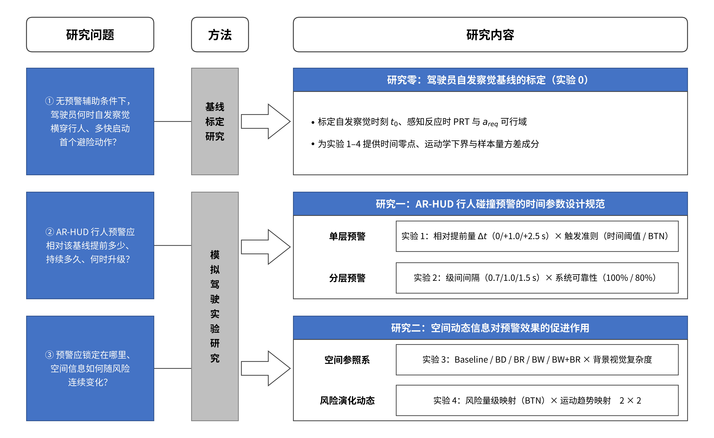

---

## 2.5 研究空白与问题提出

### 2.5.1 研究空白的识别

综合 §2.2–§2.4，本研究识别出**九项研究空白**，按三重约束模型与空间维度分类，并标注优先级。

**表 2-14　研究空白清单**

| 编号 | 研究空白 | 所属维度 | 现有证据状态 | 优先级 |
|---|---|---|---|---|
| **G1** | **自发察觉时刻 $t_0$ 从未被作为基准量测量**。全部研究都把预警设在绝对 TTC 上，隐含假设驾驶员在预警前对行人一无所知；但 Winkler 等（2018）观测到 50% 被试在预警前已开始制动，Phan 等（2016）观测到无 AR 条件下 $t_0 \approx 3$ s，Abe 与 Richardson（2006）测得自主松油门基线 0.72 s | 零点 | **零篇 AR-HUD 研究**测量该量 | **最高** |
| **G2** | **触发准则类型从未被作为自变量**。既有研究一律采用固定时间阈值或固定距离，Takada 等（2014）等虽提出减速度归一化，但从未与固定阈值做人因对照 | 下界 + 中线 | 算法侧有四篇一致证据，人因侧**零对照** | **最高** |
| **G3** | **持续时长的对照实验完全缺失**。1 s / 2 s / 3 s / 至危险解除这一对照在 102 篇中无一实现；撤销策略仅有 Takada 等（2014）的 2 : 1 滞环一条规则；**渐隐时长无任何文献支撑** | 中线 | 报告率 < 15%，**零对照** | **高** |
| **G4** | **级间间隔无任何直接对照实验**。0.5–2.0 s 区间来自四条产业时序的共同界定，Lubbe（2017）的 0.7 s 是唯一实证锚点且未与其他值对照 | 中线 | 四条产业时序，**零人因对照** | **高** |
| **G5** | **系统可靠性与预警时机的交互从未被分离**。Large 等（2019）的两者共变，Schall 等（2013）与 Abe 与 Richardson（2006）各测一侧 | 上界 | 两侧各有证据，**交互零证据** | **高** |
| **G6** | **BD/BR/BW/BW+BR 的正交对照至今无一实现**。Wu 等（2024）做了三方对照但未含复合条件，也未操纵背景视觉复杂度 | 空间 | 三方对照一项，**复合条件零证据** | **高** |
| **G7** | **风险演化动态未被分解为量级映射与趋势映射两个正交维度**。既有研究把"动态"作为一个整体处理（动 vs 不动），无法分辨是"随风险缩放"起作用还是"显示运动趋势"起作用 | 空间 | **零篇**做过 2 × 2 分解 | **高** |
| **G8** | **不透明度记法冲突未裁定**，直接影响实验条件的视觉参数取值 | 空间 | 四篇数值相差 3 倍且记法方向未知 | **中（待补全文）** |
| **G9** | **系统侧延迟（warning lag）几乎无人报告**。Thammakaroon 与 Tangamchit（2012）证明实车可达 1.47 s，但本库中报告该量的研究**接近于零** | 方法学 | **报告率 ≈ 0** | **中** |

另有三项本研究**不打算填补但须声明**的空白，以界定结论边界：

- **长期使用与习惯化效应**：全部 102 篇均为短期单次实验（典型 < 1 小时）。习惯化的理论预期（Sokolov, 1963；Bliss 等, 1995）无 AR-HUD 实证检验。
- **动效频率的二维网格**：建议后续研究做频率（0.5 / 2 / 4 Hz）× 占空比（25 / 50 / 75%），优先检验占空比主效应是否强于频率主效应。
- **传感 FOV 下界与显示策略的耦合**：Char（2020）给出传感 FOV 的检出率曲线，Ma 等（2021）给出显示 FOV 的车速耦合方案，但两者从未联合考虑。

### 2.5.2 待回答的核心研究问题

基于上述空白，本研究提出三个层层递进的核心研究问题。三个问题与本研究的三个研究模块、五个实验一一对应（见图 2-5 与表 2-18）。

#### 问题一：在没有任何预警辅助时，驾驶员什么时候自己发现横穿行人、多快做出第一个避险动作？

这一问题看似基础，却是本研究全部后续设计的前提。若不回答它，则实验 1 的自变量只能写成绝对 TTC，而由 §2.4.2 的辨析，绝对 TTC 在不同车速下对应完全不同的信息增益，这正是既有文献结论互相冲突的方法学根源。

具体要回答四个子问题：（a）$t_0$ 的分布是什么（中位数、p5、p95、被试内 SD）？（b）$t_0$ 如何随车速与遮挡条件变化？（c）感知反应时（PRT）的分位数分布如何，其分解为"察觉 → 松油 → 制动 → 峰值减速"各段各占多少？（d）驾驶员实际使用的减速度范围是多少，据此 $a_{req}$ 的可行域与 BTN 的可用阈值区间在哪里？

**理论校验值**：由 τ 理论（§2.1.3 第 5 条），60 km/h 无遮挡条件下 $t_0$ 的中位数应落在 **3.0–3.5 s**（推算值 3.2 s），与 Phan 等（2016）实测的约 3 s 吻合。若实测值大幅偏离，须检查模拟器的视觉保真度而非直接接受该值。

#### 问题二：AR-HUD 行人预警应相对该基线提前多少、持续多久、何时升级？

这一问题分为三个子问题，对应实验 1 与实验 2。

**（a）相对提前量 $\Delta t$ 与触发准则**。$\Delta t$ 应取多少？触发准则用固定时间阈值还是 BTN？两者是否存在与车速的交互？这直接对应 G1、G2 两项空白。

**（b）持续与撤销策略**。固定时长、状态维持、风险耦合衰减三者孰优？撤销时是否需要滞环？这对应 G3。

**（c）分层升级规则与系统可靠性**。级间间隔取多少？系统可靠性下降时分层的优势是否衰减？虚警在 L1 与 L2 上的代价是否不同？这对应 G4、G5。

#### 问题三：预警应锁定在哪里、空间信息如何随风险连续变化？

这一问题分为两个子问题，对应实验 3 与实验 4。

**（a）空间参照系与锁定策略**。BD / BR / BW / BW+BR 四者孰优？其差异是否随背景视觉复杂度放大？图形应指向危险侧还是逃逸侧？这对应 G6。

**（b）风险演化动态**。把"动态"分解为**风险量级空间映射**（图形几何是否随 BTN 缩放）与**运动趋势空间映射**（是否显示预测轨迹与冲突点）两个正交维度后，各自的作用机制是什么？两者是否协同？这对应 G7。

### 2.5.3 研究假设与可检验预期

本研究的假设分两组：由理论**导出**的可否证预测（H1–H4），与由文献**归纳**的方向性假设（H5–H14）。两组分列的目的是使讨论章能够区分"理论被证伪"与"参数未达显著"两种不同情形。

**表 2-15　由理论导出的四条可否证预测**

| 假设 | 内容 | 导出依据 | 若被推翻意味着 |
|---|---|---|---|
| **H1** | 存在最小有效提前量 $\Delta t_{\min} \approx 0.9$–1.2 s。当 $\Delta t < 0.9$ s 时，峰值减速度与 jerk 显著上升，但碰撞率不显著下降 | 由 SPIDER 阶段划分建立的**工作假设**：Wu 等（2024）实测 TTFF 617 ms + **本研究估计**的目标验证时间 300–600 ms（**非 SPIDER 原文参数**） | **本研究对阶段耗时的估计方式**被推翻（而非 SPIDER 框架本身），需回到绝对 TTC 框架 |
| **H2** | $\Delta t = +2.5$ s 相比 $+1.0$ s 在反应时上无显著增益，但在主观负荷与侵入性上更差（收益递减 + 代价递增） | §2.1.6 上界线 + Wang 等（2025）ARive 的习惯化观察 + Zhang 等（2015）响应潜伏期由 0.5 s 增至 2.0 s | "越早越好"成立，上界线需重估 |
| **H3** | BTN 归一化触发在 40 与 60 km/h 两个车速档间的效应一致性显著优于固定时间阈值触发（即"准则 × 车速"交互显著） | §2.1.6 下界线 + Takada 等（2014）、Chen 等（2013）、Coelingh 等（2010）、表 2-3 的换算 | 固定 TTC 阈值已足够，无需引入 BTN |
| **H4** | 级间间隔存在倒 U 型峰值且峰值位于 1.0 s；分层预警的增益主要位于 Identifying 与 Deciding 阶段而非 Scanning 阶段 | **一手工程依据**：Daimler 级联的 1.0 s 级间、Suzuki 等（2010）的 1.0 s 档距；**次级理论依据**：SPIDER 推导（本研究推导值） | 级间间隔与加工阶段耗时无关；此时 1.0 s 的工程依据仍成立，只是失去理论解释 |

**表 2-16　由文献归纳的十条方向性假设**

| 假设 | 内容 | 主要文献依据 |
|---|---|---|
| **H5** | 单层预警存在安全—舒适—负荷折中窗口，且**该窗口的位置由 $\Delta t$ 而非绝对 TTC 决定** | Zhang 等（2015）的 3.0–4.0 s 推荐区间；Kim 等（2018）的 +34.46% 反例 |
| **H6** | 状态维持型或适中固定时长能降低漏检，但过长显示会增加注视吸附与负荷 | Posner（1980）下界 500 ms；Wickens（2002）上界 3 s；Gabbard 等（2019）的 3.33 s 注视时长 |
| **H7** | 风险耦合衰减策略在"漏检率"与"视觉占用"上同时优于固定时长与纯状态维持 | Shen 等（2026）的 50% 占空比证据；Ma 等（2024）的饱和度渐变消失设计 |
| **H8** | 分层警告相较**最佳**单层方案能降低急刹与认知负荷，同时保持安全余量 | Lubbe（2017）Setting 4 的 1 次碰撞；Zhang 等（2015）证明 2.5 s 单层无效 |
| **H9** | 在 80% 可靠性条件下分层预警的优势显著衰减、L1 依从率下降；且低可靠性时更长的级间间隔（1.5 s）反而更稳健 | Abe 与 Richardson（2006）；Huo 与 Alla（2025）；Wang 等（2026） |
| **H10** | L1–L2 间隔存在最优区间，过短来不及理解，过长会造成重复或过早警告 | 四源共同界定的区间 0.5–2.0 s；Takada 等（2014）的滞环设计目的 |
| **H11** | 行人锁定 BW 的危险定位效率优于 BD/BR，BW+BR 可能进一步改善情境理解但增加负荷 | Wu 等（2024）的 617 vs 2 563/2 730 ms；Wang 等（2024）DSID vs Chen 等（2024b）过载反证 |
| **H12** | 风险量级动态主要促进紧迫度判断，轨迹动态主要促进路径预测 | Kim 等（2018）的 dome（量级）与 tether（趋势）分工；Suzuki 等（2010）的 $R_x$ 缩放 |
| **H13** | 组合动态只有在未显著增加认知负荷时才优于单一动态 | Wang 等（2024）互补 vs Wei 等（2025）冗余的边界条件 |
| **H14** | 时间分层与空间动态编码共同通过缩短"目标验证时间"（即 SPIDER 的 I 阶段）改善避险绩效 | 跨实验整合推断 |

**须声明的假设状态**：以上全部为**待检验假设**。其中 H14 属跨实验整合推断，只有在实验 2 与实验 4 的中介阶段指标均提供一致证据时，才可作为机制性结论。表 2-14 给出本研究拟主张的六条结论在当前证据下的可表述强度，其目的是防止在论文中把"方向获支持"写成"已被证明"。

**表 2-17　主张—证据状态对照**

| 拟主张 | 当前依据 | 论文中允许的表述强度 |
|---|---|---|
| 约 3 s 是合理的实验锚点 | 多项独立研究采用；Zhang 等（2015）的梯度证据支持 3.0 s 为下限 | **已有可行性证据**；**不得**写成"3 s 已被证明最优" |
| 分层预警方向上可能优于单层 | 多种分级设计有积极结果，具体级间间隔证据不足 | **方向获支持，参数待验证** |
| BW 可缩短危险定位时间 | Wu 等（2024）在 VR 转向场景中支持 | **可复制主张**；仍需在手动驾驶、多目标、量产 FOV 条件下验证 |
| BW+BR 优于 BW | 由目标定位与冲突位置互补推断 | **推断**；必须由实验 3 直接证据支持 |
| 风险量级动态与轨迹动态机制不同 | 理论上分别对应紧迫度理解与路径预测 | **机制假设**；必须由实验 4 的 2 × 2 主效应、交互与过程指标共同支持 |
| 四类参数共同形成可推广规范 | 依赖五个实验顺序收敛 | **最终整合主张**；范围不得超出实验场景、样本与显示模态 |

### 2.5.4 研究框架与实验对应

本研究的框架为"一个标定实验 + 四个递进主实验"，其结构见图 2-5。

**图 2-5　AR-HUD 行人碰撞预警时空参数的研究框架。** 左列为三个核心研究问题，中列为对应的研究方法，右列为研究内容与五个实验。研究零标定驾驶员在无辅助条件下的自发察觉基线；研究一在该基线上分离验证出现时机、持续方式与分层升级规则；研究二固定研究一入选的时间方案，检验空间参照系与风险演化动态。图中不包含任何预设的实验结果。

**表 2-18　研究问题、研究空白、实验与关键变量的对应**

| 研究问题 | 填补的空白 | 实验 | 核心自变量及水平 | 主要机制指标（SPIDER 阶段） |
|---|---|---|---|---|
| 问题一 | G1、G9 | **实验 0**：无预警基线标定 | 车速（40 / 60 km/h）× 遮挡（无 / 有），**全程无 AR 预警** | $t_0$ 分布、PRT 分布、$a_{req}$ 轨迹、系统渲染延迟 |
| 问题二（a） | G1、G2、G3 | **实验 1**：单层时间参数 | **主设计**：触发准则（固定时间阈值 / BTN）× 相对提前量 $\Delta t$（0 / +1.0 / +2.5 s）= 2 × 3；**区块 B**：持续与撤销策略 3 水平（固定 1.5 s / 状态维持 / 风险耦合衰减） | S：TTFF（警告）、TTFF（行人）；E：制动启动、峰值减速度、jerk；安全：最小 TTMD |
| 问题二（c） | G4、G5 | **实验 2**：分层升级规则 | 级间间隔（0.7 / 1.0 / 1.5 s）× 系统可靠性（100% / 80%）= 3 × 2，另加"无预警基线"与"实验 1 入选单层方案"两对照；**区块 C**：强度演化形态（阶跃 / 斜坡） | S：警告 → 首次注视；I + D：首次注视 → 正确反应；信任量表、L1 依从率、升级仲裁三率 |
| 问题三（a） | G6、G8 | **实验 3**：空间参照系 | 锁定策略 5 水平（Baseline / BD / BR / BW / BW+BR）× 背景视觉复杂度（低 / 高拥挤）= 5 × 2；**区块 D**：映射方向（危险侧 / 逃逸侧） | S：真实行人 TTFF、漏检率；I：目标验证时间 |
| 问题三（b） | G7 | **实验 4**：风险演化动态 | 2 × 2 被试内：风险量级空间映射（无 / 有，**映射量统一为 BTN**）× 运动趋势空间映射（无 / 有），形成 D0–D3 | P：路径侵入预测正确率、冲突点空间误差 |

**五个实验之间的递进逻辑**（这也是本研究不是"五个并列小实验"的理由）：

1. **实验 0 提供零点与下界**。其产出 $t_0$ 分布直接成为实验 1 的自变量换算基准；$PRT_{p95}$ 用于校验最紧迫条件是否仍在可避险区内；$t_0$ 时刻的 BTN 值成为实验 1 中 BTN 触发阈值的校准基准；$a_{comf}$ 实测值成为全部实验的 BTN 归一化分母；方差成分用于全部实验的样本量估计。
2. **实验 1 建立单层时间基线**，其入选方案（$\Delta t$ 与触发准则、持续与撤销策略）成为实验 2 的对照与实验 3、4 的固定控制。
3. **实验 2 把时间基线升级为分层规则**，并检验其在低可靠性条件下的稳健性；其入选的级间间隔与撤销策略成为实验 3、4 的固定控制。
4. **实验 3 固定全部时间参数**，只比较"锁定在哪里"，从而排除时间混淆——这是实验 3 内部效度的核心前提。
5. **实验 4 固定时间参数与空间载体**，只比较"如何随风险变化"，识别促进机制。

**判定原则**：本研究不评选单一"冠军条件"，而采用约束优先的多指标判定顺序——（1）首先满足安全约束（碰撞率不升高、最小 TTMD 不劣于对照）；（2）在安全条件中选择制动更平顺者（峰值减速度与 jerk 较低）；（3）再选择认知代价更低者（注视熵、道路离视、主观负荷）；（4）再选择在 80% 可靠性条件下退化更小者；（5）仅在上述条件相当时，以反应时与主观偏好作为最终依据。报告形式为在（安全收益，虚警代价）与（安全收益，认知代价）两个平面上给出各条件的 Pareto 前沿位置。

这一判定顺序的必要性由 §2.4 的辨析直接支持：若只看反应时，则 Kim 等（2018）的 BRAKE 文本在 Far 条件下会被判为"有效"（驾驶员确实更早制动），而其 +34.46% 的峰值减速度上升会被忽略。

---

## 2.6 本章小结

本章在 102 篇文献基础上综述了 AR-HUD 行人碰撞预警的时空参数研究，其核心工作可归纳为四点。

**第一，建立了一个可导出参数而非枚举参数的理论框架**。§2.1.6 提出的三重约束模型把预警时刻 $t_{warn}$ 界定为被运动学下界、可靠性上界、认知加工中线三条约束共同界定、并以自发察觉时刻 $t_0$ 为零点的量。这一框架的意义在于：它把"最优 TTC 是多少"这个无法跨车速回答的问题，替换为"在给定基线上提前多少"这个可回答的问题。与之配套，本章明确了 SPIDER 框架的使用边界——**只用于组织可测阶段与因变量，不用于推导阶段耗时**，因为两篇原文均未报告任何阶段耗时。

**第二，系统辨析了七组结论冲突，并把每一组转化为一个设计维度**。§2.4 把冲突归为条件差异型（A）、记法口径型（B）、推论过度型（C）三类。其中最重要的发现是：A 类冲突的共同根源是**未控制的第三变量**，出现频率最高的两个是"未测量自发察觉时刻"与"未区分信息的互补/冗余关系"；而 B 类冲突（不透明度的 3 倍差异、闪烁频率的 8 倍差异）根本不是科学分歧，而是**报告规范缺失**的后果。

**第三，对既有共识做出七处实质修正**：

| 修正 | 原表述 | 修正后 |
|---|---|---|
| 1 | 单层预警有效下限 2.5 s | **3.0 s**（Zhang 等 2015 的 7 档梯度证据） |
| 2 | 级间间隔取 Lubbe（2017）的 0.7 s | **四源共同界定的区间 0.5–2.0 s**，1.0 s 为双源支持的中心值，且级间间隔随紧迫度单调缩短 |
| 3 | 屏幕固定是空间设计的低效基线 | **"位置增益"与"共形增益"必须分离**（Lind 2007 的 200 ms 与 1 vs 17 次漏报） |
| 4 | 以 TTFF 与反应时为主要指标 | **漏检率应提升为并列主要指标**（效应量级 17 倍 vs 20%） |
| 5 | 风险区按固定米数绘制 | **按 $R_x = T_{tc} \cdot V_{car}$ 随运动学状态缩放**（Suzuki 等 2010） |
| 6 | 眼动指标按单调方向解释 | **改为区间判定**：TDT 500–2 000 ms、TTFF 100–300 ms（Zhu 等 2025） |
| 7 | Bliss（2003）元分析给出 30% 信任崩塌门限 | **已撤回**（该文为航空档案分析，门限未能溯源）；改用 Bliss 等（1995）与 Bliss 与 Acton（2003） |

**第四，识别出九项研究空白，其中三项此前完全未被识别**：触发准则类型从未作为自变量（G2）、风险演化动态从未分解为量级与趋势两个正交维度（G7）、空间映射方向作为独立维度（§2.4.6）。这九项空白与本研究的五个实验形成一一对应（表 2-18）。

**须在本章末声明的证据局限**：

1. **25 篇仅有摘要**。本章已对其数值逐一标注"仅摘要"，且不作参数锚点使用。其中影响最大的是 Li 等（2025a）与 Lopez 与 Moacdieh（2025）的不透明度记法冲突，直接影响实验 3 的视觉参数取值。
2. **危险解除方向零篇人因对照**。本研究实验 1 区块 B 的撤销策略设计中，退出侧的三个参数（退出阈值、渐隐时长、确认时长）**全部为推导值**，其中退出阈值取进入阈值的 1/2 依据 Takada 等（2014）的滞环，而渐隐时长**无任何文献支撑**。
3. **本库无一篇报告系统侧延迟**。因此全部基于模拟器的时间参数在迁移到实车时，必须加上实测的 warning lag（Thammakaroon 与 Tangamchit, 2012 报告实车可达 1.47 s）。
4. **样本代表性局限**。既有研究多以大学生或年轻新手为样本；覆盖 65 岁以上驾驶员的仅 Kazazi 等（2015）一项。本研究亦以青年驾驶员为主，代际外推须谨慎。
5. **模拟器外推效度**。本库约 80% 的实证研究采用驾驶模拟器，实车研究占比约 8% 且多在低速可控场景（如 Kim 等 2018 的停车场，24 km/h）。本研究亦为模拟器研究，其结论不直接外推到真实道路长期使用。
