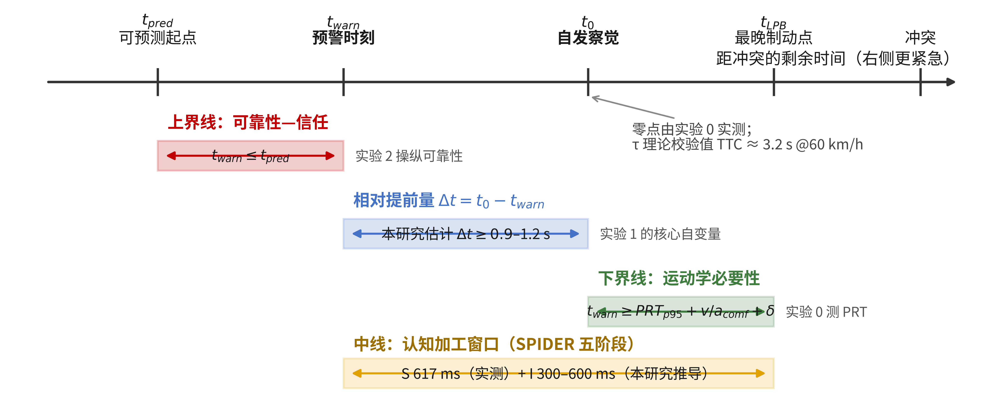
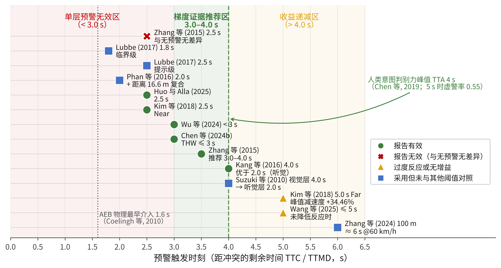
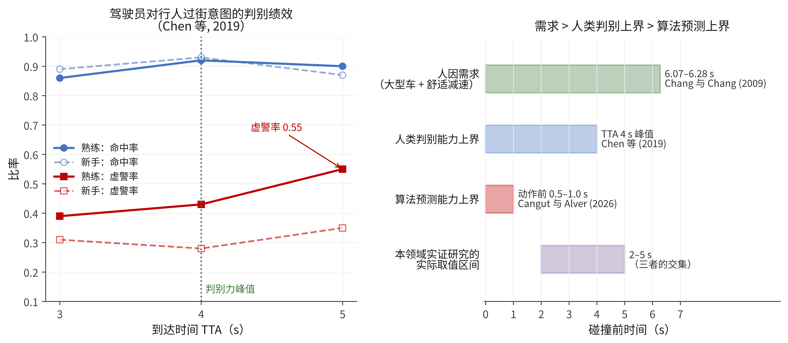
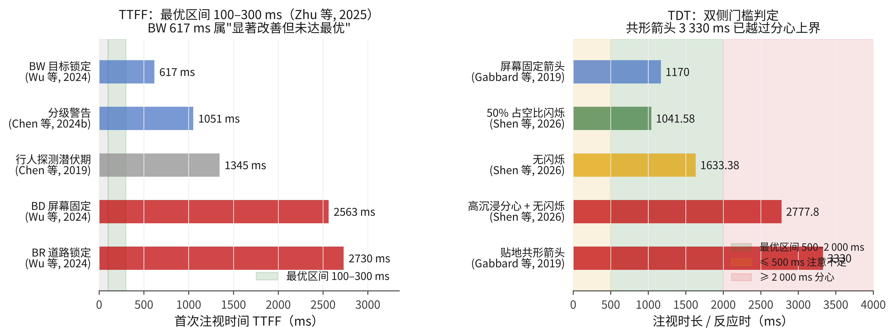

# 第 2 章 文献综述

> **文档性质与版本**：本章为硕士学位论文第 2 章的完整正文稿（v2，2026-08）。相较 v1（仅覆盖时间维度、约 3.2 万字），本版在文献库由 40 篇扩充至 **102 篇**的基础上重写，新增空间维度综述、六组结论冲突的系统辨析、以及与五个实验一一对应的问题提出。
>
> **引注体例**：正文采用中文式 APA 第 7 版作者—年份制（如「Kim 等（2018）」）；三位及以上作者一律用「等」；同一第一作者同年多篇者加 a/b 后缀。完整题录见本章末参考文献表，其生成与核验链路为 `scripts/apa_refs.json`（Crossref 按 DOI 核验、theses.fr 按 NNT 核验、arXiv 按 API 核验）。
>
> **证据强度标注约定**：本章严格区分三类证据。（1）**全文精读**且报告完整统计量者，可作为参数锚点；（2）**仅摘要**者（本库 102 篇中有 25 篇），其数值一律加「（仅摘要）」标注，**只作方向性依据，不作参数锚点**；（3）**经他篇转引**而未见原文者，加「（经 X 转引）」标注。凡本课题自行推导而非原文报告的数值，一律写明「本研究推导」。这一约定的目的是使读者能够独立判断每一条设计参数的可辩护程度。

---

行人是道路交通中最脆弱的参与者。在车辆前部装备毫米波雷达与视觉传感器之后，行人碰撞预警（pedestrian collision warning, PCW）已成为量产车的常见配置，但绝大多数量产系统仍只以蜂鸣声与仪表盘上的一个图标告知驾驶员「前方有危险」，并不告知危险来自哪一侧、哪一个目标、何时会发生。驾驶员必须在收到警报之后，自行完成扫视、定位、判断、决策与执行的全过程。增强现实抬头显示（augmented-reality head-up display, AR-HUD）之所以被视为破解这一困境的关键技术，正是因为它能把图形直接叠加到真实道路视图之上——理论上，驾驶员不再需要"先看警报、再找行人"，而可以"看到警报即看到行人"。

然而，把图形贴到危险对象上并不自动等价于更安全。AR-HUD 引入了两类此前不存在的风险：一是图形本身占用视觉资源，可能诱发注意隧道（attention tunneling）与无意视盲（inattentional blindness）；二是图形的呈现时机、持续方式、空间锚定与动态变化构成了一个高维设计空间，其中任一维度取值不当都可能使收益反转。Wang 等（2021）与 Chen 等（2023）已分别在 AR-HUD 场景中直接观测到无意视盲；Gabbard 等（2019）观测到贴地共形箭头反而增加了认知负荷；Kim 等（2018）观测到过早呈现的强制动指令使峰值减速度相对无预警基线**上升 34.46%**。这些结果共同说明：AR-HUD 行人预警的效果不由"有没有 AR"决定，而由**时空参数取什么值**决定。

按注意加工的两条路径，可以把 AR-HUD 预警对驾驶员的作用机制分为两类。**自下而上（bottom-up）**的路径由图形的物理显著性驱动——颜色、亮度、闪烁、运动会自动捕获注意，不需要驾驶员先理解图形含义；**自上而下（top-down）**的路径由图形的语义与空间参照驱动——驾驶员要理解"这个框住的是行人""这条路面标记表示冲突将发生在此处"，才能把图形信息转换为避险动作。时间参数（何时出现、持续多久、何时升级）主要决定驾驶员**是否拥有足够的加工窗口**；空间参数（锁定在哪里、如何随风险变化）主要决定该窗口内的**定位与预测效率**。二者共同作用于最终的避险绩效，因此必须在同一框架下讨论，而不能各自独立优化。

基于这一分工，本章的结构为：§2.1 界定核心概念并建立理论基础；§2.2 综述时间参数研究；§2.3 综述空间参数研究；§2.4 系统辨析六组结论冲突——这是本章相对既有综述的主要贡献，因为这些冲突不应被"取平均"或回避，而应作为引入调节变量的实证理由；§2.5 提出研究空白与研究问题；§2.6 为本章小结。

---

## 2.1 概念界定与理论基础

### 2.1.1 HUD 与 AR-HUD：从光学显示原理到人因属性

抬头显示（head-up display, HUD）最初用于战斗机，使飞行员无须低头即可读取飞行参数。汽车 HUD 始于 1988 年通用汽车的 Oldsmobile Cutlass Supreme（Yoon 等, 2014）。其光学原理是把图像源经反射镜组投射到前风挡玻璃或专门的合像器上，在驾驶员前方形成一个位于车外若干米处的**虚像**（virtual image）。相对于低头显示（head-down display, HDD），HUD 的核心人因优势在于**消除了视线转移与视觉调节（accommodation）的时间开销**：Yoon 等（2014）转引 Horrey 等的结果，指出 HUD 相比 HDD 可缩短约 0.2 s 反应时并提高情境意识。

按信息与真实场景的配准关系，可以把车载 HUD 分为两代：

| 代际 | 显示方式 | 信息与场景的关系 | 典型内容 |
|---|---|---|---|
| **传统 HUD** | 屏幕固定（screen-fixed） | 图形位置与车外场景**无空间对应**，仅占据视野中的一块固定区域 | 车速、导航箭头、油量 |
| **AR-HUD** | 世界锁定（world-locked）／共形（conformal, contact-analog） | 图形位置与车外目标**逐帧配准**，随目标在视野中的位置、大小、遮挡关系连续变化 | 行人边界框、路面虚拟阴影、车道增强、冲突区标记 |

需要在一开始就指出一个后文反复出现的概念混淆：**"屏幕固定"与"显示位置"是两个独立的维度**。Lind（2007）在四种显示位置（碰撞预警平视显示 CWHUD、方向盘显示、仪表显示、高位下视显示 HHDD）之间做的对照表明，CWHUD 本身即为**屏幕固定式**的前视野显示，其制动反应时已比其余三者快约 **200 ms**（$F(3,45)=10.8$，$p<0.0001$，效应量 0.87），漏报次数为 **1 次**，而方向盘、仪表、HHDD 分别为 **6、12、17 次**。因此当文献称"屏幕固定图形的局限"时，其比较对象必须明确是**同在前视野的世界锁定图形**，而不是仪表显示。忽略这一区分会系统性高估 AR 共形性的边际收益，这是本章 §2.3.1 展开讨论的第一个问题。

量产 AR-HUD 的另一项硬约束是**显示视场角**（field of view, FOV）。当前量产水平约为 **10°–15°**，而文献中提出的车速—FOV 耦合方案（Ma 等, 2021；Teng 等, 2023）要求 **40°–85°**，两者之间存在数倍落差。这意味着大量在实验室 VR 环境下验证有效的空间编码方案，在量产 AR-HUD 上根本画不出来，必须退化为边界箭头等间接指示。这一落差在 §2.3.6 单独讨论。

### 2.1.2 行人碰撞预警系统及其人因困境

行人碰撞预警系统的技术链条为：**传感（检测与跟踪行人）→ 风险评估（判断是否会碰撞、何时碰撞）→ 预警呈现（告知驾驶员）→（可选）自动制动介入**。Coelingh 等（2010）报告了这一链条的量产实现：相机 **48°** FOV（640×480 CMOS，装于风挡后，负责目标分类）与雷达 **60°** FOV（77 GHz 电子扫描，装于格栅内，测距离、距离变化率与方位角）融合；制动系统的**纯延迟为 180 ms**，随后以 **20 m/s³** 的斜坡建立减速度，达到 10 m/s² 约需 **0.68 s**；自动制动的介入条件是"驾驶员未响应**且**碰撞约在 1 s 之后"，物理上最早可介入的时刻约为碰撞前 **1.6 s**。

这组数字定义了行人预警设计的物理边界。**1.6 s 是机器介入的最早时刻，而制动系统本身还要花 0.68 s 才能建立全力减速**——这意味着留给"人"去反应的窗口，其下界远早于 1.6 s。§2.2.7 将由此推导运动学下界。

传统 PCW 的人因困境集中在三点：

**第一，缺乏空间信息**。Kim 等（2018）在其研究背景中明确指出，量产 PCW 通常仅以声音报警与简单视觉符号告知"存在威胁"，驾驶员仍需自行定位与判断行人运动，反而增加了认知负担与反应时延。该文援引美国 NHTSA 数据：2013 年美国共 **4 735** 名行人在道路交通事故中死亡、约 **71 000** 人受伤，平均每 2 小时死亡 1 名行人；行人死亡占交通死亡总数的 **14%**，且该比例在 2007–2013 年间由 11% 上升；事故贡献因素中，驾驶员因低可见度（**15.5%**）或行人意外出现（约 **47%**）而未能及时识别行人。

**第二，报警本身存在系统延迟**。Thammakaroon 与 Tangamchit（2012）在实车测试中发现，FCW 的报警时刻**晚于驾驶员真实制动时刻 1.47 s**（FCW+车道预警组合为 1.32 s）。也就是说，在相当比例的真实场景中，系统的"预警"实际上是"后警"。该研究进一步把跟车判据由 2.0 s 收紧至 1.6 s 以改善这一滞后。

**第三，虚警导致依从性下降**。这是预警提前量存在**上界**的根本原因：系统若要更早报警，就必须在行人意图尚不明确时做出判断，虚警率必然上升。§2.2.6 专门讨论这一上界。

### 2.1.3 时间维度的关键指标

时间参数的讨论必须先统一指标定义，否则跨研究比较无从进行。本研究采用的指标体系如下。

**（1）碰撞时间（time-to-collision, TTC）**。最常用的指标，定义为在双方均不改变运动状态的假设下，距碰撞发生的剩余时间。对近似共线的追尾冲突，$TTC = d / v_{rel}$。其局限在于：行人横穿是**二维相交**冲突，车与人的轨迹并不共线，"碰撞点"本身依赖于双方速度，因此 TTC 的定义在横穿场景中并不唯一。

**（2）到达最小距离的时间（time to minimum distance, TTMD）**。本研究固定采用这一定义作为二维车—人相交场景的主要时间风险指标，即在双方保持当前运动状态的前提下，两者间距达到最小值的时刻距当前的时间。选用 TTMD 而非 TTC 的理由有二：其一，它在轨迹不相交（"擦肩而过"）的情形下仍然有定义；其二，它避免了与"最大减速度所需时间"这一同名缩写的混淆。

**（3）车头时距（time headway, THW）**。$THW = d / v_{ego}$，只依赖自车速度，不含相对速度信息，因此对逼近速率不敏感。Chen 等（2024b）在多目标 AR-HUD 优先级研究中以 $THW \le 3$ s 作为高亮阈值。

**（4）避险所需减速度（required deceleration, $a_{req}$）与制动威胁数（brake threat number, BTN）**。$a_{req} = v_{ego}^2 / (2 d_{conflict})$，即"若要在冲突点前停住，现在至少需要多大减速度"；$BTN = a_{req} / a_{max}$，把该需求归一化到车辆或驾驶员可用的最大减速度。BTN = 1 意味着碰撞在物理上已不可避免。Takada 等（2014）提出的**避险减速度（deceleration for collision avoidance, DCA）**是同族指标。

BTN 相对 TTC 的关键优势是**把车速内生化**。同一个 TTC 值在 40 km/h 与 60 km/h 下对应的运动学难度完全不同：60 km/h 时 TTC = 2 s 对应 $a_{req} = 16.7^2/(2 \times 33.4) = 4.2$ m/s²，已接近舒适减速度上限；而 40 km/h 时 TTC = 2 s 仅对应 2.8 m/s²。因此以固定秒数为触发准则的研究，其结论无法跨车速迁移。这是 §2.2.2 的核心论点，也是本研究把触发准则本身作为自变量的理由。

**（5）光学膨胀率 $\dot\theta$ 与 τ**。Lee（1976）的 τ 理论指出，驾驶员判断碰撞迫近性依赖目标在视网膜上的**光学膨胀率** $\dot\theta$，而非距离或速度的显式估计；$\tau = \theta / \dot\theta$ 直接给出接触时间。文献报告的觉察阈值约为 **0.003 rad/s**（范围 0.002–0.008 rad/s）。对横穿行人，取肩宽 $w \approx 0.5$ m，有 $\dot\theta \approx w v / d^2$，故可察觉距离为

$$d_{th} \approx \sqrt{\frac{w v}{\dot\theta_{th}}}$$

代入 $v = 16.7$ m/s（60 km/h）、$\dot\theta_{th} = 0.003$ rad/s，得 $d_{th} \approx 52.7$ m，对应 **TTC ≈ 3.2 s**。这一理论值与 Phan 等（2016）实测的"无 AR 条件下行人觉察时刻约 TTC 3 s"高度吻合，构成本研究实验 0 的理论校验值。

**（6）自发察觉时刻 $t_0$ 与相对提前量 $\Delta t$**。$t_0$ 指驾驶员在**无任何预警辅助**条件下自行察觉危险行人的时刻（以距冲突点的剩余时间表示）；$\Delta t = t_0 - t_{warn}$ 为预警相对该基线的提前量。本研究的核心主张之一是：**决定预警是否有信息增益的不是绝对 TTC，而是 $\Delta t$**。理由见 §2.2.1 对冲突 A 的分析。

**（7）系统侧延迟（warning lag）**。从触发条件满足到图形实际上屏的时间。Thammakaroon 与 Tangamchit（2012）证明实车 FCW 的该量可达 1.47 s；模拟器通常在 30–100 ms 量级。本库 102 篇文献中**几乎无一报告该量**，这是本章 §2.4.7 指出的方法学缺陷之一。

### 2.1.4 空间维度的五个设计要素

沿用本课题空间侧专题分析建立的划分，AR-HUD 行人预警的空间设计可分解为五个要素，其中第五项在本轮修订中新增：

| 要素 | 含义 | 关键取值维度 |
|---|---|---|
| **颜色（Color）** | 图形的色相、饱和度、亮度编码 | 单色 vs 分级配色；RGB/HEX/CIE 报告 |
| **动效（Dynamics）** | 图形随时间的变化方式 | 闪烁频率、占空比、缩放、淡入淡出 |
| **形状（Shape）** | 图形的几何形态 | 边界框、虚拟阴影、箭头、风险区、图标、文字 |
| **空间分布（Spatial Distribution）** | 图形在视野中的位置与投影平面 | 显示 FOV、偏心度、虚像距离、水平面 vs 垂直面 |
| **相对锁定（Reference Frame）** | 图形与真实场景的配准关系 | BD（视野固定）／BR（道路锁定）／BW（目标锁定）／复合 |
| **映射方向（Mapping Direction）**（新增） | 图形指向危险所在还是指向建议规避方向 | 危险侧映射 vs 逃逸侧映射 |

第五项（相对锁定）的三分法沿用 Wu 等（2024）的记法：**BD** 基于驾驶员视野（based on driver's view），即屏幕/视线固定；**BR** 基于道路信息（based on road information），即道路或冲突点锁定；**BW** 基于警告目标（based on warning information），即跟随危险行人的目标锁定。第六项（映射方向）是本轮修订中新识别的维度，其证据基础与内在冲突见 §2.4.5。

### 2.1.5 注意加工的理论框架

**（1）SPIDER：本研究的主注意框架**。Strayer 与 Fisher（2016，发表于 *Human Factors*）提出、Strayer 与 McDonnell（2025，发表于 *Annual Review of Vision Science*）更新为 SPIDER 2.0 的框架，把安全驾驶所需的注意过程分解为五个成分：**S**canning（扫视环境）、**P**redicting（预测他人行为）、**I**dentifying（识别危险）、**D**eciding（决策）、**E**xecuting Responses（执行动作）。每个成分在本研究中都有可测的代理指标：

| 成分 | 含义 | 本研究的代理指标 | 本库可参照的经验值 |
|---|---|---|---|
| **S**canning | 扫视环境、发现异常 | TTFF（警告图形）、TTFF（真实行人）、道路注视比例 | **617 ms**（动态跟随 BW；Wu 等, 2024）；**1 051 ms**（分级警告；Chen 等, 2024b） |
| **P**redicting | 预测行人是否进入本车路径 | 路径侵入预测正确率、冲突点空间误差 | 本库未见直接报告 |
| **I**dentifying | 在真实场景中确认目标 | 目标验证时间 = TTFF(行人) − TTFF(警告)、警告漏检率 | **本研究推导** 300–600 ms（由 TTFF 差值估计，原文未报告） |
| **D**eciding | 决定制动或转向 | 首次注视行人 → 松油时间、风险等级判断正确率 | 本库未见直接报告 |
| **E**xecuting | 执行动作 | 制动启动时间、峰值减速度、jerk | **800 ms**（SD 290 ms；分心 + 多模态预警；Lubbe, 2017） |

选用 SPIDER 而非 PIEV（Perception–Identification–Emotion–Volition）反应链的理由有二：其一，PIEV 的 Emotion 阶段无法操作化，而 SPIDER 用 Predicting 与 Deciding 替代，两者都有成熟代理指标；其二，SPIDER 本身是围绕**分心**构建的，能同时容纳"AR 帮助注意"与"AR 造成注意隧道"两种效应，而这正是 AR-HUD 研究的核心张力。

> **⚠ 关于 SPIDER 的可信度限定（必读）**：本研究对 SPIDER 的使用**严格限定在"组织可测阶段与因变量"这一框架层功能**，不用于推导阶段耗时。经核查两篇原文，Strayer 与 Fisher（2016）及 Strayer 与 McDonnell（2025）**均未报告任何阶段耗时，也未声明五阶段严格串行**——SPIDER 是一个助记性框架（mnemonic），不是可计算的过程模型。上表中 S 阶段的 617 ms 取自 Wu 等（2024）的实测 TTFF，I 阶段的 300–600 ms 是**本课题由 TTFF 差值自行估计**。因此后文出现的"$S + I \approx 0.9$–1.2 s"一律表述为**本研究基于 SPIDER 的阶段划分所建立的工作假设**，不得写成"SPIDER 框架指出 S+I 约需 0.9–1.2 s"。1.0 s 这一水平的独立工程依据（Daimler 级联的 1.0 s 级间、Suzuki 等的 1.0 s 档距）应前置，理论推导应后置。
>
> 从期刊层级看，SPIDER 的框架层可信度是高的：*Human Factors* 为 SAGE 出版、JCR Q1、影响因子 3.6，是人因工程领域的旗舰刊；原文虽仅约 62 次引用，但其**领域归一化引用影响力（FWCI）达 6.85**，位居同领域同年文献前 10%。SPIDER 2.0 发表于 *Annual Review of Vision Science*（两年均被引 5.18）。可信度的问题不在框架本身，而在把框架当作参数表使用。

**（2）τ 理论**。已在 §2.1.3 第 5 条给出，其作用是为 $t_0$ 提供理论下限校验，并提供一个判断模拟器视觉保真度的客观指标——若被试在 $\dot\theta$ 远高于 0.003 rad/s 时才察觉行人，说明行人渲染的对比度或分辨率不足。

**（3）注意定向的时间常数**。Posner（1980，*Quarterly Journal of Experimental Psychology*，被引 7 222 次）指出视觉刺激需要 **150–300 ms** 才能产生稳定的注意指向。加上信息提取所需的另外 300–500 ms，可得视觉预警的持续时长下界应 **≥ 500 ms**。这一推导构成本研究实验 1 区块 B"固定 1.5 s"水平的下限论证。

**（4）多资源理论**。Wickens（2002）指出注意资源按通道（视觉/听觉）、编码（空间/言语）、加工阶段（感知/认知/响应）分离。其对本研究的直接含义是：**AR-HUD 与真实场景争夺的是同一份视觉—空间资源**，因此视觉单通道预警在最紧迫阶段可能不足，需要跨通道支援。这与 §2.2.5 中"1.8–2.0 s 已是人机交界"的结论相互印证。

**（5）生态界面设计（ecological interface design, EID）**。Ma 等（2024）与 Kim 等（2016a, 2016b）把虚拟阴影（virtual shadow）设计为一种生态界面——它不是"表示危险的符号"，而是**模拟真实阴影这一自然可供性（affordance）**，使驾驶员可以用日常经验直接读取行人与车辆的空间关系，而不必先学习图形语义。这一路径对应 SPIDER 的 Identifying 阶段：好的生态界面能把"识别符号再映射到场景"这一步压缩掉。

**（6）技能—规则—知识（SRK）分类学**。Rasmussen（1983）把人的行为分为技能级（skill-based，自动化）、规则级（rule-based，按熟悉规则）、知识级（knowledge-based，需要推理）三层。Wang 等（2024）的动态空间信息设计（dynamic spatial information design, DSID）框架据此提出：AR-HUD 的设计目标应是**把在知识级与规则级加工的符号与标志信息，转换为在技能级加工的信号信息**，以唤起驾驶员的本能反应。这为"为什么动态空间信息有效"提供了机制解释，也为 §2.4.4 讨论的信息组合冲突提供了理论坐标。

**（7）无意视盲与注意捕获**。这是 AR-HUD 的副作用侧理论。无意视盲指注意被占用时对显著刺激的完全漏检；注意捕获指显著刺激自动夺取注意。两者共同预测：AR 图形越显著，对目标的引导越强，但对**非增强危险**的漏检也越严重。Wang 等（2021）、Chen 等（2023）、Hou 等（2024）、Pammer 与 Blink（2013）构成本库这一方向的证据链，详见 §2.3.9。

### 2.1.6 时间参数的三线夹逼模型

在上述理论基础上，本研究提出：预警呈现时刻 $t_{warn}$ **不是一个待搜索的自由参数，而是被三条约束线夹逼、并以自发察觉时刻 $t_0$ 为零点的量**。

```
                      时间轴（距冲突点的剩余时间，右侧更紧急）
   ─────────────────────────────────────────────────────────────────▶
   │            │                    │              │            │
  t_pred      t_warn              t₀（自发察觉）   t_LPB       冲突
   │            │                    │              │
   │◀── 上界线 ─▶│                    │              │
   │  可靠性—信任 │                    │              │
   │            │◀── 相对提前量 Δt ──▶│              │
   │            │                    │◀── 下界线 ──▶│
   │            │                    │   运动学必要性 │
   │            │◀───── 中线：认知加工窗口 ──────────▶│
```



**图 2-1　时间参数的三线夹逼模型。** 预警时刻 $t_{warn}$ 被上界线（可靠性—信任）、下界线（运动学必要性）与中线（认知加工窗口）三条约束夹逼，并以自发察觉时刻 $t_0$ 为零点。其中 S 阶段的 617 ms 为 Wu 等（2024）的实测值，I 阶段的 300–600 ms 为本研究由首次注视时间差值推导的估计值，非 SPIDER 原文参数。

| 约束线 | 数学表述 | 决定因素 | 本研究如何确定 |
|---|---|---|---|
| **下界线**：运动学必要性 | $t_{warn} \ge PRT_{p95} + v_{ego}/a_{comf} + \delta_{brake}$ | 车辆动力学 + 驾驶员反应时 | 实验 0 测 PRT 分布；由车速与 $a_{comf}$ 算出 |
| **上界线**：可靠性—信任 | $t_{warn} \le t_{pred}(PPV \ge \pi^{*})$ | 行人意图预测精度 + 可接受虚警率 | 实验 2 操纵系统可靠性直接检验 |
| **中线**：认知加工窗口 | $\Delta t \ge \sum \text{SPIDER}$；**本研究估计** 0.9–1.2 s | 驾驶员的注意与决策耗时 | 实验 1 以 $\Delta t$ 为自变量直接检验 |
| **零点**：自发察觉基线 | $t_0$ | 场景可见性 + 个体差异 | 实验 0 实测；τ 理论给出下限校验（TTC ≈ 3.2 s） |

三条线的交集即**可行设计区间**。这一模型是本章后续所有综述的组织骨架：§2.2.1–2.2.2 对应中线与零点，§2.2.6 对应上界线，§2.2.7 对应下界线。本研究的贡献之一即在于首次把这一区间**实测**出来，而不是引用其他研究在别的车速下报告的秒数。

<!-- inserted:add_2_1_7.md -->
### 2.1.7 行人侧的行为与运动学参数

时间与空间参数的讨论都以"行人如何运动"为前提。若实验场景中的行人运动参数不符合真实行为分布，则所有时间阈值都失去外部效度。本库有三篇综述与两篇实证研究提供了这一侧的参数基础，其中 Rasouli 与 Tsotsos（2020）梳理 1950s–2018 年的行人行为研究与 24 个意图估计模型、识别 38 个影响因素，Ezzati Amini 等（2019）汇总 152 篇文献，两者构成本课题场景设定的主要依据。

#### （1）过街速度

**表 2-1　行人过街速度的实测与标准值**

| 来源与情境 | 速度 | 用途 |
|---|---|---|
| 斑马线过街平均（Crompton, 1979，经 Rasouli 与 Tsotsos, 2020 转引） | **1.49 m/s** | 本研究危险场景的**主设定值** |
| 带中央安全岛过街 | 1.71 m/s | — |
| Pelican 信号过街 | 1.74 m/s | — |
| 澳大利亚墨尔本交叉口与路段中部（Bennett 等，经 Ezzati Amini 等, 2019 转引） | 1.53 m/s | — |
| 土耳其标准协会设计速度 | **1.4 m/s** | 与 1.49 m/s 共同界定 1.4–1.5 m/s 的主设定区间 |
| 马来西亚无信号人行横道 | 1.39 m/s | — |
| 约旦平均值 | 1.34 m/s | — |
| **MUTCD 建议的典型群体平均步速** | **1.22 m/s** | 安全边界校验 |
| 无按钮时信号配时设计推荐值 | **0.91–0.99 m/s** | 安全边界校验（最慢档） |
| 年龄梯度 | **< 16 岁 1.53 m/s；> 64 岁 1.16 m/s** | 代际外推的边界 |

其余调节因素（Ezzati Amini 等, 2019）：老年人、残障者、推婴儿车者与幼童同行者步速更慢；男性平均快于女性；**两人及以上群体比个体更慢**；信号交叉口比路段中部更快；过街比走人行道更快；交通量高时更快；极端情况下会转为跑动。**在无控制未标线过街处逐车道通过时，行人在每个车道形成一次新的独立过街任务**，需重新评估交通状况并可能调整步速——这一点对多车道场景的建模有直接影响。

> **⚠ 一处须显式记录的文献冲突**：Rasouli 与 Tsotsos（2020）给出的实测过街速度基线为 **1.49–1.74 m/s**，而 Ezzati Amini 等（2019）转引的 MUTCD 设计基准为 **1.22 m/s**、无按钮配时推荐值更低至 **0.91–0.99 m/s**——两者相差最多约 1.9 倍。本研究判读为**二者测量对象不同而非相互矛盾**：前者是行人**实际**过街速度的实测均值，后者是信号配时为覆盖慢速行人所取的**设计下限**。因此本研究把前者用作危险场景的行为设定值，把后者用作安全边界的校验档，**不取两者平均**。两篇综述在另两点上也存在方向冲突（眼神接触在真实交通中是否物理可行；群体规模对间隙接受的作用方向），本研究的场景不涉及这两点，故不展开。

本研究据此取 **1.4–1.5 m/s** 作为危险场景的行人过街速度，并以 **0.9–1.2 m/s** 作为安全边界校验档。

#### （2）起步损失时间

Ezzati Amini 等（2019）报告：信号交叉口全体行人平均 **2.68 s**，受控路段中部过街处平均 **1.3 s**。分心行人的起步时间高于未分心者（未给具体秒数）；老年人存在"过度的起步前时间"。本研究的场景为路段中部横穿，故取 **1.3 s**。

#### （3）间隙接受：危险场景在生态上的有效区间

这是本研究场景设定中**最容易被忽略但最关键**的一组参数。

| 判据 | 数值 | 来源 |
|---|---|---|
| **无人接受的间隙下界** | **< 1.5 s** | 英国实测（经 Ezzati Amini 等, 2019 转引） |
| 所有行人都接受的间隙 | 10.5 s | 同上 |
| 行人通常不过街的 TTC | **< 3 s** | DiPietro 与 King（1970），经 Rasouli 与 Tsotsos（2020）转引 |
| 行人非常可能过街的 TTC | **> 7 s** | Schmidt 与 Färber（2009），经同上转引 |
| 平均间隙接受区间 | **3–7 s** | Rasouli 与 Tsotsos（2020）综述结论 |
| 文化差异 | 印度 2–8 s；德国 2–7 s | Schmidt 与 Färber（2009） |

**这组参数给出一个硬约束**：若实验中的车—人间隙设在 1.5 s 以下，则行人横穿在生态上不合理（无人会接受这样的间隙）；若设在 7 s 以上，则冲突不成立（所有行人都会从容通过）。因此**危险场景的车—人间隙必须落在 1.5–7 s 区间内**。这一点在本库既有实验中很少被显式论证——多数研究只报告"行人在某距离处开始横穿"，未说明该设定对应的间隙是否在行人真实会接受的范围内。

其余调节因素：女性与老年人一般接受更长间隙；结伴同行者接受更短间隙；窄街道上接受更小间隙；**等待临界间隙过久后会接受更短更危险的间隙**；等待 30 s 及以上与更高的冒险行为相关。关于"等待时间是否单独决定间隙接受阈值"，综述明确标记了一处矛盾：Sun 等（2002）认为等待越久越焦躁、阈值下降，Wang 等（2010）反驳该结论。

#### （4）行人对车辆运动的估计能力上限

Rasouli 与 Tsotsos（2020）报告：车速低于 **45 km/h** 时行人能正确估计车速；车速在 **65 km/h** 以内时能正确估计车距。即**距离判断的有效速度上限高于速度判断**，行人"总体上更善于判断距离而非速度"。一个反直觉的推论是：**在同一 TTC 下，来车速度越高行人反而更常过街**，因为其判断更依赖距离线索而非速度线索。

这一结论对本研究有两点含义：（a）在 60 km/h 场景下，行人对车速的判断已开始失准，因此其横穿决策的"非理性"程度上升，这为高车速条件下的危险场景提供了行为学基础；（b）车辆尺寸也会影响判断——车辆越大，行人越可能**低估其到达时间**（Caird 与 Hancock, 1994）。

**分心行人**：使用手机等电子设备的行人出现无意视盲的可能性高 **75%**，常改变行走方向，且平均比未分心者走得更慢（Hyman 等, 2010）。这是本研究"catch trial"（行人走到路缘停下）设计的行为学依据之一。

#### （5）驾驶员对行人过街意图的判别能力：一条被忽视的时间上界

Chen 等（2019）是本库中**唯一直接测量驾驶员意图判别能力随时间变化**的研究，其结果对预警提前量的上界具有决定性意义。该研究以到达时间（time-to-arrival, TTA）为自变量（3 / 4 / 5 s），比较熟练与新手驾驶员：

**表 2-2　驾驶员对行人过街意图的判别绩效随 TTA 的变化**（Chen 等, 2019）

| 组 | 命中率 3 s | 4 s | 5 s | 虚警率 3 s | 4 s | 5 s |
|---|---|---|---|---|---|---|
| 熟练驾驶员 | 0.86 (0.015) | **0.92** (0.015) | 0.90 (0.026) | 0.39 (0.048) | 0.43 (0.056) | **0.55** (0.049) |
| 新手驾驶员 | 0.89 (0.008) | **0.93** (0.011) | 0.87 (0.022) | 0.31 (0.045) | 0.28 (0.039) | 0.35 (0.050) |

关键结果：

1. **判别力在 TTA = 4 s 达到峰值**（命中率 0.92–0.93），而提前到 5 s 时**熟练驾驶员的虚警率飙升至 0.55**——即在五成以上的"不过街"事件中错判为"会过街"。
2. **真实基线随 TTA 剧变**："不过街"事件的占比在 TTA = 3 s 时为 **75.9%**（648/854），4 s 时为 **49.8%**（602/1 210），5 s 时为 **27.7%**（340/1 226）。也就是说，**TTA 越大，行人最终真的会过街的比例越高**；反过来说，**TTA ≤ 2 s 时 97.1% 的行人已不再过街**。
3. **敏感性 $d'$ 的经验差异与直觉相反**：新手 $M = 1.960$（SE = 0.118）显著**高于**熟练驾驶员 $M = 1.535$（SE = 0.118）。熟练驾驶员的总体命中率与新手无差异（0.92 vs 0.91，$t = 0.26$，$p = .797$），但虚警率显著更高（0.43 vs 0.30，$t = 2.26$，$p = .029$）——熟练驾驶员采取了更宽松的判据。
4. **探测阶段的眼动结果**：过街行人的探测率 $M = 0.95$ 高于不过街行人 $M = 0.86$（$F(1,38) = 66.69$，$p < .001$，$\eta_p^2 = .637$）；探测潜伏期过街 1 345 ms vs 不过街 1 445 ms；首次注视时长过街 646 ± 39 ms vs 不过街 545 ± 25 ms（$F(1,38) = 12.17$，$p = .001$，$\eta_p^2 = .243$）。
5. **预先引导注意可为意图判定节省 381 ms**——这是 AR-HUD 收益的一个直接量化值。

**这项研究给出的核心结论是：AR-HUD 意图型预警的可靠时间窗为 TTC 3–5 s，且其上界不是由人的反应能力决定，而是由"行人意图在该时刻是否已经可判"决定。** 这一结论与 §2.1.6 上界线的论证完全一致，但提供了比"虚警率会上升"更精确的量化——**在 TTA 5 s 时，即使是人类熟练驾驶员也有 55% 的虚警率**。任何要求系统在 5 s 前就准确判断行人意图的设计，其可靠性上界已由行人行为本身的不确定性锁死。

#### （6）场景参数的证据缺口

必须诚实指出，本研究场景设置中有一项参数**无任何文献支撑**：用于计算光学膨胀率的**行人肩宽 0.5 m** 是常用近似值，本库无一篇报告该量的测量来源。由于 $d_{th} \propto \sqrt{w}$，肩宽取 0.4 m 或 0.6 m 会使理论察觉距离变化约 ±10%，对应 TTC 变化约 ±0.3 s。这一敏感性须在实验 0 的结果讨论中说明。

### 2.1.8 §2.1 小结

本节界定了 AR-HUD、PCW、六项时间指标、六项空间要素，并建立了七项理论支撑与一个三线夹逼模型。三点须在进入文献综述前明确：

1. **"屏幕固定"与"显示位置"必须分离**。Lind（2007）的 200 ms 与 1 vs 17 次漏报表明，AR-HUD 的大部分收益可能来自"把信息放到前视野"这一位置红利，而非"把图形贴到目标上"这一共形红利。
2. **绝对时间指标不可跨车速迁移**。BTN 把车速内生化，是本研究把触发准则本身作为自变量的理由。
3. **SPIDER 只能用于组织阶段与指标，不能用于推导耗时**。本章所有"阶段耗时"数值均标明是实测值还是本研究推导值。

---
## 2.2 AR-HUD 行人碰撞预警的时间参数研究

时间参数决定驾驶员是否拥有足够的加工窗口。本节按 §2.1.6 三线夹逼模型的顺序展开：§2.2.1–2.2.2 讨论中线与零点（何时出现、按什么准则触发），§2.2.3–2.2.4 讨论出现之后的持续与动效，§2.2.5 讨论分层升级，§2.2.6 讨论上界线（可靠性与信任），§2.2.7 讨论下界线（反应时与运动学）。

### 2.2.1 预警出现时机：从横向比较到梯度对照

预警出现时机是本领域研究最深入、报告率最高的时间维度。按触发方式可分为三类：固定时间阈值类、固定距离阈值类、自适应/认知状态触发类。

#### （1）固定时间阈值类的横向证据

**TTC ≈ 2.0–2.5 s 作为临界级阈值**已在多项独立研究中形成共识。Kim 等（2018）在户外真实停车场进行的实车实验是最具影响力的证据来源：测试车为改装的 2009 款 Honda Odyssey，搭载体积式 HUD（焦距范围 8 m 至光学无穷远，约 17° 圆形视场），驾驶员以 15 mph（约 24 km/h）恒速行驶，须对突然横穿的行人完全刹停。两种距离条件分别为 Near = TTC **2.5 s**（约 16.7 m）与 Far = TTC **5.0 s**（约 33.5 m）。

Lubbe（2017）在 Toyota 高保真运动基座模拟器（7.1 m 穹顶 + 360° 投影 + 6 自由度运动平台）中，把基础视听警告设在 TTC **1.8 s**（持续 1.8 s），并在 Setting 3 与 Setting 4 中于 TTC **2.5 s** 加入 HUD 视觉提示级警告。在所测全部变体中，配备视听 + 制动脉冲（brake pulse）的 Setting 4 只发生 **1 次**碰撞（其余设置 8–10 次），平均反应时 **0.8 s**（SD 0.29 s）。

Huo 与 Alla（2025）在城市道路模拟中以 TTC **2.5 s**（50 km/h 下约 34.72 m）为统一触发阈值，报告 AR 警告在白天与夜间均显著缩短危险感知时间（白天 **0.52 s vs 1.20 s**；夜间 **0.58 s vs 1.89 s**，均 $p < .01$）。

Phan 等（2016）采用**时间与距离的复合触发**：$t_{WP} = \min\left(t(TTC = 2\ \mathrm{s}),\ t(d = 16.6\ \mathrm{m})\right)$。其物理意义是：车速较低时距离条件先满足，车速较高时时间条件先满足，从而避免单一 TTC 阈值在高速下触发过晚。该研究的关键结果是：AR 提示使**行人觉察时刻由 TTC 约 3 s 提前至约 4.5 s**，紧急制动次数由 **72 次降至 11 次**。

**TTC ≈ 3 s 作为提示级与临界级的过渡区**。Wu 等（2024）在 360° 全景视频模拟中以 TTC < **3 s** 触发 AR-HUD 图标，车速 60 km/h，行人以 1.5 m/s 横穿。Chen 等（2024b）在多目标场景中以 THW ≤ **3 s** 触发 AR 边界框，与瑞典国家道路管理局的推荐距离一致；其分级警告（红 = 立即危险，黄 = 进入车辆周边但不碰撞）相较均等警告（统一黄色）显著缩短反应时（**1 083 ms vs 1 707 ms**，−36%）。

**TTC ≈ 5 s 作为提示级上界**。除 Kim 等（2018）的 Far 条件，Wang 等（2025）的 ARive 系统以 $t_{min} \le 5$ s 为风险区可视化激活阈值上限。值得注意的是，**5 s 阈值并未显著降低反应时**（作者推测被试对该长前置时间已产生习惯化），但显著增大了车头时距；其红地毯设计在让行场景中的成功率显著优于基线（$p < .001$）。

#### （2）固定距离阈值类

Zhang 等（2024）（中文姊妹篇为边扬等发表于《华南理工大学学报》）在网联 V2X 环境下把预警距离设为 **100 m**（60 km/h 下对应提前期约 6 s），行人在 60 m 处以 1 m/s 起步过街。该研究是本库中**中国样本、网联场景、量化最完整**的一项，其核心结果如下（N = 34）：

| 指标 | 无预警 | HDD | HUD | 方向判读 |
|---|---|---|---|---|
| 首次制动位置 $d_b$（m，自事件触发点起算的行驶距离，**越小越早**） | 64.50 ± 10.22 | 53.16 ± 12.26 | **27.33 ± 7.98** | HUD 比无预警提前约 **37 m** |
| 最大减速度 $a_1$（m/s²） | −8.30 ± 1.94 | −6.94 ± 2.34 | **−5.03 ± 1.23** | HUD 制动更柔和 |
| 最小冲突距离 $d_c$（m） | 10.75 ± 6.97 | 15.02 ± 5.25 | **20.96 ± 6.58** | HUD 安全余量约翻倍 |

> **数值判读说明**：$d_b$ 是"自事件触发点起算已行驶的距离"，因此数值**越小表示制动越早**。本课题此前一份工作文档曾把该量误读为"距冲突点的剩余距离"，从而写出"27.3 m 远大于 64.5 m"这一自相矛盾的表述，现予更正。原文另报告了基于模型估计边际均值的提前量为 **39.10 m**（油门松开位置提前 **36.29 m**，$p < .001$），与简单均值差 37.17 m 略有差异，引用时应说明所用口径。

该研究还报告了雾天的放大效应：HUD 在雾天（240 m 能见度）相较晴天进一步提前油门松开 **27.7 m**（$p = .032$）与首次制动 **27.8 m**（$p = .035$）。这一点与 Li 等（2025b）针对中国雾天场景的研究方向一致。

#### （3）自适应/认知状态触发类

自适应触发的核心思想是：预警不应按固定阈值统一触发，而应根据驾驶员的实时认知状态按需触发。Frémont 等（2019）开发的自适应视觉辅助系统对车辆驾驶信号（油门、制动、转向）做统计建模，识别驾驶员的"未察觉行为"（unawareness），**仅在检测到未察觉时**才呈现 AR 视觉隐喻预警，从而降低不必要预警的频次。Doshi 等（2009）更早提出"动态主动显示"（dynamic active display, DAD）概念，基于驾驶员、车辆、环境三方状态联合判断呈现时机；其超速合规辅助实验显示，DAD 相较传统仪表显示可将减速到限速所需时间缩短 **38%**（$p < .01$），视线偏离路面时间降低 **63%**（$p < .01$）。

Strle 等（2023）与 Teng 等（2023）为自适应触发提供了方法学基础：前者融合心率变异性、皮肤电活动、皮温、瞳孔等多通道生理信号训练梯度提升分类器，实时预测 AR-HUD 诱发的认知负荷（平均 AUC ROC 0.76，最佳 HGBC 达 **0.98**）；后者用 IVPM-GA 优化算法搜索视觉编码组合。

#### （4）梯度对照证据：本领域证据等级最高的两项研究

上述横向比较有一个共同缺陷：不同研究采用不同的单点阈值，其差异同时包含了阈值差异与研究间差异（车速、模态、样本、场景），无法分离。真正把"出现时机"作为**多水平自变量**的研究只有两项，其证据等级显著高于横向比较。

**证据一：Zhang 等（2015）——7 档梯度，本库出现时机梯度最细的研究**

在交叉口闯红灯冲突场景中，以听觉预警为载体，设置 7 个释放时机（碰撞前秒数，步长 0.5 s）加无预警对照：**2.5 / 3.0 / 3.5 / 4.0 / 4.5 / 5.0 / 5.5 s + 无预警**。

| 结果项 | 数值 |
|---|---|
| **无效阈值** | **2.5 s**：全部时间切片上与无预警条件无显著差异，碰撞率 **29.4%** |
| **有效性硬下限** | 至少需在碰撞前 **3.0 s** 释放 |
| **推荐区间** | **3.0–4.0 s** |
| 无预警基线行为 | 驾驶员直到距冲突点 **1.5 s** 才猛制动，碰撞率 **44.1%** |
| 最大减速时刻距冲突点的距离 | 无预警 33.24 m → 各预警条件 36.57 / 44.44 / 36.92 / 50.07 / 50.52 / 56.26 / 59.49 m（$F = 7.464$，$p < .05$） |
| 该距离的标准差 | 由 **40.75 m 降至 15.97 m** |
| 推算的响应潜伏期 | **0.5 s**（3.0 s 释放条件）至 **2.0 s**（5.5 s 释放条件） |

这项研究对本课题有三点决定性意义：

1. **"2.5 s 无效"与前述"TTC 2.0–2.5 s 为临界级"的共识表面冲突，但实质不矛盾**。Lubbe（2017）等研究中的 2.5 s 是**分级体系中的提示级**，其后还有 1.8 s 的临界级与触觉脉冲；而 Zhang 等（2015）的 2.5 s 是**唯一一次预警**。据此可提炼一条重要推论：**单层预警的有效阈值高于分层预警中任一级的阈值**。这条推论同时构成本研究实验 2 的立论基础——L2 之所以能设在 2.0 s，前提是 L1 已经完成了定位工作。
2. **响应潜伏期随预警提前量增大而变长**（0.5 s → 2.0 s），直接支持"提前量存在收益递减"这一假设，也解释了为什么 Wang 等（2025）在 5 s 阈值下未观测到反应时改善。
3. **行为离散度显著下降**（SD 40.75 → 15.97 m）是一个此前被普遍忽视的收益维度：预警的价值不仅在于改善均值，还在于**压缩长尾**。本研究据此把"主要指标的标准差"纳入指标体系。

**证据二：Large 等（2019）——4 档梯度，但与虚警率共变**

TTC 四水平 **2.0 / 3.0 / 4.0 / 5.0 s**（记为 W1–W4），车速 40 km/h。其时间数据是本库最完整的：

| 指标（单位：TTC 秒数，数值越大表示反应越早） | 无预警 | 听觉 | 听觉 + HUD |
|---|---|---|---|
| TTC @ 首次注视行人（W1/W2/W3/W4） | 1.59 / 2.31 / 2.84 / 3.12 | 1.43 / 2.44 / 3.23 / 3.44 | 1.39 / 2.36 / 3.07 / **3.74** |
| TTC @ 松油门 | 1.42 / 2.26 / 3.05 / 3.42 | 1.46 / 2.37 / 3.28 / 4.23 | 1.47 / 2.42 / 3.33 / **4.33** |
| TTC @ 踩刹车 | 1.05 / 1.56 / 1.87 / 2.28 | 1.11 / 1.73 / 2.22 / 2.85 | 1.12 / 1.71 / 2.22 / **3.14** |
| 停车时车头距（m） | 18.44 / 37.41 / 41.57 / 42.50 | 20.49 / 44.39 / 57.48 / **64.69** | 21.03 / 43.65 / 54.10 / 64.20 |

统计要点：紧迫度（TTC）主效应在所有指标上极强（"TTC @ 松油门"：$F = 5\,037.10$）；**模态主效应仅在部分指标上显著**——"TTC @ 首次注视行人"的模态主效应**不显著**（$p = .608$），"TTC @ 踩刹车"仅在 W4 上出现"听觉 vs 听觉 + HUD"的显著差异（$t(178.9) = -2.65$，$p = .024$）。

由该表可**推算两段阶段耗时**（本研究推算，原文未直接报告）："警报 → 松油门"潜伏期 **0.53–0.77 s**，且随 TTC 增大而变长；"松油门 → 踩刹车"间隔由 **0.35 s（W1）增至 1.38 s（W4）**。

该研究的**方法学缺陷必须显式指出**：TTC 的四个水平与误报率 20/40/60/80% **共变**，因此其"紧迫度主效应"实际上是"紧迫度 + 可靠性"的混合效应，二者无法分离。这一缺陷本身构成本研究实验 2 把可靠性单列为自变量的直接理由。



**图 2-2　预警出现时机的证据谱。** 横轴为预警触发时刻距冲突的剩余时间。绿色圆点为报告有效的研究，红色叉为报告与无预警无显著差异者，橙色三角为出现过度反应或无增益者，蓝色方块为采用该阈值但未与其他阈值对照者。背景三色带分别标出由梯度证据界定的无效区（< 3.0 s）、推荐区（3.0–4.0 s）与收益递减区（> 4.0 s）。两条参考线分别为人类意图判别力的峰值时刻（Chen 等, 2019）与自动紧急制动的物理最早介入时刻（Coelingh 等, 2010）。

#### （5）两项梯度研究的汇合结论

单层预警的有效区间下界在 **3.0 s** 附近（Zhang 等 2015 的 2.5 s 无效、3.0 s 起有效），上界在 **4.0–5.0 s** 附近出现收益递减（Zhang 等的响应潜伏期变长；Large 等的 W4 主观指标未继续改善；Wang 等 2025 的 5 s 未降反应时）。这一区间与横向比较得到的"提示级 2.5–5.0 s"大致吻合，但**梯度证据把下界从 2.5 s 上修到 3.0 s**——这是本课题在扩充文献库后对原有结论的一处实质性修正。

### 2.2.2 运动学触发准则：从固定秒数到减速度归一化

前述全部研究都用**固定秒数**（TTC/THW）或**固定距离**作为触发准则。这一做法有一个内在缺陷：同一秒数在不同车速下对应完全不同的运动学难度。表 2-3 给出换算：

**表 2-3　固定 TTC 阈值在不同车速下对应的 $a_{req}$ 与 BTN**（取 $a_{max} = 8$ m/s²；$a_{req} = v/(2\,TTC)$ 用于匀减速停车）

| 车速 | TTC = 2.0 s | TTC = 3.0 s | TTC = 4.0 s | TTC = 5.0 s |
|---|---|---|---|---|
| 40 km/h（11.1 m/s） | 2.78 m/s²（BTN 0.35） | 1.85 m/s²（BTN 0.23） | 1.39 m/s²（BTN 0.17） | 1.11 m/s²（BTN 0.14） |
| 60 km/h（16.7 m/s） | 4.17 m/s²（BTN 0.52） | 2.78 m/s²（BTN 0.35） | 2.08 m/s²（BTN 0.26） | 1.67 m/s²（BTN 0.21） |
| 80 km/h（22.2 m/s） | 5.56 m/s²（BTN 0.69） | 3.70 m/s²（BTN 0.46） | 2.78 m/s²（BTN 0.35） | 2.22 m/s²（BTN 0.28） |

由表可见，**TTC = 2.0 s 在 40 km/h 下只需 BTN 0.35 的温和制动，在 80 km/h 下已需 BTN 0.69 的接近全力制动**。这意味着以固定秒数为准则的研究，其结论无法跨车速迁移；而本领域的既有研究车速跨度从 24 km/h（Kim 等, 2018）到 60 km/h（Wu 等, 2024）不等，这正是结论互相冲突的一个结构性原因。

针对这一问题，四项研究构成了"减速度归一化触发"的证据链：

| 来源 | 准则形式 | 关键参数 | 证据类型 |
|---|---|---|---|
| **Takada 等（2014）** | **DCA**（避险所需减速度）；PDCA（预测型，视觉）先于 ODCA（当前型，听觉） | 报警触发 **4.0 m/s²** / 解除 **2.0 m/s²**（**2 : 1 滞环**，明确目的是"避免极短促的报警"）；反应时 $T = 1.2$ s（未踩刹车）/ 0.2 s（已踩刹车），1.2 s 为模拟器实验反应时的 **90 百分位** | 全文，含完整算法 |
| **Chen 等（2013）** | TTC 与车头时距**双条件** | 临界 $T_c = 1.5$ s；反射 0.44–0.52 + 判断 0.15–0.25 + 动作 0.15–0.40 = **0.74–1.17 s**；制动压力建立 $t_p = 0.3$–0.75 s；总时延 **1.04–1.92 s** | 全文 |
| **Coelingh 等（2010）** | 量产实现：碰撞预警 + 全力自动制动 + 行人检测 | AEB 介入条件"驾驶员未响应**且**碰撞约在 1 s 之后"；物理最早介入 **1.6 s**；制动纯延迟 **180 ms** + 斜坡 **20 m/s³**，建立 10 m/s² 需 **0.68 s** | 全文 |
| **Char（2020）** | 事故重建 + 反应时分布反推预警时机 | 3 700+ 例事故重建 + 200 人模拟器反应时分布；行人 **FOV > 30° 时可在 TTC 2 s 检出 > 90%**，**≥ 40° 后增益极小** | 博士论文全文（Aix-Marseille Université，NNT 2020AIXM0610，答辩 2020-12-18） |

Takada 等（2014）的 **2 : 1 滞环**尤其重要：它是本库中"用运动学量而非固定秒数定义级间关系"的**唯一先例**，且其设计目的（避免极短促的报警）正是"级间间隔不能太短"这一要求的物理版表述。本研究在实验 1 的撤销策略与实验 2 的降级规则中直接沿用了这一滞环思想（退出阈值取进入阈值的 1/2）。

Sun 等（2023）进一步提出基于强化学习的自适应 FCW，代表这一路径的算法化延伸；Yau 等（2021）的 Graph-SIM 与 Cangut 与 Alver（2026）的机器学习行人意图预测模型则从"预测侧"支撑同一逻辑——若能更准确地预测行人意图，触发准则就可以更早而不牺牲精度。

**小结**：本研究据此把**触发准则类型本身**（固定时间阈值 vs BTN）设为实验 1 的自变量之一，而不是像既有研究那样默认采用固定秒数。这是本研究在时间参数侧最主要的方法学推进。

### 2.2.3 预警持续时长与撤销策略

持续时长是本领域**报告率最低**的时间维度——本库 102 篇中明确报告者不足 15%。现有设计可归为三类范式：

**范式一：至危险解除型（state-contingent）**。最普遍但最缺乏量化报告。Kim 等（2018）的虚拟阴影"从触发开始持续显示，随驾驶员—行人空间关系动态更新"，直至危险解除；Ma 等（2024）的生态界面地毯"在风险增加时由绿变黄变红，风险解除后区域面积与饱和度逐渐减小直至消失"；Phan 等（2016）的边界框推测持续到行人离开检测范围，但论文未明确报告。

**范式二：固定时长型**。Ma 等（2021）明确报告"单条警告消息显示 **3 s**，紧急危险警告约束在 **10–15 s**"；Ye 与 Yin（2025）在引用前者的基础上把碰撞预警图形持续时长设为 **3 s**。Lind（2007）报告单次预警持续 **1.2 s**。

**范式三：动态强度调制型**。Huo 与 Alla（2025）的 AR 警告以闪烁方式持续呈现；Wu 等（2024）的 BW 图标采用"随行人位置移动"的动态跟随策略，使"持续显示"在感知上转化为"动态行为"。

**理论上的上下界推导**（本研究综合）：

- **下界 ≥ 500 ms**：Posner（1980）指出视觉刺激需 150–300 ms 产生稳定注意指向，加上信息提取 300–500 ms。
- **上界 ≤ 3 s（单通道视觉）**：由 Wickens（2002）多资源理论，视觉 AR 图形与真实场景争夺同一资源，须留出"视线回到道路"的窗口；美国 NHTSA 规范以"单次注视 ≤ 2 s、累计 ≤ 20 s"评估车载显示器，Kim 与 Gabbard（2019）指出该标准对 AR-HUD 的适用性仍有争议。
- **上界的第二重约束：习惯化**。Sokolov（1963）的"匹配—不匹配"模型指出反复呈现的相同刺激会经历神经习惯化。报警系统的长期依从性衰减在人因文献中已有讨论（Bliss 等, 1995；Bliss 与 Acton, 2003）。

> **⚠ 归因更正（全库统一）**：本课题此前多处引用"Bliss（2003）元分析指出虚警率超过 30% 时信任显著下降"。经 Crossref 核验，Bliss（2003）（*The International Journal of Aviation Psychology, 13*(3), 249–268）是**航空事故与事件的档案分析**，既非元分析亦非驾驶研究；**"30% 门限"这一具体数值在 Bliss 的任何一篇原始文献中均未核实到**，应视为领域内未溯源的流传值。本章及全库已改用可核验的替代证据：报警可靠性与操作员依从率之间存在近似的概率匹配关系（Bliss 等, 1995，*Ergonomics*），且碰撞报警的可靠性直接影响驾驶行为（Bliss 与 Acton, 2003，*Applied Ergonomics*）。

**撤销策略的证据空白**：预警应在风险解除时立即消失，还是保留若干缓冲以避免在阈值附近抖动？本库中**唯一给出明确规则的是 Takada 等（2014）的 2 : 1 滞环**（触发 4.0 / 解除 2.0 m/s²）。除此之外，"1 s vs 2 s vs 3 s vs 至危险解除"这一对照设计在 102 篇文献中**完全缺失**；渐隐时长、撤销时的视觉过渡方式**无任何文献支撑**。这是本研究实验 1 区块 B 的直接立论依据，也是本章 §2.5.1 列出的第二项研究空白。

### 2.2.4 闪烁频率与占空比

动效的时间参数在本库中有三条量化证据，且彼此存在量级冲突：

| 来源 | 周期/频率 | 占空比 | 关键效果 |
|---|---|---|---|
| **Lind（2007）** | **4 Hz**（亮 0.15 s / 灭 0.1 s） | **60%** | 单次预警持续 1.2 s；CWHUD 制动反应时快约 200 ms |
| **Shen 等（2026）** | **周期 2 s（即 0.5 Hz）** | 0 / 25 / **50** / 75% | **50% 占空比最优**（1 041.58 ± 380.87 ms）；**无闪烁最差**（1 633.38 ± 1 282.46 ms）；高沉浸分心条件下由 2 777.80 ms 降至 **1 389.34 ms** |
| **Hou 等（2024）** | 摘要未报告具体频率 | 摘要未报告 | **动效对无意视盲无显著影响，仅闪烁缩短反应时**（仅摘要） |

Lind（2007）的 4 Hz 与 Shen 等（2026）的 0.5 Hz **相差 8 倍**，但两者的**占空比却接近**（60% vs 50%）。这提示一个可检验的假设：**占空比可能比闪烁频率更接近有效变量**。这一冲突在 §2.4.6 单独辨析。

Hou 等（2024）的结论需要特别强调，因为本课题的一份工作文档曾把它转述为"闪烁可缓解无意视盲"，而其摘要原话是"**动效对无意视盲无显著影响，仅闪烁缩短反应时**"。这一转述失真提示：文献链条中的二手转述必须回到原始摘要核验。其设计含义是：**若不同实验条件间的闪烁状态不一致，则反应时差异可完全归因于闪烁而非所研究的变量**——本研究据此在实验 3 中要求全部条件统一闪烁参数（周期 2 s、占空比 50%）或全部不闪烁。

### 2.2.5 分级预警与级间间隔

分级预警（graded warning）的核心主张不是"增加信息量"，而是**让预警强度与风险阶段匹配**：早期阶段低侵入并帮助定位，临界阶段再强化动作语义。本库中实际测试或明确实现分级逻辑的研究可分四类。

#### （1）两级方案

| 来源 | 分级结构 | 级间间隔 | 载体 |
|---|---|---|---|
| **Lubbe（2017）** | HUD 视觉提示 + 57 dBA 低音（TTC **2.5 s**）→ 视听 + 64 dBA 强警告 + 制动脉冲（TTC **1.8 s**） | **0.7 s** | HUD + 听觉 + 触觉 |
| **Ma 等（2024）** | 相位 1 黄色 → 相位 2 红色，饱和度连续变化 | 未给具体 TTC | AR-HUD 生态界面 |
| **Kazazi 等（2015）** | Caution Warning → Stop Warning | 流点/场景驱动 | HUD |
| **Phan（2016，博士论文）** | 检测到行人即显示贴合式边界框 → **TTC 2.0 s** 叠加非贴合黄色警告面板 | **非固定秒数**（L1 由检测事件触发，L2 由 TTC 触发） | AR-HUD |
| **Chen 等（2024b）** | 黄色中风险 / 红色高风险 | THW ≤ 3 s | AR-HUD 多目标 |

Phan（2016）的博士论文另给出一张**覆盖人群百分位表**，这是本库中把预警时机与人群覆盖率直接挂钩的唯一证据：TTC **1.0 s → 覆盖 45%**、**1.6 s → 80%**、**2.0 s → 90%**。这为"L2 应设在 TTC 2.0 s"提供了可量化的人因依据，也是本研究实验 2 的 L2 锚点来源。该文另给出觉察判定的减速反应阈 $d_{th} = -0.736$ m/s²（约 −0.075 g），本研究在实验 2 的升级仲裁规则中直接采用。

#### （2）三级及以上的产业级级联

| 来源 | 级联结构 | 级间间隔 | 备注 |
|---|---|---|---|
| **Large 等（2019）转引 Daimler 方案** | early **4.0 s** → warning **2.6 s** → urgent **1.6 s** → 自动制动 **1.1 s** | **1.4 / 1.0 / 0.5 s** | 本库唯一给出**三个连续级间间隔**的产业时序；间隔随紧迫度上升而**单调缩短** |
| **Large 等（2019）转引 PROSPECT 方案** | 迫近预警 TTC **1.8 s** | — | 欧盟项目实现 |
| **Suzuki 等（2010）** | 视觉情境层 $T_{tc}$ **4.0 s** → 听觉叠加 **2.0 s**；危险等级每 **1.0 s** 一档（4/3/2/1 s 四档） | **2.0 s**（视觉→听觉）；**1.0 s**（等级档距） | $T_{tc,max} = 4.0$ s 的出处为 Ueda 等（2007），针对注意力不集中驾驶员 |
| **Coelingh 等（2010）** | 预警 → 部分制动 → 全力自动制动 | AEB 介入"驾驶员未响应且碰撞约在 1 s 之后"，物理最早 **1.6 s** | 分层体系的最后一级由机器接管 |

**级间间隔的夹逼结论**：跨四个来源，真实产业实现的级间间隔落在 **0.5–2.0 s** 区间内，且存在一条清晰规律——**越接近碰撞，级间间隔越短**（Daimler 的 1.4 → 1.0 → 0.5 s）。本研究实验 2 采用的 0.7 / 1.0 / 1.5 s 三水平恰好落在该区间中段，其中 **1.0 s 得到 Daimler 第二级间隔与 Suzuki 等等级档距的双源支持**。

#### （3）分层必要性的最强单条证据

Zhang 等（2015）证明 **TTC 2.5 s 的单层预警与无预警无显著差异**（碰撞率 29.4% vs 44.1%），单层有效下限为 3.0 s。这从反面证明了分层的必要性：**若 L2 设在 2.0 s，它单独不可能有效；L2 之所以能设在 2.0 s，前提是 L1 已经完成了定位工作**。这是本库中支持"分层必要"的最强单条证据。

与之呼应的是"最后 1.8–2.0 s 不宜只依赖视觉"这一结论。Coelingh 等（2010）证明该窗口内 AEB 物理上最早只能在 1.6 s 介入，且制动系统需 0.68 s 才建立全力减速——即 **1.8–2.0 s 已是人机交界**。Lubbe（2017）在重度分心条件下的观测提供了行为侧证据：无触觉脉冲条件的**最长反应时高达 2.5 s，超过了 TTC 本身**，意味着此情境下预警时机已落入"无救援区"。

#### （4）竞争性设计：阶跃分层 vs 连续强度调制

分层默认以离散阶跃（黄 → 红）实现，但这不是唯一可能。三项研究表明**连续强度调制**同样可行：

| 来源 | 强度调制方式 | 关键数值 |
|---|---|---|
| **Gray 等（2014）** | 振动强度随距离**连续**上升：$I \approx a + k D^{-2}$（$k = 150\,000$）；另一版本按脉冲间隔编码 $ITI = b + jD$ | 触发 $TTC_{thres} = 3.0$ s；持续 **645 ms**（3 振子 × 215 ms）或 550–750 ms；上升型联动条件的制动反应时比其余各预警**平均低约 100 ms**（$F(4,56) = 14.8$，$p < .001$，$\eta_p^2 = .51$）；误报次数三条件间不显著（$p = .23$） |
| **Takada 等（2014）** | 以运动学量定义级间：PDCA 黄框 4.0 m/s² 先于 ODCA 听觉报警 | 触发 4.0 / 解除 2.0 m/s²（2 : 1 滞环） |
| **Shen 等（2026）** | 占空比作为强度维度 | 周期 2 s；占空比 0/25/50/75%，**50% 最优**（1 041.58 ± 380.87 ms） |

Gray 等（2014）还经二手转引了 Straughn 等（2009）的一项结论：**长 TTC 时用危险侧方向、短 TTC 时用逃逸方向**。经本课题核验，Straughn、Gray 与 Tan（2009，*IEEE Transactions on Haptics, 2*(2), 111–117）本身即是一项**行人碰撞预警的刺激—反应兼容性研究**，因此可作为一手来源引用，而不必经 Gray 等（2014）转引。该结论与 §2.4.5 讨论的映射方向冲突直接相关。

#### （5）升级仲裁：一个被普遍忽视的规则

Winkler 等（2018）报告了一个对分层设计有决定性影响的观测：在左转侵入场景中，**50% 的被试在预警呈现之前就已经开始制动**。这意味着对这一半被试而言 $\Delta t < 0$，预警完全没有提供信息增益；更严重的是，若不设仲裁规则，则在近半数试次中 L2 会对一个**已经在制动**的驾驶员发出"立即制动"的指令，这既是设计缺陷也是实验混淆源。

Kazazi 等（2015）的 Caution → Stop 方案已隐含"已反应则不升级、未反应则升级"的级联原则，但未把它操作化为可测量的规则。本研究据此把**状态条件化升级仲裁**设为实验 2 中所有分层条件共用的规则：若在 L2 触发时刻前检测到驾驶员已启动有效减速（$a_{ego} < -0.075$ g，阈值取自 Phan, 2016），则取消升级；并记录取消升级率、错误升级率、错误取消率三个比例作为因变量。

#### （6）级间间隔的证据缺口

必须诚实指出：**级间间隔至今没有任何直接对照实验**。0.5–2.0 s 这一区间来自四条产业时序的夹逼，而非任何一项操纵级间间隔的人因研究。本研究实验 2 是本领域**首次**把级间间隔作为多水平自变量的尝试，这也是本章 §2.5.1 列出的第三项研究空白。

### 2.2.6 系统可靠性、虚警与驾驶员信任：预警提前量的上界

§2.1.6 指出预警提前量存在上界，且该上界**由预测可靠性而非人因决定**：系统若要更早报警，就必须在行人意图尚不明确时做出判断，虚警率必然上升。本节梳理这一上界的证据。

#### （1）两条相反的边界证据及其调和

| 来源 | 可靠性操纵 | 结果 | 关键条件 |
|---|---|---|---|
| **Schall 等（2013）** | 15% 误报 + 15% 漏报（可靠性 85%） | **对所有因变量均无显著效应** | 提示**提前 11–13 s**；语义为"警示"级；**不要求立即动作**；老年驾驶员样本 |
| **Abe 与 Richardson（2006）** | 早/晚报警（操纵时机而非可靠性） | 信任由 **7.3 降至 4.3**（$F(1,115) = 118.32$，$p < .01$）；报警时刻与信任的相关 $R = -0.46$ | 报警要求**立即制动** |

这两项结果表面矛盾，实质上共同界定了一条边界：**可靠性的行为后果随预警的"行动要求强度"放大**。Schall 等（2013）的提示提前 11–13 s 且不要求动作，因此 15% 的错误不产生代价；Abe 与 Richardson（2006）的报警要求立即制动，因此时机偏差立刻转化为信任损失。

这条边界直接给出本研究实验 2 的一个可否证预测：**L1 是"低行动要求"层，L2 是"高行动要求"层，因此虚警在 L1 上的代价应显著小于在 L2 上的代价**。这也是实验 2 把虚警**只施加在 L1** 的设计依据。

#### （2）Abe 与 Richardson（2006）的完整参数：本库最重要的时机—信任研究

该研究是本库中把"预警时机"与"驾驶员信任"直接联系起来的唯一一项，其参数值被本研究多处采用：

| 参数 | 数值 | 在本研究中的用途 |
|---|---|---|
| 无报警条件下驾驶员**自主松油门时刻** | **0.72 s** | 被该文直接用作判断报警"早"或"晚"的操作化阈值；本研究实验 0 的 $t_0^{throttle}$ 参照值 |
| correct 组 vs late 组的松油门时刻 | 0.51 s vs 0.77 s | 时机操纵有效性的验证 |
| 信任评分（10 点） | 7.3（正常）→ **4.3**（晚报警） | 实验 2 信任量表的方法学模板 |
| 报警时刻与信任的相关 | $R = -0.46$ | 可直接对照的效应量 |
| 早报警条件的制动反应时 | 1.20 s → **0.93 s** | 提前量的收益量级 |
| 晚报警条件的制动反应时 | 0.95 s → 1.07 s | 晚报警的代价（反应时反而变长） |
| 听觉报警参数 | **2.0 s / 4 000 Hz** | 若本研究加入听觉对照 |
| 其 SDA 模型参数 | RT = 1.25 s、$D_l$ = 0.5 g、$D_f$ = 0.45 g（早）/ 0.60 g（晚） | 运动学下界的外部校验 |

**其中 0.72 s 这一数值具有方法学上的示范意义**：Abe 与 Richardson 已经在 FCW 领域用"驾驶员自发动作时刻"作为报警时机的**参照零点**，只是没有把它推广为可操纵的自变量，也没有在 AR-HUD 领域使用。本研究实验 0 正是把这一做法迁移到 AR-HUD 行人预警场景，并把 $t_0$ 从"事后参照值"升级为"实验 1 的自变量归一化基准"。

同一作者组的 Abe 与 Richardson（2004）为其早期的 HFES 会议论文，本课题**仅取得题录级信息，无摘要**，因此不作参数引用。

#### （3）真实系统可达到的骚扰水平

Wang 等（2026）的 A-TTC 框架在 **569 辆**重型卡车、**3 519 条**视频核验的自然驾驶 FCW 触发事件上，报告动态阈值标定后**事件级骚扰报警占比 13.74%**，威胁事件召回 **89.25%**，总体准确率 **81.42%**。这给出了"动态标定可达到的骚扰水平约 14%"这一工程可达点。

> **⚠ 一处必须记录的版本差异**：该文的 SSRN 预印本曾报告"固定阈值基线误报率 25.16%"，样本为 816 车 / 9 435 条，准确率 82.67%。其**正式发表版**（*Accident Analysis & Prevention, 236*, 108635）**删除了该固定阈值基线**，样本改为 569 车 / 3 519 条，准确率改为 81.42%。因此**不能引用该文来支撑"真实系统虚警率约 1/4"这一说法**；由于正式版未报告基线，也**不能计算改善幅度**，只能说明"动态标定可达到的水平"。本课题曾在多份文档中依赖 25.16% 这一数值，现已全部更正。

#### （4）可靠性与时机共变的方法学教训

Large 等（2019）的四个紧迫度水平与误报率 20/40/60/80% 共变，因此其结论无法分离"更早"与"更不可靠"两种效应。值得注意的是该研究的两个接受度结果：W1（TTC 2.0 s / 20% 误报）在 trust、confidence、desirability、predictability、reliance、risk **六项主观指标上全部最差**；而 Annoyance 在四个紧迫度水平间**无显著差异**（$F = 0.660$）。

后一个结果值得深究：**即使误报率高达 80%，被试的烦扰感也未显著上升**。可能的解释是该研究的误报指向真实存在且可见的行人（即"良性虚警"，行人最终没有横穿），而非"空指误报"（无任何行人却报警）。这一区分对实验设计至关重要：良性虚警只改变被试对系统**时机判断**的评价，空指误报还会改变其对系统**探测能力**的评价，从而混淆信任的两个成分。本研究实验 2 据此采用良性虚警（行人走到路缘后停下不横穿）作为可靠性操纵方式。

Huo 与 Alla（2025）从另一侧提供了佐证：当 AR 系统在新手驾驶员的白天驾驶中出现随机故障时，新手表现出严重的反应退化。这说明**自适应/高提前量系统的收益以高可靠性为前提**，而可靠性本身又受自适应策略影响——这是 §2.4 讨论的冲突之一。

#### （5）可靠性水平取值的可辩护区间

综合上述，本研究实验 2 取 **100% 有效 vs 80% 有效（20% 虚警）** 两水平，其依据为三条：（a）Large 等（2019）的最低操纵档为 20%，可直接对照；（b）Schall 等（2013）的 15% 已被证明对所有因变量无显著效应，若仍取 15% 则大概率复现零结果；（c）20% 高于 Wang 等（2026）报告的"动态标定后可达 13.74%"，因此落在工程可达区间之上。

**须在局限中声明的边界**：由于 A-TTC 正式版删除了固定阈值基线，本研究**不再声称 20% 具有实车生态代表性**，只声称它位于上述两个可辩护的边界之间。

<!-- inserted:add_2_2_6.md -->
#### （6）意图预测能力构成的硬上界：人与算法两侧的汇合

§2.2.6 前五小节讨论的上界都是"虚警的行为后果"，即**上界的代价侧**。本小节给出上界的**能力侧**——即系统在物理上能否更早做出可靠判断。这一侧的证据来自人与算法两个方向，且两者结论汇合。

**人侧的上界**：Chen 等（2019）的结果已在 §2.1.7 第 5 条给出——**判别力在 TTA = 4 s 达峰值，5 s 时熟练驾驶员虚警率达 0.55**。这意味着即使把"系统"替换为一位经验丰富的人类驾驶员，在 TTC 5 s 时也无法可靠判断行人是否会横穿。

**算法侧的上界**：Cangut 与 Alver（2026）在 PSI 数据集上比较三种行人意图预测架构：

| 模型 | Precision | Recall | F1 |
|---|---|---|---|
| **Social-LSTM** | **85.02%** | 84.13% | **84.57%** |
| BiLSTM | 79.82% | **88.78%** | 84.06% |
| Transformer | 77.86% | 86.28% | 83.44% |

其关键参数是：观测窗 **15 帧（约 0.5 s）**，预测时域为**动作前 0.5–1.0 s**，社会交互半径 5 m。也就是说，**当前最优的意图预测算法能提供的安全缓冲仅 0.5–2.0 s**。

该文作者本人提出了一条与本研究直接相关的人因论断：BiLSTM 的召回率最高（88.78%）但精确率最低（79.82%），原因是"速度与加速度等运动学特征是运动启动的高灵敏度指示器，但不足以在模糊情形下过滤误报——行人可能表现出运动线索却仍留在路缘等待"；因此**"虽然从安全角度看高召回率是可取的，但降低的精确率可能因频繁误警而导致驾驶员脱敏"**。这是算法研究者自己给出的可靠性—信任权衡表述，与 §2.2.6 前述人因证据完全一致。

**两侧证据与人因需求之间的张力**：Chang 与 Chang（2009）在交叉口公交—行人预警系统的参数分析中，由 50 km/h 车速、约 3 m/s² 紧急减速率、2.1–2.3 s 感知反应时（有预警）推导出：行人预警必须在碰撞点前 **6.07 s（视觉）/ 6.28 s（语音）** 发出，行人检测须覆盖距路缘 **7.1 m**，危险感知距离 ≥ **61 m**。其预警收益体现在紧急减速率由 3.10–3.56 降至 **2.77–3.18 m/s²**，而非反应时缩短。同一研究计划的 2013 年期刊版（Chang 与 Chang, 2013）明确了三个基本参数——驾驶员感知反应时、车辆紧急减速率、行人步行速度，但**该篇仅有摘要，全部数值须转引其 2009 会议版**。



**图 2-3　人因需求、人类判别能力与算法预测能力三个时间窗的张力。** 左：驾驶员对行人过街意图的命中率与虚警率随到达时间的变化（Chen 等, 2019）——判别力在 TTA 4 s 达峰值，5 s 时熟练驾驶员虚警率升至 0.55。右：三个时间窗的量级对比——人因需求（6.07–6.28 s）远大于人类判别上界（4 s），后者又远大于算法预测上界（0.5–1.0 s）；本领域实证研究的实际取值区间（2–5 s）正是三者的交集。

把三组数字并置，本领域一个根本性的张力就显现出来：

| 侧面 | 时间窗 | 来源 |
|---|---|---|
| **人因需求**（大型车辆、舒适减速） | 碰撞前 **6.07–6.28 s** | Chang 与 Chang（2009） |
| **人类判别能力上界** | TTA **4 s** 为峰值，5 s 虚警率 0.55 | Chen 等（2019） |
| **算法预测能力上界** | 动作前 **0.5–1.0 s**，安全缓冲 0.5–2.0 s | Cangut 与 Alver（2026） |

**需求（6 s）远大于人类判别上界（4 s），而人类判别上界又远大于算法预测上界（1 s）。** 这解释了为什么本领域的实证研究几乎全部把预警设在 2–5 s——这个区间是"算法勉强能判、人还来得及反应、虚警率尚可接受"三者的交集，而不是任何一侧的最优值。

**对本研究的直接含义**：这一张力意味着"把预警设得更早"在工程上并非可以自由选择的方向。本研究实验 1 的 $\Delta t = +2.5$ s 水平（相对 $t_0 \approx 3.2$ s 即绝对约 5.7 s）已接近甚至超出人类判别能力的可靠上界，因此 H2（收益递减 + 代价递增）有很强的先验支持；而实验 2 操纵可靠性的做法，本质上是在模拟"若把预警提前到算法能力边界之外会发生什么"。

### 2.2.7 驾驶员反应时的分解与运动学下界

预警提前量的下界由"驾驶员反应 + 车辆响应"的总时延决定。本库对这一总时延有三套独立的分解。

**分解一：Chen 等（2013）的三段模型**

| 段 | 耗时 | 说明 |
|---|---|---|
| 反射（reflex） | 0.44–0.52 s | 从刺激到开始判断 |
| 判断（judgement） | 0.15–0.25 s | 决定制动或转向 |
| 动作（action） | 0.15–0.40 s | 脚从油门移到刹车 |
| **驾驶员小计** | **0.74–1.17 s** | |
| 制动压力建立 $t_p$ | 0.3–0.75 s | 车辆侧 |
| **总时延** | **1.04–1.92 s** | 该文另给临界 $T_c = 1.5$ s |

**分解二：Large 等（2019）数据的推算**（本研究推算）：警报 → 松油门 **0.53–0.77 s**；松油门 → 踩刹车 **0.35 s（W1）→ 1.38 s（W4）**。后者随提前量增大而变长，与 Zhang 等（2015）"响应潜伏期由 0.5 s 增至 2.0 s"的趋势一致。

**分解三：Winkler 等（2018）的对照实测**：制动反应时由无预警的 **1.4 s** 缩短至预警条件的 **1.03–1.05 s**。该研究另提供两项方法学参数，本研究直接沿用：

- **学习效应量级**：T1 → T2 的制动反应时由 **1.20 s 缩短至 1.04 s**（快 0.16 s）。这说明学习效应不可忽略，须把试次序号作为协变量报告。
- **反应时清洗界**：下界 **0.2 s**（早于此视为预期性反应）、上界 **2.9 s**（$g = 3.0$）。按此规则剔除约 16%，最终纳入 77%。

**车辆侧的硬约束**：Coelingh 等（2010）的制动纯延迟 **180 ms** + 斜坡 **20 m/s³**，建立 10 m/s² 需 **0.68 s**。Takada 等（2014）报告模拟器实验中反应时的 **90 百分位为 1.2 s**（未踩刹车时），已踩刹车时降至 0.2 s。

**综合下界推导**（本研究）：取 $PRT_{p95} \approx 1.5$ s（Chen 等 2013 的上界与 Takada 等 2014 的 90 百分位之间）、$\delta_{brake} \approx 0.7$ s（Coelingh 等 2010），则在 60 km/h、$a_{comf} = 3.5$ m/s² 下：

$$t_{warn} \ge PRT_{p95} + \frac{v_{ego}}{a_{comf}} + \delta_{brake} = 1.5 + \frac{16.7}{3.5} + 0.7 \approx 6.97\ \mathrm{s}$$

这一数值远大于文献中的任何实际取值，说明**在 60 km/h 下用舒适减速度完全停住在物理上要求极早的预警**。若把判据放宽为"避免碰撞"而非"舒适停住"（即取 $a_{max} = 8$ m/s²），则下界降至 $1.5 + 2.09 + 0.7 \approx 4.3$ s。这解释了为什么梯度研究得出的有效区间（3.0–4.0 s）**恰好位于"舒适停住下界"与"避免碰撞下界"之间**——真实驾驶员并不追求舒适停住，而是接受较大减速度换取更晚的预警。

**其他反应时侧证据**：Chang 与 Chang（2013, 2009）在交叉口公交—行人碰撞预警系统中，以驾驶员 PRT 反推预警时机，是"由人因参数反推工程参数"的范例；Miyoshi 等（2005）报告了前向碰撞避免预警系统的开发参数；Char（2020）的 200 人模拟器反应时分布与 3 700+ 例事故重建为分布外部校验提供了最大样本。Thammakaroon 与 Tangamchit（2012）的 **1.47 s 报警滞后**提示：所有基于模拟器的下界推导都必须加上实车的系统延迟才能迁移到工程实现。

<!-- inserted:add_2_2_8.md -->

### 2.2.8 驾驶员个体差异与场景条件的调节作用

前述全部时间参数都是"平均驾驶员在标准场景下"的取值。但本库有五项研究表明，时间参数的最优值随驾驶员特征与场景条件系统变化，这直接影响本研究结论的适用边界。

#### （1）年龄：老年驾驶员需要更长的提前量，且偏好不同的警告形态

Kazazi 等（2015）是本库中少数覆盖 65 岁以上驾驶员的研究（老年组 N = 36）。其核心结果是：HUD 显示标准交通标志使**平均制动反应时由 1.9 s 降至 1.2 s（停车标志 SW）或 1.4 s（警示标志 CW）**，最大制动量同时提升。但更重要的是出现了**年龄 × 警告类型交互**：临界场景下老年驾驶员偏好 SW，年轻驾驶员偏好 CW。该文据此建议引入 **CW → SW 级联**，并按场景临界程度匹配警告强度——这正是本研究实验 2 分层设计的一个独立来源。

Schall 等（2013）针对老年驾驶员在 60–70 mph 乡村公路上的危险感知，其 AR 提示的完整参数值得记录，因为它是本库中提前量最大的一项设计：**以目标为中心、底部位于目标下方的不填充黄色菱形，视角自 0.7° 连续放大至 16.7°，350 m 处触发，可见 11–13 s，每 43.75 m 更新共 8 个阶段**。结果是把老年驾驶员对行人的**检出率由 66.10% 提升至 91.13%**，警示标志响应提前 **0.35 s**，且**未损害**对道路对侧非提示物体的感知与跟车时距。

Schall 等（2013）的这组参数与 §2.2.6 的可靠性讨论构成一个重要的组合：**该研究在 15% 误报 + 15% 漏报条件下未观测到任何负效应，而其提示提前 11–13 s。** 这说明"极长提前量 + 低行动要求 + 中等可靠性"是一个可行的设计点——但它是**提示型**而非**预警型**设计，不能与本研究的 L2 临界级混为一谈。

#### （2）驾驶经验：新手的 AR 依赖性是一个反直觉的风险

Huo 与 Alla（2025）通过两段式实验量化了 **AR-HUD 依赖度由"驾驶环境负荷 × 驾驶经验"二维交互决定**：

- **高负荷（夜间）条件下所有驾驶员都不依赖 AR**，反而对 AR 持怀疑态度；
- **低负荷（白天）条件下新手显著依赖 AR** 而熟练驾驶员不依赖；
- 当 AR 系统在新手的白天驾驶中出现随机故障时，新手表现出**严重的反应退化**。

该研究还有一项对设计有直接指导意义的发现：**主观依赖度与"侵入性"评分负相关，而非与"有效性"相关**。也就是说，驾驶员依赖 AR 不是因为觉得它有用，而是因为觉得它不烦人。

由此得到一条**反直觉的设计原则**：为避免新手过度依赖，应在**低负荷场景下降低 AR 视觉显著性，仅在高危场景下用强对比强提醒**。这与"AR 越显著越好"的朴素假设相反，也与本研究实验 1 区块 B 的"风险耦合衰减"策略方向一致——图形强度应随风险量级动态调制，而非恒定维持在高显著水平。

Chen 等（2019）从判别能力侧提供了一个补充视角：新手的敏感性 $d'$ 反而**高于**熟练驾驶员（1.960 vs 1.535），熟练驾驶员的虚警率显著更高（0.43 vs 0.30）。这说明经验带来的不是"判断更准"，而是"判据更宽松"——熟练驾驶员倾向于把更多行人判为"会过街"，这可能是一种保守的安全策略。本研究以青年驾驶员为主要样本，因此在讨论章须说明这一判据差异对结论的影响方向。

#### （3）分心：预警时机的下限被显著推后

Lubbe（2017）的研究专门针对分心驾驶员，其结果给出了一个警示：在 TTC 1.8 s 触发的视听警告下，**无触觉脉冲条件的最长反应时高达 2.5 s，超过了 TTC 本身**——意味着此情境下预警时机已落入"无救援区"。这强烈提示：**针对分心驾驶员的 AR-HUD 预警时机应进一步提前，可能需要 TTC ≥ 3.0 s**，且视觉单通道在最紧迫阶段不足。

Strayer 与 McDonnell（2025）的 SPIDER 2.0 框架本身即围绕分心构建，其框架层价值正在于能同时容纳"AR 帮助注意"与"AR 造成注意隧道"两种效应。Shen 等（2026）提供了一个量化印证：在**高沉浸分心条件**下，50% 占空比的闪烁把反应时由 **2 777.80 ms 降至 1 389.34 ms**——降幅接近一半，远大于非分心条件下的效应。这说明**动效参数的收益在分心条件下被放大**，因此在低分心条件下测得的参数可能低估了其在真实分心场景中的价值。

#### （4）能见度与天气：AR 的相对收益在恶劣条件下放大

三项独立研究在这一点上方向一致：

- Zhang 等（2024）：HUD 在雾天（240 m 能见度）相较晴天进一步提前油门松开 **27.7 m**（$p = .032$）与首次制动 **27.8 m**（$p = .035$）；
- Huo 与 Alla（2025）：AR 警告把夜间的危险感知时间由 **1.89 s 降至 0.58 s**（白天为 1.20 s → 0.52 s），即 **AR 可消除昼夜差异**；
- Li 等（2025b）：在雾天场景下，冗余界面在主观可用性上获最高评分（中国样本）。

**共同结论**：AR-HUD 的收益在低可见度条件下更大，因为此时驾驶员的自发察觉时刻 $t_0$ 被系统性推后，$\Delta t$ 相应增大。这一机制解释也反过来支持本研究以 $\Delta t$ 而非绝对 TTC 为自变量的选择——若用绝对 TTC，则"雾天 AR 收益更大"只能作为一个孤立的经验事实记录，而用 $\Delta t$ 则可归因为"$t_0$ 推后导致信息增益上升"。

#### （5）遮挡：一个尚未被系统操纵的条件

You 等（2023）针对"被遮挡的不可见危险"提出协同引导式预警，是本库中该情形的少数直接研究。但**遮挡程度作为连续调节变量从未被系统操纵**——本库无一篇报告"部分遮挡 vs 完全遮挡 vs 无遮挡"三档下时间参数的差异。

遮挡对时间参数的影响机制是明确的：遮挡直接改变行人的光学膨胀率 $\dot\theta$ 变为可见的时刻，因此是 $t_0$ 最主要的场景调节因素。本研究实验 0 把遮挡设为自变量之一（无遮挡 / 停放车辆部分遮挡），其目的正是量化这一影响。

#### （6）小结：调节变量清单与本研究的处理

**表 2-4　个体与场景调节变量及其在本研究中的处理**

| 调节变量 | 已知效应方向 | 本研究的处理 |
|---|---|---|
| 年龄 | 老年 PRT 更长；偏好不同警告形态 | **不操纵**，样本限于青年驾驶员，在结论边界中声明 |
| 驾驶经验 | 新手在低负荷下依赖 AR；判据更严格 | **作为协变量**记录驾龄与年均里程 |
| 分心 | 显著推后预警时机下限；放大动效收益 | **不操纵**（本研究场景无附加分心任务），在结论边界中声明 |
| 能见度/天气 | AR 相对收益放大 | **不操纵**，固定为晴天日间 |
| **车速** | 同一秒数对应不同运动学难度 | **作为检验因素**（40 / 60 km/h），用于检验固定秒数准则的跨车速一致性 |
| **遮挡** | 直接改变 $t_0$ | **实验 0 的自变量**；实验 1–4 中固定 |
| **背景视觉复杂度** | 调节空间锁定策略的价值 | **实验 3 的自变量** |

这张表同时是本研究"为什么不做全因子设计"的说明：七个已知调节变量中，本研究只操纵三个（车速、遮挡、背景复杂度），其余四个通过样本限定与场景固定加以控制，并在结论边界中显式声明。这是硕士学位论文规模约束下的必要取舍。

### 2.2.9 §2.2 小结

时间参数侧的证据可归纳为五条共识、三条修正与三项缺口。

**五条共识**：

1. **TTC 2.0–2.5 s 是分层体系中的临界级阈值**，得到 Kim 等（2018）、Lubbe（2017）、Huo 与 Alla（2025）、Phan（2016）的独立支持；对应 50 km/h 约 34.7 m、24 km/h 约 16.7 m。
2. **TTC 2.5–5.0 s 是提示级阈值区间**，其上界在 4.0–5.0 s 出现收益递减。
3. **报警时机存在由可靠性决定的上界**，且可靠性的行为后果随预警的行动要求强度放大（Schall 等, 2013 与 Abe 与 Richardson, 2006 的边界推论）。
4. **减速度归一化触发优于固定时间阈值**，由 Takada 等（2014）、Chen 等（2013）、Coelingh 等（2010）、Char（2020）构成一致证据链。
5. **HUD 相对下视显示的时间收益约 200 ms**（Lind, 2007），这是提前量设计中的一个可扣减项。

**三条相对既有综述的修正**：

1. **单层预警的有效下限由 2.5 s 上修到 3.0 s**。依据是 Zhang 等（2015）的 7 档梯度证据——2.5 s 单层预警与无预警无显著差异。既有共识中的 2.5 s 均出现在**分层体系的提示级**位置，不能直接迁移为单层阈值。
2. **级间间隔的依据由"Lubbe（2017）孤证"改为"四源夹逼区间 0.5–2.0 s + 单调缩短规律"**。0.7 / 1.0 / 1.5 s 三水平的取值本身可以保留，但其论证方式必须改变。
3. **"Bliss（2003）30% 信任崩塌门限"已撤回**，改用 Bliss 等（1995）的概率匹配关系与 Bliss 与 Acton（2003）的汽车碰撞报警研究。

**三项缺口**（详见 §2.5.1）：

1. **持续时长的对照实验完全缺失**：1 s / 2 s / 3 s / 至危险解除这一对照在 102 篇中无一实现；撤销策略仅有 Takada 等（2014）的 2 : 1 滞环一条规则；渐隐时长无任何文献支撑。
2. **级间间隔无任何直接对照实验**：0.5–2.0 s 区间来自产业时序夹逼，而非人因研究。
3. **自发察觉时刻 $t_0$ 从未被作为基准量测量**：全部研究都把预警设在绝对 TTC 上，隐含假设驾驶员在预警前对行人一无所知。而 Winkler 等（2018）观测到 50% 的被试在预警前已开始制动，Phan 等（2016）观测到无 AR 条件下 $t_0 \approx 3$ s，Abe 与 Richardson（2006）测得自主松油门基线 0.72 s——三者共同否证了这一隐含假设。

---

## 2.3 AR-HUD 行人碰撞预警的空间参数研究

空间参数决定驾驶员在给定的加工窗口内定位与预测的效率。本节按 §2.1.4 的六要素展开，并在末尾单列 AR-HUD 的副作用侧证据。

### 2.3.1 显示位置：AR-HUD 的"位置红利"与共形红利的分离

本领域最容易被忽略的一个事实是：**AR-HUD 的收益中有相当一部分来自"把信息放到前视野"这一位置红利，而非"把图形贴到目标上"这一共形红利**。Lind（2007）提供了本库中唯一的四方对照量化：

**表 2-5　四种显示位置的制动反应时与漏报次数**（Lind, 2007）

| 显示位置 | 制动反应时 | 漏报次数 |
|---|---|---|
| **碰撞预警平视显示（CWHUD）** | 最快（比其余三者快约 **200 ms**） | **1** |
| 方向盘显示 | — | 6 |
| 仪表显示 | — | 12 |
| 高位下视显示（HHDD） | — | 17 |

统计量：$F(3,45) = 10.8$，$p < .0001$，效应量 0.87。该研究另报告其预警参数为：单次预警持续 **1.2 s**，闪烁 **4 Hz**（亮 0.15 s / 灭 0.1 s，占空比 **60%**）。

这一结果对本领域有两点实质修正：

**第一，"屏幕固定"不是空间设计的稻草人基线**。CWHUD 本身即为屏幕固定式前视野显示，其相对于仪表显示的优势已达 200 ms 与 16 次漏报。因此在 AR-HUD 语境下讨论"屏幕固定的局限"时，必须明确比较对象是**同在前视野的世界锁定图形**。这意味着本研究实验 3 中 BD 条件已经包含了 HUD 位置带来的大部分收益，**BW/BR 相对 BD 的增量必然更小，样本量估计必须按更小的效应量做**。

**第二，漏报率的效应量级远大于反应时**。漏报次数从 1 增至 17（17 倍），而反应时仅差 200 ms（约 20%）。这提示空间设计研究应把**漏检率**而非反应时作为主要因变量之一。既有综述普遍把漏检率列在"感知"项下但未强调其优先级，本研究予以修正。

Zhang 等（2024）从另一侧给出了同一结论的量化：HUD 相较高位下视显示（HDD）使油门松开位置提前约 **20+ m**、首次制动位置提前约 **25 m**、最大减速度降低约 **2 m/s²**、最小冲突距离增加约 **6 m**。这是"视野内 vs 视野外"差距的中国样本证据。

### 2.3.2 空间参照系与锁定策略：BD / BR / BW / 复合

**（1）最直接的三方对照**。Wu 等（2024）在 360° 全景视频驾驶模拟中比较了三种锁定策略在不同转向场景下的表现（N = 36），报告的首次注视时间（TTFF）差异接近 4 倍：

| 锁定策略 | 定义 | TTFF |
|---|---|---|
| **BW**（基于警告目标，跟随危险行人） | 世界锁定 / 目标锁定 | **617 ms** |
| **BD**（基于驾驶员视野） | 屏幕固定 | 2 563 ms |
| **BR**（基于道路信息） | 道路/冲突点锁定 | 2 730 ms |

该研究的图形颜色为 RGB(255, 0, 0)，触发条件为 TTC < 3 s，车速 60 km/h，行人以 1.5 m/s 横穿。BW 在所有转向场景下的 TTFF、注视次数与注视时长均显著优于 BD/BR，右转场景下优势最为明显。

**须注意一处解读修正**：617 ms 虽远优于 2 563/2 730 ms，但**仍在 Zhu 等（2025）给出的 TTFF 最优区间 100–300 ms 之外**。因此该结果应表述为"显著改善但未达最优区间"，而非"已达理想水平"。这是本研究把 §2.3.11 的区间判定引入指标体系的直接理由。

**（2）机制上的功能分工**。BW 与 BR 回答的是不同问题：**BW 回答"哪一个行人危险"，BR 回答"风险将在哪里发生"**。Kim 等（2016a, 2016b）的虚拟阴影概念设计与 Kim 等（2018）的实车验证支持这一区分——虚拟阴影同时包含 dome（目标定位）与 tether（冲突位置指向）两个成分，其 tether 长度等于"车辆到达交叉点时行人会侵入的距离"，即直接编码了 BR 型信息。

**（3）屏幕固定 + 世界锁定的组合设计**。Phan 等（2016）与 Frémont 等（2019）采用"行人贴合边界框（BW）+ 屏幕固定警告面板（BD）"的双层架构：检测到行人即显示贴合框，TTC ≤ 2 s 后再叠加非贴合面板。该研究同时提示了一个风险——非贴合面板可能诱发强迫制动。

**（4）复合锁定（BW+BR）的支撑与反证**。这是本研究实验 3 的关键条件，其证据方向存在分歧：

| 来源 | 证据方向 | 内容 |
|---|---|---|
| **Wang 等（2024）DSID** | **支撑** | 基于 SRK 分类学把知识级/规则级信息转换为技能级信号；四个 AR-HUD 界面中**同时包含侧向预警 + 动态驾驶空间 + 速度表三种元素者表现最好**；DSID 提升情境意识与避险能力**同时降低**认知负荷 |
| **Wei 等（2025）** | **部分反证** | 在自动驾驶无保护交叉口场景中，**不同信息组合间信任无显著差异**；"周边车辆轨迹预测 + 盲区视频"组合**负荷最低**（仅摘要） |
| **Chen 等（2024b）** | **反证** | 多目标同色 Equivalent 模式在新手中可能比无警告更差 |

这一分歧的辨析见 §2.4.4。本研究的立场是：BW+BR 属于 Wang 等（2024）型的**互补组合**（目标定位 + 冲突位置），而非 Wei 等（2025）型的**同类冗余叠加**，故预期方向与前者一致；但必须实测负荷代价。

**（5）不可见危险的锁定问题**。You 等（2023）提出 AR-HUD 协同引导式不可见危险预警，是本库中针对"被遮挡行人"这一情形的少数直接研究。其意义在于：当行人尚未进入驾驶员视线时，BW 锁定在物理上无对象可锁，此时只能退化为 BR 或方向指示。这构成本研究实验 3 结论适用边界的声明依据。

### 2.3.3 图形形态：从几何抽象到生态隐喻

本库的图形形态可归为四个家族，其演化趋势是从"几何抽象"走向"生态隐喻"。

**家族一：边界框（bounding box）**。最常见，形式为矩形框包围行人。优点是实现简单、"框出"这一行为本身具有标记隐喻；缺点是矩形框不携带紧急程度信息，且行人姿态复杂时（骑车、推车）视觉上不贴合。

**家族二：接触类比 / 虚拟阴影（contact-analog / virtual shadow）**。Kim 等（2016a, 2016b, 2018）系统开发的方案：投射于行人脚下水平地面的 dome 形圆顶（**绝对直径 1.0 m，视角 2°–8° 随距离变化**），通过 tether 与行人位置连接。其设计逻辑是生态界面设计——通过涌现特征（emergent features）把抽象的碰撞风险映射为可直接感知的几何关系（阴影伸展即风险升高）。

**这两个家族之间存在一项直接对照，且结果与直觉相反**。Chen 等（2024a）在中国新手驾驶员样本（N = 48）上对比接触类比与边界框两种原型在追尾与行人两类场景下的表现：**追尾场景下接触类比更优，而行人场景下边界框的反应时反而更短**。这提示形状选择必须结合具体场景类型——横向、外周视野的行人可能更需要低复杂度、快速识别的目标框，而非几何上更精致的共形图形。

**家族三：交通标志类（stop sign / caution sign）**。Winkler 等（2015）在 UR:BAN 项目中提出四种标志类警告：RG（八角形停车标志）、RS（停车标志 + 转向）、AG（三角形通用警示）、AS（三角形 + 危险对象剪影）；显示尺寸最大 **21 × 21 cm**，约 **6° 视角**，HUD 屏幕固定。结果显示所有警告整体改善了制动反应时与最大制动量，但**"难理解"的 RS 转向警告效果最差**，而"不需注视即可被感知"的警告最具潜力。

Kazazi 等（2015）在同一项目下考察代际差异：**老年驾驶员偏好 SW（停车标志，19.9 × 17.7 cm），在 CW（警示标志，21 × 19 cm）下触发更快更强的制动；年轻驾驶员则在 CW 下反应最快最强**。这是本库中少数覆盖 65 岁以上驾驶员的研究。

**家族四：风险区 / 地毯 / 虚拟墙（risk zone / carpet / virtual wall）**。Ma 等（2024）的地毯型分级警示由当前安全行驶区（宽度 = 车身宽度）、越界范围、障碍物方向梯度色块与多警示组合视图构成，是本库中信息密度最高的设计。Wang 等（2025）的 ARive 在 HoloLens 2 上提出红地毯（道路水平面投影梯形）与虚拟墙（垂直于道路的红色透明方块墙）两种设计：急刹场景下两者均显著增加车头时距（$p < .005$ 与 $p < .009$），让行成功率虚拟墙显著优于基线（$p < .001$），而用户偏好红地毯（**16/21**）。

Roh 与 Lee（2023）采用径向圆圈 + 方向箭头的组合，黄色圆圈 + 黄色箭头表示行人、红色圆圈 + 红色箭头表示个人移动设备（如电动滑板车），并把 72-bin 朝向估计（MEBOW）结果直接渲染为箭头方向，是形状—语义—朝向高度融合的设计。

**一处未裁定的冲突**：Jing 等（2022）与 Ye 与 Yin（2025）在"虚拟阴影 vs 箭头指向"上的结论方向不一致，本课题**尚未取得 Jing 等（2022）全文，无法裁定**。这一点列入 §2.5.1 的待补清单。

### 2.3.4 颜色编码与分级配色

**（1）单色红为主流**。Kim 等（2018）把虚拟阴影编码为红色，原文指出"红色阴影警告驾驶员需立即响应的紧急情况"；Wu 等（2024）明确给出 **RGB(255, 0, 0)**。Phan 等（2016）是少数例外，采用黄色作为唯一编码，原文写明"黄色被选定为传达警告而非立即威胁的语义"——这反映了对早期警告而非紧急警告的语义偏向，与本研究 L1 用黄、L2 用红的分层逻辑一致。

**（2）分级配色的实证证据**。Ma 等（2024）的三色编码（绿 = 安全区、淡黄 = 相位 1 早期警告、深黄/红 = 相位 2 临界警告）配合饱和度连续渐变与区域面积同步扩大，报告了本库中最强的一组认知收益：**风险感知时间平均缩短 62.96%**（$p < .001$），**风险决策时间平均缩短 34.57%**（$p = .003$），并在多个场景下显著降低 DALI 主观认知负荷与瞳孔直径变化。

Teng 等（2023）采用四色 HEX 编码（蓝 #2979FF、红 #FE0000、绿 #4ADE80、橙 #F26D21），通过 IVPM-GA 优化算法为不同警示语义匹配独立颜色"身份"。Chen 等（2024b）在多目标场景下以不同饱和度区分优先级。

分级配色的有效性高度依赖**颜色—风险等级的自然映射**：绿/黄/红三色映射继承自交通信号灯，几乎所有驾驶员都已建立强关联记忆；而四色或五色编码虽携带更多信息，学习成本与混淆风险亦相应升高。

**一条零效应证据须并列报告**：Yu 等（2024）测试颜色渐变与 emoji 对**情绪**的影响，报告**接管效率与任务负荷均无显著差异**。这说明分级配色的收益可能局限于"风险量级传达"这一特定功能，不能外推为对全部指标的普遍改善。

**（3）颜色可见度的环境依赖**。Zhong 等（2022）在实车 AR-HUD（FOV **12° × 5°**）上系统测试 7 种主色 × 3 种描边 × 2 种照度共 **42 种组合**，由 25 名驾驶员（均龄 28.4 岁，驾龄 ≥ 2 年）评估：

**表 2-6　AR-HUD 颜色可见性评分**（Zhong 等, 2022）

| 照度 | 可见性排序（评分） |
|---|---|
| **日间**（100 000 lx） | 黄 **4.12** > 绿 3.92 > 红 3.08 > 橙 2.84 > 蓝 = 紫 **1.16** |
| **夜间**（30 lx） | 红 **3.88** > 黄 3.80 > 绿 3.56 > 橙 2.84 > 蓝 1.68 > 紫 **1.40** |

三条可直接写入设计规范的结论：（a）**蓝色与紫色在两种照度下可见性均最差，应避免用作 AR-HUD 警示色**；（b）**红色与黄色构成日—夜可见性的"鲁棒色对"**，可作为分级警示的核心色；（c）**白色描边在多数颜色条件下显著优于灰色或无描边**，唯一例外是日间黄色（黄与白亮度均高，对比不足）。

该研究的局限须并记：评估对象为**静态字符**而非完整预警图形，因此形状—颜色交互未被检验；背景为大型曲面投影而非真实复杂场景。

### 2.3.5 不透明度与背景视觉复杂度

不透明度是本库中**记法最混乱**的一个参数。四篇文献均操纵这一参数，但记法与数值互不一致：

**表 2-7　不透明度证据组的记法与数值冲突**

| 来源 | 原文记法 | 报告值 | 换算为不透明度 | 测量构念 | 证据强度 |
|---|---|---|---|---|---|
| Ye 与 Yin（2025） | transparency | 0.75（实取值） | **0.75** | 空间面定位与无意视盲 | 全文 |
| **Hou 等（2024）** | color transparency | **T1 / T0.75 / T0.5 / T0.35** | **1 / 0.75 / 0.5 / 0.35**（见下方裁定） | 无意视盲、反应时、满意度 | 仅摘要 |
| **Li 等（2025a）** | opacity | **0.1–1.0** 十档；**≥ 0.6**、**0.7** 两分界 | **≥ 0.6** | 反应时、瞳孔直径、AOI 注视时长 | 仅摘要 |
| **Lopez 与 Moacdieh（2025）** | opacity | **20%** 与 **60%** | **0.2 与 0.6** | 偏好 + **情境意识**（视频观看，N = 27） | 仅摘要 |

#### （1）记法方向的裁定

本研究由一条**间接但决定性**的证据裁定了 Hou 等（2024）的 T 标尺方向。Ye 与 Yin（2025）在方法节写道："图形的色彩透明度设为 **0.75**，该值在**可见性**与搜索响应上具有优势［22, 23］"，其中文献［23］正是 Hou 等（2024），［22］为 Hussain 与 Park（2023）；同一段还把 Hou 等的闪烁结论用作自身动效取值的依据。**一个"提升可见性"的 0.75 在物理上只能是 alpha（不透明度）**——若它意为"75% 透明"（即仅 25% 不透明），图形近乎不可见，不可能被描述为提升可见性。

因此：**Hou 等（2024）的 T 标尺虽字面写作 transparency，功能上是 alpha**，T1 为完全不透明、T0.35 为最透明。其最优区间（T0.75 无意视盲最低、T0.5 反应时最短且满意度最高）换算为不透明度 **0.5–0.75**。

#### （2）三倍冲突的消解：构念差异而非数值矛盾

裁定记法后，四篇的取值全部落入同一区间：Hou 等（2024）0.5–0.75、Li 等（2025a）≥ 0.6、Ye 与 Yin（2025）实取 0.75、Lopez 与 Moacdieh（2025）的 **60%**。

关于 Lopez 与 Moacdieh（2025）的 20%，本研究此前的记录有一处**读法错误须更正**：该文摘要原文为"20% 与 60% 两个不透明度水平**均**支持情境意识"，它**并非推荐 20%**，而是报告两值都够用；该文自身的结论是"驾驶员对不透明度态度矛盾（ambivalent）"与"仍需进一步研究"，**未给出推荐值**。因此它与 Li 等（2025a）在 0.6 上**并不冲突**。

两者的真正差异在**测量构念**，而这一差异恰好揭示了不透明度的作用机制：

| | Li 等（2025a） | Lopez 与 Moacdieh（2025） |
|---|---|---|
| 测什么 | 阅读 AR 图形的**反应时**、瞳孔、AOI 注视时长 | 对**路侧环境**的情境意识 + 主观偏好 |
| 不透明度升高的效果 | **有利**（图形更易读，0.7 以上不再受背景复杂度影响） | **不利**（对真实场景的遮挡增加） |
| 由此得出 | 下界 ≥ 0.6 | 0.2 已足以保住路侧情境意识 |

**不透明度是一个在"AR 图形可读性"与"真实场景遮挡度"之间权衡的参数**。0.6 之所以是可辩护的取值，正因为它同时满足了两侧：达到 Li 等给出的可读性下界，又落在 Lopez 与 Moacdieh 验证过情境意识可保持的水平上。

#### （3）尚存的不确定性与本研究的处理

裁定仍属**间接推断**（依据是引用者的转述，而非 Hou 等原文的参数定义），故本研究：① 在正文标注该裁定的证据性质；② 实验 3 主条件取 **0.6**（四源交集的保守下界，而非 0.75），预实验保留 **0.2** 档作敏感性检验——但检验目的已从"消解记法不确定性"改为"**检验低不透明度的遮挡收益是否超过可读性代价**"，这是一个有明确机制预期的检验；③ 完整报告本研究自身的记法方向与 Michelson 对比度。

另需记录一处**文献覆盖缺口**：Hussain 与 Park（2023，*IJHCI*）专门研究"透明度水平 × 真实世界背景"，与本参数直接相关，但**不在本库 102 篇内**（检索式未覆盖"transparency level"作为主题词）。本研究在局限中声明这一漏检。

#### （4）既有转述已出现失真

见 §2.2.4 对 Hou 等（2024）的更正。

**背景视觉复杂度**是与不透明度耦合的调节变量。Bao（2024）直接以"视觉拥挤（visual crowding）× 刺激位置"为自变量研究 AR-HUD 预警下的行人感知，是本库中唯一在拥挤维度上展开这一问题的研究。Li 等（2025a）提出**驾驶背景复杂度（driving background complexity, DBC）三维度客观量化框架**。Pammer 与 Blink（2013）从注意侧提供了印证：乡村与城市场景的驾驶判断存在注意差异，其机制与无意视盲中的**语义一致性**有关。

本研究据此把背景视觉复杂度从"须保持一致的控制变量"升级为**实验 3 的第二自变量**（低拥挤郊区 / 高拥挤城市商业街），理由有二：实用上 AR-HUD 的真实使用环境跨越两档；理论上锁定策略的价值应随背景复杂度上升而放大——BD 在低拥挤下可能已足够，在高拥挤下则不足。这构成一个可否证的交互预测。

### 2.3.6 视场角：必须区分显示 FOV 与传感 FOV

本领域在"FOV"一词下混用了两个完全不同的物理量，这一混淆会导致设计结论错位。

**表 2-8　显示 FOV 与传感 FOV 的证据对照**

| 类别 | 来源 | 数值 | 不足的后果 |
|---|---|---|---|
| **显示 FOV**（虚像能画多宽） | 量产现状 | **10°–15°** | 系统知道有行人但**画不出来**，须退化为边界箭头 |
| | Ma 等（2021）、Teng 等（2023） | 提出车速—FOV 耦合方案 **85° / 65° / 40°** | 与量产水平差数倍，实验室结论难以落地 |
| | Zhong 等（2022） | 实测实车 **12° × 5°** | — |
| **传感 FOV**（传感器能看多宽） | **Char（2020）** | 行人 **FOV > 30° 时可在 TTC 2 s 检出 > 90%**，**≥ 40° 后增益极小**；骑行者需 **60°+** | 系统**根本不知道有行人**；该文报告 < 10% 的案例晚检出 1 s，此时最好只能减轻而无法避免碰撞 |
| | **Coelingh 等（2010）** | 相机 **48°** + 雷达 **60°** | — |
| | Kuo 等（2016） | 单目相机，FOV 未报告 | — |

**这一区分的设计后果完全不同**：传感 FOV 不足导致"不知道"，显示 FOV 不足导致"知道但画不出"。前者只能靠传感器升级解决，后者可以靠显示策略（边界箭头、屏幕固定符号层）缓解。本课题此前的综述在这一点上未做区分，本章予以更正，并把"传感 FOV 下界与显示策略的耦合"列为一项新识别的研究空白。

Ma 等（2021）与 Teng 等（2023）的**车速—FOV 负向耦合**结论（车速越高、所需 FOV 越小，因为注意集中于道路中央）本身在两项独立研究中殊途同归，方向可信；问题在于其绝对数值远超量产水平。

### 2.3.7 风险区几何：从固定米数到运动学缩放

既有综述在讨论空间分布时以视场角、虚像距离、信息密度为主，**未涉及"风险区域本身应画多大"**。三项研究给出了明确的几何规则：

| 来源 | 几何规则 | 数值 |
|---|---|---|
| **Suzuki 等（2010）** | 预警区**纵向深度随车速伸缩**：$R_x = T_{tc} \cdot V_{car}$ | $T_{tc,max} = 4.0$ s；20 km/h → **22.2 m**、40 km/h → **44.4 m**、50 km/h → **55.6 m**；斑马线区**两侧各外扩 1 m**；行人未来位置按 $Y_{ped}(t + T_p) = Y_{ped}(t) + V_{ped} \cdot T_p$ 预测，其中 $T_p(t) = (X_{ped} - X_{car}) / V_{car}$ |
| **Kuo 等（2016）** | 危险区以 **1.5 m** 线划分左右子区 | 相机焦距 29 mm、640 × 360、安装高 120 cm、俯仰 1°；位置误差 0.12–0.15 m |
| **Zhang 等（2023）** | 按**行人心理安全距离**划分车辆坐标区；含最大制动减速度能否避撞的极限条件 | 摘要未报告数值（仅摘要） |

**Suzuki 等（2010）的 $R_x = T_{tc} \cdot V_{car}$ 与本研究时间侧把触发准则改为 BTN 的做法是同源的**——两者都把设计参数从"固定数值"改为"随运动学状态缩放"。这是本课题时空两侧最重要的收敛点，也意味着实验 3 中 BR 条件的路面标记长度应按 $R_x$ 而非固定米数绘制。既有综述未做这一规定。

### 2.3.8 动态空间信息与多目标优先级

**（1）静态 vs 动态共形**。多数研究偏好动态：Kim 等（2018）的虚拟阴影随车—人空间关系连续更新，能在不同距离下提供风险量级线索，避免静态 BRAKE 文本引发的远距离过度反应；Wu 等（2024）的 BW 动态跟随显著缩短 TTFF。

**但"越动越好"并不成立**。Gabbard 等（2019）的贴地共形箭头呈现出动效设计的双刃剑：动态共形虽在空间一致性上有优势，但显著增加了心理需求（贴地箭头 **23.7%** vs 屏幕箭头 **11.7%**）与 HUD 图形注视时长（最长 **3.33 s** vs **1.17 s**），引发注意捕获问题。注意 3.33 s 已远超 Zhu 等（2025）给出的 TDT 上界 2 000 ms。

**（2）尺寸随距离缩放**。Kim 等（2018）的虚拟阴影视角从 2° 到 8° 随车—人距离缩短而增大，符合视网膜投影的尺寸恒常性原则。而屏幕固定型符号（如 Kazazi 等, 2015 的停车标志）尺寸保持固定 21 × 21 cm，距离信息靠语义符号而非几何属性传达。

**（3）透明度—风险联动**。Ye 与 Yin（2025）把不透明度设为 0.75（原文写 transparency，见 §2.3.5 的记法裁定）；Wang 等（2025）的红地毯与虚拟墙采用中等透明度红色，并在临界条件下（$t_{min} \le 2$ s）加深红色饱和度作为视觉强度递增。这与 Ma 等（2024）的饱和度梯度异曲同工，均反映 AR-HUD 向"渐进式视觉强度调制"演进的趋势。

**（4）多目标优先级**。Chen 等（2024b）是本库中该方向的少数实证研究：以 THW ≤ 3 s 触发，分级警告（红 = 立即危险、黄 = 进入车辆周边但不碰撞）相较均等警告（统一黄色）显著缩短反应时（**1 083 ms vs 1 707 ms**，−36%）；且**同色 Equivalent 模式在新手中甚至可能比无警告更差**。这条反证是"多目标不能等价高亮"的核心依据。

**（5）动态空间信息的理论机制**。Wang 等（2024）的 DSID 框架（见 §2.1.5 第 6 条）为"为什么动态空间信息有效"提供了 SRK 层面的解释：动态空间信息之所以有效，是因为它把需要推理的知识级信息转换成了可以本能反应的技能级信号。Zeng 等（2024）在车道增强场景中报告了对横向控制的改善，Merenda 等（2018）区分了目标导向与刺激驱动两类驾驶任务对 AR 界面的不同要求，两者从不同侧面支撑同一机制。

<!-- inserted:add_2_3_9.md -->

### 2.3.9 投影平面与虚像距离

AR-HUD 图形可以投射在三类空间面上：**水平面**（贴合路面，如虚拟阴影、地毯、风险区）、**垂直面**（立于道路上，如虚拟墙、边界框）、**混合面**。这一维度在既有研究中报告率不低，但结论方向存在分歧。

| 来源 | 比较对象 | 结论 |
|---|---|---|
| **Ye 与 Yin（2025）** | 水平面 / 垂直面 / 混合面 | **垂直面在工作负荷与实用性体验上最佳；水平面不适合行人警示** |
| **Ma 等（2024）** | 水平面地毯 vs 主流 AR-HUD 界面 | **水平面地毯**使风险感知时间缩短 62.96%（$p < .001$）、风险决策时间缩短 34.57%（$p = .003$） |
| **Wang 等（2025）ARive** | 红地毯（水平）vs 虚拟墙（垂直） | **客观**：让行成功率虚拟墙显著优于基线（$p < .001$）；**主观**：用户偏好红地毯（16/21） |

**这构成本章的一组次级冲突（A + B 类混合，见 §2.4.9 第 4 条）**。三条可能的边界条件：

**（a）语义与几何的匹配关系不同**。Ma 等（2024）的水平面地毯表达的是"我能安全行驶的区域"（自车可行域），Ye 与 Yin（2025）的水平面表达的是"危险在此处"（危险标记）。前者与路面的语义天然匹配（路面就是可行驶区域），后者则要求驾驶员把路面上的图形映射到一个立于路面之上的行人——存在一次额外的空间转换。因此"水平面不适合行人警示"这一结论可能只对**危险标记型**语义成立，对**可行域型**语义不成立。

**（b）主观偏好与客观绩效解离**。Wang 等（2025）在同一研究内同时观测到"客观垂直更优、主观水平更受偏好"，这与 §2.4.5 的偏好—绩效解离是同一现象。设计决策不能只依据偏好投票。

**（c）载体不同**。Ye 与 Yin（2025）与 Ma 等（2024）为 AR-HUD，Wang 等（2025）为 AR-HMD（HoloLens 2）。HMD 的视场角远大于量产 AR-HUD，垂直墙这类大面积图形在 10°–15° 的 HUD 视场内可能根本无法完整呈现。

**本研究的处理**：实验 3 的 BR 条件采用**水平面**（路面冲突区标记，语义为"冲突将发生在此处"），BW 条件采用**垂直面**（跟随行人的边界框）。这一配置使投影平面与锁定策略部分共变——这是一个必须在局限中声明的设计妥协，因为在保持"BR 表达冲突位置、BW 表达危险目标"这一功能分工的前提下，两者的自然投影面本就不同。

**虚像距离与辐辏—调节冲突（vergence–accommodation conflict, VAC）**。Kim 等（2018）的体积式 HUD 焦距范围为 **8 m 至光学无穷远**，其单目条件把阴影投影到最近焦平面 8 m 处，体三维条件把阴影与行人 GPS 位置在真实焦距上对齐。**结果是两者无显著差异**，提示低速场景下单目透视深度线索可能已足够。Skirnewskaja 与 Wilkinson（2022）的全息 HUD 综述则认为在更高速、多目标或需精细深度判断的任务中，体三维的优势可能更明显，但缺乏直接对照实证。

VAC 问题（Hoffman 等, 2008 所揭示的辐辏与调节需求不一致导致的视觉疲劳）在本库多数研究中**未被直接测量**，仅在 Kim 等（2018）的体积 HUD 研究中有所体现。这限制了对 AR-HUD 长期使用副作用的理解，是本章 §2.5.1 声明的一项不打算填补的空白。

### 2.3.10 无意视盲与注意隧道：AR-HUD 的副作用侧

这是 AR-HUD 研究不可回避的一面。若图形越显著、对目标的引导越强，则对**非增强危险**的漏检也可能越严重。

| 来源 | 关键发现 | 证据强度 |
|---|---|---|
| **Wang 等（2021）** | AR-HUD 辅助驾驶中的无意视盲；本库中该方向被引最多的实证锚点之一（约 56 次引用） | 全文 |
| **Chen 等（2023）** | AR 环境下对**未增强危险**的无意视盲；本库唯一操纵 AR 图形与未增强危险"相对位置"的研究 | 全文 |
| **Hou 等（2024）** | 动效 × 色彩透明度对无意视盲的影响：**动效对无意视盲无显著影响，仅闪烁缩短反应时** | 仅摘要 |
| **Ye 与 Yin（2025）** | AR-HUD 图形空间面（水平/垂直/混合）定位与无意视盲；垂直面在工作负荷与实用性上最佳 | 全文 |
| **Pammer 与 Blink（2013）** | 乡村与城市场景驾驶判断的注意差异；无意视盲中的语义一致性机制 | 全文 |
| **Gabbard 等（2019）** | 贴地共形箭头使心理需求由 11.7% 升至 23.7%，HUD 图形注视时长最长达 3.33 s | 全文 |
| **Kim 与 Gabbard（2019）** | 提出 AR-HUD 分心潜势评估方法：中央检测任务（CDT）+ 周边检测任务（PDT）双指标框架 | 全文 |
| **Huo 与 Alla（2025）** | 新手驾驶员在 AR 系统随机故障时出现严重反应退化——"AR 依赖性"问题 | 全文 |

**Chen 等（2023）的特殊价值**在于它是本库唯一操纵"AR 图形与未增强危险的相对位置"的研究，因此是本研究实验 3 动态兴趣区（AOI）方案的必要输入——需要它提供的外周/中央 AOI 角度界定。本课题尚未取得其全文中的角度参数，列入 §2.5.1 待补清单。

**Huo 与 Alla（2025）揭示的"AR 依赖性"问题**具有独立的理论意义：它说明 AR-HUD 的收益不是无条件的，而是以系统可靠性为前提；一旦系统失效，依赖 AR 的驾驶员的表现可能比从未使用 AR 者更差。这与 §2.2.6 的可靠性上界论证相互印证，共同支撑本研究把系统可靠性设为实验 2 自变量的决定。

### 2.3.11 眼动指标的判定门槛：从单调假设到区间判定

既有研究的眼动指标（TTFF、注视熵、总注视时长、道路中心注视比例）几乎全部按**单调方向**解释——TTFF 越短越好、道路注视比例越高越好。这一解释在两端都会失效：TTFF 过短可能是"预期性注视"（被试已知危险将出现）；总注视时长过短可能是"注意不足"而非"高效"。

Zhu 等（2025）首次给出双侧门槛：

| 指标 | 最优区间 | 越界解释 |
|---|---|---|
| **总注视时长（TDT）** | **500–2 000 ms** | ≤ 500 ms 判为注意不足；≥ 2 000 ms 判为分心 |
| **首次注视时间（TTFF）** | **100–300 ms** | 过短可能是预期性注视；过长为定位失败 |



**图 2-4　眼动指标从单调假设到区间判定。** 左：首次注视时间的最优区间为 100–300 ms，Wu 等（2024）的 BW 条件 617 ms 属"显著改善但未达最优区间"。右：注视时长的双侧门槛为 500–2 000 ms，Gabbard 等（2019）的贴地共形箭头 3 330 ms 已越过分心上界。门槛值取自 Zhu 等（2025）。

这一门槛使前述若干结论需要重新表述：Wu 等（2024）的 BW 条件 617 ms 属"显著改善但未达最优区间"；Gabbard 等（2019）的 3.33 s 注视时长**已越过 2 000 ms 的分心上界**。本研究在实验 3、实验 4 中把这一区间判定写入预注册的判定规则。

### 2.3.12 §2.3 小结

空间参数侧的证据可归纳为六条共识、四条修正与三项缺口。

**六条共识**：

1. **红色为主流警示色，蓝/紫不适用**。Zhong 等（2022）的 42 组合实证给出红—黄"鲁棒色对"。
2. **共形/目标锁定在注意引导上优于屏幕固定**。Wu 等（2024）的 TTFF 617 ms vs 2 563/2 730 ms 给出近 4 倍的量化差异。
3. **BW 回答"哪一个"，BR 回答"哪里"**，两者对应不同认知任务，构成功能分工而非优劣关系。
4. **FOV 应随车速负向耦合**（Ma 等, 2021；Teng 等, 2023 殊途同归），但绝对数值远超量产水平。
5. **AR-HUD 存在无意视盲与注意隧道的副作用**，且"越动越好"不成立（Gabbard 等, 2019）。
6. **AR 的收益以系统可靠性为前提**（Huo 与 Alla, 2025 的 AR 依赖性证据）。

**四条相对既有综述的修正**：

1. **"位置红利"与"共形红利"必须分离**。Lind（2007）的 200 ms 与 1 vs 17 次漏报表明，BD 条件已包含 HUD 位置的大部分收益，BW/BR 的增量必然更小。
2. **漏检率应提升为主要因变量**，因其效应量级（17 倍）远大于反应时（20%）。
3. **风险区几何应按 $R_x = T_{tc} \cdot V_{car}$ 随运动学状态缩放**，而非固定米数（Suzuki 等, 2010）。
4. **眼动指标应改为区间判定**（Zhu 等, 2025），单调假设在两端均失效。

**三项缺口**（详见 §2.5.1）：

1. **BD/BR/BW/BW+BR 的正交对照至今无一实现**。Wu 等（2024）做了三方对照但未含复合条件，也未操纵背景复杂度。
2. **不透明度记法冲突已由引用链间接裁定**（§2.3.5 第 1 小节），四源收敛于 0.6–0.75；但裁定依据为引用者转述而非原文参数定义，仍须取得 Hou 等（2024）或 Li 等（2025a）全文方能根本确认。
3. **空间映射方向（危险侧 vs 逃逸侧）是一个此前完全未识别的维度**，其证据均来自听觉/触觉通道，视觉 AR-HUD 中的适用性未知。

---

## 2.4 研究结论不一致的辨析

本节是本章相对既有综述的主要贡献。既有综述在遇到结论冲突时通常有两种处理：一是取平均（"综合来看约 3 s"），二是回避（只引用支持自己设计的一方）。本研究主张第三条路径：**把冲突当作调节变量存在的实证信号**。若两项研究在同一参数上得出相反结论，那么必然存在至少一个未被控制的第三变量；识别这个变量，就等于识别了一个应当纳入设计的维度。

### 2.4.1 冲突辨析的方法框架

本节把冲突归为三类来源，每类对应不同的处理方式：

| 冲突来源 | 特征 | 处理方式 |
|---|---|---|
| **A 类：条件差异型** | 两项研究的结论相反，但实验条件（模态、车速、场景、样本）系统不同 | 把差异条件**升级为自变量**，冲突转化为交互效应假设 |
| **B 类：记法/口径型** | 两项研究报告的数值相差数倍，但可能只是单位、方向、测量对象不同 | 取得全文**统一口径**；未统一前不得混合引用 |
| **C 类：推论过度型** | 一方的结论超出其数据支持范围（如由零结果推论显著提升） | 回到原始数据，**降级引用** |

下面七组**主要冲突**（§2.4.2–§2.4.8）与四组**次级冲突**（§2.4.9）分别属于这三类。

### 2.4.2 冲突一（A 类）：更早的预警是更好还是更差？

这是本领域最根本的一组冲突。

**表 2-9　"更早"的三个方向**

| 立场 | 证据 | 关键条件 |
|---|---|---|
| **更早更好** | Kang 等（2016）：**TTC 4.0 s 优于 2.0 s**，4.0 s 条件下规避反应更可靠、"更可信、更有用"（仅摘要） | **听觉**预警；有视觉分心操纵；韩国样本 |
| **更早更差** | Kim 等（2018）：TTC **5.0 s**（Far）条件下 BRAKE 文本导致峰值减速度比无预警基线**上升 34.46%** | **视觉符号**预警；车速仅 15 mph（24 km/h）；户外停车场实车 |
| **更早无增益** | Wang 等（2025）ARive：$t_{min} \le 5$ s 激活阈值**未显著降低反应时**（作者推测为习惯化） | AR-HMD（HoloLens 2）；让行场景 |
| **更早收益递减** | Zhang 等（2015）：响应潜伏期由 3.0 s 条件的 **0.5 s** 增至 5.5 s 条件的 **2.0 s** | 听觉；交叉口闯红灯冲突 |

**三条可能的冲突来源**：

**（a）模态差异**。听觉预警不占用视觉资源，提前呈现的代价低；视觉符号预警在缺乏知觉支撑时（即行人的光学膨胀率尚低于 τ 觉察阈值 0.003 rad/s 时）需要额外的认知转换——驾驶员看到"BRAKE"但看不出危险在哪、有多急，于是采取最保守的最大响应策略。这正是 Kim 等（2018）观测到 +34.46% 峰值减速度的机制解释。

**（b）共形性差异**。这一解释在**同一研究内部**得到验证：Kim 等（2018）中虚拟阴影共形图形在 Far 条件下**未出现**过度反应，而 BRAKE 文本出现了。这说明"过早"的代价可以被共形性抵消——共形图形自带距离与量级线索，使驾驶员能够按距离调节制动强度。

**（c）未控制自发察觉时刻**。这是本研究认为最根本的来源。三项研究都未测量 $t_0$，因此"5 s"在 24 km/h 与 60 km/h 下对应的 $\Delta t$ 完全不同：由 τ 理论，24 km/h 下 $d_{th} = \sqrt{0.5 \times 6.7 / 0.003} \approx 33.4$ m，对应 $t_0 \approx 5.0$ s；60 km/h 下 $t_0 \approx 3.2$ s。**也就是说，Kim 等（2018）的 5.0 s 条件下 $\Delta t \approx 0$（预警与自发察觉几乎同时），而在 60 km/h 下同一个 5.0 s 意味着 $\Delta t \approx 1.8$ s**。同一个绝对秒数对应两种完全不同的信息增益。

**冲突的转化**：本研究把**模态、共形性、相对提前量 $\Delta t$** 三者显式纳入设计。其中 $\Delta t$ 成为实验 1 的核心自变量（0 / +1.0 / +2.5 s），$t_0$ 由实验 0 实测标定。这样，"更早是更好还是更差"这个无法回答的问题，被替换为一个可回答的问题：**在给定的自发察觉基线上，提前多少才产生信息增益而不诱发过度反应？**

### 2.4.3 冲突二（A 类）：TTC 2.5 s 有效还是无效？

**表 2-10　2.5 s 的两种结论**

| 立场 | 证据 | 该 2.5 s 在体系中的位置 |
|---|---|---|
| **有效** | Lubbe（2017）：Setting 3/4 在 2.5 s 加入 HUD 提示，Setting 4 仅 1 次碰撞（其余 8–10 次）；Huo 与 Alla（2025）：2.5 s 触发使危险感知时间由 1.20 s 降至 0.52 s（$p < .01$） | **分级体系的提示级**，其后还有 1.8 s 临界级 + 触觉脉冲 |
| **无效** | Zhang 等（2015）：2.5 s 在全部时间切片上与无预警无显著差异，碰撞率 29.4% | **唯一一次预警**，无后续升级 |

**辨析**：两者并不矛盾，因为 2.5 s 在两个体系中承担的功能完全不同。据此可提炼一条本研究认为极为重要的推论：

> **单层预警的有效阈值高于分层预警中任一级的阈值。** 分层体系之所以能把临界级设在 1.8–2.0 s，是因为提示级已经完成了 Scanning 与 Identifying 的工作；单层预警必须在一次呈现中完成全部五个阶段，因此需要更长的提前量。

**冲突的转化**：这条推论直接构成本研究实验 2 的立论基础，也解释了为什么实验 2 必须保留"实验 1 入选单层方案"作为对照——只有与最优单层方案对比，才能确定分层是否有净收益，而不是与一个刻意削弱的单层基线对比。

### 2.4.4 冲突三（A 类）：级间间隔 0.7 s 是最优还是偏小？

**表 2-11　级间间隔的四条产业时序**

| 来源 | 级间间隔 | 载体 |
|---|---|---|
| Lubbe（2017） | **0.7 s**（2.5 → 1.8 s） | HUD + 听觉 + 触觉 |
| Large 等（2019）转引 Daimler | **1.4 / 1.0 / 0.5 s**（4.0 → 2.6 → 1.6 → 1.1 s） | 视听 |
| Suzuki 等（2010） | **2.0 s**（视觉 4.0 → 听觉 2.0 s）；等级档距 **1.0 s** | 视觉 + 听觉 |
| Phan（2016） | 非固定秒数（L1 事件触发、L2 TTC 2.0 s 触发） | AR-HUD |

**辨析要点一：0.7 s 是孤证而非最优值**。Lubbe（2017）的 0.7 s 从未与其他间隔做过对照——它是该研究采用的**唯一一个**级间间隔，因此"0.7 s 有效"只能读作"0.7 s 不至于失效"，不能读作"0.7 s 最优"。既有综述把它当作最优值引用，属于把单点证据外推为最优点。

**辨析要点二：本研究的工作假设指向 1.0 s**。基于 SPIDER 的阶段划分，L1 需要承担 Scanning 与 Identifying 两个阶段。由 §2.1.5 的经验值，S 阶段约 617 ms（Wu 等, 2024 实测），I 阶段约 300–600 ms（**本研究由 TTFF 差值推导，原文未报告**），故 $S + I \approx 0.9$–1.2 s。若级间间隔短于此，L1 尚未被加工完，两级警告可能在知觉上**融合为单一刺激**，分层的语义结构失效。

**必须显式声明的降级**：上述推导**不是 SPIDER 原文的参数**（原文未报告任何阶段耗时，见 §2.1.5 的可信度限定）。因此 1.0 s 这一水平的**主要依据应是工程证据**——Daimler 级联的第二级间隔恰为 1.0 s，Suzuki 等（2010）的等级档距恰为 1.0 s，两个独立来源在同一数值上汇合；SPIDER 推导只作为**事后的机制解释**，不作为取值依据。

**辨析要点三：级间间隔随紧迫度单调缩短**。Daimler 的 1.4 → 1.0 → 0.5 s 揭示了一条此前未被提炼的规律：**越接近碰撞，级间间隔越短**。这与 Takada 等（2014）的 2 : 1 滞环（明确目的是"避免极短促的报警"）从两个方向界定了同一个约束——间隔既不能太短（融合、抖动），也不必在紧迫阶段保持宽裕。

**冲突的转化**：实验 2 保留 0.7 / 1.0 / 1.5 s 三水平，但其论证方式从"取自 Lubbe（2017）+ 两侧插值"改为"四源夹逼区间 0.5–2.0 s 的中段 + 双源支持的 1.0 s 中心值 + 单调缩短规律"。三个水平的理论定位分别是：0.7 s 短于加工窗口（检验融合下界）、1.0 s 恰好覆盖（理论中心）、1.5 s 长于窗口（检验收益递减与"两次独立事件"化）。

### 2.4.5 冲突四（A + C 类）：信息越完整越好还是越少越好？

**表 2-12　信息组合的两种结论**

| 来源 | 结论 | 驾驶模式 | 信息关系 |
|---|---|---|---|
| **Wang 等（2024）DSID** | **信息越完整越好**：四个界面中同时包含侧向预警 + 动态驾驶空间 + 速度表三种元素者表现最好；DSID 同时提升情境意识与避险能力、降低认知负荷 | **手动驾驶**危险场景 | **互补功能**（预警 + 空间 + 速度） |
| **Wei 等（2025）** | **信息越少负荷越低**：不同信息组合间信任无显著差异；"周边车辆轨迹预测 + 盲区视频"组合负荷最低（仅摘要） | **自动驾驶**无保护交叉口 | **同类冗余**（自车轨迹 / 周边车轨迹 / 盲区视频） |
| **Chen 等（2024b）** | 多目标同色 Equivalent 模式在新手中**可能比无警告更差** | 手动驾驶多目标 | 同类冗余（多个等价高亮） |
| **Li 等（2025b）** | 冗余界面在**主观可用性**上获最高评分（雾天场景，中国样本） | 手动驾驶 | 冗余（同一信息多通道） |

**三条边界条件**：

**（a）驾驶模式不同**。Wang 等（2024）是手动驾驶危险场景，驾驶员须执行避险动作，因此需要更完整的信息；Wei 等（2025）是自动驾驶场景，驾驶员只需监督，信息只用于建立信任而非支持动作。

**（b）信息关系不同——这是最关键的一条**。Wang 等（2024）的三种元素是**互补功能**（各回答不同问题：哪里有危险 / 我能走哪里 / 我现在多快），Wei 等（2025）的四种组合是**同类信息的冗余叠加**（三种轨迹/视野信息回答的是同一个问题）。因此两者并不矛盾：**互补组合有净收益，冗余组合只有负荷代价**。

**（c）Wei 等（2025）存在推论过度（C 类问题）**。其摘要报告信任为**零结果**（组合间无显著差异），却在结论中推论"信任与安全显著提升"。引用时须回到零结果本身。

**主观与客观的解离**。Li 等（2025b）报告冗余界面主观可用性最高，与 Chen 等（2024b）的客观绩效反证并列，构成一组典型的偏好—绩效解离：**驾驶员喜欢更多信息，但更多同类信息损害绩效**。这是设计决策不能只依据主观评分的直接证据。

**冲突的转化**：本研究据此确立实验 3 中 BW+BR 条件的定位——它属于**互补组合**（BW 回答"哪一个"，BR 回答"哪里"），故预期方向与 Wang 等（2024）一致；但必须同时测负荷代价，并检验 TDT 是否越过 Zhu 等（2025）的 2 000 ms 上界。

### 2.4.6 冲突五（A 类）：图形应指向危险侧还是逃逸侧？

这是本轮修订中**新识别**的一个维度。既有全部空间设计讨论都隐含一个前提——图形指向危险所在。两条证据表明这不是唯一可能：

| 来源 | 结论 | 通道 |
|---|---|---|
| **Kang 等（2016）** | 在听觉行人碰撞预警中，**刺激—反应不兼容（提示回避方向而非危险方向）优于兼容**；配合 TTC 4.0 s 时"更可靠、更有用"（仅摘要） | 听觉 |
| **Straughn、Gray 与 Tan（2009）** | **长 TTC 时用危险侧方向、短 TTC 时用逃逸方向** | 触觉（*IEEE Transactions on Haptics*） |

**两条证据的方向不完全一致**：Kang 等（2016）单向支持"不兼容更好"；Straughn 等（2009）支持"随时间切换"。但两者共同表明：**空间映射方向是一个独立的设计维度，且与时间参数直接耦合**——这为本研究"时空统一"的论证提供了一个天然接口。

**必须记录的外部效度边界**：两项研究均为**听觉/触觉**预警。视觉 AR-HUD 的图形若指向"逃逸方向"而非行人所在，可能与共形配准的基本逻辑冲突——AR 的价值正在于把图形贴到危险对象上。因此本研究把这一维度定位为**探索性区块**（实验 3 区块 D），不作为主设计。

**冲突的转化与预注册**：由于两条证据方向不一致，本研究**不预设方向**，而预注册一条条件化推断规则：若观察到"映射方向 × 提前量"交互显著，支持 Straughn 等（2009）的时间依赖假设；若仅观察到映射方向主效应而无交互，支持 Kang 等（2016）的单向假设。这一规则必须在数据采集前写入预注册文件，以避免事后解释。

**一处题录更正的附注**：本课题此前把 Straughn 等（2009）标为"经 Gray 等（2014）转引"。经核验，Straughn、Gray 与 Tan（2009，*IEEE Transactions on Haptics, 2*(2), 111–117）本身即是一项**行人碰撞预警的刺激—反应兼容性研究**，属一手来源，可直接引用，且是本研究实验 3 区块 D 映射方向的最直接依据。

### 2.4.7 冲突六（B 类）：不透明度的三倍记法冲突

这是一组典型的 B 类冲突——表面上数值相差 3 倍。**本研究已将其裁定**，过程见 §2.3.5 第（1）（2）小节，此处只给结论与方法学含义。

**裁定结果分两步**：

**第一步，记法方向已定。** Ye 与 Yin（2025）在引用 Hou 等（2024）时把其 T 标尺当作"提升**可见性**的 0.75"使用——一个提升可见性的 0.75 只能是不透明度而非透明度。故 Hou 等（2024）的最优区间换算为不透明度 **0.5–0.75**。

**第二步，剩余差异不是矛盾而是构念差异。** Lopez 与 Moacdieh（2025）的原文是"20% 与 60% **均**支持情境意识"，**并未推荐 20%**，且明确表示"仍需进一步研究"。它与 Li 等（2025a）在 **0.6** 上一致；两者的分歧只出现在低值端，而那源于测量的是不同构念——Li 等测**阅读 AR 图形的速度**（不透明度越高越快），Lopez 与 Moacdieh 测**对路侧环境的情境意识**（不透明度越高遮挡越多）。

**表 2-7a　冲突六裁定前后的证据状态**

| | 裁定前的记录 | 裁定后 |
|---|---|---|
| 记法方向 | 未知，四篇均未明确 | **已定**：T 标尺功能上为 alpha（间接证据） |
| 数值状态 | 三方 3 倍冲突，不可裁定 | **四源收敛于 0.6–0.75** |
| 20% 的地位 | 与 ≥ 0.6 冲突的推荐值 | **不是推荐值**；是另一构念上的充分性发现 |
| 对设计的影响 | 取值缺乏依据 | **0.6 有两条独立支持**（可读性下界 + 情境意识可保持） |

**本研究的处理（更新后）**：实验 3 主条件取 **0.6**——它是四源交集的保守下界，同时满足可读性与遮挡两侧约束。预实验保留 **0.2** 档，但检验目的已改变：从"消解记法不确定性"变为"**检验低不透明度的遮挡收益是否超过可读性代价**"，这是一个有明确机制预期、可否证的检验。

**这一案例的方法学含义有两层**，比原先的表述更强：

第一层仍成立——当记法不统一而无法立即取得全文时，应把不确定性显式转化为敏感性检验，而不是挑一个数值当定论。

第二层是本轮新得到的：**B 类冲突有时可以由"引用者如何使用该参数"间接裁定**。当原文不可得时，一篇**引用了它并复现其设置**的开放获取文献，往往在方法节里无意间保留了记法方向的判据。这条路径的代价是证据等级降为间接，但它把一个"完全不可用"的参数组恢复为"可用但须标注"。

**同时须记录一处检索漏检**：Hussain 与 Park（2023，*IJHCI*）专题研究"透明度水平 × 真实世界背景"，与本参数直接相关却不在本库 102 篇内，原因是检索式未把 transparency level 作为主题词。这是本研究文献覆盖的一处真实局限，已在 §2.6 声明。

### 2.4.8 冲突七（B 类）：闪烁频率还是占空比才是有效变量？

| 来源 | 频率 | 占空比 | 效果 |
|---|---|---|---|
| **Lind（2007）** | **4 Hz** | **60%** | CWHUD 制动反应时快约 200 ms |
| **Shen 等（2026）** | **0.5 Hz**（周期 2 s） | 0/25/**50**/75% | 50% 最优（1 041.58 ± 380.87 ms）；无闪烁最差（1 633.38 ± 1 282.46 ms） |

**辨析**：两项研究的频率**相差 8 倍**，但占空比**接近**（60% vs 50%）。这提示一个可检验的假设：**占空比可能比闪烁频率更接近有效变量**。

其机制解释是：占空比决定单位时间内的**总光通量**与"亮—灭"事件的相对时长比，而频率只决定事件的重复速率。若注意捕获主要由"亮的总时长占比"驱动，则占空比是有效变量；若主要由"onset 事件的次数"驱动，则频率是有效变量。Yantis 与 Hillstrom 的注意捕获理论倾向后者（突然出现是最强触发器），但 Shen 等（2026）"无闪烁最差"这一结果说明至少需要有 onset 事件，而 50% 优于 75% 说明并非"onset 越多越好"。

**冲突的转化**：本研究**不把动效频率作为自变量**（这超出了本课题的时空参数范围），而是采取两项处理：（a）实验 3、实验 4 的全部条件**统一闪烁参数**（周期 2 s、占空比 50%，取 Shen 等 2026 的最优值）或全部不闪烁，**不得让锁定策略与闪烁状态共变**——这是 Hou 等（2024）"仅闪烁缩短反应时"给出的警示；（b）在 §2.5.1 中把"频率（0.5/2/4 Hz）× 占空比（25/50/75%）二维网格，并优先检验占空比主效应是否强于频率主效应"列为一项建议后续研究的空白。

### 2.4.9 四组次级冲突

**（1）固定阈值 vs 自适应触发（A 类）**。Frémont 等（2019）与 Doshi 等（2009）证实自适应触发可降低警告疲劳；但 Huo 与 Alla（2025）发现当 AR 系统对新手驾驶员出现随机故障时，新手表现出严重反应退化。辨析：**自适应系统的收益以高可靠性为前提，而可靠性本身又被自适应策略影响**。转化：把系统可靠性设为实验 2 的自变量（100% vs 80%），直接测量其与阈值策略的交互。

**（2）接触类比 vs 边界框（A 类）**。Chen 等（2024a）在同一研究内发现**追尾场景下接触类比更优、行人场景下边界框反应时更短**。辨析：这不是"哪个图形更好"的问题，而是**场景类型作为调节变量**——横向、外周视野的行人需要低复杂度快速识别，纵向逼近的车辆需要精确的空间关系表达。转化：本研究只研究行人横穿场景，因此在实验 3 中以边界框作为 BW 条件的实现形式，并在讨论中声明该选择的场景边界。

**（3）单目 vs 体三维（A 类）**。Kim 等（2018）在低速户外场景下**未发现**单目与体三维虚拟阴影的显著差异，提示单目透视深度线索在低速下可能已足够；Skirnewskaja 与 Wilkinson（2022）的综述则强调体三维在高速复杂场景下的潜在优势。辨析：车速与场景复杂度是候选调节变量，但**缺乏直接对照实证**。转化：本研究采用单目实现，并把这一选择记入结论边界。

<!-- inserted:add_2_4_10.md -->

**（4）水平面 vs 垂直面（A + B 类）**。Ye 与 Yin（2025）报告垂直面在工作负荷与实用性上最佳、水平面不适合行人警示；Ma 等（2024）的水平面地毯却取得本库最强的一组认知收益（风险感知时间缩短 62.96%）；Wang 等（2025）在同一研究内观测到"客观垂直更优、主观水平更受偏好"。辨析：三条边界条件为**语义与几何的匹配关系**（可行域型语义适合水平面，危险标记型语义适合垂直面）、**偏好—绩效解离**、**载体视场角差异**（HMD vs 量产 HUD）。详见 §2.3.9。转化：实验 3 的 BR 采用水平面、BW 采用垂直面，并在局限中声明"投影平面与锁定策略部分共变"这一设计妥协。

### 2.4.10 本领域研究方法学评述

冲突辨析之外，还须评估既有证据本身的方法学质量。本节按研究范式、样本、测量、报告规范四个维度评述，并指出对本研究设计的直接含义。

#### （1）研究范式分布：模拟器主导，实车严重不足

本库 102 篇文献的范式分布大致为：

| 范式 | 占比 | 代表研究 |
|---|---|---|
| 驾驶模拟器（固定基座 + 运动基座） | **约 45%** | Lubbe（2017，7.1 m 穹顶 + 6 自由度）、Ma 等（2024）、Strle 等（2023）、Banerjee 等（2023） |
| VR / AR-HMD | 约 15% | Wu 等（2024）、Wang 等（2025，HoloLens 2）、Ma 等（2021） |
| **实车（on-road）** | **约 8%** | Kim 等（2018，停车场 24 km/h）、Charissis 等（2021）、Doshi 等（2009）、Zhong 等（2022） |
| 视频回放 / 线上问卷 | 约 10% | Roh 与 Lee（2023）、Chen 等（2024a, 2024b）、Ye 与 Yin（2025） |
| 工程算法 / 系统论文 | 约 15% | Yoon 等（2014）、Park 等（2013）、Kuo 等（2016）、Cangut 与 Alver（2026） |
| 综述 / 理论论文 | 约 7% | Winkler 与 Soleimani（2025）、Kettle 与 Lee（2022）、Skirnewskaja 与 Wilkinson（2022）、Rasouli 与 Tsotsos（2020） |

**评述**：实车研究仅约 8%，且**多在低速可控场景**（Kim 等 2018 为停车场 24 km/h，Zhong 等 2022 为颜色可见性评估）。这意味着 AR-HUD 在真实复杂城市道路、高速公路、恶劣天气下的表现**缺乏充足证据**。模拟器的外推效度始终是人因工程的核心争议，尤其在涉及"驾驶员是否愿意接受较大减速度"这类风险决策时——模拟器中无真实伤害后果，被试的风险偏好可能系统性偏高。

**对本研究的含义**：本研究亦为模拟器研究，因此在结论表述中必须限定为"短期模拟驾驶条件下"，且不得外推到实车长期使用。同时，本研究把**系统渲染延迟的实测**列为实验 0 的必测项之一，正是为了给未来的实车迁移留出校正接口。

#### （2）样本量与统计效力

本库实证研究的样本量分布大致为：$N < 20$ 约占 **25%**，$20 \le N < 50$ 约占 **40%**，$N \ge 50$ 约占 **15%**（其余为综述或工程论文）。

样本量较小的代表：Wang 等（2025）$N = 17$、Ma 等（2021）$N = 12$、Lopez 与 Moacdieh（2025）$N = 27$。样本量相对较大的代表：Lubbe（2017）$N = 40$、Chen 等（2024a）$N = 48$、Wu 等（2024）$N = 36$、Zhang 等（2024）$N = 34$、Kazazi 等（2015）老年组 $N = 36$、Char（2020）模拟器部分 $N = 200$。

**评述**：$N = 12$–17 的研究其统计效力有限，在检出中小效应时容易出现二类错误。这一点在解读"未发现显著差异"这类零结果时尤须谨慎——例如 Kim 等（2018）"单目与体三维无显著差异"这一结论，可能是效力不足而非真无差异。

**对本研究的含义**：本研究的样本量估计**不采用文献中的典型值，而由实验 0 的方差成分反推**。这是必要的，因为如 §2.3.1 指出的，BW/BR 相对 BD 的增量效应必然小于 Lind（2007）报告的位置效应，若沿用文献典型样本量将导致效力不足。**须诚实指出：本研究目前的样本量（实验 0 约 24 人，主实验待定）尚无文献依据，属于按经验惯例设定的待定值**，其正式确定必须等待实验 0 的方差成分产出。

#### （3）样本代表性

多数研究以大学生或年轻新手驾驶员为样本。覆盖 65 岁以上驾驶员的仅 Kazazi 等（2015）与 Schall 等（2013）两项；覆盖专业驾驶员的仅 Wang 等（2026，重型卡车司机）与 Chang 与 Chang（2009, 2013，公交司机）。

中国样本主要见于近年研究：Chen 等（2024a, 2024b）、Ma 等（2024）、Li 等（2025a, 2025b）、Wu 等（2024）、Zhang 等（2024）、Bao（2024）、Cheng 等（2022, 2023a, 2023b）、Zeng 等（2024）、Yu 等（2024）、Zhu 等（2025）。

**一处值得注意的跨文化线索**：Zhang 等（2024）在中国城市道路上采用 **100 m 预警距离**（60 km/h 下约 6 s），远超多数欧美研究的 5.0 s 上限，而中国样本在该条件下仍表现出显著收益；Li 等（2025b）发现中国驾驶员对冗余界面的主观可用性评分最高。这两条线索共同提示**中国驾驶员可能对较长提前量与更冗余的信息有更高接受度**，但由于两项研究均未与欧美样本直接对照，这只能作为一个待检验的猜想，不能作为设计依据。

#### （4）因变量测量

最常用的因变量可归为四类：

| 类别 | 常用指标 | 本库使用情况 |
|---|---|---|
| 行为绩效 | 感知反应时、制动反应时、最大减速度、最小冲突距离、碰撞数、jerk | 几乎所有实证研究 |
| 眼动 | TTFF、注视时长、注视次数、眼跳数、注视熵 $H_s$/$H_t$、瞳孔直径 | 约一半 |
| 主观 | NASA-TLX、DALI、UEQ、SUS、信任量表、侵入性评分 | 约一半 |
| 生理 | 心率变异性、皮肤电活动、皮温、瞳孔 | 少数（Strle 等, 2023；Ma 等, 2024） |

**多模态融合测量的研究仍为少数**。Strle 等（2023）是本库中方法学最完整的一项：融合四类生理信号训练梯度提升分类器预测认知负荷（平均 AUC ROC 0.76，最佳 HGBC 达 **0.98**）；Teng 等（2023）用 IVPM-GA 优化算法搜索视觉编码组合。这两项研究指向一个方向——**AR-HUD 有望基于实时生理信号动态调整其时空编码强度**，但这超出本研究范围。

**眼动指标的一处重要方法学缺陷**：既有研究普遍未报告注视定义参数（最小持续时长、最大离散阈值）与动态兴趣区（AOI）的界定方式。本研究按 Holmqvist 等（2011）的标准预注册注视定义（最小持续 80 ms、最大离散 100 像素），并对移动行人与 AR 图形分别使用动态 AOI。

#### （5）报告规范：本领域最系统的缺陷

这是本节最重要的一条评述。本库存在四项系统性的报告缺失，它们直接导致了 §2.4 中的 B 类冲突：

| 缺失项 | 报告率 | 后果 |
|---|---|---|
| **颜色的 RGB / HEX / CIE 值** | 约 **25%** | 多数研究仅以"红色""黄色"定性描述，制约跨研究比较与工程复现 |
| **不透明度的记法方向** | 四篇均未明确 | 曾产生 3 倍数值冲突；本研究经引用链间接裁定（§2.4.7），但**须由原文报告方能根本解决** |
| **闪烁频率与占空比** | 极少同时报告 | 产生 §2.4.8 的 8 倍频率冲突，且无法判断哪个是有效变量 |
| **系统侧延迟（warning lag）** | 接近 **0** | 全部时间参数都无法迁移到实车（Thammakaroon 与 Tangamchit, 2012 证明实车可达 1.47 s） |

另有两项报告缺失影响可复现性：（a）**虚像距离与 VAC 的量化**仅 Kim 等（2018）涉及；（b）**线宽以像素而非视角（角分）报告**，使不同分辨率与视距的研究无法比较。

**对本研究的直接承诺**：本研究在方法学部分承诺完整报告以下六项参数——RGB/HEX 值、不透明度记法方向、闪烁周期与占空比、以角分为单位的线宽、Michelson 对比度、实测系统渲染延迟。这不是形式要求，而是让本研究的参数能够被后续研究复现与比较的必要条件。

#### （6）因果推断的设计层面局限

多数研究采用被试间设计或单因素被试内设计，混合设计较少。**真正做梯度对照的只有两项**（Zhang 等 2015 的 7 档、Large 等 2019 的 4 档），且后者的两个自变量共变。这意味着本领域绝大多数"参数推荐值"实际上来自**单点观测的横向比较**，而非剂量—反应关系的直接测量。

Charissis 等（2021）等少数研究采用了生态效度较强的"事故诱发"范式，但其伦理审查与被试可重复性面临挑战。本研究实验 0 在无预警条件下的碰撞率可能较高（Zhang 等 2015 报告无预警碰撞率 **44.1%**），因此须在知情同意中明确说明会遇到紧急情境，并配备晕动症应对流程。

#### （7）本节小结：方法学质量对本研究设计的五条约束

1. **不得沿用文献典型样本量**，须由实验 0 的方差成分反推（因目标效应量更小）。
2. **不得把零结果读作无效应**，须区分"效力不足"与"真无差异"，并在讨论中报告效应量的置信区间而非仅报告 $p$ 值。
3. **必须实测并报告系统渲染延迟**，否则本研究的时间参数无法迁移到工程实现。
4. **必须完整报告六项视觉参数**，以避免本研究成为下一个 B 类冲突的来源。
5. **必须预注册反应时清洗规则与注视定义**，采用 Winkler 等（2018）的 0.2–2.9 s 清洗界与 Holmqvist 等（2011）的注视定义，并报告剔除比例。

### 2.4.11 §2.4 小结：冲突如何转化为设计

**表 2-13　七组主要冲突与其在本研究中的转化**

| 冲突 | 类型 | 识别出的调节变量 | 在本研究中的转化 |
|---|---|---|---|
| 一：更早更好还是更差 | A | 模态、共形性、**相对提前量 $\Delta t$** | 实验 0 标定 $t_0$；实验 1 以 $\Delta t$ 为自变量 |
| 二：2.5 s 有效还是无效 | A | **该阈值在分层体系中的位置** | 实验 2 保留最优单层方案作为对照 |
| 三：级间间隔 0.7 s | A | **加工窗口长度**；紧迫度 | 实验 2 三水平 0.7/1.0/1.5 s，依据改为四源夹逼 |
| 四：信息完整还是精简 | A + C | **信息是互补还是冗余**；驾驶模式 | 实验 3 把 BW+BR 定位为互补组合并实测负荷 |
| 五：危险侧还是逃逸侧 | A | **TTC 长短**；通道 | 实验 3 区块 D，预注册条件化推断规则 |
| 六：不透明度 3 倍冲突（**本轮已裁定**） | B | **记法方向**（已定为 alpha）；**可读性 vs 遮挡**两构念 | 四源收敛 0.6–0.75；主条件 0.6 + 0.2 档改为检验遮挡收益 |
| 七：频率还是占空比 | B | **占空比 vs onset 次数** | 全条件统一动效参数，不使其与自变量共变 |
| 次级四：水平面 vs 垂直面 | A + B | **语义与几何的匹配关系**；载体视场角 | BR 用水平面、BW 用垂直面，声明共变妥协 |

三点方法学结论：

1. **A 类冲突（条件差异型）是本领域冲突的主体**，其共同根源是**未控制的第三变量**，其中出现频率最高的是"未测量自发察觉时刻"与"未区分信息的互补/冗余关系"。这也解释了为什么本研究必须先做实验 0。
2. **B 类冲突（记法型）的危害被严重低估**。不透明度的 3 倍冲突与闪烁频率的 8 倍冲突都不是科学分歧，而是**报告规范缺失**的后果。本研究在方法学部分承诺完整报告 RGB/HEX、不透明度记法方向、闪烁周期与占空比、角分线宽四项参数。
3. **C 类冲突（推论过度型）要求引用者回到原始数据**。本章已在三处执行降级：Wei 等（2025）的信任零结果、Wang 等（2026）删除的 25.16% 基线、以及未能溯源的"Bliss 30% 门限"。

---

## 2.5 研究空白与问题提出

### 2.5.1 研究空白的识别

综合 §2.2–§2.4，本研究识别出**九项研究空白**，按三线夹逼模型与空间维度分类，并标注优先级。

**表 2-14　研究空白清单**

| 编号 | 研究空白 | 所属维度 | 现有证据状态 | 优先级 |
|---|---|---|---|---|
| **G1** | **自发察觉时刻 $t_0$ 从未被作为基准量测量**。全部研究都把预警设在绝对 TTC 上，隐含假设驾驶员在预警前对行人一无所知；但 Winkler 等（2018）观测到 50% 被试在预警前已开始制动，Phan 等（2016）观测到无 AR 条件下 $t_0 \approx 3$ s，Abe 与 Richardson（2006）测得自主松油门基线 0.72 s | 零点 | **零篇 AR-HUD 研究**测量该量 | **最高** |
| **G2** | **触发准则类型从未被作为自变量**。既有研究一律采用固定时间阈值或固定距离，Takada 等（2014）等虽提出减速度归一化，但从未与固定阈值做人因对照 | 下界 + 中线 | 算法侧有四篇一致证据，人因侧**零对照** | **最高** |
| **G3** | **持续时长的对照实验完全缺失**。1 s / 2 s / 3 s / 至危险解除这一对照在 102 篇中无一实现；撤销策略仅有 Takada 等（2014）的 2 : 1 滞环一条规则；**渐隐时长无任何文献支撑** | 中线 | 报告率 < 15%，**零对照** | **高** |
| **G4** | **级间间隔无任何直接对照实验**。0.5–2.0 s 区间来自四条产业时序的夹逼，Lubbe（2017）的 0.7 s 是唯一实证锚点且未与其他值对照 | 中线 | 四条产业时序，**零人因对照** | **高** |
| **G5** | **系统可靠性与预警时机的交互从未被分离**。Large 等（2019）的两者共变，Schall 等（2013）与 Abe 与 Richardson（2006）各测一侧 | 上界 | 两侧各有证据，**交互零证据** | **高** |
| **G6** | **BD/BR/BW/BW+BR 的正交对照至今无一实现**。Wu 等（2024）做了三方对照但未含复合条件，也未操纵背景视觉复杂度 | 空间 | 三方对照一项，**复合条件零证据** | **高** |
| **G7** | **风险演化动态未被分解为量级映射与趋势映射两个正交维度**。既有研究把"动态"作为一个整体处理（动 vs 不动），无法分辨是"随风险缩放"起作用还是"显示运动趋势"起作用 | 空间 | **零篇**做过 2 × 2 分解 | **高** |
| **G8** | **不透明度记法冲突未裁定**，直接影响实验条件的视觉参数取值 | 空间 | 四篇数值相差 3 倍且记法方向未知 | **中（待补全文）** |
| **G9** | **系统侧延迟（warning lag）几乎无人报告**。Thammakaroon 与 Tangamchit（2012）证明实车可达 1.47 s，但本库中报告该量的研究**接近于零** | 方法学 | **报告率 ≈ 0** | **中** |

另有三项本研究**不打算填补但须声明**的空白，以界定结论边界：

- **长期使用与习惯化效应**：全部 102 篇均为短期单次实验（典型 < 1 小时）。习惯化的理论预期（Sokolov, 1963；Bliss 等, 1995）无 AR-HUD 实证检验。
- **动效频率的二维网格**：建议后续研究做频率（0.5 / 2 / 4 Hz）× 占空比（25 / 50 / 75%），优先检验占空比主效应是否强于频率主效应。
- **传感 FOV 下界与显示策略的耦合**：Char（2020）给出传感 FOV 的检出率曲线，Ma 等（2021）给出显示 FOV 的车速耦合方案，但两者从未联合考虑。

### 2.5.2 待回答的核心研究问题

基于上述空白，本研究提出三个层层递进的核心研究问题。三个问题与本研究的三个研究模块、五个实验一一对应（见图 2-5 与表 2-18）。

#### 问题一：在没有任何预警辅助时，驾驶员什么时候自己发现横穿行人、多快做出第一个避险动作？

这一问题看似基础，却是本研究全部后续设计的前提。若不回答它，则实验 1 的自变量只能写成绝对 TTC，而由 §2.4.2 的辨析，绝对 TTC 在不同车速下对应完全不同的信息增益，这正是既有文献结论互相冲突的方法学根源。

具体要回答四个子问题：（a）$t_0$ 的分布是什么（中位数、p5、p95、被试内 SD）？（b）$t_0$ 如何随车速与遮挡条件变化？（c）感知反应时（PRT）的分位数分布如何，其分解为"察觉 → 松油 → 制动 → 峰值减速"各段各占多少？（d）驾驶员实际使用的减速度范围是多少，据此 $a_{req}$ 的可行域与 BTN 的可用阈值区间在哪里？

**理论校验值**：由 τ 理论（§2.1.3 第 5 条），60 km/h 无遮挡条件下 $t_0$ 的中位数应落在 **3.0–3.5 s**（推算值 3.2 s），与 Phan 等（2016）实测的约 3 s 吻合。若实测值大幅偏离，须检查模拟器的视觉保真度而非直接接受该值。

#### 问题二：AR-HUD 行人预警应相对该基线提前多少、持续多久、何时升级？

这一问题分为三个子问题，对应实验 1 与实验 2。

**（a）相对提前量 $\Delta t$ 与触发准则**。$\Delta t$ 应取多少？触发准则用固定时间阈值还是 BTN？两者是否存在与车速的交互？这直接对应 G1、G2 两项空白。

**（b）持续与撤销策略**。固定时长、状态维持、风险耦合衰减三者孰优？撤销时是否需要滞环？这对应 G3。

**（c）分层升级规则与系统可靠性**。级间间隔取多少？系统可靠性下降时分层的优势是否衰减？虚警在 L1 与 L2 上的代价是否不同？这对应 G4、G5。

#### 问题三：预警应锁定在哪里、空间信息如何随风险连续变化？

这一问题分为两个子问题，对应实验 3 与实验 4。

**（a）空间参照系与锁定策略**。BD / BR / BW / BW+BR 四者孰优？其差异是否随背景视觉复杂度放大？图形应指向危险侧还是逃逸侧？这对应 G6。

**（b）风险演化动态**。把"动态"分解为**风险量级空间映射**（图形几何是否随 BTN 缩放）与**运动趋势空间映射**（是否显示预测轨迹与冲突点）两个正交维度后，各自的作用机制是什么？两者是否协同？这对应 G7。

### 2.5.3 研究假设与可检验预期

本研究的假设分两组：由理论**导出**的可否证预测（H1–H4），与由文献**归纳**的方向性假设（H5–H14）。两组分列的目的是使讨论章能够区分"理论被证伪"与"参数未达显著"两种不同情形。

**表 2-15　由理论导出的四条可否证预测**

| 假设 | 内容 | 导出依据 | 若被推翻意味着 |
|---|---|---|---|
| **H1** | 存在最小有效提前量 $\Delta t_{\min} \approx 0.9$–1.2 s。当 $\Delta t < 0.9$ s 时，峰值减速度与 jerk 显著上升，但碰撞率不显著下降 | 由 SPIDER 阶段划分建立的**工作假设**：Wu 等（2024）实测 TTFF 617 ms + **本研究估计**的目标验证时间 300–600 ms（**非 SPIDER 原文参数**） | **本研究对阶段耗时的估计方式**被推翻（而非 SPIDER 框架本身），需回到绝对 TTC 框架 |
| **H2** | $\Delta t = +2.5$ s 相比 $+1.0$ s 在反应时上无显著增益，但在主观负荷与侵入性上更差（收益递减 + 代价递增） | §2.1.6 上界线 + Wang 等（2025）ARive 的习惯化观察 + Zhang 等（2015）响应潜伏期由 0.5 s 增至 2.0 s | "越早越好"成立，上界线需重估 |
| **H3** | BTN 归一化触发在 40 与 60 km/h 两个车速档间的效应一致性显著优于固定时间阈值触发（即"准则 × 车速"交互显著） | §2.1.6 下界线 + Takada 等（2014）、Chen 等（2013）、Coelingh 等（2010）、表 2-3 的换算 | 固定 TTC 阈值已足够，无需引入 BTN |
| **H4** | 级间间隔存在倒 U 型峰值且峰值位于 1.0 s；分层预警的增益主要位于 Identifying 与 Deciding 阶段而非 Scanning 阶段 | **一手工程依据**：Daimler 级联的 1.0 s 级间、Suzuki 等（2010）的 1.0 s 档距；**次级理论依据**：SPIDER 推导（本研究推导值） | 级间间隔与加工阶段耗时无关；此时 1.0 s 的工程依据仍成立，只是失去理论解释 |

**表 2-16　由文献归纳的十条方向性假设**

| 假设 | 内容 | 主要文献依据 |
|---|---|---|
| **H5** | 单层预警存在安全—舒适—负荷折中窗口，且**该窗口的位置由 $\Delta t$ 而非绝对 TTC 决定** | Zhang 等（2015）的 3.0–4.0 s 推荐区间；Kim 等（2018）的 +34.46% 反例 |
| **H6** | 状态维持型或适中固定时长能降低漏检，但过长显示会增加注视吸附与负荷 | Posner（1980）下界 500 ms；Wickens（2002）上界 3 s；Gabbard 等（2019）的 3.33 s 注视时长 |
| **H7** | 风险耦合衰减策略在"漏检率"与"视觉占用"上同时优于固定时长与纯状态维持 | Shen 等（2026）的 50% 占空比证据；Ma 等（2024）的饱和度渐变消失设计 |
| **H8** | 分层警告相较**最佳**单层方案能降低急刹与认知负荷，同时保持安全余量 | Lubbe（2017）Setting 4 的 1 次碰撞；Zhang 等（2015）证明 2.5 s 单层无效 |
| **H9** | 在 80% 可靠性条件下分层预警的优势显著衰减、L1 依从率下降；且低可靠性时更长的级间间隔（1.5 s）反而更稳健 | Abe 与 Richardson（2006）；Huo 与 Alla（2025）；Wang 等（2026） |
| **H10** | L1–L2 间隔存在最优区间，过短来不及理解，过长会造成重复或过早警告 | 四源夹逼区间 0.5–2.0 s；Takada 等（2014）的滞环设计目的 |
| **H11** | 行人锁定 BW 的危险定位效率优于 BD/BR，BW+BR 可能进一步改善情境理解但增加负荷 | Wu 等（2024）的 617 vs 2 563/2 730 ms；Wang 等（2024）DSID vs Chen 等（2024b）过载反证 |
| **H12** | 风险量级动态主要促进紧迫度判断，轨迹动态主要促进路径预测 | Kim 等（2018）的 dome（量级）与 tether（趋势）分工；Suzuki 等（2010）的 $R_x$ 缩放 |
| **H13** | 组合动态只有在未显著增加认知负荷时才优于单一动态 | Wang 等（2024）互补 vs Wei 等（2025）冗余的边界条件 |
| **H14** | 时间分层与空间动态编码共同通过缩短"目标验证时间"（即 SPIDER 的 I 阶段）改善避险绩效 | 跨实验整合推断 |

**须声明的假设状态**：以上全部为**待检验假设**。其中 H14 属跨实验整合推断，只有在实验 2 与实验 4 的中介阶段指标均提供一致证据时，才可作为机制性结论。表 2-14 给出本研究拟主张的六条结论在当前证据下的可表述强度，其目的是防止在论文中把"方向获支持"写成"已被证明"。

**表 2-17　主张—证据状态对照**

| 拟主张 | 当前依据 | 论文中允许的表述强度 |
|---|---|---|
| 约 3 s 是合理的实验锚点 | 多项独立研究采用；Zhang 等（2015）的梯度证据支持 3.0 s 为下限 | **已有可行性证据**；**不得**写成"3 s 已被证明最优" |
| 分层预警方向上可能优于单层 | 多种分级设计有积极结果，具体级间间隔证据不足 | **方向获支持，参数待验证** |
| BW 可缩短危险定位时间 | Wu 等（2024）在 VR 转向场景中支持 | **可复制主张**；仍需在手动驾驶、多目标、量产 FOV 条件下验证 |
| BW+BR 优于 BW | 由目标定位与冲突位置互补推断 | **推断**；必须由实验 3 直接证据支持 |
| 风险量级动态与轨迹动态机制不同 | 理论上分别对应紧迫度理解与路径预测 | **机制假设**；必须由实验 4 的 2 × 2 主效应、交互与过程指标共同支持 |
| 四类参数共同形成可推广规范 | 依赖五个实验顺序收敛 | **最终整合主张**；范围不得超出实验场景、样本与显示模态 |

### 2.5.4 研究框架与实验对应

本研究的框架为"一个标定实验 + 四个递进主实验"，其结构见图 2-5。


**图 2-5　AR-HUD 行人碰撞预警时空参数的研究框架。** 左列为三个核心研究问题，中列为对应的研究方法，右列为研究内容与五个实验。研究零标定驾驶员在无辅助条件下的自发察觉基线；研究一在该基线上分离验证出现时机、持续方式与分层升级规则；研究二固定研究一入选的时间方案，检验空间参照系与风险演化动态。图中不包含任何预设的实验结果。

**表 2-18　研究问题、研究空白、实验与关键变量的对应**

| 研究问题 | 填补的空白 | 实验 | 核心自变量及水平 | 主要机制指标（SPIDER 阶段） |
|---|---|---|---|---|
| 问题一 | G1、G9 | **实验 0**：无预警基线标定 | 车速（40 / 60 km/h）× 遮挡（无 / 有），**全程无 AR 预警** | $t_0$ 分布、PRT 分布、$a_{req}$ 轨迹、系统渲染延迟 |
| 问题二（a） | G1、G2、G3 | **实验 1**：单层时间参数 | **主设计**：触发准则（固定时间阈值 / BTN）× 相对提前量 $\Delta t$（0 / +1.0 / +2.5 s）= 2 × 3；**区块 B**：持续与撤销策略 3 水平（固定 1.5 s / 状态维持 / 风险耦合衰减） | S：TTFF（警告）、TTFF（行人）；E：制动启动、峰值减速度、jerk；安全：最小 TTMD |
| 问题二（c） | G4、G5 | **实验 2**：分层升级规则 | 级间间隔（0.7 / 1.0 / 1.5 s）× 系统可靠性（100% / 80%）= 3 × 2，另加"无预警基线"与"实验 1 入选单层方案"两对照；**区块 C**：强度演化形态（阶跃 / 斜坡） | S：警告 → 首次注视；I + D：首次注视 → 正确反应；信任量表、L1 依从率、升级仲裁三率 |
| 问题三（a） | G6、G8 | **实验 3**：空间参照系 | 锁定策略 5 水平（Baseline / BD / BR / BW / BW+BR）× 背景视觉复杂度（低 / 高拥挤）= 5 × 2；**区块 D**：映射方向（危险侧 / 逃逸侧） | S：真实行人 TTFF、漏检率；I：目标验证时间 |
| 问题三（b） | G7 | **实验 4**：风险演化动态 | 2 × 2 被试内：风险量级空间映射（无 / 有，**映射量统一为 BTN**）× 运动趋势空间映射（无 / 有），形成 D0–D3 | P：路径侵入预测正确率、冲突点空间误差 |

**五个实验之间的递进逻辑**（这也是本研究不是"五个并列小实验"的理由）：

1. **实验 0 提供零点与下界**。其产出 $t_0$ 分布直接成为实验 1 的自变量换算基准；$PRT_{p95}$ 用于校验最紧迫条件是否仍在可避险区内；$t_0$ 时刻的 BTN 值成为实验 1 中 BTN 触发阈值的校准基准；$a_{comf}$ 实测值成为全部实验的 BTN 归一化分母；方差成分用于全部实验的样本量估计。
2. **实验 1 建立单层时间基线**，其入选方案（$\Delta t$ 与触发准则、持续与撤销策略）成为实验 2 的对照与实验 3、4 的固定控制。
3. **实验 2 把时间基线升级为分层规则**，并检验其在低可靠性条件下的稳健性；其入选的级间间隔与撤销策略成为实验 3、4 的固定控制。
4. **实验 3 固定全部时间参数**，只比较"锁定在哪里"，从而排除时间混淆——这是实验 3 内部效度的核心前提。
5. **实验 4 固定时间参数与空间载体**，只比较"如何随风险变化"，识别促进机制。

**判定原则**：本研究不评选单一"冠军条件"，而采用约束优先的多指标判定顺序——（1）首先满足安全约束（碰撞率不升高、最小 TTMD 不劣于对照）；（2）在安全条件中选择制动更平顺者（峰值减速度与 jerk 较低）；（3）再选择认知代价更低者（注视熵、道路离视、主观负荷）；（4）再选择在 80% 可靠性条件下退化更小者；（5）仅在上述条件相当时，以反应时与主观偏好作为最终依据。报告形式为在（安全收益，虚警代价）与（安全收益，认知代价）两个平面上给出各条件的 Pareto 前沿位置。

这一判定顺序的必要性由 §2.4 的辨析直接支持：若只看反应时，则 Kim 等（2018）的 BRAKE 文本在 Far 条件下会被判为"有效"（驾驶员确实更早制动），而其 +34.46% 的峰值减速度上升会被忽略。

---

## 2.6 本章小结

本章在 102 篇文献基础上综述了 AR-HUD 行人碰撞预警的时空参数研究，其核心工作可归纳为四点。

**第一，建立了一个可导出参数而非枚举参数的理论框架**。§2.1.6 提出的三线夹逼模型把预警时刻 $t_{warn}$ 界定为被运动学下界、可靠性上界、认知加工中线三条约束夹逼、并以自发察觉时刻 $t_0$ 为零点的量。这一框架的意义在于：它把"最优 TTC 是多少"这个无法跨车速回答的问题，替换为"在给定基线上提前多少"这个可回答的问题。与之配套，本章明确了 SPIDER 框架的使用边界——**只用于组织可测阶段与因变量，不用于推导阶段耗时**，因为两篇原文均未报告任何阶段耗时。

**第二，系统辨析了七组结论冲突，并把每一组转化为一个设计维度**。§2.4 把冲突归为条件差异型（A）、记法口径型（B）、推论过度型（C）三类。其中最重要的发现是：A 类冲突的共同根源是**未控制的第三变量**，出现频率最高的两个是"未测量自发察觉时刻"与"未区分信息的互补/冗余关系"；而 B 类冲突（不透明度的 3 倍差异、闪烁频率的 8 倍差异）根本不是科学分歧，而是**报告规范缺失**的后果。

**第三，对既有共识做出七处实质修正**：

| 修正 | 原表述 | 修正后 |
|---|---|---|
| 1 | 单层预警有效下限 2.5 s | **3.0 s**（Zhang 等 2015 的 7 档梯度证据） |
| 2 | 级间间隔取 Lubbe（2017）的 0.7 s | **四源夹逼区间 0.5–2.0 s**，1.0 s 为双源支持的中心值，且级间间隔随紧迫度单调缩短 |
| 3 | 屏幕固定是空间设计的低效基线 | **"位置红利"与"共形红利"必须分离**（Lind 2007 的 200 ms 与 1 vs 17 次漏报） |
| 4 | 以 TTFF 与反应时为主要指标 | **漏检率应提升为并列主要指标**（效应量级 17 倍 vs 20%） |
| 5 | 风险区按固定米数绘制 | **按 $R_x = T_{tc} \cdot V_{car}$ 随运动学状态缩放**（Suzuki 等 2010） |
| 6 | 眼动指标按单调方向解释 | **改为区间判定**：TDT 500–2 000 ms、TTFF 100–300 ms（Zhu 等 2025） |
| 7 | Bliss（2003）元分析给出 30% 信任崩塌门限 | **已撤回**（该文为航空档案分析，门限未能溯源）；改用 Bliss 等（1995）与 Bliss 与 Acton（2003） |

**第四，识别出九项研究空白，其中三项此前完全未被识别**：触发准则类型从未作为自变量（G2）、风险演化动态从未分解为量级与趋势两个正交维度（G7）、空间映射方向作为独立维度（§2.4.6）。这九项空白与本研究的五个实验形成一一对应（表 2-18）。

**须在本章末声明的证据局限**：

1. **25 篇仅有摘要**。本章已对其数值逐一标注"仅摘要"，且不作参数锚点使用。其中影响最大的是 Li 等（2025a）与 Lopez 与 Moacdieh（2025）的不透明度记法冲突，直接影响实验 3 的视觉参数取值。
2. **危险解除方向零篇人因对照**。本研究实验 1 区块 B 的撤销策略设计中，退出侧的三个参数（退出阈值、渐隐时长、确认时长）**全部为推导值**，其中退出阈值取进入阈值的 1/2 依据 Takada 等（2014）的滞环，而渐隐时长**无任何文献支撑**。
3. **本库无一篇报告系统侧延迟**。因此全部基于模拟器的时间参数在迁移到实车时，必须加上实测的 warning lag（Thammakaroon 与 Tangamchit, 2012 报告实车可达 1.47 s）。
4. **样本代表性局限**。既有研究多以大学生或年轻新手为样本；覆盖 65 岁以上驾驶员的仅 Kazazi 等（2015）一项。本研究亦以青年驾驶员为主，代际外推须谨慎。
5. **模拟器外推效度**。本库约 80% 的实证研究采用驾驶模拟器，实车研究占比约 8% 且多在低速可控场景（如 Kim 等 2018 的停车场，24 km/h）。本研究亦为模拟器研究，其结论不直接外推到真实道路长期使用。

---

## 参考文献

> **生成与核验说明**：本表分两部分。§A 为理论与方法学文献，逐条人工核验一手题录。§B 为本库 102 篇文献，由 `scripts/apa_refs.json` 生成，逐条经 Crossref（按 DOI）、theses.fr（按 NNT）、arXiv API 核验，人工修正 15 处出版商记录错误——中文作者 given/family 颠倒 3 条、完整姓名误置于 family 字段 4 条、期刊名 HTML 实体 3 条、学位论文授予机构 2 条、团体作者 1 条、arXiv 预印本被误匹配 3 条（另有 6 条因同一第一作者同年发表而加 a/b 后缀）。逐条预览见 `scripts/apa_refs_preview.md`。
>
> **两点使用提示**：（1）文章标题的大小写按出版商记录**原样转录**，未做 sentence-case 自动转换，以避免误伤专有名词与缩略语；若学校格式要求 sentence case，须人工逐条调整。（2）§B 按第一作者姓氏字母序排列，序号为本课题文献库内部编号（`#N`），便于回溯到 `summaries/` 的精读笔记，正式定稿时应删除该编号。

### A　理论与方法学文献

Bliss, J. P., & Acton, S. A. (2003). Alarm mistrust in automobiles: How collision alarm reliability affects driving. *Applied Ergonomics, 34*(6), 499–509. https://doi.org/10.1016/j.apergo.2003.07.003

Bliss, J. P., Gilson, R. D., & Deaton, J. E. (1995). Human probability matching behaviour in response to alarms of varying reliability. *Ergonomics, 38*(11), 2300–2312. https://doi.org/10.1080/00140139508925269

Dixon, S. R., Wickens, C. D., & McCarley, J. S. (2007). On the independence of compliance and reliance: Are automation false alarms worse than misses? *Human Factors, 49*(4), 564–572. https://doi.org/10.1518/001872007X215656

Endsley, M. R. (1995). Toward a theory of situation awareness in dynamic systems. *Human Factors, 37*(1), 32–64. https://doi.org/10.1518/001872095779049543

Green, D. M., & Swets, J. A. (1966). *Signal detection theory and psychophysics*. Wiley.

Holmqvist, K., Nyström, M., Andersson, R., Dewhurst, R., Jarodzka, H., & van de Weijer, J. (2011). *Eye tracking: A comprehensive guide to methods and measures*. Oxford University Press.

Jian, J.-Y., Bisantz, A. M., & Drury, C. G. (2000). Foundations for an empirically determined scale of trust in automated systems. *International Journal of Cognitive Ergonomics, 4*(1), 53–71. https://doi.org/10.1207/S15327566IJCE0401_04

Lee, D. N. (1976). A theory of visual control of braking based on information about time-to-collision. *Perception, 5*(4), 437–459. https://doi.org/10.1068/p050437

Norman, D. A. (1988). *The psychology of everyday things*. Basic Books.

Posner, M. I. (1980). Orienting of attention. *Quarterly Journal of Experimental Psychology, 32*(1), 3–25. https://doi.org/10.1080/00335558008248231

Rasmussen, J. (1983). Skills, rules, and knowledge; signals, signs, and symbols, and other distinctions in human performance models. *IEEE Transactions on Systems, Man, and Cybernetics, SMC-13*(3), 257–266. https://doi.org/10.1109/TSMC.1983.6313160

Sokolov, E. N. (1963). *Perception and the conditioned reflex*. Pergamon Press.

Straughn, S. M., Gray, R., & Tan, H. Z. (2009). To go or not to go: Stimulus-response compatibility for tactile and auditory pedestrian collision warnings. *IEEE Transactions on Haptics, 2*(2), 111–117. https://doi.org/10.1109/TOH.2009.15

Strayer, D. L., & Fisher, D. L. (2016). SPIDER: A framework for understanding driver distraction. *Human Factors, 58*(1), 5–12. https://doi.org/10.1177/0018720815619074

Theeuwes, J. (1992). Perceptual selectivity for color and form. *Perception & Psychophysics, 51*(6), 599–606. https://doi.org/10.3758/BF03211656

Vicente, K. J., & Rasmussen, J. (1992). Ecological interface design: Theoretical foundations. *IEEE Transactions on Systems, Man, and Cybernetics, 22*(4), 589–606. https://doi.org/10.1109/21.156574

Wickens, C. D. (2002). Multiple resources and performance prediction. *Theoretical Issues in Ergonomics Science, 3*(2), 159–177. https://doi.org/10.1080/14639220210123806

Yantis, S., & Hillstrom, A. P. (1994). Stimulus-driven attentional capture: Evidence from equiluminant visual objects. *Journal of Experimental Psychology: Human Perception and Performance, 20*(1), 95–107. https://doi.org/10.1037/0096-1523.20.1.95

### B　本库文献（102 篇，按第一作者姓氏字母序）

[#75] Abe, G., & Richardson, J. (2004). *The human factors of collision warning systems: System performance, alarm timing, and driver trust* [Conference paper record]. American Psychological Association (APA). https://doi.org/10.1037/e577202012-006

[#74] Abe, G., & Richardson, J. (2006). Alarm timing, trust and driver expectation for forward collision warning systems. *Applied Ergonomics*, *37*(5), 577–586. https://doi.org/10.1016/j.apergo.2005.11.001

[#39] Banerjee, S., Jeihani, M., Khadem, N. K., & Kabir, M. M. (2023). Influence of Pedestrian Collision Warning Systems on Driver Behavior—A Driving Simulator Study. In *International Conference on Transportation and Development 2023* (pp. 299–314). American Society of Civil Engineers. https://doi.org/10.1061/9780784484876.027

[#79] Bao, W. (2024). Effects of Visual Crowding and Stimulus Location on Driver Pedestrian Perception in AR-HUD Warning. *Advances in Psychology*, *14*(08), 227–236. https://doi.org/10.12677/ap.2024.148539

[#41] Bolton, A., Burnett, G., & Large, D. R. (2015). An investigation of augmented reality presentations of landmark-based navigation using a head-up display. In *Proceedings of the 7th International Conference on Automotive User Interfaces and Interactive Vehicular Applications* (pp. 56–63). ACM. https://doi.org/10.1145/2799250.2799253

[#11] Bram-Larbi, K., Charissis, V., Khan, S., Lagoo, R., Harrison, D. K., & Drikakis, D. (2020). Collision Avoidance Head-Up Display: Design Considerations for Emergency Services’ Vehicles. In *2020 IEEE International Conference on Consumer Electronics (ICCE)* (pp. 1–7). IEEE. https://doi.org/10.1109/icce46568.2020.9043068

[#87] Cangut, S. H., & Alver, Y. (2026). Machine Learning-Based Pedestrian Intention Prediction Models for Collision Warning at Unsignalized Crosswalks. In *International Conference on Road and Rail Infrastructure* (pp. 791–798). University of Zagreb Faculty of Civil Engineering. https://doi.org/10.5592/co/cetra.2026.1849

[#88] Certad, N., Del Re, E., Varughese, J., & Olaverri-Monreal, C. (2025). V2P Collision Warnings for Distracted Pedestrians: A Comparative Study with Traditional Auditory Alerts. In *2025 IEEE Intelligent Vehicles Symposium (IV)* (pp. 1340–1345). IEEE. https://doi.org/10.1109/iv64158.2025.11097625

[#86] Chang, C. Y., & Chang, T. W. (2009). Parameters analysis for an intersection bus-pedestrian collision warning system. In *2009 IEEE Asia-Pacific Services Computing Conference (APSCC)* (pp. 239–245). IEEE. https://doi.org/10.1109/apscc.2009.5394118

[#85] Chang, C. Y., & Chang, T. W. (2013). The Development of Parameters and Warning Algorithms for an Intersection Bus-Pedestrian Collision Warning System. In *Implementation and Integration of Information Systems in the Service Sector* (pp. 163–182). IGI Global. https://doi.org/10.4018/978-1-4666-2649-2.ch011

[#84] Char, F. (2020). *Pedestrian and cyclist forward collision warning system effectiveness estimation based on simulation of kinematic reconstructions* [Doctoral dissertation, Aix-Marseille Université]. https://doi.org/10.70675/3b5791f1z1884z4ee3z8ff1z001f38f0b61c

[#26] Charissis, V., Falah, J., Lagoo, R., Alfalah, S. F. M., Khan, S., Wang, S., Altarteer, S., Larbi, K. B., & Drikakis, D. (2021). Employing Emerging Technologies to Develop and Evaluate In-Vehicle Intelligent Systems for Driver Support: Infotainment AR HUD Case Study. *Applied Sciences*, *11*(4), 1397. https://doi.org/10.3390/app11041397

[#72] Chen, Y. L., Shen, K. Y., & Wang, S. C. (2013). Forward collision warning system considering both time-to-collision and safety braking distance. In *2013 IEEE 8th Conference on Industrial Electronics and Applications (ICIEA)* (pp. 972–977). IEEE. https://doi.org/10.1109/iciea.2013.6566508

[#44] Chen, W., Zhuang, X., Cui, Z., & Ma, G. (2019). Drivers’ recognition of pedestrian road-crossing intentions: Performance and process. *Transportation Research Part F: Traffic Psychology and Behaviour*, *64*, 552–564. https://doi.org/10.1016/j.trf.2019.07.004

[#43] Chen, W., Song, J., Wang, Y., Wu, C., Ma, S., Wang, D., Yang, Z., & Li, H. (2023). Inattentional blindness to unexpected hazard in augmented reality head-up display assisted driving: The impact of the relative position between stimulus and augmented graph. *Traffic Injury Prevention*, *24*(4), 344–351. https://doi.org/10.1080/15389588.2023.2186735

[#7] Chen, W., Niu, L., Liu, S., Ma, S., Li, H., & Yang, Z. (2024a). Evaluating the Effectiveness of Contact-Analog and Bounding Box Prototypes in Augmented Reality Head-Up Display Warning for Chinese Novice Drivers Under Various Collision Types and Traffic Density. *International Journal of Human–Computer Interaction*, *41*(4), 2677–2691. https://doi.org/10.1080/10447318.2024.2327197

[#40] Chen, W., Song, C., Luo, J., Xu, Z., Li, H., Ma, S., Wang, Q., & Yang, Z. (2024b). Priority Design in Multi-Target AR-HUD Warning: Evidence from Eye Movement and Behavior of the Novice Driver. *International Journal of Human–Computer Interaction*, *41*(17), 10923–10939. https://doi.org/10.1080/10447318.2024.2439572

[#42] Chen, H., Wang, W., Gao, J., Tao, X., Li, Z., Lu, Q., Liu, Y., & Huang, J. (2026). Hierarchical Feature Evaluation and Decision‑Making for In‐Vehicle Augmented‐Reality Head‐Up Display Based on Pythagorean Hamacher Aggregation. *Annals of the New York Academy of Sciences*, *1555*(1), e70167. https://doi.org/10.1111/nyas.70167

[#33] Cheng, Y., Zhong, X., Ye, M., & Tian, L. (2022). Usability Evaluation of in-Vehicle AR-HUD Interface Applying AHP-GRA. *Human-Centric Intelligent Systems*, *2*(3-4), 124–137. https://doi.org/10.1007/s44230-022-00011-1

[#45] Cheng, Y., Zhong, X., & Tian, L. (2023a). Does the AR-HUD system affect driving behaviour? An eye-tracking experiment study. *Transportation Research Interdisciplinary Perspectives*, *18*, 100767. https://doi.org/10.1016/j.trip.2023.100767

[#67] Cheng, Y., Zhong, X., & Tian, L. (2023b). How does AR-HUD system affect driving behaviour Evidence from an eye-tracking experiment study. *International Journal of Vehicle Design*, *92*(1), 1–21. https://doi.org/10.1504/ijvd.2023.133262

[#102] Coelingh, E., Eidehall, A., & Bengtsson, M. (2010). Collision Warning with Full Auto Brake and Pedestrian Detection - a practical example of Automatic Emergency Braking. In *13th International IEEE Conference on Intelligent Transportation Systems* (pp. 155–160). IEEE. https://doi.org/10.1109/itsc.2010.5625077

[#28] Doshi, A., Cheng, S. Y., & Trivedi, M. M. (2009). A Novel Active Heads-Up Display for Driver Assistance. *IEEE Transactions on Systems, Man, and Cybernetics, Part B (Cybernetics)*, *39*(1), 85–93. https://doi.org/10.1109/tsmcb.2008.923527

[#96] Elliott, D., Keen, W., & Miao, L. (2019). Recent advances in connected and automated vehicles. *Journal of Traffic and Transportation Engineering (English Edition)*, *6*(2), 109–131. https://doi.org/10.1016/j.jtte.2018.09.005

[#98] Ezzati Amini, R., Katrakazas, C., & Antoniou, C. (2019). Negotiation and Decision-Making for a Pedestrian Roadway Crossing: A Literature Review. *Sustainability*, *11*(23), 6713. https://doi.org/10.3390/su11236713

[#30] Frémont, V., Phan, M. T., & Thouvenin, I. (2019). Adaptive Visual Assistance System for Enhancing the Driver Awareness of Pedestrians. *International Journal of Human–Computer Interaction*, *36*(9), 856–869. https://doi.org/10.1080/10447318.2019.1698220

[#25] Gabbard, J. L., Smith, M., Tanous, K., Kim, H., & Jonas, B. (2019). AR DriveSim: An Immersive Driving Simulator for Augmented Reality Head-Up Display Research. *Frontiers in Robotics and AI*, *6*, 98. https://doi.org/10.3389/frobt.2019.00098

[#100] Gray, R., Ho, C., & Spence, C. (2014). A Comparison of Different Informative Vibrotactile Forward Collision Warnings: Does the Warning Need to Be Linked to the Collision Event?. *PLoS ONE*, *9*(1), e87070. https://doi.org/10.1371/journal.pone.0087070

[#35] Guan, L. (2024). Interface Design of Automobile Head-up Display from the Perspective of Human-Machine Interaction. In *Proceedings of the 3rd International Conference on Art Design and Digital Technology, ADDT 2024, May 24–26, 2024, Luoyang, China*. EAI. https://doi.org/10.4108/eai.24-5-2024.2350098

[#48] Hou, G., Dong, Q., & Wang, H. (2024). The Effect of Dynamic Effects and Color Transparency of AR-HUD Navigation Graphics on Driving Behavior Regarding Inattentional Blindness. *International Journal of Human–Computer Interaction*, *41*(12), 7581–7592. https://doi.org/10.1080/10447318.2024.2400376

[#21] Huo, F., & Alla, R. (2025). Differences in drivers’ dependence on AR warning information in urban driving environments: the role of driving experience. *Frontiers in Virtual Reality*, *6*, 1638823. https://doi.org/10.3389/frvir.2025.1638823

[#49] Jing, C., Shang, C., Yu, D., Chen, Y., & Zhi, J. (2022). The impact of different AR-HUD virtual warning interfaces on the takeover performance and visual characteristics of autonomous vehicles. *Traffic Injury Prevention*, *23*(5), 277–282. https://doi.org/10.1080/15389588.2022.2055752

[#94] Joo, Y. J., Kim, D. K., & Kim, E. J. (2024). *Predictive Safety-Aware Transmit Rate Control Scheme for Real-Time Proactive Forward Collision Warning System* [Preprint]. Elsevier BV. https://doi.org/10.2139/ssrn.4927850

[#37] Jung, H., Choi, M. K., Soon, K., & Jung, W. Y. (2018). End-to-end pedestrian collision warning system based on a convolutional neural network with semantic segmentation. In *2018 IEEE International Conference on Consumer Electronics (ICCE)* (pp. 1–3). IEEE. https://doi.org/10.1109/icce.2018.8326129

[#70] Kang, H., Han, K., & Lee, J. (2016). Differences in drivers’ pedestrian avoidance response based on Warning timing, stimulus-response compatibility and Drivers’ distraction of auditory pedestrian collision warning system. *Korean Journal of Industrial and Organizational Psychology*, *29*(2), 257–277. https://doi.org/10.24230/kjiop.v29i2.257-277

[#50] Karatas, N., Tanaka, T., Fujikakc, K., Yoshihara, Y., Kanamori, H., Fuwamoto, Y., & Yoshida, M. (2020). Evaluation of AR-HUD Interface During an Automated Intervention in Manual Driving. In *2020 IEEE Intelligent Vehicles Symposium (IV)* (pp. 2158–2164). IEEE. https://doi.org/10.1109/iv47402.2020.9304610

[#16] Kazazi, J., Winkler, S., & Vollrath, M. (2015). Accident Prevention through Visual Warnings: How to Design Warnings in Head-up Display for Older and Younger Drivers. In *2015 IEEE 18th International Conference on Intelligent Transportation Systems* (pp. 1028–1034). IEEE. https://doi.org/10.1109/itsc.2015.171

[#31] Kettle, L., & Lee, Y. C. (2022). Augmented Reality for Vehicle-Driver Communication: A Systematic Review. *Safety*, *8*(4), 84. https://doi.org/10.3390/safety8040084

[#3] Kim, H., Isleib, J. D., & Gabbard, J. L. (2016a). Casting shadows: Ecological interface design for augmented reality pedestrian collision warning. In *2016 IEEE Virtual Reality (VR)* (pp. 205–206). IEEE. https://doi.org/10.1109/vr.2016.7504725

[#4] Kim, H., Isleib, J. D., & Gabbard, J. L. (2016b). Virtual Shadow. *Proceedings of the Human Factors and Ergonomics Society Annual Meeting*, *60*(1), 2093–2097. https://doi.org/10.1177/1541931213601474

[#1] Kim, H., Gabbard, J. L., Anon, A. M., & Misu, T. (2018). Driver Behavior and Performance with Augmented Reality Pedestrian Collision Warning: An Outdoor User Study. *IEEE Transactions on Visualization and Computer Graphics*, *24*(4), 1515–1524. https://doi.org/10.1109/tvcg.2018.2793680

[#13] Kim, H., & Gabbard, J. L. (2019). Assessing Distraction Potential of Augmented Reality Head-Up Displays for Vehicle Drivers. *Human Factors: The Journal of the Human Factors and Ergonomics Society*, *64*(5), 852–865. https://doi.org/10.1177/0018720819844845

[#38] Kim, U. H., Ka, D., Yeo, H., & Kim, J. H. (2022). *A Real-Time Predictive Pedestrian Collision Warning Service for Cooperative Intelligent Transportation Systems* [Preprint]. arXiv. https://arxiv.org/abs/2009.10868

[#23] Kim, S., Oh, J., Seong, M., Jeon, E., Moon, Y. K., & Kim, S. (2023). Assessing the Impact of AR HUDs and Risk Level on User Experience in Self-Driving Cars: Results from a Realistic Driving Simulation. *Applied Sciences*, *13*(8), 4952. https://doi.org/10.3390/app13084952

[#92] Kuo, Y. C., Fu, C. M., Tsai, C. T., Lin, C. C., & Chang, G. H. (2016). Pedestrian Collision Warning of Advanced Driver Assistance Systems. In *2016 International Symposium on Computer, Consumer and Control (IS3C)* (pp. 740–743). IEEE. https://doi.org/10.1109/is3c.2016.189

[#51] Langlois, S., & Soualmi, B. (2016). Augmented reality versus classical HUD to take over from automated driving: An aid to smooth reactions and to anticipate maneuvers. In *2016 IEEE 19th International Conference on Intelligent Transportation Systems (ITSC)* (pp. 1571–1578). IEEE. https://doi.org/10.1109/itsc.2016.7795767

[#78] Large, D. R., Kim, H., Merenda, C., Leong, S., Harvey, C., Burnett, G., & Gabbard, J. (2019). Investigating the effect of urgency and modality of pedestrian alert warnings on driver acceptance and performance. *Transportation Research Part F: Traffic Psychology and Behaviour*, *60*, 11–24. https://doi.org/10.1016/j.trf.2018.09.028

[#52] Li, J., Wang, C., & Chen, M. (2025a). Effects of Driving Background Complexity and Interface Opacity on Visual Cognition in AR‐HUD Systems. *Journal of the Society for Information Display*, *33*(8), 919–936. https://doi.org/10.1002/jsid.2096

[#24] Li, J., Chen, K., & Chen, M. (2025b). The Influence of Information Redundancy on Driving Behavior and Psychological Responses Under Different Fog and Risk Conditions: An Analysis of AR-HUD Interface Designs. *Applied Sciences*, *15*(20), 11072. https://doi.org/10.3390/app152011072

[#77] Lind, H. (2007). An Efficient Visual Forward Collision Warning Display for Vehicles. In *SAE Technical Paper Series* (pp. 2007-01-1105). SAE International. https://doi.org/10.4271/2007-01-1105

[#53] Lopez, J. C., & Moacdieh, N. M. (2025). Opacity in car augmented reality head-up displays: users’ preferences, visual attention, and situation awareness. *Applied Ergonomics*, *129*, 104610. https://doi.org/10.1016/j.apergo.2025.104610

[#14] Lubbe, N. (2017). Brake reactions of distracted drivers to pedestrian Forward Collision Warning systems. *Journal of Safety Research*, *61*, 23–32. https://doi.org/10.1016/j.jsr.2017.02.002

[#27] Ma, X., Jia, M., Hong, Z., Kwok, A. P. K., & Yan, M. (2021). Does Augmented-Reality Head-Up Display Help? A Preliminary Study on Driving Performance Through a VR-Simulated Eye Movement Analysis. *IEEE Access*, *9*, 129951–129964. https://doi.org/10.1109/access.2021.3112240

[#6] Ma, J., Li, Y., & Zuo, Y. (2024). Design and Evaluation of Ecological Interface of Driving Warning System Based on AR-HUD. *Sensors*, *24*(24), 8010. https://doi.org/10.3390/s24248010

[#83] Maroto, M., Caño, E., González, P., & Villegas, D. (2018). *Head-up Displays (HUD) in driving* [Preprint]. arXiv. https://arxiv.org/abs/1803.08383

[#54] Merenda, C., Kim, H., Tanous, K., Gabbard, J. L., Feichtl, B., Misu, T., & Suga, C. (2018). Augmented Reality Interface Design Approaches for Goal-directed and Stimulus-driven Driving Tasks. *IEEE Transactions on Visualization and Computer Graphics*, *24*(11), 2875–2885. https://doi.org/10.1109/tvcg.2018.2868531

[#95] Miyoshi, N., Nagai, M., Kamada, T., & Yoshida, H. (2005). *Development of Forward-Collision Avoidance Warning System Adapted for Driver Characteristics* [Technical paper]. SAE International. https://doi.org/10.4271/2005-08-0554

[#55] Pammer, K., & Blink, C. (2013). Attentional differences in driving judgments for country and city scenes: Semantic congruency in inattentional blindness. *Accident Analysis & Prevention*, *50*, 955–963. https://doi.org/10.1016/j.aap.2012.07.026

[#18] Park, H. S., Park, M. W., Won, K. H., Kim, K., & Jung, S. K. (2013). In‐Vehicle AR‐HUD System to Provide Driving‐Safety Information. *ETRI Journal*, *35*(6), 1038–1047. https://doi.org/10.4218/etrij.13.2013.0041

[#56] Park, H., & Kim, K. H. (2013). Efficient Information Representation Method for Driver-Centered AR-HUD System. In *Lecture Notes in Computer Science* (pp. 393–400). Springer Berlin Heidelberg. https://doi.org/10.1007/978-3-642-39238-2_43

[#57] Pfannmüller, L., Kramer, M., Senner, B., & Bengler, K. (2015). A Comparison of Display Concepts for a Navigation System in an Automotive Contact Analog Head-up Display. *Procedia Manufacturing*, *3*, 2722–2729. https://doi.org/10.1016/j.promfg.2015.07.678

[#2] Phan, M. T., Thouvenin, I., & Frémont, V. (2016). Enhancing the driver awareness of pedestrian using augmented reality cues. In *2016 IEEE 19th International Conference on Intelligent Transportation Systems (ITSC)* (pp. 1298–1304). IEEE. https://doi.org/10.1109/itsc.2016.7795724

[#81] Phan, M. T. (2016). *Estimation of driver awareness of pedestrian for an augmented reality advanced driving assistance system* [Doctoral dissertation, Université de Technologie de Compiègne]. https://doi.org/10.70675/a7d4e2caz40d9z4210z8fb2z164f9a83bf26

[#97] Rasouli, A., & Tsotsos, J. K. (2020). Autonomous Vehicles That Interact With Pedestrians: A Survey of Theory and Practice. *IEEE Transactions on Intelligent Transportation Systems*, *21*(3), 900–918. https://doi.org/10.1109/tits.2019.2901817

[#17] Roh, D. H., & Lee, J. Y. (2023). Augmented Reality-Based Navigation Using Deep Learning-Based Pedestrian and Personal Mobility User Recognition—A Comparative Evaluation for Driving Assistance. *IEEE Access*, *11*, 62200–62211. https://doi.org/10.1109/access.2023.3286872

[#82] Schall, M. C., Rusch, M. L., Lee, J. D., Dawson, J. D., Thomas, G., Aksan, N., & Rizzo, M. (2013). Augmented Reality Cues and Elderly Driver Hazard Perception. *Human Factors: The Journal of the Human Factors and Ergonomics Society*, *55*(3), 643–658. https://doi.org/10.1177/0018720812462029

[#80] Shen, C., Qin, H., Li, S., Shi, X., ZOU, C., & Ran, L. (2026). Effect of AR-HUD Warning Information Presentation Modes on Driver Situation Awareness under Single-Hazard Scenarios. In *AHFE International*. AHFE International. https://doi.org/10.54941/ahfe1008065

[#32] Skirnewskaja, J., & Wilkinson, T. D. (2022). Automotive Holographic Head‐Up Displays. *Advanced Materials*, *34*(19), 2110463. https://doi.org/10.1002/adma.202110463

[#58] Strayer, D. L., & McDonnell, A. S. (2025). SPIDER 2.0: Driver Distraction and Visual Attention. *Annual Review of Vision Science*, *11*(1), 521–540. https://doi.org/10.1146/annurev-vision-110423-025626

[#36] Strle, G., Košir, A., Sodnik, J., & Pečečnik, K. S. (2023). Physiological Signals as Predictors of Cognitive Load Induced by the Type of Automotive Head-Up Display. *IEEE Access*, *11*, 87835–87848. https://doi.org/10.1109/access.2023.3305383

[#91] Sun, Y. H., Wu, X., Gong, S. Y., & Yang, R. (2023). A Reinforcement Learning-Based Adaptive Forward Collision Warning System by Considering Drivers’ Reaction Time in Real Time. In *CICTP 2023* (pp. 245–256). American Society of Civil Engineers. https://doi.org/10.1061/9780784484869.024

[#90] Suzuki, S., Raksincharoensak, P., Shimizu, I., Nagai, M., & Adomat, R. (2010). Sensor fusion-based pedestrian collision warning system with crosswalk detection. In *2010 IEEE Intelligent Vehicles Symposium* (pp. 355–360). IEEE. https://doi.org/10.1109/ivs.2010.5548120

[#99] Takada, S., Hiraoka, T., & Kawakami, H. (2014). Effectiveness of forward obstacles collision warning system based on deceleration for collision avoidance. *IET Intelligent Transport Systems*, *8*(6), 570–579. https://doi.org/10.1049/iet-its.2013.0024

[#29] Teng, J., Wan, F., Kong, Y., & Kim, J. K. (2023). Machine learning-based cognitive load prediction model for AR-HUD to improve OSH of professional drivers. *Frontiers in Public Health*, *11*, 1195961. https://doi.org/10.3389/fpubh.2023.1195961

[#76] Thammakaroon, P., & Tangamchit, P. (2012). Improvement of warning lag time in forward collision warning systems based on multifunctional warnings. In *2012 IEEE International Conference on Vehicular Electronics and Safety (ICVES 2012)* (pp. 146–150). IEEE. https://doi.org/10.1109/icves.2012.6294314

[#10] Tong, Y., Jia, B., & Bao, S. (2021). An Augmented Warning System for Pedestrians: User Interface Design and Algorithm Development. *Applied Sciences*, *11*(16), 7197. https://doi.org/10.3390/app11167197

[#60] Wang, Y., Wu, Y., Chen, C., Wu, B., Ma, S., Wang, D., Li, H., & Yang, Z. (2021). Inattentional Blindness in Augmented Reality Head-Up Display-Assisted Driving. *International Journal of Human–Computer Interaction*, *38*(9), 837–850. https://doi.org/10.1080/10447318.2021.1970434

[#59] Wang, J., Yang, J., Fu, Q., Zhang, J., & Zhang, J. (2024). A new dynamic spatial information design framework for AR-HUD to evoke drivers’ instinctive responses and improve accident prevention. *International Journal of Human-Computer Studies*, *183*, 103194. https://doi.org/10.1016/j.ijhcs.2023.103194

[#20] Wang, C., Chu, D., & Martens, M. (2025). ARive: Assisting Drivers with In-Car Augmented Reality for Risk Zone Detection. *Proceedings of the ACM on Interactive, Mobile, Wearable and Ubiquitous Technologies*, *9*(1), 1–27. https://doi.org/10.1145/3712270

[#73] Wang, Y., He, Q., Guo, J., Stevenson, M., & Xu, Y. (2026). A-TTC: a multimodal fusion framework for personalized truck forward collision warning via dynamic threshold calibration. *Accident Analysis & Prevention*, *236*, 108635. https://doi.org/10.1016/j.aap.2026.108635

[#61] Wei, C., Jin, Y., Fu, Y., Zhang, Y., Su, Y., & Li, W. (2025). Study on AR-HUD Design in Unprotected Intersection Scenario Under Autonomous Driving. In *2025 9th CAA International Conference on Vehicular Control and Intelligence (CVCI)* (pp. 1–6). IEEE. https://doi.org/10.1109/cvci66304.2025.11348153

[#15] Winkler, S., Kazazi, J., & Vollrath, M. (2015). Distractive or Supportive -- How Warnings in the Head-up Display Affect Drivers' Gaze and Driving Behavior. In *2015 IEEE 18th International Conference on Intelligent Transportation Systems* (pp. 1035–1040). IEEE. https://doi.org/10.1109/itsc.2015.172

[#62] Winkler, S., Kazazi, J., & Vollrath, M. (2018). How to warn drivers in various safety-critical situations – Different strategies, different reactions. *Accident Analysis & Prevention*, *117*, 410–426. https://doi.org/10.1016/j.aap.2018.01.040

[#19] Winkler, M., & Soleimani, M. (2025). A Review of Augmented Reality Heads Up Display in Vehicles: Effectiveness, Application, and Safety. *International Journal of Human–Computer Interaction*, *41*(18), 11405–11420. https://doi.org/10.1080/10447318.2024.2443252

[#46] Wintersberger, P., Frison, A. K., Riener, A., & Sawitzky, T. V. (2018). Fostering User Acceptance and Trust in Fully Automated Vehicles: Evaluating the Potential of Augmented Reality. *PRESENCE: Virtual and Augmented Reality*, *27*(1), 46–62. https://doi.org/10.1162/pres_a_00320

[#89] Wolf, J. C. (2021). *Early warning of pedestrians and cyclists* [Preprint]. arXiv. https://arxiv.org/abs/2107.05186

[#63] Wu, Z., Zhao, L., Liu, G., Chai, J., Huang, J., & Ai, X. (2023). The Effect of AR-HUD Takeover Assistance Types on Driver Situation Awareness in Highly Automated Driving: A 360-Degree Panorama Experiment. *International Journal of Human–Computer Interaction*, *40*(20), 6492–6509. https://doi.org/10.1080/10447318.2023.2254645

[#8] Wu, Z., Liang, Y., Liu, G., & Ai, X. (2024). Comparative Analysis of AR-HUDs Crash Warning Icon Designs: An Eye-Tracking Study Using 360° Panoramic Driving Simulation. *Sustainability*, *16*(21), 9167. https://doi.org/10.3390/su16219167

[#64] Yamin, P. A., Park, J., & Kim, H. K. (2024). In-vehicle human–machine interface guidelines for augmented reality head-up displays: A review, guideline formulation, and future research directions. *Transportation Research Part F: Traffic Psychology and Behaviour*, *104*, 266–285. https://doi.org/10.1016/j.trf.2024.06.001

[#47] Yau, T., Malekmohammadi, S., Rasouli, A., Lakner, P., Rohani, M., & Luo, J. (2021). Graph-SIM: A Graph-based Spatiotemporal Interaction Modelling for Pedestrian Action Prediction. In *2021 IEEE International Conference on Robotics and Automation (ICRA)* (pp. 8580–8586). IEEE. https://doi.org/10.1109/icra48506.2021.9561107

[#9] Ye, M., & Yin, J. (2025). Spatial Plane Positioning of AR-HUD Graphics: Implications for Driver Inattentional Blindness in Navigation and Collision Warning Scenarios. *Electronics*, *14*(23), 4768. https://doi.org/10.3390/electronics14234768

[#5] Yoon, C., Kim, K., Park, H. S., Park, M. W., & Jung, S. K. (2014). Development of augmented forward collision warning system for Head-Up Display. In *17th International IEEE Conference on Intelligent Transportation Systems (ITSC)* (pp. 2277–2279). IEEE. https://doi.org/10.1109/itsc.2014.6958054

[#65] You, F., Zhang, J., Zhang, J., Shen, L., Fang, W., Cui, W., & Wang, J. (2023). A Novel Cooperation-Guided Warning of Invisible Danger from AR-HUD to Enhance Driver’s Perception. *International Journal of Human–Computer Interaction*, *40*(8), 1873–1891. https://doi.org/10.1080/10447318.2023.2233734

[#66] Yu, K., Du, D., Yu, D., Zhi, J., Wang, Y., & Jing, C. (2024). Effects of a color gradient and emoji in AR-HUD warning interfaces in autonomous vehicles on takeover performance and driver emotions. *Traffic Injury Prevention*, *25*(5), 714–723. https://doi.org/10.1080/15389588.2024.2337120

[#68] Zeng, M., Tang, Q., Deng, P., Jia, Y., Zhang, Y., Chen, H., Yu, D., & Zhao, X. (2024). The impact of AR-HUD lane enhancement on lateral control performance under fog conditions. In *Eighth International Conference on Traffic Engineering and Transportation System (ICTETS 2024)* (pp. 253). SPIE. https://doi.org/10.1117/12.3054840

[#71] Zhang, Y., Li, X., Yan, X., & Xue, Q. (2015). Effects of collision warning system under different warning timing on driving speed and distanc. In *2015 International Conference on Transportation Information and Safety (ICTIS)* (pp. 380–385). IEEE. https://doi.org/10.1109/ictis.2015.7232174

[#93] Zhang, Y., Wang, X., Zhuo, K., Jiao, W., & Yang, W. (2023). Research on pedestrian vehicle collision warning based on path prediction. In *2023 7th International Conference on Transportation Information and Safety (ICTIS)* (pp. 1267–1272). IEEE. https://doi.org/10.1109/ictis60134.2023.10243767

[#12] Zhang, Y., Bian, Y., Zhao, X., Li, X., & Zhang, J. (2024). Improving Pedestrian Safety with Head-Up Display Warning in a Connected Environment. *International Journal of Human–Computer Interaction*, *41*(6), 3724–3744. https://doi.org/10.1080/10447318.2024.2368910

[#34] Zhong, X., Cheng, Y., & Tian, L. (2022). Color Visibility Evaluation of In-Vehicle AR-HUD Under Different Illuminance. In *Proceedings of the International Conference on Information Economy, Data Modeling and Cloud Computing, ICIDC 2022, 17-19 June 2022, Qingdao, China*. EAI. https://doi.org/10.4108/eai.17-6-2022.2322686

[#22] Zhou, P., Zhang, W., Braud, T., Hui, P., & Kangasharju, J. (2018). ARVE. In *Proceedings of the 2018 Workshop on Mobile Edge Communications* (pp. 25–30). ACM. https://doi.org/10.1145/3229556.3229564

[#69] Zhu, Q., Li, J., & Liu, Y. (2025). Visual Saliency Design for AR-HUD Navigation in Extreme Weather: Reducing Inattentional Blindness. *IEEE Access*, *13*, 137613–137622. https://doi.org/10.1109/access.2025.3588576

[#101] SAE International. (2003). *Human Factors in Forward Collision Warning Systems: Operating Characteristics and User Interface Requirements*. https://doi.org/10.4271/j2400_200308

