# 音乐流派对驾驶行为影响的多维分析：个人偏好与音乐元素的影响

> **文档性质**：参考模板（硕士学位论文全文转录，供本课题各交付文档参照写作体例）  
> **作者**：周颖　**指导教师**：葛燕 副研究员（中国科学院心理研究所）  
> **学位/专业**：理学硕士 / 应用心理学　**培养单位**：中国科学院心理研究所　**完成时间**：2024 年 6 月  
> **原始文件**：`音乐流派对驾驶行为影响的多维分析0520.pdf`（146 页）  
> **参照要点**：章节层级（研究背景→文献综述→问题提出→研究内容与预期目标→分实验章→总讨论→结论）、每个实验章内固定的「研究目的 / 实验设计 / 被试 / 实验材料 / 实验流程 / 实验结果 / 小结与讨论」六段式、统计量的报告格式（F、p、η²、95% CI）、图表编号（图4-1、表4-7）与三线表风格。

---

<!-- ===== 原文 第 1 页 ===== -->

## 硕士学位论文

音乐流派对驾驶行为影响的多维分析： 个人偏好与音乐元素的影响 作者姓名：                            周颖 指导教师：  葛燕，副研究员，中国科学院心理研究所 学位类别：                        理学硕士 学科专业：                      应用心理学 培养单位：            中国科学院心理研究所

### 2024 年 6 月

<!-- ===== 原文 第 2 页 ===== -->

<!-- ===== 原文 第 3 页 ===== -->

Multidimensional Analysis of the Impact of Music Genres on Driving Behavior: The Influence of Individual Preferences and

### Musical Elements

### A thesis submitted to

University of Chinese Academy of Sciences in partial fulfillment of the requirement

### for the degree of

### Master of Natural Science

### in Applied Psychology

### By

### ZHOU Ying

### Supervisor:

### Associate Professor GE Yan

Institute of Psychology, Chinese Academy of Sciences

### June 2024

<!-- ===== 原文 第 4 页 ===== -->

<!-- ===== 原文 第 5 页 ===== -->

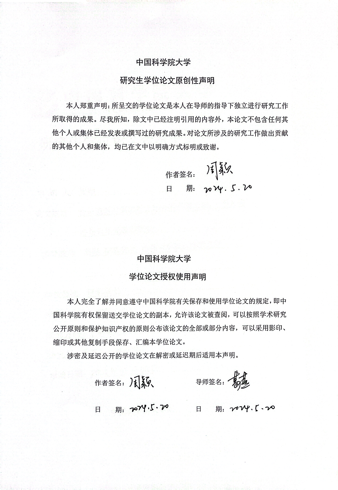

<!-- ===== 原文 第 6 页 ===== -->

<!-- ===== 原文 第 7 页 ===== -->

#### 摘  要

I

#### 摘  要

随着汽车信息娱乐系统的发展和移动音乐流媒体服务的普及，驾驶员在驾 驶过程中听音乐变得更加普遍。这一现象引发了对音乐如何影响驾驶行为和安 全性的关注。然而，音乐对驾驶行为的具体影响仍然是一个复杂和多维度的问 题。音乐元素相互结合塑造了音乐的整体构架，音乐速度和音高被认为是两个 关键的音乐元素，可能会影响人们的情感、认知和行为反应。而个体对音乐的 偏好可能会与音乐产生特定的相互作用，从而影响驾驶行为。因此，本研究将 从个体偏好和音乐属性两个方面入手，在不同驾驶情境下深入探索不同流派音 乐的具体音乐元素对驾驶行为影响的作用机制。 研究一通过对294 名驾驶员的问卷调查，探索了音乐流派偏好、情绪调控 能力和驾驶行为之间的关系。研究结果表明：特定音乐流派的偏好与危险驾驶 行为的频率有关，其中对古典、古乐、爵士和电子乐的偏好得分能够显著正向 预测危险驾驶行为倾向。同时，音乐偏好对驾驶行为的影响受到情绪调控能力 的调节，即情绪调控能力较差的驾驶员，如果偏好重金属、摇滚、说唱、爵士 或电子乐，更可能表现出危险驾驶行为。 研究二在音乐偏好的基础上关注音乐流派和音乐速度对驾驶行为的影响。 以音乐流派偏好（摇滚、古典）为组间变量，音乐流派（摇滚、古典）、音乐 速度（慢、中、快）为组内变量，通过2 个模拟驾驶行为实验分别探究不同音 乐对无风险情境下车辆控制行为的影响和有风险情境下危险规避行为的影响。 结果表明：（1）在情绪体验上，与古典乐相比，摇滚乐显著提升了驾驶员的唤 醒度；慢速音乐下的愉悦度和唤醒度显著低于中速和快速音乐。音乐偏好与流 派间存在交互作用，偏好摇滚的驾驶员在摇滚乐下驾驶时的愉悦度显著更高； 偏好古典的驾驶员在古典乐下的愉悦度显著更高。（2）在驾驶表现上，相比于 古典乐，在摇滚乐下驾驶速度、速度标准差、加速度、油门踏板计数显著更大； 相比于中速和快速的音乐，在慢速音乐下驾驶速度显著最小。（3）无风险情境 中，相比于摇滚乐，在古典乐下的被试跟车任务的一致性系数显著更小、与前 车的时间和距离间隔更大、间隔标准差也显著更大、落后被警告的次数显著更 多。偏好、流派和音乐速度交互效应显著，对于摇滚偏好的驾驶员，相比慢速 的古典乐，在慢速的摇滚乐或快速的古典乐背景下跟车一致性更高。（4）在有 风险情境中，相比摇滚乐，在古典乐下与前车发生碰撞的时间显著更长。偏好 与流派间存在交互效应，对摇滚偏好的驾驶员，在摇滚乐下反应显著快于古典 乐；而对古典偏好的驾驶员，在古典乐下制动时间显著短于摇滚乐。

<!-- ===== 原文 第 8 页 ===== -->

音乐流派对驾驶行为影响的多维分析：个人偏好与音乐元素的影响 II 研究三在音乐偏好的基础上关注音乐流派和音高对驾驶行为的影响。以音 乐流派偏好（摇滚偏好、古典偏好）为组间变量，音乐流派（摇滚、古典）、 音高（调低、原音高、调高）为组内变量，通过2 个模拟驾驶行为实验分别探 究其对无风险情境下车辆控制行为的影响和有风险情境下危险规避行为的影响。 结果表明：（1）认知感受上，相比古典乐，在摇滚乐下的主观分心度显著更高。 风险情境下，相比调高或调低背景，在原音高背景下主观的分心度显著最高。 （2）在情绪体验上，相比于古典乐，在摇滚乐背景下驾驶员的唤醒度显著更高； 存在偏好和流派的交互效应，对于摇滚偏好的驾驶员，相比于古典乐，在摇滚 乐下驾驶时的愉悦度显著更高。（3）驾驶表现上，相比于古典乐，在摇滚乐下 驾驶速度、加速度、油门踏板计数、横向偏移显著更大。风险情境中，原音高 背景下，横向位移标准差显著大于调高或调低条件。（4）无风险情境中，相比 于摇滚乐，在古典乐下与前车时间和距离间隔的标准差显著更大、落后被警告 的次数显著更多。调低音高条件下，跟车时车辆间时间间隔要显著大于原音高 和调高条件。存在流派和音高的交互效应，在古典乐下，原音高背景下跟车的 一致性显著最高；在摇滚乐下，调高音高后跟车一致性显著最高。有风险情境 中，相比古典偏好的驾驶员，摇滚偏好的驾驶员刹车反应时显著更长。原音高 条件下，横向位移标准差显著最大，车辆控制稳定性最差。 综上，本研究探讨了音乐偏好、音乐流派、音乐速度和音高对驾驶的影响。 偏好古典、古乐、爵士和电子音乐的驾驶员表现出更高的危险驾驶行为倾向， 但是良好情绪调节能力能减弱摇滚、说唱、电子、爵士、重金属等音乐偏好对 驾驶行为的影响。音乐流派对驾驶的影响需要考虑情境的特异性。在无风险情 境下，摇滚乐可能有利于驾驶员感知前车速度变化并进行速度调整，但在有风 险情境则可能会损害安全性。另外需要考虑个体偏好及音乐属性的调节，偏好 摇滚的驾驶员在快速、高唤醒的音乐下表现更佳；而偏好古典音乐的驾驶员在 中速音乐下驾驶表现更好。音乐速度影响驾驶员的唤醒水平和驾驶速度，慢速 的音乐会降低驾驶员的唤醒水平和驾驶速度。音高的影响在不同情境下有差异， 无风险情境下，调低音高后不利于跟车表现，调高的摇滚乐有利于驾驶员感知 前车速度变化并及时反应。风险情境下，调整音高有利于提高驾驶员对车辆控 制的稳定性。本研究揭示了音乐流派、音乐速度和音高在不同情境下影响驾驶 行为的作用机理，并理清了个体因素在此过程中的作用，为创建能够根据驾驶 情境和驾驶员个人喜好推荐音乐播放的智能系统提供数据支持，为汽车制造商 和软件开发者提供理论指导。 关键词：音乐流派，音乐偏好，音乐速度，音高，驾驶行为

<!-- ===== 原文 第 9 页 ===== -->

#### Abstract

III

#### Abstract

Given the expansive influence of music on human emotion and behavior, researchers have begun to explore how different musical genres affect drivers' alertness, reaction times, and overall driving performance. These studies have revealed the potential impacts of music selection on driving safety, suggesting that music could be a tool to modulate driving behaviors. Against this backdrop, we delve further into the specific findings from a series of studies on the impact of music on driving. Study 1 explores the relationship between musical genre preferences, emotional regulation capabilities, and driving behaviors through a survey of 294 drivers. It finds that preferences for specific musical genres such as classical, early music, jazz, and electronic music correlate with an increased frequency of risky driving behaviors. Furthermore, the impact of musical preferences on driving behaviors is moderated by emotional regulation abilities; drivers with poor emotional regulation who prefer genres like heavy metal, rock, rap, jazz, or electronic music are more likely to engage in risky driving behaviors. Study 2 investigates the effects of musical genre preferences and music tempo on driving behavior. Using musical genre preferences (rock, classical) as between-group variables and music genre (rock, classical) along with tempo (slow, medium, fast) as within-group variables, the study assesses the impact of different music on vehicle control in non-risky situations and hazard avoidance in risky situations. The results show that rock music significantly enhances driver arousal compared to classical music, and pleasure and arousal are significantly lower under slow tempo compared to medium and fast tempos. There is an interaction effect between musical preferences and genres; drivers who prefer rock experience greater pleasure when listening to rock music, and those who prefer classical music derive more pleasure from classical music. Study 3 delves into the effects of musical genre and pitch on driving behavior. Employing a similar experimental setup, the study examines the influence of musical genre (rock, classical) and pitch (lowered, original, raised) on vehicle control in non- risky scenarios and hazard avoidance in risky scenarios. It reveals that rock music leads to significantly higher subjective distraction compared to classical music in risky situations, particularly at the original pitch level. Preference and genre interactions demonstrate that drivers who prefer rock music exhibit higher arousal under rock music conditions. Overall, the research highlights how musical preferences, genres, tempos, and pitches influence driving. Preferences for certain genres are linked to a higher tendency towards risky driving behaviors, yet effective emotional regulation can mitigate the negative effects of preferences for music styles such as rock, rap, electronic, jazz, and heavy metal. The influence of music on driving varies by context; rock music may be

<!-- ===== 原文 第 10 页 ===== -->

音乐流派对驾驶行为影响的多维分析：个人偏好与音乐元素的影响 IV advantageous in non-risky situations but detrimental in risky ones. This study emphasizes the importance of considering individual preferences and music attributes in driving contexts. The effects of music tempo on arousal and driving speed are significant, with slow tempo music reducing both. The impact of pitch varies by scenario, affecting vehicle control and response times differently. This research provides empirical support for the development of intelligent systems that recommend music based on driving context and driver preferences, offering theoretical guidance for automobile manufacturers and software developers. Key Words: Musical genre, Musical preference, Tempo, Pitch, Driving behaviour

<!-- ===== 原文 第 11 页 ===== -->

#### 目  录

V

#### 目  录

摘  要 .......................................................................................................... I Abstract .................................................................................................... III 目  录 ......................................................................................................... V 图目录 ................................................................................................... VIII 表目录 ....................................................................................................... X 第1 章 研究背景及意义 ........................................................................... 1 第2 章 文献综述 ....................................................................................... 3 2.1 音乐流派对驾驶的影响 ...................................................................................... 3 2.1.1 音乐流派的定义和分类 ............................................................................... 3 2.1.2 音乐流派对驾驶行为的影响 ....................................................................... 5 2.1.3 音乐流派对认知的影响 ............................................................................... 6 2.1.4 小结 ............................................................................................................... 7 2.2 音乐偏好对驾驶的影响 ...................................................................................... 7 2.2.1 音乐偏好 ....................................................................................................... 8 2.2.2 音乐偏好对驾驶的影响 ............................................................................... 9 2.2.3 小结 ............................................................................................................. 10 2.3 音乐感知元素对驾驶的影响 ............................................................................ 11 2.3.1 音高对驾驶的影响 ..................................................................................... 11 2.3.2 音乐速度对驾驶的影响 ............................................................................. 12 2.3.3 小结 ............................................................................................................. 14 2.4 问题提出 ............................................................................................................ 15 第3 章 研究内容与预期目标 ................................................................. 18 第4 章 音乐偏好对驾驶行为的影响 ..................................................... 20 4.1 实验一：音乐偏好对驾驶行为的影响 ............................................................ 20 4.1.1 研究目的 ..................................................................................................... 20 4.1.2 被试 ............................................................................................................. 20 4.1.3 实验材料 ..................................................................................................... 20

<!-- ===== 原文 第 12 页 ===== -->

音乐流派对驾驶行为影响的多维分析：个人偏好与音乐元素的影响 VI 4.1.4 实验流程 ..................................................................................................... 21 4.1.5 实验结果 ..................................................................................................... 21 4.2 小结与讨论 ........................................................................................................ 31 第5 章 研究二：音乐流派和音乐速度对驾驶行为的影响 ................. 33 5.1 实验二：音乐流派和音乐速度对车辆控制的影响 ........................................ 33 5.1.1 研究目的 ..................................................................................................... 33 5.1.2 实验设计 ..................................................................................................... 33 5.1.3 被试 ............................................................................................................. 33 5.1.4 实验材料 ..................................................................................................... 35 5.1.5 实验流程 ..................................................................................................... 36 5.1.6 数据指标 ..................................................................................................... 37 5.1.7 实验结果 ..................................................................................................... 39 5.2 实验三：音乐流派和音乐速度对危险规避的影响 ........................................ 53 5.2.1 研究目的 ..................................................................................................... 53 5.2.2 实验设计 ..................................................................................................... 53 5.2.3 被试 ............................................................................................................. 53 5.2.4 实验材料 ..................................................................................................... 53 5.2.5 实验流程 ..................................................................................................... 55 5.2.6 数据指标 ..................................................................................................... 56 5.2.7 实验结果 ..................................................................................................... 57 5.3 小结与讨论 ........................................................................................................ 68 第6 章 研究三：音乐流派和音高对驾驶行为的影响 ......................... 71 6.1 实验四：音乐流派和音高对车辆控制的影响 ................................................ 71 6.1.1 研究目的 ..................................................................................................... 71 6.1.2 实验设计 ..................................................................................................... 71 6.1.3 被试 ............................................................................................................. 71 6.1.4 实验材料 ..................................................................................................... 71 6.1.5 实验流程 ..................................................................................................... 73 6.1.6 数据指标 ..................................................................................................... 73 6.1.7 实验结果 ..................................................................................................... 73 6.2 实验五：音乐流派和音高对危险规避的影响 ................................................ 86 6.2.1 研究目的 ..................................................................................................... 86

<!-- ===== 原文 第 13 页 ===== -->

#### 目  录

IV 6.2.2 实验设计 ..................................................................................................... 86 6.2.3 被试 ............................................................................................................. 86 6.2.4 实验材料 ..................................................................................................... 86 6.2.5 实验流程 ..................................................................................................... 86 6.2.6 数据指标 ..................................................................................................... 86 6.2.7 实验结果 ..................................................................................................... 88 6.3 小结与讨论 ........................................................................................................ 98 第7 章 总讨论与展望 ........................................................................... 100 7.1 总体讨论 .......................................................................................................... 100 7.1.1 音乐流派偏好与驾驶行为的关系 ........................................................... 100 7.1.2 音乐流派和偏好与驾驶行为的关系 ....................................................... 101 7.1.3 音乐速度对驾驶的影响 ........................................................................... 102 7.1.4 音高对驾驶的影响 ................................................................................... 104 7.1.5 不同音乐条件下的差异 ........................................................................... 105 7.2 局限与展望 ...................................................................................................... 106 7.3 总结论 .............................................................................................................. 107 参考文献 ................................................................................................ 109 附录 ........................................................................................................ 121 驾驶行为问卷 .................................................................................................... 121 情绪调控困难量表简版 .................................................................................... 122 自我情绪评定 .................................................................................................... 123 认知负荷量表 .................................................................................................... 123 致  谢 ...................................................................................................... 125 作者简历及攻读学位期间发表的学术论文与其他相关学术成果 .... 127

<!-- ===== 原文 第 14 页 ===== -->

音乐流派对驾驶行为影响的多维分析：个人偏好与音乐元素的影响 VIII

#### 图目录

图3-1 研究框架图 .............................................................................................. 19 图4-1 情绪调控困难在摇滚偏好与危险驾驶行为关系中的调节作用 .......... 25 图4-2 情绪调控困难在说唱偏好与危险驾驶行为关系中的调节作用 .......... 26 图4-3 情绪调控困难在重金属偏好与危险驾驶行为关系中的调节作用 ...... 28 图4-4 情绪调控困难在说唱偏好与危险驾驶行为关系中的调节作用 .......... 29 图4-5 情绪调控困难在电子偏好与危险驾驶行为关系中的调节作用 .......... 30 图5-1 跟车任务路型图 ...................................................................................... 36 图5-2 跟车任务前车速度变化图 ...................................................................... 36 图5-3 不同音乐流派下跟车任务表现的结果（实验2） ............................... 42 图5-4 偏好、流派和速度交互效应在COH 的结果（实验2） ..................... 42 图5-5 偏好、流派和速度交互效应在Gain 的结果（实验2） ...................... 43 图5-6 不同音乐流派下驾驶表现的结果（实验2） ....................................... 46 图5-7 不同音乐速度下的驾驶表现结果（实验2） ....................................... 46 图5-8 偏好和流派的交互效应在驾驶表现的结果（实验2） ....................... 47 图5-9 不同偏好组在各音乐条件下的驾驶表现结果（实验2） ................... 47 图5-10 不同偏好组在各音乐条件下的认知感受结果（实验2） ................. 48 图5-11 实验2 不同音乐流派下的唤醒度结果 ................................................ 50 图5-12 不同音乐速度下情绪体验结果（实验2） ......................................... 52 图5-13 偏好和流派的交互效应在愉悦度的结果（实验2） ......................... 52 图5-14 不同偏好组在各音乐条件下的情绪体验结果（实验2） ................. 52 图5-15 危险规避任务路型图 ............................................................................ 55 图5-16 不同音乐流派下的TTC 结果（实验3） ............................................ 58 图5-17 偏好和流派的交互效应在任务表现的结果（实验3） ..................... 59 图5-18 不同偏好组在各音乐条件下的反应时结果（实验3） ..................... 59 图5-19 不同音乐流派下跟驾驶表现的结果（实验3） ................................. 59 图5-20 偏好和流派的交互效应在超速时间的结果（实验3） ..................... 60 图5-21 不同偏好组在各音乐条件下的驾驶表现结果（实验3） ................. 60 图5-22 偏好、流派和速度交互效应在分心度的结果（实验3） ................. 61 图5-23 不同偏好组在各音乐条件下的分心度结果（实验3） ..................... 61

<!-- ===== 原文 第 15 页 ===== -->

图表标题 IV 图5-24 不同音乐流派下的唤醒度结果（实验3） ......................................... 61 图5-25 不同音乐速度下的情绪体验结果（实验3） ..................................... 62 图5-26 偏好和流派交互效应在愉悦度的结果（实验3） ............................. 62 图5-27 不同偏好组在各音乐条件下的情绪体验结果（实验3） ................. 62 图6-1 不同音乐流派下的跟车任务表现结果（实验4） ............................... 75 图6-2 不同音高下的IVT 结果（实验4） ....................................................... 75 图6-3 流派和音高交互效应在跟车任务表现的结果（实验4） ................... 76 图6-4 不同音乐偏好组的驾驶表现结果（实验4） ....................................... 76 图6-5 不同音乐流派下的驾驶表现结果（实验4） ....................................... 77 图6-6 流派和音高交互效应在跟车任务表现的结果（实验4） ................... 77 图6-7 不同偏好组在各音乐条件下的驾驶表现结果（实验4） ................... 78 图6-8 不同音乐流派下的分心度结果（实验4） ........................................... 78 图6-9 不同偏好组在各音乐条件下的分心度结果（实验4） ....................... 79 图6-10 不同音乐流派下的唤醒度结果（实验4） ......................................... 79 图6-11 不同偏好组在各音乐条件下的情绪体验结果（实验4） ................. 79 图6-12 不同音乐偏好组的BRT 结果（实验5） ............................................ 88 图6-13 不同偏好组在各音乐条件下的任务表现结果（实验5） ................. 88 图6-14 不同音乐流派下的绝对横向加速度结果（实验5） ......................... 90 图6-15 不同音高下的驾驶表现结果（实验5） ............................................. 91 图6-16 不同偏好组在各音乐条件下的驾驶表现结果（实验5） ................. 91 图6-17 不同音高下的分心度结果（实验5） ................................................. 94 图6-18 不同音乐流派下的唤醒度结果（实验5） ......................................... 96 图6-19 不同偏好组在各音乐条件下的情绪结果（实验5） ......................... 96

<!-- ===== 原文 第 16 页 ===== -->

音乐流派对驾驶行为影响的多维分析：个人偏好与音乐元素的影响 X

#### 表目录

表4-1 实验1 描述性统计和量表内部一致性检验结果 ................................... 22 表4-2 音乐流派偏好与驾驶行为和情绪调控的相关结果 .............................. 23 表4-3 驾驶行为和情绪调控的相关结果 .......................................................... 24 表4-4 情绪调控困难的调节效应分析结果（摇滚音乐偏好） ...................... 25 表4-5 情绪调控水平作为调节变量的分组回归结果（摇滚音乐偏好） ...... 25 表4-6 情绪调控困难的调节效应分析结果（说唱音乐偏好） ...................... 26 表4-7 情绪调控水平作为调节变量的分组回归结果（说唱音乐偏好） ...... 26 表4-8 情绪调控困难的调节效应分析结果（重金属音乐偏好） .................. 28 表4-9 情绪调控水平作为调节变量的分组回归结果（重金属音乐偏好） .. 28 表4-10 情绪调控困难的调节效应分析结果（爵士音乐偏好） .................... 29 表4-11 情绪调控水平作为调节变量的分组回归结果（爵士音乐偏好） .... 29 表4-12 情绪调控困难的调节效应分析结果（电子音乐偏好） .................... 30 表4-13 情绪调控水平作为调节变量的分组回归结果（电子音乐偏好） .... 30 表4-14 情绪调控困难的调节效应分析结果（古典音乐偏好） .................... 31 表4-15 情绪调控困难的调节效应分析结果（古乐音乐偏好） .................... 31 表5-1 实验2 人口学及驾驶相关信息 .............................................................. 34 表5-2 实验2 不同音乐偏好组在古典、摇滚音乐喜好度评分 ...................... 34 表5-3 音乐材料介绍及各水平BPM 值 ............................................................ 35 表5-4 跟车行为指标定义及其计算方式 .......................................................... 38 表5-5 实验2 不同偏好组在各音乐条件下跟车行为指标的描述统计 .......... 40 表5-6 实验2 中跟车任务指标下的方差分析结果 .......................................... 41 表5-7 实验2 不同偏好组在各音乐条件下驾驶行为指标的描述统计 .......... 44 表5-8 实验2 中驾驶行为指标下的方差分析结果 .......................................... 45 表5-9 实验2 不同偏好组在各音乐条件下认知感受指标的描述统计 .......... 49 表5-10 实验2 中认知感受指标下的方差分析结果 ........................................ 49 表5-11 实验2 不同偏好组在各音乐条件下情绪体验指标的描述统计 ........ 51 表5-12 实验2 中情绪体验指标下的方差分析结果 ........................................ 51 表5-13 实验2 人口学及驾驶相关信息 ............................................................ 54 表5-14 实验3 不同音乐偏好组在古典、摇滚音乐喜好度评分 .................... 54 表5-15 危险规避反应行为指标定义及其计算方式 ........................................ 56

<!-- ===== 原文 第 17 页 ===== -->

图表标题 IV 表5-16 实验3 在不同偏好被试在不同音乐条件的反应行为指标描述统计 63 表5-17 实验3 中反应指标下的方差分析结果 ................................................ 63 表5-18 实验3 不同偏好组在各音乐条件下驾驶行为指标的描述统计 ........ 64 表5-19 实验3 中驾驶行为指标下的方差分析结果 ........................................ 65 表5-20 实验3 不同偏好组在各音乐条件下认知感受指标的描述统计 ........ 66 表5-21 实验3 中认知感受指标下的方差分析结果 ........................................ 66 表5-22 实验3 不同偏好组在各音乐条件下情绪体验指标的描述统计 ........ 67 表5-23 实验3 中情绪体验指标下的方差分析结果 ........................................ 67 表6-1 实验4 人口学及驾驶相关信息 .............................................................. 72 表6-2 实验4 不同音乐偏好组在古典、摇滚音乐喜好度评分 ...................... 72 表6-3 实验4 不同偏好组在各音乐条件下驾驶行为指标的描述统计 .......... 80 表6-4 实验4 中跟车任务指标下的方差分析结果 .......................................... 81 表6-5 实验4 不同偏好组在各音乐条件下驾驶行为指标的描述统计 .......... 82 表6-6 实验4 中驾驶行为指标下的方差分析结果 .......................................... 83 表6-7 实验4 不同偏好组在各音乐条件下认知感受指标的描述统计 .......... 84 表6-8 实验4 中认知感受指标下的方差分析结果 .......................................... 84 表6-9 实验4 不同偏好组在各音乐条件下情绪体验指标的描述统计 .......... 85 表6-10 实验4 中情绪体验指标下的方差分析结果 ........................................ 85 表6-11 实验5 人口学及驾驶相关信息 ............................................................ 87 表6-12 实验5 不同音乐偏好组在古典、摇滚音乐喜好度评分 .................... 87 表6-13 实验5 在不同偏好被试在不同音乐条件的反应行为指标描述统计 89 表6-14 实验5 中反应指标下的方差分析结果 ................................................ 89 表6-15 实验5 不同偏好组在各音乐条件下驾驶行为指标的描述统计 ........ 92 表6-16 实验5 中驾驶行为指标下的方差分析结果 ........................................ 93 表6-17 实验5 不同偏好组在各音乐条件下认知感受指标的描述统计 ........ 95 表6-18 实验5 中认知感受指标下的方差分析结果 ........................................ 95 表6-19 实验5 不同偏好组在各音乐条件下情绪体验指标的描述统计 ........ 97 表6-20 实验5 中情绪体验指标下的方差分析结果 ........................................ 97 表7-1 音乐流派和偏好对驾驶影响的结果整理表 ........................................ 103 表7-2 音乐速度对驾驶影响的结果整理表 .................................................... 104 表7-3 音高对驾驶影响的结果整理表 ............................................................ 104 表7-4 对比不同音乐条件下的结果整理表 .................................................... 108

<!-- ===== 原文 第 18 页 ===== -->

<!-- ===== 原文 第 19 页 ===== -->

第1 章 研究背景及意义

### 第1章  研究背景及意义

根据公安部统计，截至2023 年6 月底，全国有5.13 亿人拥有驾驶机动车的 资格，其中汽车驾驶人数是4.75 亿。随着汽车用户数量的增加，人们在驾驶汽 车的过程中获取信息和休闲娱乐的需求也在增加。在驾驶时听音乐是普遍的， 根据中国一项针对车载空间用户收听行为的调查结果显示 (艾瑞咨询, 2022)，86% 用户更喜欢在开车时听音乐，而不是其他类型的音频内容。而在音乐中，流行 音乐是最受欢迎的音乐类型，占比73%，古典乐占比33.9%，偏好摇滚音乐的 也占约25%。以往研究者认为与其它流派相比，摇滚和重金属等会人们似乎会 有更不利的影响，偏好摇滚或重金属，与更高的自杀倾向(Lester & Whipple, 1996)、冒险行为有关(Fischer 等, 2011; Santoso 等, 2013; Shafron & Karno, 2013)。 音乐对驾驶的影响是复杂的。在驾驶时，音乐有积极的影响，据英国一项 调查 (Dibben & Williamson, 2007)，62%驾驶员报告说在听音乐可以放松心情， 使驾驶任务更加舒适，一些驾驶员还表示在驾驶时听音乐有助于保持专注。 Brown 在1965 年提出了“唤醒假说”，主张音乐具有激活作用，能够缓解疲劳 并协助驾驶者维持长时间的警觉性 (Brown, 1965)。研究发现，相比于不听音乐 时的驾驶，听音乐通常有助于提高驾驶安全，包括音乐能消除无聊和疲劳，有 助于调节情绪和减少攻击性驾驶 (Clarke 等, 2010; Dibben & Williamson, 2007)。 音乐还能提高驾驶员的唤醒度，促使他们更加集中注意力 (Ünal 等, 2012a)。 然而，驾驶时听音乐也可能产生危害。据调查结果，肇事驾驶员回忆事故 情境时，往往报告当时正在听大音量、快速度的音乐 (Dibben & Williamson, 2007)。Turner 提出了"分心假设"（distraction hypothesis），认为音乐可能会导 致驾驶员的注意力分散，临时性地降低驾驶员对危险的感知 (Turner 等, 1996)， 从而提高了发生事故的可能性 (Slawinski & MacNeil, 2002)。其他的研究也表明， 背景音乐可能导致注意力分散并增加心理负荷，相比没有音乐的驾驶，这可能 让驾驶员更容易犯驾驶错误、违反交通规则，采取危险的驾驶行为或激进的驾 驶行为 (Brodsky, 2001; Brodsky & Kizner, 2012; Brodsky & Slor, 2013)。 驾驶员很容易受到音乐的影响，从而改变他们的心理状态，进一步影响他 们的驾驶行为 (Hughes 等, 2013)。研究发现驾驶者在听音乐时，他们的脑力负荷 会增加。然而，这种增加的脑力负荷也可以被视为一种认知补偿策略，有助于 驾驶员更好地应对驾驶任务，避免危险行为 (Ünal 等, 2012b)。另一方面，音乐 与驾驶的结合可能会导致驾驶行为不稳定，甚至可能造成危险 (Wark等, 2002)。 音乐对驾驶行为的具体影响是一个复杂和多维度的问题，需要考虑到个体、 音乐属性、情境等因素深入探究。个体差异上，每个人都有独特的心理和生理

<!-- ===== 原文 第 20 页 ===== -->

音乐流派对驾驶行为影响的多维分析：个人偏好与音乐元素的影响 反应机制，以及不同的流派和偏好。这些因素可能会与音乐产生特定的相互作 用，影响驾驶行为。音乐元素相互结合塑造了音乐的整体构架，音乐速度和音 高被认为是两个关键的音乐元素，可能会影响人们的情感、认知和生理反应。 驾驶情境具有多样性和复杂性，这些因素可能与音乐相互作用，共同影响驾驶 行为。摇滚、古典和流行音乐是广泛受欢迎的音乐流派，经常在驾驶环境中出 现，它们都是现代都市文化的一部分，可能在驾驶场景中产生重要影响。系统 探究音乐流派驾驶的影响，可深入了解音乐对驾驶的影响机制。此外，研究结 果可以为汽车制造商和软件开发者提供指导，有助于创建能够根据驾驶情境和 驾驶员个人喜好调整音乐选择的系统。

<!-- ===== 原文 第 21 页 ===== -->

第2 章 文献综述

### 第2章  文献综述

音乐是在时间维度组织起来的声音、用于或被知觉为一种美学体验 (Dowling, 2001)。关于音乐对驾驶的影响，有不同的观点。有的研究者认为驾驶 过程中听音乐不会损害驾驶安全(Ünal等, 2012a)，而有的研究者则认为音乐会损 害驾驶安全(Turner 等, 1996)。在欣赏音乐时，注意力功能的作用过程可以分为 自上而下的注意过程（Top-down attention）和自下而上的注意过程（Bottom-up attention） (LaBerge, 1995)。当音乐信息符合听众的现有知识或期望时，听觉皮 层内的注意力会增强，这是自上而下的注意过程。当突然从外部传来强烈的音 乐刺激时，听众会对音乐刺激产生注意，这是自下而上的注意过程。集中注意 力于音乐所蕴含的内容则是自上而下的注意过程，而集中注意力于音乐的源头 是自下而上的注意过程(Park, 2004)。自上而下的过程是通过使用个体先前的知 识和期望来深入理解音乐，包括对个人的偏好和音乐流派的分析等。相对地， 自下而上的过程主要是被音乐的基本元素所吸引，而不需要深入地分析或理解 音乐背后的含义。因此，为了更深入地理解音乐对驾驶行为的影响，研究应从 音乐欣赏注意过程的两个角度进行。 音乐流派和音乐偏好可能影响驾驶员对音乐整体的感知和认知处理，进而 影响驾驶行为。同时，音乐的基本元素作为外部刺激，可能通过自下而上的注 意力过程直接影响驾驶员的反应和决策。综合这两个注意过程的研究，可以帮 助我们更全面地理解音乐对驾驶安全的潜在影响。

### 2.1 音乐流派对驾驶的影响

#### 2.1.1 音乐流派的定义和分类

音乐流派是根据各自独特的时代背景、地理位置和文化特征演化而来的不 同音乐风格类别，这些风格通过其特定的音乐元素和独到的组织方式，展现了 显著的个性特征，形成了众多音乐流派，如爵士、古典和摇滚等 (刘寅, 2011)。 音乐风格是音乐的内在属性，是通过各种音乐元素如旋律、节奏、音色等组合 而成的，是对音乐现象的一种形式特色的归纳与总结，是指比较稳定、共性的 音乐形式、音乐样态 (王虹霞, 2017)。它反映了音乐家对音乐的个人理解和创造 性，也是文化、历史和社会背景的产物 (张文亚, 2019)，通常反映了一组具有相 同情感解读的歌曲，提供了对情感的重要描述(Shan 等, 2002; Shan & Kuo, 2003) 。 古典流派、爵士流派、摇滚流派、乡村音乐、流行流派是较为主流划分的音乐 流派。

<!-- ===== 原文 第 22 页 ===== -->

音乐流派对驾驶行为影响的多维分析：个人偏好与音乐元素的影响 古典（Classic）音乐是指从自西方中世纪至当代，在欧洲文化主流环境下 产生的音乐作品，以及那些深植于西方的宗教仪式音乐与世俗音乐传统之中的 作品，跨越自大约公元9 世纪至现代的时期。这类音乐因其创作上的复杂性和 深刻含义而与流行音乐和民谣音乐区分开来。在更狭义的范围内，古典音乐特 指1750年至1830年间，以海顿、莫扎特、贝多芬为核心人物的德奥音乐时期， 这一时期亦称作“维也纳古典派”音乐时代 (张宇航, 2014)。古典音乐的特点是： 在节奏上速度稳定，变化不多。主要采用均分节奏，规整节拍较多，强弱拍子 明显且具有规律性；在旋律上工整、对称，强弱转变丰富，常使用渐强和渐弱。 一首曲子里有主旋律线和副旋律线，两者互相配合；在曲式结构上常使用固定 的分解和弦，和声织体清晰, 曲式结构严谨、分明；在乐器使用上，弦乐包括小 提琴、大提琴、竖琴等；管乐包括长号、小号、双簧管、长笛等；键盘乐器包 括钢琴、管风琴等；打击乐包括定音鼓、小鼓等 (张宇航, 2014)。 爵士（Jazz）音乐是一种源自19 世纪末20 世纪初的美国音乐形式。它的根 源主要来自布鲁斯（Blues）和拉格泰姆（Ragtime），并受到欧洲白人和非洲 黑人音乐传统的深刻影响。爵士乐最初在新奥尔良兴起，后来在芝加哥、纽约 等地进一步发展 (张文亚, 2019)。爵士乐的特点是，节奏复杂，多三连音，常使 用切分节奏、摇摆节奏-有力顿挫和"爵士八分节奏"-轻盈跳跃，这些都贡献了独 特的节奏质感，并且这些节奏常常是由鼓手或贝斯手来维持，会让听众感觉是 “细碎的节拍”；在音高和音色上，演奏者会通过颤音、滑音和其他装饰音来增 加音乐的表现力和情感深度。颤音是极具变化的, 其变化方向多由窄到宽、由慢 到快。演奏开始时, 从第一个音节开始, 爵士乐的演奏者们会从下到上进行滑音, 达到预定的音域高度, 当这段音节结束, 又会从原有音域高度向下滑音, 以表现出 爵士乐独有的特色；在和声上，爵士乐常使用高度复杂的和弦结构，如九和弦、 十一和弦和十三和弦等（一个和弦有六七个音）；乐器使用上，常用萨克斯、 长号、小号、钢琴、吉他等 (张文博, 2017)。 摇滚（Rock），英国Collins Cobuild 英语词典定义摇滚是一种音乐，具有 简单的曲调和非常强烈的节奏，通常由一小群使用电吉他和鼓的人大声演奏和 演唱的音乐，而加拿大政府将“摇滚和摇滚导向的音乐”定义为以强烈的节拍、 使用蓝调形式以及如电吉他、电贝斯、电风琴或电钢琴等摇滚乐器的存在为特 点的音乐 (Frith, 2023)。摇滚音乐有广义和狭义之分，狭义指 50 年代的早期摇 滚流派，可译作“早期摇滚乐”，广义则被继续用來指代其后数十年间在早期摇 滚乐的直接影响之下产生出的众多不同流派，如朋克、电子乐之类 (刘小山, 2000)，在本研究中，摇滚乐指的是狭义的摇滚乐。摇滚乐的特点是：在节奏上， 节奏强劲，以四四拍为主，频繁使用反拍重音效果，强调四四拍中第二拍和第 四拍的力度，并且常用切分节奏，每一个切分节奏的运用之间往往会有明确的 间隔，切分音的运用是为了加强重音、加强节奏感；在旋律上，旋律拘束性相

<!-- ===== 原文 第 23 页 ===== -->

第2 章 文献综述 对较小，多样性较高，通常直接，易于记忆；在和声上，主要使用三和弦和七 和弦，通常相对简单，以增强旋律和节奏的影响；在乐器使用上，核心是使用 （电）吉他、（电）贝斯、键盘和鼓 (单晶晶, 2015; 莫大尼, 2016; 周圣丰, 2014)。 乡村（Country）音乐是美国白人流行音乐的代表，结构相对简单，旋律流 畅朗朗上口。它是美国中南部山区白人对欧洲传统民俗文化的继承和发展，如 欧洲民歌、民间舞蹈等。20 世纪20 年代以前，乡村音乐主要传播于中南美洲的 山区，后来通过广播等形式传播，向城市发展 (杨丁子, 2019)。乡村音乐的特点 是：在节奏上，节奏轻快、规整。速度平稳，多用四二拍、四三拍、四四拍的 节拍，很少使用强弱规律复杂的节拍；在旋律上，一般以八分音符和四分音符 为主，偶尔会使用附点节奏来丰富旋律和节奏；在曲式结构上，较为简单, 多为 歌谣体、二部曲式或三部曲式，歌谣体简短而押韵；二部曲式由两个乐段构成, 第一乐段在音乐上具有鲜明的初步陈述性质, 材料简单, 结构方整, 第二乐段则具 有再现性或对比性；三部曲式由两个同等重要的曲体和一段强烈对比的曲体构 成, 形成ABA 的构造, 具有较强的传唱性；在乐器上，主要有小提琴、班卓琴和 吉他三种 (范誉丹, 2017; 杨丁子, 2019)。 流行（Pop）音乐也有广义和狭义之分。广义的流行音乐是指我们最常接触 的，比如摇滚、民谣、嘻哈和说唱，这些都可以归类为流行音乐，因为这些音 乐往往是商业性的，以娱乐为目的，所以被称为流行音乐。在狭义上，流行音 乐指的是一种音乐流派，与摇滚和爵士乐等其他流派并列 (孙滨, 2020)。在本研 究中，流行音乐是狭义定义的流行音乐，特点是：在节奏上，节奏简单，往往 有明确的节奏元素，如鼓点或其他打击乐器，以及明确的强拍和弱拍；在旋律 上，旋律简单，且突出了旋律声部，而弱化了其他声部的功能，听众在听音乐 时就会格外注意听旋律声部，而轻视甚至无视其他声部；在曲式结构上，最多 使用主副歌结构，副歌作为音轨的一部分，其目的是通过简单的音乐和歌词重 复来留住人们的耳朵；在主题上，侧重于简单的主题，通常是爱情和浪漫的关 系 (孙滨, 2020; Frith 等, 2001; Wildridge, 2019)。

#### 2.1.2 音乐流派对驾驶行为的影响

考虑到音乐对人类情绪和行为的广泛影响，研究人员已经开始探究不同音 乐流派如何影响驾驶员的警觉性、反应时间和整体驾驶性能。这些研究揭示了 音乐选择对驾驶安全的潜在影响，并指出音乐可能作为一种调节驾驶行为的工 具。在此背景下，我们将进一步探讨一系列研究中音乐对驾驶影响的具体发现。 Dalton 等 (2007) 对比了摇滚音乐和古典音乐对驾驶时警惕反应的影响，让 驾驶员完成2 个任务，首先是警惕任务，当一个目标灯泡亮起时，被试需要把 脚从一个踏板上移开，去踩另一个踏板，记录做出反应以及完成一系列动作的 时间。其次是判断任务，在干扰刺激下，让被试对目标刺激进行判断。结果发

<!-- ===== 原文 第 24 页 ===== -->

音乐流派对驾驶行为影响的多维分析：个人偏好与音乐元素的影响 现在摇滚音乐背景下，驾驶员的反应比在无音乐条件下更快。Beh 和 Hirst (1999) 的研究中发现与无音乐相比，在重金属音乐背景下，驾驶员对红绿灯、警觉、 跟踪目标的认知任务反应更快。Niu 等 (2020)对比了古典和流行音乐对驾驶的影 响，从跟车任务的结果中发现，在流行音乐下，驾驶员的平均瞳径更大，速度 标准差更小，这说明流行音乐相比古典音乐更能让驾驶员集中，驾驶性能更稳 定。Febriandirza 等 (2017)的研究对比了多个不同的音乐类别，包括古典、轻音 乐、自然音乐、硬摇滚，结果发现相比于古典音乐、轻音乐和自然音乐，在摇 滚音乐下，驾驶员对车辆稳定性控制最差，注意力最差，享受度最低，无音乐 条件与摇滚乐条件下表现结果差异不大。在所有音乐条件下，自然音乐下的驾 驶稳定性、注意力和主观享受都是最高的。Wen 等 (2019)对比了摇滚乐和轻音 乐对驾驶的影响，因此让模拟了日常郊区高速公路的道路场景，让参与者在不 同音乐条件下进行模拟驾驶，结果发现在摇滚音乐下，驾驶员的心理负荷更大， 速度标准差和越线频率都显著高于轻音乐和无音乐条件。另外还考虑了驾驶员 气质的影响，发现摇滚乐对胆汁质和多血质的驾驶员影响更大，在摇滚乐下心 率更快、驾驶稳定性更差。Babić 等 (2021)在模拟驾驶研究中对比了5 种不同流 派的音乐后，发现相比于流行乐和古典乐，在金属音乐和巴尔干民间音乐（更 激进、节奏更快）条件下，表现出的驾驶风险性更高，表现为驾驶员不看路标 的比例更高、驾驶速度更快、有更多的驾驶错误、偏离和碰撞。Amirah 和 Puspasari (2019)重点关注流行音乐对驾驶的影响，在模拟实验中关注了长时间 无音乐驾驶后，流行音乐的加入对驾驶员的影响，记录了驾驶员的脑电波数据， 结果发现流行音乐能够有效缓解驾驶疲劳，但是持续时间不是长久的。另外他 们还对比了不同年龄组的差异，发现流行音乐对缓解年轻驾驶员疲劳更有效。 以上研究表明，音乐流派对驾驶行为和性能有显著影响。摇滚音乐和重金属音 乐背景下，驾驶员的反应时间较快，但这些音乐类型也可能导致驾驶稳定性减 弱和注意力下降。相比之下，流行音乐似乎能够提升驾驶员的集中度，并有助 于缓解疲劳，从而稳定驾驶性能。然而，喜好节奏快、活力强的音乐的驾驶员， 在驾驶中可能表现出更多冒险行为和危险性。这些研究结果强调了音乐选择对 驾驶安全的重要性，建议驾驶员选择合适的音乐以支持更安全的驾驶行为。

#### 2.1.3 音乐流派对认知的影响

驾驶任务是复杂的感知-信息-处理任务，需要感知、识别、选择和反应等 过程 (Banbury, 2021; Broadbent, 1958; Welford, 1976; Wickens 等, 2015)。在处理 外界信息、进行驾驶等方面都需要依赖认知能力。音乐对这些认知功能的影响 将直接或间接地影响驾驶表现。通过研究音乐对认知的影响，我们可以更全面 地了解它如何影响驾驶行为。

<!-- ===== 原文 第 25 页 ===== -->

第2 章 文献综述 研究发现，不同流派的背景音乐也会对人们的认知和行为产生影响。 Bugter 和 Carden (2012) 发现不同流派的背景音乐会对人们的记忆产生影响，在 说唱音乐下被试记忆任务表现最好，古典音乐组表现最差，无声组表现居中， 这可能是因为古典音乐下被试的注意力更不集中。Angel 等 (2010)发现相比于无 音乐，古典音乐下能够提高个体的空间处理速度和语言处理准确性，认知任务 表现更好。但是，另有研究者发现相比于无音乐条件，在古典音乐和重金属音 乐下，人们回忆记忆单词数更少 (Theofilidis 等, 2020)。 Corhan 和 Gounard  (1976) 发现被试在摇滚音乐下完成信号检测任务的准确率要显著好于在轻音乐条件下， 可能说明摇滚音乐可以帮助促进个体的警觉注意和反应。

#### 2.1.4 小结

综上所述，音乐流派对驾驶员的行为和性能产生重要影响。摇滚和古典是 特点鲜明的两个经典音乐流派。以往研究者在探究不同的流派对驾驶的影响时， 也会更多的关注摇滚和古典乐的影响。但是在研究中关于古典和摇滚对驾驶安 全是促进还是损害有不一致的结论。有研究发现摇滚和重金属音乐能加快驾驶 员的反应时间，在古典乐下的反应更慢。但其他研究者确发现在摇滚乐可能会 降低驾驶稳定性和注意力，而在古典乐下驾驶的稳定性会更高。结论不一致的 原因可能在于研究者关注的情境和变量是不同的。因此，有必要深入研究摇滚 和古典音乐对驾驶的具体影响，了解这两种音乐流派如何在不同的驾驶情境中 影响驾驶员的行为和性能，从而为驾驶员提供更安全的音乐选择建议。

### 2.2 音乐偏好对驾驶的影响

有研究发现，驾驶员的特质、偏好似乎也会影响音乐对驾驶的作用。有研 究探究了内、外向驾驶员在不同音乐条件下的驾驶表现，设置了城市模拟驾驶 情境，由专家对每名驾驶员的表现进行驾驶风险指数的打分，结果发现内向的 人在慢速音乐下，风险指数是要显著低于外向的人，而外向的驾驶员在快速音 乐下风险指数更低 (Karageorghis 等, 2021)。区分驾驶员的气质类型发现粘液质 的驾驶员受到音乐的影响较小，而胆汁质、多血质的驾驶员在听音乐时更容易 分心，车辆控制更差 (Wen 等, 2019)。Niu 等 (2020)在探究音乐流派和音乐速度 对跟车行为的影响中，就考虑了驾驶员个性特点的差异，结果就发现对于内向 的驾驶员更容易受到音乐流派的影响，内向驾驶员在慢速或古典音乐下的驾驶 表现更稳定，记忆力更集中。这些结果说明在探究音乐对驾驶的影响时，需要 考虑驾驶员的个体差异，不同的驾驶员对音乐的反应可能不相同，这直接影响 他们在听音乐时的驾驶行为和风险指数。许多研究在关注音乐的影响时发现， 音乐偏好在其中有重要的影响 (Mcdonald, 2013; Perham & Vizard, 2011; Schellenberg, 2005)。

<!-- ===== 原文 第 26 页 ===== -->

音乐流派对驾驶行为影响的多维分析：个人偏好与音乐元素的影响

#### 2.2.1 音乐偏好

个体被吸引到满足和强化他们心理需求的音乐流派中(Nave 等, 2018)。人们 如果对某类音乐有偏好，那么在日常中更可能倾向于收听该类音乐，受到该类 音乐的影响更大。已经有许多研究者对于音乐偏好的结构进行了研究， Rentfrow 和Gosling (2003) 根据14 类音乐流派建立了音乐偏好四因素模型，而 George 等人(2007) 在30 类音乐流派中建立了八因素模型；之后Rentfrow 等人又 经过一系列广泛音乐流派的研究，确定了针对西方音乐较稳健的五因素模型 (Rentfrow, Goldberg, & Zilca, 2011; Rentfrow 等, 2012a)。包括是甜美性（Mellow） 特质，它在音乐中的体现是节奏放缓和旋律的宁静，同时排除了失真的元素。 在心理感受上，这种音乐往往带来一种浪漫和轻松的氛围，它不倾向于表达攻 击性或悲伤，反而能够激发深思。音乐类型上，软摇滚（Soft Rock）、安静风 暴（Quiet Storm）以及成人当代音乐（Adult Contemporary）是这一特质的代表。 接着是朴素性（Unpretentious）特质，其音乐作品通常避免使用失真和过于复 杂的电子元素，节奏亦不迅速。这种音乐风格在心理上通常能带来一种带有轻 微忧伤的浪漫和放松感，但不包含攻击性或过分复杂的感知。乡村音乐 （Country Music）就属于这一类。而复杂性（Sophisticated）特质的音乐，则更 倾向于庄严的器乐，它不包含电子和打击乐元素，也不显得喧闹。在心理感受 上，这类音乐通常被视为具有智慧和启发性，同时也兼具放松和浪漫，但不带 有侵略性。典型的流派包括古典音乐（Classical）、军乐（Marching Band）、 前卫古典（Avant-Garde Classical）、波尔卡（Polka）、世界节奏（World Beat）、传统爵士（Traditional Jazz）以及凯尔特音乐（Celtic）。强力性 （Intense）特质的音乐则是激烈、失真的，并含有电子和打击乐成分，节奏紧 凑。这类音乐在心理上通常给人一种具有侵略性的感觉，并不带有浪漫和放松 的元素，也不提供智慧或启发。相关的音乐流派包括经典摇滚（Classic Rock）、 朋克（Punk）、重金属（Heavy Metal）和强力流行（Power Pop）。最后是现代 性（Contemporary）特质，这类音乐以敲击乐和电子乐为特点。它们不倾向于 激发听者的忧伤情绪，典型的类型包括说唱（Rap）、电子乐 (Electronica）、 拉丁舞曲（Latin）、酸性爵士 （Acid Jazz）和欧洲流行乐 (Euro Pop)。 许多研究都发现对音乐的偏好与个体差异进行有关(Rentfrow & Gosling, 2003)。有研究探究了音乐偏好和共情之间的关联，通过对音乐曲目的偏好打分 来标记个体的音乐偏好，结果发现共情型个体更喜欢低唤醒调性（温柔，温暖， 感性属性）的音乐，而理性系统型的个体更喜欢高唤醒调性（强烈，紧张和惊 险）的音乐 (Greenberg 等, 2015)。Nave 等人认为(2018)在预测人格特质时，音乐 偏好是一个重要的预测因素，它可以超越性别和年龄的基线模型，发现对于五 个人格特质中的所有特质，包括开放性、外向性、宜人性、神经质和责任心，

<!-- ===== 原文 第 27 页 ===== -->

第2 章 文献综述 添加音乐偏好显著提高了预测准确性，并且还发现了对于复杂音乐（包括古典 和蓝调等）的偏好与开放性正相关。但是对于摇滚音乐流派偏好的研究结果在 以往研究中呈现出了不一致的结论，North 等(2005)将说唱、新金属、嘻哈和摇 滚等音乐定义为问题风格音乐，并且对比了偏好和不偏好该类音乐的人在精神 质水平和异常行为上的差异，结果发现偏好问题音乐的人在精神质得分上显著 更高，并且有显著更高的使用大麻、酗酒和在公共场合携带武器的倾向。 Rentfrow 等人(2003)将摇滚、另类音乐、重金属3 个流派的音乐归为一个因素， 命名为强烈&反叛维度，并发现该维度与新体验开放性、运动能力、自我感觉 智力和语言能力呈正相关，但是没有发现喜欢这个维度音乐的人表现出神经质 或不合群的迹象。不一致的结果可能是因为在各自研究中音乐偏好结构不一致， North 定义的问题音乐（嘻哈和说唱）在Rentfrow 的研究里被归为了能量&节奏 维度，并且他们发现对能量&节奏音乐的偏好与冲动性有相关。现有的研究在 探讨音乐流派偏好对驾驶行为的影响时，往往将不同流派的音乐归类为较大的 维度，这可能掩盖了特定流派对个体行为的独特影响。由此可见，要更精确地 理解音乐如何影响驾驶行为，我们需要细化研究方法，对个体对各个具体音乐 流派的偏好进行更详细的测量，而不是将它们简单归纳为广泛的类别或维度。 通过这种方式，我们可以揭示更细致的关系，如特定音乐流派如何影响驾驶员

#### 2.2.2 音乐偏好对驾驶的影响

另有研究还发现音乐偏好对驾驶的影响。有研究者基于速度和偏好两个变 量，将音乐分为了快速高偏好、快速低偏好、慢速高偏好和慢速低偏好四类， 并且从音乐集中挑选出了代表四个类别的音乐材料，研究不同类音乐对驾驶员 困倦的影响，记录了驾驶员在模拟驾驶场景下的主观、生理和驾驶数据，结果 发现在高偏好且快速的背景音乐才能提高驾驶员在疲劳下的唤醒度和警觉，车 辆横向控制要显著优于在低偏好且慢速度下的音乐条件 (Hasegawa & Oguri, 2006) 。Cassidy 等人在探究音乐对时间感知和驾驶游戏表现的研究中，考虑了7 中不同的音乐条件，包括从音乐集中挑选的高唤醒快速、高唤醒慢速、低唤醒 快速和低唤醒慢速4 种，还有无音乐、汽车引擎以及让被试带来了一首他们自 己选择的音乐。对比不同的音乐条件下的结果发现，在自我选择的音乐背景下， 驾驶员不仅在躲避障碍物方面表现得更准确，还在主观报告中显示出更高的愉 悦度和集中度 (Cassidy & MacDonald, 2010)。Navarro 等(2018)让被试自己选择喜 欢的音乐作为背景音乐，之后在模拟驾驶器中完成跟车任务，结果发现相比于 无音乐，在偏好音乐下的跟车一致性系数更高，跟车表现更好，心率更高，主 观唤醒度也更高。更高的感觉寻求、冒险行为倾向的个体在驾驶中的危险性也 会更高 (Zhang 等, 2019)，研究调查通过青少年主观报告对摇滚乐的偏好和感觉 寻求问卷，发现对摇滚乐音乐偏好与感觉寻求有关，对摇滚音乐的偏好的人与

<!-- ===== 原文 第 28 页 ===== -->

音乐流派对驾驶行为影响的多维分析：个人偏好与音乐元素的影响 更高的感觉寻求。以往研究只是对流派标签偏好进行了报告，而每个人对流派 标签的理解会有差异，Yosephine 进一步改进对音乐偏好的测量，参考了 Rentfrow 开发的通过对音乐片段评分来评估个体的音乐偏好，结果发现青少年 对强烈和反叛的音乐偏好（如摇滚和金属乐）与冒险行为倾向（如超速）有正 相关 (Yosephine 等, 2020)。North 将重金属、说唱等音乐标定为“问题音乐”， 并且调查发现越喜欢问题音乐的人更可能展现出高风险行为的倾向，包括精神 质的问题和各种反社会行为(North 等, 2005)。由于早期的研究往往将多个音乐流 派归为一类，这可能掩盖了某些流派在特定方面的独特影响。驾驶心理学领域 尚未有研究深入探讨音乐流派偏好对驾驶行为的具体影响，因此，需要进一步 的研究。 此外，驾驶员的情绪调控能力，可能在音乐偏好对驾驶影响中有着关键作 用。音乐影响着情绪调控，听音乐可以作为一种潜在的强有力的情绪调节手段， 诱发、调节情绪 (Brattico & Pearce, 2013)。但是即使是听同类音乐，对情绪调控 能力不同的个体影响也是不同的。健康人群的研究发现，听消极情绪的音乐能 提供安慰感 (Saarikallio & Erkkilä, 2007)、并增进对情绪状态的洞察力 (Skånland, 2013)。相对地，抑郁人群在聆听消极情绪音乐时，可能与更高的反刍、社会隔 离感和情绪调节失败相关联 (McFerran & Saarikallio, 2014)。情绪调控能力也被 发现对驾驶有影响，情绪调控影响个体对音乐的反应，以及他们在驾驶时的情 绪状态 (Hayley 等, 2017; Trógolo 等, 2014)。研究发现情绪调控能力较差的个体 更易于采取冒险和焦虑的驾驶风格 (Navon – Eyal & Taubman – Ben-Ari, 2020)， 有更多的危险驾驶行为 (Šeibokaitė 等, 2017)。

#### 2.2.3 小结

个体倾向于选择那些能够强化其心理需求的音乐流派，然而，对于如何理 解和评估音乐偏好对驾驶行为影响的研究还没有。早期研究往往将多个音乐流 派归为一类，从而可能忽略了某些流派在特定方面的独特作用。因此，我们需 要更深入的研究，细化对不同音乐流派偏好的测量，探索它们对驾驶行为的具 体影响。同时，情绪调控能力作为个体差异的一部分，也可能在音乐偏好影响 驾驶行为的过程中起到关键作用。已有研究表明，情绪调控能力较差的个体在 驾驶时可能采取更加冒险和焦虑的驾驶风格，增加了驾驶风险。这一发现强调 了在探究音乐偏好对驾驶行为影响时，不仅需要考虑音乐流派本身，还需评估 驾驶员的情绪调控能力。因此，未来的研究应当对驾驶员的音乐流派偏好进行 更细致的分类和测量，以确定不同小类音乐流派如何影响驾驶行为和性能。关 于音乐偏好、情绪调控和驾驶行为之间的关系没有研究者着重关注过，也需要 进一步进行探究。

<!-- ===== 原文 第 29 页 ===== -->

第2 章 文献综述

### 2.3 音乐感知元素对驾驶的影响

音乐感知的基本元素有音高、音色、节奏和响度 (Nussbaum, 2015)，这四种 基本要素的相互结合塑造了音乐整体的构架 (陈玉田, 2022)。从自下而上的过程 来看，音乐的听觉感知过程包括了从物理上检测组成音乐的声音，获取关于声 音的信息，到理解声音的含义的所有过程 (Jeong, 2005)。这个过程大致可以分为 三个阶段：第一阶段是从外部发出的声音以振动的形式到达我们的听觉器官— —耳朵，并使耳膜共振的过程。第二阶段是声音的振动被传递到耳内的听觉神 经，并被感知为一个音符的过程。在这个过程中，声音的物理和声学特性会被 分析。最后，第三阶段是关于音符的信息被收集和理解的认知过程。在对各种 音乐元素的听觉信息充分收集后，听到的声音会被赋予意义。 Peretz 等人(2005)认为在音乐感知过程中，音乐首先是作为一个声音刺激输 入，首先要经过一个声音分析模块。听觉音乐输入由两个具有特定功能的并行 独立系统进行分析：一个系统针对旋律维度（由声音频率的连续变化定义）， 包括了轮廓（音乐的音高变化）、音阶和音程；一个系统针对时间维度（由声 音持续时间的顺序变化定义）的系统，包括分组和规律性分析。Peretz的音乐模 型强调了音乐的空间和时间变化两个维度。结合音乐感知的基本元素来看，空 间即音高，时间即节奏。

#### 2.3.1 音高对驾驶的影响

音高是音乐的一个重要方面，在文学作品中被认为是最主要的音乐特征之 一 (Karydis, 2006)。它是一个知觉属性，声音可以按频率相关的尺度进行组织 (Haynes & Cooke, 2001)，声波频率越快，音高越高。音高是耳朵判断的音调的 基本频率，尽管它具有主观性，且需要考虑到谐波的存在。研究发现音高对人 们的情绪、认知和行为都会有影响。情绪上，研究发现相比在低音条件下，在 高音下被试在完成身体运动任务时，主观唤醒度更高、觉得更轻松和愉快(Ley- Flores 等, 2022)。李俊秋 (2022)使用音乐软件对曲子进行音高调整，向上调高一 个八度和向下调高一个八度后（1200 音分），对比被试在不同音高下的情绪状 态，发现在高八度条件下，愉悦度和唤醒度显著高于低八度条件。音高于情绪 的愉悦和唤醒之间可能存在正向关系。 Spence 提出来一个“跨模态对应”，是指一种感官所感知的刺激与另一种 感官模态的感官体验之间的感知兼容性 (Spence, 2011)。音高作为声音的一种关 键属性，被发现会影响与声音无关的感知。研究者就曾经发现在高音下，人们 会有更明亮的感觉 (Marks 等, 1987) 。Lowe 等人对音乐进行了音高调整,使用软 件对音乐的整体音高进行了调整，分别提高了100 音分和降低了200 音分。对 比了调低、原音高和调高三种条件，个体对同一物体尺寸的感知，结果发现在 高音下，人们感知物体的尺寸会更小，而在低音下会更大 (Lowe & Haws, 2017)。

<!-- ===== 原文 第 30 页 ===== -->

音乐流派对驾驶行为影响的多维分析：个人偏好与音乐元素的影响 这种特殊的感官联想可能源于高音代表了更快的频率，而尺寸更小的物体振动 起来的频率也会更大，由此将音高和尺寸联系起来 (Plack & Oxenham, 2005)。 Sunaga (2018)同样也是对音乐的音高进行了调整（调高和调低），对比在高、 中和低三种条件下对音源距离感知的影响，结果发现在更低的背景音乐下不仅 会认为声源更远；还会影响加大感知的心理距离。另外从喜爱评分的结果来看， 也是发现参与者对更不喜欢更低的音乐，也可能是音乐对于低音更不喜欢加大 了心理距离，所以感知的距离也会更远。Zhang 等 (2021)设计任务是让被试去控 制挡板，目标是阻挡掉落的小球。结果发现在高音下，被试感知小球掉落的速 度更快，更快的释放出挡板。LeyFlores 发现了音高还能影响运动控制，在高音 下，被试抬起手臂更快、更高 (Ley-Flores 等, 2022)。 以上研究表明，音高能够影响个体的情绪和认知（特别是感知觉），而在 交通心理学领域里驾驶员的情绪状态和认知能力被认为是影响交通安全的重要 因素。情绪上，在驾驶过程中的消极或积极情绪都有可能对驾驶安全造成不良 影响 (林燕, 2016)，有研究者通过研究驾驶员在安静、悲伤、高兴和愤怒四种情 况下的驾驶表现，发现在高兴和愤怒的情绪下，驾驶员有更高的危险驾驶倾向 (程静 & 张艺, 2019)。另有研究者研究了情绪的唤醒和效价对驾驶的影响，结果 发现高效价高唤醒度和低效价高唤醒度的情绪下，驾驶员有危险驾驶的倾向， 安全性更低 (陈麒元, 2014)。认知上，驾驶员的空间感知能力在驾驶汽车的过程 中十分重要 (孙帅, 2017)，以往研究发现职业驾驶员的空间知觉、时间知觉和运 动知觉会正向影响安全结果 (张香瑜, 2020)。由此，本研究认为音高可能会对驾 驶有影响。

#### 2.3.2 音乐速度对驾驶的影响

长短相同或不同的音，按一定的规律组织起来叫做“节奏” (彭逸伟, 2006)。 节奏的加工涉及多个复杂的心理过程，由此形成了相应的速度感、模式感和节 拍感的影响 (宋晶晶, 2011; 郑茂平, 2006)。刘颖 (2019)将节奏操作性定义为通过 特定节奏速度和特定节拍两种方式共同呈现的周期性重复的音乐属性。音乐速 度、节拍和节奏型被认为是节奏的三个亚属性 (Thaut, 2013)。以往研究通常从音 乐速度来研究节奏的影响。音乐速度的定义较为统一，是指单位时间内音乐进 行的快慢，单位是以音乐每分钟的节拍数，即拍子的速率。对于慢、中、快速 度的划分， 贾方爵 (1997)的划分是慢速（40-70bpm），中速（85-110bpm）， 快速（≧120bpm）。Brodsky (2001)在研究中的划分是比较经典的，慢速 （≤70bpm），中速（85-110bpm），快速（≥120bpm）。不同的研究选择的音 乐速度值各异，但总的来说，慢速、中速和快速音乐值大体都在某一范围。 以往研究通常从音乐速度来研究节奏的影响，以速度越快，节奏越快 (刘颖, 2019; 卢章平等, 2016; 马锦飞, 2014; Navarro 等, 2019)。音乐速度被发现能够影响

<!-- ===== 原文 第 31 页 ===== -->

第2 章 文献综述 情绪、认知和行为。速度慢的音乐往往会唤起悲伤等低能量的情绪，而速度快 的音乐则往往会唤起愤怒或喜悦等高能量的情绪 (Thompson & Quinto, 2014)，可 能是因为音乐速度会影响情绪加工的神经机制 (Hevner, 1935), Ellis (2009) 发现音 乐速度越快，被试心率变异变快，因此更快的速度与更高水平的主观唤醒相关。 另外，音乐速度会影响信息加工处理速度，Lin 等 (2023)选择了同一曲子的不同 演奏速度版本，让被试在各个条件下，完成选择反应、视觉搜索和字母名称匹 配任务，结果发现在快速的音乐下，被试的反应显著最快；Amezcua (2005) 等 对音乐进行处理，仅对速度进行改变，形成也发现在快速的音乐下，被试视觉 选择注意力更好，任务反应更快。Kim (2014)发现在快速的音乐下，被试完成阅 读任务时有最好的持续注意力；但是另有研究者发现，虽然在快速音乐下，反 应时更快，但是正确率却要更低 (Meehan, 2019; Xiao 等, 2020)。研究发现音乐速 度对抑制功能产生影响，实验参与者在快节奏音乐背景下执行no-go任务的准确 性降低。进一步的事件相关电位（ERP）研究显示，与Go 任务相比，No-go 任 务在快节奏音乐背景下触发了更高的N2 和P3 波幅。深入分析指出，相对于中 等速度、慢速度以及无音乐背景，快速音乐下的N2 差异波（N2d）明显增大。 这表明在快速音乐背景下，冲突监控过程消耗的认知资源更多，暗示快速音乐 可能对冲突监测能力产生了负面影响 (Xiao 等, 2020)。研究者们使用折纸剪切理 解认知（PF&C）任务用于评估空间能力，发现在快速的音乐下，被试视觉空间 认知能力会更好 (Husain 等, 2002; Thompson 等, 2001)。音乐速度对记忆也有影 响， Kamal & Berry (2015)发现，在慢速音乐下，被试会有更多的错认； Chie 等 (2009)发现在中等速度的音乐下，被试对单词记忆的得分是最高的。在关于音 乐速度对冒险和决策研究中，一些研究者发现快速的音乐背景下，冒险水平更 高 (Ho, 2020)，在赌博游戏中下注速度会更快 (Spenwyn 等, 2010)，在充气球任 务中充气次数也会更多 (杜文轩, 2014)，说明快速音乐可能促进冒险行为。尽管 如此，但是另一些研究者则发现在快速音乐背景下，被试决策任务的准确率会 更高 (Day 等, 2009; Israel 等, 2019)。以上研究说明音乐速度对个体的情绪、认知 和行为具有显著影响，能够激发不同的情绪反应，加快或减慢认知处理速度， 并可能影响人们的行为决策和冒险倾向。尽管快速音乐通常与更高的唤醒和更 快的信息处理相关联，但它也可能在某些情境下降低任务表现的准确性和抑制 控制。这些发现突显了音乐速度作为一个多维度影响因子的复杂性，对不同任 务和情境下的具体影响仍需进一步研究。 在音乐对驾驶影响的研究主题中，更多研究关注了音乐速度对驾驶的影响， 但是目前也存在许多争议。一些学者 (Brodsky, 2001; Brodsky & Kizner, 2012b; van der Zwaag 等, 2012) 认为，音乐速度快对驾驶性能有负面影响。Brodsky (2001)在从音乐集中选出了慢、中、快速度的音乐，让被试在不同速度的音乐 集下，完成日常模拟驾驶任务时，发现在快速的背景音乐下，驾驶员有更快的

<!-- ===== 原文 第 32 页 ===== -->

音乐流派对驾驶行为影响的多维分析：个人偏好与音乐元素的影响 驾驶速度，违规和变道次数也最多。他们认为快速度的音乐会导致注意力分散， 从而会损害驾驶表现。Miao 等 (2021)在探究音乐速度的影响时，也是采用了不 同的音乐，让驾驶员观看行车记录仪记录的视频，并在发现有危险时按键报告， 根据危险出现时驾驶员的按键反应快慢进行计分，比较了不同音乐条件下的得 分和生理指标，结果发现音乐速度影响驾驶员的心理负荷和危险知觉，快速的 音乐下驾驶员的心率最快，主观报告的心理负荷最高，任务的得分最低，说明 快速度的背景音乐会损害驾驶员的危险知觉。Niu 等 (2020)同样也是采用了不同 的音乐，对比了不同音乐条件下跟车任务表现的差异，在研究结果发现中发现 快速度的音乐下速度标准差更大，驾驶表现更不稳定。但是以上对音乐速度的 研究都是采用了不同的音乐，在不同速度水平下使用不同曲目存在局限很有可 能造成假阳性错误，由另一个变量引起的效应被误认为是由研究变量引起的 。 使用不同的音乐片段，研究变量的控制和操纵常常被其他音乐变量的影响所混 淆。因此需要进一步探究，明确速度的影响，变速操作对速度操纵更加精准， 能避免改变其它变量。Navarro 等 (2019) 就对同一首音乐进行了变速处理，比较 了不同的速度下跟车任务下情绪和驾驶行为表现差异。结果发现在快速的音乐 下愉悦度和唤醒度是最高的，但是与前车间隔的时间标准差也是最大的，跟车 表现更不稳定，虽然没有差异并没有达到统计上的显著性。 另一方面，一些研究者认为，快速度的音乐对缓解驾驶过程中的疲劳有利。 Hasegawa & Oguri (2006) 选择了不同速度的音乐，让驾驶员完成模拟驾驶任务， 记录了心率和脑电指标。结果发现在快速度音乐下，心率变异最大，R 较低， 说明在快速度音乐下警觉性较高。另外研究者比较了高偏好快速度和低偏好慢 速度条件下，驾驶员在转向稳定性的结果，发现随着时间的增加，在慢速度音 乐下的稳定性变差，在快速度下较好。Li 等 (2019)为了研究音乐速度对长时驾 驶的影响，让驾驶员在同一首曲子的不同版本下完成真实道路驾驶测试，并记 录他们的眼动和脑电参数。结果发现在快速度的音乐下，驾驶员的脑电波R 值 最低，眼动速度最快，结果也说明在快速音乐下对驾驶员生理唤醒最高，快速 度音乐有助于缓解驾驶疲劳。但是从SMR 的结果，在驾驶初期，快速度音乐下， SMR 振幅相比无音乐和慢速度条件下，说明在快速度音乐下注意力较集中，而 随着驾驶时长的增加，在快速度的音乐下，SMR 振幅最大，说明注意力下降， 而在中等速度下，注意力一直是最好的。

#### 2.3.3 小结

综上所述，音高和音乐速度可能对驾驶员的状态和驾驶性能有重要影响。 音高不仅影响我们对声音的感知，还深刻地影响着我们对大小、距离、速 度的感知，甚至影响着运动控制。尽管在驾驶心理学领域中，音高对驾驶影响

<!-- ===== 原文 第 33 页 ===== -->

第2 章 文献综述 的研究尚未得到充分关注，但考虑到情绪、距离感知、速度感知和运动控制在 驾驶中的重要性，音高很可能在驾驶行为中发挥关键作用。 音乐速度对驾驶的影响是多方面的，包括对驾驶表现、注意力、心理负荷 和生理唤醒的不同影响。以上研究结果表明，音乐速度可能是一个重要的变量， 影响驾驶安全和效率。音乐速度对驾驶的影响是一个复杂的问题。快速的音乐 可能会增加驾驶员的唤醒水平、加快更快的反应时间，但也有可能会导致冒险 行为的增加、降低任务表现的准确性，尤其是在需要高水平认知控制的任务中。 快速的音乐有时会干扰决策过程，减少对危险的感知，从而可能对驾驶安全构 成风险。另一方面，快速音乐也被证明可以减轻驾驶过程中的疲劳，特别是在 长时间驾驶时。快速音乐可以帮助保持驾驶员的注意力和生理唤醒，减少困倦， 从而可能在某种程度上提高驾驶安全。但是，现有研究往往没有对音乐速度的 独立变量进行控制，使用的是不同的曲目进行比较，可能存在由其他变量引起 的效应，从而导致结果的不一致性。未来的研究应该采用标准化的方法来考察 音乐速度对驾驶行为的影响，比如通过对同一首曲子进行变速处理，从而更加 精准地分析不同速度如何独立地影响驾驶表现。 此外，驾驶情境是复杂的，驾驶员的状态直接影响了驾驶安全。根据动态 模型，提出驾驶员工作负荷水平是驾驶员适宜性和驾驶情境要求的函数，驾驶 员工作负荷可以被大致的分为三个水平：负荷不足、最佳负荷及超负荷 (Oron- Gilad 等, 2008)。Kim 和 Bishu (2004) 认为在不同驾驶情境下，所需要的认知、 行为能力是有差异的。他们将驾驶情境分为无风险驾驶情境和有风险驾驶情境。 无风险驾驶情境会需要搜索、速度控制和方向控制等能力。在无风险驾驶情境 下，在接近十字路口时、等待转弯时或改变车道时进行“搜索”。速度控制意味 着司机需要控制车速，以确保与前方车辆保持适当的距离，根据交通状况和道 路状况调整速度，并在接近路口时做出合适的速度调整。方向控制包括改变车 道或转弯时的控制。有风险驾驶情境则需要观察、危险识别、预测、执行规避 等能力。在有风险驾驶情境下，需要更关注事故的预防，驾驶员需要密切观察 周围的驾驶环境，以识别可能的障碍、危险或其他需要注意的情况、并且预测 危险的特征、决定需要采取什么规避行动，以及必须能够有效地执行所选的规 避行动。需要更好地区分驾驶情境，才能深入了解音乐对驾驶的影响。 未来的研究需要进一步探讨音高、音乐速度对驾驶行为和驾驶员状态的影 响，可以为如何利用音乐在驾驶中发挥积极作用提供参考。

### 2.4 问题提出

尽管目前的研究为我们理解音乐对驾驶的影响提供了有用的见解，但仍有 一些关键问题尚未解决：

<!-- ===== 原文 第 34 页 ===== -->

音乐流派对驾驶行为影响的多维分析：个人偏好与音乐元素的影响 （1） 驾驶员的音乐流派偏好、情绪调控和驾驶行为有什么关系？ 现有研究表明音乐偏好一些个体上的差异有关，并且驾驶员的音乐偏好可 能对他们在驾驶过程中的表现产生影响。特别是，当驾驶员听自己偏好的音乐 时，他们往往展现出更佳的车辆控制性能、更强的跟车一致性以及更高的唤醒 和专注水平。一些研究也指出偏好如重金属和摇滚这类"问题音乐"的听众可能 倾向于更高风险的行为。此外，情绪调控能力被认为是影响音乐对驾驶行为影 响的一个重要因素。鉴于此，本研究旨在探索不同音乐流派偏好如何影响驾驶 行为，并检验情绪调控能力是否在此过程中起调节作用，以填补现有文献中的 这一空白。 （2） 不同流派的音乐属性对驾驶行为有什么影响？ 音乐流派和其属性对驾驶行为的影响是一个多维复杂的领域，受到驾驶情 境、驾驶员及音乐元素的共同影响。驾驶情境可以分为无风险和有风险两种， 每种情境下所需的认知和行为能力不同，音乐对这两种情境下的驾驶影响也可 能有所不同。研究显示，音乐流派及音乐元素可能会影响驾驶员的注意力集中、 速度控制和危险识别等能力，进而影响驾驶安全。但是是流派本身特点的影响 还是音乐元素的影响、亦或是二者间存在交互，从以往研究中并没有得到很好 的解答，因此需要进一步探究流派和元素之间的关系。理解音乐如何在不同驾 驶情境下影响驾驶行为，需要深入考虑驾驶员的个性特质、音乐偏好及音乐的 具体属性。在音乐属性上，音乐速度和音高是两个重要的音乐感知元素，需要 着重关注： 1）音乐速度如何影响不同流派音乐对驾驶行为的影响？ 在以往关于音乐速度对驾驶影响的研究中，虽然显示出音乐速度越快，驾 驶速度越快 (Oh 等, 2006)、唤醒度越高的结果 (Navarro 等, 2019)。一方面更快的 速度在某些场景下是驾驶绩效良好的表现。另一方面，快速的音乐带来的高唤 醒也有可能使得超负荷，造成驾驶员分心，风险系数变高 (Brodsky, 2001)。以 上不一致的结论，可能是由于以往研究使用的音乐不同。但使用不同曲目存在 局限很有可能造成假阳性错误，由另一个变量引起的效应被误认为是由研究变 量引起的 。使用不同的音乐片段，研究变量的控制和操纵常常被其他音乐变量 的影响所混淆。因此需要进一步探究，明确速度的影响，变速操作对速度操纵 更加精准，能避免改变其它变量。 2）音高如何影响不同流派音乐对驾驶行为的影响？ 尽管已有研究表明音高可以影响情绪、速度感知、距离感知、空间位置感 知和运动控制，这些因素对驾驶安全至关重要，但目前音高对驾驶影响的研究 还相对缺乏。因此，深入探究音高如何影响驾驶行为是有必要的，这不仅可以

<!-- ===== 原文 第 35 页 ===== -->

第2 章 文献综述 丰富我们对音乐与驾驶互动的理解，也有助于指导驾驶员在驾驶中更合理地选 择音乐，从而提升驾驶安全性。

<!-- ===== 原文 第 36 页 ===== -->

音乐流派对驾驶行为影响的多维分析：个人偏好与音乐元素的影响

### 第3章  研究内容与预期目标

本研究旨在探索音乐对驾驶行为的影响，包括自我报告的驾驶行为倾向、 无风险情境和有风险情境下的驾驶行为。深入探究音乐流派的偏好和音乐属性 对驾驶行为的影响。具体来说，分为以下几个方面的研究内容： 研究一通过问卷调查探究音乐流派偏好、情绪调控能力和驾驶行为倾向之 间的关系。初步通过主观数据来探究音乐偏好对驾驶行为的影响，并此外探究 驾驶员音乐偏好与情绪调控能力的关系，以及他们和驾驶行为倾向之间的关联。 研究假设：音乐偏好将与驾驶行为倾向有显著关联，且这一关系会受到情绪调 控能力的调节。 研究二基于音乐偏好，探究音乐流派和音乐速度对驾驶行为的影响，包括 了2 个实验。以音乐流派偏好（摇滚、古典）为组间变量，音乐流派（摇滚、 古典）、音乐速度（慢、中、快）为组内变量。分别探究对无风险情境下车辆 控制驾驶行为的影响，以及有风险情境下危险规避驾驶行为的影响，并且考虑 了任务表现、驾驶行为、认知感受和情绪体验四类变量。研究假设：音乐流派 和速度主效应显著，交互效应显著。在快速的摇滚音乐背景下，车辆控制稳定 性最差，危险规避反应更慢，情绪唤醒度更高；对古典音乐偏好的驾驶员来说， 快速的摇滚音乐会损害他们的驾驶表现。 研究三基于音乐偏好，探究音乐流派和音高对驾驶行为的影响，同样包括 了2 个实验。以音乐流派偏好（摇滚、古典）为组间变量，音乐流派（摇滚、 古典）、音高（调低、原调、调高）为组内变量。分别探究对无风险情境下车 辆控制驾驶行为的影响，和有风险情境下危险规避驾驶行为的影响，同样考虑 了任务表现、驾驶行为、认知感受和情绪体验四类变量。研究假设：音乐流派 和音高主效应显著，交互效应显著。在更低的摇滚音乐背景下，车辆控制稳定 性最差，危险规避反应更慢，情绪唤醒度更低；对古典音乐偏好的驾驶员来说， 更高的摇滚音乐会损害他们的驾驶表现。

<!-- ===== 原文 第 37 页 ===== -->

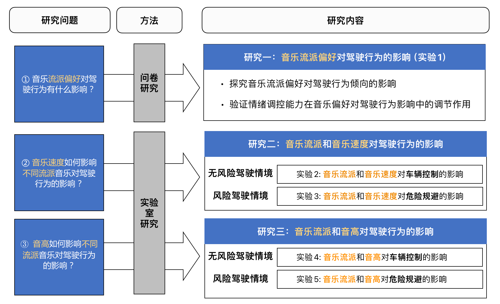

第3 章 研究内容与预期目标 图3-1 研究框架图 Figure 3-1 Research framework

<!-- ===== 原文 第 38 页 ===== -->

音乐流派对驾驶行为影响的多维分析：个人偏好与音乐元素的影响

### 第4章  音乐偏好对驾驶行为的影响

4.1 实验一：音乐偏好对驾驶行为的影响

#### 4.1.1 研究目的

探究音乐流派偏好、情绪调控和驾驶行为倾向之间的关系。

#### 4.1.2 被试

本研究通过网络收集的方式共招募了303 名中国驾驶员。因研究参与者不 认真回答（在其中一个量表中回答完全一致），剔除9 个无效样本，最后共294 个有效样本纳入分析，年龄在20-53 岁之间，男性189 名（64.3%），女性105 名（35.7%）。

#### 4.1.3 实验材料

（1）驾驶行为量表 本研究使用的驾驶行为问卷 (Driver Behaviour Questionnaire, DBQ) 由Reason 等 (1990)提出，旨在通过测量驾驶员的错误、失误以及违规行为来评估不良驾 驶习惯。此问卷以较为客观的方式刻画了驾驶行为，并且着重于不安全行为的 量化与分析。采用5 点评分（1-从不，5-总是），沈碧莹等对该问卷的中文版本 进行了修订 (Shen 等, 2018)， 33 个项目，涵盖五个不同的维度，包括攻击性违 规（Aggressive ，3 项）、一般性违规（General ，9 项）、错误（Error ,8 项）、 失误（Mistake, 8 项）和积极（Positive, 5 项），各个维度的内部一致性系数介于 0.67 至0.85 之间。 （2）情绪调控困难量表简版 情绪调节困难量表（DERS），由Gratz 和 Roemer (2004)年开发，旨在评估 个体在情绪调节方面的能力。王力等人对该量表进行了中文版的修订工作(王力 等, 2007)，确保了其在中文语境下的适用性。Kaufman 等研究者在2016 年对 DERS 进行了简化，推出了简版DERS-SF (Short Version of Difficulties in Emotion Regulation Scale)，采用5 点评分，包含18 个条目(Kaufman 等, 2016)，分六个不 同的维度：不接受情绪反应（React）、参与目标导向行为的困难（Purpose）、 冲动控制困难（Control）、缺乏情感意识（：Consciousness）、情绪调节策略 的获取途径有限（Strategy）和缺乏情感清晰度（Clearness）。简版量表同样表 现出良好的内部一致性，各分量表在0.67～0.85。 （3）音频版音乐偏好量表

<!-- ===== 原文 第 39 页 ===== -->

第4 章 音乐偏好对驾驶行为的影响 每个音乐流派，我们选择了14 个相应流派的音乐片段。音乐片段来自两个 来源。我们从 Rentfrow 等 (2011, 2012) 提供的音频材料库中选择了片段。另外 的片段，我们在中国音乐平台QQ 音乐上搜索被定义为某一音乐流派的音乐。 标准是评论数不得超过100，以尽量减小熟悉性的影响 (Chmiel & Schubert, 2019)。 根据之前研究的方法 (Rentfrow, Goldberg, & Levitin, 2011)，我们提取了每首音乐 的15 秒前奏或间奏（不带歌词），并设置了淡入淡出效果。参与者需要对音乐 表示喜欢的程度，采用5 点量表（1=“非常不喜欢”，5=“非常喜欢”）。 （4）人口学变量 本研究测量了研究参与者的年龄，性别，教育水平，驾龄和每周驾驶公里 数。同时，本研究也测量了研究参与者过去一年的罚分，罚款和过去三年的事 故，包括碰撞，追尾和刮擦等。

#### 4.1.4 实验流程

在Qualtrics 网络平台分发收集的方式进行数据收集。在填写量表之前强调 对收集的数据仅为研究使用且绝对保密，并要求研究参与者自愿和真实的回答， 量表填写完成之后会给予研究参与者30 元人民币作为报酬。

#### 4.1.5 实验结果

（1）内部一致性检验 对本研究中使用的量表进行了信度检验，结果表明测量量表结果上内部一 致性良好，见表4-1。 （2）相关检验结果 对音乐偏好、情绪调控和驾驶行为各维度的皮尔逊相关分析如表4-2所示。 结果表明，对古乐、古典乐的偏好得分与总的危险驾驶行为和失误倾向得分呈 正相关（p<0.05），表明对这些音乐越喜欢，危险驾驶倾向越高。对电子的偏 好得分与危险驾驶行为的一般违规倾向得分呈正相关（p<0.05），表明对电子 乐越喜欢，驾驶时一般性违规倾向越高。对爵士和古典乐的偏好得分与情绪调 控困难的目标导向困难呈负相关，说明对这些越喜欢，在负性情绪下，目标导 向困难越少。 情绪调控与危险驾驶行为之间的相关如表4-3所示，情绪调控困难与危险驾 驶行为呈正相关（p<0.001），表明情绪调控越困难，危险驾驶行为倾向越高。

<!-- ===== 原文 第 40 页 ===== -->

音乐流派对驾驶行为影响的多维分析：个人偏好与音乐元素的影响 表4-1 实验1 描述性统计和量表内部一致性检验结果

| Table 4-1 Descripti | ve Stati | stical Analysis and | Reliability | Testing for | Scale Inter | nal |
|---|---|---|---|---|---|---|
|  |  | Consistency in Exp | eriment 1 |  |  |  |
| 项 | 目数 | 均值 标准差 | 中位数 | 最小值 | 最大值 | α 值 |
| 口学变量 |  |  |  |  |  |  |
| 年龄 |  | 27.50 6.91 | 25.00 | 20.00 | 53.00 |  |
| 受教育年限 |  | 15.50 3.30 | 16.00 | 3.00 | 27.00 |  |
| 驾龄 |  | 4.47 3.54 | 3.00 | 1.00 | 23.00 |  |
| 年驾驶里程 |  | 4.17 21.90 | 1.00 | 0.00 | 30.00 |  |
| 事故数 |  | 1.48 3.36 | 1.00 | 0.00 | 50.00 |  |
| 乐流派 |  |  |  |  |  |  |
| 朋克 |  | 2.75 1.02 | 3.00 | 1.00 | 5.00 |  |
| 摇滚 |  | 2.89 0.92 | 3.00 | 1.00 | 5.00 |  |
| 说唱 |  | 2.79 0.95 | 3.00 | 1.00 | 5.00 |  |
| 重金属 |  | 2.63 0.98 | 2.50 | 1.00 | 5.00 |  |
| 蓝调 |  | 2.86 0.89 | 3.00 | 1.00 | 5.00 |  |
| 爵士 |  | 2.87 0.83 | 3.00 | 1.00 | 5.00 |  |
| 电子 |  | 2.47 0.89 | 2.50 | 1.00 | 5.00 |  |
| 中国流行 |  | 3.56 0.87 | 3.50 | 1.00 | 5.00 |  |
| 怀旧 |  | 2.88 1.02 | 3.00 | 1.00 | 5.00 |  |
| 民族乐 |  | 2.41 0.99 | 2.50 | 1.00 | 5.00 |  |
| 古乐 |  | 2.65 1.07 | 2.50 | 1.00 | 5.00 |  |
| 欧洲流行 |  | 2.64 0.87 | 2.50 | 1.00 | 5.00 |  |
| 古典 |  | 2.48 0.82 | 2.50 | 1.00 | 5.00 |  |
| 民谣 |  | 3.01 0.83 | 3.00 | 1.00 | 5.00 |  |
| 驶行为总分 | 33 | 1.13 0.56 | 1.06 | 0.13 | 3.13 | 0.88 |
| 积极驾驶 | 5 | 4.85 1.09 | 5.00 | 1.00 | 6.00 | 0.73 |
| 攻击性违规 | 3 | 2.49 0.97 | 2.67 | 1.00 | 5.33 | 0.67 |
| 一般性违规 | 9 | 1.80 0.64 | 1.67 | 1.00 | 4.11 | 0.81 |
| 错误 | 8 | 1.79 0.68 | 1.63 | 1.00 | 4.50 | 0.84 |
| 失误 | 8 | 2.19 0.71 | 2.13 | 1.00 | 4.63 | 0.75 |
| 绪调控困难 | 18 | 2.59 0.53 | 2.56 | 1.22 | 4.28 | 0.85 |
| 不接受情绪反应 | 3 | 2.75 0.85 | 2.67 | 1.00 | 5.00 | 0.68 |
| 目标导向困难 | 3 | 3.22 0.92 | 3.33 | 1.00 | 5.00 | 0.83 |
| 冲动控制困难 | 3 | 2.44 0.94 | 2.33 | 1.00 | 5.00 | 0.85 |
| 缺乏情感意识 | 3 | 2.13 0.69 | 2.00 | 1.00 | 5.00 | 0.72 |
| 调节策略有限 | 3 | 2.68 0.84 | 2.67 | 1.00 | 5.00 | 0.72 |
| 缺乏情感意识 | 3 | 2.33 0.71 | 2.33 | 1.00 | 5.00 | 0.67 |

<!-- ===== 原文 第 41 页 ===== -->

音乐 流派

|  |  |  |  |  | 第4 章 | 音乐偏好对驾 | 驶行为的 | 影响 |  |  |  |  |  |
|---|---|---|---|---|---|---|---|---|---|---|---|---|---|
|  |  |  | 表 | 4-2 音乐 | 流派偏好 | 与驾驶行为 | 和情绪 | 调控的 | 相关结果 |  |  |  |  |
|  | Table 4- | 2 Results | of the correla | tion betw | een mus | ic genre pref | erences | and dr | iving beha | vior and | emotion regulati | on |  |
|  |  |  | 驾驶行 | 为 |  |  |  |  |  | 情绪 | 调控 |  |  |
|  | Total | Positive | Aggressive | General | Error | Mistake | Total | React | Purpose | Control | Consciousness | Strategy | Clearness |
| 朋克 | 0.06 | -0.05 | 0.00 | 0.08 | 0.06 | 0.02 | 0.06 | 0.08 | -0.02 | 0.07 | -0.02 | 0.07 | 0.04 |
| 摇滚 | 0.04 | -0.03 | 0.03 | 0.04 | 0.01 | 0.05 | -0.04 | -0.00 | -0.04 | 0.00 | -0.10 | -0.00 | -0.05 |
| 说唱 | 0.10 | -0.09 | -0.01 | 0.11 | 0.08 | 0.07 | 0.01 | 0.04 | -0.03 | 0.04 | -0.04 | 0.04 | -0.06 |
| 重金属 | 0.08 | -0.10 | 0.04 | 0.07 | 0.06 | 0.02 | 0.02 | 0.08 | -0.07 | 0.05 | 0.02 | 0.05 | -0.06 |
| 蓝调 | 0.02 | 0.01 | 0.08 | -0.02 | 0.02 | 0.02 | -0.08 | 0.01 | -0.02 | -0.07 | -0.10 | -0.05 | -0.09 |
| 爵士 | 0.10 | -0.04 | 0.01 | 0.10 | 0.11 | 0.09 | -0.09 | -0.01 | -0.15* | -0.06 | 0.04 | -0.06 | -0.08 |
| 电子 | 0.11 | -0.09 | 0.07 | 0.12* | 0.11 | 0.02 | -0.03 | 0.05 | -0.05 | 0.01 | -0.04 | 0.01 | -0.09 |
| 中国流行 | 0.03 | 0.08 | 0.03 | 0.01 | 0.07 | 0.06 | -0.10 | 0.01 | -0.03 | -0.10 | -0.10 | -0.08 | -0.12* |
| 怀旧 | 0.00 | 0.02 | 0.04 | 0.01 | 0.01 | -0.02 | 0.01 | 0.07 | -0.03 | 0.00 | 0.05 | 0.03 | -0.08 |
| 民族乐 | 0.04 | -0.06 | 0.02 | 0.04 | 0.02 | -0.01 | -0.06 | 0.06 | -0.11 | -0.06 | 0.05 | -0.03 | -0.12* |
| 古乐 | 0.15* | -0.06 | 0.09 | 0.08 | 0.16** | 0.13* | -0.01 | 0.01 | -0.06 | -0.03 | 0.09 | 0.02 | -0.06 |
| 欧洲流行 | 0.05 | -0.04 | 0.03 | 0.09 | 0.03 | -0.01 | 0.03 | 0.11 | -0.01 | 0.04 | -0.07 | 0.08 | -0.06 |
| 古典 | 0.12* | -0.05 | 0.04 | 0.09 | 0.13* | 0.08 | -0.09 | -0.06 | -0.15* | -0.09 | 0.02 | -0.02 | -0.01 |
| 民谣 | 0.07 | -0.03 | -0.03 | 0.08 | 0.07 | 0.07 | -0.03 | 0.10 | -0.08 | -0.06 | 0.06 | -0.04 | -0.09 |

<!-- ===== 原文 第 42 页 ===== -->

音乐流派对驾驶行为影响的多维分析：个人偏好与音乐元素的影响 表4-3 驾驶行为和情绪调控的相关结果 Table 4-3 Results of the correlation between and driving behavior and emotion regulation 驾驶行为

|  |  | Total | Positive | Aggressive | General | Error | Mistake |
|---|---|---|---|---|---|---|---|
|  | Total | 0.40*** | -0.08 | 0.31*** | 0.34*** | 0.33*** | 0.36*** |
|  |  | *** |  | ** | *** | *** | ** |
| 情 | React | 0.21 | 0.00 | 0.17 | 0.19 | 0.21 | 0.18 |
|  | Purpose | 0.16** | 0.16** | 0.24*** | 0.14* | 0.13* | 0.25*** |
| 绪 |  |  |  |  |  |  |  |
|  | Control | 0.40*** | -0.06 | 0.31*** | 0.36*** | 0.32*** | 0.36*** |
| 调 |  |  |  |  |  |  |  |
|  |  | *** | *** |  | ** | ** |  |
|  | Consciousness | 0.23 | -0.38 | 0.02 | 0.18 | 0.16 | 0.06 |
| 控 |  | *** |  | *** | *** | *** | *** |
|  | Strategy | 0.28 | 0.02 | 0.27 | 0.24 | 0.23 | 0.28 |
|  | Clearness | 0.25*** | -0.16** | 0.14* | 0.20*** | 0.20*** | 0.20*** |
| （3 | ）情绪调控的 | 调节检验结 | 果 |  |  |  |  |
|  | 对自变量和调 | 节变量进 | 行中心化后 | ，采用 Hay | es 编制的 | R 软件的 P | rocess 语 |
| 法程 | 序的模型 1（ | Model 1， | 为简单的 | 调节模型） | 、在控制性 | 别、年龄 | 、驾龄情 |
| 况下 | 对情绪调控困 | 难在音乐 | 偏好与危险 | 驾驶行为 | 之间关系中 | 的调节效 | 应进行检 |
| 验。 |  |  |  |  |  |  |  |
|  | 1）摇滚音乐 | 偏好 |  |  |  |  |  |
|  | 情绪调控困难 | 的调节效 | 应显著（F= | 10.604，p | ＜ 0.001， | ∆R2=0.183 | ，见表4- |
| 4）, | 简单效应如图 | 4-1。按平 | 均分加减 | 一个标准差 | 将被试分为 | 高水平组 | 、低水平 |
| 组和 | 中等水平组， | 采用分组 | 回归的方式 | 考察摇滚 | 偏好与危险 | 驾驶行为 | 倾向的关 |
| 系， | 结果发现：情 | 绪调控困 | 难水平较高 | 时，摇滚 | 偏好可以显 | 著预测危 | 险驾驶行 |
| 为倾 | 向（β ＝ 0.11 | 8，p＜0.0 | 1），95% | 的 bootstrap | 置信区间 | 上、下限均 | 不包含 0 |
| 情绪 | 调控困难水平 | 较低时， | 摇滚偏好不 | 能预测危险 | 驾驶行为 | 倾向（β ＝ | -0.037， |
| p>0. | 05），95%的 | bootstrap 置 | 信区间上 | 、下限均包 | 含 0（见表 | 4-5）。 |  |
|  | 2）说唱音乐 | 偏好 |  |  |  |  |  |
|  | 情绪调控困难 | 的调节效 | 应显著（F= | 11.66，p | < 0.001，∆ | R2=0.180， | 见表 4- |
| 6） | ，简单效应如 | 图 4-2。按 | 平均分加减 | 一个标准 | 差将被试分 | 为高水平 | 组、低水 |
| 平组 | 和中等水平组 | ，采用分 | 组回归的方 | 式考察说 | 唱偏好与危 | 险驾驶行 | 为倾向的 |
| 关系 | ，结果发现： | 情绪调控 | 困难水平较 | 高时，说 | 唱偏好可以 | 显著预测 | 危险驾驶 |
| 行为 | 倾向（β ＝ 0. | 160，p＜0 | .001），9 | 5％的 boots | trap 置信区 | 间上、下 | 限均不包 |
| 含 0 | ；情绪调控困 | 难水平较低 | 时，说唱 | 偏好预测危 | 险驾驶行为 | 倾向不显 | 著（β＝- |
| 0.04 | 0，p>0.05）， | 95％的bo | otstrap 置信 | 区间上、下 | 限包含0 | （见表4-7 | ）。 |

<!-- ===== 原文 第 43 页 ===== -->

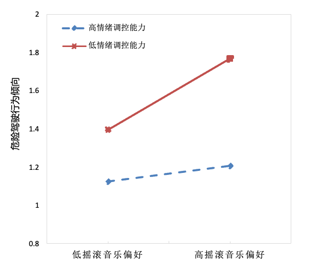

第4 章 音乐偏好对驾驶行为的影响 表4-4 情绪调控困难的调节效应分析结果（摇滚音乐偏好） Table 4-4 Results of the moderated effects of difficulties in emotion regulation (rock) 模型1 模型2 模型3 Table 4-5 Subgroup regression results for level of emotion regulation as a moderator Figure 4-1 The moderating effect of emotional regulation difficulties in the influence of rock preference on dangerous driving behavior

| 变量 | β t β t β t |
|---|---|
| 自变量 | 摇滚偏好 0.034 0.937 0.047 1.418 0.04 1.221 |
| 调节变量 | 情绪调控困难 0.405 7.127*** 0.415 7.342 |
| 交互项 | 摇滚偏好×情绪调控困难 0.146 2.40 |
|  | F 1.297 11.38*** 10.604*** |
|  | ∆R2 0.004 0.151 0.183 |
| 表4-5 | 情绪调控水平作为调节变量的分组回归结果（摇滚音乐偏好 |
| 4-5 Sub | group regression results for level of emotion regulation as a mo |
|  | variable (rock) |
| 调节 | 变量水平 B t 95% CI |
| 低水 | 平(-SD) -0.037 -0.775 -0.132 0.057 |
| 平均 | 值 0.04 1.221 -0.025 0.105 |
| 高水 | 平(+SD) 0.118 2.67** 0.031 0.205 |
| 图4-1 | 情绪调控困难在摇滚偏好与危险驾驶行为关系中的调节作用 |

<!-- ===== 原文 第 44 页 ===== -->

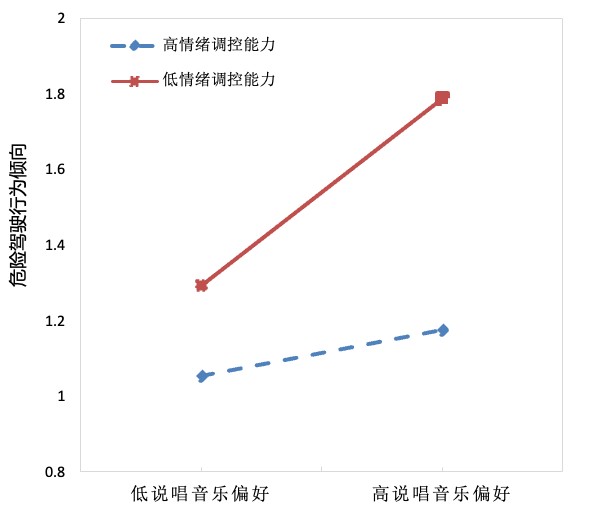

音乐流派对驾驶行为影响的多维分析：个人偏好与音乐元素的影响 表4-6 情绪调控困难的调节效应分析结果（说唱音乐偏好） Table 4-7 Subgroup regression results for level of emotion regulation as a moderator Figure 4-2 The moderating effect of emotional regulation difficulties in the influence of rap preference on dangerous driving behavior

| e 4-6 Results | of the moderate | d effec | ts | of difficul | ties in em | oti | on reg | ulation (r |
|---|---|---|---|---|---|---|---|---|
|  |  |  | 模 | 型1 | 模型2 |  | 模 | 型3 |
| 变量 |  |  | β | t β | t |  | β | t |
| 自变量 | 说唱偏好 | 0. | 05 | 4 1.5750 .0 | 59 1.87 | 1 | 0.059 | 1.885. |
| 调节变量 | 情绪调控困难 |  |  | 0.4 | 03 7.11 | 8*** | 0.424 | 7.549*** |
| 交互项 说唱 | 偏好×情绪调控 | 困难 |  |  |  |  | 0.187 | 3.088** |
|  | F |  | 1 | .704 | 11.73*** |  | 11. | 66*** |
|  | ∆R2 |  | 0 | .010 | 0.156 |  | 0. | 180 |
| 表4-7 情绪 | 调控水平作为调 | 节变量 |  | 的分组回归 | 结果（ | 说唱 | 音乐 | 偏好） |
| e 4-7 Subgro | up regression res | ults for | l | evel of em | otion reg | ula | tion as | a modera |
|  |  | varia | bl | e (rap) |  |  |  |  |
|  | 调节变量水平 | B |  | t | 95% | CI |  |  |
|  | 低水平(-SD) | -0.040 |  | -0.886 | -0.128 | 0.04 | 9 |  |
|  | 平均值 | 0.060 |  | 1.917 | -0.002 | 0.12 | 2 |  |
|  | 高水平(+SD) | 0.160 |  | 3.541*** | 0.071 | 0.24 | 8 |  |
| 图4-2 情 | 绪调控困难在说 | 唱偏好 | 与 | 危险驾驶 | 行为关系 | 中 | 的调节 | 作用 |
| -2 The mode | rating effect of e | motion | al | regulatio | n difficul | ties | in the | influence |

<!-- ===== 原文 第 45 页 ===== -->

第4 章 音乐偏好对驾驶行为的影响 3）重金属音乐偏好 情绪调控困难的调节效应显著（F= 10.54，p < 0.001，∆R2=0.164，见表4- 8），简单效应如图4-3。按平均分加减一个标准差将被试分为高水平组、低水 平组和中等水平组，采用分组回归的方式考察摇滚偏好与危险驾驶行为倾向的 关系，结果发现：情绪调控困难水平较高时，重金属偏好可以显著预测危险驾 驶行为倾向（β ＝ 0.095，p＜0.001），置信区间不包含0；情绪调控困难水平较 低时，重金属偏好预测危险驾驶行为倾向不显著（β＝-0.048，p>0.05），置信 区间上、下限包含0（见表4-9）。 4）爵士音乐偏好 情绪调控困难的调节效应显著（F= 12.15，p < 0.001，∆R2=0.164，见表4- 10），简单效应如图4-4。按平均分分组后，采用分组回归的方式考察摇滚偏好 与危险驾驶行为倾向的关系，结果发现：情绪调控困难水平较高时，爵士偏好 可以显著预测危险驾驶行为倾向（β ＝ 0.179，p＜0.001），置信区间不包含0； 情绪调控困难水平较低时，爵士偏好预测危险驾驶行为倾向不显著（β＝-0.007， p>0.05）（见表4-11）。并且回归结果显示在控制了性别、年龄、驾龄和情绪 调控能力后，电子音乐偏好能显著预测危险驾驶得分（β＝0.092，p=0.011*）。 5）电子音乐偏好 情绪调控困难的调节效应显著（F= 11.73，p < 0.001，∆R2=0.181，见表4- 12），简单效应如图4-5。按平均分分组后，采用分组回归的方式考察摇滚偏好 与危险驾驶行为倾向的关系，结果发现：情绪调控困难水平较高时，电子乐偏 好可以显著预测危险驾驶行为倾向（β ＝ 0.142，p＜0.001），95％的bootstrap置 信区间上、下限均不包含0；情绪调控困难水平较低时，电子乐偏好预测危险驾 驶行为倾向不显著（β＝-0.038，p>0.05），95％的bootstrap 置信区间上、下限 包含0（见表4-13），如图4-5。并且回归结果显示在控制了性别、年龄、驾龄 和情绪调控能力后，电子音乐偏好能显著预测危险驾驶得分（ β＝0.073， p=0.031*）。 6）古典音乐偏好 情绪调控困难的调节效应不显著（见表4-14）。但是回归结果显示，在控 制了性别、年龄、驾龄和情绪调控能力后，古典音乐偏好能显著预测危险驾驶 得分（ β＝0.094，p=0.014*）。 7）古乐音乐偏好 情绪调控困难的调节效应不显著（见表4-15）。但是回归结果显示，在控 制了性别、年龄、驾龄和情绪调控能力后，古典音乐偏好能显著预测危险驾驶 得分（ β＝0.078，p=0.007**）。

<!-- ===== 原文 第 46 页 ===== -->

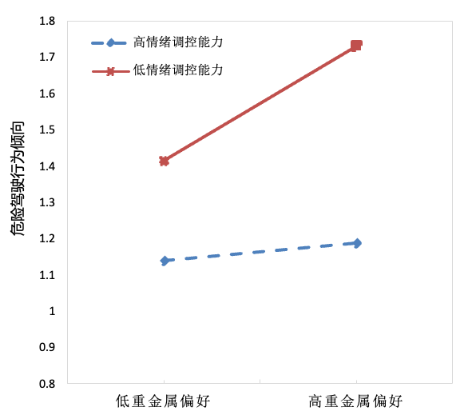

音乐流派对驾驶行为影响的多维分析：个人偏好与音乐元素的影响 表4-8 情绪调控困难的调节效应分析结果（重金属音乐偏好）

| T | able 4-8 R | esults | of the moderated | effects | o | f difficulti | es in em | otion | regulatio | n (meta |
|---|---|---|---|---|---|---|---|---|---|---|
|  |  |  |  |  | 模 | 型1 | 模型 | 2 | 模型 | 3 |
|  | 变量 |  |  | β |  | t | β | t | β | t |
|  | 自变量 | 重金属 | 偏好 | 0.0 | 3 | 4 1.014 0. | 033 1. | 069 | 0.023 | 0.734 |
|  | 调节变量 | 情绪调 | 控困难 |  |  | 0. | 400 7. | 043*** | 0.409 | 7.244*** |
|  | 交互项 | 重金属 | 偏好×情绪调控 | 困难 |  |  |  |  | 0.135 | 2.516* |
|  |  | F |  |  | 1 | .335 | 11.17* | ** | 10.5 | 4*** |
|  |  | ∆R2 |  |  | 0 | .005 | 0.149 |  | 0.1 | 64 |
|  | 表4-9 | 情绪 | 调控水平作为调 | 节变量的 |  | 分组回归 | 结果（重 | 金属 | 音乐偏好 | ） |
| T | able 4-9 S | ubgro | up regression res | ults for | l | evel of em | otion reg | ulatio | n as a m | oderato |
|  |  |  |  | variable |  | (metal) |  |  |  |  |
|  |  |  | 调节变量水平 | B |  | t | 95% | CI |  |  |
|  |  |  | 低水平(-SD) | -0.048 |  | -1.084 | -0.136 | 0.040 |  |  |
|  |  |  | 平均值 | 0.024 |  | 0.758 | -0.037 | 0.084 |  |  |
|  |  |  | 高水平(+SD) | 0.095 |  | 2.418*** | 0.018 | 0.173 |  |  |
|  | 图4- | 3 情绪 | 调控困难在重金 | 属偏好 |  | 与危险驾驶 | 行为关 | 系中的 | 调节作 | 用 |
| F | igure 4-3 | J-N plo | t of the moderat | ing effe | c | t of emotio | nal regu | lation | difficult | ies in th |
|  |  | influe | nce of metal pref | erence | o | n dangero | us drivin | g beh | avior |  |
| 2 | 8 |  |  |  |  |  |  |  |  |  |

<!-- ===== 原文 第 47 页 ===== -->

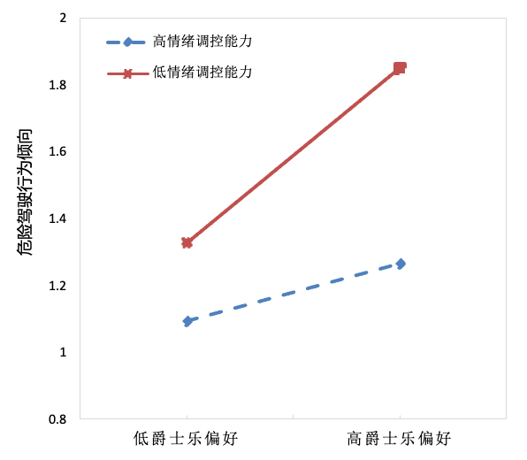

第4 章 音乐偏好对驾驶行为的影响 表4-10 情绪调控困难的调节效应分析结果（爵士音乐偏好） Figure 4-4 The moderating effect of emotional regulation difficulties in the influence of jazz preference on dangerous driving behavior

| ble 4-10 R | esults | of the moderate | d effec | ts | of difficul | ties in e | motio | n regul | ation (ja |
|---|---|---|---|---|---|---|---|---|---|
|  |  |  |  | 模 | 型1 | 模型 | 2 | 模 | 型3 |
| 变量 |  |  | β |  | t | β | t | β | t |
| 自变量 | 爵士 | 偏好 | 0.0 | 7 | 1 1.837. 0. | 092 2.5 | 72* | 0.085 | 2.416* |
| 调节变量 | 情绪 | 调控困难 |  |  | 0. | 412 7.2 | 96*** | 0.409 | 7.344*** |
| 交互项 | 爵士 | 偏好×情绪调控困 | 难 |  |  |  |  | 0.175 | 2.974* |
|  | F |  |  | 1 | .930 | 12.47* | ** | 12.1 | 5*** |
|  | ∆R2 |  |  | 0 | .013 | 0.165 |  | 0.1 | 64 |
| 表4-11 | 情绪 | 调控水平作为调 | 节变 | 量 | 的分组回 | 归结果（ | 爵士 | 音乐偏 | 好） |
| le 4-11 Su | bgro | up regression re | sults fo | r | level of em | otion re | gulati | on as a | moder |
|  | varia | ble (jazz music | prefere | n | ce as the d | ependen | t vari | able) |  |
|  |  | 调节变量水平 | B |  | t | 95% | CI |  |  |
|  |  | 低水平(-SD) | -0.007 |  | -0.143 | -0.102 | 0.088 |  |  |
|  |  | 平均值 | 0.086 |  | 2.444 | 0.017 | 0.155 |  |  |
|  |  | 高水平(+SD) | 0.179 |  | 3.907*** | 0.089 | 0.269 |  |  |
| 图4- | 4 情 | 绪调控困难在说 | 唱偏好 | 与 | 危险驾驶 | 行为关 | 系中的 | 调节作 | 用 |
| 4-4 The | mode | rating effect of e | motion | al | regulatio | n difficu | lties in | the in | fluence |

<!-- ===== 原文 第 48 页 ===== -->

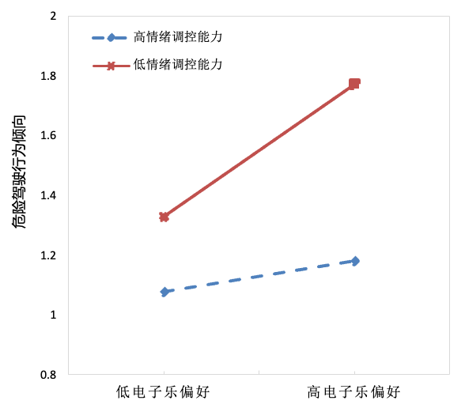

音乐流派对驾驶行为影响的多维分析：个人偏好与音乐元素的影响 表4-12 情绪调控困难的调节效应分析结果（电子音乐偏好） Table 4-12 Results of the moderated effects of difficulties in emotion regulation (electronic) Table 4-13 Subgroup regression results for level of emotion regulation as a moderator Figure 4-5 The moderating effect of emotional regulation difficulties in the influence of

|  |  |  |  | 模型1 | 模 | 型 | 2 | 模 | 型3 |
|---|---|---|---|---|---|---|---|---|---|
| 变量 |  |  | β | t | β |  | t | β | t |
| 自变量 |  | 电子音乐偏好 | 0.0 | 65 1.787. | 0.073 |  | 2.164* | 0.051 | 1.499 |
| 调节变量 |  | 情绪调控困难 |  |  | 0.404 | 7 | .156*** | 0.422 | 7.524*** |
| 交互项 | 电 | 子偏好×情绪调控 | 困难 |  |  |  |  | 0.169 | 2.950* |
|  |  | F |  | 1.885 | 12. | 0 | 1*** | 11. | 73*** |
|  |  | ∆R2 |  | 0.012 | 0. | 1 | 59 | 0. | 181 |
| 表4-13 | 情绪 | 调控水平作为调 | 节变量 | 的分组回 | 归结果 |  | （电子 | 音乐 | 偏好） |
| e 4-13 Sub | gro | up regression re | sults for | level of em | otion |  | regulat | ion as | a mode |
|  |  | va | riable (e | lectronic) |  |  |  |  |  |
|  |  | 调节变量水平 | B | t | 95 | % | CI |  |  |
|  |  | 低水平(-SD) | -0.038 | -0.750 | -0.13 | 7 | 0.061 |  |  |
|  |  | 平均值 | 0.052 | 1.529 | -0.01 | 5 | 0.119 |  |  |
|  |  | 高水平(+SD) | 0.142 | 3.488*** | 0.062 |  | 0.222 |  |  |
| 图4-5 | 情 | 绪调控困难在电 | 子偏好与 | 危险驾驶 | 行为 | 关 | 系中的 | 调节 | 作用 |
| e 4-5 The | mo | derating effect of | emotion | al regulat | ion di | f | ficultie | s in th | e influe |
|  | el | ectronic prefere | nce on da | ngerous d | rivin | g | behavi | or |  |

<!-- ===== 原文 第 49 页 ===== -->

第4 章 音乐偏好对驾驶行为的影响 表4-14 情绪调控困难的调节效应分析结果（古典音乐偏好） Table 4-14 Results of the moderated effects of difficulties in emotion regulation (classic) 模型1 模型2 模型3 变量 β t β t β t 自变量 古典音乐偏好 0.069 1.748. 0.094 2.578* 0.090 2.465* 调节变量 情绪调控困难 0.414 7.324*** 0.423   7.457*** 交互项 古典偏好×情绪调控困难 0.097 1.479 F 1.85 12.48*** 10.81*** ∆R2 0.012 0.165 0.162 表4-15 情绪调控困难的调节效应分析结果（古乐音乐偏好） Table 4-15 Results of the moderated effects of difficulties in emotion regulation (Chinese) 模型1 模型2 模型3 变量 β t β t β t 自变量 古乐音乐偏好 0.080 2.595** 0.078 2.716** 0.077 2.698** 调节变量 情绪调控困难 0.398   7.087*** 0.398  7.076*** 交互项 古乐偏好×情绪调控困难 0.025 0.509 F 2.783 12.655*** 10.56*** ∆R2 0.024 0.167 0.165

### 4.2 小结与讨论

研究一旨在探究音乐流派偏好、情绪调控和驾驶行为之间的关系。通过问 卷调查了14 类音乐流派偏好与驾驶行为倾向之间的关系。研究结果发现相关结 果和回归结果有一定的出入，这可能是音乐在相关分析中没有对性别、年龄和 驾驶经验等变量进行控制，而这些变量和音乐偏好和驾驶行为倾向都是都密切 关联。回归分析中进一步对这些变量进行了控制，能够更好的说明音乐偏好、 情绪调控与驾驶行为之间的关系。本研究发现对于电子、爵士音乐的偏好能显 著正向预测危险驾驶行为得分。进一步支持了以往研究关于问题音乐偏好的人 更倾向有冒险行为的结果 (North 等, 2005)，这表明个体对这些具有明显强烈和 复杂特征的音乐流派的偏好可能是他们在驾驶中倾向于采取更加鲁莽和激进行 为的一个预示。本研究还发现，对古典和古乐的偏好也能显著预测危险驾驶行 为得分。音乐偏好不仅受音乐特征的影响，而且与听众的个性特质密切相关 (Schäfer & Sedlmeier, 2010)。研究表明，音乐偏好与大五人格特质有显著关系

<!-- ===== 原文 第 50 页 ===== -->

音乐流派对驾驶行为影响的多维分析：个人偏好与音乐元素的影响 (McCrae & Costa Jr., 1997)，其中经验开放性与对古典等音乐的偏好特别相关。 并且最一致的发现是经验开放性与古典等复杂性音乐的正相关(Fricke & Herzberg, 2017; Langmeyer 等, 2012)。开放性高的个体在驾驶过程中，可能对环 境中出现的各种线索都会进行注意和加工，但是这有可能会导致在驾驶主任务 上的注意和认知资源减少，从而会导致出现更多的错误和失误。此外，研究者 认为价值观也是决定音乐偏好的重要因素 (Boer 等, 2011)，个体倾向于通过其音 乐偏好向外界传达个人价值观。例如，喜欢说唱和摇滚音乐的人通常表达更自 由主义的信念和行为模式 (North & Hargreaves, 2007)，而那些抱持超越自我的价 值观的个体则更倾向于古典类复杂精致的音乐流派 (Gardikiotis & Baltzis, 2012)。 这些价值观与音乐偏好之间的联系可能也解释了我们研究中观察到的特定音乐 偏好与驾驶行为倾向之间的关系。 此外，本研究还发现情绪调节能力在音乐偏好与危险驾驶行为倾向之间起 到了调节作用。具体来说，具有较高情绪调节能力的驾驶员，即使他们对上述 音乐流派有较强的偏好，他们的危险驾驶行为倾向也相对较低。这一结果强调 了情绪调节能力在驾驶行为中的重要性，表明良好的情绪调节能力可以作为一 种缓冲机制，减少特定音乐偏好可能导致的负面驾驶行为。因此，这些发现不 仅为理解音乐流派偏好如何影响驾驶行为提供了新的见解，还突显了提高驾驶 员情绪调节能力的潜在价值。

<!-- ===== 原文 第 51 页 ===== -->

第5 章 研究二：音乐流派和音乐速度对驾驶行为的影响 第5章  研究二：音乐流派和音乐速度对驾驶行为的影响 5.1 实验二：音乐流派和音乐速度对车辆控制的影响

#### 5.1.1 研究目的

实验二旨在旨在探究音乐流派和音乐速度对无风险情境下，对车辆控制驾 驶行为的影响。

#### 5.1.2 实验设计

本实验采用2（音乐偏好：摇滚偏好，古典偏好）×2（音乐流派：摇滚， 古典）×3（音乐速度：慢，中，快）三因素混合实验设计。其中音乐偏好是被 试间变量，音乐流派和音乐速度是被试内变量。并且以无音乐为控制组，所以 被试一共需要在7 个条件下完成实验任务。

#### 5.1.3 被试

通过网络招募，在全国范围内招募驾驶员被试，要求满足以下条件：已取 得 C1 驾照；驾龄不短于 1 年；年龄范围 18-49 岁。在招募时首先让驾驶员填写 了音乐偏好问卷，通过对3 段古典曲目和3 段摇滚曲目（每段约15 秒），以及 主观对摇滚和古典音乐喜好度打分。筛选了具有古典音乐偏好和摇滚音乐偏好 的两组被试。本实验招募驾驶员 32 名，其中 2 名驾驶员因设备记录问题，数据 予以剔除，共 30 名有效被试。被试的人口学及驾驶相关信息如下。 进行独立T 检验，比较古典偏好音乐和摇滚音乐偏好两组不同偏好的被试 在驾龄、驾驶总里程上的差异，结果两组在驾龄上没有显著差异（t=1.587,  p =0.124），在驾驶总里程上没有显著差异（t=0.804,  p =0.428）。 在对摇滚、古典音乐的喜爱程度上的差异，进行了T 检验。结果显示不同 音乐偏好组在对摇滚音乐、古典音乐的喜爱程度上存在显著差异，摇滚偏好组 在摇滚音乐的偏好显著大于古典音乐，古典偏好组在古典音乐的偏好显著大于 摇滚乐；说明两组满足不同音乐偏好的要求。结果见表5-2。

<!-- ===== 原文 第 52 页 ===== -->

音乐流派对驾驶行为影响的多维分析：个人偏好与音乐元素的影响

|  |  |  | 表5-1 | 实验 | 2 | 人口学及驾驶 | 相关信息 |  |  |  |  |
|---|---|---|---|---|---|---|---|---|---|---|---|
|  | Table 5-1 | Demogr | aphic | and d | ri | ving-related in | formatio | n in Ex | perimen | t 2 |  |
|  |  |  |  | 古 | 典 |  | 摇滚 |  |  |  | 总 |
|  |  |  |  | (N= | 1 | 5) | (N=1 | 5) |  | (N | =30) |
| 性 | 别 |  |  |  |  |  |  |  |  |  |  |
|  | 男 |  |  | 7 (46 | .7 | %) | 7 (46.7 | %) |  | 14 (4 | 6.7%) |
|  | 女 |  |  | 8 (53 | .3 | %) | 8 (53.3 | %) |  | 16 (5 | 3.3%) |
| 年 | 龄 |  |  |  |  |  |  |  |  |  |  |
|  | 均值（标准差） |  |  | 29.5 ( | 7. | 48) | 26.7 (8. | 06) |  | 28.1 | (7.77) |
|  | 中位数 [最小值, | 最大值] | 26 | .0 [23 | .0 | , 46.0] 2 | 3.0 [19.0 | , 43.0] | 25 | .0 [19 | .0, 46. |
| 驾 | 龄（年） |  |  |  |  |  |  |  |  |  |  |
|  | 均值（标准差） |  |  | 6.93 ( | 6. | 52) | 3.63 (4. | 73) |  | 5.28 | (5.84) |
|  | 中位数 [最小值, | 最大值] | 4. | 00 [2. | 00 | , 22.0] 2 | .00 [1.00 | , 20.0] | 3.0 | 0 [1. | 00, 22. |
| 驾 | 驶总里程（万公 | 里） |  |  |  |  |  |  |  |  |  |
|  | 均值（标准差） |  |  | 7.33 ( | 1 | 3.7) | 4.09 (7. | 49) |  | 5.71 | (10.9) |
|  | 中位数 [最小值, | 最大值] | 1.0 | 0 [0.1 | 00 | , 50.0] 2. | 00 [0.100 | , 30.0] | 1.0 | 0 [0.1 | 00, 50 |
| 每 | 年驾驶里程（公 | 里） |  |  |  |  |  |  |  |  |  |
|  | 均值（标准差） |  |  | 5590 ( | 5 | 300) | 8310 (9 | 660) |  | 6950 | (7780) |
|  | 中位数 [最小值, | 最大值] | 30 | 00 [30 | 0, | 20000] 30 | 00 [300, | 30000] | 300 | 0 [30 | 0, 300 |
| 受 | 教育年限（年） |  |  |  |  |  |  |  |  |  |  |
|  | 均值（标准差） |  |  | 18.4 ( | 2. | 44) | 15.7 (1. | 91) |  | 17.0 | (2.57) |
|  | 中位数 [最小值, | 最大值] | 19 | .0 [14 | .0 | , 23.0] 1 | 6.0 [12.0 | , 19.0] | 17 | .0 [12 | .0, 23. |
| 每 | 周开车天数 |  |  |  |  |  |  |  |  |  |  |
|  | 均值（标准差） |  |  | 2.93 ( | 1. | 83) | 2.60 (1. | 45) |  | 2.77 | (1.63) |
|  | 中位数 [最小值, | 最大值] | 3. | 00 [1. | 00 | , 5.00] 3 | .00 [1.00 | , 5.00] | 3.0 | 0 [1. | 00, 5.0 |
|  | 表 | 5-2 实验 | 2 不同 | 音乐 | 偏 | 好组在古典、 | 摇滚音乐 | 喜好度 | 评分 |  |  |
| a | ble 5-2 Classical | and roc | k musi | c pref | er | ence scores of | different | music | preferen | ce gr | oups i |
|  |  |  |  |  | E | xperiment 2 |  |  |  |  |  |
|  |  | 古典评 | 分 |  |  | 摇滚评 | 分 |  |  |  |  |
|  |  |  |  |  |  |  |  |  | t |  | p |
|  |  | 均值 | 标准差 |  |  | 均值 | 标准差 |  |  |  |  |
| 古 | 典音乐偏好 | 5.80 | 1.01 |  |  | 3.40 | 1.18 |  | 7.187 | <0 | .001*** |
| 摇 | 滚音乐偏好 | 3.47 | 0.74 |  |  | 5.93 | 0.59 |  | -7.412 | <0 | .001*** |

<!-- ===== 原文 第 53 页 ===== -->

第5 章 研究二：音乐流派和音乐速度对驾驶行为的影响

#### 5.1.4 实验材料

（1）音乐刺激材料 音乐刺激包括古典、摇滚音乐各1 首，使用audacity 将每首音乐的音乐速度 进行调整（支持不改变音高，调整速度），音乐曲目的详细介绍及各水平BPM 值见表5-3。模拟驾驶时的音乐播放，使用蓝牙音响外放音乐，并将音强控制在 70 分贝左右。美国国家职业安全与健康研究所（NIOSH）建议，普通人可在 95 分贝（A）的听觉刺激下安全暴露约一小时。Zhao 等 (2010)以70 分贝为中等强 度，因此本研究参考该值将外放音乐强度控制在70 分贝左右。 另外，为了保障调整音速后，音乐的品质不会被损害，让被试对各条件音 乐进行了喜爱度的评分，以音乐速度为自变量，以喜爱度为因变量进行重复测 量方差分析。对摇滚的喜爱度，音乐速度的主效应不显著（F(2,58)=2.584, p=0.084, =0.082）；对古典的喜爱度，音乐速度的主效应不显著（F(2,58)=0.778, p=0.463, =0.026）。说明音速调整没有对音乐的品质造成损害。 表5-3 音乐材料介绍及各水平BPM 值 Table 5-3 Music materials and BPM values at all levels 曲目 风格 调式 乐器 原BPM 慢 中 快 Back In Black 摇滚 A 大调 电吉他、架子鼓 100 140 Turkish March 古典 A 大调 钢琴 100 140 （2）驾驶模拟器 驾驶模拟器采用STISIM 2.0 驾驶软件，STISIM 模拟软件安装在一台戴尔主 机上，通过一台尺寸为 27 英尺、分辨率为 1920*1200 像素的液晶显示器呈现。 驾驶模拟器装置还包含一套品牌为 Logitech Momo®的有力反馈的方向盘、刹车、 油门装置。 模拟道路为单侧宽度 4.8 米的双向车道，中间有双黄线。路型为环形路道 （见图5-1），共4 个弯道，所有弯道曲度均相同。首先是12000feet 的跟车路 段，前车设置在距离起点1000feet 处，当驾驶员从起始位置行驶800feet 后，前 车启动（速度变化如图5-2），要求保持一定的距离进行跟车，不要过近或落后 太远（若两车间距大于250feet，则程序会发出警告声提示），3 分钟后前车消 失。接着是3500feet 的不限速驾驶路段。之后2734 feet 的30mph（约50km/h） 限速路段。限速路段完成后，音乐结束，最后是2651feet 的静音过渡路段。过 渡段结束后，回到起始位置，开始下一个条件的任务。

<!-- ===== 原文 第 54 页 ===== -->

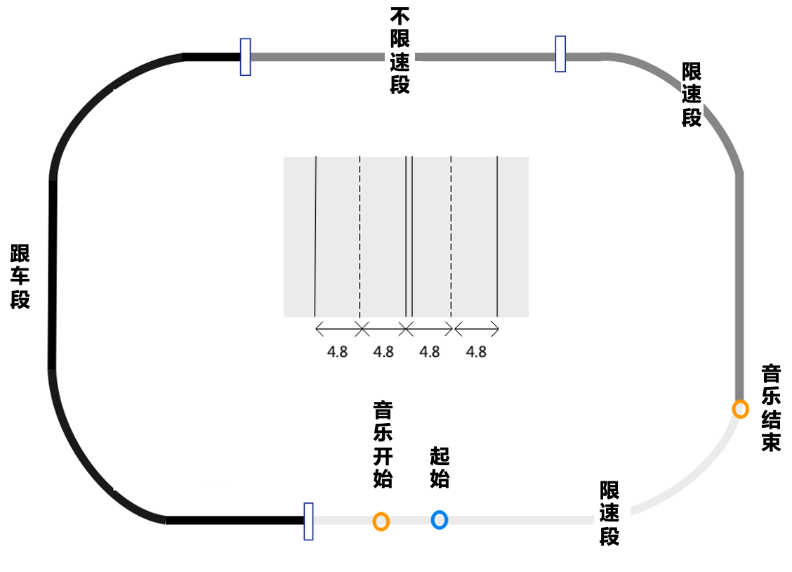

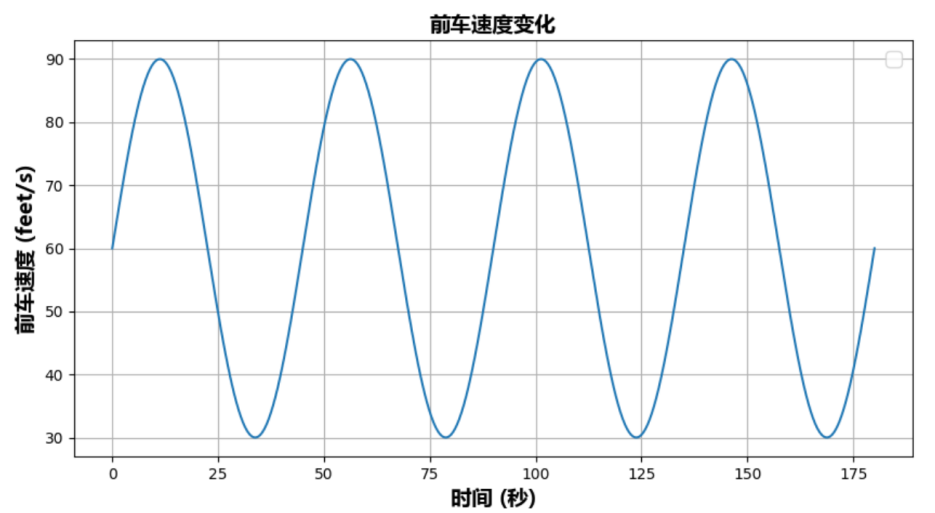

音乐流派对驾驶行为影响的多维分析：个人偏好与音乐元素的影响 图5-1 跟车任务路型图 Figure 5-1 Road diagram of the car-following task 图5-2 跟车任务前车速度变化图 Figure 5-2 Plot of speed change of the vehicle in front of the following task

#### 5.1.5 实验流程

被试进入实验室后，签署知情同意书，之后主试讲解模拟驾驶器使用和驾 驶任务要求，要求被试全程保持在右车道行驶。驾驶任务包括3 段：首先进行 一段3 分钟的跟车任务；其次，前车消失后，不限速驾驶任务；最后是一段限 速任务。 被试进行5 分钟的练习，熟悉驾驶模拟器和实验任务。主试在练习阶段对 参与者提供指导并评估其驾驶表现。如果被试适应了在模拟器上驾驶，则可进 入正式实验。 每名被试需要在7 种音乐条件下完成7 段驾驶任务。每段任务持续6~7 分 钟。每段任务后，被试需要进行主观评分，包括该段驾驶任务的愉悦度、唤醒

<!-- ===== 原文 第 55 页 ===== -->

第5 章 研究二：音乐流派和音乐速度对驾驶行为的影响 度、感知速度快慢和分心度，约2 分钟。被试可以选择是否休息，再次启动后 有约1 分钟的无音乐过渡段（限速50mph，约80km/h），之后进入下一段驾驶 任务。完成整个实验大约需要1 个小时。

#### 5.1.6 数据指标

（1） 跟车行为指标 跟车行为包括车辆间隔时间、车辆间隔时间标准差、车辆间隔距离、车辆 间隔距离标准差、一致性、增益、延迟、警告次数和落后时间，定义及计算方 式见表5-4。 （2）驾驶行为指标 驾驶模拟器刷新率为 10Hz，记录的传感器指标包括：系统时间、距离起点 时间、距离起点纵向距离、纵向速度（加速度）、横向速度（加速度，正负代 表了左右方向）、距离路中线的水平距离、车头转向角，油门和刹车踏板输入 值，与前车的距离，前车的横向位置和速度等。 在本实验中提取并计算以下驾 驶性能指标用于进一步分析： 1）纵向控制 纵向速度（longitudinal speed，V）、纵向速度标准差（standard deviation of longitudinal speed, V_SD）、超过时间（overspeed, 速度超过35mph 的时间）。 2）横向控制 绝对横向加速度（absolute lateral acceleration, Lacc）、横向位移标准差 （standard deviation of lateral position; SDLP）。 3）驾驶员动作 油门踏板计数（number of gas pedal reversals, gas）、刹车踏板计数（number of brake pedal pushes, brake）。 （3）认知感受 对前一段驾驶的感知速度快慢和分心度主观评分，采用7 点量表，1 表示非 常慢/集中。 （4）情绪体验： 主观愉悦和唤醒度（9 点评分）。 采用 SAM 量表评价被试的情绪状态。SAM 量表是一个9 级量表，用于情 绪的自我评定，包含愉悦度、唤醒度。SAM 量表配有清晰直观的图示，可以更 方便地评估被试当下的情绪状态。采用 9 点评分。1 代表非常愉悦，9 代表非常 不愉悦。

<!-- ===== 原文 第 56 页 ===== -->

音乐流派对驾驶行为影响的多维分析：个人偏好与音乐元素的影响 最后分别以各数据指标为因变量，以音乐偏好、音乐流派、音乐速度的为 自变量，进行重复测量方差检验。 表5-4 跟车行为指标定义及其计算方式 Table 5-4 Definition and calculation of car-following task 指标名称 定义 计算公式 车辆间隔时间 (Inter-Vehicular Time, IVT) 跟随车辆以其当前速度到达 前方车辆当前位置所需的时 间。 • D 车辆与前方车辆之间距离。 • 𝑣 车辆的当前速度。 车辆间时间标准差 (Standard Deviation of Inter-Vehicular Time, IVT_SD) 用于衡量车辆间时间在跟车 任务中的离散程度。 • D𝑖 第𝑖个数据点中车辆与前方车辆之间的 距离。 • 𝑣𝑖 第𝑖个数据点中车辆的当前速度。 车辆间隔距离 (Inter-Vehicular Distance, IVD) 跟随车辆和前车之间的距 离。 • D 车辆与前方车辆之间的距离。 车辆间隔距离标准差 (Standard Deviation of Inter-Vehicular Distance， IVD_SD) 用于衡量车辆间距离在跟车 任务中的离散程度。 • D𝑖 第𝑖个数据点中车辆与前方车辆之间的 距离。 一致性 (Coherence, COH) 两信号（两车速度）在频率 域中谱密度的相似性，代表 信号之间的线性耦合程度。 范围从0（完全无关）到1 （线性关系），(Navarro 等, 2023)。 • S𝑥𝑦(𝑓) 信号𝑥(𝑡)和y(t)在频率𝑓下的交叉谱 密度。 • 𝑆𝑥𝑥(𝑓) 信号𝑥(𝑡)频率𝑓下的功率谱密度。 • 𝑆𝑦𝑦(𝑓) 信号𝑦(𝑡)在频率𝑓下的功率谱密度。 增益 (Gain) 最大一致性频率下，第一个 信号的幅度在第二个信号中 的程度。大于1 表示过速调 整，小于1 表示低速调整 • 𝐴1(𝑓max_coh) 第一个信号在最大一致性频率 下的幅度。 • 𝐴2(𝑓max_coh) 第二个信号在最大一致性频率 下的幅度。 延迟 (Delay) 在最大一致性频率下，一个 信号相对于另一个信号的时 间提前或滞后。延迟越短， 表示驾驶员对前车速度变化 的反应越快。 • ϕ𝑥𝑦(𝑓max_coh) 在最大一致性频率下两个信号 之间的相位差。

<!-- ===== 原文 第 57 页 ===== -->

第5 章 研究二：音乐流派和音乐速度对驾驶行为的影响 表5-4 跟车行为指标定义及其计算方（续表） Table 5-4 Definition and calculation of car-following task （continued） 其余变量的主效应和交互效应上并没有发现显著结果。

|  | 指标名称 | 定义 | 计算公式 |
|---|---|---|---|
|  | 警告次数 | 两车间隔距离超过250feet， | • n 总的数据点数。 |
|  | (Warnings) | 系统发出被警告的次数。 | • 𝑊 𝑖 第𝑖次记录的警告状态，若系统在该次 |
|  |  |  | 记录中发出警告则𝑊 =1，否则𝑊 =0。 𝑖 𝑖 |
|  |  |  | • D𝑖第𝑖个数据点的车辆间隔距离。 |
|  | 落后时间 | 两车间隔距离超过 250feet | • 𝐼𝐼(D 𝑖 >250)是指示函数，当D 𝑖 >250 时取 |
| （ | Lag Time） | 的时长 | 值为1，否则取值为0。 |
|  |  |  | • Δ𝑡 每个数据点的时间间隔。 |
| 5.1.7 实 | 验结果 |  |  |
| （1） | 跟车指标 |  |  |
| 以 | 音乐偏好、音 | 乐流派、音乐速度的为 | 自变量，以跟车任务各指标为因变 |
| 量进行 | 2×2×3 的重复 | 测量方差分析，结果如 | 表5-6 所示。 |
| 音 | 乐流派的主效 | 应在车辆时间间隔、车 | 辆间隔时间标准差、车辆间隔距离、 |
| 车辆间 | 隔距离标准差 | 、一致性、增益、延迟 | 时间、警告次数和落后时间九个变 |
| 量上显 | 著。如图5-3所 | 示，相比于摇滚音乐， | 在古典音乐下完成跟车任务车辆间 |
| 隔时间 | 、车辆间隔时 | 间标准差、车辆间隔距 | 离、车辆间隔距离标准差显著更大， |
| 一致性 | 和增益显著更 | 小，延迟时间显著更长 | ，警告次数显著更多，落后时间显 |
| 著更长 | 。 |  |  |
| 音 | 乐偏好、流派和 | 音乐速度三者交互效 | 应在COH和Gain两个变量上显著。 |
| 如图5 | -4 所示，对于偏 | 好古典的被试，摇滚- | 中条件下的COH 要显著大于在摇滚 |
| -慢条件 | （p = 0.042*） | 。对于偏好摇滚的被试 | ，在摇滚-慢条件下的 COH 要显著 |
| 大于古 | 典-慢（p = 0.00 | 1**），在古典-快条件 | 下的COH 要显著大于古典-慢（p = |
| 0.015* | ）。如图 5-5 所 | 示，对于偏好古典的被 | 试，摇滚-中条件下的 Gain 要显著 |
| 大于在 | 摇滚-慢条件（ | p = 0.034*）。对于偏 | 好摇滚的被试，在摇滚-慢条件下的 |
| Gain 要 | 显著大于古典- | 慢（p = 0.001**），在古 | 典-快条件下的Gain 要显著大于古 |
| 典-慢（ | p = 0.011*） |  |  |

<!-- ===== 原文 第 58 页 ===== -->

音乐流派对驾驶行为影响的多维分析：个人偏好与音乐元素的影响

|  |  | 表5-5 实 | 验2 不同偏 | 好组在各音乐 | 条件下跟车 | 行为指标的 | 描述统计 |  |
|---|---|---|---|---|---|---|---|---|
| Ta | ble 5-5 | Descriptiv | e statistics of | the followin | g task metri | cs for the tw | o groups of d | rivers in |
|  |  |  | Experi | ment 2 for e | ach music co | ndition |  |  |
|  |  |  | 摇滚 |  |  | 古典 |  | 对照 |
|  |  | 慢 | 中 | 快 | 慢 | 中 | 快 | 无音乐 |
|  |  | 均值 | 均值 | 均值 | 均值 | 均值 | 均值 | 均值 |
|  |  | (标准差) | (标准差) ( | 标准差) | (标准差) | (标准差) | (标准差) | (标准差) |
| 1. | IVT (s) |  |  |  |  |  |  |  |
|  | 古典 | 2.3 | 2.45 | 2.35 | 2.7 | 2.96 | 2.73 | 2.31 |
|  |  | (1.11) | (1.68) | (1.15) | (1.73) | (3.1) | (1.54) | (1.09) |
|  |  | 2.01 | 2.14 | 1.98 | 3.05 | 2.4 | 2.04 | 2.18 |
|  | 摇滚 |  |  |  |  |  |  |  |
|  |  | (0.88) | (0.97) | (0.88) | (2.98) | (1.53) | (0.77) | (1) |
| 2. | IVT SD | (s) |  |  |  |  |  |  |
|  | _ |  |  |  |  |  |  |  |
|  | 古典 | 0.88 | 0.9 | 0.8 | 1.00 | 1.11 | 1.03 | 0.72 |
|  |  | (0.74) | (0.94) | (0.62) | (0.85) | (1.33) | (0.87) | (0.38) |
|  | 摇滚 | 0.61 | 0.83 | 0.7 | 1.02 | 0.89 | 0.71 | 0.85 |
|  |  | (0.3) | (0.75) | (0.68) | (0.92) | (0.82) | (0.32) | (0.62) |
| 3. | IVD (fee | t) |  |  |  |  |  |  |
|  | 古典 | 130.82 | 137.95 | 135.11 | 155.27 | 170.04 | 158.81 | 134.55 |
|  |  | (61.29) | (89.06) | (65.5) | (93.5) | (170.86) | (91.21) | (66.8) |
|  |  | 114.62 | 124.25 | 113.65 | 178.38 | 139.79 | 119.85 | 126.41 |
|  | 摇滚 |  |  |  |  |  |  |  |
|  |  | (51.92) | (60.09) | (50.83) | (176.03) | (91.48) | (46.94) | (62.58) |
| 4. | IVD SD | (feet) |  |  |  |  |  |  |
|  | _ |  |  |  |  |  |  |  |
|  | 古典 | 56.62 | 56.76 | 57.25 | 69.99 | 74.52 | 75.17 | 57.49 |
|  |  | (32.99) | (41.17) | (39.9) | (41.34) | (74.71) | (57.18) | (34.52) |
|  | 摇滚 | 44.25 | 62.25 | 49.1 | 74.25 | 63.99 | 59.14 | 61.55 |
|  |  | (25.88) | (59.38) | (33.7) | (61.16) | (53.1) | (29.88) | (50.19) |
| 5. | COH |  |  |  |  |  |  |  |
|  |  | 0.53 | 0.58 | 0.56 | 0.53 | 0.55 | 0.52 | 0.59 |
|  | 古典 |  |  |  |  |  |  |  |
|  |  | (0.18) | (0.21) | (0.23) | (0.22) | (0.24) | (0.2) | (0.18) |
|  |  | 0.61 | 0.58 | 0.6 | 0.52 | 0.58 | 0.59 | 0.56 |
|  | 摇滚 |  |  |  |  |  |  |  |
|  |  | (0.15) | (0.18) | (0.16) | (0.22) | (0.2) | (0.16) | (0.17) |
| 6. | Gain |  |  |  |  |  |  |  |
|  | 古典 | 0.72 | 0.75 | 0.73 | 0.71 | 0.71 | 0.71 | 0.76 |
|  |  | (0.13) | (0.15) | (0.16) | (0.17) | (0.2) | (0.14) | (0.13) |
|  | 摇滚 | 0.77 | 0.75 | 0.77 | 0.7 | 0.74 | 0.76 | 0.74 |
|  |  | (0.1) | (0.13) | (0.11) | (0.17) | (0.16) | (0.11) | (0.12) |
| 7. | Delay (s | ) |  |  |  |  |  |  |
|  |  | 1.85 | 1.87 | 2.00 | 2.49 | 2.77 | 2.55 | 2.12 |
|  | 古典 |  |  |  |  |  |  |  |
|  |  | (1.34) | (1.5) | (1.48) | (1.78) | (3.01) | (2.00) | (1.88) |
|  |  | 1.47 | 1.97 | 1.80 | 2.06 | 2.35 | 1.79 | 2.05 |
|  | 摇滚 |  |  |  |  |  |  |  |
|  |  | (0.93) | (1.55) | (1.44) | (2.88) | (2.09) | (1.06) | (1.86) |
| 8. | 警告次 | 数 |  |  |  |  |  |  |
|  | 古典 | 1.44 | 1.94 | 1.56 | 2.38 | 2.19 | 2.38 | 1.5 |
|  |  | (2.28) | (3.07) | (2.61) | (3.48) | (3.73) | (3.05) | (2.34) |
|  | 摇滚 | 0.88 | 1.69 | 1.06 | 2.63 | 1.88 | 1.41 | 1.5 |
|  |  | (1.93) | (2.44) | (2.11) | (3.81) | (3.18) | (1.73) | (2.34) |
| 9. | 落后时 | 间 (ms) |  |  |  |  |  |  |
|  |  | 492.94 | 705.69 | 516.13 | 831.44 | 767.38 | 842.00 | 478.13 |
|  | 古典 |  |  |  |  |  |  |  |
|  |  | (830.11) | (1300.5) | (913.52) | (1374.14) | (1510.91) | (1174.95) | (905.68) |
|  |  | 330.87 | 468.19 | 325.56 | 1059.13 | 662.44 | 457.00 | 474.94 |
|  | 摇滚 |  |  |  |  |  |  |  |
|  |  | (727.13) | (803.17) | (633.41) | (1628.35) | (1216.83) | (544.24) | (810.51) |
|  | 40 |  |  |  |  |  |  |  |

<!-- ===== 原文 第 59 页 ===== -->

第5 章 研究二：音乐流派和音乐速度对驾驶行为的影响 表5-6 实验2 中跟车任务指标下的方差分析结果

|  |  | Table | 5-6 ANOVA | results in | Experiment 2 with the | car-following task | indicator as the dep | endent variable |  |
|---|---|---|---|---|---|---|---|---|---|
|  |  | 偏好 | 流派 |  | 音乐速度 | 偏好×流派 | 偏好×音乐速度 | 流派×音乐速度 | 偏好×流派×音乐速度 |
|  |  | 2 |  | 2 | 2 | 2 | 2 | 2 | 2 |
|  | F (1,28) | p η | F p (1,28) | η | F p η F (2,56) (1, | p η F 28) | p η F (2,56) | p η (2,56) | F p η (2,56) |
| IVT | 0.314 | 0.580 0.011 | 6.904 0.014* | 0.198 | 0.813 0.449 0.028 0.0 | 06 0.941 0.000 1 | .119 0.334 0.038 1 | .427 0.249 0.049 | 1.388 0.258 0.047 |
| IVT SD | 0.302 | 0.587 0.011 | 6.996 0.013* | 0.200 | 0.952 0.385 0.033 0.0 | 15 0.904 0.001 0 | .342 0.690 0.012 0 | .611 0.519 0.021 | 1.811 0.180 0.061 |
| _ |  |  |  |  |  |  |  |  |  |
| IVD | 0.238 | 0.629 0.008 | 8.018 0.008* | * 0.223 | 0.717 0.493 0.025 0.0 | 08 0.929 0.000 1 | .268 0.289 0.043 1 | .435 0.247 0.049 | 1.435 0.247 0.049 |
| IVD SD | 0.075 | 0.786 0.003 | 17.622 0.000** | * 0.387 | 0.319 0.723 0.011 0.0 | 90 0.766 0.003 1 | .273 0.288 0.043 0 | .896 0.393 0.031 | 1.108 0.326 0.038 |
| _ |  |  |  |  |  |  |  |  |  |
| COH | 0.124 | 0.728 0.004 | 4.280 0.048* | 0.133 | 1.422 0.250 0.048 0.1 | 35 0.716 0.005 2 | .271 0.113 0.075 0 | .609 0.548 0.021 | 3.616 0.033* 0.114 |
| Gain | 0.162 | 0.690 0.006 | 4.640 0.040* | 0.142 | 1.134 0.329 0.039 0.1 | 44 0.708 0.005 1 | .974 0.148 0.066 0 | .836 0.439 0.029 | 3.435 0.039* 0.109 |
| Delay | 0.231 | 0.635 0.008 | 12.323 0.002* | * 0.306 | 0.781 0.423 0.027 1.7 | 09 0.202 0.058 0 | .781 0.423 0.027 0 | .343 0.653 0.012 | 0.135 0.818 0.005 |
| 警告次数 | 0.082 | 0.777 0.003 | 10.655 0.003* | * 0.276 | 0.372 0.691 0.013 0.0 | 13 0.909 0.000 1 | .027 0.365 0.035 2 | .548 0.087 0.083 | 0.545 0.583 0.019 |
| 落后时间 | 0.092 | 0.764 0.003 | 9.731 0.004* | * 0.265 | 0.639 0.532 0.023 0.1 | 17 0.735 0.004 1 | .134 0.329 0.040 2 | .410 0.099 0.082 | 0.849 0.433 0.031 |
| 注： | ***p < | 0.001, ** p < 0 | .01, * p < 0.05 |  |  |  |  |  |  |

<!-- ===== 原文 第 60 页 ===== -->

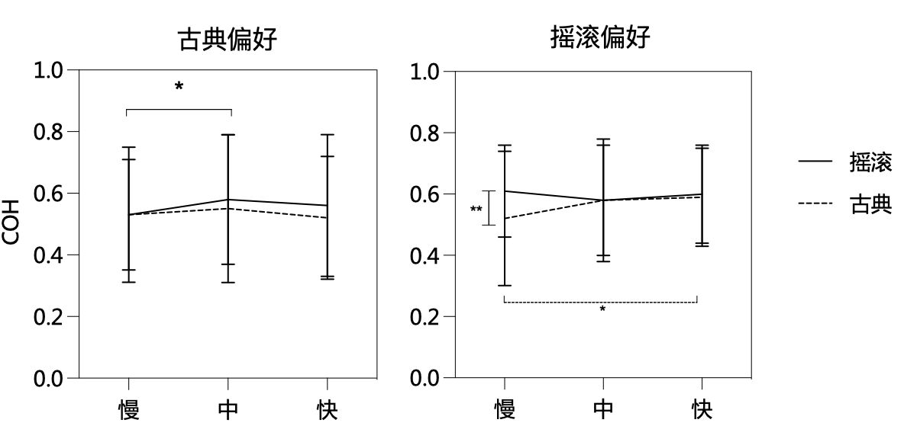

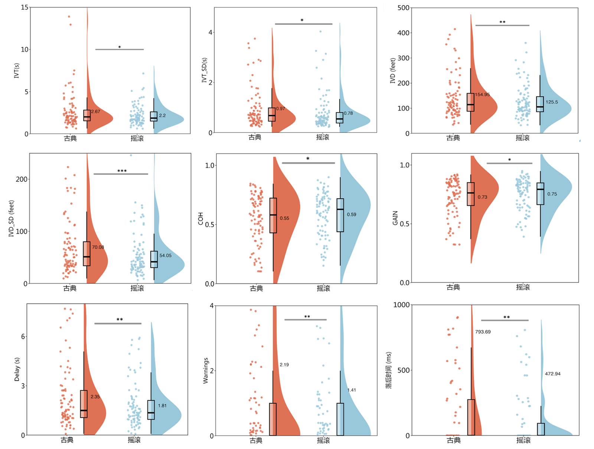

音乐流派对驾驶行为影响的多维分析：个人偏好与音乐元素的影响 图5-3 不同音乐流派下跟车任务表现的结果（实验2） Figure 5-3 Car-following results under different music genres in Experiment 2 图5-4 偏好、流派和速度交互效应在COH 的结果（实验2） Figure 5-4 Experiment 2: Interaction effects of preference, genre, and tempo on COH

<!-- ===== 原文 第 61 页 ===== -->

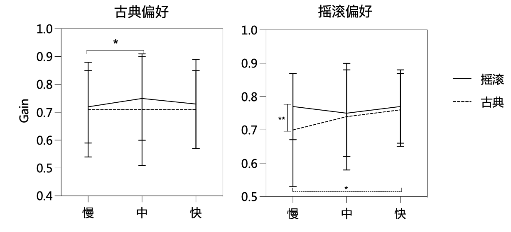

第5 章 研究二：音乐流派和音乐速度对驾驶行为的影响 图5-5 偏好、流派和速度交互效应在Gain 的结果（实验2） Figure 5-5 Experiment 2: Interaction effects of preference, genre, and tempo on Gain （2） 驾驶行为 以音乐偏好、音乐流派、音乐速度的为自变量，以驾驶行为各指标为因变 量进行2×2×3 的重复测量方差分析的，结果如表5-8 所示。 音乐流派的主效应在车纵向速度、纵向加速度、绝对横向加速度和油门踏 板计数四个变量上显著。如图5-6所示，相比于古典音乐，在摇滚音乐下驾驶的 纵向速度、纵向加速度、绝对横向加速度和油门踏板计数显著更大。 音乐速度的主效应在纵向速度、绝对横向加速度和两个变量上显著，如图 5-7 所示。慢速音乐下，纵向速度显著低于在中速条件下（p =0.013*）和快速条 件下（p =0.022*）。慢速音乐下，绝对横向加速度显著低于在中速条件下（p =0.004**）和快速条件下（p =0.042*）。 音乐偏好和音乐流派的交互效应在纵向速度标准差和刹车踏板计数两个变 量上显著，如图5-8所示。对摇滚偏好的被试，在摇滚乐下的速度标准差、刹车 踏板计数要显著大于在古典条件下（p = 0.017*）。对于摇滚偏好的被试，相比 于古典乐，在摇滚乐下的刹车踏板计数显著更大（p =0.005**） 在其余变量和交互效应上没有发现显著结果。 另外，比较无音乐和其余6 种音乐条件下的差异，在纵向速度、纵向加速 度、绝对横向加速度和横向位移标准差上发现其它音乐条件与无音乐条件有显 著差异，如图5-9所示。对于偏好摇滚被试，在无音乐条件下的纵向速度、绝对 横向加速度显著小于在摇滚-快。对于偏好古典的被试，在无音乐条件下纵向加 速度要显著小于摇滚-快，横向位移标准差要显著小于摇滚-中和摇滚-快。

<!-- ===== 原文 第 62 页 ===== -->

音乐流派对驾驶行为影响的多维分析：个人偏好与音乐元素的影响

|  | 表5-7 实验2 不同偏 | 好组在各音 | 乐条件下驾 | 驶行为指 | 标的描述统计 |  |
|---|---|---|---|---|---|---|
| Ta | ble 5-7 Descriptive statistics o | f driving beh | avior indic | ators for di | fferent prefere | nce groups |
|  | of drivers i | n each music | condition i | n Experime | nt 2 |  |
|  | 摇滚 |  |  | 古典 |  | 对照 |
|  | 慢 中 | 快 | 慢 | 中 | 快 | 无音乐 |
|  | 均值 均值 | 均值 | 均值 | 均值 | 均值 | 均值 |
|  | (标准差) (标准差) | (标准差) | (标准差) | (标准差) | (标准差) | (标准差) |
| 1. | 纵向速度（feet/s） |  |  |  |  |  |
|  | 91.49 92.71 | 95.99 | 86.75 | 92.58 | 87.71 | 92.3 |
|  | 古典 |  |  |  |  |  |
|  | (18.92) (19.83) | (15.86) | (16.29) | (19.11) | (14.49) | (13.35) |
|  | 86.69 89.91 摇滚 | 95.23 | 80.33 | 87.07 | 84.26 | 82.91 |
|  | (16.02) (18.98) | (13.02) | (24.69) | (17.21) | (19.00) | (16.38) |
| 2. | 纵向速度标准差（feet/s） |  |  |  |  |  |
|  | 13.84 13.4 古典 | 12.5 | 12.91 | 13.39 | 14.6 | 14.07 |
|  | (5.87) (4.54) | (4.41) | (4.48) | (5.67) | (4.74) | (4.6) |
|  | 15.89 14.13 摇滚 | 15.59 | 11.68 | 14.74 | 12.83 | 15.12 |
|  | (7.1) (6.07) | (5.55) | (6.83) | (6.81) | (6.25) | (5.77) |
| 3. | 纵向加速度（feet/s2） |  |  |  |  |  |
|  | 1.03 1.17 | 1.41 | 0.79 | 1.15 | 0.81 | 0.89 |
|  | 古典 |  |  |  |  |  |
|  | (0.9) (1.2) | (1.2) | (1.12) | (0.85) | (0.93) | (0.75) |
|  | 0.67 0.95 摇滚 | 1.16 | 0.71 | 0.65 | 0.62 | 0.75 |
|  | (1.27) (1.33) | (1.18) | (1.22) | (1.31) | (1.3) | (1.18) |
| 4. | 绝对横向加速度（feet/s2） |  |  |  |  |  |
|  | 1.13 1.17 古典 | 1.22 | 0.95 | 1.16 | 0.98 | 1.09 |
|  | (0.48) (0.57) | (0.46) | (0.53) | (0.53) | (0.39) | (0.35) |
|  | 0.96 1.09 摇滚 | 1.16 | 0.81 | 1.05 | 0.98 | 0.89 |
|  | (0.51) (0.59) | (0.47) | (0.62) | (0.5) | (0.55) | (0.47) |
| 5. | 横向位移标准差（feet） |  |  |  |  |  |
|  | 1.42 1.5 | 1.47 | 1.32 | 1.32 | 1.32 | 1.25 |
|  | 古典 |  |  |  |  |  |
|  | (55.84) (66.42) | (60.53) | (61.44) | (53.08) | (54.57) | (54.99) |
|  | 1.37 1.35 摇滚 | 1.26 | 1.3 | 1.35 | 1.36 | 1.26 |
|  | (53.96) (77.14) | (42.19) | (116.83) | (70.07) | (80.99) | (70.41) |
| 6. | 超过35mph 的时间（ms） |  |  |  |  |  |
|  | 172 177.8 古典 | 166.13 | 158 | 144.2 | 177.6 | 141.67 |
|  | (98.72) (118.68) | (99.23) | (84.79) | (92.35) | (114.76) | (77.6) |
|  | 184.87 241.67 | 212.13 | 159.07 | 204.67 | 210.33 | 219.2 |
|  | 摇滚 |  |  |  |  |  |
|  | (152.93) (145.51) | (156.96) | (134.61) | (158.66) | (137.18) | (149.09) |
| 7. | 油门踏板计数 |  |  |  |  |  |
|  | 37174.35 37512.17 | 41634.92 | 34394.39 | 38450.71 | 35739.91 | 36852.20 |
|  | 古典 |  |  |  |  |  |
|  | (11798.24) (15136.94) | (13191.7) | (11923.24) | (11581.3) | (11313.41) | (9374.26) |
|  | 36257.25 36008.02 | 41029.18 | 30854.85 | 32191.46 | 31860.38 | 34278.59 |
|  | 摇滚 |  |  |  |  |  |
|  | (13980.2) (15266.03) | (11364.53) | (14848.11) | (14993.14) | (13106.82) | (12343.39) |
| 8. | 刹车踏板计数 |  |  |  |  |  |
|  | 2044.73 1790.22 | 1890.87 | 1703.99 | 1958.13 | 2194.84 | 2239.11 |
|  | 古典 |  |  |  |  |  |
|  | (1989.49) (1504.28) | (1617.73) | (1832.23) | (2059.1) | (1726.73) | (1564.25) |
|  | 3035.52 1895.05 | 2632.51 | 1193.75 | 1881.27 | 1659.31 | 2164.43 |
|  | 摇滚 |  |  |  |  |  |
|  | (3232.51) (1817.64) | (1554.7) | (1505.15) | (1697.11) | (1733.25) | (1491.98) |

<!-- ===== 原文 第 63 页 ===== -->

第5 章 研究二：音乐流派和音乐速度对驾驶行为的影响 表5-8 实验2 中驾驶行为指标下的方差分析结果

|  |  | T | able 5- | 8 ANOV | A result | s in Experi | ment 2 with driving | behavior indicat | or as the dependen | t variable |  |
|---|---|---|---|---|---|---|---|---|---|---|---|
|  |  | 偏好 |  |  | 流派 |  | 音乐速度 | 偏好×流派 | 偏好×音乐速度 | 流派×音乐速度 | 偏好×流派×音乐速度 |
|  |  |  | 2 |  |  | 2 | 2 | 2 | 2 | 2 | 2 |
|  | F (1,28) | p | η | F (1,28) | p | η F (2,56 | p η F ) (1,2 | p η F 8) | p η F (2,56) | p η (2,56) | F p η (2,56) |
| 纵向速度 | 0.485 | 0.492 | 0.017 | 17.289 | 0.000*** | 0.382 3.97 | 0.024* 0.124 0.76 | 6 0.389 0.027 0 | .483 0.62 0.017 2 | .239 0.116 0.074 | 0.013 0.987 0.000 |
| 纵向速度标准差 | 0.216 | 0.646 | 0.008 | 2.159 | 0.153 | 0.072 0.123 | 0.884 0.004 4.52 | 8 0.042* 0.139 0 | .092 0.912 0.003 1 | .399 0.255 0.048 | 1.232 0.299 0.042 |
| 纵向加速度 | 0.558 | 0.461 | 0.02 | 10.41 | 0.003** | 0.271 1.941 | 0.16 0.065 0.01 | 1 0.918 0.00 0 | .251 0.747 0.009 1 | .498 0.235 0.051 | 0.456 0.592 0.016 |
| 绝对横向加速度 | 0.334 | 0.568 | 0.012 | 16.154 | 0.000*** | 0.366 4.487 | 0.016* 0.138 0.06 | 4 0.802 0.002 0 | .705 0.499 0.025 0 | .947 0.394 0.033 | 0.056 0.946 0.002 |
| 横向位移标准差 | 0.154 | 0.697 | 0.005 | 1.414 | 0.244 | 0.048 0.146 | 0.865 0.005 1.78 | 6 0.192 0.06 0 | .097 0.908 0.003 0 | .15 0.861 0.005 | 0.354 0.704 0.012 |
| 超速时间 | 0.900 | 0.351 | 0.031 | 2.036 | 0.165 | 0.068 1.435 | 0.247 0.049 0.16 | 3 0.69 0.006 1 | .52 0.228 0.052 1 | .213 0.305 0.042 | 0.021 0.979 0.001 |
| 油门踏板计数 | 0.465 | 0.501 | 0.016 | 15.193 | 0.000*** | 0.352 2.539 | 0.102 0.083 2.52 | 6 0.123 0.083 0 | .273 0.709 0.01 1 | .805 0.179 0.061 | 0.058 0.927 0.002 |
| 刹车踏板计数 | 0.051 | 0.823 | 0.002 | 4.194 | 0.05 | 0.13 0.401 | 0.654 0.014 5.04 | 9 0.033* 0.153 0 | .114 0.876 0.004 2 | .752 0.079 0.09 | 0.977 0.376 0.034 |

<!-- ===== 原文 第 64 页 ===== -->

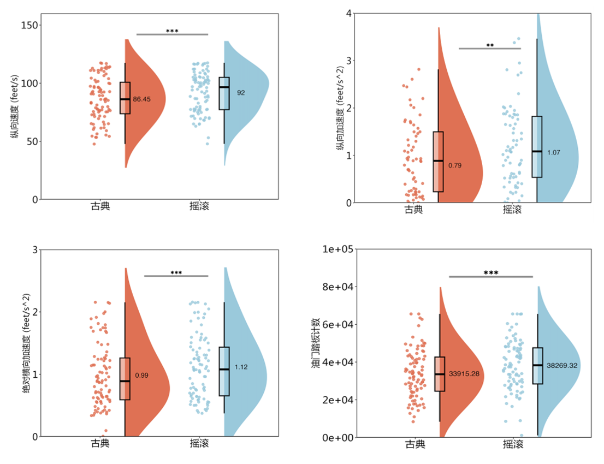

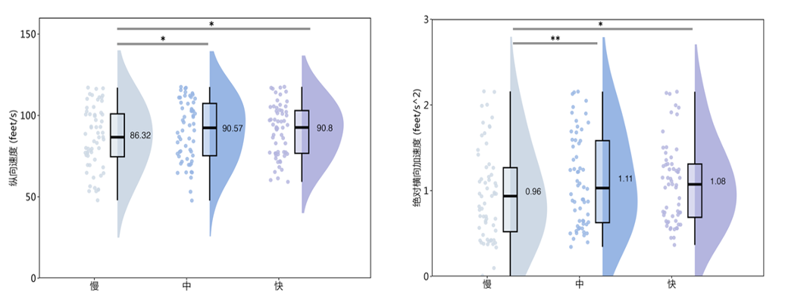

音乐流派对驾驶行为影响的多维分析：个人偏好与音乐元素的影响 图5-6 不同音乐流派下驾驶表现的结果（实验2） Figure 5-6 Driving results under different music genres in Experiment 2 图5-7 不同音乐速度下的驾驶表现结果（实验2） Figure 5-7 Driving results under different music tempo in Experiment 2

<!-- ===== 原文 第 65 页 ===== -->

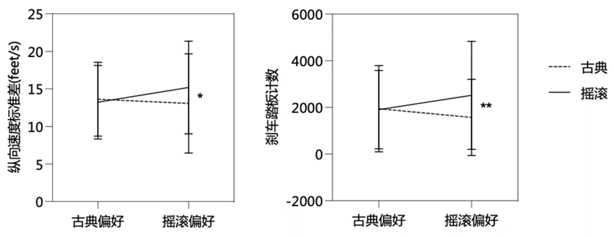

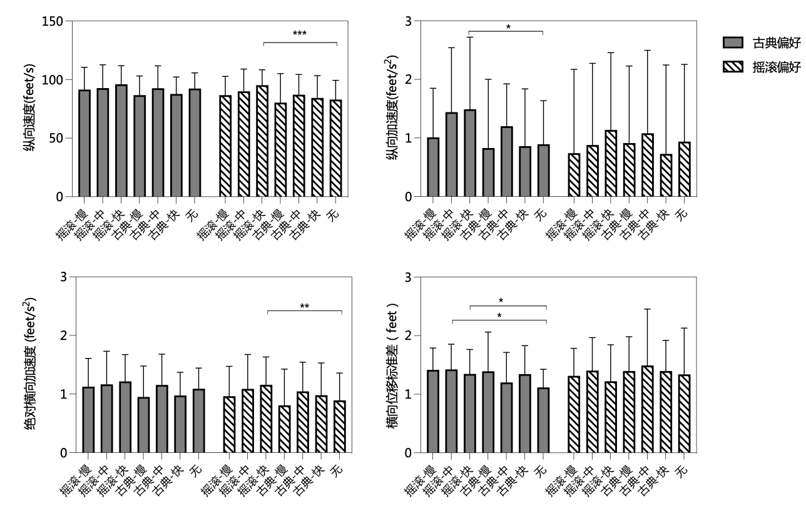

第5 章 研究二：音乐流派和音乐速度对驾驶行为的影响 图5-8 偏好和流派的交互效应在驾驶表现的结果（实验2） Figure 5-8 Experiment 2: Interaction effects of preference and genre on driving results 图5-9 不同偏好组在各音乐条件下的驾驶表现结果（实验2） Figure 5-9 Driving results at different conditions for different preference drivers in Experiment 2

<!-- ===== 原文 第 66 页 ===== -->

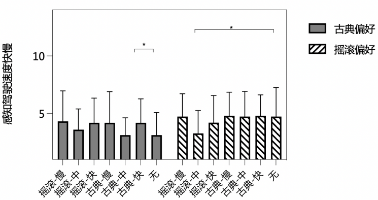

音乐流派对驾驶行为影响的多维分析：个人偏好与音乐元素的影响 （3） 认知感受 以音乐偏好、音乐流派、音乐速度的为自变量，以认知感受各指标为因变 量，进行2×2×3 的重复测量方差，结果如表5-10 所示。 在各变量的主效应和交互效应上，没有发现显著的结果。 比较无音乐和其余6 种音乐条件下的差异，在感知速度上发现其它音乐条 件与无音乐条件有显著差异，如图5-10 所示。在感知速度上，对于偏好摇滚的 被试，在无音乐条件下感知的驾驶速度要显著大于摇滚-中条件下（p = 0.025*）；对于偏好古典的被试，在无音乐条件下的感知速度要显著慢于古典- 快下（p = 0.048*），如图5-10。 图5-10 不同偏好组在各音乐条件下的认知感受结果（实验2） Figure 5-10 Cognitive results at different conditions for different preference drivers in Experiment 2

<!-- ===== 原文 第 67 页 ===== -->

第5 章 研究二：音乐流派和音乐速度对驾驶行为的影响

|  |  |  |  |  |  |  |  | 表5-9 | 实 | 验2 不同 | 偏 | 好 | 组在各音乐条 | 件 | 下认知感 | 受指标的 | 描述统计 |  |  |  |  |  |  |  |
|---|---|---|---|---|---|---|---|---|---|---|---|---|---|---|---|---|---|---|---|---|---|---|---|---|
|  | T | able 5- | 9 Desc | ripti | ve sta | tistics | of cog | nitive ex | per | ience indi | c | ator | s for different | p | referenc | e groups of | drivers | in eac | h | musi | c conditi | on in | Experim | ent 2 |
|  |  |  |  |  |  |  |  | 摇滚 |  |  |  |  |  |  |  |  | 古典 |  |  |  |  |  | 对照 |  |
|  |  |  |  |  |  | 慢 |  |  | 中 |  |  |  | 快 |  | 慢 |  | 中 |  |  | 快 |  |  | 无音乐 |  |
|  |  |  |  |  | 均 | 值 |  |  | 均 | 值 |  | 均 | 值 |  | 均值 |  | 均值 |  |  | 均值 |  |  | 均值 |  |
|  |  |  |  |  | (标 | 准差) |  | (标 | 准 | 差) |  | (标 | 准差) |  | (标准差) | (标 | 准差) |  | (标 | 准 | 差) |  | (标准差) |  |
| 1. | 感知 | 驾驶速 | 度 |  |  |  |  |  |  |  |  |  |  |  |  |  |  |  |  |  |  |  |  |  |
|  | 古典 |  |  |  | 4.33 | (2.64) |  | 3.6 | 0 ( | 1.8) | 4 | .20 | (2.14) |  | 4.20 (2.7 | ) 3.13 | (1.51) | 4 | .2 | 0 (2. | 08) |  | 3.13 (1.9 | 6) |
|  | 摇滚 |  |  |  | 4.73 | (1.98) |  | 3.27 | (1 | .98) | 4 | .20 | (2.37) |  | 4.8 (2.04 | ) 4.73 | (2.19) | 4 | .8 | 0 (1. | 82) |  | 4.73 (2.5 | 2) |
| 2. | 分心 | 度 |  |  |  |  |  |  |  |  |  |  |  |  |  |  |  |  |  |  |  |  |  |  |
|  | 古典 |  |  |  | 5.53 | (2.42) |  | 6.00 | (2 | .59) |  | 5.4 ( | 3.07) |  | 5.87 (2.17 | ) 5.0 | 0 (2.7) |  | 5.8 | (2.3 | 1) |  | 5.27 (2.0 | 5) |
|  | 摇滚 |  |  |  | 5.73 | (2.15) |  | 6.40 | (2 | .10) | 6 | .73 | (1.87) |  | 5.13 (1.88 | ) 5.67 | (1.91) | 6 | .2 | 0 (2. | 08) |  | 5.47 (2.0 | 0) |
|  |  |  |  |  |  |  |  |  | 表 | 5-10 实验 | 2 | 中 | 认知感受指标 | 下 | 的方差 | 分析结果 |  |  |  |  |  |  |  |  |
|  |  |  |  | T | able | 5-10 A | NOV | A results | in | Experime | nt | 2 w | ith cognitive e |  | xperience | indicator a | s the de | pende | nt | vari | able |  |  |  |
|  |  |  | 偏好 |  |  |  | 流派 |  |  | 音乐速度 |  |  | 偏好×流 |  | 派 | 偏好×音乐 | 速度 | 流派 | ×音 | 乐 | 速度 | 偏好× | 流派×音 | 乐速度 |
|  |  |  |  | 2 |  |  |  | 2 |  |  |  | 2 |  |  | 2 |  | 2 |  |  |  | 2 |  |  | 2 |
|  |  | F (1,28) | p | η |  | F (1,28) | p | η F | (2, | p 56) |  | η | F p (1,28) |  | η F | p (2,56) | η | F (2,56) |  | p | η | F (2,56) | p | η |
| 感 | 知驾 |  |  |  |  |  |  |  |  |  |  |  |  |  |  |  |  |  |  |  |  |  |  |  |
|  |  | 0.876 | 0.357 | 0.030 |  | 0.933 | 0.342 | 0.032 3 | .2 | 21 0.057 0 | . | 103 | 2.964 0.096 |  | 0.096 0 | .117 0.855 | 0.004 | 0.427 | 0. | 642 | 0.015 | 1.213 | 0.304 | 0.042 |
| 驶速 | 度 |  |  |  |  |  |  |  |  |  |  |  |  |  |  |  |  |  |  |  |  |  |  |  |
| 分心 | 度 | 0.642 | 0.430 | 0.022 |  | 0.826 | 0.371 | 0.029 0 | .8 | 45 0.435 0 | . | 029 | 0.465 0.501 |  | 0.016 1 | .308 0.279 | 0.045 | 0.845 | 0. | 435 | 0.029 | 0.515 | 0.600 | 0.018 |

<!-- ===== 原文 第 68 页 ===== -->

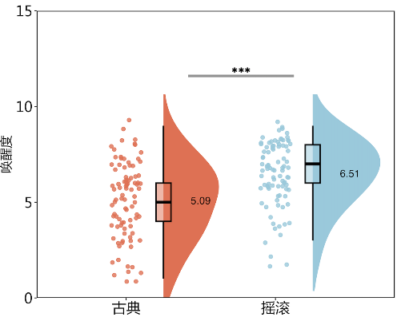

音乐流派对驾驶行为影响的多维分析：个人偏好与音乐元素的影响 （4） 情绪体验 以音乐偏好、音乐流派、音乐速度的为自变量，以情绪体验各指标为因变 量，进行2×2×3 的重复测量方差，以结果如表5-12 所示。 流派的主效应在唤醒度上显著，如图5-11，在摇滚音乐下唤醒度显著更大。 音乐速度的主效应在愉悦度和唤醒度上显著，如图5-12。中速速度下的愉 悦速要显著高于慢速度和快速度。在慢速度下的唤醒度显著小于中速和快速音 乐下。 音乐偏好和音乐流派的交互效应在愉悦度上显著， 如图5-13 对于偏好摇滚 的被试，在摇滚音乐下的愉悦度显著大于在古典音乐下（p = 0.001**）。 在其余变量和交互效应上没有发现显著结果。 比较无音乐和其余6 种音乐条件下的差异，在愉悦度和唤醒度上发现其它 音乐条件与无音乐条件有显著差异，如图5-13 所示。偏好古典的被试，在无音 乐条件下的愉悦度要显著小于在摇滚-中、摇滚-快、古典-中和古典-快；偏好摇 滚的被试，在无音乐条件下的愉悦度要显著小于除了古典-慢和古典-快。偏好 古典和摇滚的被试，在无音乐条件下的唤醒度要与古典-慢无显著差异，与其它 条件均有显著差异。 图5-11 实验2 不同音乐流派下的唤醒度结果 Figure 5-11 Arousal results under different music genres in Experiment 2

<!-- ===== 原文 第 69 页 ===== -->

第5 章 研究二：音乐流派和音乐速度对驾驶行为的影响 表5-11 实验2 不同偏好组在各音乐条件下情绪体验指标的描述统计 1. 愉悦度 2. 唤醒度 愉悦度 1.098 0.304 0.038  3.372 0.077 0.107  7.083 0.003** 0.202  10.814 0.003** 0.279  1.447 0.245 0.049  0.074 0.923 0.003  0.761 0.468 0.026 唤醒度 0.073 0.789 0.003  42.180 0.000*** 0.601  21.264 0.000*** 0.432  0.257 0.616 0.009  1.876 0.163 0.063  2.171 0.124 0.072  0.191 0.827 0.007

| able 5- | 1 | 1 De | scriptive s | ta | ti | st | ics of emot | ional experie | nce i | ndicato | rs for | differen | t p | refe | rence gro | ups o | f drivers i | n | ea | ch | music | condition in E | x | perimen |
|---|---|---|---|---|---|---|---|---|---|---|---|---|---|---|---|---|---|---|---|---|---|---|---|---|
|  |  |  |  |  |  |  |  | 摇滚 |  |  |  |  |  |  |  | 古 | 典 |  |  |  |  |  |  | 对照 |
|  |  |  |  |  |  |  | 慢 | 中 |  | 快 |  |  |  |  | 慢 |  | 中 |  |  | 快 |  |  |  | 无音乐 |
|  |  |  |  |  |  | 均 | 值 | 均值 | 均 | 值 |  |  |  | 均 | 值 | 均 | 值 |  | 均 |  | 值 |  |  | 均值 |
|  |  |  |  |  | (标 |  | 准差) | (标准差) | (标 | 准差) |  |  |  | (标 | 准差) | (标 | 准差) |  | (标 | 准 | 差) |  |  | (标准差) |
| 度 |  |  |  |  |  |  |  |  |  |  |  |  |  |  |  |  |  |  |  |  |  |  |  |  |
|  |  | 古典 |  | 5 | .5 | 3 | (1.41) 7 | .07 (1.33) | 6.33 | (1.45) |  |  |  | 6.13 | (1.81) | 7.33 | (1.23) | 6 | .60 | (1 | .68) |  |  | 5.27 (1.1 |
|  |  | 摇滚 |  | 6 | .6 | 7 | (1.59) | 6.93 (1.1) | 6.93 | (0.8) |  |  |  | 5.07 | (1.94) | 5.87 | (1.6) |  | 5.6 | (1 | .4) |  | 4 | .87 (1.41 |
| 度 |  |  |  |  |  |  |  |  |  |  |  |  |  |  |  |  |  |  |  |  |  |  |  |  |
|  |  | 古典 |  |  | 5.4 | 7 | (2.1) 7 | .40 (1.24) | 6.67 | (1.29) |  |  |  | 3.67 | (1.95) | 5.93 | (1.49) | 6 | .00 | (1 | .69) |  | 3 | .73 (1.91 |
|  |  | 摇滚 |  | 6 | .0 | 0 | (1.77) 6 | .87 (1.25) | 6.67 | (1.59) |  |  |  | 4.07 | (2.02) | 5.40 | (1.92) | 5 | .47 | (1 | .64) |  | 3 | .93 (1.75 |
|  |  |  |  |  |  |  |  | 表5-1 | 2 实 | 验2 中 | 情绪体 | 验指标 | 下 | 的方 | 差分析结 | 果 |  |  |  |  |  |  |  |  |
|  |  |  | Table |  | 5- | 12 | ANOVA | results in Exp | erim | ent 2 w | ith em | otional | ex | perie | nce indic | ator | as the dep | e | nde | n | t variab | le |  |  |
|  |  | 偏好 |  |  |  |  | 流派 | 音乐 | 速度 |  | 偏 | 好×流派 |  |  | 偏好×音 | 乐速 | 度 流派 | × | 音 | 乐 | 速度 | 偏好×流派×音 | 乐 | 速度 |
|  |  |  | 2 |  |  |  | 2 |  |  | 2 |  |  |  | 2 |  |  | 2 |  |  |  | 2 |  |  | 2 |
| F (1,28) |  | p | η F (1, | 28 | ) |  | p η | F (2,56) | p | η | F (1,28) | p |  | η | F p (2,56) | η | F (2,56) |  | p |  | η | F p (2,56) |  | η |
| 1.098 | 0 | .304 | 0.038 3.3 | 7 | 2 |  | 0.077 0.10 | 7 7.083 0.0 | 03** | 0.202 | 10.814 | 0.003** | 0. | 279 | 1.447 0.24 | 5 0.0 | 49 0.074 | 0 | .92 | 3 | 0.003 | 0.761 0.468 | 0 | .026 |
| 0.073 | 0 | .789 | 0.003 42.1 | 8 | 0 | 0. | 000*** 0.60 | 1 21.264 0.0 | 00*** | 0.432 | 0.257 | 0.616 | 0. | 009 | 1.876 0.16 | 3 0.0 | 63 2.171 | 0 | .12 | 4 | 0.072 | 0.191 0.827 | 0 | .007 |

<!-- ===== 原文 第 70 页 ===== -->

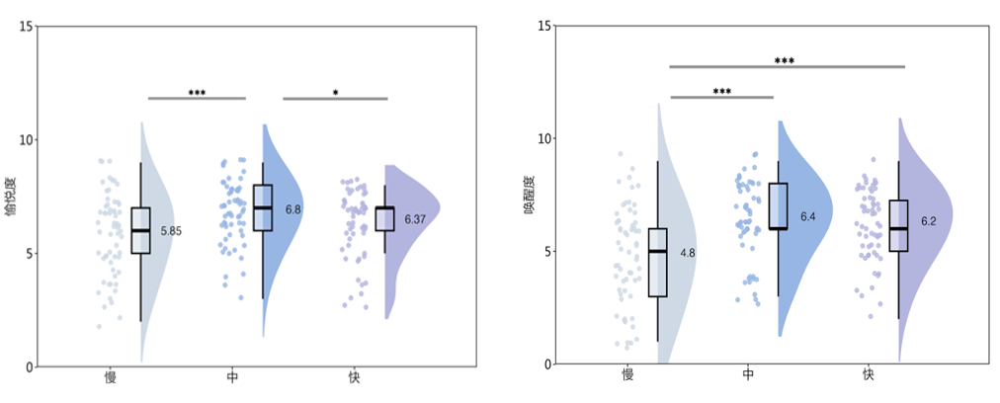

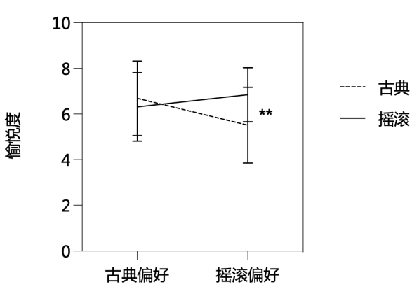

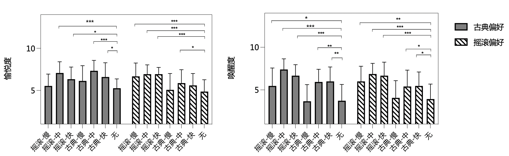

音乐流派对驾驶行为影响的多维分析：个人偏好与音乐元素的影响 图5-12 不同音乐速度下情绪体验结果（实验2） Figure 5-12 Emotion results under different music tempo in Experiment 2 图5-13 偏好和流派的交互效应在愉悦度的结果（实验2） Figure 5-13 Experiment 2: Interaction effects of preference and genre on pleasantness results 图5-14 不同偏好组在各音乐条件下的情绪体验结果（实验2） Figure 5-14 Emotion results at different conditions for different preference drivers in Experiment 2

<!-- ===== 原文 第 71 页 ===== -->

第5 章 研究二：音乐流派和音乐速度对驾驶行为的影响 5.2 实验三：音乐流派和音乐速度对危险规避的影响

#### 5.2.1 研究目的

实验三旨在探索在有风险驾驶情境下，音乐流派和速度对驾驶员对紧急情 况下危险规避能力的影响。

#### 5.2.2 实验设计

本实验采用2（音乐偏好：摇滚偏好，古典偏好）×2（音乐流派：摇滚， 古典）×3（音乐速度：慢，中，快）三因素混合实验设计。其中音乐偏好是被 试间变量，音乐流派和音乐速度是被试内变量。并且以无音乐为控制组，所以 被试一共需要在7 个条件下完成实验任务。

#### 5.2.3 被试

招募要求和方式同实验二。本实验招募驾驶员 28 名，被试的人口学及驾驶 相关信息如下表5-13。 进行了独立T 检验，比较古典偏好音乐者和偏好摇滚音乐者两组不同偏好 的被试在驾龄、驾驶总里程上的差异，结果两组在驾龄上没有显著差异（t=- 0.011,  p =0.992），在驾驶总里程上没有显著差异（t=-1.084,  p =0.288）。 在对摇滚、古典音乐的喜爱程度上的差异，进行了T 检验。结果显示不同 音乐偏好组在对摇滚音乐、古典音乐的喜爱程度上存在显著差异，说明两组满 足不同音乐偏好的要求。结果见表5-14。

#### 5.2.4 实验材料

（1）音乐刺激材料 同实验二。为了保障调整音速后，音乐的品质不会被损害，同样让被试对 各条件音乐进行了喜爱度的评分，以音乐速度为自变量，以喜爱度为因变量进 行重复测量方差分析。对摇滚的喜爱度，音乐速度的主效应不显著 （F(2,54)=0.207, p=0.809, =0.008）；对古典的喜爱度，音乐速度的主效应不显著 （F(2,54)=2.529, p=0.098, =0.086）。说明音速调整没有对音乐的品质造成损害。

<!-- ===== 原文 第 72 页 ===== -->

音乐流派对驾驶行为影响的多维分析：个人偏好与音乐元素的影响

|  | 表 | 5-13 | 实验2 人口 | 学及驾 |  | 驶相关信 | 息 |  |  |
|---|---|---|---|---|---|---|---|---|---|
| Table 5-1 | 3 Demogr | aphic | and driving- | relate | d | informa | tion in Experi | ment | 2 |
|  |  |  | 古典 |  |  | 摇滚 |  | 总 |  |
|  |  |  | (N=15) |  |  | (N=13 | ) | (N= | 28) |
| 别 |  |  |  |  |  |  |  |  |  |
| 男 |  | 7 | (46.7%) |  |  | 7 (53.8 | %) | 14 (50 | .0%) |
| 女 |  | 8 | (53.3%) |  |  | 6 (46.2 | %) | 14 (50 | .0%) |
| 龄 |  |  |  |  |  |  |  |  |  |
| 均值（标准差） |  | 2 | 8.1 (8.43) |  |  | 28.2 (8.2 | 4) | 28.1 ( | 8.19) |
| 中位数 [最小值， | 最大值] | 25.0 | [21.0, 48.0] | 2 | 6. | 0 [20.0, | 49.0] 25 | .5 [20. | 0, 49.0] |
| 龄（年） |  |  |  |  |  |  |  |  |  |
| 均值（标准差） |  | 5. | 25 (5.05) |  |  | 5.69 (3.5 | 4) | 5.46 ( | 4.34) |
| 中位数 [最小值， | 最大值] | 3.00 | [1.00, 17.0] | 5 | .0 | 0 [1.00, | 12.0] 4.5 | 0 [1.0 | 0, 17.0] |
| 驶总里程（万公 | 里） |  |  |  |  |  |  |  |  |
| 均值（标准差） |  | 3. | 42 (3.41) |  |  | 15.9 (40 | .4) | 9.23 ( | 27.8) |
| 中位数 [最小值， | 最大值] | 3.00 [ | 0.0500, 12.0] | 4. | 0 | 0 [0.500 | , 150] 3.0 | 0 [0.05 | 00, 150] |
| 年驾驶里程（公 | 里） |  |  |  |  |  |  |  |  |
| 均值（标准差） |  | 50 | 50 (4670) |  | 1 | 0500 (88 | 60) | 7560 ( | 7330) |
| 中位数 [最小值， | 最大值] | 3000 | [100, 15000] | 50 | 00 | [1000, | 30000] 500 | 0 [100 | , 30000] |
| 教育年限（年） |  |  |  |  |  |  |  |  |  |
| 均值（标准差） |  | 1 | 7.0 (2.83) |  |  | 15.1 (3.4 | 8) | 16.1 ( | 3.24) |
| 中位数 [最小值， | 最大值] | 16.0 | [12.0, 22.0] | 1 | 5. | 0 [9.00, | 20.0] 16 | .0 [9.0 | 0, 22.0] |
| 周开车天数 |  |  |  |  |  |  |  |  |  |
| 均值（标准差） |  | 2. | 60 (1.76) |  |  | 2.92 (1.3 | 2) | 2.75 ( | 1.55) |
| 中位数 [最小值， | 最大值] | 3.0 | 0 [0, 6.00] | 3 | .0 | 0 [1.00, | 5.00] 3 | .00 [0, | 6.00] |
| 表5 | -14 实验3 | 不同 | 音乐偏好组 | 在古典 |  | 、摇滚音 | 乐喜好度评 | 分 |  |
| able 5-14 Classic | al and roc | k mu | sic preferenc | e scor | es | of diffe | rent music pr | eferen | ce groups |
|  |  |  | in Exper | iment | 3 |  |  |  |  |
|  | 古典评 | 分 |  | 摇滚 |  | 评分 |  |  |  |
|  |  |  |  |  |  |  |  | t | p |
|  | 均值 标 | 准差 |  | 均值 |  | 标准差 |  |  |  |
| 典音乐偏好 | 5.80 | 1.01 |  | 3.27 |  | 1.33 | 5. | 200 | <0.001*** |
| 滚音乐偏好 | 4.07 | 0.80 |  | 5.87 |  | 0.64 | -6. | 804 | <0.001*** |

<!-- ===== 原文 第 73 页 ===== -->

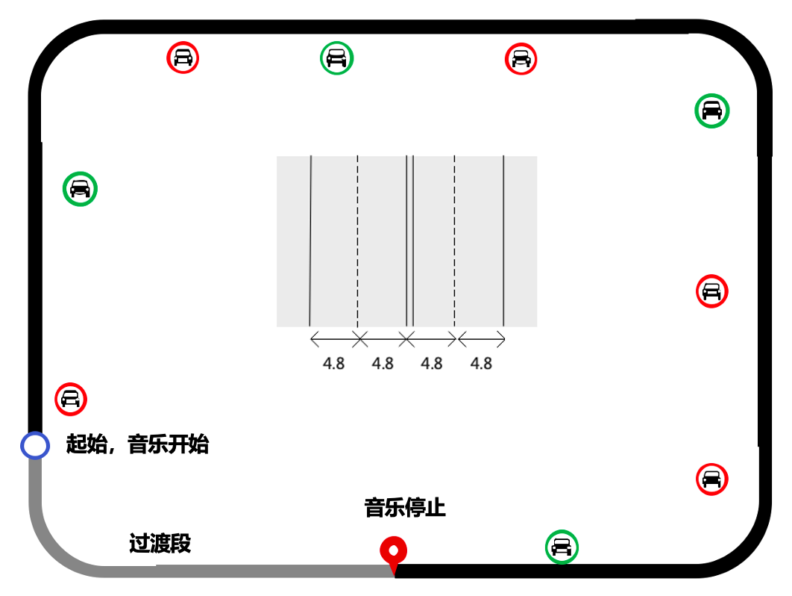

第5 章 研究二：音乐流派和音乐速度对驾驶行为的影响 （2）驾驶模拟器 软件及设备同实验二。 模拟道路为单侧宽度 4.8 米的双向车道，中间有双黄线。路型为环形路道 （见图5-15），共4 个弯道，所有弯道曲度均相同。被试在每段模拟驾驶道路 的起点启动车辆后，音乐响起。每间隔15~20s，前方路旁的车会启动至本车前， 当相对距离为200 feet，保持该距离在本车前方行驶，10~15s 后，前车急刹，此 时刹车灯亮。被试需要及时将速度减为0 才能避免碰撞发生。当驾驶员速度小 于1 feet/s 后，前车会消失，被试可以继续启动车辆前进。每段驾驶任务路段上， 一共会出现9 辆前车，其中有5 辆会急刹，刹车车辆顺序进行伪随机。每段驾 驶路段约11000 feet。静音过渡段1540 feet。 图5-15 危险规避任务路型图 Figure 5-15 Road diagram of the hazard avoidance task （3）主观测试问卷 其余同实验二。

#### 5.2.5 实验流程

被试进入实验室后，签署知情同意书，之后主试讲解模拟驾驶器使用和驾 驶任务要求，要求被试全程保持在右车道行驶，根据限速牌规定（35MPH,约 56.32km/h）进行安全驾驶，遇到突然事件及时进行刹车。之后被试进行5 分钟 的练习，熟悉驾驶模拟器和实验任务。主试在练习阶段对参与者提供指导并评 估其驾驶表现。如果被试适应了在模拟器上驾驶，则可进入正式实验。 每名被试需要在7 种音乐条件下完成7 段驾驶任务。每段任务约7 分钟。

<!-- ===== 原文 第 74 页 ===== -->

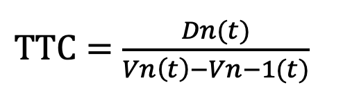

音乐流派对驾驶行为影响的多维分析：个人偏好与音乐元素的影响 每段任务后，被试需要进行主观评分，包括该段驾驶任务的愉悦度、唤醒 度、认知负荷、感知驾驶速度和分心度，约2 分钟。之后有约1 分钟的无音乐 过渡段（限速50MPH，约80km/h），然后进入下一段驾驶任务。

#### 5.2.6 数据指标

（1）行为指标 反应行为指标包括刹车反应时、停车用时和碰撞时间，具体定义和计算方 （4）情绪体验 同实验二。

| 式见表 | 5-15。 |  |
|---|---|---|
|  | 表 | 5-15 危险规避反应行为指标定义及其计算方式 |
|  | Table 5- | 15 Definition and calculation of hazard avoidance task |
|  | 指标名称 | 定义 计算公式 |
|  | 刹车反应时 | 从前方车辆尾灯变为红色到后 |
|  | ， | 车驾驶员踩下刹车踏板 的时间 |
| (Brak | e Reaction Time | • 𝑡 驾驶员踩下刹车踏板的时间。 brake |
|  | BRT) | 间隔（Gao & Davis, 2017）。 |
|  |  | • 𝑡 前方车辆尾灯变为红色的时间。 light |
|  | 停车用时 | 从被试开始踩刹车踏板到车辆 |
| （S | topping Time） | 停止的时间间隔。 • 𝑡 驾驶员踩下刹车踏板的时间。 brake |
|  |  | • 𝑡 stop 车辆完全停止的时间。 |
|  |  | 前后车辆在保持当前速度差的 |
|  |  | 情况下，如果碰撞发生，所需 |
|  |  | 要经过的时间（Hydén, 1996）, |
|  | 碰撞时间 | TTC 是刹车事件中驾驶员风险 |
| (time | to collision, TTC) | • 𝑉𝑛(𝑡) 后方车辆的速度。 的重要指标（Donmez, Boyle, & |
|  |  | • 𝑉𝑛 – 1(𝑡)前方车辆的速度。 Lee, 2006）。值越大，驾驶员 |
|  |  | • 𝐷𝑛(𝑡)是两车的距离。 越安全，与前车发生碰撞的可 |
|  |  | 能性越小。 |
| （2） | 驾驶行为指标 |  |
| 同 | 实验二。 |  |
| （3） | 认知感受 |  |
| 认 | 知负荷、对前一 | 段驾驶的感知速度快慢和分心度主观评分。 |
| 我 | 们通过 NASA | 任务负荷指数（NASA-TLX）调查问卷来测量参与者的认 |
| 知负荷 | 。NASA-TLX | 评估包括六个不同的负荷维度，如下所示。评分系统采用 |
| 一条标 | 度线，范围从 0 | 到 20 分，用以表示各负荷因子的得分区间，标度线的两 |
| 端分别 | 注明了该指标 | 得分的上下限。用户在完成特定任务后，根据自己的认知 |
| 体验在 | 标度线上做标 | 记。通过量度标记点到标度线起点的距离，计算出各个负 |
| 荷因子 | 的得分。所有 | 六个负荷因子的得分累加，形成了用户的总认知负荷得分 |
| 其 | 余同实验二。 |  |

<!-- ===== 原文 第 75 页 ===== -->

第5 章 研究二：音乐流派和音乐速度对驾驶行为的影响

#### 5.2.7 实验结果

（1） 反应行为 以音乐偏好、音乐流派、音乐速度的为自变量，以反应行为各指标为因变 量，进行2×2×3 的重复测量方差，结果如表5-17 所示。 音乐流派的主效应在碰撞时间上显著，如图5-16 所示，在古典音乐下， TTC 显著更长（p = 0.036*）。 音乐偏好和音乐流派的交互效应在反应时和停车用时上显著，如图5-17 所 示。对于偏好摇滚乐的被试，在摇滚音乐背景下的反应时边缘显著短于在古典 音乐下。对于偏好古典乐的被试，在古典乐音乐下的停车用时显著少于在摇滚 音乐背景下。 在其余变量和交互效应上没有发现显著结果。 比较无音乐和其余6 种音乐条件下的差异，在反应时上发现其它音乐条件 与无音乐条件有显著差异，如图5-18 所示。对于偏好古典音乐的被试，在无音 乐条件下，刹车反应时要显著慢于摇滚-快。 （2） 驾驶行为 以音乐偏好、音乐流派、音乐速度的为自变量，以驾驶行为各指标为因变 量，进行2×2×3 的重复测量方差，结果如表5-19 所示。 结果表明，音乐流派的主效应在纵向速度标准差和油门踏板计数上显著， 如图5-19 所示，相比古典音乐，在摇滚音乐下，速度标准差和踏板计数显著更 大。 偏好和流派的交互在超速上显著，如图5-20。对于摇滚偏好的被试，相比 古典音乐，在摇滚乐下的超速时间显著更长。 在其余变量和交互效应上没有发现显著结果。 比较无音乐和其余6 种音乐条件下的差异，在纵向速度、纵向速度标准差、 纵向加速度、绝对横向加速度和超速时间上发现其它音乐条件与无音乐条件有 显著差异，如图5-21 所示。对古典偏好的被试，在无音乐条件下的纵向速度标 准差显著小于在古典-中、纵向加速度要显著大于古典-快、超速时间要显著小 于在古典-快。对于摇滚音乐偏好的人，在无音乐条件下的绝对横向加速度要显 著小于摇滚-慢音乐条件，超速时间要显著小于在摇滚-慢、摇滚-中和摇滚-快。 （3） 认知感受 以音乐偏好、音乐流派、音乐速度的为自变量，以认知感受各指标为因变 量，进行2×2×3 的重复测量方差，结果如表5-21 所示。 三者的交互效应在分心度上边缘显著（p =0.056）。如图5-22，对于摇滚偏 好的被试，在摇滚-快下的分心度显著大于在摇滚-中。

<!-- ===== 原文 第 76 页 ===== -->

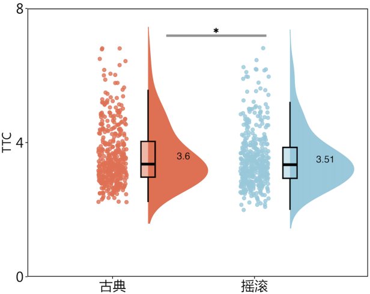

音乐流派对驾驶行为影响的多维分析：个人偏好与音乐元素的影响 其余变量的主效应和交互效应上，没有发现显著的结果。 比较无音乐和其余6 种音乐条件下的差异，对于偏好摇滚的被试，在无音 乐条件下的分心度要显著低于摇滚-慢和摇滚-快（p < 0.05*），如图5-23。 （4） 情绪体验 以音乐偏好、音乐流派、音乐速度的为自变量，以情绪体验各指标为因变 量，进行2×2×3 的重复测量方差，结果如表5-23 所示。 音乐流派的主效应在唤醒度上显著，如图5-24，摇滚音乐下唤醒度显著更 大。 音乐速度的主效应在愉悦度和唤醒度上显著，如图5-25 所示。慢速下的愉 悦度要显著低于中速和快速条件。快速下的唤醒度要显著高于慢速和中速条件。 音乐偏好和流派的交互在愉悦度上显著，如图5-26 所示，对于古典偏好的 驾驶员，在古典音乐下驾驶的愉悦度显著大于摇滚乐。 其余变量的主效应和交互效应上，没有发现显著的结果。 比较无音乐和其余6 种音乐条件下的差异，在愉悦度和唤醒度上发现其它 音乐条件与无音乐有显著差异，如图5-27。对偏好古典的人，无音乐下的愉悦 度要显著小于在摇滚-中、古典-慢、古典-中和古典-快。对偏好摇滚的人，在无 音乐下的愉悦度要显著小于在摇滚-中。对于偏好古典和摇滚的被试，在无音乐 条件下的唤醒度都显著最低。 图5-16 不同音乐流派下的TTC 结果（实验3） Figure 5-16 TTC results under different music genres in Experiment 3

<!-- ===== 原文 第 77 页 ===== -->

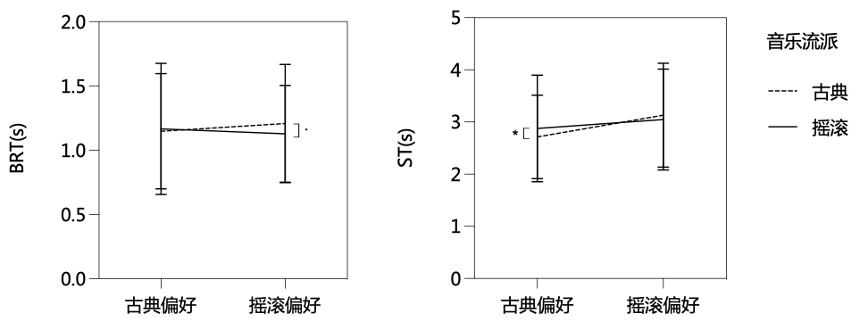

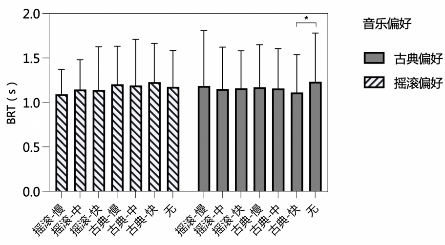

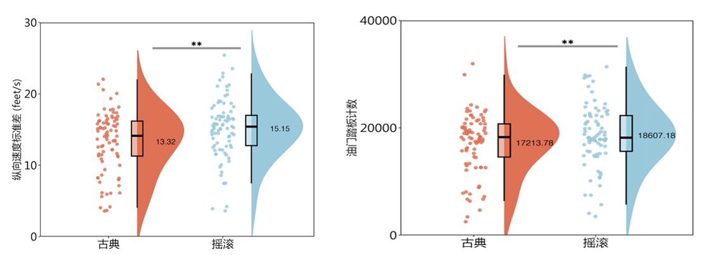

第5 章 研究二：音乐流派和音乐速度对驾驶行为的影响 图5-17 偏好和流派的交互效应在任务表现的结果（实验3） Figure 5-17 Experiment 2: Interaction effects of preference, genre, and tempo on task performances 图5-18 不同偏好组在各音乐条件下的反应时结果（实验3） Figure 5-18 BRT results at different conditions for different preference drivers in Experiment 3 图5-19 不同音乐流派下跟驾驶表现的结果（实验3） Figure 5-19 Driving results under different music genres in Experiment 3

<!-- ===== 原文 第 78 页 ===== -->

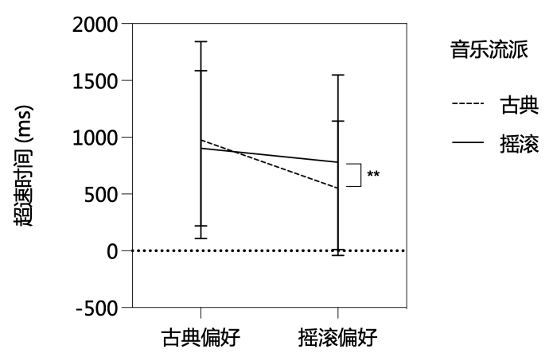

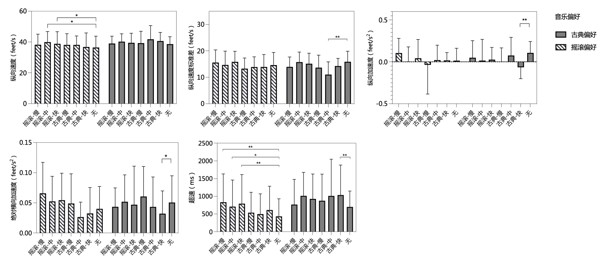

音乐流派对驾驶行为影响的多维分析：个人偏好与音乐元素的影响 图5-20 偏好和流派的交互效应在超速时间的结果（实验3） Figure 5-20 Overspeed results at different genres for different preference drivers in Experiment 3 图5-21 不同偏好组在各音乐条件下的驾驶表现结果（实验3） Figure 5-21 Driving results at different conditions for different preference drivers in Experiment 3

<!-- ===== 原文 第 79 页 ===== -->

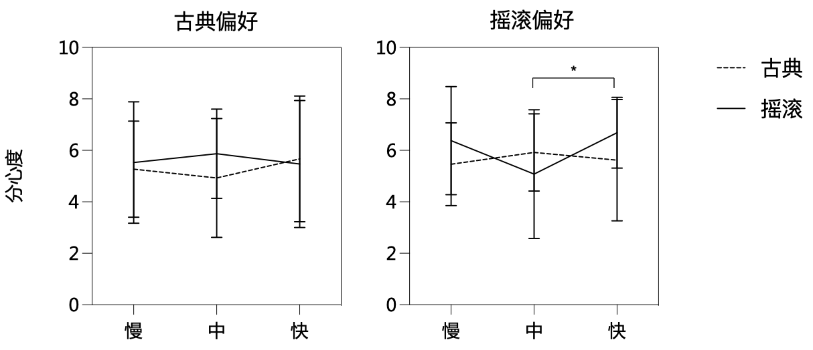

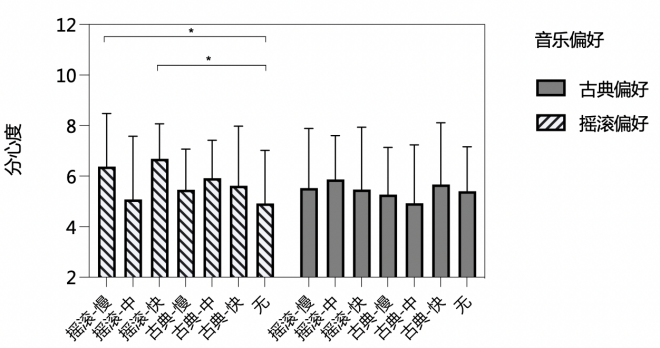

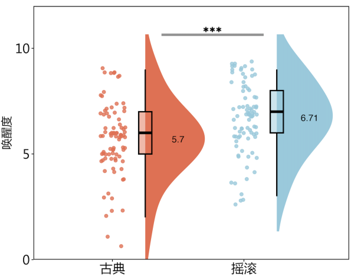

第5 章 研究二：音乐流派和音乐速度对驾驶行为的影响 图5-22 偏好、流派和速度交互效应在分心度的结果（实验3） Figure 5-22 Experiment 3: Interaction effects of preference, genre, and tempo on distraction 图5-23 不同偏好组在各音乐条件下的分心度结果（实验3） Figure 5-23 Distraction results at different conditions for different preference drivers in Experiment 3 图5-24 不同音乐流派下的唤醒度结果（实验3） Figure 5-24 Arousal results under different music genres in Experiment 3

<!-- ===== 原文 第 80 页 ===== -->

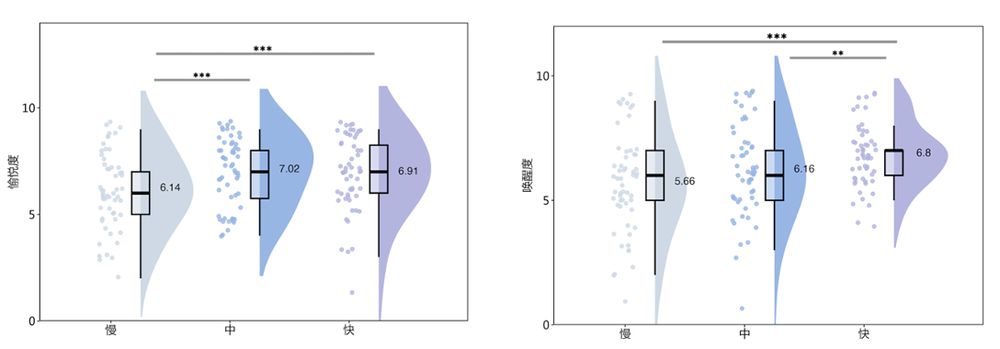

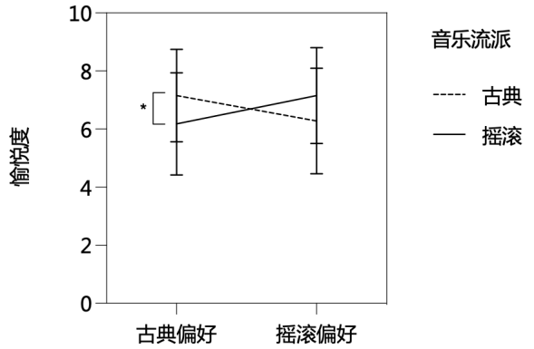

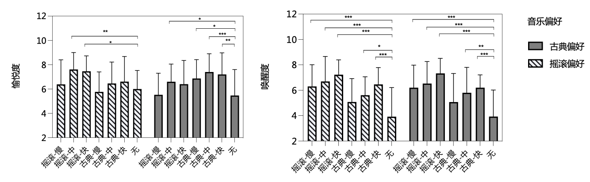

音乐流派对驾驶行为影响的多维分析：个人偏好与音乐元素的影响 图5-25 不同音乐速度下的情绪体验结果（实验3） Figure 5-25 Pleasantness results under different music tempo in Experiment 3 图5-26 偏好和流派交互效应在愉悦度的结果（实验3） Figure 5-26 Experiment 3: Interaction effects of preference and genre on pleasantness 图5-27 不同偏好组在各音乐条件下的情绪体验结果（实验3） Figure 5-27 Emotion results at different conditions for different preference in Experiment 3

<!-- ===== 原文 第 81 页 ===== -->

|  |  |  |  |  |  |  |  |  |  | 第 | 5 | 章 | 研究二：音 | 乐流派 | 和 | 音乐速 | 度对驾驶 | 行为 | 的 | 影响 |  |  |  |  |  |  |  |  |
|---|---|---|---|---|---|---|---|---|---|---|---|---|---|---|---|---|---|---|---|---|---|---|---|---|---|---|---|---|
|  |  |  |  |  |  |  |  |  |  | 表5-16 实验 | 3 在 |  | 不同偏好被 | 试在不 |  | 同音乐 | 条件的 | 反应 |  | 行为 | 指标描述统 | 计 |  |  |  |  |  |  |
|  |  |  |  |  | Tab | le 5-16 D | escript | i | ve sta | tistics of the r | ea | ct | ion metrics | for th | e | two g | roups of | driv | e | rs i | n Experime | nt 3 | for e | ach music | conditi | o | n |  |
|  |  |  |  |  |  |  |  |  | 摇滚 |  |  |  |  |  |  |  |  |  |  | 古 | 典 |  |  |  |  |  | 对 | 照 |
|  |  |  |  |  | 调 | 低 |  |  | 原调 |  |  | 调 | 高 |  |  | 调低 |  |  |  | 原 | 调 |  | 调 | 高 |  |  | 无 | 音乐 |
|  |  |  |  |  | 均 | 值 |  |  | 均值 |  |  | 均 | 值 |  |  | 均值 |  |  |  | 均 | 值 |  | 均 | 值 |  |  | 均 | 值 |
|  |  |  |  |  | (标 | 准差) |  |  | (标准 | 差) | ( | 标 | 准差) |  |  | (标准 | 差) |  |  | (标 | 准差) |  | (标 | 准差) |  |  | (标 | 准差) |
| 1. 刹 | 车 | 反应时 | （ | s | ） |  |  |  |  |  |  |  |  |  |  |  |  |  |  |  |  |  |  |  |  |  |  |  |
|  | 古典 |  |  | 1 | .19 | (0.62) |  | 1 | .15 (0 | .47) | 1.1 | 6 | (0.42) |  | 1 | .17 (0. | 48) |  | 1 | .16 | (0.45) |  | 1.11 | (0.42) |  | 1 | .23 | (0.55) |
|  | 摇滚 |  |  | 1 | .09 | (0.28) |  | 1 | .15 (0 | .33) | 1.1 | 4 | (0.48) |  |  | 1.2 (0. | 43) |  | 1 | .19 | (0.52) |  | 1.23 | (0.43) |  | 1 | .18 | (0.41) |
| 2. 停 | 车 | 用时（ | s） |  |  |  |  |  |  |  |  |  |  |  |  |  |  |  |  |  |  |  |  |  |  |  |  |  |
|  | 古典 |  |  | 2 | .77 | (0.93) |  | 2 | .95 (1 | .15) | 2. | 9 ( | 0.98) |  |  | 2.7 (0. | 93) |  |  | 2.78 | (0.8) |  | 2.66 | (0.66) |  |  | 2.8 ( | 0.82) |
|  | 摇滚 |  |  | 3 | .17 | (0.97) |  | 2 | .77 (0 | .84) | 3.2 | 1 | (1.04) |  | 3 | .26 (1. | 13) |  | 3 | .06 | (0.96) |  | 3.09 | (0.91) |  | 3 | .24 | (1.22) |
| 3. 碰 | 撞 | 时间（ | s） |  |  |  |  |  |  |  |  |  |  |  |  |  |  |  |  |  |  |  |  |  |  |  |  |  |
|  | 古典 |  |  | 3 | .48 | (0.67) |  | 3 | .32 (0 | .83) | 3.6 | 3 | (0.94) |  | 3 | .64 (0. | 99) |  | 3 | .56 | (0.98) |  | 3.48 | (0.86) |  | 3 | .58 | (0.89) |
|  | 摇滚 |  |  | 3 | .64 | (1.00) |  | 3 | .45 (0 | .67) | 3.5 | 5 | (0.91) |  | 3 | .76 (0. | 98) |  | 3 | .55 | (0.68) |  | 3.64 | (0.77) |  | 3 | .62 | (0.67) |
|  |  |  |  |  |  |  |  |  |  |  | 表 | 5 | -17 实验3 | 中反应 |  | 指标下 | 的方差 | 分析 |  | 结果 |  |  |  |  |  |  |  |  |
|  |  |  |  |  |  |  | Ta |  | ble 5-1 | 7 ANOVA re | su | lts | in Experim | ent 3 | w | ith re | action m | etric | s | as | the depende | nt v | aria | ble |  |  |  |  |
|  |  |  | 偏 |  | 好 |  |  |  | 流派 |  | 音 | 乐 | 速度 | 偏 |  | 好×流 | 派 | 偏好 |  | ×音 | 乐速度 | 流派 | ×音 | 乐速度 | 偏好× | 流 | 派× | 音乐速度 |
|  |  |  |  |  |  | 2 |  |  |  | 2 |  |  | 2 |  |  |  | 2 |  |  |  | 2 |  |  | 2 |  |  |  | 2 |
|  |  | F (1,26) |  | p |  | η | F (1,26) |  | p | η F (2,52 | ) | p | η | F (1,25) |  | p | η F | (2,52) |  | p | η F | (2,52 | p ) | η | F (2,52) |  | p | η |
| BRT |  | 0.023 | 0. | 8 | 81 | 0.001 | 0.616 | 0 | .440 | 0.024 0.052 | 0 | .9 | 27 0.002 | 4.728 | 0 | .039* | 0.159 0 | .142 |  | 0.8 | 35 0.006 0 | .133 | 0.8 | 38 0.005 | 0.284 |  | 0.7 | 13 0.011 |
| ST |  | 1.947 | 0. | 1 | 75 | 0.070 | 0.415 | 0 | .525 | 0.016 0.480 | 0 | .5 | 81 0.018 | 6.574 | 0 | .016* | 0.202 2 | .182 |  | 0.1 | 35 0.077 1 | .150 | 0.3 | 24 0.042 | 0.277 |  | 0.7 | 56 0.011 |
| TTC |  | 0.134 | 0. | 7 | 18 | 0.005 | 4.904 | 0 | .036* | 0.164 0.919 | 0 | .4 | 06 0.035 | 0.357 |  | 0.555 | 0.014 0 | .039 |  | 0.9 | 62 0.002 0 | .009 | 0.9 | 91 0.000 | 1.791 |  | 0.1 | 77 0.067 |

<!-- ===== 原文 第 82 页 ===== -->

音乐流派对驾驶行为影响的多维分析：个人偏好与音乐元素的影响 表5-18 实验3 不同偏好组在各音乐条件下驾驶行为指标的描述统计

|  | Table | 5-18 Descri | ptive statisti | cs of driving | behavior in | dicators for | different pre | ference |
|---|---|---|---|---|---|---|---|---|
|  |  | gro | ups of drive | rs in each mu | sic conditio | n in Experi | ment 3 |  |
|  |  |  | 摇滚 |  |  | 古典 |  | 对照 |
|  |  | 慢 | 中 | 快 | 慢 | 中 | 快 | 无音乐 |
|  |  | 均值 | 均值 | 均值 | 均值 | 均值 | 均值 | 均值 |
|  |  | (标准差) | (标准差) | (标准差) | (标准差) | (标准差) | (标准差) | (标准差) |
| 1. | 纵向速 | 度（feet/s） |  |  |  |  |  |  |
|  |  | 39.04 | 40.24 | 39.48 | 39.25 | 41.76 | 40.65 | 38.63 |
|  | 古典 |  |  |  |  |  |  |  |
|  |  | (4.74) | (5.08) | (6.18) | (7.72) | (8.86) | (5.59) | (4.79) |
|  |  | 38.25 | 39.92 | 38.80 | 38.14 | 38.10 | 36.75 | 36.45 |
|  | 摇滚 |  |  |  |  |  |  |  |
|  |  | (6.82) | (6.83) | (7.87) | (7.21) | (5.80) | (9.13) | (7.32) |
| 2. | 纵向速 | 度标准差（f | eet/s） |  |  |  |  |  |
|  |  | 13.96 | 15.76 | 15.16 | 13.66 | 11.04 | 14.27 | 15.88 |
|  | 古典 |  |  |  |  |  |  |  |
|  |  | (3.74) | (3.79) | (3.96) | (4.74) | (4.81) | (2.9) | (4.00) |
|  |  | 15.59 | 14.68 | 15.86 | 13.29 | 13.89 | 13.92 | 14.63 |
|  | 摇滚 |  |  |  |  |  |  |  |
|  |  | (4.77) | (5.23) | (3.99) | (4.02) | (3.84) | (4.69) | (4.79) |
| 3. | 纵向加 | 速度（feet/s | 2） |  |  |  |  |  |
|  |  | 0.05 | 0.02 | 0.03 | 0.00 | 0.08 | -0.07 | 0.11 |
|  | 古典 |  |  |  |  |  |  |  |
|  |  | (0.20) | (0.25) | (0.15) | (0.16) | (0.22) | (0.14) | (0.13) |
|  |  | 0.11 | 0.00 | 0.04 | -0.04 | 0.02 | 0.02 | 0.02 |
|  | 摇滚 |  |  |  |  |  |  |  |
|  |  | (0.18) | (0.18) | (0.22) | (0.35) | (0.18) | (0.09) | (0.15) |
| 4. | 绝对横 | 向加速度（f | eet/s2） |  |  |  |  |  |
|  |  | 0.04 | 0.05 | 0.05 | 0.06 | 0.04 | 0.03 | 0.05 |
|  | 古典 |  |  |  |  |  |  |  |
|  |  | (0.03) | (0.04) | (0.06) | (0.05) | (0.05) | (0.04) | (0.04) |
|  |  | 0.07 | 0.05 | 0.05 | 0.05 | 0.03 | 0.03 | 0.04 |
|  | 摇滚 |  |  |  |  |  |  |  |
|  |  | (0.05) | (0.04) | (0.04) | (0.05) | (0.02) | (0.04) | (0.04) |
| 5. | 横向位 | 移标准差（f | eet） |  |  |  |  |  |
|  |  | 1.08 | 1.39 | 1.22 | 1.16 | 1.31 | 1.11 | 1.19 |
|  | 古典 |  |  |  |  |  |  |  |
|  |  | (0.25) | (0.86) | (0.24) | (0.3) | (0.52) | (0.2) | (0.27) |
|  |  | 1.24 | 1.32 | 1.44 | 1.3 | 1.47 | 1.23 | 1.39 |
|  | 摇滚 |  |  |  |  |  |  |  |
|  |  | (0.45) | (0.48) | (0.65) | (0.48) | (0.89) | (0.41) | (0.7) |
| 6. | 超过35 | mph 的时间 | （ms） |  |  |  |  |  |
|  |  | 768.2 | 1013.8 | 927.73 | 877.07 | 1012.4 | 1036.73 | 700 |
|  | 古典 |  |  |  |  |  |  |  |
|  |  | (710.15) | (661.41) | (703.22) | (749.64) | (1034.84) | (845.91) | (449.12) |
|  |  | 835.31 | 709.92 | 792.46 | 538.85 | 499.23 | 613.46 | 433.85 |
|  | 摇滚 |  |  |  |  |  |  |  |
|  |  | (798) | (749.8) | (820.54) | (575.46) | (569.83) | (671.02) | (497.17) |
| 7. | 油门踏 | 板计数 |  |  |  |  |  |  |
|  |  | 18155.22 | 19319.79 | 17924.04 | 16708.50 | 17064.09 | 16896.56 | 18427.70 |
|  | 古典 |  |  |  |  |  |  |  |
|  |  | (4139.52) | (6041.9) | (4843.62) | (5761.42) | (5231.36) | (4622.35) | (4572.57) |
|  |  | 19319.31 | 18903.83 | 18085.86 | 16910.84 | 18551.52 | 17300.71 | 18201.77 |
|  | 摇滚 |  |  |  |  |  |  |  |
|  |  | (6615.18) | (6932.09) | (6636.2) | (6278.47) | (4951.87) | (7307.74) | (6462.66) |
| 8. | 刹车踏 | 板计数 |  |  |  |  |  |  |
|  |  | 3495.56 | 4474.34 | 3728.32 | 3929.39 | 2656.30 | 3243.33 | 3850.86 |
|  | 古典 |  |  |  |  |  |  |  |
|  |  | (1502.9) | (2200.74) | (1445.72) | (3408.45) | (2359.03) | (1364.79) | (1238.97) |
|  |  | 4666.53 | 4467.46 | 4117.13 | 3362.06 | 3831.71 | 4341.05 | 4632.76 |
|  | 摇滚 |  |  |  |  |  |  |  |
|  |  | (2541.08) | (2884.29) | (1745.19) | (1892.69) | (1292.52) | (2934.41) | (2766.62) |
|  | 64 |  |  |  |  |  |  |  |

<!-- ===== 原文 第 83 页 ===== -->

|  |  |  |  |  |  |  | 第5 章 | 研究二：音乐流派和音乐速度对驾驶行为的影响 |  |  |  |
|---|---|---|---|---|---|---|---|---|---|---|---|
|  |  |  |  |  |  | 表 | 5-19 实 | 验3 中驾驶行为指标下的方差分析结果 |  |  |  |
|  |  |  | Table | 5-19 A | NOVA | results | in Expe | riment 3 with driving behavior indicators as t | he depe | ndent variable |  |
|  |  | 偏好 |  |  | 流派 |  | 音乐 | 速度 偏好×流派 偏好×音乐 | 速度 | 流派×音乐速度 | 偏好×流派×音乐速度 |
|  |  |  | 2 |  |  | 2 |  | 2 2 | 2 | 2 | 2 |
|  | F (1,26) | p | η | F (1,26) | p | η | F (2,52) | p η F p η F p (1,26) (2,52) | η F | p η (2,52) | F p η (2,52) |
| 纵向速度 | 0.632 | 0.434 | 0.024 | 0.069 | 0.794 | 0.003 | 1.346 0. | 269 0.049 2.747 0.109 0.096 0.326 0.723 | 0.012 0 | .068 0.934 0.003 | 0.805 0.453 0.030 |
| 纵向速度标 |  |  |  |  |  |  |  |  |  |  |  |
|  | 0.286 | 0.597 | 0.011 | 8.188 | 0.008** | 0.240 | 1.318 0. | 276 0.048 0.053 0.820 0.002 0.175 0.839 | 0.007 0 | .757 0.463 0.028 | 2.958 0.066 0.102 |
| 准差 |  |  |  |  |  |  |  |  |  |  |  |
| 纵向加速度 | 0.061 | 0.807 | 0.002 | 1.277 | 0.269 | 0.047 | 0.300 0. | 741 0.011 0.122 0.729 0.005 0.671 0.515 | 0.025 1 | .768 0.192 0.064 | 0.620 0.488 0.023 |
| 绝对横向加 |  |  |  |  |  |  |  |  |  |  |  |
|  | 0.002 | 0.969 | 0.000 | 2.856 | 0.103 | 0.099 | 1.903 0. | 162 0.068 1.949 0.174 0.070 0.517 0.588 | 0.019 0 | .903 0.395 0.034 | 0.384 0.641 0.015 |
| 速度 |  |  |  |  |  |  |  |  |  |  |  |
| 横向位移标 |  |  |  |  |  |  |  |  |  |  |  |
|  | 0.847 | 0.359 | 0.033 | 0.072 | 0.791 | 0.003 | 2.582 0. | 104 0.090 0.064 0.802 0.002 0.359 0.630 | 0.014 1 | .197 0.304 0.044 | 0.542 0.546 0.020 |
| 准差 |  |  |  |  |  |  |  |  |  |  |  |
| 超速时间 | 1.136 | 0.296 | 0.042 | 2.089 | 0.160 | 0.074 | 0.757 0. | 429 0.028 7.716 0.010* 0.229 1.802 0.187 | 0.065 0 | .174 0.839 0.007 | 0.294 0.745 0.011 |
| 油门踏板计 |  |  |  |  |  |  |  |  |  |  |  |
|  | 0.072 | 0.790 | 0.003 | 8.893 | 0.006** | 0.255 | 1.111 0. | 337 0.041 0.182 0.673 0.007 0.051 0.951 | 0.002 0 | .284 0.754 0.011 | 0.554 0.578 0.021 |
| 数 |  |  |  |  |  |  |  |  |  |  |  |
| 刹车踏板计 |  |  |  |  |  |  |  |  |  |  |  |
|  | 1.091 | 0.306 | 0.040 | 2.870 | 0.102 | 0.099 | 0.000 1. | 000 0.000 0.005 0.943 0.000 0.229 0.796 | 0.009 0 | .005 0.943 0.000 | 2.358 0.105 0.083 |
| 数 |  |  |  |  |  |  |  |  |  |  |  |

<!-- ===== 原文 第 84 页 ===== -->

音乐流派对驾驶行为影响的多维分析：个人偏好与音乐元素的影响 表5-20 实验3 不同偏好组在各音乐条件下认知感受指标的描述统计

| Table 5-20 | D | escrip | tive | st | atistics | of cogniti |  | ve | experienc | e | ind | icators for d | iffere | nt pref | erence g | roups of drivers in | ea | ch | music conditi | on in Exper | iment 3 |
|---|---|---|---|---|---|---|---|---|---|---|---|---|---|---|---|---|---|---|---|---|---|
|  |  |  |  |  |  |  |  | 摇 | 滚 |  |  |  |  |  |  | 古典 |  |  |  |  | 对照 |
|  |  |  |  |  | 调 | 低 |  |  | 原调 |  | 调 | 高 |  |  | 调低 | 原调 |  | 调 | 高 |  | 无音乐 |
|  |  |  |  |  | 均 | 值 |  |  | 均值 |  | 均 | 值 |  |  | 均值 | 均值 |  | 均 | 值 |  | 均值 |
|  |  |  |  |  | (标准 | 差) |  | (标 | 准差) |  | (标 | 准差) |  |  | (标准差 | ) (标准差) |  | (标 | 准差) |  | (标准差) |
| 1. 认知负荷 |  |  |  |  |  |  |  |  |  |  |  |  |  |  |  |  |  |  |  |  |  |
|  | 古 | 典 |  |  | 41.53 ( | 23.12) 4 | 2 | .0 | 0 (27.92) | 42 | .40 | (19.77) |  | 3 | 8.87 (25. | 66) 39.4 (21.64) | 40 | .47 | (20.15) | 39 | .47 (26.05) |
|  | 摇 | 滚 |  |  | 38.00 ( | 21.69) | 2 | 9.3 | 1 (14.7) | 35 | .85 | (17.91) |  | 3 | 6.15 (17. | 71) 32.38 (15.88) | 3 | 4.77 | (18.9) | 28 | .00 (15.38) |
| 2. 感知驾驶速 | 度 |  |  |  |  |  |  |  |  |  |  |  |  |  |  |  |  |  |  |  |  |
|  | 古 | 典 |  |  | 3.53 | (2.1) | 3 | .3 | 3 (2.23) | 3 | .93 | (2.02) |  |  | 3.87 (2.4 | 2) 4.33 (2.5) | 3 | .53 | (2.17) | 3 | .60 (2.82) |
|  | 摇 | 滚 |  |  | 5.15 | (2.3) | 5 | .0 | 8 (2.25) | 3 | .77 | (1.59) |  |  | 4.38 (2.0 | 6) 3.85 (1.82) | 4 | .31 | (2.14) | 3 | .54 (1.71) |
| 3. 分心度 |  |  |  |  |  |  |  |  |  |  |  |  |  |  |  |  |  |  |  |  |  |
|  | 古 | 典 |  |  | 5.53 ( | 2.36) | 5 | .8 | 7 (1.73) | 5 | .47 | (2.47) |  |  | 5.27 (1.8 | 7) 4.93 (2.31) | 5 | .67 | (2.44) | 5 | .40 (1.76) |
|  | 摇 | 滚 |  |  | 6.38 | (2.1) |  | 5.0 | 8 (2.5) | 6 | .69 | (1.38) |  |  | 5.46 (1.6 | 1) 5.92 (1.5) | 5 | .62 | (2.36) |  | 4.92 (2.1) |
|  |  |  |  |  |  |  |  |  | 表5- | 21 | 实 | 验3 中认知 | 感受指 | 标下 | 的方差 | 分析结果 |  |  |  |  |  |
|  |  |  | T | ab | le 5-21 | ANOVA | r | es | ults in Ex | p | erim | ent 3 with | cogniti | ve exp | erience | indicators as the de | pe | nde | nt variable |  |  |
|  |  |  | 偏好 |  |  | 流 | 派 |  |  |  | 音乐 | 速度 | 偏 | 好×流 | 派 | 偏好×音乐速度 | 流 | 派× | 音乐速度 | 偏好×流派 | ×音乐速度 |
|  |  |  |  |  | 2 |  |  |  | 2 |  |  | 2 |  |  | 2 | 2 |  |  | 2 |  | 2 |
|  |  | F (1,26) | p |  | η | F p (1,26) |  |  | η F ( | 2,5 | 2) | p η | F (1,26) | p | η F | p η F (2,52) | (2, | 52) | p η | F p (2,52) | η |
| 认知负荷 |  | 0.886 | 0.35 | 5 | 0.033 | 0.354 0.5 | 5 | 7 | 0.013 0. | 79 | 4 0. | 448 0.030 | 0.385 | 0.540 | 0.015 0 | .901 0.405 0.033 0 | .2 | 20 | 0.799 0.008 | 0.262 0.7 | 66 0.010 |
| 感知驾驶速度 |  | 1.988 | 0.17 | 0 | 0.071 | 0.108 0.7 | 4 | 5 | 0.004 0. | 47 | 1 0. | 627 0.018 | 2.218 | 0.148 | 0.079 0 | .527 0.594 0.020 0 | .0 | 77 | 0.926 0.003 | 2.344 0.1 | 06 0.083 |
| 分心度 |  | 0.692 | 0.41 | 3 | 0.026 | 1.586 0.2 | 1 | 9 | 0.057 0. | 64 | 2 0. | 531 0.024 | 0.008 | 0.929 | 0.000 0 | .267 0.767 0.010 0 | .3 | 78 | 0.687 0.014 | 3.057 0.0 | 56 0.105 |

<!-- ===== 原文 第 85 页 ===== -->

Table 5-22 Descriptive statistics of emotional experience indicators for different preference groups of drivers in each music condition in Experiment 3 1. 愉悦度 2. 唤醒度 愉悦度 0.013 0.909 0.001  0.028 0.869 唤醒度 0.011 0.918 0.000  15.886 0.001*** 0.383 0.379  10.009 0.001*** 0.278  0.003 0.960 0.000  0.018 0.973 0.001  0.174 0.831 0.007  0.255 0.766 0.010

|  |  |  |  |  |  |  | 第5 | 章 研 | 究二： | 音乐流 | 派和 | 音乐速度 | 对驾 | 驶行为的影 | 响 |  |  |  |  |  |  |  |
|---|---|---|---|---|---|---|---|---|---|---|---|---|---|---|---|---|---|---|---|---|---|---|
|  |  |  |  |  |  | 表 | 5-22 实验 | 3 不 | 同偏好 | 组在各 | 音 | 乐条件下 | 情 | 绪体验指 | 标的描述统计 |  |  |  |  |  |  |  |
| e 5-22 | Descr | iptive statis | tic | s of emotio | n | al e | xperienc | e ind | icators | for dif | fere | nt prefe | ren | ce groups | of drivers in | e | ach music c | onditi | on in Expe | r | ime | nt 3 |
|  |  |  |  |  |  | 摇 | 滚 |  |  |  |  |  |  |  | 古典 |  |  |  |  |  | 对 | 照 |
|  |  |  |  | 慢 |  |  | 中 |  | 快 |  |  |  |  | 慢 | 中 |  | 快 |  |  |  | 无 | 音乐 |
|  |  |  |  | 均值 |  | 均 | 值 | 均 | 值 |  |  |  | 均 | 值 | 均值 |  | 均值 |  |  |  | 均 | 值 |
|  |  |  | (标 | 准差) |  | (标 | 准差) | (标 | 准差) |  |  |  | (标 | 准差) | (标准差) |  | (标准差) |  |  |  | (标 | 准差) |
| 度 |  |  |  |  |  |  |  |  |  |  |  |  |  |  |  |  |  |  |  |  |  |  |
|  | 古典 | 5 | .53 | (1.77) |  | 6.6 ( | 1.45) | 6.4 ( | 1.96) |  |  | 6 | .87 | (1.55) | 7.4 (1.5) |  | 7.2 (1.78) |  |  | 5 | .47 | (2.13) |
|  | 摇滚 | 6 | .38 | (2.02) | 7 | .62 | (1.39) | 7.46 | (1.27) |  |  | 5 | .77 | (1.64) 6 | .46 (1.76) | 6 | .62 (2.06) |  |  | 6 | .00 | (1.53) |
| 度 |  |  |  |  |  |  |  |  |  |  |  |  |  |  |  |  |  |  |  |  |  |  |
|  | 古典 | 6 | .20 | (1.78) | 6 | .53 | (1.73) | 7.33 | (1.18) |  |  | 5 | .07 | (2.25) 5 | .80 (2.01) | 6 | .20 (1.01) |  |  | 3 | .93 | (2.09) |
|  | 摇滚 |  | 6.3 | 1 (1.7) | 6 | .69 | (1.97) | 7.23 | (1.17) |  |  | 5 | .08 | (1.85) 5 | .62 (1.45) | 6 | .46 (1.33) |  |  | 3 | .92 | (2.29) |
|  |  |  |  |  |  |  | 表5-2 | 3 实 | 验3 中 | 情绪体 | 验 | 指标下的 | 方 | 差分析结 | 果 |  |  |  |  |  |  |  |
|  | 偏好 |  |  | 流派 |  |  |  | 音 | 乐速度 |  |  | 偏好×流 | 派 | 偏好 | ×音乐速度 |  | 流派×音乐 | 速度 | 偏好×流派 |  | ×音 | 乐速度 |
|  |  | 2 |  |  |  | 2 |  |  |  | 2 |  |  |  | 2 | 2 |  |  | 2 |  |  |  | 2 |
| F (1,26) | p | η F (1,2 | 6) | p |  | η | F (2, | 52) | p | η | F (1,2 | p 6) |  | η F (2,52) | p η | F | p (2,52) | η | F (2,52) | p |  | η |
| 0.013 | 0.909 | 0.001 0.02 | 8 | 0.869 |  | 0.00 | 1 10.4 | 88 0. | 001*** | 0.287 | 8.42 | 1 0.007 | ** 0. | 287 0.370 | 0.674 0.014 | 0 | .905 0.390 | 0.034 | 0.092 0. | 8 | 67 | 0.004 |
| 0.011 | 0.918 | 0.000 15.8 | 86 | 0.001*** 0. | 3 | 83 0 | .379 10.0 | 09 0. | 001*** | 0.278 | 0.00 | 3 0.960 | 0. | 000 0.018 | 0.973 0.001 | 0 | .174 0.831 | 0.007 | 0.255 0. | 7 | 66 | 0.010 |
|  |  | Table | 5- | 23 ANOVA |  | res | ults in Ex | perim | ent 3 | with em | oti | on expe | rien | ce indicato | rs as the dep | e | ndent vari | able |  |  |  |  |

<!-- ===== 原文 第 86 页 ===== -->

音乐流派对驾驶行为影响的多维分析：个人偏好与音乐元素的影响

### 5.3 小结与讨论

研究二的目的是为了在音乐偏好的基础上，探究音乐流派和音乐速度对驾 驶行为的影响。以音乐流派偏好（摇滚、古典）为组间变量，音乐流派（摇滚、 古典）、音乐速度（慢、中、快）为组内变量，通过2 个模拟驾驶行为实验分 别探究不同音乐对无风险情境下车辆控制行为的影响和有风险情境下危险规避 行为的影响。结果表明，音乐流派和音乐速度会影响驾驶员的情绪和驾驶行为， 并且会受到音乐偏好的影响。具体来看： （1） 在无风险的驾驶情境下： 音乐流派对跟车表现有影响，在古典音乐下，距离前车的距离更远，对于 前车的速度变化反应更慢。前人研究发现古典音乐下的跟车表现比流行音乐差 (Niu 等, 2020)。本研究补充了古典乐和摇滚乐的对比，进一步发现古典乐下跟 车表现还要差于摇滚音乐。另外结果还发现在驾驶行为上，摇滚音乐背景下有 更快的驾驶速度、横向加速度和油门踏板计数。在情绪体验上，摇滚音乐背景 下的唤醒更高。 音乐速度对驾驶行为和认知情绪有影响。结果发现在慢速度音乐下，速度 最慢，与前人结果一致 (Brodsky, 2001; Cassidy & MacDonald, 2010)。但是 Brodsky 发现慢和中等速度没有差异，而本实验结果发现，中等速度下驾驶速度 要显著大于慢速，可能是因为Brodsky 在三个速度下使用的是不同的音乐，且 中等速度的音乐（94bpm-112bpm）的BPM 值跨度较大，不能排除是其中某首 音乐给驾驶员带了更大影响的可能性。在主观唤醒度和愉悦度上发现，中速度 最高，慢速度最低。进一步发现，驾驶速度变化与情绪变化趋势是一致的，这 一结果支持Navarro 等人认为 (2023)音乐是通过情绪变化解释驾驶行为的改变的 说法。 研究结果还发现了音乐偏好与音乐流派交互，以及音乐偏好、音乐流派和 音乐速度三者交互的结果。在驾驶行为上，结果发现对偏好摇滚的被试，在摇 滚音乐下的纵向速度标准差和刹车踏板计数显著更大。在情绪体验上，也是偏 好摇滚的驾驶员在摇滚音乐下的愉悦度更高，古典乐下愉悦度显著更低。对摇 滚偏好驾驶员，所听的音乐流派会显著影响他们的情绪体验，在古典音乐下愉 悦度下降；而对古典偏好驾驶员，情绪体验不会受到音乐流派的影响。在三者 的交互结果上，发现摇滚偏好的驾驶员，对同样都是慢速度的音乐，在摇滚-慢 音乐背景下，跟车一致性更好；另外对比在不同速度的古典音乐下的跟车表现， 发现在古典-快下的跟车表现，显著好于古典-慢条件下。说明摇滚偏好的被试， 在喜欢的摇滚乐或者在快速度的音乐下会表现更好，结合在摇滚乐下和快速音

<!-- ===== 原文 第 87 页 ===== -->

第5 章 研究二：音乐流派和音乐速度对驾驶行为的影响 乐下唤醒度更高的结果，可能因为偏好摇滚的驾驶员，在更高唤醒度下才能达 到完成跟车任务的最佳唤醒水平。 另外和无音乐条件进行了对比，结果发现无音乐下的愉悦度和唤醒度最低， 显著低于许多音乐条件。从驾驶行为的结果发现，对摇滚和古典偏好的被试， 相比于无音乐体条件，快速的摇滚乐背景下，驾驶速度会更快、不稳定；而其 它音乐条件于无音乐条件下的表现没有过多差异。综上，在无风险的驾驶情境 下，首先不推荐播放快速的摇滚乐，因为相比于无音乐条件会造成更冒险、不 稳定的驾驶表现（速度更快，变化更多）。对摇滚偏好的驾驶员，另外发现在 慢速古典乐背景下跟车任务的表现要差于慢速摇滚和快速古典，因此更推荐在 无风险驾驶情境下，播放慢速或中速的摇滚乐，或者中快速的古典乐。对古典 偏好的驾驶员，在慢速摇滚背景下的跟车表现要差于中速摇滚，因此更推荐播 放古典乐或是中速的摇滚乐。 （2） 在有风险的驾驶情境下： 音乐流派对应急反应、驾驶表现和情绪体验有影响。应急反应上，在古典 乐下碰撞时间更长。驾驶行为上，在摇滚音乐下驾驶速度更快，纵向更差，踩 踏踏板的动作更大，更不稳定。情绪体验上，也是在摇滚音乐背景下，唤醒度 比古典音乐背景更高。与前面的研究结果一致，说明在不同驾驶情境下，摇滚 对驾驶行为数据的影响是一致的。摇滚音乐下唤醒度更高，驾驶员会更激动， 可能完成驾驶任务的认知资源会有部分被占用，表现出更冒险和不稳定的驾驶 行为，因此如果在有风险的驾驶情境下，突发事件发生，驾驶安全性会下降。 音乐速度对情绪体验有影响。结果发现在快速度的音乐下，唤醒度水平更 高，但是在驾驶表现上没有差异。而在无风险情境中，是发现快速的音乐下， 唤醒水平更高，并且纵向速度和横向加速度更大。说明音乐在不同情境下对驾 驶行为的影响不同，在更难的任务下，快速的音乐带来了更高的唤醒水平，可 能更接近最佳负荷水平，个体处于最佳唤醒水平时，行为绩效最好 (Yerkes & Dodson, 1908)，因此有更好的驾驶表现，而在无风险的驾驶情境下，快速度带 来的高唤醒水平可能超过了完成任务的最佳唤醒水平，因此驾驶表现更不稳定。 音乐偏好和音乐流派对任务表现、驾驶表现和情绪体验有影响。在任务表 现上，对于摇滚偏好的被试，在古典音乐下的刹车反应时更长，反应更慢；对 于古典偏好的被试，在摇滚音乐下的停车用时显著更长。由此可以认为驾驶时 听偏好的音乐相比于不偏好的音乐有利于驾驶员的应急反应。在驾驶表现上， 结果发现对于摇滚偏好的驾驶员，在摇滚乐下的超速时间显著更长。在情绪体 验上，对于古典偏好的驾驶员，在古典乐下的愉悦度显著更高。 对比无音乐和其它音乐条件的差异，在无音乐条件下，愉悦度和唤醒度也 最低，显著低于许多音乐条件。在看其它变量，对于摇滚偏好的驾驶员，在慢

<!-- ===== 原文 第 88 页 ===== -->

音乐流派对驾驶行为影响的多维分析：个人偏好与音乐元素的影响 速和快速的摇滚乐下驾驶速度更快、主观分心度也更高，并且在摇滚乐的3 个 速度背景下，超速都会更多。因此认为在有风险的驾驶情境下，摇滚偏好的驾 驶员要避免听摇滚乐。和快速的古典和摇滚乐下，超速次数显著多于无音乐条 件；在慢速摇滚条件下的绝对横向加速度显著大于无音乐。 对于古典偏好的驾驶员，虽然在快速古典乐下超速会多于无音乐条件，但 是从更多的结果上看，相比于快速的古典乐，在无音乐条件下，刹车反应更慢， 驾驶速度更快，驾驶稳定性更差，唤醒度和愉悦度都会显著更低。因此认为在 有风险的驾驶情境下，对古典偏好的驾驶员，可以播放古典乐（最好是中速和 快速）。

<!-- ===== 原文 第 89 页 ===== -->

第6 章 研究三：音乐流派和音高对驾驶行为的影响 第6章  研究三：音乐流派和音高对驾驶行为的影响 6.1 实验四：音乐流派和音高对车辆控制的影响

#### 6.1.1 研究目的

实验四旨在旨在探究音乐流派和音高对无风险情境下，对车辆控制驾驶行 为的影响。

#### 6.1.2 实验设计

本实验采用2（音乐偏好：摇滚偏好，古典偏好）×2（音乐流派：摇滚， 古典）×3（音高：调低，原调，调高）三因素混合实验设计。其中音乐偏好是 被试间变量，音乐流派和音高是被试内变量。并且以无音乐为控制组，所以被 试一共需要在7 个条件下完成实验任务。

#### 6.1.3 被试

招募要求和方式同实验二。本实验招募驾驶员 26 名，被试的人口学及驾驶 相关信息如下表6-1。 进行了独立T 检验，比较古典偏好音乐者和偏好摇滚音乐者两组不同偏好 的被试在驾龄、驾驶总里程上的差异，结果两组在驾龄上没有显著差异（t=- 0.131,  p =0.897），在驾驶总里程上没有显著差异（t=-0.050,  p =0.960）。 在对摇滚、古典偏好组的音乐评分上，结果显示不同音乐偏好组在对摇滚 音乐、古典音乐的喜爱程度上存在显著差异，说明两组满足不同音乐偏好的要 求。结果见表6-2。

#### 6.1.4 实验材料

① 音乐刺激材料 音乐曲目同实验二，两首音乐材料的音乐速度为100 bpm，并使用audacity 将每首音乐的音高进行调整（支持不改变节奏，调整音高）。调低条件：将曲 目音高调低600 音分（半个八度）；调高条件：将曲目音高调低600 音分；原 调：音高保持不变。同样让被试对各条件音乐进行了喜爱度的评分，以音高为 自变量，以喜爱度为因变量进行重复测量方差分析。摇滚：音高的主效应不显 著（F(2,50)=0.029, p=0.970, =0.001）；古典：音高的主效应不显著（F(2,50)=0.217, p=0.755, =0.009）。说明音高调整没有对音乐的品质造成损害。

<!-- ===== 原文 第 90 页 ===== -->

音乐流派对驾驶行为影响的多维分析：个人偏好与音乐元素的影响 表6-1 实验4 人口学及驾驶相关信息

|  | Table 6 | -1 Demog | raph | ic and driving | -rel | ated | information in E | xpe | ri | me | nt 4 |
|---|---|---|---|---|---|---|---|---|---|---|---|
|  |  |  |  | 古典 |  |  | 摇滚 |  |  | Ov | erall |
|  |  |  |  | (N=13) |  |  | (N=13) |  |  | (N= | 26) |
| 别 |  |  |  |  |  |  |  |  |  |  |  |
| 男 |  |  | 7 | (53.8%) |  | 7 | (53.8%) |  | 14 | (5 | 3.8%) |
| 女 |  |  | 6 | (46.2%) |  | 6 | (46.2%) |  | 12 | (4 | 6.2%) |
| 龄 |  |  |  |  |  |  |  |  |  |  |  |
| 均值（ | 标准差） |  | 27 | .5 (7.81) |  | 2 | 7.5 (7.05) |  | 27 | .5 | (7.29) |
| 中位数 | [最小值， | 最大值] | 25.0 | [22.0, 48.0] |  | 24.0 | [20.0, 39.0] | 24 | .0 | [20 | .0, 48.0] |
| 龄（年 | ） |  |  |  |  |  |  |  |  |  |  |
| 均值（ | 标准差） |  | 5. | 08 (5.12) |  | 5. | 31 (3.73) |  | 5. | 19 | (4.39) |
| 中位数 | [最小值， | 最大值] | 3.00 | [1.00, 21.0] |  | 4.00 | [1.00, 14.0] | 4.0 | 0 | [1. | 00, 21.0] |
| 驶总里 | 程（万公 | 里） |  |  |  |  |  |  |  |  |  |
| 均值（ | 标准差） |  | 2. | 65 (2.03) |  | 2. | 69 (1.85) |  | 2. | 67 | (1.91) |
| 中位数 | [最小值， | 最大值] | 2.00 | [1.00, 6.00] |  | 2.00 | [0.500, 5.00] | 2.0 | 0 | [0.5 | 00, 6.00] |
| 年驾驶 | 里程（公 | 里） |  |  |  |  |  |  |  |  |  |
| 均值（ | 标准差） |  | 962 | 0 (15500) |  | 127 | 00 (13400) | 1 | 12 | 00 | (14300) |
| 中位数 | [最小值， | 最大值] 5 | 000 [ | 1000, 60000] | 10 | 000 | [2000, 50000] 8 | 00 | 0 [ | 100 | 0, 60000 |
| 教育年 | 限（年） |  |  |  |  |  |  |  |  |  |  |
| 均值（ | 标准差） |  | 16 | .2 (1.83) |  | 1 | 7.1 (2.93) |  | 16 | .7 | (2.43) |
| 中位数 | [最小值， | 最大值] | 16.0 | [13.0, 19.0] |  | 16.0 | [14.0, 25.0] | 16 | .0 | [13 | .0, 25.0] |
| 周开车 | 天数 |  |  |  |  |  |  |  |  |  |  |
| 均值（ | 标准差） |  | 1. | 92 (1.26) |  | 3. | 38 (1.45) |  | 2. | 65 | (1.52) |
| 中位数 | [最小值， | 最大值] | 2.0 | 0 [0, 5.00] |  | 3.00 | [1.00, 5.00] | 2 | .0 | 0 [0 | , 5.00] |
|  | 表6- | 2 实验4 | 不同 | 音乐偏好组在 | 古 | 典、 | 摇滚音乐喜好度评 | 分 |  |  |  |
| T | able 6-2 Cl | assical an | d roc | k music prefe | ren | ce sc | ores of different | mu | sic | pr | eference |
|  |  |  |  | groups in Exp | eri | ment | 4 |  |  |  |  |
|  |  | 古典评 | 分 |  |  | 摇滚 | 评分 |  |  |  |  |
|  |  |  |  |  |  |  |  | t |  |  | p |
|  |  | 均值 | 标准 | 差 | 均 | 值 | 标准差 |  |  |  |  |
| 典音乐 | 偏好 | 5.31 | 0.9 | 5 | 4.0 | 0 | 1.47 | 3.1 | 58 |  | <0.01** |
| 滚音乐 | 偏好 | 4.08 | 1.0 | 4 | 6.0 | 0 | 0.82 | 3.7 | 78 |  | <0.001*** |

<!-- ===== 原文 第 91 页 ===== -->

第6 章 研究三：音乐流派和音高对驾驶行为的影响

#### 6.1.5 实验流程

同实验二。

#### 6.1.6 数据指标

同实验二。

#### 6.1.7 实验结果

（1） 跟车指标 以音乐偏好、音乐流派、音高的为自变量，以跟车任务各指标为因变量， 进行2×2×3 的重复测量方差，结果如表6-4 所示。 流派的主效应在车辆间隔时间和时间标准差、车辆间隔距离和距离标准差、 延迟时间、警告次数和落后时间上显著, 如图6-1 所示。相比摇滚乐，古典乐下， 车辆间隔时间和时间标准差、车辆间隔距离和距离标准差、延迟时间、警告次 数和落后时间显著更大。 音高的主效应在IVT 上显著，如图6-2，调低音高后，车辆间隔时间要显著 大于在原调条件下。 音乐流派和音乐速度的交互效应在车辆间隔时间标准差、车辆间隔距离和 距离标准差、COH、GAIN、延迟时间、警告次数和落后时间上显著，如图6-3。 对于古典乐，调低条件下的车辆间隔时间标准差和延迟时间要显著大于原调条 件；调高和调低条件下的车辆间隔距离、距离标准差、警告次数和落后时间要 显著大于原调条件，COH 和GAIN 要显著小于原调条件。对于摇滚乐，调高条 件下的COH 要显著大于原调。 其余变量的主效应和交互效应上，没有发现显著的结果。 （2） 驾驶行为 以音乐偏好、音乐流派、音高的为自变量，以驾驶行为各指标为因变量， 进行2×2×3 的重复测量方差，结果如表6-6 所示。 音乐偏好的主效应在纵向速度、绝对横向加速度和超速时间上显著，如图 6-4，摇滚偏好的驾驶员的纵向速度、绝对横向加速度和超速时间都要显著大于 古典偏好的驾驶员。 音乐流派的主效应在纵向速度、纵向加速度、绝对横向加速度、横向位移 标准差和油门踏板计数五个变量上显著，如图6-5。相比古典乐，在摇滚乐下， 纵向速度、纵向加速度、绝对横向加速度、横向位移标准差和油门踏板计数显 著更高。

<!-- ===== 原文 第 92 页 ===== -->

音乐流派对驾驶行为影响的多维分析：个人偏好与音乐元素的影响 音乐偏好和音高的交互效应在纵向速度标准差和绝对横向加速度上显著， 如图6-6。对于摇滚偏好的被试，相比于调低条件，在调高条件下的纵向速度标 准差显著更小。对于古典偏好的被试，相比于调高条件，在调低和原调条配件 下的绝对横向加速度显著更大。 比较无音乐和其余6 种音乐条件下的差异，在纵向速度、纵向加速度、绝 对横向加速度、横向位移标准差和油门踏板计数上发现其它音乐条件与无音乐 条件有显著差异，如图6-7所示。对于偏好古典被试，在无音乐条件下的纵向速 度、绝对横向加速度显著大于在古典-调低。对于偏好摇滚被试，在无音乐条件 下的纵向速度显著小于在摇滚-调高条件，纵向加速度要显著小于摇滚-调低、 摇滚-原调和摇滚-调高，横向位移标准差要显著小于摇滚-原调和摇滚-调低，油 门踏板计数要显著小于摇滚音乐各条件以及古典-调高的音乐条件下。 （3） 认知感受 以音乐偏好、音乐流派、音高的为自变量，以认知感受各指标为因变量， 进行2×2×3 的重复测量方差，结果如表6-8 所示。 音乐流派的主效应在分心度上显著，如图6-8，相比古典乐，在摇滚音乐下 主观分心显著更高。 其余变量的主效应和交互效应上，没有发现显著的结果。 比较无音乐和其余6 种音乐条件下的差异发现，对于偏好摇滚的被试，在 无音乐条件下的分心度要显著小于摇滚-原调和摇滚-调高，如图6-9。 （4） 情绪体验 以音乐偏好、音乐流派、音高的为自变量，以情绪体验各指标为因变量， 进行2×2×3 的重复测量方差，结果如表6-10 所示。 流派的主效应在唤醒度上显著，在摇滚音乐下，唤醒度显著更高，如图6- 10。 其余各变量的主效应和交互效应上，没有发现显著的结果。 比较无音乐和其余6 种音乐条件下的差异，在愉悦度和唤醒度上发现其它 音乐条件与无音乐条件有显著差异，如图6-11 所示。对于偏好古典的被试，无 音乐条件下，愉悦度显著小于其它条件；唤醒度除了与古典-调低无显著差异,显 著低于其它音乐条件。对于偏好摇滚音乐的被试，在无音乐条件下的愉悦度要 显著小于在摇滚乐条件下；唤醒度显著低于摇滚音乐各条件和古典-调高条件。

<!-- ===== 原文 第 93 页 ===== -->

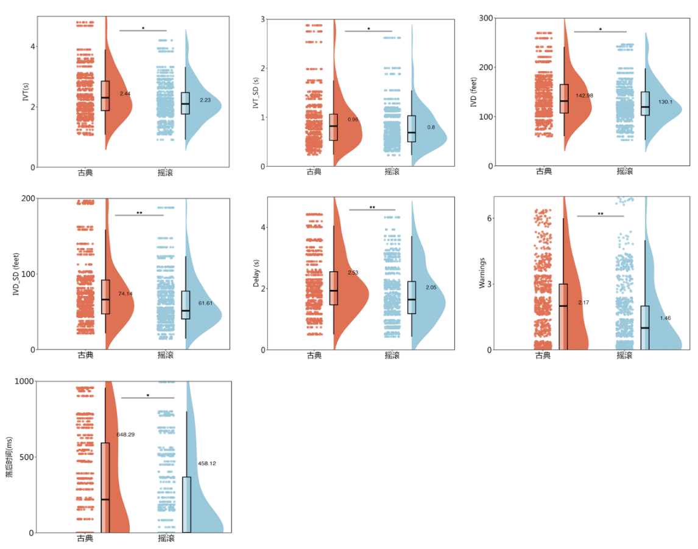

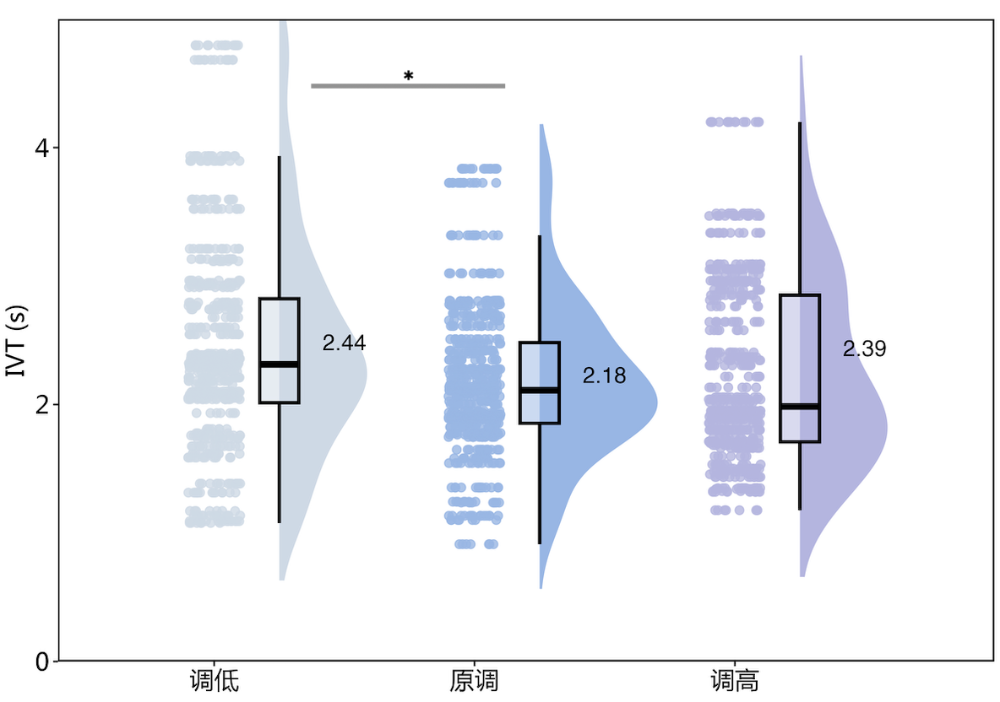

第6 章 研究三：音乐流派和音高对驾驶行为的影响 图6-1 不同音乐流派下的跟车任务表现结果（实验4） Figure 6-1 Car-following results under different music genres in Experiment 4 图6-2 不同音高下的IVT 结果（实验4） Figure 6-2 IVT results under different music pitch in Experiment 4

<!-- ===== 原文 第 94 页 ===== -->

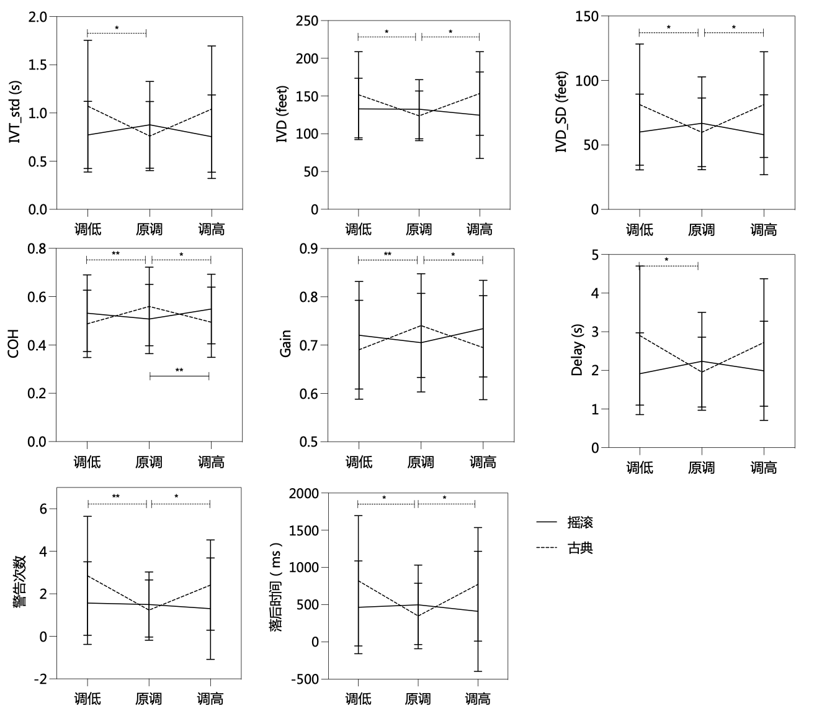

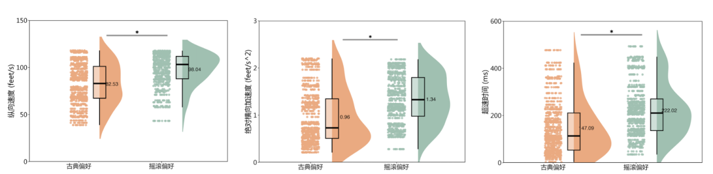

音乐流派对驾驶行为影响的多维分析：个人偏好与音乐元素的影响 图6-3 流派和音高交互效应在跟车任务表现的结果（实验4） Figure 6-3 Experiment 4: Interaction effects of genre and pitch on car-following 图6-4 不同音乐偏好组的驾驶表现结果（实验4） Figure 6-4 Driving results for different music preference in Experiment 4

<!-- ===== 原文 第 95 页 ===== -->

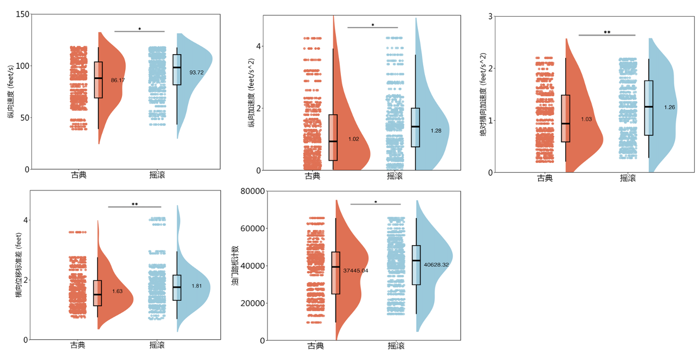

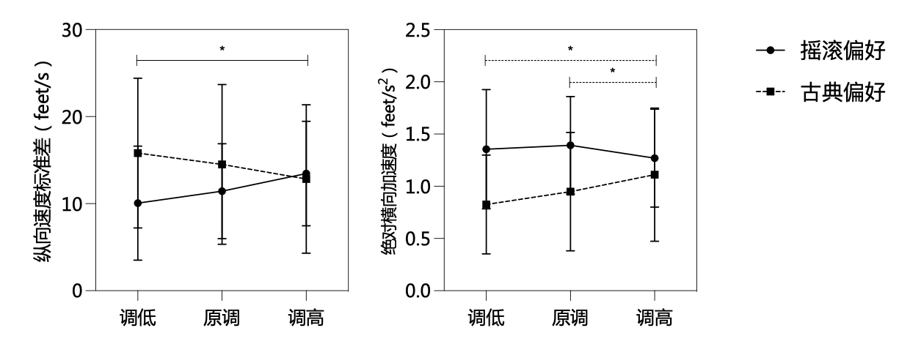

第6 章 研究三：音乐流派和音高对驾驶行为的影响 图6-5 不同音乐流派下的驾驶表现结果（实验4） Figure 6-5 Driving results under different music genres in Experiment 4 图6-6 流派和音高交互效应在跟车任务表现的结果（实验4） Figure 6-6 Experiment 4: Interaction effects of genre and pitch on car-following

<!-- ===== 原文 第 96 页 ===== -->

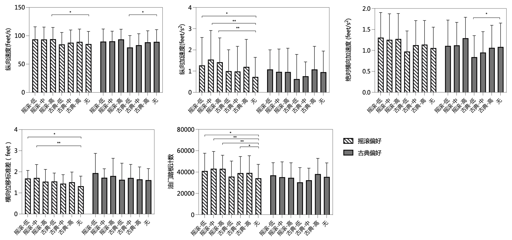

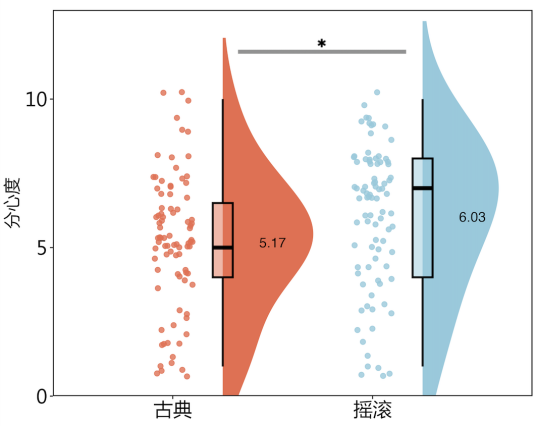

音乐流派对驾驶行为影响的多维分析：个人偏好与音乐元素的影响 图6-7 不同偏好组在各音乐条件下的驾驶表现结果（实验4） Figure 6-7 Driving results at different conditions for different preference drivers in Experiment 4 图6-8 不同音乐流派下的分心度结果（实验4） Figure 6-8 Distraction results under different music genres in Experiment 4

<!-- ===== 原文 第 97 页 ===== -->

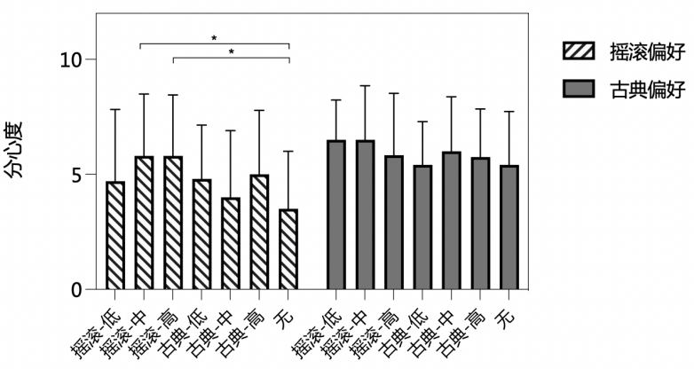

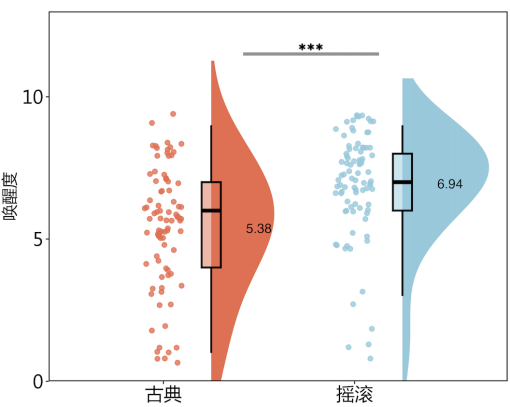

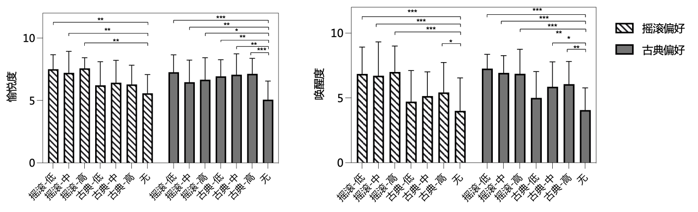

第6 章 研究三：音乐流派和音高对驾驶行为的影响 图6-9 不同偏好组在各音乐条件下的分心度结果（实验4） Figure 6-9 Distraction results at different conditions for different preference drivers in Experiment 4 图6-10 不同音乐流派下的唤醒度结果（实验4） Figure 6-10 Arousal results under different music genres in Experiment 4 图6-11 不同偏好组在各音乐条件下的情绪体验结果（实验4） Figure 6-11 Emotion results at different conditions for different preference drivers in Experiment 4

<!-- ===== 原文 第 98 页 ===== -->

音乐流派对驾驶行为影响的多维分析：个人偏好与音乐元素的影响 表6-3 实验4 不同偏好组在各音乐条件下驾驶行为指标的描述统计

| able 6- | 3 Descriptive | statistics of | driving beha | vior indicato | rs for differ | ent preferen | ce group |
|---|---|---|---|---|---|---|---|
|  |  | of drivers in | each music c | ondition in | Experiment 4 |  |  |
|  |  | 摇滚 |  |  | 古典 |  | 对照 |
|  | 调低 | 原调 | 调高 | 调低 | 原调 | 调高 | 无音乐 |
|  | 均值 | 均值 | 均值 | 均值 | 均值 | 均值 | 均值 |
|  | (标准差) | (标准差) | (标准差) | (标准差) | (标准差) | (标准差) | (标准差) |
| . IVT（ | s） |  |  |  |  |  |  |
| 古典 | 2.41 | 2.5 | 2.4 | 2.83 | 2.21 | 2.86 | 2.97 |
|  | (0.71) | (0.64) | (1.3) | (1.05) | (0.62) | (1.11) | (1.5) |
| 摇滚 | 2.16 | 1.94 | 1.9 | 2.31 | 2.04 | 2.36 | 2.12 |
|  | (0.57) | (0.4) | (0.51) | (0.76) | (0.49) | (0.67) | (0.54) |
| . IVT | SD（s） |  |  |  |  |  |  |
| _ |  |  |  |  |  |  |  |
| 古典 | 0.84 | 1.00 | 0.87 | 1.31 | 0.77 | 1.23 | 1.21 |
|  | (0.38) | (0.55) | (0.52) | (0.82) | (0.41) | (0.77) | (0.75) |
| 摇滚 | 0.7 | 0.75 | 0.62 | 0.82 | 0.75 | 0.83 | 0.73 |
|  | (0.29) | (0.25) | (0.25) | (0.34) | (0.3) | (0.42) | (0.33) |
| . IVD | （feet） |  |  |  |  |  |  |
| 古典 | 140.95 | 152.41 | 139.03 | 165.42 | 129.24 | 168.23 | 172.33 |
|  | (44.9) | (39.78) | (71.89) | (61.43) | (35.92) | (64.81) | (83.72) |
| 摇滚 | 124.58 | 110.9 | 108.89 | 136.81 | 117.8 | 137.32 | 125.5 |
|  | (33.69) | (24.25) | (28.1) | (48.06) | (28.62) | (36.61) | (32) |
| . IVD | SD（feet） |  |  |  |  |  |  |
| _ |  |  |  |  |  |  |  |
| 古典 | 65.34 | 81.46 | 68.83 | 94.25 | 63.44 | 94.09 | 90.19 |
|  | (31.17) | (40.99) | (36.5) | (52.62) | (28.95) | (46.88) | (46.44) |
| 摇滚 | 54.22 | 50.87 | 46.13 | 67.14 | 55.77 | 67.46 | 64.06 |
|  | (26.39) | (19.91) | (17.3) | (35.01) | (23.47) | (27.74) | (22.58) |
| . COH |  |  |  |  |  |  |  |
| 古典 | 0.48 | 0.46 | 0.5 | 0.46 | 0.52 | 0.46 | 0.47 |
|  | (0.14) | (0.12) | (0.15) | (0.13) | (0.13) | (0.14) | (0.17) |
| 摇滚 | 0.58 | 0.56 | 0.6 | 0.51 | 0.61 | 0.53 | 0.56 |
|  | (0.16) | (0.15) | (0.12) | (0.14) | (0.18) | (0.14) | (0.14) |
| . Gain |  |  |  |  |  |  |  |
| 古典 | 0.69 | 0.67 | 0.7 | 0.67 | 0.71 | 0.67 | 0.67 |
|  | (0.1) | (0.09) | (0.1) | (0.1) | (0.09) | (0.11) | (0.13) |
| 摇滚 | 0.76 | 0.74 | 0.77 | 0.71 | 0.77 | 0.72 | 0.74 |
|  | (0.11) | (0.11) | (0.08) | (0.1) | (0.11) | (0.1) | (0.1) |
| . Delay | （s） |  |  |  |  |  |  |
| 古典 | 2.05 | 2.65 | 2.36 | 3.1 | 2.11 | 2.94 | 3.16 |
|  | (1.23) | (1.4) | (1.54) | (1.92) | (0.97) | (2.03) | (2.11) |
| 摇滚 | 1.77 | 1.79 | 1.59 | 2.68 | 1.79 | 2.48 | 2.21 |
|  | (0.82) | (0.93) | (0.75) | (1.64) | (0.8) | (1.07) | (0.8) |
| . 警告 | 次数 |  |  |  |  |  |  |
| 古典 | 1.88 | 2.17 | 2 | 3.21 | 1.38 | 3 | 3.08 |
|  | (2.27) | (1.63) | (3.08) | (2.99) | (1.63) | (2.35) | (3.33) |
| 摇滚 | 1.23 | 0.77 | 0.55 | 2.45 | 1.09 | 1.77 | 1.68 |
|  | (1.45) | (1) | (0.72) | (2.53) | (1.13) | (1.63) | (1.64) |
| . 落后 | 时间（ms） |  |  |  |  |  |  |
| 古典 | 597.83 | 807.05 | 654.58 | 990.71 | 397.33 | 1010.29 | 1132.92 |
|  | (766.5) | (546.83) | (1030.39) | (967.05) | (517.55) | (867.65) | (1381.69) |
| 摇滚 | 323.23 | 191.05 | 144.45 | 638.73 | 295.36 | 516.09 | 495.64 |
|  | (367.71) | (287.16) | (260.32) | (721.88) | (327.09) | (516.56) | (469.98) |

<!-- ===== 原文 第 99 页 ===== -->

|  |  |  |  |  |  | 第6 | 章 研究 | 三：音乐流 | 派和音高对驾驶行为的影 | 响 |  |  |
|---|---|---|---|---|---|---|---|---|---|---|---|---|
|  |  |  |  |  |  | 表6-4 | 实验4 | 中跟车任 | 务指标下的方差分析 | 结果 |  |  |
|  |  |  | Table | 6-4 ANOVA | results in | Exper | iment 4 | with the | car-following task in | dicator as the depend | ent variable |  |
|  |  | 偏好 |  | 流派 |  |  | 音高 |  | 偏好×流派 | 偏好×音高 | 流派×音高 | 偏好×流派×音高 |
|  |  |  | 2 |  | 2 |  |  | 2 | 2 | 2 | 2 | 2 |
|  | F (1,24) | p | η | F p (1,24) | η | F (2, 48) | p | η F ( | p η F 1,24) (2 | p η F ,48) (2,4 | p η 8) | F p η (2,48) |
| IVT | 2.327 | 0.140 | 0.088 | 7.517 0.011* | 0.239 | 3.262 | 0.047* | 0.120 0. | 074 0.788 0.003 0.2 | 59 0.773 0.011 2.98 | 6 0.060 0.111 | 1.167 0.320 0.046 |
| IVT SD | 2.755 | 0.110 | 0.103 | 6.292 0.019* | 0.208 | 0.841 | 0.433 | 0.034 0. | 387 0.540 0.016 1.2 | 32 0.300 0.049 3.61 | 7 0.036* 0.131 | 1.650 0.204 0.064 |
| _ |  |  |  |  |  |  |  |  |  |  |  |  |
| IVD | 2.873 | 0.103 | 0.107 | 6.787 0.016* | 0.220 | 2.543 | 0.089 | 0.096 0. | 322 0.576 0.013 0.1 | 04 0.901 0.004 3.99 | 5 0.025* 0.143 | 1.392 0.258 0.055 |
| IVD SD | 3.637 | 0.069 | 0.132 | 8.249 0.008* | * 0.256 | 0.967 | 0.381 | 0.039 0. | 001 0.973 0.000 0.1 | 68 0.827 0.007 4.30 | 2 0.020* 0.152 | 1.419 0.252 0.056 |
| _ |  |  |  |  |  |  |  |  |  |  |  |  |
| COH | 2.150 | 0.156 | 0.082 | 0.758 0.393 | 0.031 | 0.669 | 0.517 | 0.027 0. | 689 0.415 0.028 0.0 | 56 0.945 0.002 7.32 | 0 0.002** 0.234 | 0.205 0.816 0.008 |
| Gain | 2.185 | 0.152 | 0.083 | 0.757 0.393 | 0.031 | 0.648 | 0.527 | 0.026 0. | 612 0.442 0.025 0.0 | 27 0.974 0.001 6.48 | 0 0.003** 0.213 | 0.127 0.881 0.005 |
| Delay | 1.390 | 0.250 | 0.055 | 8.700 0.007* | * 0.266 | 0.951 | 0.384 | 0.038 0. | 409 0.528 0.017 0.1 | 25 0.857 0.005 5.07 | 4 0.012* 0.175 | 0.393 0.658 0.016 |
| 警告次数 | 2.081 | 0.162 | 0.080 | 10.167 0.004* | * 0.298 | 3.439 | 0.048 | 0.125 0. | 512 0.481 0.021 0.5 | 60 0.552 0.023 4.99 | 6 0.012* 0.172 | 0.714 0.490 0.029 |
| 落后时间 | 2.643 | 0.118 | 0.103 | 4.752 0.040* | 0.171 | 1.801 | 0.183 | 0.073 1. | 195 0.286 0.049 0.8 | 29 0.427 0.035 4.76 | 2 0.016* 0.172 | 1.486 0.238 0.061 |

<!-- ===== 原文 第 100 页 ===== -->

音乐流派对驾驶行为影响的多维分析：个人偏好与音乐元素的影响 表6-5 实验4 不同偏好组在各音乐条件下驾驶行为指标的描述统计 Table 6-5 Descriptive statistics of driving behavior indicators for different preference groups of drivers in each music condition in Experiment 4

|  |  | 摇滚 |  |  | 古典 |  | 对照 |
|---|---|---|---|---|---|---|---|
|  | 调低 | 原调 | 调高 | 调低 | 原调 | 调高 | 无音乐 |
|  | 均值 | 均值 | 均值 | 均值 | 均值 | 均值 | 均值 |
|  | (标准差) | (标准差) | (标准差) | (标准差) | (标准差) | (标准差) | (标准差) |
| . 纵向 | 速度（feet/s） |  |  |  |  |  |  |
|  | 84.56 | 84.65 | 89.83 | 73.69 | 80.69 | 81.75 | 77.85 |
| 古典 |  |  |  |  |  |  |  |
|  | (19.95) | (17.73) | (23.52) | (17.55) | (23.55) | (22.88) | (22.04) |
|  | 102.07 | 104.68 | 98.54 | 91.44 | 94.11 | 97.38 | 98.63 |
| 摇滚 |  |  |  |  |  |  |  |
|  | (20.58) | (13.42) | (11.12) | (21.08) | (13.6) | (15.43) | (15.43) |
| . 纵向 | 速度标准差（ | feet/s） |  |  |  |  |  |
|  | 15.03 | 14.92 | 11.08 | 16.6 | 14.12 | 14.59 | 15.07 |
| 古典 |  |  |  |  |  |  |  |
|  | (8.75) | (8.06) | (6.16) | (8.43) | (10.19) | (10.08) | (7.61) |
|  | 8.91 | 11.14 | 14.08 | 11.2 | 11.72 | 12.85 | 10.23 |
| 摇滚 |  |  |  |  |  |  |  |
|  | (5.27) | (5.53) | (6.4) | (7.49) | (5.39) | (5.54) | (5.73) |
| . 纵向 | 加速度（feet/ | s2） |  |  |  |  |  |
|  | 0.71 | 0.75 | 1.19 | 0.58 | 0.87 | 1.01 | 0.7 |
| 古典 |  |  |  |  |  |  |  |
|  | (0.78) | (0.7) | (1.29) | (0.69) | (1.2) | (1.33) | (0.81) |
|  | 1.77 | 2.11 | 1.29 | 1.18 | 0.91 | 1.6 | 1.2 |
| 摇滚 |  |  |  |  |  |  |  |
|  | (1.02) | (1.19) | (1.02) | (1.36) | (0.69) | (0.9) | (0.86) |
| . 绝对 | 横向加速度（ | feet/s2） |  |  |  |  |  |
|  | 0.96 | 0.99 | 1.24 | 0.69 | 0.91 | 0.98 | 0.82 |
| 古典 |  |  |  |  |  |  |  |
|  | (0.53) | (0.51) | (0.65) | (0.37) | (0.62) | (0.6) | (0.48) |
|  | 1.56 | 1.54 | 1.3 | 1.15 | 1.24 | 1.24 | 1.37 |
| 摇滚 |  |  |  |  |  |  |  |
|  | (0.54) | (0.5) | (0.44) | (0.53) | (0.37) | (0.49) | (0.43) |
| . 横向 | 位移标准差（ | feet） |  |  |  |  |  |
|  | 1.78 | 1.6 | 1.86 | 1.6 | 1.59 | 1.52 | 1.46 |
| 古典 |  |  |  |  |  |  |  |
|  | (84.95) | (87.4) | (107.33) | (74.68) | (116.09) | (91.05) | (79.36) |
|  | 2.05 | 1.96 | 1.6 | 1.75 | 1.59 | 1.73 | 1.53 |
| 摇滚 |  |  |  |  |  |  |  |
|  | (87.59) | (45.63) | (32.78) | (97.67) | (60.06) | (61.7) | (64.3) |
| . 超过 | 35mph 的时 | 间（ms） |  |  |  |  |  |
|  | 155.17 | 148.79 | 156.54 | 160.83 | 144.25 | 116.96 | 148.88 |
| 古典 |  |  |  |  |  |  |  |
|  | (136.28) | (94.75) | (134.48) | (117.71) | (94.27) | (80.07) | (94.49) |
|  | 221.64 | 248.86 | 249.82 | 171.86 | 213.82 | 226.09 | 249.41 |
| 摇滚 |  |  |  |  |  |  |  |
|  | (98.57) | (111.42) | (118.09) | (89.5) | (116.8) | (106.5) | (126.18) |
| . 油门 | 踏板计数 |  |  |  |  |  |  |
|  | 37277.43 | 35315.22 | 38528.62 | 31874.88 | 36976.34 | 37866.29 | 35592.59 |
| 古典 |  |  |  |  |  |  |  |
|  | (14110.99) | (12813.65) | (17058.9) | (12792.14) | (16267.16) | (17826.06) | (12567.68) |
|  | 43819.35 | 47979.89 | 41827.92 | 37258.59 | 36843.86 | 44360.97 | 38374.38 |
| 摇滚 |  |  |  |  |  |  |  |
|  | (11932.56) | (12521.18) | (9427.57) | (14677.51) | (9796.46) | (8101.35) | (10722.05) |
| . 刹车 | 踏板计数 |  |  |  |  |  |  |
|  | 3979.53 | 2552.78 | 2341.55 | 2818.76 | 3290.86 | 3365.62 | 3552.25 |
| 古典 |  |  |  |  |  |  |  |
|  | (5559.55) | (2482.39) | (4974.15) | (2242) | (5215.96) | (3753.9) | (4358.28) |
|  | 865.41 | 1420.23 | 2027.61 | 1311.15 | 1802.17 | 2200.53 | 1130.84 |
| 摇滚 |  |  |  |  |  |  |  |
|  | (1422.29) | (1782.01) | (1898.38) | (1650.51) | (2382.65) | (1861.56) | (1591.54) |

<!-- ===== 原文 第 101 页 ===== -->

|  |  |  |  |  |  | 第6 章 | 研究 | 三：音 | 乐流派和音 | 高对驾驶行为的影 | 响 |  |  |  |  |  |  |
|---|---|---|---|---|---|---|---|---|---|---|---|---|---|---|---|---|---|
|  |  |  |  |  |  | 表6-6 | 实验4 | 中驾 | 驶行为指标 | 下的方差分析 | 结果 |  |  |  |  |  |  |
|  |  | Tabl | e 6-6 | ANOVA | results | in Exp | erime | nt 4 w | ith driving | behavior indica | tor as | the dep | endent va | riable |  |  |  |
|  |  | 偏好 |  |  | 流派 |  |  | 音高 |  | 偏好×流派 | 偏 | 好×音 | 高 | 流派×音高 | 偏好× | 流派× | 音高 |
|  |  |  | 2 |  |  | 2 |  |  | 2 | 2 |  |  | 2 | 2 |  |  | 2 |
|  | F (1,24) | p | η | F (1,24) | p | η | F (2,48) | p | η F (1, | p η 24) | F (2,48) | p | η F (2 | p η F ,48) | (2,48shi) | p | η |
| 纵向速度 | 6.162 | 0.020* | 0.204 | 9.065 0 | .006** | 0.274 | 1.502 | 0.233 | 0.059 0.0 | 13 0.910 0.001 | 0.6114 | 0.545 | 0.025 0.5 | 11 0.603 0.021 | 0.550 | 0.547 | 0.022 |
| 纵向速度标准差 | 0.915 | 0.348 | 0.037 | 3.606 | 0.070 | 0.131 | 0.044 | 0.951 | 0.002 1.4 | 11 0.247 0.056 | 4.356 | 0.020* | 0.154 0.4 | 29 0.631 0.018 | 0.420 | 0.637 | 0.017 |
| 纵向加速度 | 4.129 | 0.053 | 0.147 | 4.860 | 0.037* | 0.168 | 1.084 | 0.336 | 0.043 2.3 | 49 0.138 0.089 | 1.617 | 0.214 | 0.063 1.0 | 64 0.345 0.042 | 2.465 | 0.105 | 0.093 |
| 绝对横向加速度 | 5.312 | 0.030* | 0.181 | 13.336 0 | .001** | 0.357 | 1.136 | 0.327 | 0.045 0.0 | 70 0.793 0.003 | 3.323 | 0.049* | 0.122 0.5 | 14 0.553 0.021 | 0.464 | 0.580 | 0.019 |
| 横向位移标准差 | 0.289 | 0.596 | 0.012 | 8.913 0 | .006** | 0.271 | 1.274 | 0.287 | 0.050 0.0 | 42 0.839 0.002 | 0.970 | 0.377 | 0.039 0.3 | 45 0.687 0.014 | 2.725 | 0.082 | 0.102 |
| 超速时间 | 4.910 | 0.036* | 0.170 | 1.409 | 0.247 | 0.055 | 0.446 | 0.642 | 0.018 0.7 | 88 0.384 0.032 | 3.093 | 0.055 | 0.114 0.0 | 74 0.910 0.003 | 0.663 | 0.504 | 0.027 |
| 油门踏板计数 | 1.734 | 0.200 | 0.067 | 5.869 | 0.023* | 0.197 | 2.006 | 0.158 | 0.077 1.9 | 08 0.180 0.074 | 0.099 | 0.858 | 0.004 2.5 | 01 0.098 0.094 | 2.929 | 0.069 | 0.109 |
| 刹车踏板计数 | 0.636 | 0.482 | 0.026 | 0.607 | 0.444 | 0.025 | 0.265 | 0.745 | 0.011 0.0 | 11 0.919 0.000 | 2.805 | 0.077 | 0.105 0.4 | 22 0.588 0.017 | 0.636 | 0.482 | 0.026 |
|  |  |  |  |  |  |  |  |  |  |  |  |  |  |  |  |  | 83 |

<!-- ===== 原文 第 102 页 ===== -->

音乐流派对驾驶行为影响的多维分析：个人偏好与音乐元素的影响 表6-7 实验4 不同偏好组在各音乐条件下认知感受指标的描述统计 Table 6-7 Descriptive statistics of cognitive experience indicators for different preference groups of drivers in each music condition in Experiment 4

|  |  |  |  |  |  |  |  |  | 摇滚 |  |  |  |  | 古典 |  |  |  |  |  | 对 | 照 |
|---|---|---|---|---|---|---|---|---|---|---|---|---|---|---|---|---|---|---|---|---|---|
|  |  |  |  |  |  | 调低 |  |  | 原调 | 调高 |  | 调低 |  | 原调 |  | 调高 |  |  |  | 无音 | 乐 |
|  |  |  |  |  |  | 均值 |  |  | 均值 | 均值 |  | 均值 |  | 均值 |  | 均值 |  |  |  | 均 | 值 |
|  |  |  |  |  | ( | 标准差 | ) |  | (标准差) | (标准差) |  | (标准差 | ) | (标准 | 差) | (标准 | 差) |  |  | (标准 | 差) |
| 1. 感知驾驶 | 速 | 度 |  |  |  |  |  |  |  |  |  |  |  |  |  |  |  |  |  |  |  |
|  |  | 古 | 典 |  | 4. | 15(1.4 | 6) | 4 | .31(2.06) | 4(2) |  | 5.08(1.7 | 5) | 4.54(2. | 22) | 4.62(1. | 94) |  |  | 4.23(1 | .88) |
|  |  | 摇 | 滚 |  | 3. | 46(2.2 | 6) | 4 | .31(2.66) | 3.31(2.29) |  | 3(2.77) |  | 3.46(2. | 63) | 3.23(2. | 59) |  |  | 3.69(2 | .29) |
| 2. 分心度 |  |  |  |  |  |  |  |  |  |  |  |  |  |  |  |  |  |  |  |  |  |
|  |  | 古 | 典 |  | 6. | 54(1.6 | 6) | 6 | .69(2.18) | 5.69(2.63) |  | 5.38(1.8 | 5) | 6(2.3 | 5) | 5.46(1 | .9) |  |  | 5(1. | 96) |
|  |  | 摇 | 滚 |  | 5. | 62(2.8 | 1) | 5 | .92(2.75) | 6(2.31) |  | 5.08(2.1 | ) | 4.15(2. | 73) | 4.77(2. | 68) |  |  | 3.69( | 2.5) |
|  |  |  |  |  |  |  |  |  | 表6-8 | 实验4 中认知感受 | 指标下 | 的方差分 | 析结 | 果 |  |  |  |  |  |  |  |
|  |  |  |  | Tabl | e 6 | -8 AN | OVA | r | esults in Exp | eriment 4 with cogni | tive exp | erience in | dicat | ors as t | he dep | endent | variable |  |  |  |  |
|  |  |  | 偏好 |  |  |  | 流派 |  |  | 音高 | 偏好×流 | 派 | 偏 | 好×音 | 高 | 流 | 派×音高 | 偏好× |  | 流派× | 音高 |
|  |  |  |  | 2 |  |  |  |  | 2 | 2 |  | 2 |  |  | 2 |  | 2 |  |  |  | 2 |
|  | F (1 | ,24) | p | η |  | F (1,24) | p |  | η F (2,4 | p η F 8) (1, | p 24) | η | F (2,48) | p | η | F (2,48) | p η | F (2,48) |  | p | η |
| 感知驾驶 |  |  |  |  |  |  |  |  |  |  |  |  |  |  |  |  |  |  |  |  |  |
|  | 2.2 | 20 | 0.149 | 0.085 |  | 0.039 | 0.846 |  | 0.002 0.78 | 9 0.460 0.032 2.5 | 97 0.120 | 0.098 | 1.045 | 0.360 | 0.042 | 0.582 | 0.563 0.024 | 0.168 | 0 | .846 | 0.007 |
| 速度 |  |  |  |  |  |  |  |  |  |  |  |  |  |  |  |  |  |  |  |  |  |
| 分心度 | 1.0 | 91 | 0.307 | 0.043 |  | 6.907 | 0.015* |  | 0.223 0.26 | 0 0.772 0.011 0.4 | 68 0.500 | 0.019 | 1.620 | 0.208 | 0.063 | 0.318 | 0.729 0.013 | 1.058 | 0 | .355 | 0.042 |

<!-- ===== 原文 第 103 页 ===== -->

第6 章 研究三：音乐流派和音高对驾驶行为的影响 表6-9 实验4 不同偏好组在各音乐条件下情绪体验指标的描述统计 Table 6-9 Descriptive statistics of emotion experience indicators for different preference groups of drivers in each music condition in Experiment 4 1. 愉悦度 2. 唤醒度 愉悦度 0.038 0.847 0.002  2.983 唤醒度 0.410 0.528 0.017  16.859 0.001*** 0.413  2.554 0.109 0.096  0.004 0.949 0.000  0.274 0.681 0.011  2.416 0.104 0.091  0.608

|  |  |  |  |  |  | 摇滚 |  |  |  |  |  | 古典 |  |  | 对照 |
|---|---|---|---|---|---|---|---|---|---|---|---|---|---|---|---|
|  |  |  |  | 慢 |  | 中 |  | 快 |  | 慢 |  | 中 | 快 |  | 无音乐 |
|  |  |  |  | 均 | 值 | 均值 |  | 均值 |  | 均值 |  | 均值 | 均值 |  | 均值 |
|  |  |  |  | (标准 | 差) | (标准差) |  | (标准差) |  | (标准差 | ) | (标准差) | (标准差) |  | (标准差) |
| 度 |  |  |  |  |  |  |  |  |  |  |  |  |  |  |  |
|  |  | 古典 |  | 7.38(1 | .45) | 6.69(1.6) |  | 6.92(1.71) |  | 6.92(1.4 | 4) | 7.08(1.8) | 7(1.22) |  | 5(1.47) |
|  |  | 摇滚 |  | 7.38(1 | .12) | 7.15(1.77) |  | 7.62(0.87) |  | 6.31(1.9 | 3) | 6.62(1.71) | 6.38(1.56) |  | 5.38(1.39) |
| 度 |  |  |  |  |  |  |  |  |  |  |  |  |  |  |  |
|  |  | 古典 |  | 7.31(1 | .18) | 7.15(1.28) |  | 6.92(2.02) |  | 4.85(2.1 | 5) | 5.77(2.05) | 6(1.87) |  | 4.15(1.82) |
|  |  | 摇滚 |  | 6.69(2 | .06) | 6.62(2.69) |  | 7(2.08) |  | 4.69(2.5 | ) | 5.23(1.92) | 5.46(2.4) |  | 3.69(2.36) |
|  |  |  |  |  |  | 表 | 6-1 | 0 实验4 中情绪体 | 验指标下 | 的方差分 | 析结 | 果 |  |  |  |
|  |  |  | Tabl | e 6-10 | ANOVA | results in | Ex | periment 4 with e | motion exp | erience i | ndicat | ors as the dep | endent variable |  |  |
|  |  | 偏好 |  |  | 流派 |  |  | 音高 | 偏好×流派 |  | 偏好 | ×音高 | 流派×音高 | 偏好×流 | 派×音高 |
|  |  |  | 2 |  |  | 2 |  | 2 |  | 2 |  | 2 | 2 |  | 2 |
| F (1,27) |  | p | η F ( | 1,27) | p | η F (2 | ,54) | p η F (1,2 | p 7) | η F (2 | ,54) | p η F (2 | p η F ,54) | (2,54) | p η |
| 0.038 | 0 | .847 | 0.002 2. | 983 | 0.097 | 0.111 0.3 | 22 | 0.680 0.013 2.98 | 3 0.097 0. | 111 0.7 | 57 0. | 449 0.031 1.7 | 24 0.193 0.067 0 | .406 0. | 648 0.017 |
| 0.410 | 0 | .528 | 0.017 16. | 859 0. | 001*** | 0.413 2.5 | 54 | 0.109 0.096 0.00 | 4 0.949 0. | 000 0.2 | 74 0. | 681 0.011 2.4 | 16 0.104 0.091 0 | .608 0. | 538 0.025 |

<!-- ===== 原文 第 104 页 ===== -->

音乐流派对驾驶行为影响的多维分析：个人偏好与音乐元素的影响 6.2 实验五：音乐流派和音高对危险规避的影响

#### 6.2.1 研究目的

实验五旨在探索在有风险驾驶情境下，音乐流派和音高对驾驶员对紧急情 况下危险规避能力的影响

#### 6.2.2 实验设计

本实验采用2（音乐偏好：摇滚偏好，古典偏好）×2（音乐流派：摇滚， 古典）×3（音高：调低，原调，调高）三因素混合实验设计。其中音乐偏好是 被试间变量，音乐流派和音高是被试内变量。并且以无音乐为控制组，所以被 试一共需要在7 个条件下完成实验任务。

#### 6.2.3 被试

招募要求及流程同实验二。本实验招募驾驶员 28 名，被试的人口学及驾驶 相关信息如表6-11。 进行了独立T 检验，比较古典偏好音乐者和偏好摇滚音乐者两组不同偏好 的被试在驾龄、驾驶总里程上的差异，结果两组在驾龄上没有显著差异（t=- 0.086,  p =0.932），在驾驶总里程上没有显著差异（t=-1.541,  p =0.135）。 在对摇滚、古典音乐的喜爱程度上的差异，进行了T 检验。结果显示不同 音乐偏好组在对摇滚音乐、古典音乐的喜爱程度上存在显著差异。结果见表6- 12。

#### 6.2.4 实验材料

音乐刺激材料，同实验四。同样让被试对各条件音乐进行了喜爱度的评分， 以音高为自变量，以喜爱度为因变量进行重复测量方差分析。对摇滚的喜爱度， 音高的主效应不显著（F(2,54)=1.764, p=0.181, =0.061）；对古典的喜爱度，音高 的主效应不显著（F(2,54)=2.309, p=0.113, =0.079）。说明音高调整没有对音乐的 品质造成损害。其余同实验二。

#### 6.2.5 实验流程

同实验三。

#### 6.2.6 数据指标

同实验三。

<!-- ===== 原文 第 105 页 ===== -->

第6 章 研究三：音乐流派和音高对驾驶行为的影响

|  |  | 表6-11 | 实验5 | 人口 |  | 学及驾驶相 | 关信息 |  |  |  |
|---|---|---|---|---|---|---|---|---|---|---|
| Table 6-11 | Demog | raphic | and dri | ving | -r | elated inf | ormation in Ex | peri | ment | 5 |
|  |  |  | 古典 |  |  |  | 摇滚 |  |  | 总 |
|  |  |  | (N=13 | ) |  |  | (N=15) |  | (N | =28) |
| 别 |  |  |  |  |  |  |  |  |  |  |
| 男 |  |  | 6 (46.2 | %) |  | 6 | (40.0%) |  | 12 (4 | 2.9%) |
| 女 |  |  | 7 (53.8 | %) |  | 9 | (60.0%) |  | 16 (5 | 7.1%) |
| 龄 |  |  |  |  |  |  |  |  |  |  |
| 均值（标准差） |  |  | 28.5 (8.1 | 4) |  | 28 | .9 (8.05) |  | 28.7 | (7.94) |
| 中位数 [最小值， | 最大值] | 25 | .0 [22.0, | 50. | 0] | 25.0 | [19.0, 44.0] | 25 | .0 [19 | .0, 50.0] |
| 龄（年） |  |  |  |  |  |  |  |  |  |  |
| 均值（标准差） |  |  | 5.85 (7.1 | 2) |  | 6. | 07 (6.43) |  | 5.96 | (6.63) |
| 中位数 [最小值， | 最大值] | 3.0 | 0 [1.00, | 25. | 0] | 5.00 | [1.00, 25.0] | 3.5 | 0 [1. | 00, 25.0] |
| 驶总里程（万公 | 里） |  |  |  |  |  |  |  |  |  |
| 均值（标准差） |  |  | 1.70 (1.6 | 6) |  | 3. | 20 (3.14) |  | 2.50 | (2.63) |
| 中位数 [最小值， | 最大值] | 1.0 | 0 [0.500, | 5.0 | 0] | 2.00 [ | 0.500, 10.0] | 1.0 | 0 [0.5 | 00, 10.0] |
| 年驾驶里程（公 | 里） |  |  |  |  |  |  |  |  |  |
| 均值（标准差） |  | 7 | 230 (130 | 00) |  | 66 | 70 (5800) |  | 6930 | (9640) |
| 中位数 [最小值， | 最大值] | 500 | 0 [1000, | 500 | 00 | ] 5000 [ | 1000, 20000] | 500 | 0 [10 | 00, 50000 |
| 教育年限（年） |  |  |  |  |  |  |  |  |  |  |
| 均值（标准差） |  |  | 16.3 (3.6 | 8) |  | 15 | .1 (2.89) |  | 15.7 | (3.28) |
| 中位数 [最小值， | 最大值] | 16 | .0 [9.00, | 24. | 0] | 16.0 | [9.00, 19.0] | 16 | .0 [9. | 00, 24.0] |
| 周开车天数 |  |  |  |  |  |  |  |  |  |  |
| 均值（标准差） |  |  | 1.62 (1.7 | 1) |  | 3. | 00 (1.69) |  | 2.36 | (1.81) |
| 中位数 [最小值， | 最大值] | 1 | .00 [0, 5 | .00] |  | 2.00 | [1.00, 6.00] | 2 | .00 [ | 0, 6.00] |
| 表6- | 12 实验 | 5 不同 | 音乐偏 | 好组 |  | 在古典、摇 | 滚音乐喜好度 | 评分 |  |  |
| ble 6-12 Classica | l and ro | ck mu | sic prefe | ren | ce | scores of | different musi | c pre | feren | ce group |
|  |  |  | in E | xpe | ri | ment 5 |  |  |  |  |
|  | 古典评 | 分 |  |  |  | 摇滚评分 |  |  |  |  |
|  | 均值 | 标准差 |  |  | 均 | 值 标准 | 差 | t |  | p |
| 典音乐偏好 | 5.85 | 1.21 |  |  | 4. | 23 1.1 | 7 | 4.19 |  | <0.001*** |
| 滚音乐偏好 | 4.07 | 1.03 |  |  | 6. | 00 1.0 | 0 | -4.32 |  | <0.001*** |

<!-- ===== 原文 第 106 页 ===== -->

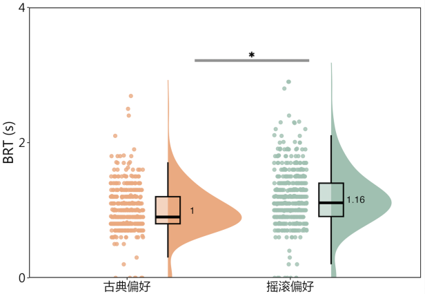

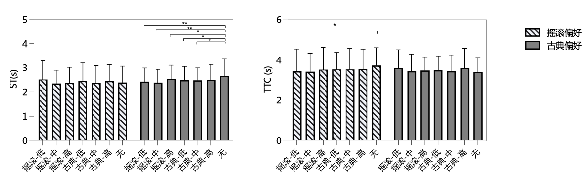

音乐流派对驾驶行为影响的多维分析：个人偏好与音乐元素的影响

#### 6.2.7 实验结果

（1） 反应行为 以音乐偏好、音乐流派、音高的为自变量，以反应任务各指标为因变量， 进行2×2×3 的重复测量方差，结果如表6-14 所示。 音乐偏好的主效应在反应时上显著。偏好摇滚乐的被试，反应时显著长于 在偏好古典的被试，如图6-12。 其余各变量的主效应和交互效应上，没有发现显著的结果。 比较无音乐和其余6 种音乐条件下的差异，在停车用时和碰撞时间上发现 其它音乐条件与无音乐条件有显著差异，如图6-13 所示。对于古典音乐偏好的 人，在无音乐条件下的停车用时与古典-调高无差异，要显著长于其它条件。对 于摇滚音乐偏好的人，在无音乐条件下的碰撞时间要显著长于摇滚-原调。 图6-12 不同音乐偏好组的BRT 结果（实验5） Figure 6-12 BRT results for different music preference in Experiment 5 图6-13 不同偏好组在各音乐条件下的任务表现结果（实验5） Figure 6-13 Task results at different conditions for different preference drivers in Experiment 5

<!-- ===== 原文 第 107 页 ===== -->

|  |  |  |  |  |  |  | 第6 | 章 | 研究三：音乐流 | 派和音高对驾 | 驶行 | 为 | 的影响 |  |  |  |  |  |  |  |  |
|---|---|---|---|---|---|---|---|---|---|---|---|---|---|---|---|---|---|---|---|---|---|
|  |  |  |  |  |  | 表6-13 | 实验5 在 | 不 | 同偏好被试在 | 不同音乐条 | 件 | 的 | 反应行为 |  | 指标描述统 | 计 |  |  |  |  |  |
|  |  | Tab | le | 6-13 | Descri | ptive statistics o | f the rea | ctio | n metrics for | the two grou | ps | of | drivers in |  | Experiment |  | 5 fo | r each | music con | dition |  |
|  |  |  |  |  |  |  | 摇滚 |  |  |  |  |  |  |  | 古典 |  |  |  |  |  | 对照 |
|  |  |  |  |  |  | 调低 | 原调 |  | 调高 |  |  | 调 | 低 |  | 原调 |  | 调 | 高 |  |  | 无音乐 |
|  |  |  |  |  |  | 均值 | 均值 |  | 均值 |  |  | 均 | 值 |  | 均值 |  | 均 | 值 |  |  | 均值 |
|  |  |  |  |  |  | (标准差) ( | 标准差) |  | (标准差) |  | ( | 标 | 准差) | ( | 标准差) |  | (标 | 准差) |  |  | (标准差) |
| 1. 刹车 | 反应时 | （s） |  |  |  |  |  |  |  |  |  |  |  |  |  |  |  |  |  |  |  |
|  |  |  |  | 古典 | 1 | .12 (0.45) 1.0 | 0 (0.42) | 1 | .14 (0.48) |  | 1.0 | 8 | (0.38) 1 | . | 08 (0.43) | 1 | .07 | (0.37) |  | 1 | .09 (0.40) |
|  |  |  |  | 摇滚 | 1 | .15 (0.49) 1.1 | 5 (0.39) | 1 | .16 (0.46) |  | 1.1 | 7 | (0.38) 1 | . | 15 (0.41) | 1 | .19 | (0.44) |  | 1 | .27 (0.46) |
| 2. 停车 | 用时（ | s） |  |  |  |  |  |  |  |  |  |  |  |  |  |  |  |  |  |  |  |
|  |  |  |  | 古典 | 2 | .42 (0.58) 2.3 | 9 (0.57) | 2 | .55 (0.57) |  | 2.4 | 8 | (0.59) 2 | . | 48 (0.54) |  | 2.5 ( | 0.65) |  | 2 | .67 (0.71) |
|  |  |  |  | 摇滚 | 2 | .53 (0.77) 2.3 | 5 (0.55) | 2 | .37 (0.66) |  | 2.4 | 6 | (0.75) 2 | . | 37 (0.73) |  | 2.45 | (0.7) |  | 2 | .39 (0.69) |
| 3. 碰撞 | 时间（ | s） |  |  |  |  |  |  |  |  |  |  |  |  |  |  |  |  |  |  |  |
|  |  |  |  | 古典 | 3 | .61 (0.89) 3.4 | 4 (0.84) | 3 | .47 (0.68) |  | 3. | 48 | (0.7) | 3 | .44 (0.8) | 3 | .61 | (0.96) |  |  | 3.4 (0.71) |
|  |  |  |  | 摇滚 | 3 | .43 (1.11) 3. | 41 (0.9) | 3 | .53 (1.09) |  | 3.5 | 4 | (0.81) 3 | . | 54 (1.03) | 3 | .56 | (0.98) |  | 3 | .73 (0.88) |
|  |  |  |  |  |  |  | 表6- | 14 | 实验5 中反应 | 指标下的方 | 差 | 分 | 析结果 |  |  |  |  |  |  |  |  |
|  |  |  |  |  | Ta | ble 6-14 ANOV | A results | in | Experiment 5 | with reactio | n m | e | trics as the |  | dependent v | a | ria | ble |  |  |  |
|  |  | 偏好 |  |  |  | 流派 | 音 | 高 |  | 偏好×流派 |  |  | 偏好× |  | 音高 |  | 流 | 派×音 | 高 | 偏好×流 | 派×音高 |
|  |  |  |  | 2 |  | 2 |  |  | 2 |  | 2 |  |  |  | 2 |  |  |  | 2 |  | 2 |
|  | F (1,26) | p |  | η | F (1,26) | p η | F (2,52) | p | η F (1,26 | p η ) |  |  | F p (2,52) |  | η F | (2 | ,52) | p | η F | (2,52) | p η |
| BRT | 7.536 | 0.011* | 0 | .225 | 0.368 | 0.549 0.014 | 1.610 0. | 210 | 0.058 0.00 | 1 0.981 0.0 | 00 |  | 0.110 0.8 | 9 | 6 0.004 0 | .4 | 64 | 0.631 | 0.018 0 | .624 0. | 540 0.02 |
| ST | 0.026 | 0.873 | 0 | .001 | 0.008 | 0.931 0.000 | 1.863 0. | 165 | 0.067 0.09 | 7 0.758 0.0 | 04 |  | 0.966 0.3 | 8 | 7 0.036 0 | .2 | 81 | 0.756 | 0.011 0 | .480 0. | 622 0.01 |
| TTC | 0.318 | 0.578 | 0 | .012 | 0.504 | 0.484 0.019 | 1.258 0. | 293 | 0.046 0.84 | 1 0.368 0.0 | 31 |  | 0.009 0.9 | 9 | 1 0.00 0 | .0 | 30 | 0.970 | 0.001 0 | .736 0. | 484 0.02 |

<!-- ===== 原文 第 108 页 ===== -->

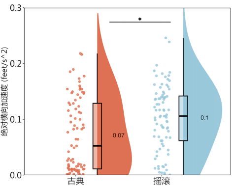

音乐流派对驾驶行为影响的多维分析：个人偏好与音乐元素的影响 （2） 驾驶行为 以音乐偏好、音乐流派、音高的为自变量，以驾驶行为各指标为因变量， 进行2×2×3 的重复测量方差，结果如表6-16 所示。 流派主效应在绝对横向加速度显著，在摇滚乐下，绝对横向加速度要显著 大于古典音乐，如图6-14。 音高的主效应在绝对横向加速度和两个变量上显著，如图6-15。原调音乐 下，绝对横向加速度要显著小于调低和调高条件，横向位移标准差要显著大于 调低和调高的音乐下。 其余变量的主效应和交互效应上，没有发现显著的结果。 比较无音乐和其余6 种音乐条件下的差异，在纵向速度标准差、绝对横向 加速度和横向位移标准差上发现其它音乐条件与无音乐条件有显著差异，如图 6-16 所示。对于摇滚音乐偏好的人，在无音乐条件下的纵向速度标准差要显著 小于古典-调低，横向位移标准差要显著大于摇滚-调低、古典-调低和古典-调高 条件。对于摇滚音乐偏好和古典偏好的人，在无音乐条件下的绝对横向加速度 要显著大于古典-原调音乐条件。 图6-14 不同音乐流派下的绝对横向加速度结果（实验5） Figure 6-14 Absolute value of lateral acceleration results under different music genres in Experiment 5

<!-- ===== 原文 第 109 页 ===== -->

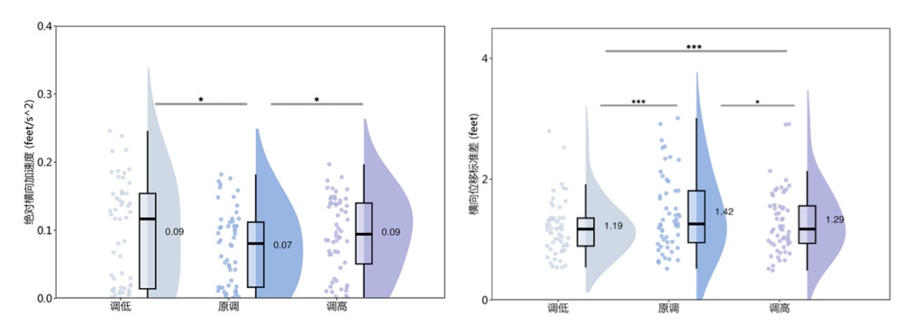

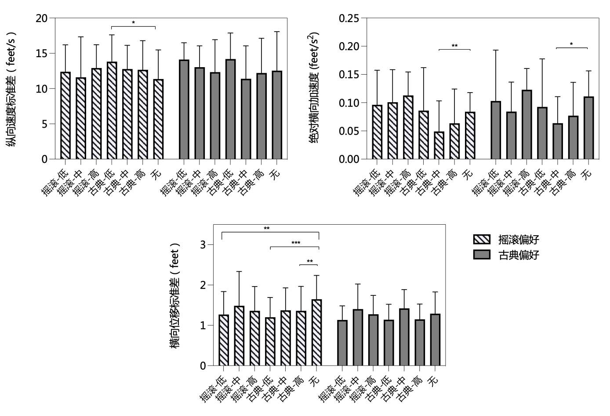

第6 章 研究三：音乐流派和音高对驾驶行为的影响 图6-15 不同音高下的驾驶表现结果（实验5） Figure 6-15 Driving results under different music pitch in Experiment 5 图6-16 不同偏好组在各音乐条件下的驾驶表现结果（实验5） Figure 6-16 Driving results at different conditions for different preference drivers in Experiment 5

<!-- ===== 原文 第 110 页 ===== -->

音乐流派对驾驶行为影响的多维分析：个人偏好与音乐元素的影响 表6-15 实验5 不同偏好组在各音乐条件下驾驶行为指标的描述统计 Table 6-15 Descriptive statistics of driving behavior indicators for different preference groups of drivers in each music condition in Experiment 5

|  | 摇滚 |  |  | 古典 |  | 对照 |
|---|---|---|---|---|---|---|
|  | 慢 中 | 快 | 慢 | 中 | 快 | 无音乐 |
|  | 均值 均值 | 均值 | 均值 | 均值 | 均值 | 均值 |
|  | (标准差) (标准差) | (标准差) | (标准差) | (标准差) | (标准差) | (标准差) |
| 1. | 纵向速度（feet/s） |  |  |  |  |  |
|  | 39.64 40.5 | 40.92 | 40.67 | 41.45 | 40.31 | 40.24 |
|  | 古典 |  |  |  |  |  |
|  | (3.49) (3.43) | (4.61) | (3.53) | (4.67) | (4.5) | (3.86) |
|  | 38.43 39.64 | 38.57 | 38.48 | 38.35 | 38.68 | 38.43 |
|  | 摇滚 |  |  |  |  |  |
|  | (6.55) (6.08) | (6.26) | (5.11) | (5.21) | (5.75) | (5.38) |
| 2. | 纵向速度标准差（feet/s） |  |  |  |  |  |
|  | 14.12 13.03 | 12.34 | 14.19 | 11.39 | 12.21 | 12.54 |
|  | 古典 |  |  |  |  |  |
|  | (2.38) (3.02) | (4.6) | (3.68) | (4.67) | (4.91) | (5.52) |
|  | 12.39 11.59 | 12.92 | 13.81 | 12.78 | 12.67 | 11.35 |
|  | 摇滚 |  |  |  |  |  |
|  | (3.81) (5.74) | (3.29) | (3.8) | (3.35) | (4.12) | (4.13) |
| 3. | 纵向加速度（feet/s2） |  |  |  |  |  |
|  | 0.00 0.11 | 0.1 | 0.02 | 0.17 | 0.06 | 0.11 |
|  | 古典 |  |  |  |  |  |
|  | (0.06) (0.2) | (0.17) | (0.1) | (0.26) | (0.11) | (0.23) |
|  | 0.12 0.10 | 0.09 | 0.03 | 0.07 | 0.07 | 0.12 |
|  | 摇滚 |  |  |  |  |  |
|  | (0.31) (0.10) | (0.20) | (0.09) | (0.13) | (0.14) | (0.19) |
| 4. | 绝对横向加速度（feet/s2） |  |  |  |  |  |
|  | 0.1 0.08 | 0.12 | 0.09 | 0.06 | 0.08 | 0.11 |
|  | 古典 |  |  |  |  |  |
|  | (0.09) (0.05) | (0.04) | (0.08) | (0.05) | (0.06) | (0.05) |
|  | 0.1 0.1 | 0.11 | 0.09 | 0.05 | 0.06 | 0.08 |
|  | 摇滚 |  |  |  |  |  |
|  | (0.06) (0.06) | (0.04) | (0.08) | (0.05) | (0.06) | (0.03) |
| 5. | 横向位移标准差（feet） |  |  |  |  |  |
|  | 1.13 1.4 | 1.28 | 1.14 | 1.42 | 1.15 | 1.29 |
|  | 古典 |  |  |  |  |  |
|  | (0.35) (0.62) | (0.47) | (0.38) | (0.46) | (0.38) | (0.54) |
|  | 1.27 1.49 | 1.36 | 1.2 | 1.37 | 1.36 | 1.65 |
|  | 摇滚 |  |  |  |  |  |
|  | (0.57) (0.85) | (0.6) | (0.49) | (0.56) | (0.61) | (0.59) |
| 6. | 超过35mph 的时间（ms） |  |  |  |  |  |
|  | 407.69 259.69 | 384.62 | 463.69 | 317.08 | 397.15 | 294.77 |
|  | 古典 |  |  |  |  |  |
|  | (455.48) (247.63) | (364.64) | (318.08) | (268.02) | (424.97) | (319.71) |
|  | 291.07 289.8 | 402.33 | 436.93 | 313.47 | 362.67 | 199.13 |
|  | 摇滚 |  |  |  |  |  |
|  | (428.83) (260.34) | (454.39) | (457.97) | (349) | (430.43) | (225.64) |
| 7. | 油门踏板计数 |  |  |  |  |  |
|  | 18012.88 19047.03 | 18491.65 | 18830.2 | 19098.52 | 17621.68 | 18910.55 |
|  | 古典 |  |  |  |  |  |
|  | (4005.19) (2627.72) | (2632.72) | (2450.49) | (2333.28) | (3143.43) | (2353.45) |
|  | 17467.66 17335.44 | 17077.1 | 17087.67 | 16817.88 | 16737.91 | 16896.61 |
|  | 摇滚 |  |  |  |  |  |
|  | (4952.47) (3450.76) | (5431.56) | (2884.28) | (4583.07) | (4189.91) | (4199.34) |
| 8. | 刹车踏板计数 |  |  |  |  |  |
|  | 3833.32 3381.3 | 2996.6 | 3770.89 | 2680.83 | 2967.14 | 3155.63 |
|  | 古典 |  |  |  |  |  |
|  | (1291.62) (1751.91) | (1784.48) | (1196.5) | (1810.1) | (1714.19) | (1864.12) |
|  | 3103.85 2794.34 | 3212.38 | 3407.27 | 3085.9 | 3008.98 | 2612.89 |
|  | 摇滚 |  |  |  |  |  |
|  | (1853.75) (1863.12) | (1470.85) | (1136.34) | (1212.42) | (1573) | (1670.38) |

<!-- ===== 原文 第 111 页 ===== -->

第6 章 研究三：音乐流派和音高对驾驶行为的影响

|  |  |  |  |  |  | 表6- | 16 实验5 | 中驾驶行为指标下的方差分析结果 |  |  |  |  |
|---|---|---|---|---|---|---|---|---|---|---|---|---|
|  |  | Tab | le 6-16 | ANO | VA res | ults in | Experime | nt 5 with driving behavior indicator a | s the | dependent | variable |  |
|  |  | 偏好 |  |  | 流派 |  | 音 | 高 偏好×流派 偏 | 好×音 | 高 | 流派×音高 | 偏好×流派×音高 |
|  |  |  | 2 |  |  | 2 |  | 2 2 |  | 2 | 2 | 2 |
|  | F (1,26) | p | η | F (1,26) | p | η | F (2,52) | p η F p η F (1,26) (2,52) | p | η F (2 | p η ,52) | F p η (2,52) |
| 纵向速度 | 1.390 | 0.249 | 0.051 | 0.009 | 0.923 | 0.000 | 0.727 0. | 469 0.027 1.054 0.314 0.039 0.042 | 0.939 | 0.002 0.2 | 15 0.803 0.008 | 0.626 0.536 0.023 |
| 纵向速度标准差 | 0.042 | 0.840 | 0.002 | 0.042 | 0.839 | 0.002 | 2.750 0. | 082 0.096 1.511 0.230 0.055 0.787 | 0.445 | 0.029 0.3 | 08 0.721 0.012 | 0.551 0.568 0.021 |
| 纵向加速度 | 0.006 | 0.938 | 0.000 | 0.416 | 0.525 | 0.016 | 1.745 0. | 186 0.063 1.273 0.269 0.047 1.325 | 0.274 | 0.048 0.3 | 54 0.702 0.013 | 0.627 0.537 0.024 |
| 绝对横向加速度 | 0.412 | 0.527 | 0.016 | 6.440 | 0.017* | 0.199 | 3.568 0.0 | 40* 0.121 0.217 0.646 0.008 0.279 | 0.737 | 0.011 1.0 | 81 0.336 0.040 | 0.218 0.757 0.008 |
| 横向位移标准差 | 0.235 | 0.632 | 0.009 | 0.976 | 0.332 | 0.036 | 11.246 0.0 | 01** 0.302 0.074 0.788 0.003 0.866 | 0.383 | 0.032 0.0 | 32 0.933 0.001 | 0.573 0.518 0.022 |
| 超速时间 | 0.035 | 0.854 | 0.001 | 2.079 | 0.161 | 0.074 | 2.903 0. | 076 0.100 0.000 0.982 0.00 0.434 | 0.611 | 0.016 0.8 | 04 0.439 0.030 | 0.366 0.667 0.014 |
| 油门踏板计数 | 1.421 | 0.244 | 0.052 | 0.803 | 0.379 | 0.030 | 1.066 0. | 349 0.039 0.800 0.379 0.030 0.717 | 0.486 | 0.027 0.3 | 72 0.685 0.014 | 0.419 0.654 0.016 |
| 刹车踏板计数 | 0.384 | 0.541 | 0.015 | 0.096 | 0.759 | 0.004 | 2.222 0. | 119 0.079 0.839 0.368 0.031 0.744 | 0.478 | 0.028 0.1 | 46 0.860 0.006 | 0.441 0.641 0.017 |

<!-- ===== 原文 第 112 页 ===== -->

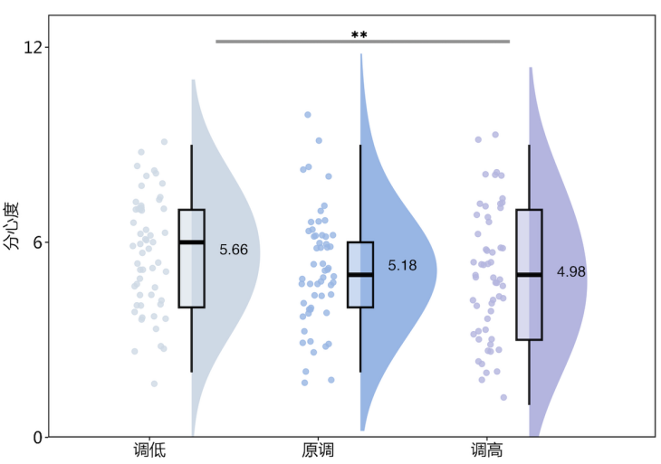

音乐流派对驾驶行为影响的多维分析：个人偏好与音乐元素的影响 （3） 认知感受 以音乐偏好、音乐流派、音高的为自变量，以认知感受各指标为因变量， 进行2×2×3 的重复测量方差，结果如表6-18 所示。 音乐流派的主效应在分心度上显著，在调低的条件下分心度显著大于在调 高的条件下（p < 0.01**），边缘显著大与原调条件（p = 0.059），如图6-17。 其余各变量的主效应和交互效应上，没有发现显著的结果。 图6-17 不同音高下的分心度结果（实验5） Figure 6-17 Distraction results under different music pitch in Experiment 5 （4） 情绪体验 以音乐偏好、音乐流派、音高的为自变量，以情绪体验各指标为因变量， 进行2×2×3 的重复测量方差，结果如表6-19 所示。 流派主效应在唤醒度上显著，如图6-18，在摇滚音乐下的唤醒度显著更高。 其余变量的主效应和交互效应上，没有发现显著的结果。 比较无音乐和其余6 种音乐条件下的差异，在愉悦度和唤醒度上发现其它 音乐条件与无音乐条件有显著差异，如图6-19 所示。对于偏好摇滚和偏好古典 的被试，无音乐条件下的愉悦度要显著小于在其它条件。对于偏好摇滚的被试， 在无音乐条件下的唤醒度显著低于摇滚音乐各条件。对于偏好古典的被试，在 无音乐条件下的唤醒度比摇滚乐、古典-原调和古典-调高条件下低。

<!-- ===== 原文 第 113 页 ===== -->

|  |  |  |  |  |  |  |  | 第6 章 | 研究三：音乐流派和音高对驾驶行为的影响 |  |  |  |  |  |  |  |  |
|---|---|---|---|---|---|---|---|---|---|---|---|---|---|---|---|---|---|
|  |  |  |  |  |  |  | 表6-17 实 | 验5 不 | 同偏好组在各音乐条件下认知感受指 | 标 | 的描 | 述统 | 计 |  |  |  |  |
| Table | 6- | 17 De | scripti | ve | statis | tics of cogn | itive expe | rience | indicators for different preference group | s | of d | rivers | in | each | music conditio | n in Exp | eriment 5 |
|  |  |  |  |  |  |  | 摇滚 |  |  |  | 古典 |  |  |  |  |  | 对照 |
|  |  |  |  |  |  | 调低 | 原调 |  | 调高 调低 |  | 原调 |  |  | 调高 |  |  | 无音乐 |
|  |  |  |  |  |  | 均值 | 均值 |  | 均值 均值 |  | 均值 |  |  | 均值 |  |  | 均值 |
|  |  |  |  |  | (标 | 准差) | (标准差) | (标 | 准差) (标准差) | ( | 标准 | 差) |  | (标准 | 差) |  | (标准差) |
| 1. 认知负荷 |  |  |  |  |  |  |  |  |  |  |  |  |  |  |  |  |  |
|  |  | 古典 |  |  | 31.54 | (17.98) 3 | 4 (17.42) | 31.46 | (19.42) 29.92 (16.28) 3 | 2. | 38 (1 | 9.6) | 3 | 2.08 (1 | 7.83) | 31 | .77 (19.59) |
|  |  | 摇滚 |  |  | 32.87 | (14.94) 3 | 5 (20.95) | 30.9 | 3 (17.2) 31.33 (17.28) 31 | .5 | 3 (17 | .13) |  | 32 (18. | 66) | 28 | .27 (13.61) |
| 2. 感知驾驶 | 速 | 度 |  |  |  |  |  |  |  |  |  |  |  |  |  |  |  |
|  |  | 古典 |  |  | 4.0 | 0 (2.2) 4 | .38 (1.71) | 3.6 | 9 (1.7) 3.69 (1.8) 3 | .7 | 7 (2. | 01) |  | 3.69 (1 | .65) | 3 | .85 (2.12) |
|  |  | 摇滚 |  |  | 4.6 | (1.88) 5 | .07 (2.52) | 4.6 | (1.35) 4.47 (2.13) 5 | .0 | 7 (2. | 19) |  | 5.33 (2 | .19) | 4 | .47 (3.14) |
| 3. 分心度 |  |  |  |  |  |  |  |  |  |  |  |  |  |  |  |  |  |
|  |  | 古典 |  |  | 5.92 | (1.66) 5 | .77 (2.05) | 5.38 | (2.43) 5.85 (1.99) 5 | .5 | 4 (1. | 27) |  | 4.92 (2 | .22) | 5 | .62 (2.22) |
|  |  | 摇滚 |  |  | 5.6 | (1.64) 4 | .93 (1.75) | 5.33 | (1.84) 5.33 (1.5) | 4. | 6 (1.5 | 9) |  | 4.33 (1 | .4) |  | 4.8 (1.78) |
|  |  |  |  |  |  |  | 表 | 6-18 实 | 验5 中认知感受指标下的方差分析结果 |  |  |  |  |  |  |  |  |
|  |  |  | T | ab | le 6-1 | 8 ANOVA | results in | Experi | ment 5 with cognitive experience indicat | or | as t | he de | pe | ndent | variable |  |  |
|  |  |  | 偏好 |  |  | 流派 |  |  | 音高 偏好×流派 偏 | 好 | ×音 | 高 |  | 流 | 派×音高 | 偏好×流 | 派×音高 |
|  |  |  |  |  | 2 |  | 2 |  | 2 2 |  |  | 2 |  |  | 2 |  | 2 |
|  | F ( | 1,26) | p | η |  | F p (1,26) | η | F (2,52) | p η F p η F (1,26) (2,52) |  | p | η |  | F (2,52) | p η | F (2,52) | p η |
| 认知负荷 | 0. | 004 | 0.951 | 0.0 | 00 | 0.618 0.439 | 0.023 | 0.874 | 0.423 0.033 0.025 0.876 0.001 0.170 | 0. | 844 | 0.006 |  | 0.652 | 0.513 0.024 | 0.082 0. | 908 0.003 |
| 感知驾驶 |  |  |  |  |  |  |  |  |  |  |  |  |  |  |  |  |  |
|  | 2. | 849 | 0.103 | 0.0 | 99 | 0.079 0.781 | 0.003 | 0.945 | 0.395 0.035 1.746 0.198 0.063 0.545 | 0. | 583 | 0.021 |  | 1.131 | 0.331 0.042 | 0.182 0. | 834 0.007 |
| 速度 |  |  |  |  |  |  |  |  |  |  |  |  |  |  |  |  |  |
| 分心度 | 1. | 222 | 0.279 | 0.0 | 45 | 2.480 0.127 | 0.087 | 4.971 | 0.011* 0.160 0.305 0.586 0.012 0.939 | 0. | 397 | 0.035 |  | 0.622 | 0.541 0.023 | 0.094 0. | 910 0.004 |

<!-- ===== 原文 第 114 页 ===== -->

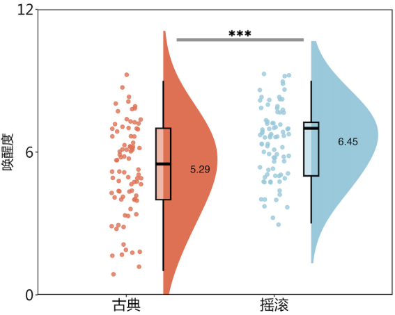

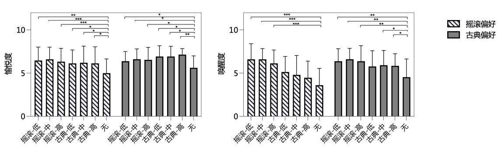

音乐流派对驾驶行为影响的多维分析：个人偏好与音乐元素的影响 图6-18 不同音乐流派下的唤醒度结果（实验5） Figure 6-18 Arousal results under different music genres in Experiment 5 图6-19 不同偏好组在各音乐条件下的情绪结果（实验5） Figure 6-19 Emotion results at different conditions for different preference drivers in Experiment 5

<!-- ===== 原文 第 115 页 ===== -->

第6 章 研究三：音乐流派和音高对驾驶行为的影响 1. 愉悦度 2. 唤醒度 愉悦度 1.037 0.318 0.038  0.172 唤醒度 1.365 0.253 0.050  14.636 0.001*** 0.360  0.960 0.382 0.036  3.035

|  |  |  |  |  |  |  | 表6-19 | 实验5 | 不同偏好组在各音乐条件下情绪体验指标的描述统计 |  |  |  |  |
|---|---|---|---|---|---|---|---|---|---|---|---|---|---|
| ble 6- | 19 Des | criptive | st | atis | ti | cs of emo | tion exp | erienc | e indicators for different preference groups of drivers in | eac | h music co | ndition i | n Experiment 5 |
|  |  |  |  |  |  |  | 摇滚 |  | 古典 |  |  |  | 对照 |
|  |  |  |  |  | 慢 |  | 中 |  | 快 慢 中 |  | 快 |  | 无音乐 |
|  |  |  |  | 均 | 值 |  | 均值 |  | 均值 均值 均值 | 均 | 值 |  | 均值 |
|  |  |  |  | (标 | 准 | 差) | (标准差) | ( | 标准差) (标准差) (标准差) | (标 | 准差) |  | (标准差) |
|  | 古典 |  | 6 | .38 | (1 | .12) 6 | .62 (1.19 | ) 6. | 54 (1.45) 6.92 (1.26) 6.92 (1.19) 7 | .15 | (0.69) |  | 5.62 (1.39) |
|  | 摇滚 |  | 6 | .47 | (1 | .55) | 6.6 (1.4) | 6. | 33 (1.54) 6.13 (1.55) 6.2 (1.93) 6 | .13 | (1.92) |  | 5 (1.65) |
|  | 古典 |  | 6 | .38 | (1 | .45) 6 | .62 (1.26 | ) 6 | .38 (1.8) 5.77 (1.83) 5.92 (1.71) 5 | .85 | (1.41) |  | 4.54 (2.11) |
|  | 摇滚 |  |  | 6.6 | (1 | .8) | 6.6 (1.24) | 6. | 13 (1.55) 5.13 (1.81) 4.8 (2.24) 4 | .47 | (1.92) |  | 3.6 (1.96) |
|  |  |  |  |  |  |  | 表 | 6-20 | 实验5 中情绪体验指标下的方差分析结果 |  |  |  |  |
|  |  | Tabl | e | 6-2 | 0 | ANOVA | results i | n Expe | riment 5 with emotion experience indicator as the depen | de | nt variable |  |  |
|  | 偏好 |  |  |  |  | 流派 |  |  | 音高 偏好×流派 偏好×音高 |  | 流派×音 | 高 | 偏好×流派×音高 |
|  |  | 2 |  |  |  |  | 2 |  | 2 2 2 |  |  | 2 | 2 |
| F (1,26) | p | η | F | (1,26) |  | p | η | F (2,52) | p η F p η F p η (1,26) (2,52) | F | p (2,52) | η | F p η (2,52) |
| 1.037 | 0.318 | 0.038 | 0 | .172 |  | 0.682 | 0.007 | 0.270 | 0.729 0.010 3.530 0.072 0.120 0.486 0.588 0.018 | 0 | .273 0.753 | 0.010 | 0.029 0.967 0.001 |
| 1.365 | 0.253 | 0.050 1 | 4 | .63 | 6 | 0.001*** | 0.360 | 0.960 | 0.382 0.036 3.035 0.093 0.105 0.910 0.400 0.034 | 0 | .140 0.865 | 0.005 | 0.075 0.924 0.003 |

<!-- ===== 原文 第 116 页 ===== -->

音乐流派对驾驶行为影响的多维分析：个人偏好与音乐元素的影响

### 6.3 小结与讨论

研究三的目的是为了在音乐偏好的基础上，探究音乐流派和音高对驾驶行 为的影响。以音乐流派偏好（摇滚、古典）为组间变量，音乐流派（摇滚、古 典）、音高（调低、原调、调高）为组内变量，通过2 个模拟驾驶行为实验分 别探究不同音乐对无风险情境下车辆控制行为的影响和有风险情境下危险规避 行为的影响。结果表明，音乐流派和音高会影响驾驶员的情绪和驾驶行为，并 且会受到音乐偏好的影响。具体来看： （1） 在无风险的驾驶情境下： 音乐偏好对驾驶表现有影响。摇滚偏好的驾驶员的驾驶速度、绝对横向加 速度和超速时间显著大于古典偏好的驾驶员。说明摇滚偏好的驾驶员驾驶行为 上表现出更高的冒险性。 音乐流派对任务表现、驾驶行为和情绪体验有影响。任务表现上，在古典 音乐下，车辆时间间隔标准差、车辆距离间隔标准差显著更大，说明在古典音 乐下跟车表现更不稳定；以及落后警告次数更多，说明在古典音乐下，对于感 知前车速度变化进而调整本车速度的反应更慢。驾驶表现上，在摇滚音乐下， 驾驶速度更快、绝对横向加速度更大、油门踏板力更大以及横向位移标准差更 大，说明在摇滚音乐下，驾驶行为表现出更高的冒险性和不稳定性。情绪体验 上，在摇滚音乐下，唤醒度更高。 音高对任务表现和驾驶行为有影响。调低音高后，跟车任务是车辆间隔时 间要显著小于其它条件，这说明在调低音高的背景下，驾驶员追上前车所用的 时间会更长，跟车表现会稍差。可能是因为在音高更低的条件下，情绪唤醒更 低 (Ley-Flores 等, 2022)，导致感知前车的速度更慢 (Zhang 等, 2021)。从音乐偏 好和音高的交互结果中表现出，对于偏好摇滚的被试，调高条件下的纵向速度 标准差要显著高于调低条件下；对于偏好古典的被试，调高条件下的绝对横向 加速度要显著高于原音高和调低条件。说明调高音高后，可能会对车辆控制的 稳定性有不好的影响。 音高和音乐流派对任务表现有影响。对古典音乐，在原音高下跟车一致性 和增益系数都更好，跟车表现更好，说明古典乐更不适合进行音高调整。而对 摇滚音乐，调高音高后，跟车表现更好，对摇滚乐的音高调整不会过改变驾驶 员的感知，从而不会损害任务表现和驾驶表现。 区分音乐偏好，对比无音乐和其它音乐条件。对于摇滚偏好的驾驶员，相 比于无音乐，播放摇滚乐会提高愉悦度，在摇滚乐或是调高的古典乐下唤醒度 会更高，但可能会导致更激进、不稳定的驾驶行为；播放原调古典乐虽然不能 提高驾驶员的情绪体验，但不会对驾驶有更不利的影响。对于古典偏好的驾驶

<!-- ===== 原文 第 117 页 ===== -->

第7 章 研究三：音乐流派和音高对驾驶行为的影响 员，相比于无音乐，在各音乐条件下愉悦度都更高，除了调低的古典乐，在其 它音乐条件下唤醒都会更高。 （2） 在有风险的驾驶情境下： 音乐偏好对任务表现有影响。古典偏好的驾驶员对前车急刹的反应更快， 摇滚偏好的驾驶员反应更慢。 音乐流派对驾驶行为和情绪体验有影响。任驾驶表现上结果发现了在摇滚 音乐下绝对横向加速度显著更大，唤醒度显著更高。这意味着摇滚音乐会使驾 驶员更加兴奋或活跃，可能导致驾驶的横向控制较不稳定。 音高对驾驶行为和认知感受有影响。在调低和调高的音乐下，横向位移标 准差更小，主观分心更低。调整音高后，任务表现没有损害，驾驶行为也更稳 定，注意力更集中，可能是因为对音乐进行音高调整时，实际上是在改变音频 信号中音符的频率，会影响音乐的整体感觉和情绪，以往研究者发现在低音下， 个体感知物体运动速度更慢，情绪感受更为低沉(Collier & Hubbard, 1998; Ley- Flores 等, 2022; Zhang 等, 2021)。在进行音高调整时，可能会产生细微的失真， 所以调高或调低的音乐下，音乐的失真减少了驾驶员对音乐的投入度，从而有 在驾驶任务上有更多的注意力，驾驶表现更好。 区分不同偏好的驾驶员，对比各音乐条件下的结果。发现对于摇滚偏好的 驾驶员，相比于无音乐条件，在音乐条件下的愉悦度显著更高，但只有在摇滚 乐下唤醒度才显著提高更高；在原音高的摇滚乐下，碰撞时间更短，在调低的 摇滚乐下横向位移标准差更小，因此可以认为在风险驾驶情境下，偏好摇滚的 驾驶员可以更多地播放调低的摇滚乐。对于古典偏好的驾驶员，在音乐条件下 的愉悦度显著更高，在除调低古典乐的其它音乐条件下，唤醒度显著更高，无 音乐条件下的停车用时要长于摇滚乐和调低以及原音高的古典乐，绝对横向加 速度也要显著高于原音高的古典乐，因此认为对于偏好古典的驾驶员，可以在 有风险驾驶情境下，播放摇滚乐或是古典乐（但要避免过高的音高）。

<!-- ===== 原文 第 118 页 ===== -->

音乐流派对驾驶行为影响的多维分析：个人偏好与音乐元素的影响

### 第7章  总讨论与展望

### 7.1 总体讨论

本研究通过三个研究，5个实验，系统探究了音乐偏好、音乐流派、以及音 乐速度和音高对不同情境下驾驶行为的影响。

#### 7.1.1 音乐流派偏好与驾驶行为的关系

在音乐心理学领域，一些学者已经指出个人的音乐偏好可能与他们的风险 行为倾向相关联，尤其是所谓的“问题音乐”类别，如重金属和摇滚，更倾向于 与高风险行为和超速驾驶相联系(North 等, 2005; Yosephine 等, 2020)。尽管音乐 流派偏好与驾驶行为之间的关系还没有被广泛研究，但这一领域的初步探索表 明了解这种关系的重要性，因为它可能对驾驶安全产生影响。 研究一验证了音乐流派偏好与驾驶行为的关系，研究结果发现对于古典、 古乐、电子和爵士音乐的偏好能显著正向预测危险驾驶行为得分，这意味着那 些对这些音乐流派有更强烈偏好的人，在驾驶中有更多的失误、驾驶行为上更 可能表现出冒险或不安全的倾向。以往研究发现偏好古典类音乐的人与开放性 人格正相关 (Nave 等, 2018)，喜欢古典乐的驾驶员可能对驾驶环境中的各个线索 都持有开放性，所以造成投入在驾驶主任务中的认知资源减少，从而会有更多 的驾驶失误和错误。另外有研究发现对说唱和电子乐等被任务是问题音乐有偏 好的人更倾向有冒险行为(North 等, 2005)，本研究中则发现在控制了情绪调控能 力后，对电子乐的音乐偏好的驾驶员有更高的危险驾驶倾向。而更多音乐偏好 对驾驶行为的影响，可能需要考虑驾驶员自身的情绪调控能力。 本研究发现情绪调节能力在音乐流派偏好与驾驶安全间有的调节作用。具 体来说，低情绪调控能力的驾驶员，如果对摇滚、说唱、重金属、电子和爵士 乐有偏好，那么可能有更高的危险驾驶行为倾向。而在那些具有较高情绪调节 能力的个体中，音乐偏好与危险驾驶行为的关联性减弱。这可能是因为情绪调 节能力较强的人能够更好地管理音乐所引发的情绪激动，从而在驾驶时保持更 稳定的状态，减少冒险行为的发生。这一发现为理解音乐如何影响驾驶提供了 新的视角。 除了主观报告的数据，本研究收集了行为数据，对比了音乐流派偏好不同 的驾驶员在任务表现有差异。由于以往研究关于摇滚和古典乐对驾驶的影响结 论不一致，以及研究一中对古典和摇滚偏好的结果发现，研究二进一步对比了 摇滚偏好和古典偏好的差异。结果发现古典摇滚偏好的驾驶员的驾驶速度、绝 对横向加速度和超速时间显著快于古典偏好的驾驶员，在危险规避任务中，摇 滚偏好的驾驶员刹车反应更慢，说明摇滚偏好驾驶员在驾驶过程中安全性更低。

<!-- ===== 原文 第 119 页 ===== -->

第7 章 总讨论与展望 以往研究这发现更追求冒险、新奇体验的个体更倾向于喜欢令人兴奋的音乐 (Arnett, 1991a; McNamara & Ballard, 1999)，可能摇滚偏好的驾驶员相比于古典 偏好的驾驶员有更强的追求冒险和新奇体验的倾向，驾驶行为上更会追求高速 度，并且在危险情境中，及时发现前车刹车灯亮时也会故意在靠近前车时才踩 刹车。

#### 7.1.2 音乐流派和偏好与驾驶行为的关系

在音乐对驾驶的影响中，有研究者强调了个体偏好的影响，认为在偏好的 音乐下，有利于驾驶员的驾驶安全和体验(Cassidy & MacDonald, 2010; Hasegawa & Oguri, 2006; Navarro 等, 2018)。在研究一的基础上，需要进一步探究对音乐流 派的偏好在不同流派音乐背景下驾驶表现和安全的影响。研究二、三就基于音 乐偏好，进一步探究音乐流派和元素对驾驶的影响。将流派和偏好的结果整理 如表7-1。结果发现音乐流派对驾驶行为的影响与以往研究一致(Febriandirza 等, 2017; Wen 等, 2019)，在摇滚音乐下有更快的速度，更大的横向位移标准差，说 明驾驶表现更不稳定。在情绪体验上，也是一致发现摇滚乐下，驾驶员的唤醒 度会更高。在任务表现上，在无风险情境下，摇滚乐下本车与前车速度一致性 保持得更好，跟车任务表现更好，这可能表明在无风险环境下，摇滚音乐所提 供的高唤醒状态可能增强了驾驶员的注意力和反应能力，使得驾驶员的唤醒水 平接近完成任务的最佳唤醒水平。在有风险情境下，发现在古典音乐下碰撞时 间更长，说明在古典音乐下危险性更小，这可能是因为摇滚乐下驾驶员的唤醒 更高，驾驶行为更激进，而在具有风险的驾驶情境下，意外发生的可能性更高， 过于冒险的行为表现造成应对时间减少，大大降低驾驶的安全性。这一发现提 示我们，在不同的驾驶环境中，音乐流派的影响可能具有复杂性，并且不同风 险水平的任务可能会调动不同的认知和情绪资源。 关于个体对背景乐的偏好对驾驶的影响，研究结果发现在危险规避任务中， 摇滚偏好的驾驶员在摇滚音乐下的反应更快，而古典偏好的驾驶员在古典音乐 下停车用时更短，显示了当驾驶员在听他们偏爱的音乐时，他们展示了更迅速 的应急反应能力。以往探究音乐偏好对个体认知表现影响的研究也表明，不是 某类音乐有益于与个体的认知表现，而是在个体偏好的音乐下会促进他们的认 知表现 (Perham & Vizard, 2011; Schellenberg & Hallam, 2005)。这可能是因为个 体偏好的音乐能够更好地增加个体情绪 (Schellenberg, 2005)，结果也显示了在偏 好的音乐下愉悦度会更高。而根据情感渗透模型，一种信息处理模型，当完成 一种复杂任务时，情绪和情感有很大的影响 (Forgas & George, 2001)。根据多项 研究报告，积极的情感会增加问题解决的能力、认知能力 (Estrada 等, 1997; Isen, 2009)，多巴胺理论解释了情感增强的神经生理机制(Ashby 等, 1999)，该理论认

<!-- ===== 原文 第 120 页 ===== -->

音乐流派对驾驶行为影响的多维分析：个人偏好与音乐元素的影响 为，前扣带回中神经递质多巴胺的增加会提高几种认知能力。本研究的结果也 呈现出了在偏好的音乐流派下，愉悦情绪更高，危险规避任务表现更好的趋势。 此外，还发现了偏好和流派的交互，那些对摇滚音乐有偏好的驾驶员，在 偏好的摇滚音乐背景下驾驶表现会具有冒险倾向、有更多超速、车辆控制更不 稳定。而对于那些偏好古典音乐的驾驶员来说，在听古典音乐时会超速更少。 这些发现强调了音乐偏好在音乐与驾驶行为交互中的重要性，特别是在考虑驾 驶安全和促进良好驾驶习惯的策略时，不能绝对的认为某类音乐或偏好的音乐 一定有助于驾驶安全，而是需要根据情境、驾驶员差异来对音乐进行选择。

#### 7.1.3 音乐速度对驾驶的影响

音乐速度对任务表现、驾驶行为和情绪有影响，结果整理如表7-2。首先在 慢速的音乐下，驾驶员的唤醒和愉悦度都是显著最低、速度最慢，与前人结果 一致 (Brodsky, 2001; Cassidy & MacDonald, 2010)。但是Brodsky 发现慢和中等速 度没有差异，而本实验结果发现，中等速度下驾驶速度要显著大于慢速，一方 面可能是因为Brodsky 在三个速度下使用的是不同的音乐，可能音乐的类型产 生了更大的影响；另一方面中等速度条件下音乐的BPM 值跨度较大（94bpm- 112bpm），可能整体中速的音乐感知与慢速水平对驾驶员来说相差不。进一步 发现，驾驶速度变化与情绪变化趋势是一致的，这一结果支持Navarro 等人认为 (2023)音乐是通过情绪变化解释驾驶行为的改变的说法。 另外发现了音乐速度、流派和偏好的交互，对于摇滚偏好的驾驶员，在慢 速摇滚乐下的跟车表现显著好于慢速古典，在快速古典下的表现，显著好于慢 速古典，这可能说明对摇滚偏好的驾驶员，在同样慢的速度下，摇滚乐背景下 的唤醒和投入度都要显著高于古典乐，这可能说明控制速度一致后，摇滚乐的 整体能够比古典乐给人带来更多的唤醒。而对古典乐，在快速的古典乐下显著 更好，从这个结果也能说明音乐速度与唤醒度是有正向关联的。并且这个结果 体现出了摇滚偏好的驾驶员对于较高唤醒音乐的一种偏好，从以往研究关于摇 滚偏好的人更可能有更高追求高唤醒、刺激体验倾向的发现中也可以进行说明 (Arnett, 1991a; McNamara & Ballard, 1999)。对于偏好古典的驾驶员，在中速摇 滚乐下的表现要显著好于慢速古典，说明偏好古典的驾驶员在不同速度的摇滚 乐下状态会不同，但是在古典乐下有更好的一致性。

<!-- ===== 原文 第 121 页 ===== -->

第7 章 总讨论与展望 表7-1 音乐流派和偏好对驾驶影响的结果整理表 Table 7-1 Results of the impact of music genres and preferences on driving in driving situations 流派 偏好 偏好×流派 实验2 实验3 实验4 实验5 实验4 实验5 实验2 实验3 实验4 任务 表现 [IVT]: C > R [IVT_SD]: C > R [IVD]: C > R [IVD_SD]: C > R [COH]: R > C [Gain]: R > C [Delay]: C > R [警告]: C > R [落后]: C > R [TTC]: C > R [IVT_SD]: C > R [IVD_SD]: C > R [警告次数]: C > R [落后时间]: C > R [Delay]: C* > R* [BRT]: R*>C* [BRT]: R*: C>R [ST]: C*: R>C [警告次数]: C*:C >R; C: C* >R* 驾驶 表现 [V]: R > C [acc]: R > C [Lacc]: R > C [gas]: R > C [V_SD]: R > C [gas]: R > C [V]: R >C [acc]: R >C [Lacc]: R >C [SDLP]: R >C [gas]: R >C [Lacc]: R >C [V_SD]: R*: R>C [brake]: R*: R>C [overspeed]: R*: R>C [overspeed]: C*:R>C 认知 感受 [分心度]: R >C 情绪 体验 [唤醒度]: R > C [唤醒度]: R > C [唤醒度]: R >C [愉悦度]: R*: R>C [愉悦度]: C*: C>R [愉悦度]: R*: R>C 注: 1. 流派：C（古典乐），R（摇滚乐）；2.音乐偏好：C*（古典偏好），R（摇滚偏好）

<!-- ===== 原文 第 122 页 ===== -->

音乐流派对驾驶行为影响的多维分析：个人偏好与音乐元素的影响 表7-2 音乐速度对驾驶影响的结果整理表 Table 7-2 Results of the impact tempo on driving in driving situations 音乐速度 偏好×流派×音乐速度 实验2 实验3 实验2 [COH]:  C: M>HL;   R: L>M 音高的影响也在本研究中得到了证实，结果整理如表7-3。有研究者认为， 音高和音色变化会触发听众的情感变化 (Goydke 等, 2004)。为了排除节奏、调性 等其他音乐元素的干扰，本研究对同一音乐片段进行了有系统的音高调整。在 保持原有节奏、旋律、速度和调式不变的前提下，本实验通过将音高整体提升 半个八度以及降低半个八度，以此来研究音高变化对驾驶影响的具体效果。

| 任务表现 |  |  | [ | COH]: |  |
|---|---|---|---|---|---|
|  |  |  | R | *: R- > | C-；C+>C-; |
|  |  |  | C | *：R0 | >R- |
|  |  |  | [ | Gain]: |  |
|  |  |  | R | *: R- > | C-；C+>C-; |
|  |  |  | C | *：R0 | >R- |
| 驾驶表现 | [V]: MF>S |  |  |  |  |
|  | [Lacc]: MF>S |  |  |  |  |
| 认知感受 |  |  |  |  |  |
| 情绪体验 | [愉悦度]: | [愉悦度]: |  |  |  |
|  | M>FS | MF>S |  |  |  |
|  | [唤醒度]: | [唤醒度]: |  |  |  |
|  | MF>S | F>MS |  |  |  |
| 注: 1. 音乐速度： | S（慢速），M（ | 中速），F（快速） |  |  |  |
|  | 表7-3 音 | 高对驾驶影响的结果整 | 理 | 表 |  |
| Table 7 | -3 Results of the i | mpact pitch on driving | in | drivin | g situations |
|  |  | 音高 |  |  | 流派×音高 |
| 实 | 验4 | 实验5 |  |  | 实验4 |
| 任务表现 [IVT]: | L>HM [I | VT]: LH>M |  | [COH]: | C: M>HL; |
|  |  |  |  | [Gain]: | C: M>HL; |
|  |  |  |  | [IVD S | D] : C: HL |
|  |  |  |  | _ |  |
|  |  |  |  | [Warnin | gs]: C: LH> |
| 驾驶表现 | [S | DLP]: M>HL |  |  |  |
| 认知感受 | [ | 分心度]: M>HL |  |  |  |
| 情绪体验 |  |  |  |  |  |
| 注: 1. 音高：L（ | 调低），M（原音 | 高），H（调高） |  |  |  |
| 7.1.4 音高对驾驶 | 的影响 |  |  |  |  |
| 音高的影响也 | 在本研究中得到 | 了证实，结果整理如 |  | 表 7-3 | 。有研究者 |
| 音高和音色变化会 | 触发听众的情感 | 变化 (Goydke 等, 200 | 4 | )。为 | 了排除节奏 |
| 等其他音乐元素的 | 干扰，本研究对 | 同一音乐片段进行 | 了 | 有系 | 统的音高调 |
| 保持原有节奏、旋 | 律、速度和调式 | 不变的前提下，本 | 实 | 验通 | 过将音高整 |
| 半个八度以及降低 | 半个八度，以此 | 来研究音高变化对驾 |  | 驶影响 | 的具体效 |
| 104 |  |  |  |  |  |

<!-- ===== 原文 第 123 页 ===== -->

第7 章 总讨论与展望 不过在本研究中并没有发现以往研究关于音高与情绪愉悦和唤醒的积极关 系的发现 (李俊秋, 2022; Ley-Flores 等, 2022)，这可能是因为驾驶这个特殊的任 务情境造成的差异，因为以往研究中在不同音高下完成的任务是简单的评价任 务，比如是简单的情绪打分或是完成抬手任务后进行打分，在这种简单的任务 下，个体会有更多的注意力去评估和欣赏音乐。而驾驶是一项复杂的任务，在 道路环境中，驾驶者需要在发现、感知和处理信息之前，迅速做出决策和反应， 而这个过程受到时间限制。驾驶者对行动的执行负有唯一责任。在这种相对高 负荷的任务下，个体对音乐的注意和欣赏更少。 另外结果发现，无风险的驾驶情境下，调低音高后，跟车表现显著比原调 条件差。可能是因为在音高更低的条件下，情绪唤醒更低 (Ley-Flores 等, 2022)， 并且感知速度更慢 (Zhang 等, 2021)，所以本车的速度变化更慢，于是呈现出跟 车时间间隔更大，跟车表现变差。另外流派和音高的交互结果中，发现摇滚乐 调高音高后，跟车表现显著好于原调条件；而在调整音高后的古典乐下，任务 表现显著比原音高更差，这个结果表明音乐类型和音高变化对任务表现的影响 可能存在一定的特异性。古典乐在调整音高后导致任务表现显著下降，这可能 表明古典乐的音高对于其影响力更为关键。古典乐音高的改变可能更容易干扰 听众的认知处理，从而影响到执行任务的能力。 另外，在有风险情境下，发现原音高音乐条件下，分心度更高、驾驶表现 更不稳定，造成这个结果的原因可能是调整音高后，实际上是在改变音频信号 中音符的频率，会影响音乐的整体感觉和情绪，感觉略微失真。这种失真可能 反而使得驾驶员减少对音乐背景的注意和投入，进而相较于原音高条件有更好 的驾驶表现。这些发现加深了我们对音乐流派及其音高变化如何在不同的驾驶 环境中影响驾驶员行为和情绪状态的理解。

#### 7.1.5 不同音乐条件下的差异

对比不同音乐条件下的结果，整理如表7-4。首先可以发现在在各个实验中， 无音乐条件下的驾驶员的愉悦度和唤醒都是显著最低的，说明在驾驶时听音乐 能够提高驾驶时的情绪体验，所以也能解释为什么调查发现车里是人们最喜欢 听音乐的场所 (Brodsky, 2017)。合适的背景音乐或许有助于驾驶任务，听音乐 时被发现额叶皮层区域被激活，这些区域负责检测传入的音乐声，关注传入音 乐信息的变化，最后根据传入的感官信息更新工作记忆，对注意力和工作记忆 会有影响 (Sridharan 等, 2007)。根据动态Oron-Gilad 等人提出的动态模型，驾驶 员的认知负荷是驾驶员能力和驾驶场景难度的函数，驾驶员认知负荷分为低负 荷、最佳负荷和过高负荷，过低或过高的负荷都会损害驾驶性能。如果音乐合 适，能让驾驶员处于最佳负荷，唤醒和警觉性最佳又不会造成分心，驾驶性能 最佳 (Oron-Gilad 等, 2008)。本研究发现无音乐条件下唤醒最低，并且从危险规

<!-- ===== 原文 第 124 页 ===== -->

音乐流派对驾驶行为影响的多维分析：个人偏好与音乐元素的影响 避任务结果中发现，无音乐条件下反应时和停车用时相较于其它音乐条件会更 低。可能在危险情境下，无音乐条件下的低唤醒水平以及低愉悦度会造成安全 完成驾驶任务的认知资源整体下降，从而反应更慢，结果进一步的支持了Oron- Gilad 等人的论点。 结果还发现，慢速以及调低的古典乐并不能给驾驶员带来比无音乐条件下 更高的唤醒水平，前人研究也表明，在慢速度或低音高的音乐，个体唤醒相较 于其它水平会更低 (Fernández-Sotos 等, 2016; Ley-Flores 等, 2022)。研究结果验 证了音乐速度和音高对驾驶员情绪状态的影响，慢速度和调低音乐不能对驾驶 员的唤醒进行提高。

### 7.2 局限与展望

本研究存在一定的局限性： 第一，针对样本。在本研究中，对两组样本进行了控制，使得摇滚、古典 偏好的两组驾驶员在驾驶经验上没有显著差异。这一步骤是重要的，因为它允 许我们更准确地评估音乐偏好对驾驶行为的影响，而不是驾驶经验的影响。但 是以往也有研究者表明，音乐可能会更多地经验较少的驾驶员有影响 (Gregersen & Berg, 1994)。以往研究提示，年轻司机作为一个群体比其它年龄段的驾驶员 更容易卷入驾驶事故 (Braitman 等, 2008; Klaitman 等, 2018; Peek-Asa 等, 2010)。 根据Fuller (2011)的“驾驶员控制理论”，这可能是因为年轻/缺乏经验的驾驶员对 自身驾驶能力的认知与实际驾驶能力之间的不匹配。考虑到这一点，未来的研 究应该着重考虑年龄和驾驶经验如何影响音乐对驾驶行为的作用。尤其是对年 轻驾驶员群体的研究可能会发现不同的模式，因为这些驾驶员通常具有较少的 驾驶经验，并且可能在认知和情绪处理方面与更有经验的驾驶员不同。因此， 探索不同年龄段和经验水平的驾驶员如何在音乐的影响下作出反应，将是理解 音乐在驾驶中角色的关键。在本研究中只单考虑了音乐偏好的个体差异，没有 考虑到驾驶员的其它特质，比如人格、认知风格、共情水平等。但是对于不同 的个体，在不同偏好的音乐下影唤醒和任务表现也会有差异，以往有研究对比 了内、外向的人在不同偏好音乐下完成GRE 测试的任务表现，结果发现对于外 向的人在偏好的音乐下得分显著高于无音乐，而对于内向的人在安静的条件下 得分会更高 (Mcdonald, 2013)。此外未来可能也需要考虑进一研究音乐偏好与人 格特质交互对驾驶任务表现也会有影响。 第二，针对音乐变量。本研究从音乐欣赏注意的两个阶段入手，探究了音 乐流派和两个音乐基本元素对驾驶的影响。在流派选择上，研究聚焦于摇滚与 古典这两种具有鲜明特征和广泛代表性的音乐类型。但是随着文化的发展，有 更多流派的音乐出现，因此，未来的研究应该扩展音乐流派的范围，包括更多 样化的音乐类型，以全面了解不同音乐流派如何影响驾驶安全。此外，音乐的

<!-- ===== 原文 第 125 页 ===== -->

第7 章 总讨论与展望 其他特征，如旋律线、音色等也可能对驾驶行为产生影响。未来的研究应当考 虑这些维度，深入分析它们如何单独或者联合作用于驾驶员的认知和情绪过程， 以及这些因素是如何综合影响驾驶行为的，能够进一步丰富对音乐与驾驶行为 关系的认识。 第三，针对研究变量。本研究虽然区分了无风险、有风险驾驶情境下任务 表现、驾驶行为、认知感受和情绪体验的影响，然而，Brodsky 在 2021 年的研 究强调，在研究音乐对驾驶影响的同时，应当更细致地考虑特定音乐形式对驾 驶员风险承担行为和风险接受阈值的潜在影响。此外，研究还可以探究音乐是 否与其他安全相关行为的发生概率有关联，是否会影响驾驶员进行其他潜在分 散注意力的活动，如查看社交媒体。更深入的研究不仅可以为理解音乐如何在 日常驾驶中影响安全行为提供实证基础，而且还可以帮助制定更为有效的干预 措施。

### 7.3 总结论

整理所有结果，本研究得到以下结论： （1）音乐欣赏过程中，自上而下的注意过程对驾驶安全有更重要的影响。 音乐流派偏好（古典、古乐、电子和爵士）可以预测驾驶员的危险驾驶行 为倾向驾驶影响。音乐偏好不同的驾驶员在驾驶冒进性表现上有显著差异，摇 滚偏好的驾驶员速度更快、超速更多。最后，实验结果还呈现出在偏好的音乐 下，危险应急反应能力更好。 音乐流派相比音乐速度和音乐音高，更多呈现出了对驾驶过程中的车辆控 制和应急反应的影响。即使在控制了音乐速度和音高后，仍然发现相比于古典 音乐，在摇滚音乐下驾驶表现更冒进、车辆控制更不稳定、在风险情境下的安 全性会更低。 （2）驾驶听音乐有利于提升驾驶体验。 更多的结果显示出相比于无音乐条件，在音乐条件下驾驶员的唤醒度和愉 悦度都会更高。 *本研究受到科技部国家重点研发计划 《运营车船驾驶人员适岗状态智能监测 预警技术及示范》项目（项目号：2021YFC300150）课题《客渡游船驾驶人员 适岗状态诊断筛查与监测预警技术及装备研发》（课题号：2021YFC3001504） 的支持。

<!-- ===== 原文 第 126 页 ===== -->

音乐流派对驾驶行为影响的多维分析：个人偏好与音乐元素的影响 表7-4 对比不同音乐条件下的结果整理表 注:   音乐速度下：R-0+（慢速、原速、快速）；音高下：R-0+（调低、原音高、调高）；0（无音乐）

|  |  |  | Table 7-4 Re | sults under different | music conditions |  |  |  |
|---|---|---|---|---|---|---|---|---|
|  |  | 音乐 | 速度 |  |  | 音高 |  |  |
|  | 实验 | 2 | 实验 | 3 | 实验 | 4 | 实验 | 5 |
|  | R* | C* | R* | C* | R* | C* | R* | C* |
| 任务表现 |  |  |  | [BRT]: 0>C+ |  |  | [TTC]: 0>R0 | [ST]: |
|  |  |  |  |  |  |  |  | 0>R-0+\C-0 |
| 驾驶表现 | [V]: R+ >0 | [V SD]: R+ >0 | [V]: R0+>0 | [V SD]: 0>C0 | [V]: R+>0 | [V]: 0>C- | [V SD]: C->0 | [Lacc]: 0 >C |
|  |  | _ |  | _ |  |  | _ |  |
|  |  |  | [overspeed]: | [acc]: 0>C+ | [acc]: R-0+>0 | [Lacc]: 0>C- | [Lacc]: 0 >C0 |  |
|  | [SDLP]: R0+ >0 |  | R-0+>0 | [Lacc]: 0>C+ | [SDLP]: R-0>0 |  | [SDLP]: 0>R-\C-+ |  |
|  |  |  |  | [overspeed]: C+>0 | [gas]: |  |  |  |
|  |  |  |  |  | R-0+\C0 >0 |  |  |  |
| 认知感受 | [感知驾驶速度]: | [感知驾驶速度]: | [分心度]: |  | [分心度]: R0+> 0 |  |  |  |
|  | 0>R0 | C+ > 0 | R-+>0 |  |  |  |  |  |
| 情绪体验 | [愉悦度]: | [愉悦度]: | [愉悦度]: | [愉悦度]: | [愉悦度]: | [愉悦度]: | [愉悦度]: | [愉悦度]: |
|  | R-0+\C0>0 | R0+、C0+ >0 | R0+>0 | R0\C-0+>0 | R-0+>0 | R-0+\C-0+>0 | ALL>0 | ALL>0 |
|  | [唤醒度]: | [唤醒度]: | [唤醒度]: | [唤醒度]: | [唤醒度]: | [唤醒度]: | [唤醒度]: | [唤醒度]: |
|  | R-0+\C0+>0 | R-0+、C0+ >0 | R-0+、C0+ >0 | R-0+、C0+ >0 | R-0+\C+>0 | R-0+\C0+>0 | R-0+>0 | R-0+\C0+>0 |

<!-- ===== 原文 第 127 页 ===== -->

#### 参考文献

#### 参考文献

陈玉田. (2022). 音高、节奏与响度三维SMARC 效应的眼动研究 [硕士, 云南师范 程静 & 张艺. (2019). 不同情绪作用下的汽车驾驶行为预测. 交通运输工程与信息 李俊秋. (2022). 音高对特定人格大学生情绪诱发的影响 [硕士, 西南大学]. https:// 林燕. (2016). 音乐情感对驾驶情绪的影响机理及其应用研究 [硕士]. 浙江工业大 刘小山. (2000). 认识摇滚(上篇)——摇滚乐系列研究之一. 交响：西安音乐学院 卢章平, 张明明, 李瑞, & 何仁. (2016). 音乐节奏对单调高速公路驾驶安全的影响. 重庆交通大学学报：自然科学版, 35(5), 5. https://doi.org/10.3969/j.issn.1674- 马锦飞. (2014). 不同音乐条件对驾驶员注意及危险知觉的影响 [博士]. 辽宁师范 彭逸伟. (2006). 浅谈音乐作品中节奏的重要性. 乐府新声：沈阳音乐学院学报, 1, 王虹霞. (2017). 论音乐风格的概念来源及构成要素. 临沂大学学报, 039(003), 42– 50.

| 艾瑞咨询. (2022 | ). 2022-2023 年车载空间用户收听行为洞察及趋势报告. |
|---|---|
| https://www | .fxbaogao.com |
| 陈麒元. (2014). | 驾驶员的情绪状态对其驾驶行为的影响 [硕士]. 浙江工业大 |
| 陈玉田. (2022). | 音高、节奏与响度三维SMARC 效应的眼动研究 [硕士, 云南 |
| 大学]. https | ://doi.org/10.27459/d.cnki.gynfc.2022.000469 |
| 程静 & 张艺. (2 | 019). 不同情绪作用下的汽车驾驶行为预测. 交通运输工程 |
| 学报, 17(3) | , 8. |
| 单晶晶. (2015). | 摇滚(rock)音乐风格之声音表述研究 [博士]. 南京艺术学院. |
| 杜文轩. (2014). | 重金属音乐对青少年冒险行为影响的认知与神经机制研究 |
| 士]. 辽宁师 | 范大学. |
| 范誉丹. (2017). | 浅谈美国乡村音乐的风格及其演变. 中国民族博览, 8, 2. |
| 贾方爵. (1997). | 基本乐理.2 版. 基本乐理.2 版. |
| 李俊秋. (2022). | 音高对特定人格大学生情绪诱发的影响 [硕士, 西南大学]. h |
| doi.org/10.2 | 7684/d.cnki.gxndx.2022.000376 |
| 林燕. (2016). 音 | 乐情感对驾驶情绪的影响机理及其应用研究 [硕士]. 浙江工 |
| 学. |  |
| 刘小山. (2000). | 认识摇滚(上篇)——摇滚乐系列研究之一. 交响：西安音乐 |
| 学报, 4, 7. |  |
| 刘寅. (2011). 音 | 乐风格分析研究 [硕士]. 大连理工大学. |
| 刘颖. (2019). 音 | 乐节奏影响情绪加工的神经机制 [博士]. 西南大学. |
| 卢章平, 张明明, | 李瑞, & 何仁. (2016). 音乐节奏对单调高速公路驾驶安全的 |
| 重庆交通 | 大学学报：自然科学版, 35(5), 5. https://doi.org/10.3969/j.issn |
| 0696.2016. | 05.23 |
| 马锦飞. (2014). | 不同音乐条件对驾驶员注意及危险知觉的影响 [博士]. 辽宁 |
| 大学. |  |
| 莫大尼. (2016). | 《摇滚乐》的文化内涵分析. 当代音乐, 15, 2. |
| 彭逸伟. (2006). | 浅谈音乐作品中节奏的重要性. 乐府新声：沈阳音乐学院学 |
| 1. https://d | oi.org/10.3969/j.issn.1001-5736.2006.01.018 |
| 宋晶晶. (2011). | 高职学前教育专业节奏训练研究 [博士]. 东北师范大学. |
| 孙滨. (2020). 论 | 流行音乐比古典音乐流行的原因. 艺术科技, 33(3), 2. |
| 孙帅. (2017). 汽 | 车驾驶员空间感知实验研究 [硕士]. 山东理工大学. |
| 王虹霞. (2017). | 论音乐风格的概念来源及构成要素. 临沂大学学报, 039(003 |

<!-- ===== 原文 第 128 页 ===== -->

音乐流派对驾驶行为影响的多维分析：个人偏好与音乐元素的影响 王力, 柳恒超, 杜卫, & 李中权. (2007). 情绪调节困难量表在中国人群中的初步测 杨丁子. (2019). 试析西方流行音乐的演唱节奏特征. 艺术评鉴, 9, 2. 张文博. (2017). 论爵士音乐的风格特征. 戏剧之家, 2, 2. 张文亚. (2019). 不同音乐风格中的节奏特征分析与教学 [Master]. 湖南师范大学. 张香瑜. (2020). 认知能力对飞行安全绩效的影响研究 [硕士]. 中国民航大学. 张宇航. (2014). 西方古典音乐与我国民族音乐风格的差异. 北方音乐, 7, 2. 郑茂平. (2006). 音乐材料时间属性的认知加工对计时偏差的影响 [博士]. 西南大 周圣丰. (2014). 论流行音乐历史与风格中的摇滚乐. 音乐时空, 10, 3. Amezcua, C., Guevara, M. A., & Ramos-Loyo, J. (2005). Effects of musical tempi on Amirah, A. Y., & Puspasari, M. A. (2019). Music as countermeasure for driving fatig Angel, L. A., Polzella, D. J., & Elvers, G. C. (2010). Background Music and Cognitiv Arnett, J. (1991). Adolescents and heavy metal music: From the mouths of metalhead Ashby, F. G., Isen, A. M., & others. (1999). A neuropsychological theory of positive a Babić, D., Babić, D., Sucha, M., Stanić, V., & Toman, M. (2021). The influence of m Banbury, C. D. W., William S. Helton, Justin G. Hollands, Simon. (2021). Engineerin Beh, H. C., & Hirst, R. (1999). Performance on driving-related tasks during music. Er Boer, D., Fischer, R., Strack, M., Bond, M. H., Lo, E., & Lam, J. (2011). How shared Braitman, K. A., Kirley, B. B., McCartt, A. T., & Chaudhary, N. K. (2008). Crashes o

| 试. 中国健康心理学杂志, 15(4), 336 | –340. |  |  |  |
|---|---|---|---|---|
| 子. (2019). 试析西方流行音乐的演唱 | 节奏特征 | . 艺术评鉴, 9, 2. |  |  |
| 博. (2017). 论爵士音乐的风格特征. | 戏剧之家 | , 2, 2. |  |  |
| 亚. (2019). 不同音乐风格中的节奏特 | 征分析 | 与教学 [Master]. 湖南师 | 范大学 | . |
| 瑜. (2020). 认知能力对飞行安全绩效 | 的影响 | 研究 [硕士]. 中国民航大 | 学. |  |
| 航. (2014). 西方古典音乐与我国民族 | 音乐风格 | 的差异. 北方音乐, 7, | 2. |  |
| 平. (2006). 音乐材料时间属性的认知 | 加工对 | 计时偏差的影响 [博士] | . 西南 | 大 |
| 学. |  |  |  |  |
| 丰. (2014). 论流行音乐历史与风格中 | 的摇滚乐 | . 音乐时空, 10, 3. |  |  |
| zcua, C., Guevara, M. A., & Ramos-L | oyo, J. (20 | 05). Effects of musical | tempi o | n |
| visual attention ERPs. International jo | urnal of n | euroscience, 115(2), 19 | 3–206. |  |
| ah, A. Y., & Puspasari, M. A. (2019). | Music as | countermeasure for driv | ing fati | g |
| ue using brain signal indicator. Procee | dings of t | he 2019 5th Internation | al Conf | er |
| ence on Industrial and Business Engin | eering, 16 | 9–172. |  |  |
| l, L. A., Polzella, D. J., & Elvers, G. C | . (2010). | Background Music and | Cognit | iv |
| e Performance. Perceptual and Motor | Skills, 11 | 0(3 suppl), 1059–1064. | https:/ | /d |
|  |  | _ |  |  |
| oi.org/10.2466/pms.110.C.1059-1064 |  |  |  |  |
| tt, J. (1991). Adolescents and heavy m | etal music | : From the mouths of m | etalhea | d |
| s. Youth & Society, 23(1), 76–98. https | ://doi.org | /10.1177/0044118X910 | 230010 | 0 |
| 4 |  |  |  |  |
| y, F. G., Isen, A. M., & others. (1999) | . A neuro | psychological theory of | positiv | e a |
| ffect and its influence on cognition. Ps | ychologic | al review, 106(3), 529. |  |  |
| ć, D., Babić, D., Sucha, M., Stanić, V., | & Toma | n, M. (2021). The influe | nce of | m |
| usic genres on the driving behaviour o | f young d | rivers and their visual s | canning | o |
| f the environment. Transportation Res | earch Par | t F: Traffic Psychology | and Be | h |
| aviour, 81, 396–407. https://doi.org/10 | .1016/j.tr | f.2021.07.001 |  |  |
| ury, C. D. W., William S. Helton, Just | in G. Hol | lands, Simon. (2021). E | ngineer | in |
| g Psychology and Human Performanc | e. Routled | ge. https://doi.org/10.4 | 324/97 | 81 |
| 003177616 |  |  |  |  |
| H. C., & Hirst, R. (1999). Performanc | e on drivi | ng-related tasks during | music. | Er |
| gonomics, 42(8), 1087–1098. |  |  |  |  |
| , D., Fischer, R., Strack, M., Bond, M. | H., Lo, E | ., & Lam, J. (2011). Ho | w share | d |
| preferences in music create bonds betw | een peop | le: Values as the missin | g link. | Pe |
| rsonality and Social Psychology Bulle | tin, 37(9), | 1159–1171. https://doi | .org/10. | 1 |
| 177/0146167211407521 |  |  |  |  |
| man, K. A., Kirley, B. B., McCartt, A. | T., & Ch | audhary, N. K. (2008). | Crashes | o |
| f novice teenage drivers: Characteristi | cs and con | tributing factors. Journ | al of Sa | fe |
| ty Research, 39(1), 47–54. https://doi. | org/10.10 | 16/j.jsr.2007.12.002 |  |  |

<!-- ===== 原文 第 129 页 ===== -->

#### 参考文献

Brattico, E., & Pearce, M. (2013). The neuroaesthetics of music. Psychology of Aesthe Broadbent, D. E. (1958). Perception and communication (340). Pergamon Press. http Brodsky, W. (2001). The effects of music tempo on simulated driving performance an Brodsky, W. (2017). Driving with music: Cognitive-behavioural implications. CRC P Brodsky, W., & Kizner, M. (2012a). Exploring an alternative in-car music backgroun Brodsky, W., & Kizner, M. (2012b). Exploring an alternative in-car music backgroun Brodsky, W., & Slor, Z. (2013). Background music as a risk factor for distraction amo Brown, I. D. (1965). Effect of a Car Radio on Driving in Traffic. Ergonomics, 8(4), 4 Bugter, D., & Carden, R. (2012). The effect of music genre on a memory task. Moder Cassidy, G. G., & MacDonald, R. A. (2010). The effects of music on time perception Chie, Q. T., Karthigeyan, & Karthigeyan, K. (2009). The effects of music tempo on m Chmiel, A., & Schubert, E. (2019). Unusualness as a predictor of music preference. M Clarke, E., Dibben, N., & Pitts, S. (2010). Music and Mind in Everyday Life. OUP Ox Collier, W. G., & Hubbard, T. L. (1998). Judgments of happiness, brightness, speed a Corhan, C. M., & Gounard, B. R. (1976). Types of music, schedules of background sti

| tics, Creativity, and the Arts, 7(1), 4 | 8–61. https://d | oi.org/10.103 | 7/a0031624 |
|---|---|---|---|
| dbent, D. E. (1958). Perception and | communicatio | n (340). Perg | amon Press. http |
| s://doi.org/10.1037/10037-000 |  |  |  |
| sky, W. (2001). The effects of musi | c tempo on sim | ulated drivin | g performance an |
| d vehicular control. Transportation | Research Part | F: Traffic Ps | ychology and Be |
| haviour, 4(4), 219–241. |  |  |  |
| sky, W. (2017). Driving with music: | Cognitive-beh | avioural imp | lications. CRC P |
| ress. |  |  |  |
| sky, W., & Kizner, M. (2012a). Exp | loring an alter | native in-car | music backgroun |
| d designed for driver safety. Transp | ortation resear | ch part F: tra | ffic psychology a |
| nd behaviour, 15(2), 162–173. |  |  |  |
| sky, W., & Kizner, M. (2012b). Exp | loring an alter | native in-car | music backgroun |
| d designed for driver safety. Transp | ortation Resea | rch Part F: T | raffic Psychology |
| and Behaviour, 15(2), 162–173. htt | ps://doi.org/10 | .1016/j.trf.20 | 11.12.001 |
| sky, W., & Slor, Z. (2013). Backgro | und music as a | risk factor fo | r distraction amo |
| ng young-novice drivers. Accident A | nalysis & Pre | vention, 59, 3 | 82–393. |
| n, I. D. (1965). Effect of a Car Radi | o on Driving i | n Traffic. Erg | onomics, 8(4), 4 |
| 75–479. https://doi.org/10.1080/001 | 401365089308 | 28 |  |
| er, D., & Carden, R. (2012). The eff | ect of music ge | nre on a mem | ory task. Moder |
| n Psychological Studies, 17(2). http | s://scholar.utc. | edu/mps/vol1 | 7/iss2/14 |
| idy, G. G., & MacDonald, R. A. (20 | 10). The effect | s of music on | time perception |
| and performance of a driving game. | Scandinavian | journal of psy | chology, 51(6), |
| 455–464. |  |  |  |
| , Q. T., Karthigeyan, & Karthigeyan | , K. (2009). Th | e effects of m | usic tempo on m |
| emory performance using maintena | nce rehearsal a | nd imagery. S | unway Academic |
| Journal, 6, 114–132. |  |  |  |
| iel, A., & Schubert, E. (2019). Unus | ualness as a pr | edictor of mu | sic preference. M |
| usicae Scientiae, 23(4), 426–441. ht | tps://doi.org/1 | 0.1177/10298 | 64917752545 |
| e, E., Dibben, N., & Pitts, S. (2010) | . Music and M | ind in Everyd | ay Life. OUP Ox |
| ford. |  |  |  |
| er, W. G., & Hubbard, T. L. (1998). | Judgments of | happiness, bri | ghtness, speed a |
| nd tempo change of auditory stimul | i varying in pit | ch and tempo | . Psychomusicolo |
| gy: A Journal of Research in Music | Cognition, 17( | 1–2), 36–55. | https://doi.org/1 |
| 0.1037/h0094060 |  |  |  |
| an, C. M., & Gounard, B. R. (1976) | . Types of mus | ic, schedules | of background st |
| mulation, and visual vigilance perfo | rmance. Perce | ptual and Mo | tor Skills, 42(2), |
| 662–662. https://doi.org/10.2466/pm | s.1976.42.2.6 | 62 |  |

<!-- ===== 原文 第 130 页 ===== -->

音乐流派对驾驶行为影响的多维分析：个人偏好与音乐元素的影响 Dalton, B. H., Behm, D. G., & Kibele, A. (2007). Effects of sound types and volumes Day, R.-F., Lin, C.-H., Huang, W.-H., & Chuang, S.-H. (2009). Effects of music temp Dibben, N., & Williamson, V. J. (2007). An exploratory survey of in-vehicle music lis Donmez, B., Boyle, L. N., & Lee, J. D. (2006). The impact of distraction mitigation st Dowling, W. J. (2001). Perception of Music. Blackwell Handbook of Sensation and P Ellis, R. J. (2009). The effect of musical tempo on subjective and physiological indices Estrada, C. A., Isen, A. M., & Young, M. J. (1997). Positive affect facilitates integrati Febriandirza, A., Chaozhong, W., Zhong, M., Hu, Z., & Zhang, H. (2017). The Effect Fernández-Sotos, A., Fernández-Caballero, A., & Latorre, J. M. (2016). Influence of t Fischer, P., Greitemeyer, T., Kastenmüller, A., Vogrincic, C., & Sauer, A. (2011). The Forgas, J. P., & George, J. M. (2001). Affective influences on judgments and behavior Fricke, K. R., & Herzberg, P. Y. (2017). Personality and self-reported preference for Frith, S. (2023). Rock music. Britannica. https://www.britannica.com/art/rock-music Frith, S., Straw, W., & Street, J. (2001). The cambridge companion to pop and rock.

| n, B. H., Behm, | D. G., | & Kibele, A. | (2007). Effec | ts of sound types and volumes |
|---|---|---|---|---|
| on simulated dri | ving, vi | gilance tasks | and heart rat | e. Occupational Ergonomics, 7 |
| (3), 153–168. |  |  |  |  |
| R.-F., Lin, C.-H | ., Huan | g, W.-H., & | Chuang, S.-H. | (2009). Effects of music temp |
| o and task diffic | ulty on | multi-attribut | e decision-m | aking: An eye-tracking approac |
| h. Computers in | Human | Behavior, 2 | 5(1), 130–143 | . https://doi.org/10.1016/j.chb. |
| 2008.08.001 |  |  |  |  |
| en, N., & Willia | mson, V | . J. (2007). A | n explorator | y survey of in-vehicle music lis |
| tening. Psycholo | gy of M | usic, 35(4), 5 | 71–589. |  |
| mez, B., Boyle, L | . N., & | Lee, J. D. (2 | 006). The im | pact of distraction mitigation st |
| rategies on drivi | ng perfo | rmance. Hu | man factors, 4 | 8(4), 785–804. |
| ling, W. J. (2001 | ). Perce | ption of Mus | ic. Blackwell | Handbook of Sensation and P |
| erception (页 46 | 9–498). | John Wiley | & Sons, Ltd. | https://doi.org/10.1002/978047 |
| 0753477.ch15 |  |  |  |  |
| R. J. (2009). Th | e effect | of musical te | mpo on subje | ctive and physiological indices |
| of affective resp | onse [T | he Ohio Stat | e University]. | https://etd.ohiolink.edu/apexp |
| rod/rws olink/r/ | 1501/10 | ?clear=10&p | 10 accession | num=osu1250634561 |
| _ |  |  | _ | _ |
| da, C. A., Isen, A | . M., & | Young, M. | J. (1997). Pos | itive affect facilitates integrati |
| on of informatio | n and de | creases anch | oring in reas | oning among physicians. Orga |
| nizational behav | ior and | human decis | ion processes | , 72(1), 117–135. |
| andirza, A., Cha | ozhong, | W., Zhong, | M., Hu, Z., & | Zhang, H. (2017). The Effect |
| of Natural Sound | s and M | usic on Dri | ving Performa | nce and Physiological. Engine |
| ering Letters, 25 | (4). |  |  |  |
| ández-Sotos, A., | Fernánd | ez-Caballer | o, A., & Lator | re, J. M. (2016). Influence of t |
| empo and rhythm | ic unit | in musical e | motion regula | tion. Frontiers in Computation |
| al Neuroscience, | 10. htt | ps://doi.org/1 | 0.3389/fncom | .2016.00080 |
| er, P., Greiteme | yer, T., | Kastenmülle | r, A., Vogrinc | ic, C., & Sauer, A. (2011). The |
| effects of risk-g | lorifyin | g media expo | sure on risk- | positive cognitions, emotions, |
| and behaviors: A | meta-a | nalytic revie | w. Psycholog | ical Bulletin, 137(3), 367–390. |
| https://doi.org/1 | 0.1037/ | a0022267 |  |  |
| as, J. P., & Geor | ge, J. M | . (2001). Aff | ective influen | ces on judgments and behavior |
| in organizations | : An inf | ormation pro | cessing persp | ective. Organizational behavi |
| or and human de | cision p | rocesses, 86 | (1), 3–34. |  |
| e, K. R., & Herz | berg, P. | Y. (2017). P | ersonality an | d self-reported preference for |
| music genres an | d attribu | tes in a germ | an-speaking | sample. Journal of Research in |
| Personality, 68, | 114–12 | 3. https://do | i.org/10.1016 | /j.jrp.2017.01.001 |
| , S. (2023). Rock | music. | Britannica. h | ttps://www.b | ritannica.com/art/rock-music |
| , S., Straw, W., & | Street | , J. (2001). T | he cambridge | companion to pop and rock. |
| Cambridge Univ | ersity P | ress. |  |  |

<!-- ===== 原文 第 131 页 ===== -->

#### 参考文献

Fuller, R. (2011). Driver control theory (13–26). https://doi.org/10.1016/B978-0-12-3 81984-0.10002-5 Gao, J., & Davis, G. A. (2017). Using naturalistic driving study data to investigate the impact of driver distraction on driver’s brake reaction time in freeway rear-end e vents in car-following situation. Journal of safety research, 63, 195–204. Gardikiotis, A., & Baltzis, A. (2012). ‘rock music for myself and justice to the worl d!’: Musical identity, values, and music preferences. Psychology of Music, 40(2), 143–163. https://doi.org/10.1177/0305735610386836 George, D., Stickle, K., Rachid, F., & Wopnford, A. (2007). The association between types of music enjoyed and cognitive, behavioral, and personality factors of those who listen. Psychomusicology: A Journal of Research in Music Cognition, 19(2), 32–56. https://doi.org/10.1037/h0094035 Goydke, K. N., Altenmüller, E., Möller, J., & Münte, T. F. (2004). Changes in emotio nal tone and instrumental timbre are reflected by the mismatch negativity. Brain Research. Cognitive Brain Research, 21(3), 351–359. https://doi.org/10.1016/j.c ogbrainres.2004.06.009 Gratz, K. L., & Roemer, L. (2004). Multidimensional Assessment of Emotion Regulat ion and Dysregulation: Development, Factor Structure, and Initial Validation of t he Difficulties in Emotion Regulation Scale. Journal of Psychopathology and Be havioral Assessment, 26(1), 41–54. https://doi.org/10.1023/B:JOBA.000000745 5.08539.94 Greenberg, D. M., Baron-Cohen, S., Stillwell, D. J., Kosinski, M., & Rentfrow, P. J. (2015). Musical preferences are linked to cognitive styles. PLOS ONE, 10(7), e0 131151. https://doi.org/10.1371/journal.pone.0131151 Gregersen, N. P., & Berg, H. Y. (1994). Lifestyle and accidents among young drivers. Accident Analysis & Prevention, 26(3), 297–303. https://doi.org/10.1016/0001-4 575(94)90003-5 Hasegawa, C., & Oguri, K. (2006). The effects of specific musical stimuli on driver s drowsiness. 2006 IEEE Intelligent Transportation Systems Conference, 817–822. https://doi.org/10.1109/ITSC.2006.1706844 Hayley, A. C., Ridder, B. de, Stough, C., Ford, T. C., & Downey, L. A. (2017). Emoti onal intelligence and risky driving behaviour in adults. Transportation Research Part F: Traffic Psychology and Behaviour, 49, 124–131. https://doi.org/10.1016/ j.trf.2017.06.009 Haynes, B., & Cooke,  p. (2001). Pitch. Oxford Music Online. https://www.oxfordmu siconline.com/grovemusic/display/10.1093/gmo/9781561592630.001.0001/omo- 9781561592630-e-0000040883 Hevner, K. (1935). The Affective Character of the Major and Minor Modes in Music. The American Journal of Psychology, 47(1), 103–118. https://doi.org/10.2307/14 16710

<!-- ===== 原文 第 132 页 ===== -->

音乐流派对驾驶行为影响的多维分析：个人偏好与音乐元素的影响 Ho, H. Y. (2020). The effects of music arousal level and tempo on card game players’ Hughes, G. M., Rudin-Brown, C. M., & Young, K. L. (2013). A simulator study of th Husain, G., Thompson, W. F., & Schellenberg, E. G. (2002). Effects of Musical Temp Hydén, C. (1996). Traffic conflicts technique: State-of-the-art. Traffic safety work wit Isen, A. M. (2009). A role for neuropsychology in understanding the facilitating influe Israel, A., Lahav, E., & Ziv, N. (2019). Stop the music? The effect of music on risky f Jeong, H.-J. (2005). Understanding and Application of Music Therapy (음악치료학 Kamal, A. N., & Berry, D. M. (2015). Effects of Music Genre and Music Tempo on F Karageorghis, C. I., Mouchlianitis, E., Payre, W., Kuan, G., Howard, L. W., Reed, N., Karydis, I. (2006). Symbolic Music Genre Classification Based on Note Pitch and Dur Kaufman, E. A., Xia, M., Fosco, G., Yaptangco, M., Skidmore, C. R., & Crowell, S. Kim, B., & Bishu, R. R. (2004). Cognitive abilities in driving: Differences between no

| H. Y. (2020). The effects of music | arousal l | evel and temp | o on card game players’ |
|---|---|---|---|
| risk-taking and EEG mental state | among i | ntroverts and | extroverts / Ho Hao Yi |
| [Masters, Universiti Malaya]. http | ://student | srepo.um.ed | u.my/14351/ |
| es, G. M., Rudin-Brown, C. M., | & Young, | K. L. (2013) | . A simulator study of th |
| e effects of singing on driving per | formance | . Accident A | nalysis & Prevention, 50, |
| 787–792. https://doi.org/10.1016/ | j.aap.201 | 2.07.001 |  |
| in, G., Thompson, W. F., & Sche | llenberg, | E. G. (2002). | Effects of Musical Temp |
| o and Mode on Arousal, Mood, a | nd Spatial | Abilities. M | usic Perception, 20(2), 1 |
| 51–171. https://doi.org/10.1525/m | p.2002.2 | 0.2.151 |  |
| n, C. (1996). Traffic conflicts tec | hnique: S | tate-of-the-ar | t. Traffic safety work wit |
| h video processing, 37, 3–14. |  |  |  |
| A. M. (2009). A role for neurops | ychology | in understan | ding the facilitating influe |
| nce of positive affect on social be | havior an | d cognitive p | rocesses. S. J. Lopez & |
| C. R. Snyder, The Oxford Handb | ook of Pos | itive Psycho | logy. Oxford University |
| Press. https://doi.org/10.1093/oxf | ordhb/978 | 0195187243 | .013.0048 |
| l, A., Lahav, E., & Ziv, N. (2019) | . Stop the | music? The | effect of music on risky f |
| inancial decisions: An experimen | tal study. | JOURNAL O | F BEHAVIORAL AND E |
| XPERIMENTAL FINANCE, 24. h | ttps://doi. | org/10.1016/ | j.jbef.2019.07.003 |
| g, H.-J. (2005). Understanding an | d Applica | tion of Music | Therapy (음악치료학 |
| 의 이해와 적용). Ewha Womans | Universit | y Press. |  |
| al, A. N., & Berry, D. M. (2015). | Effects of | Music Genr | e and Music Tempo on F |
| alse Memory Formation. Asian Jo | urnal of | Natural and | Applied Sciences, 4(2・ |
| 3), 42–55. |  |  |  |
| georghis, C. I., Mouchlianitis, E., | Payre, W | ., Kuan, G., | Howard, L. W., Reed, N., |
| & Parkes, A. M. (2021). Psychol | ogical, ps | ychophysiolo | gical and behavioural eff |
| ects of participant-selected vs. Re | searcher- | selected musi | c in simulated urban driv |
| ing. Applied ergonomics, 96, 103 | 436. |  |  |
| dis, I. (2006). Symbolic Music G | enre Class | ification Bas | ed on Note Pitch and Dur |
| ation. Y. Manolopoulos, J. Pokor | ný, & T. | K. Sellis, Adv | ances in Databases and I |
| nformation Systems (329–338). S | pringer. h | ttps://doi.org | /10.1007/11827252 25 |
|  |  |  | _ |
| man, E. A., Xia, M., Fosco, G., Y | aptangco, | M., Skidmo | re, C. R., & Crowell, S. |
| E. (2016). The Difficulties in Em | otion Reg | ulation Scale | Short Form (DERS-SF): |
| Validation and Replication in Ad | olescent a | nd Adult Sa | mples. Journal of Psycho |
| pathology and Behavioral Assess | ment, 38( | 3), 443–455. | https://doi.org/10.1007/s |
| 10862-015-9529-3 |  |  |  |
| B., & Bishu, R. R. (2004). Cogni | tive abilit | ies in driving | : Differences between no |
| rmal and hazardous situations. Er | gonomics | , 47(10), 103 | 7–1052. https://doi.org/1 |
| 0.1080/00140130410001686285 |  |  |  |

<!-- ===== 原文 第 133 页 ===== -->

#### 参考文献

Kim, M. (2014). The Influence of Music’s Tempo and Familiarity on the Performance Klaitman, S. S., Solomonov, E., Yaloz, A., & Biswas, S. (2018). The incidence of roa LaBerge, D. (1995). Attentional processing in music listening: A cognitive neuroscien Langmeyer, A., Guglhör-Rudan, A., & Tarnai, C. (2012). What do music preferences Lester, D., & Whipple, M. (1996). Music Preference, Depression, Suicidal Preoccupat Ley-Flores, J., Alshami, E., Singh, A., Bevilacqua, F., Bianchi-Berthouze, N., Deroy, Li, R., Chen, Y. V., & Zhang, L. (2019). Effect of music tempo on long-distance drivi Lin, H.-M., Kuo, S.-H., & Mai, T. P. (2023). Slower tempo makes worse performanc Lowe, M. L., & Haws, K. L. (2017). Sounds Big: The Effects of Acoustic Pitch on Pr Marks, L. E., Hammeal, R. J., Bornstein, M. H., & Smith, L. B. (1987). Perceiving Si Matthews, G., Quinn, C. E., & Mitchell, K. J. (1998). Rock music, task-induced stress McCrae, R. R., & Costa Jr., P. T. (1997). Personality trait structure as a human univer

| M. (2014). The Influence of Music’s Tempo | and Familiarity on the Performance |
|---|---|
| of the Stroop Task (음악의 템포와 친숙도 | 가 스트룹(Stroop) 과제 수행에 미 |
| 치는 영향) [Ewha Womans University Grad | uate School of Education]. https://ds |
| pace.ewha.ac.kr/handle/2015.oak/210480 |  |
| man, S. S., Solomonov, E., Yaloz, A., & Bis | was, S. (2018). The incidence of roa |
| d traffic crashes among young people aged 1 | 5–20 years: Differences in behavior, |
| lifestyle and sociodemographic indices in th | e galilee and the golan. Frontiers in |
| Public Health, 6, 202. https://doi.org/10.3389 | /fpubh.2018.00202 |
| rge, D. (1995). Attentional processing in mu | sic listening: A cognitive neuroscien |
| ce approach. Psychomusicology: A Journal o | f Research in Music Cognition, 14(1 |
| –2), 20–34. https://doi.org/10.1037/h009409 | 3 |
| meyer, A., Guglhör-Rudan, A., & Tarnai, C. | (2012). What do music preferences |
| reveal about personality? Journal of Individu | al Differences, 33(2), 119–130. http |
| s://doi.org/10.1027/1614-0001/a000082 |  |
| r, D., & Whipple, M. (1996). Music Preferen | ce, Depression, Suicidal Preoccupat |
| ion, and Personality: Comment on Stack and | Gundlach’s Papers. Suicide and Lif |
| e-Threatening Behavior, 26(1), 68–70. https: | //doi.org/10.1111/j.1943-278X.199 |
| 6.tb00257.x |  |
| Flores, J., Alshami, E., Singh, A., Bevilacqua | , F., Bianchi-Berthouze, N., Deroy, |
| O., & Tajadura-Jiménez, A. (2022). Effects o | f pitch and musical sounds on body- |
| representations when moving with sound. Sci | entific Reports, 12(1), Article 1. htt |
| ps://doi.org/10.1038/s41598-022-06210-x |  |
| ., Chen, Y. V., & Zhang, L. (2019). Effect of | music tempo on long-distance drivi |
| ng: Which tempo is the most effective at redu | cing fatigue? I-Perception, 10(4), 2 |
| 041669519861982. |  |
| H.-M., Kuo, S.-H., & Mai, T. P. (2023). Slow | er tempo makes worse performanc |
| e? The effect of musical tempo on cognitive | processing speed. Frontiers in Psych |
| ology, 14. https://www.frontiersin.org/article | s/10.3389/fpsyg.2023.998460 |
| e, M. L., & Haws, K. L. (2017). Sounds Big: | The Effects of Acoustic Pitch on Pr |
| oduct Perceptions. Journal of Marketing Res | earch, 54(2), 331–346. Q2. https://d |
| oi.org/10.1509/jmr.14.0300 |  |
| s, L. E., Hammeal, R. J., Bornstein, M. H., & | Smith, L. B. (1987). Perceiving Si |
| milarity and Comprehending Metaphor. Mon | ographs of the Society for Research |
| in Child Development, 52(1), i–100. https://d | oi.org/10.2307/1166084 |
| hews, G., Quinn, C. E., & Mitchell, K. J. (19 | 98). Rock music, task-induced stress |
| and simulated driving performance. Transpo | rt Research Laboratory-Publication |
| s-PA, 20–32. |  |
| rae, R. R., & Costa Jr., P. T. (1997). Personal | ity trait structure as a human univer |
| sal. American Psychologist, 52(5), 509–516. | https://doi.org/10.1037/0003-066X. |
| 52.5.509 |  |
|  | 115 |

<!-- ===== 原文 第 134 页 ===== -->

音乐流派对驾驶行为影响的多维分析：个人偏好与音乐元素的影响 Mcdonald, J. (2013). The effect of music preference on complex task performance. Gl McFerran, K. S., & Saarikallio, S. (2014). Depending on music to feel better: Being c McNamara, L., & Ballard, M. E. (1999). Resting arousal, sensation seeking, and musi Meehan, D. (2019). The effect of background music on cognitive performance: Adults Miao, L., Gu, Y., He, L., Wang, H., Schwebel, D. C., & Shen, Y. (2021). The influenc Navarro, J., Gaujoux, V., Claude Ouimet, M., Ferreri, L., & Reynaud, E. (2023). How Navarro, J., Osiurak, F., Gaujoux, V., Ouimet, M. C., & Reynaud, E. (2019). Driving Navarro, J., Osiurak, F., & Reynaud, E. (2018). Does the tempo of music impact hum Nave, G., Minxha, J., Greenberg, D. M., Kosinski, M., Stillwell, D., & Rentfrow, J. (2 Navon – Eyal, M., & Taubman – Ben-Ari, O. (2020). Can emotion regulation explain Niu, J., Ma, C., Liu, J., Li, L., Hu, T., & Ran, L. (2020). Is music a mediator impactin North, A. C., Desborough, L., & Skarstein, L. (2005). Musical preference, deviance, a

| onald, J. (2013). The effect o | f music prefe | rence o | n complex ta | sk p | erformance. | Gl |
|---|---|---|---|---|---|---|
| obal Tides, 7(1). https://digi | talcommons. | pepperd | ine.edu/glob | altid | es/vol7/iss1/ | 10 |
| erran, K. S., & Saarikallio, S | . (2014). Dep | ending | on music to | feel | better: Being | c |
| onscious of responsibility w | hen appropri | ating th | e power of m | usic | . The Arts in | Ps |
| ychotherapy, 41(1), 89–97. | https://doi.org | /10.101 | 6/j.aip.2013 | .11.0 | 07 |  |
| amara, L., & Ballard, M. E. | (1999). Resti | ng arou | sal, sensatio | n see | king, and mu | si |
| c preference. Genetic, Socia | l, and Genera | l Psych | ology Mono | grap | hs, 125(3), 2 | 29 |
| –250. |  |  |  |  |  |  |
| han, D. (2019). The effect of | background | music o | n cognitive p | erfo | rmance: Adu | lts |
| with moderate special needs | disabilities. | https://e | source.dbs.i | e/ha | ndle/10788/3 | 84 |
| 9 |  |  |  |  |  |  |
| , L., Gu, Y., He, L., Wang, | H., Schwebel | , D. C., | & Shen, Y. ( | 202 | 1). The influe | nc |
| e of music tempo on mental | load and haz | ard perc | eption of no | vice | drivers. Acci | de |
| nt Analysis & Prevention, 1 | 57, 106168. Q | 1. |  |  |  |  |
| rro, J., Gaujoux, V., Claude | Ouimet, M., | Ferreri, | L., & Reyna | ud, | E. (2023). Ho | w |
| does background music aff | ect drivers’ be | haviou | rs, emotions | and | mood behind | th |
| e wheel? Transportation Re | search Part F | : Traffi | c Psycholog | y an | d Behaviour, | 9 |
| 8, 47–60. https://doi.org/10. | 1016/j.trf.202 | 3.08.00 | 3 |  |  |  |
| rro, J., Osiurak, F., Gaujoux | , V., Ouimet, | M. C., | & Reynaud, | E. ( | 2019). Drivin | g |
| Under the Influence: How M | usic Listenin | g Affec | ts Driving B | eha | viors. Journa | l o |
| f Visualized Experiments: Jo | ve, 145. |  |  |  |  |  |
| rro, J., Osiurak, F., & Reyna | ud, E. (2018 | ). Does | the tempo of | mu | sic impact hu | m |
| an behavior behind the whe | el? Human Fa | ctors, 6 | 0(4), 556–5 | 74. h | ttps://doi.org | /1 |
| 0.1177/0018720818760901 |  |  |  |  |  |  |
| , G., Minxha, J., Greenberg, | D. M., Kosi | nski, M. | , Stillwell, D | ., & | Rentfrow, J. | (2 |
| 018). Musical preferences p | redict person | ality: Ev | idence from | acti | ve listening a | nd |
| facebook likes. Psychologic | al Science, 2 | 9(7), 11 | 45–1158. htt | ps:/ | /doi.org/10.1 | 17 |
| 7/0956797618761659 |  |  |  |  |  |  |
| n – Eyal, M., & Taubman – | Ben-Ari, O. | (2020). | Can emotion | reg | ulation expla | in |
| the association between age | and driving s | tyles? T | ransportatio | n R | esearch Part | F: |
| Traffic Psychology and Beh | aviour, 74, 4 | 39–445 | . https://doi.o | rg/1 | 0.1016/j.trf.2 | 0 |
| 20.09.008 |  |  |  |  |  |  |
| J., Ma, C., Liu, J., Li, L., Hu | , T., & Ran, | L. (202 | 0). Is music a | me | diator impact | in |
| g car following when driver | ’s personaliti | es are c | onsidered. Ac | cide | nt Analysis | & |
| Prevention, 147, 105774. |  |  |  |  |  |  |
| h, A. C., Desborough, L., & | Skarstein, L. | (2005). | Musical pre | feren | ce, deviance | , a |
| nd attitudes towards music c | elebrities. Pe | rsonali | ty and Indivi | dual | Differences, | 38 |
| (8), 1903–1914. https://doi.o | rg/10.1016/j. | paid.20 | 04.11.016 |  |  |  |

<!-- ===== 原文 第 135 页 ===== -->

#### 参考文献

North, A. C., & Hargreaves, D. J. (2007). Lifestyle correlates of musical preference: Nussbaum, C. O. (2015). Musical Perception. The Oxford Handbook of Philosophy of Oh, J. S., Shin, Y., & Lee, S. (2006). Effects of Music Tempo on Young Drivers’ Driv Oron-Gilad, T., Ronen, A., & Shinar, D. (2008). Alertness maintaining tasks (AMTs) Park, Y. (2004). Understanding the Psychology of Music (음악 심리학의 이해). Mus Peek-Asa, C., Britton, C., Young, T., Pawlovich, M., & Falb, S. (2010). Teenage driv Peretz, I., & Zatorre, R. J. (2005). Brain Organization for Music Processing. Annual R Perham, N., & Vizard, J. (2011). Can preference for background music mediate the irr Plack, C. J., & Oxenham, A. J. (2005). The psychophysics of pitch. C. J. Plack, A. J. Reason, J. T., Manstead, A., Stradling, S., Baxter, J. S., & Campbell, K. (1990). Error Rentfrow, P. J., Goldberg, L. R., & Levitin, D. J. (2011). The structure of musical pref Rentfrow, P. J., Goldberg, L. R., Stillwell, D. J., Kosinski, M., Gosling, S. D., & Levit Rentfrow, P. J., Goldberg, L. R., Stillwell, D. J., Kosinski, M., Gosling, S. D., & Levit

| 1. relationships, living arrangemen | ts, beliefs, and crime. Psychology of Music, 35 |
|---|---|
| (1), 58–87. https://doi.org/10.1177 | /0305735607068888 |
| baum, C. O. (2015). Musical Perc | eption. The Oxford Handbook of Philosophy of |
| Perception. Oxford University Pre | ss. https://doi.org/10.1093/oxfordhb/97801996 |
| 00472.013.009 |  |
| . S., Shin, Y., & Lee, S. (2006). E | ffects of Music Tempo on Young Drivers’ Driv |
| ing Speed. Korean Psychological | Journal of Culture and Social Issues, 12(1), 35 |
| –54. |  |
| -Gilad, T., Ronen, A., & Shinar, D | . (2008). Alertness maintaining tasks (AMTs) |
| while driving. Accident Analysis & | Prevention, 40(3), 851–860. https://doi.org/1 |
| 0.1016/j.aap.2007.09.026 |  |
| Y. (2004). Understanding the Ps | ychology of Music (음악 심리학의 이해). Mus |
| ic Chunchusa. |  |
| -Asa, C., Britton, C., Young, T., P | awlovich, M., & Falb, S. (2010). Teenage driv |
| er crash incidence and factors infl | uencing crash injury by rurality. Journal of Saf |
| ety Research, 41(6), 487–492. http | s://doi.org/10.1016/j.jsr.2010.10.002 |
| z, I., & Zatorre, R. J. (2005). Brai | n Organization for Music Processing. Annual R |
| eview of Psychology, 56, 89–114. | https://doi.org/10.1146/annurev.psych.56.0911 |
| 03.070225 |  |
| am, N., & Vizard, J. (2011). Can p | reference for background music mediate the irr |
| elevant sound effect? Applied Cog | nitive Psychology, 25(4), 625–631. https://doi. |
| org/10.1002/acp.1731 |  |
| , C. J., & Oxenham, A. J. (2005). | The psychophysics of pitch. C. J. Plack, A. J. |
| Oxenham, R. R. Fay, & A. N. Pop | per Pitch: Neural coding and perception (24 , |
| 7–55). Springer. https://doi.org/1 | 0.1007/0-387-28958-5 2 |
|  | _ |
| on, J. T., Manstead, A., Stradling, | S., Baxter, J. S., & Campbell, K. (1990). Error |
| s and violations on the roads: A re | al distinction? Ergonomics, 33(10–11), 1315–1 |
| 332. https://doi.org/10.1080/0014 | 0139008925335 |
| frow, P. J., Goldberg, L. R., & Lev | itin, D. J. (2011). The structure of musical pref |
| erences: A five-factor model. Jour | nal of Personality and Social Psychology, 100 |
| (6), 1139–1157. https://doi.org/10 | .1037/a0022406 |
| frow, P. J., Goldberg, L. R., Stillw | ell, D. J., Kosinski, M., Gosling, S. D., & Levit |
| in, D. J. (2012a). The song remain | s the same: A replication and extension of the |
| music model. Music Perception, 3 | 0(2), 161–185. https://doi.org/10.1525/mp.201 |
| 2.30.2.161 |  |
| frow, P. J., Goldberg, L. R., Stillw | ell, D. J., Kosinski, M., Gosling, S. D., & Levit |
| in, D. J. (2012b). The Song Remai | ns the Same: A Replication and Extension of t |
| he MUSIC Model. Music Percept | ion, 30(2), 161–185. https://doi.org/10.1525/m |
| p.2012.30.2.161 |  |
|  | 117 |

<!-- ===== 原文 第 136 页 ===== -->

音乐流派对驾驶行为影响的多维分析：个人偏好与音乐元素的影响 Rentfrow, P. J., Goldberg, L. R., & Zilca, R. (2011). Listening, watching, and reading: Rentfrow, P. J., & Gosling, S. D. (2003). The do re mi’s of everyday life: The structur Saarikallio, S., & Erkkilä, J. (2007). The role of music in adolescents’ mood regulatio Santoso, G. A., Maulina, D., Adystia, C., & Oei, T. P. (2013). The influence of numbe Schäfer, T., & Sedlmeier, P. (2010). What makes us like music? Determinants of musi Schellenberg, E. G. (2005). Music and cognitive abilities. Current Directions in Psych Schellenberg, E. G., & Hallam, S. (2005). Music listening and cognitive abilities in 10 Šeibokaitė, L., Endriulaitienė, A., Sullman, M. J. M., Markšaitytė, R., & Žardeckaitė- Shafron, G. R., & Karno, M. P. (2013). Heavy metal music and emotional dysphoria a Shan, M.-K., & Kuo, F.-F. (2003). Music Style Mining and Classification by Melody. Shan, M.-K., Kuo, F.-F., & Chen, M.-F. (2002). Music style mining and classification Shen, B., Qu, W., Ge, Y., Sun, X., & Zhang, K. (2018). The relationship between pers Skånland, M. S. (2013). Everyday music listening and affect regulation: The role of M

| frow, P. J., Goldberg, L. R., & Zilca, R. | (2011). Listening, watching, and reading: |
|---|---|
| The structure and correlates of entertain | ment preferences. Journal of Personalit |
| y, 79(2), 223–258. https://doi.org/10.11 | 11/j.1467-6494.2010.00662.x |
| frow, P. J., & Gosling, S. D. (2003). The | do re mi’s of everyday life: The structur |
| e and personality correlates of music pre | ferences. Journal of Personality and Soc |
| ial Psychology, 84(6), 1236–1256. https | ://doi.org/10.1037/0022-3514.84.6.1236 |
| kallio, S., & Erkkilä, J. (2007). The role | of music in adolescents’ mood regulatio |
| n. Psychology of Music, 35(1), 88–109. | https://doi.org/10.1177/03057356070688 |
| 89 |  |
| oso, G. A., Maulina, D., Adystia, C., & | Oei, T. P. (2013). The influence of numbe |
| r of passengers and music genre on driv | ing speed of young adult angkot drivers. |
| Transportation Research Part F: Traffi | c Psychology and Behaviour, 18, 1–10. ht |
| tps://doi.org/10.1016/j.trf.2012.12.001 |  |
| fer, T., & Sedlmeier, P. (2010). What m | akes us like music? Determinants of musi |
| c preference. Psychology of Aesthetics, | Creativity, and the Arts, 4(4), 223–234. h |
| ttps://doi.org/10.1037/a0018374 |  |
| llenberg, E. G. (2005). Music and cogni | tive abilities. Current Directions in Psych |
| ological Science, 14(6), 317–320. |  |
| llenberg, E. G., & Hallam, S. (2005). M | usic listening and cognitive abilities in 10 |
| -and 11-year-olds: The blur effect. Anna | ls of the New York Academy of Sciences, |
| 1060(1), 202–209. |  |
| okaitė, L., Endriulaitienė, A., Sullman, M | . J. M., Markšaitytė, R., & Žardeckaitė- |
| Matulaitienė, K. (2017). Difficulties in e | motion regulation and risky driving amo |
| ng Lithuanian drivers. Traffic Injury Pr | evention, 18(7), 688–693. https://doi.org/ |
| 10.1080/15389588.2017.1315109 |  |
| on, G. R., & Karno, M. P. (2013). Heav | y metal music and emotional dysphoria a |
| mong listeners. Psychology of Popular | Media Culture, 2(2), 74–85. https://doi.or |
| g/10.1037/a0031722 |  |
| , M.-K., & Kuo, F.-F. (2003). Music Sty | le Mining and Classification by Melody. |
| IEICE TRANSACTIONS on Information | and Systems, E86-D(3), 655–659. |
| , M.-K., Kuo, F.-F., & Chen, M.-F. (200 | 2). Music style mining and classification |
| by melody. Proceedings. IEEE Internat | ional Conference on Multimedia and Ex |
| po, 1, 97–100. https://doi.org/10.1109/I | CME.2002.1035727 |
| , B., Qu, W., Ge, Y., Sun, X., & Zhang, | K. (2018). The relationship between pers |
| onalities and self-report positive driving | behavior in a Chinese sample. PLOS ON |
| E, 13(1), e0190746. https://doi.org/10.1 | 371/journal.pone.0190746 |
| land, M. S. (2013). Everyday music list | ening and affect regulation: The role of M |
| P3 players. International Journal of Qu | alitative Studies on Health and Well-bein |
| g, 8(1), 20595. https://doi.org/10.3402/q | hw.v8i0.20595 |

<!-- ===== 原文 第 137 页 ===== -->

#### 参考文献

Slawinski, E. B., & MacNeil, J. F. (2002). Age, music, and driving performance: Dete Spence, C. (2011). Crossmodal correspondences: A tutorial review. Attention, Percept Spenwyn, J., Barrett, D. J., & Griffiths, M. D. (2010). The role of light and music in g Sridharan, D., Levitin, D. J., Chafe, C. H., Berger, J., & Menon, V. (2007). Neural dy Sunaga, T. (2018). How the sound frequency of background music influences consum Thaut, M. (2013). Rhythm, Music, and the Brain: Scientific Foundations and Clinical Theofilidis, A., Karakasi, M.-V., Kevrekidis, D.-P., Pavlidis, P., Sofologi, M., Trypsia Thompson, W. F., & Quinto, L. (2014). Music and emotion: Psychological considerati Thompson, W. F., Schellenberg, E. G., & Husain, G. (2001). Arousal, mood, and the Trógolo, M. A., Melchior, F., & Medrano, L. A. (2014). The role of difficulties in em Turner, M. L., Fernandez, J. E., & Nelson, K. (1996). The Effect of Music Amplitude Ünal, A. B., Steg, L., & Epstude, K. (2012a). The influence of music on mental effort Ünal, A. B., Steg, L., & Epstude, K. (2012b). The influence of music on mental effort van der Zwaag, M. D., Dijksterhuis, C., de Waard, D., Mulder, B. L. J. M., Westerink,

| inski, E. B., & MacNeil, J. F. (2002). A | ge, music, and driving performance: Dete |
|---|---|
| ction of external warning sounds in ve | hicles. Psychomusicology: A Journal of Re |
| search in Music Cognition, 18(1–2), 1 | 23–131. https://doi.org/10.1037/h0094047 |
| ce, C. (2011). Crossmodal corresponde | nces: A tutorial review. Attention, Percept |
| ion & Psychophysics, 73(4), 971–995. | https://doi.org/10.3758/s13414-010-0073- |
| 7 |  |
| wyn, J., Barrett, D. J., & Griffiths, M. | D. (2010). The role of light and music in g |
| ambling behaviour: An empirical pilot | study. International Journal of Mental He |
| alth and Addiction, 8, 107–118. |  |
| aran, D., Levitin, D. J., Chafe, C. H., B | erger, J., & Menon, V. (2007). Neural dy |
| namics of event segmentation in music | : Converging evidence for dissociable ven |
| tral and dorsal networks. Neuron, 55(3 | ), 521–532. |
| ga, T. (2018). How the sound frequenc | y of background music influences consum |
| ers’ perceptions and decision making. | Psychology & Marketing, 35(4), 253–267. |
| t, M. (2013). Rhythm, Music, and the B | rain: Scientific Foundations and Clinical |
| Applications. Taylor & Francis. |  |
| filidis, A., Karakasi, M.-V., Kevrekidis | , D.-P., Pavlidis, P., Sofologi, M., Trypsia |
| nnis, G., & Nimatoudis, J. (2020). Gen | der Differences in Short-term Memory Re |
| lated to Music Genres. Neuroscience, 4 | 48, 266–271. https://doi.org/10.1016/j.ne |
| uroscience.2020.08.035 |  |
| pson, W. F., & Quinto, L. (2014). Mu | sic and emotion: Psychological considerati |
| ons. 收入 The aesthetic mind: Philoso | phy and psychology (357–375). Oxford Un |
| iversity Press. |  |
| pson, W. F., Schellenberg, E. G., & H | usain, G. (2001). Arousal, mood, and the |
| Mozart effect. Psychological Science, | 12(3), 248–251. https://doi.org/10.1111/14 |
| 67-9280.00345 |  |
| olo, M. A., Melchior, F., & Medrano, L | . A. (2014). The role of difficulties in em |
| otion regulation on driving behavior. J | ournal of Behavior, Health & Social Issue |
| s, 6(1), 107–117. https://doi.org/10.546 | 0/jbhsi.v6.1.47607 |
| er, M. L., Fernandez, J. E., & Nelson, | K. (1996). The Effect of Music Amplitude |
| on the Reaction to Unexpected Visual | Events. The Journal of General Psycholog |
| y, 123(1), 51–62. https://doi.org/10.108 | 0/00221309.1996.9921259 |
| , A. B., Steg, L., & Epstude, K. (2012a | ). The influence of music on mental effort |
| and driving performance. Accident Ana | lysis & Prevention, 48, 271–278. |
| , A. B., Steg, L., & Epstude, K. (2012b | ). The influence of music on mental effort |
| and driving performance. Accident Ana | lysis & Prevention, 48, 271–278. https://d |
| oi.org/10.1016/j.aap.2012.01.022 |  |
| er Zwaag, M. D., Dijksterhuis, C., de | Waard, D., Mulder, B. L. J. M., Westerink, |
| J. H. D. M., & Brookhuis, K. A. (2012 | ). The influence of music on mood and pe |
|  | 119 |

<!-- ===== 原文 第 138 页 ===== -->

音乐流派对驾驶行为影响的多维分析：个人偏好与音乐元素的影响 rformance while driving. Ergonomics, 55(1), 12–22. https://doi.org/10.1080/001 40139.2011.638403 Wark, I. R., Lucke, R. E., & Raub, R. A. (2002). Aggressive driving: Appendix 6, tow ard developing strategies to control aggressive driving: An introduction. Northw estern University Center for Public Safety. Welford, A. (1976). Skilled performance: Perceptual and motor skills. https://www.se manticscholar.org/paper/Skilled-performance-%3A-perceptual-and-motor-skills- Welford/f180b6638ac81570a42269dde0a2a27edf8a72d2 Wen, H., Sze, N. N., Zeng, Q., & Hu, S. (2019). Effect of Music Listening on Physiol ogical Condition, Mental Workload, and Driving Performance with Consideratio n of Driver Temperament. International Journal of Environmental Research and Public Health, 16, 2766. https://doi.org/10.3390/ijerph16152766 Wickens, C. D., Hollands, J. G., Banbury, S., & Parasuraman, R. (2015). Engineering psychology and human performance. Psychology Press. Wildridge, D. J. (2019). Characteristics of pop music: An introduction. CMUSE. http s://www.cmuse.org/characteristics-of-pop-music/ Xiao, R., Liu, C., Chen, J., & Chen, J. (2020). The Influence of Music Tempo on Inhi bitory Control: An ERP Study. Frontiers in Behavioral Neuroscience, 14. https:// www.frontiersin.org/articles/10.3389/fnbeh.2020.00048 Yerkes, R. M., & Dodson, J. D. (1908). The relation of strength of stimulus to rapidity of habit-formation. Journal of Comparative Neurology and Psychology, 18(5), 4 59–482. https://doi.org/10.1002/cne.920180503 Yosephine, Satiadarma, M. P., & Theresia, Y. (2020). The Correlation Between Adole scents’ Risk-Taking Behavior and Music Preference in Jakarta. 273–276. https:// doi.org/10.2991/assehr.k.200515.048 Zhang, G., Wang, W., Qu, J., Li, H., Song, X., & Wang, Q. (2021). Perceptual influen ce of auditory pitch on motion speed. Journal of Vision, 21(10), 11. https://doi.or g/10.1167/jov.21.10.11 Zhang, X., Qu, X., Tao, D., & Xue, H. (2019). The association between sensation see king and driving outcomes: A systematic review and meta-analysis. Accident An alysis & Prevention, 123, 222–234. https://doi.org/10.1016/j.aap.2018.11.023 Zhao, X., Fang, R., Xu, S., Rong, J., & Liu, X. (2010). Sound as a countermeasure ag ainst driving fatigue based on ECG. ICCTP 2010: Integrated Transportation Syst ems: Green, Intelligent, Reliable, 401–413.

<!-- ===== 原文 第 139 页 ===== -->

#### 附  录

#### 附录

| 驾驶行为问卷 |  |  |  |  |  |  |
|---|---|---|---|---|---|---|
| 请仔细阅读每个题目，判断在驾驶过程中您做出以下 | 行为 | 的 | 频率 | ， | 按照 | 实 |
| 际情况选择最为贴切的答案, 1= 从不，2=极少，3=较少，4 | =偶 | 尔 | ，5= | 经 | 常， | 6 |
| 总是。 |  |  |  |  |  |  |
| 题项 | 从 | 极 | 较 | 偶 | 经 | 总 |
|  | 不 | 少 | 少 | 尔 | 常 | 是 |
| 1. 被其他驾驶员的行为激怒，我以超车来表示不满 | 1 | 2 | 3 | 4 | 5 | 6 |
| 2. 驶离环岛时，我误解交通标志，走错路口 | 1 | 2 | 3 | 4 | 5 | 6 |
| 3. 注意水坑，尽量防止水溅到行人或其他道路使用者 | 1 | 2 | 3 | 4 | 5 | 6 |
| 4. 我以按喇叭来表示对其他驾驶员或路人的不满 | 1 | 2 | 3 | 4 | 5 | 6 |
| 5. 我采用一些方式来表达对其他驾驶员的反感 | 1 | 2 | 3 | 4 | 5 | 6 |
| 6. 我从右侧超慢速车 | 1 | 2 | 3 | 4 | 5 | 6 |
| 7. 我在居民住宅区超速驾驶 | 1 | 2 | 3 | 4 | 5 | 6 |
| 8. 车辆启动、改变车道时，我没有观察后视镜来了解交通情况 | 1 | 2 | 3 | 4 | 5 | 6 |
| 9. 借用对向车道超车时，我错误地判断了对向来车速度 | 1 | 2 | 3 | 4 | 5 | 6 |
| 10. 行车时，我与前车距离太近，紧急情况下难以安全停车 | 1 | 2 | 3 | 4 | 5 | 6 |
| 11. 在湿滑路面上我急刹车或打错方向盘造成打滑 | 1 | 2 | 3 | 4 | 5 | 6 |
| 12. 我在交叉路口驶出白线(停止线)过远，有先行权的驾驶员只 | 1 | 2 | 3 | 4 | 5 | 6 |
| 好给我让道 |  |  |  |  |  |  |
| 13. 本想驶往A，途中却发现自己是在去B 的路上 | 1 | 2 | 3 | 4 | 5 | 6 |
| 14. 我高速穿过交叉路口 | 1 | 2 | 3 | 4 | 5 | 6 |
| 15. 尽我所能不去妨碍其他驾驶员 | 1 | 2 | 3 | 4 | 5 | 6 |
| 16. 知道自己超过法定饮酒标准后仍会酒后驾车 | 1 | 2 | 3 | 4 | 5 | 6 |
| 17. 在由主道开到辅道上时，我没有注意到行人正在穿马路 | 1 | 2 | 3 | 4 | 5 | 6 |
| 18. 我试图超车，但是却没有注意到该车正在示意要左转 | 1 | 2 | 3 | 4 | 5 | 6 |
| 19. 停车时考虑其他道路使用者的通行顺畅 | 1 | 2 | 3 | 4 | 5 | 6 |
| 20. 我故意抢黄灯 | 1 | 2 | 3 | 4 | 5 | 6 |
| 21. 倒车时我会撞到先前没有看到的物体 | 1 | 2 | 3 | 4 | 5 | 6 |
| 22. 未注意让行标志，我差点撞上有优先行驶权的车辆 | 1 | 2 | 3 | 4 | 5 | 6 |
| 23. 尽量少使用远光灯以防干扰对面车辆 | 1 | 2 | 3 | 4 | 5 | 6 |
| 24. 我想打开某种车内设备(如雨刷), 实际上打开的是其他设备 | 1 | 2 | 3 | 4 | 5 | 6 |
| (如车头灯) |  |  |  |  |  |  |

<!-- ===== 原文 第 140 页 ===== -->

音乐流派对驾驶行为影响的多维分析：个人偏好与音乐元素的影响

| 25. 为了超过旁边的驾驶者，我抢先通过交通路口 |  | 1 | 2 | 3 | 4 | 5 |  | 6 |  |
|---|---|---|---|---|---|---|---|---|---|
| 26. 右转时，我差一点撞上旁边同向行驶的自行车 |  | 1 | 2 | 3 | 4 | 5 |  | 6 |  |
| 27. 我会在进入十字交叉口或环岛时驶入错误车道 |  | 1 | 2 | 3 | 4 | 5 |  | 6 |  |
| 28. 我一直在前面有限行标志的道路上驾驶，直到最 | 后一刻才强 | 1 | 2 | 3 | 4 | 5 |  | 6 |  |
| 行插入其他车道 |  |  |  |  |  |  |  |  |  |
| 29. 我记不清刚才走过哪些路 |  | 1 | 2 | 3 | 4 | 5 |  | 6 |  |
| 30. 我忘记车子停在停车场的哪个地方 |  | 1 | 2 | 3 | 4 | 5 |  | 6 |  |
| 31. 我在高速公路上超速行驶 |  | 1 | 2 | 3 | 4 | 5 |  | 6 |  |
| 32. 排队转入主道时,我因注意主道车流情况而差点撞 | 上前方原车 | 1 | 2 | 3 | 4 | 5 |  | 6 |  |
| 道上车辆 |  |  |  |  |  |  |  |  |  |
| 33. 为减少噪音而不鸣笛 |  | 1 | 2 | 3 | 4 | 5 |  | 6 |  |
| 情绪调控困难量表简版 |  |  |  |  |  |  |  |  |  |
| 请你仔细阅读题目根据自己的实际情况， | 在每一题情 | 绪体 | 验 | 的描 | 述下 |  | ， | 选 |  |
| 出你出现该情绪体验的频率。 |  |  |  |  |  |  |  |  |  |
| 题项 | 从来没有 很少 | 如此 | 偶尔 | 如 | 此 经 | 常 | 如 | 此 | 总是如此 |
| 1. 我会去注意我的感受是怎样的 | 1 | 2 |  | 3 |  |  | 4 |  | 5 |
| 2. 我不清楚自己的感受是怎样的 | 1 | 2 |  | 3 |  |  | 4 |  | 5 |
| 3. 我很难弄明白自己的感受。 | 1 | 2 |  | 3 |  |  | 4 |  | 5 |
| 4. 我在意我感受到什么 | 1 | 2 |  | 3 |  |  | 4 |  | 5 |
| 5. 我对于自己的感受如何感到困惑。 | 1 | 2 |  | 3 |  |  | 4 |  | 5 |
| 6. 当心烦意乱时，我能觉察我有这个情绪 | 1 | 2 |  | 3 |  |  | 4 |  | 5 |
| 7. 当心烦意乱时，我为有这种情绪而感到尴尬难堪。 | 1 | 2 |  | 3 |  |  | 4 |  | 5 |
| 8. 当心烦意乱时，我难以把事情（任务）完成。 | 1 | 2 |  | 3 |  |  | 4 |  | 5 |
| 9. 当心烦意乱时，我会变得失控。 | 1 | 2 |  | 3 |  |  | 4 |  | 5 |
| 10. 当心烦意乱时，我相信最后我会感到相当抑郁 | 1 | 2 |  | 3 |  |  | 4 |  | 5 |
| 11. 当我心烦意乱时，我很难专注于其他事情。 | 1 | 2 |  | 3 |  |  | 4 |  | 5 |
| 12. 当心烦意乱时，我对于自己有这样的感受感到内 | 1 | 2 |  | 3 |  |  | 4 |  | 5 |
| 疚。 |  |  |  |  |  |  |  |  |  |
| 13. 当心烦意乱时，我难以集中注意力 | 1 | 2 |  | 3 |  |  | 4 |  | 5 |
| 14. 当心烦意乱时，我难以控制自己的行为 | 1 | 2 |  | 3 |  |  | 4 |  | 5 |
| 15. 当心烦意乱时，我相信无论做什么都不能使自己 | 1 | 2 |  | 3 |  |  | 4 |  | 5 |
| 感觉好一些 |  |  |  |  |  |  |  |  |  |
| 16. 当心烦意乱时，我对于自己有这样的感受感到恼 | 1 | 2 |  | 3 |  |  | 4 |  | 5 |
| 火 |  |  |  |  |  |  |  |  |  |
| 17. 当我难过的时候，我会对自己的行为失去控制。 | 1 | 2 |  | 3 |  |  | 4 |  | 5 |
| 18. 当我心烦意乱时，我需要长时间才能够感觉好一 | 1 | 2 |  | 3 |  |  | 4 |  | 5 |
| 些 |  |  |  |  |  |  |  |  |  |

<!-- ===== 原文 第 141 页 ===== -->

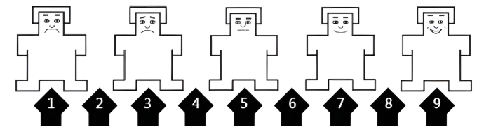

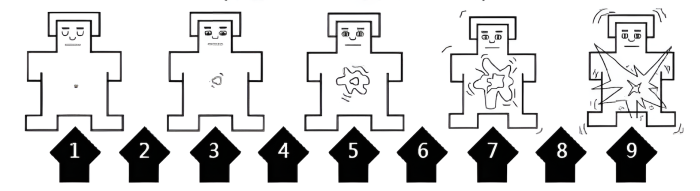

#### 附  录

自我情绪评定

|  | 请对您前一段音乐下（或无音乐）驾驶时的情绪体验进行评分 |  |
|---|---|---|
|  | 愉悦度，从 1 到 9 代表“非常不愉快”到“非常愉快”。 |  |
|  | 唤醒度，从 1 到 9 代表“非常平静”到“非常兴奋”。 |  |
| 认知 | 负荷量表 |  |
|  | 接下来请您根据自己完成前一段驾驶任务的感受进行评分[输入0 到2 | 0 的数 |
| 字] * |  |  |
|  |  | 1-20 |
| 脑力 | 需求---本次驾驶任务的脑力消耗如何？ |  |
|  |  | _______ |
| 身体 | 负担---本次驾驶任务的体力消耗如何？ |  |
|  |  | _______ |
| 时间 | 需求---本次驾驶任务的进度让你感到匆忙吗？ |  |
|  |  | _______ |
| 任务 | 绩效---你在完成本次驾驶任务上做得有多成功？ |  |
|  |  | _______ |
| 努力 | 程度---为了在本次任务中达到你的目标，你需要付出多大的努力？ |  |
|  |  | _______ |
| 挫败 | 感---你有感觉到任何不安，气馁，压力，或烦恼吗？ |  |
|  |  | _______ |

<!-- ===== 原文 第 142 页 ===== -->

音乐流派对驾驶行为影响的多维分析：个人偏好与音乐元素的影响

<!-- ===== 原文 第 143 页 ===== -->

#### 致  谢

#### 致  谢

在我攻读学位期间，我有幸得到了许多人的帮助和支持。在此，我想向所 有给予我帮助和鼓励的人表示最诚挚的感谢。 首先，我要感谢我的导师葛燕副研究员，在过去的三年中，每当我遇到困 惑、迷茫或沮丧时，您总是耐心地解答我的疑问，指导我的方向，鼓励我一步 步前进。您的专业知识、耐心指导和宝贵建议使我受益匪浅。很感谢您包容我 的不足，您严谨的学术态度和温厚的待人之道是我今后不断学习的榜样。 我还要感谢瞿炜娜副研究员，感谢老师对我的研究进行的多次指导，给我 提供了很多建设性的建议，使我的研究更加详尽、合理。 对工程心理学实验室的全体老师，您们提供的友善环境和专业支持为我的 研究工作提供了极大的便利，我在此表示衷心的感谢。 我也要感谢在评审阶段给予我宝贵意见的评审老师们，是老师们的指导使 我的论文得以精进。 我也要感谢我的好朋友湛蕾、余振豪、徐心仪以及师姐滑慧敏、刘馨泽， 感谢你们一路同行，你们的陪伴让我的科研之旅充满温暖与乐趣。 最后，我还要感谢我的父母对我的支持和理解，你们的鼓励和爱是我不断 前进的动力。 于2024 年5 月

<!-- ===== 原文 第 144 页 ===== -->

音乐流派对驾驶行为影响的多维分析：个人偏好与音乐元素的影响

<!-- ===== 原文 第 145 页 ===== -->

作者简历及攻读学位期间发表的学术论文与其他相关学术成果 作者简历及攻读学位期间发表的学术论文与其他相关学术成果 2017 年09 月——2021 年06 月，在北京林业大学人文社会科学学院院（系）获 Zhou, Y., Cui, X., Qu, W., & Ge, Y. (2022). The effect of automation trust tendency, system reliability and feedback on users’ phishing detection. Applied Ergonomics Zhou, Y., Qu, W., & Ge, Y. (2022). The role of trait emotional intelligence in driving anger: The mediating effect of emotion regulation. Transportation research part Zhou, Y., Tang, L., Huang, J., Xiang, Y., & Ge, Y. (2023). How the Position Distribu tion of HUD Information Influences the Driver’s Recognition Performance in Dif ferent Scenes. D. Harris & W.-C. Li, Engineering Psychology and Cognitive Erg onomics (383–395). Springer Nature Switzerland. https://doi.org/10.1007/978-3- Li, J., Zhou, Y., Ge, Y., & Qu, W. (2023). Sensation seeking predicts risky driving behavior: The mediating role of difficulties in emotion regulation. Risk analysis, 43(9), 1871-1886.

| 作者简历： |  |  |  |
|---|---|---|---|
| 2017 年 09 月——2021 年 06 月，在北京 | 林业大学人 | 文社会科学学 | 院院（系 |
| 得学士学位。 |  |  |  |
| 2021 年09 月——2024 年06 月，在中国科 | 学院心理 | 研究所攻读硕士 | 学位。 |
| 工作经历： |  |  |  |
| 2023 年 03 月，在中国科学院大学获得“ | 研究生特等 | 奖学金”。 |  |
| 2022 年 07 月，在中国科学院大学获得“ | 三好学生” | 。 |  |
| 2022 年 03 月，在中国科学院大学获得“ | 研究生二等 | 奖学金”。 |  |
| 已发表（或正式接受）的学术论文： |  |  |  |
| Zhou, Y., Cui, X., Qu, W., & Ge, Y. (2022). | The effect | of automation tr | ust tende |
| system reliability and feedback on users | ’ phishing d | etection. Applie | d Ergono |
| , 102, 103754. |  |  |  |
| Zhou, Y., Qu, W., & Ge, Y. (2022). The role | of trait em | otional intellige | nce in driv |
| anger: The mediating effect of emotion | regulation. | Transportation | research |
| F: traffic psychology and behaviour, 88 | , 281-290. |  |  |
| Zhou, Y., Tang, L., Huang, J., Xiang, Y., & | Ge, Y. (202 | 3). How the Po | sition Dis |
| tion of HUD Information Influences the | Driver’s R | ecognition Perfo | rmance in |
| ferent Scenes. D. Harris & W.-C. Li, En | gineering | Psychology and | Cognitive |
| onomics (383–395). Springer Nature S | witzerland. | https://doi.org/1 | 0.1007/97 |
| 031-35392-5 30 |  |  |  |
| _ |  |  |  |
| Li, J., Zhou, Y., Ge, Y., & Qu, W. (2023). | Sensation | seeking predicts | risky dri |
| behavior: The mediating role of difficul | ties in emo | tion regulation. | Risk anal |

<!-- ===== 原文 第 146 页 ===== -->

音乐流派对驾驶行为影响的多维分析：个人偏好与音乐元素的影响
